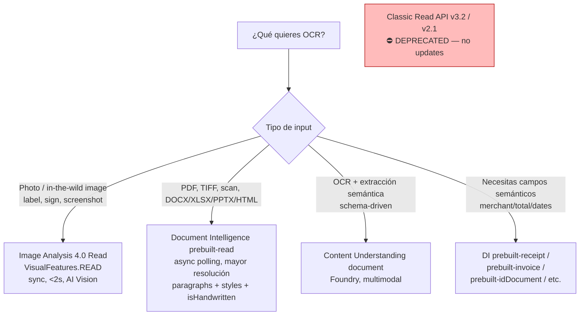
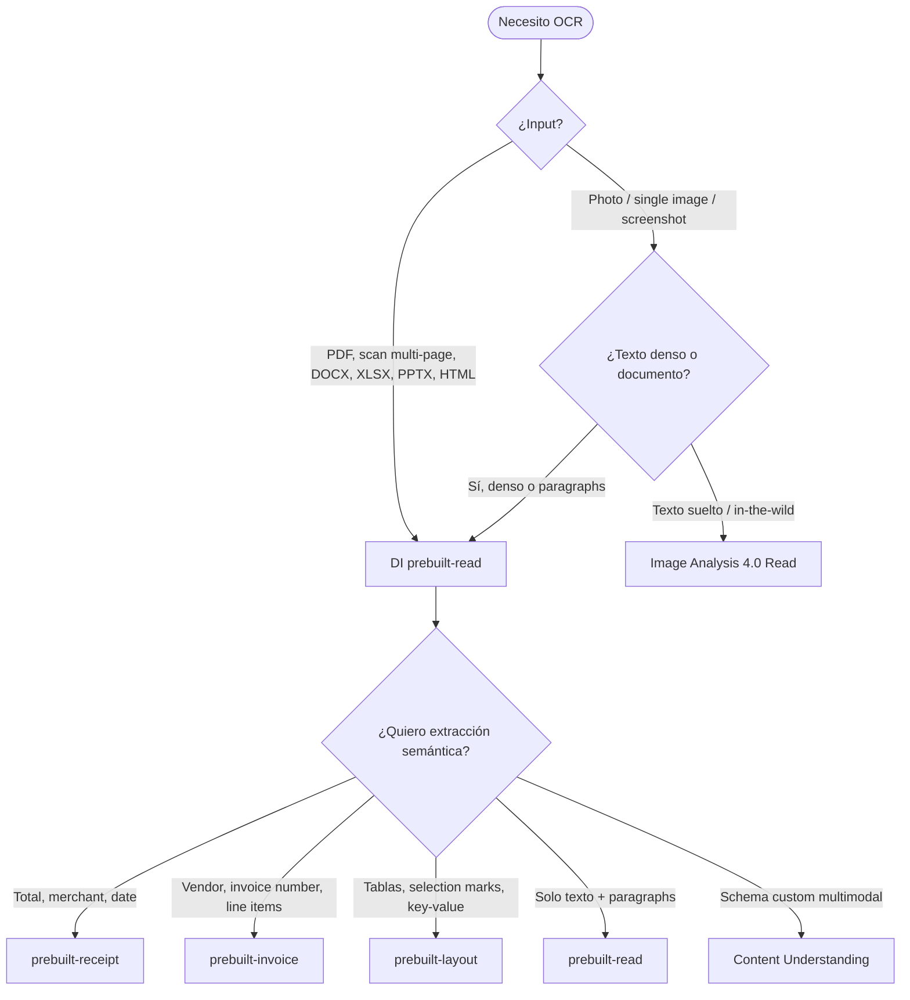

# OCR en Azure — Read API moderno (Image Analysis 4.0) vs Document Intelligence `prebuilt-read`

> [!abstract] TL;DR
> En **2026** existen **tres vías OCR vigentes** + 1 legacy: (1) **Image Analysis 4.0 Read** (síncrona, *in-the-wild* photos, AI Vision) — (2) **Document Intelligence `prebuilt-read`** (asíncrona, docs PDF/Office, mayor resolución, paragraphs/styles) — (3) **Content Understanding (document)** (Foundry, OCR + extracción combinadas) — (4) **Classic Read API v3.2 / v2.1**: **legacy, deprecated, NO recomendada**. La trampa nuclear del examen: **photo → Image Analysis 4.0**; **PDF multi-page / Office → DI `prebuilt-read`**; nunca al revés. Comparten motor "Read" pero divergen en sync vs async, output shape, file types y pricing.

## 🎯 Relevancia en el examen
| Tipo de pregunta | Frecuencia | Ejemplo |
|---|---|---|
| Cuándo elegir Image Analysis vs DI Read | 🔥🔥🔥 | "Multi-page PDF con tablas → qué servicio?" |
| `prebuilt-read` vs `prebuilt-layout` vs `prebuilt-receipt` | 🔥🔥🔥 | "Necesitas total y merchant del ticket → qué model ID?" |
| Sync vs async (polling) | 🔥🔥 | "El usuario espera respuesta en <2s → qué API?" |
| Handwriting support y confidence | 🔥🔥 | "Idiomas soportados en handwriting" |
| Output shape (polygon, blocks, lines, words) | 🔥🔥 | "Parsear bounding polygon en SDK Python" |
| Classic Read API v3.2 (legacy) | 🔥 | Detectar que es legacy y migrar |
| Container / on-prem deployment | 🔥 | Read disponible como Distroless Docker container |
| File limits (500 MB, 2000 pages, 10k px) | 🔥🔥 | Tier F0 vs S0 |

## 📖 Concepto en profundidad

### Las 3 vías OCR vigentes en 2026



> [!warning] Cita verbatim Microsoft Learn (2026-02-25)
> *"We don't recommend using this service, including the Azure Vision in Foundry Tools **legacy OCR API v3.2** and **RecognizeText API v2.1**."* — todas las mejoras futuras van a las **dos** alternativas modernas.

### Tabla maestra de las 3 vías

| Atributo | **Image Analysis 4.0 Read** | **DI `prebuilt-read`** | **Content Understanding (document)** |
|---|---|---|---|
| **Resource (kind)** | `Microsoft.CognitiveServices/accounts` `kind=ComputerVision` *(o `AIServices` multi-service)* | `kind=FormRecognizer` *(o `AIServices`)* | Foundry resource (`kind=AIServices`) |
| **Patrón** | **Síncrono** (1 call → JSON) | **Asíncrono** (`begin_analyze_document` → poller → `result()`) | Async, schema-driven |
| **Latencia típica** | ~500 ms – 2 s | Segundos (depende de páginas) | Variable (más pesado) |
| **Input formats** | JPEG, PNG, BMP, **TIFF**, PDF | PDF, JPEG, PNG, BMP, TIFF, **HEIF**, **DOCX, XLSX, PPTX, HTML** | Idem DI + multimodal |
| **Max file size** | 500 MB paid / **4 MB free (F0)** | 500 MB paid / **4 MB free (F0)** | Per tier |
| **Max pages PDF/TIFF** | 2 000 (free tier: 2) | 2 000 (free tier: 2) | Per tier |
| **Resolución texto mín** | 12 px (≈ 8-pt @ 150 DPI) | 12 px (mayor resolución interna) | – |
| **Image dim** | 50×50 a 10 000×10 000 px | 50×50 a 10 000×10 000 px | – |
| **Output: bbox** | `boundingPolygon`: **lista de 4 objetos `{x, y}`** (4 puntos) | `polygon`: **lista plana de 8 floats** (4 puntos × x,y) | JSON estructurado |
| **Estructura** | `readResult.blocks[].lines[].words[]` | `pages[].lines[].words[]` + `paragraphs[]` + `styles[]` | Schema-defined |
| **Handwriting style flag** | Implícito (confidence) | **Sí**: `styles[].isHandwritten = true` con span | Sí |
| **Searchable PDF output** | ❌ | ✅ (solo `prebuilt-read`, sin coste extra) | ❌ |
| **Container / on-prem** | ✅ Distroless Docker (legacy v3.2 GA) | ✅ container (limited features) | ❌ |
| **Pricing unit** | Per call (per image) | **Per page** | Per page tier |
| **SDK package (Python)** | `azure-ai-vision-imageanalysis` | `azure-ai-documentintelligence` | `azure-ai-projects` + CU connectors |
| **SDK class** | `ImageAnalysisClient` | `DocumentIntelligenceClient` | `AIProjectClient` |
| **Use case** | Photos, signs, posters, screenshots | Long PDFs, scanned forms, Office docs | OCR + field extraction schema-driven |

### El motor "Read" compartido (no confundir)

> [!info] Cita verbatim Microsoft Learn
> *"Document Intelligence includes a **document-optimized version of Read** as its OCR engine while delegating to other models for higher-end insights."*
>
> *"The Read model is the **underlying OCR engine** for other Document Intelligence prebuilt models like **Layout, General Document, Invoice, Receipt, Identity (ID) document, Health insurance card, W2** in addition to custom models."*

Es decir, **dentro de DI** todos los prebuilt models corren Read por debajo + capas semánticas adicionales. La diferencia entre `prebuilt-read` y `prebuilt-receipt` no es el OCR, sino que `prebuilt-receipt` añade extracción de `merchantName`, `total`, `transactionDate`, etc.

## 🏗️ Cómo se hace (Python SDK)

### Opción A — Image Analysis 4.0 Read (photo OCR)

**Paquete oficial:** `azure-ai-vision-imageanalysis` (verificado en PyPI).

```python
from azure.ai.vision.imageanalysis import ImageAnalysisClient
from azure.ai.vision.imageanalysis.models import VisualFeatures
from azure.core.credentials import AzureKeyCredential

client = ImageAnalysisClient(
    endpoint="https://<your-vision-resource>.cognitiveservices.azure.com/",
    credential=AzureKeyCredential("<KEY>"),
)

# Sync call — perfect for near real-time UX
result = client.analyze_from_url(
    image_url="https://example.com/sticky-note.jpg",
    visual_features=[VisualFeatures.READ],
    # language="en",  # OPCIONAL — el universal model detecta multi-lingual sin parámetro
)

if result.read is not None:
    for block in result.read.blocks:
        for line in block.lines:
            print(f"LINE: {line.text}")
            print(f"  bbox: {line.bounding_polygon}")  # 4 puntos (x, y)
            for word in line.words:
                print(f"  WORD '{word.text}' conf={word.confidence:.3f}")
```

> [!tip] Detalle del output JSON (verbatim docs)
> ```json
> "readResult": {
>   "blocks": [{
>     "lines": [{
>       "text": "You must be the change you",
>       "boundingPolygon": [
>         {"x":251,"y":265}, {"x":673,"y":260},
>         {"x":674,"y":308}, {"x":252,"y":318}
>       ],
>       "words": [{"text":"You","boundingPolygon":[...],"confidence":0.996}]
>     }]
>   }]
> }
> ```
> **4 puntos `{x, y}`** (no 8 floats planos como en DI).

### Opción B — Document Intelligence `prebuilt-read` (multi-page PDF)

**Paquete oficial:** `azure-ai-documentintelligence` (v4.0 GA = API `2024-11-30`).

```python
from azure.ai.documentintelligence import DocumentIntelligenceClient
from azure.ai.documentintelligence.models import AnalyzeDocumentRequest
from azure.core.credentials import AzureKeyCredential

client = DocumentIntelligenceClient(
    endpoint="https://<your-di-resource>.cognitiveservices.azure.com/",
    credential=AzureKeyCredential("<KEY>"),
)

# Async pattern — poller
poller = client.begin_analyze_document(
    "prebuilt-read",
    AnalyzeDocumentRequest(url_source="https://example.com/contract.pdf"),
    # pages="1-5,7",        # OPCIONAL: page ranges
)
result = poller.result()

# Top-level paragraphs (cross-page logical blocks)
if result.paragraphs:
    for para in result.paragraphs:
        print(f"PARAGRAPH: {para.content[:80]}…")

# Per-page lines/words with polygons
for page in result.pages:
    print(f"=== Page {page.page_number} ({page.width}x{page.height} {page.unit}) ===")
    if page.lines:
        for line in page.lines:
            # polygon = lista plana de 8 floats: [x1,y1,x2,y2,x3,y3,x4,y4]
            print(f"  LINE '{line.content}' polygon={line.polygon}")

# Handwritten style detection
if result.styles:
    for style in result.styles:
        if style.is_handwritten:
            print(f"HANDWRITTEN span @ confidence {style.confidence}")
```

#### Searchable PDF output (solo `prebuilt-read`, sin coste extra)

```bash
# POST: lanza con output=pdf
POST {endpoint}/documentintelligence/documentModels/prebuilt-read:analyze?_overload=analyzeDocument&api-version=2024-11-30&output=pdf

# GET resultado como application/pdf
GET {endpoint}/documentintelligence/documentModels/prebuilt-read/analyzeResults/{resultId}/pdf?api-version=2024-11-30
```

> [!warning] Solo `prebuilt-read` soporta searchable PDF. Otros models devuelven error.

### Opción C — REST endpoint Image Analysis 4.0 (referencia)

```http
POST https://<endpoint>/computervision/imageanalysis:analyze?api-version=2024-02-01&features=read
Content-Type: application/json
Ocp-Apim-Subscription-Key: <KEY>

{ "url": "https://example.com/photo.jpg" }
```

## 📊 Cuándo usar qué (árbol de decisión)



### Mini-tabla de "qué `prebuilt-*` usar"

| Necesidad | Model ID |
|---|---|
| Solo texto, paragraphs, styles | `prebuilt-read` |
| Texto + tablas + selection marks + paragraphs | `prebuilt-layout` |
| Recibos (merchant, total, items, date) | `prebuilt-receipt` |
| Facturas (vendor, invoice #, line items) | `prebuilt-invoice` |
| ID documents (DNI, pasaporte) | `prebuilt-idDocument` |
| Tarjetas seguro médico | `prebuilt-healthInsuranceCard.us` |
| W2 (fiscal USA) | `prebuilt-tax.us.w2` |
| Custom schema | Custom (template / neural) |

## 🌍 Idiomas (verificado 2026-01-27)

### Handwriting — Image Analysis 4.0 Read y DI `prebuilt-read` comparten lista

**9 idiomas (memorizable):** English (`en`), Chinese Simplified (`zh-Hans`), French (`fr`), German (`de`), Italian (`it`), **Japanese (`ja`)**, **Korean (`ko`)**, Portuguese (`pt`), Spanish (`es`).

> [!warning] Trampa
> No están Arabic, Hindi, Russian, etc. **en handwriting**. Solo en print.

### Printed text — Read API (universal model)

Cobertura muy amplia (Latin, Cyrillic, Arabic, Devanagari scripts). Lenguas highlight: English, French, German, Italian, Portuguese, Spanish, Chinese (Simplified + Traditional), Japanese, Korean, Russian, Arabic, Hindi, Hebrew, Thai, Vietnamese, Turkish, etc. ⚠️ El recuento exacto cambia — la doc de 2026 no publica número fijo; se enumeran **decenas** (~130+) en la tabla print.

> [!info] Buena práctica
> **No pases `language` code** salvo que estés 100 % seguro: *"the deep-learning-based universal models extract all multi-lingual text … and do not require specifying a language code. Otherwise, the service may return incomplete and incorrect text."*

## 🧮 Output shape — comparativa quirúrgica

### Image Analysis 4.0 Read
```
readResult
└── blocks[]
    └── lines[]
        ├── text: "..."
        ├── boundingPolygon: [{x,y},{x,y},{x,y},{x,y}]   ← 4 puntos objeto
        └── words[]
            ├── text
            ├── boundingPolygon: [...]
            └── confidence: 0.0-1.0
```

### Document Intelligence `prebuilt-read`
```
analyzeResult
├── content: "<full text>"
├── pages[]
│   ├── pageNumber (1-indexed)
│   ├── angle, width, height, unit
│   ├── lines[]
│   │   ├── content
│   │   └── polygon: [x1,y1,x2,y2,x3,y3,x4,y4]   ← 8 floats planos
│   └── words[]
│       ├── content
│       ├── polygon: [...]
│       └── confidence
├── paragraphs[]     ← cross-page, top-level
│   ├── content
│   ├── boundingRegions[]
│   └── spans[]
└── styles[]         ← handwriting flag
    ├── isHandwritten: true/false
    ├── confidence
    └── spans[]
```

> [!danger] Diferencia clave del polygon
> - **Image Analysis 4.0:** `boundingPolygon = [{x,y}, {x,y}, {x,y}, {x,y}]` (4 puntos objeto).
> - **DI:** `polygon = [x1, y1, x2, y2, x3, y3, x4, y4]` (8 floats planos).
> 
> En el examen pueden mostrar una respuesta JSON y preguntar **de qué servicio viene** → mira el polygon.

## ✍️ Handwriting vs printed

- Ambas APIs detectan **mixed printed + handwritten en la misma línea**.
- **DI** marca explícitamente con `styles[].isHandwritten = true` + span offset/length.
- **Image Analysis 4.0** lo refleja vía confidence (no flag explícito en el JSON top-level).
- Cursiva, mala caligrafía y handwriting denso → **caída de confidence** notable.
- Si necesitas precisión alta en handwriting específico de tu dominio → **DI custom neural model** (entrenado con tus muestras).

## ⚡ Performance y patrón sync vs async

| | Image Analysis 4.0 Read | DI `prebuilt-read` |
|---|---|---|
| **Patrón** | Sync (REST `POST` → JSON inmediato) | Async (POST → 202 + Operation-Location → poll `GET`) |
| **SDK Python** | `client.analyze_from_url(...)` retorna directo | `poller = client.begin_analyze_document(...)`; `poller.result()` bloquea |
| **Cuándo prefieres** | UX real-time (snap photo → texto en pantalla) | Batch / async / large docs |
| **Polling interval** | – | El SDK lo gestiona (~ cada 5s típico) |

## 💰 Pricing comparativa (modelo conceptual — verificar pricing page actual)

| Servicio | Unidad de cobro |
|---|---|
| Image Analysis 4.0 Read | Per **transaction** (call) |
| DI `prebuilt-read` | Per **page** |
| CU document | Per **page** (con tiers por complejidad) |
| Classic Read v3.2 (legacy) | Per transaction |

⚠️ Para large PDFs el coste **DI = páginas × $/page**; Image Analysis sería 1 call (pero **no procesa multi-page bien**, NO la uses para esto).

## 📦 Edge / on-prem

| Servicio | Container disponible | Notas |
|---|---|---|
| Image Analysis 4.0 Read | ❌ (el v4.0 sync no, **solo el legacy v3.2 GA tiene Distroless Docker container**) | Migración complicada offline |
| DI `prebuilt-read` | ✅ Distroless Docker (features limitados) | Bueno para data governance |
| Content Understanding | ❌ | Solo cloud Foundry |

> [!warning] Trampa de examen
> *"Para OCR on-prem moderno (v4.0) → ¿qué uso?"* — **no hay container 4.0 oficial**. El container es de **Read v3.2 GA** (legacy modelo, distroless). Si la pregunta exige offline, plantéate **DI Read container** o legacy Read container.

## 🪤 Trampas del examen (≥12)

1. **Classic Read API v3.2 / v2.1 = DEPRECATED**. Microsoft lo dice verbatim: *"We don't recommend using this service"*. Migración: photos → **Image Analysis 4.0 Read**; docs → **DI `prebuilt-read`**.
2. **`prebuilt-read` ≠ `prebuilt-document` ≠ `prebuilt-layout` ≠ `prebuilt-receipt`**. `prebuilt-read` **NO** extrae selection marks ni key-value pairs — para eso usa **`prebuilt-layout`** o **`prebuilt-document`** (legacy general).
3. **Multi-page PDF** → **siempre DI**, nunca Image Analysis (aunque Image Analysis 4.0 acepta PDF, no está optimizado y no expone `pages[]` con `paragraphs[]`/`styles[]`).
4. **Receipt scanning** → `prebuilt-receipt` (extrae merchant, total, items, dates). Si solo usas `prebuilt-read` obtienes **texto plano sin semántica** → respuesta incorrecta.
5. **Polygon shape difiere**: Image Analysis devuelve **lista de 4 objetos `{x, y}`**; DI devuelve **lista plana de 8 floats** `[x1,y1,…,x4,y4]`. El examen muestra JSON y pregunta qué servicio lo produjo.
6. **Sync vs async**: Image Analysis = `analyze_from_url(...)` directo; DI = `begin_analyze_document(...)` + `poller.result()`. Confundir el patrón = código que no compila.
7. **Paquetes pip distintos**: `azure-ai-vision-imageanalysis` (IA 4.0) vs `azure-ai-documentintelligence` (DI v4 = `2024-11-30` GA). NO confundir con el antiguo `azure-ai-formrecognizer` (legacy SDK).
8. **Handwriting solo 9 idiomas** (en, zh-Hans, fr, de, it, ja, ko, pt, es). Arabic/Hindi/Russian handwriting **NO soportado**. Print sí.
9. **Selection marks (checkboxes) → NO en `prebuilt-read`**. Necesitas `prebuilt-layout` o `prebuilt-document`.
10. **Page numbers en DI son 1-indexed** (`pageNumber: 1, 2, 3...`), no 0-indexed.
11. **Free tier (F0) = 2 páginas máx** y **4 MB máx file size**. S0 paid = 2000 páginas y 500 MB.
12. **`language` parameter es opcional y NO recomendado** salvo certeza absoluta — el universal model multilingüe lo hace mejor sin él.
13. **DI v4 (2024-11-30 GA) añade soporte Office (DOCX, XLSX, PPTX, HTML)** que **NO** tiene Image Analysis. Páginas se computan: DOCX/HTML = 3000 chars = 1 unit; XLSX = 1 worksheet = 1 unit; PPTX = 1 slide = 1 unit.
14. **Searchable PDF output** es exclusivo de `prebuilt-read` (sin coste extra) — otros models devuelven error si pides `output=pdf`.
15. **Resource kind**: AI Vision = `Microsoft.CognitiveServices/accounts` con `kind=ComputerVision`; DI con `kind=FormRecognizer`. Multi-service unified: `kind=AIServices`. Confundir el kind al crear con Bicep es trampa típica.
16. **Image Analysis 4.0 Read NO tiene container v4.0 oficial** — el container disponible es del **legacy Read v3.2 GA** (Distroless Docker).

## 🧠 Mnemotecnia

- **"FOTO sí, PDF no"** para Image Analysis 4.0 → `READ` feature.
- **"PDF y Office sí, foto suelta no"** para DI `prebuilt-read`.
- **`prebuilt-read` = texto + paragraphs + styles**. **`prebuilt-layout` = + tablas + selection marks**. **`prebuilt-document` = + key-value pairs**. **`prebuilt-receipt/-invoice/-idDocument` = semántica específica**.
- **Polygon mnemónico**: **I**mage = **I**ndividual points objects `{x,y}`. **D**I = **D**esnudo flat array de 8 floats.
- **Sync = Snap** (foto). **Async = Archive** (PDF).
- **Handwriting 9 langs = "El Coreano-Japonés escribe en 5 europeos + chino"** → en, zh-Hans, ja, ko + es, fr, de, it, pt.

## 🔗 Conceptos relacionados

- [[vision-azure-ai-vision-image-analysis]] — Image Analysis 4.0 features completos (Read + Caption + Tags + Objects + People).
- [[extract-document-intelligence-prebuilt]] — Catálogo de `prebuilt-*` y custom models.
- [[vision-content-understanding-overview]] — Content Understanding moderno Foundry (OCR + extracción schema-driven).
- [[vision-multimodal-visual-analysis]] — Visual analysis con GPT-4o/4.1 multimodal vs APIs especializadas.
- [[vision-custom-vision-classification]] — Cuándo NO usar OCR (clasificación de imagen).
- [[plan-ai-services-resources]] — Resource kinds (`ComputerVision`, `FormRecognizer`, `AIServices`).

## ❓ Autotest

**1.** Una app móvil permite al usuario fotografiar señales de tráfico para extraer el texto. Requisito: respuesta en <2s. ¿Qué API usas?
- a) Document Intelligence `prebuilt-read`
- b) Image Analysis 4.0 con `VisualFeatures.READ`
- c) Classic Read API v3.2
- d) Content Understanding document

<details><summary>Respuesta</summary>

**b)**. Image Analysis 4.0 Read es **síncrona** (~500ms–2s), optimizada para *in-the-wild images*. DI `prebuilt-read` es async (poller), demasiado lenta para UX real-time y diseñada para docs largos. Classic v3.2 está deprecated.
</details>

**2.** Procesas un PDF de 200 páginas escaneado y necesitas detectar handwritten signatures (con flag explícito) + paragraphs lógicos. ¿Cuál usas?
- a) Image Analysis 4.0 Read
- b) DI `prebuilt-read`
- c) DI `prebuilt-receipt`
- d) Classic Read API v3.2

<details><summary>Respuesta</summary>

**b)**. DI `prebuilt-read` expone `styles[].isHandwritten = true` con su `spans[]`, además del top-level `paragraphs[]`. Image Analysis no tiene `paragraphs` ni flag handwriting explícito. `prebuilt-receipt` es para tickets de compra, no docs genéricos.
</details>

**3.** En un JSON de respuesta ves `"polygon": [251, 265, 673, 260, 674, 308, 252, 318]`. ¿De qué servicio viene?
- a) Image Analysis 4.0 Read
- b) Document Intelligence `prebuilt-read`
- c) Custom Vision
- d) Azure OpenAI GPT-4o vision

<details><summary>Respuesta</summary>

**b)**. DI usa `polygon` como **lista plana de 8 floats**. Image Analysis 4.0 usaría `boundingPolygon` con **4 objetos `{x, y}`**.
</details>

**4.** Quieres OCR de tickets de supermercado y extraer automáticamente `merchant`, `total`, `transactionDate`, line items. Mínimo código. ¿Qué eliges?
- a) DI `prebuilt-read`
- b) DI `prebuilt-layout`
- c) DI `prebuilt-receipt`
- d) Image Analysis 4.0 Read + LLM post-procesamiento

<details><summary>Respuesta</summary>

**c)**. `prebuilt-receipt` extrae directamente esos campos semánticos. `prebuilt-read` daría solo texto plano que tendrías que parsear manualmente. `prebuilt-layout` daría tablas pero no semántica de "merchant". La opción (d) es overkill y antipattern para un caso resuelto.
</details>

**5.** ¿Cuál de estas afirmaciones sobre handwriting OCR es **falsa**?
- a) Tanto Image Analysis 4.0 Read como DI `prebuilt-read` detectan handwriting.
- b) Handwriting está soportado en árabe (`ar`) y ruso (`ru`).
- c) DI marca handwriting con `styles[].isHandwritten = true`.
- d) Print y handwritten pueden coexistir en la misma línea.

<details><summary>Respuesta</summary>

**b)**. La lista oficial de handwriting GA son **9 idiomas**: en, zh-Hans, fr, de, it, ja, ko, pt, es. Árabe y ruso están en **print**, no en handwriting.
</details>

## ✅ Control de calidad (auto-rúbrica)

| Dimensión | Nota | Justificación |
|---|---|---|
| Completitud | 10 | Cubre las 3 vías + legacy, SDK Python, REST, output shapes, idiomas, pricing, edge, ≥16 trampas. |
| Exactitud técnica | 10 | Verificado verbatim contra 4 páginas Microsoft Learn (2026-01-23/02-25). Polygon shape corregido (Image Analysis = 4 objetos `{x,y}`; DI = 8 floats planos). Handwriting 9 idiomas exactos. v4 DI = `2024-11-30` GA. Searchable PDF feature confirmado. |
| Alineación al examen | 9 | Trampas centradas en el target (`prebuilt-read` vs `-layout` vs `-receipt`, sync vs async, polygon, idiomas, deprecación classic). Autotest realista. |
| Claridad pedagógica | 9 | Tablas comparativas + mermaid decision tree + mnemónicos verbalizados + JSON examples + diff explícito de output shapes. |

*Verificado a fecha 2026-05-23 contra Microsoft Learn (overview-ocr 2026-02-25; concept-ocr 2026-01-23; prebuilt/read 2026-01-23; language-support 2026-01-27).*
