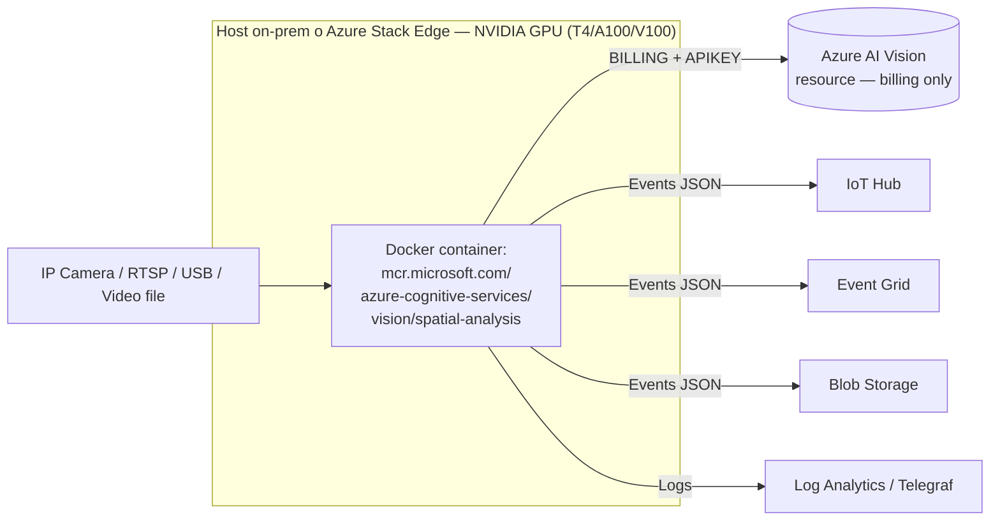
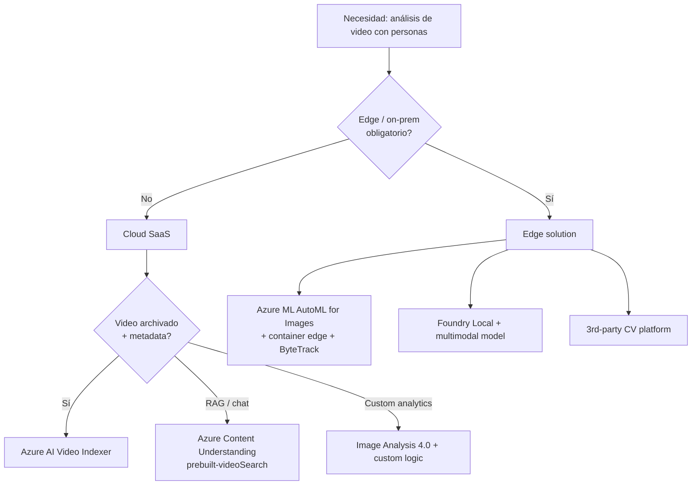

# Azure AI Vision — Spatial Analysis (RETIRED · AI-102 carryover)

> [!danger] ⚠️ SERVICIO RETIRADO — 30 marzo 2025
> **Quote oficial (Microsoft Learn / deprecation notice):** *"On 30 March 2025, Azure Vision Spatial Analysis was retired. The Spatial Analysis container is no longer supported and will not process new video streams."*
>
> Microsoft recomienda migrar a **Azure AI Video Indexer** o a soluciones open-source. Para análisis de video con LLM multimodal, la pieza moderna es **Azure Content Understanding** (`prebuilt-videoAnalysis` / `prebuilt-videoSearch`).
>
> En **AI-103** este tema aparece exclusivamente como **carryover histórico**: el examen puede plantearlo como pregunta de **migración** o **identificación del servicio correcto entre alternativas modernas**, pero NO como diseño activo de soluciones nuevas.

> [!abstract] TL;DR
> **Spatial Analysis** fue el servicio de Azure AI Vision para **detectar personas y patrones de movimiento en streams de video** (RTSP/USB/file). Se desplegaba como **container Docker** en **host con GPU NVIDIA** (edge u on-prem), nunca como API managed cloud. Sus **operations** clave eran `cognitiveservices.vision.spatialanalysis.personcount`, `personcrossingline`, `personcrossingpolygon` y `persondistance`. La configuración (zones polígonos + lines) iba en JSON, y los eventos salían a **IoT Hub / Event Grid / blob**. Murió el **30-mar-2025**; reemplazo moderno = **Video Indexer** + **Content Understanding** + **Image Analysis 4.0** + **Azure ML AutoML for Images**.

## 🎯 Relevancia en el examen

| Tipo de pregunta | Escenario típico | Frecuencia |
|---|---|---|
| Identificar Spatial Analysis como **legacy/retired** | "¿Qué servicio se eligió antes para contar personas en una tienda con cámara local? Hoy, ¿cuál usarías?" | 🔥🔥🔥 |
| Container-based deployment vs managed API | Confundir con un endpoint Azure cloud | 🔥🔥🔥 |
| Hardware requirements (GPU NVIDIA) | Distinguir de servicios CPU-only | 🔥🔥 |
| Operations exactas (personcount, crossingline) | Memorizar los 4 nombres canónicos | 🔥🔥 |
| RAI: NOT para surveillance + atributos retirados | Pregunta de Responsible AI | 🔥🔥 |
| Migration path correcto | Spatial Analysis → Video Indexer / Content Understanding | 🔥🔥🔥 |

## 📖 Concepto en profundidad

### ¿Qué fue Spatial Analysis?

Una **capability de Azure AI Vision (antiguo Computer Vision)** orientada exclusivamente a **video en tiempo real** que:

1. **Detectaba personas** en frames de un stream.
2. **Trackeaba su movimiento** a lo largo del tiempo (no solo deteción por frame aislado).
3. **Aplicaba operations** lógicas: contar, cruzar línea, entrar/salir de polígono, medir distancia.
4. **Emitía events JSON** anonimizados hacia sinks externos (IoT Hub, Event Grid, blob).
5. **Corría 100 % on-prem** o **en edge** (NUNCA fue un endpoint managed Azure cloud — esto es la trampa principal).

### Modelo de deployment: container + GPU



> [!info] Punto clave
> La cuenta **Azure AI Vision** en Azure servía **solo para facturación y licencia** (env vars `BILLING` + `APIKEY` + `EULA=accept`). **El procesamiento de píxeles ocurría 100 % en el host con GPU del cliente** — los frames de video nunca salían del edge.

### Operations canónicas (memorizar nombres)

Todas con prefijo `cognitiveservices.vision.spatialanalysis.`:

| Operation | Función | Output principal |
|---|---|---|
| `personcount` | Contar personas dentro de una **zone** (polígono) en cada instante | `zone_id`, `person_count`, `timestamp` |
| `personcrossingline` | Detectar cuándo una persona **cruza una línea** | `line_id`, `direction` (entry/exit), `timestamp` |
| `personcrossingpolygon` | Detectar entrada/salida de un **polígono** (zone) — más rico que línea | `zone_id`, `event` (enter/exit), `dwell_time` |
| `persondistance` | Distancia mínima entre personas (social distancing) | `pair_distances`, violations |

> [!warning] Variantes extendidas
> Existieron versiones extendidas con flags adicionales: `enable_orientation` (dirección de mirada/cuerpo) y `enable_speed` (velocidad de movimiento) en `personcrossingline` y `personcrossingpolygon`. Útil para distinguir caminantes de corredores en safety zones.

### Anatomía de la configuración

La configuración se montaba como volumen Docker en `/etc/spatial-analysis` y declaraba **zones** (polígonos en coordenadas normalizadas 0-1) + **lines** (pares de puntos) + **operations** que se aplicaban sobre esas zones/lines:

```json
{
  "operations": [
    {
      "operationId": "checkout-counter-count",
      "operation": "cognitiveservices.vision.spatialanalysis.personcount",
      "parameters": {
        "VIDEO_URL": "rtsp://camera1.local/stream1",
        "VIDEO_SOURCE_ID": "checkout-cam-01",
        "VIDEO_IS_LIVE": true,
        "DETECTOR_NODE_CONFIG": "{\"gpu_index\": 0}",
        "SPACEANALYTICS_CONFIG": "{\"zones\": [{\"name\":\"queue\",\"polygon\":[[0.1,0.1],[0.9,0.1],[0.9,0.9],[0.1,0.9]],\"events\":[{\"type\":\"count\",\"config\":{\"trigger\":\"event\",\"threshold\":16.0,\"focus\":\"footprint\"}}]}]}"
      }
    }
  ]
}
```

> [!info] Polygon focus
> El parámetro `focus` admite `footprint` (pisada de la persona) o `center` (centro del bounding box). Footprint es más preciso para crowd analytics.

## 🏗️ Cómo se hacía (histórico — solo para identificarlo en preguntas)

### 1. Crear el recurso Azure AI Vision (billing only)

```bash
# Histórico — el kind era ComputerVision (pre-rebranding a AI Vision / Foundry)
az cognitiveservices account create \
  --name <vision-resource> \
  --resource-group <rg> \
  --kind ComputerVision \
  --sku S1 \
  --location <region>
```

> [!warning] ⚠️ S1 obligatorio
> Spatial Analysis **NO funcionaba con F0 (free)**. Requería SKU **S1** standard.

### 2. Pull + run del container en host GPU

```bash
# Pull container
docker pull mcr.microsoft.com/azure-cognitive-services/vision/spatial-analysis:latest

# Run con licencia + config + GPU
docker run --gpus all \
  -v /your/config:/etc/spatial-analysis \
  -e BILLING="https://<vision-resource>.cognitiveservices.azure.com/" \
  -e APIKEY=<key> \
  -e EULA=accept \
  --name spatial-analysis \
  mcr.microsoft.com/azure-cognitive-services/vision/spatial-analysis:latest
```

**Env vars obligatorias** (sin ellas el container abortaba al arranque):
- `BILLING` — endpoint del recurso Azure AI Vision.
- `APIKEY` — key1 o key2 del recurso.
- `EULA=accept` — aceptación de los terms.

### 3. Lectura de eventos

Patrón Python típico para consumir eventos desde IoT Hub egress:

```python
# Patrón legacy — solo para reconocer en preguntas de migración
from azure.eventhub import EventHubConsumerClient

CONNECTION_STR = "<iot-hub-built-in-eventhub-compatible-endpoint>"
EVENTHUB_NAME = "<name>"

def on_event(partition_context, event):
    payload = event.body_as_json()
    # Event típico Spatial Analysis:
    # {
    #   "events": [{
    #     "id": "...",
    #     "type": "personCountEvent",
    #     "detectionIds": ["..."],
    #     "properties": {"personCount": "3"},
    #     "zone": "queue",
    #     "trigger": "event"
    #   }],
    #   "sourceInfo": {"id":"checkout-cam-01", "timestamp":"2025-..."}
    # }
    print(f"Zone {payload['events'][0]['zone']} -> "
          f"count={payload['events'][0]['properties']['personCount']}")
    partition_context.update_checkpoint(event)

client = EventHubConsumerClient.from_connection_string(
    CONNECTION_STR, consumer_group="$Default", eventhub_name=EVENTHUB_NAME
)
with client:
    client.receive(on_event=on_event, starting_position="-1")
```

## 📊 Tablas comparativas / cuándo usar qué (HOY, 2026)

### Spatial Analysis vs alternativas modernas

| Necesidad | Spatial Analysis (retired) | Reemplazo moderno (2026) |
|---|---|---|
| **People counting en vivo, edge** | personcount op | [[vision-azure-video-indexer]] (cloud) + Image Analysis 4.0 + custom logic |
| **Line crossing / zona dwell** | personcrossingline / polygon | Custom detection + tracker (Azure ML AutoML for Images + ByteTrack/DeepSORT) o partner solution |
| **Video search / metadata / RAG** | ❌ no era su uso | **Azure Content Understanding** (`prebuilt-videoSearch`) |
| **Surveillance / safety alerts** | ❌ prohibido por RAI | Partner solutions con sus propios RAI controls |
| **Edge inference con LLM multimodal** | ❌ no existía | **Edge AI / Foundry Local** + modelos multimodales |
| **Social distancing** | persondistance op | Custom pipeline con object detection 4.0 |

> [!tip] Regla del examen
> Si una pregunta describe **"cámara local + contar personas + sin enviar video a la nube"** y aparece Spatial Analysis como opción, **probablemente la trampa es que está retirado**. La respuesta correcta hoy es **Azure ML custom model en edge** o **partner solution**.

### Decision tree post-retirement



## 🪤 Trampas del examen

1. **Container, no managed API.** Si una opción dice *"call the Spatial Analysis REST endpoint at `<region>.api.cognitive.microsoft.com`"* es **falsa** — Spatial Analysis nunca tuvo endpoint cloud público; el procesamiento era 100 % container.
2. **NVIDIA GPU obligatoria.** Trampa típica: opción que sugiere host **CPU-only** o **AMD GPU**. Microsoft solo soportaba NVIDIA T4 / V100 / A100 con drivers CUDA específicos.
3. **F0 NO sirve.** Requería SKU **S1**. La free tier de Computer Vision no habilitaba el container.
4. **Three env vars obligatorias.** `BILLING`, `APIKEY`, `EULA=accept`. Si falta cualquiera, el container no arranca. Trampa: opciones que omiten `EULA`.
5. **Person attributes (age, gender, emotion) deprecadas 2022.** Spatial Analysis nunca devolvió atributos personales en producción post-2022 (alineado con el RAI gating de Face). Si una opción afirma que retornaba `gender`, es trampa.
6. **NOT for surveillance.** El acceptable use de Microsoft prohíbe **explícitamente** usarlo para vigilancia. Pregunta RAI típica: *"Cliente quiere identificar individuos sospechosos en aeropuerto"* → respuesta = **rechazar** o usar Face con Limited Access (ver [[vision-face-service]]).
7. **Output anonimizado por default.** Solo emitía counts y eventos, **no identidades**. No confundir con [[vision-face-service]] que sí hace identification.
8. **Retirado 30-mar-2025.** Cualquier pregunta planteando un **diseño nuevo en 2026** con Spatial Analysis es trampa → la respuesta correcta involucra Video Indexer / Content Understanding / Azure ML.
9. **Reemplazo oficial Microsoft = Video Indexer**, no Image Analysis. Microsoft explícitamente redirige a Video Indexer en el deprecation notice — aunque la cobertura funcional no sea 100 % equivalente.
10. **Events sink es opcional.** El container puede correr sin IoT Hub configurado (solo logs locales). Trampa: opciones que dicen *"IoT Hub mandatory"*.
11. **No es lo mismo que Video Indexer.** Video Indexer = cloud, multi-modal (audio + visual + transcript), 1000+ objects. Spatial Analysis = edge, solo personas + vehicles, sin audio.
12. **`personcrossingpolygon` ≠ `personcount`.** Crossing detecta el **evento de cruce** (transición frontera), count reporta **estado continuo** dentro de zona. Pregunta clásica: *"alertar cuando alguien entra en zona restringida"* → `personcrossingpolygon` (event-driven), no count.
13. **Coordenadas normalizadas 0-1.** Polígonos y líneas se expresaban en `[0,1] × [0,1]`, NO en píxeles. Trampa común.
14. **No requiere connectivity continua para procesar.** Tras la licencia inicial, podía operar **disconnected** hasta cierto periodo (modelo connected container). Pregunta RAI/edge.

## 🧠 Mnemotecnia

- **"CPCD"** — los 4 ops canónicos: **C**ount, **P**ersonCrossingLine, **C**rossingPolygon (zone), **D**istance.
- **"BAE"** — env vars obligatorias: **B**ILLING, **A**PIKEY, **E**ULA.
- **"GED"** — requisitos del host: **G**PU NVIDIA, **E**dge/on-prem, **D**ocker.
- **"Retired-25"** — fecha clave a memorizar: **3**0-**3**-**2025**.
- **"Container, not Cloud"** — la frase mnemónica para evitar la trampa del endpoint REST.
- **"Anonymized by default"** — el contrato RAI: solo counts, nunca identidades.

## 🔗 Conceptos relacionados

- [[vision-custom-vision-classification]] — clasificación legacy, también AI-102 carryover.
- [[vision-custom-vision-object-detection]] — detection legacy → reemplazo Image Analysis 4.0 / AutoML.
- [[vision-face-service]] — el servicio "primo" de Limited Access (face recognition).
- [[vision-azure-ai-vision-image-analysis]] — Image Analysis 4.0, parte del replacement path para detección de personas en imagen estática.
- [[vision-azure-video-indexer]] — el reemplazo oficial de Microsoft según el deprecation notice.
- [[vision-object-detection-multimodal]] — detection con modelos multimodales modernos.

## ❓ Autotest

**1.** Una empresa retail quiere contar visitantes en su tienda **en 2026** usando una cámara IP local, sin enviar video a la nube. Diseña la solución con Azure. ¿Qué eliges?

a) Spatial Analysis container con `personcount` operation.
b) Azure AI Video Indexer en cloud.
c) Azure ML AutoML for Images + custom tracker desplegado como container en edge.
d) Azure Content Understanding con `prebuilt-videoSearch`.

<details><summary>Respuesta</summary>

**c)**. Spatial Analysis (a) está **retirado desde 30-mar-2025**, no es válido para nuevos diseños. Video Indexer (b) es cloud y no cumple el requisito de "sin enviar video a la nube". Content Understanding (d) es cloud y orientado a metadata RAG, no a counting en vivo. La opción correcta es **Azure ML AutoML for Images** entrenar un detector de personas + tracker custom (ByteTrack/DeepSORT) desplegado como container edge.
</details>

**2.** ¿Cuál de las siguientes env vars NO era obligatoria al ejecutar el container Spatial Analysis?

a) `BILLING`
b) `APIKEY`
c) `EULA=accept`
d) `IOTHUB_CONNECTION_STRING`

<details><summary>Respuesta</summary>

**d)**. Las tres primeras (BILLING, APIKEY, EULA) eran obligatorias en el `docker run`. La conexión a IoT Hub era **opcional** — el container podía operar emitiendo eventos solo a logs locales si no se configuraba sink externo.
</details>

**3.** El cliente quiere **alertar en tiempo real cuando alguien entra a una zona restringida** marcada como polígono. ¿Qué operation Spatial Analysis era la correcta (histórico)?

a) `cognitiveservices.vision.spatialanalysis.personcount`
b) `cognitiveservices.vision.spatialanalysis.personcrossingpolygon`
c) `cognitiveservices.vision.spatialanalysis.persondistance`
d) `cognitiveservices.vision.spatialanalysis.personcrossingline`

<details><summary>Respuesta</summary>

**b)**. `personcrossingpolygon` era event-driven sobre transiciones enter/exit de un polígono (zone). `personcount` reporta el estado continuo (cuántas hay), no el evento. `personcrossingline` opera sobre líneas, no polígonos. `persondistance` mide distancia entre personas (social distancing).
</details>

**4.** Cliente pide diseñar un sistema de **video surveillance** que identifique individuos sospechosos en un aeropuerto usando Spatial Analysis. ¿Cómo respondes?

a) Configurar `personcount` + `personcrossingpolygon` en zonas críticas.
b) Habilitar atributos `age` y `gender` para perfilar.
c) Rechazar el caso: Spatial Analysis está retirado y, además, los acceptable use terms de Microsoft prohíben surveillance; identificación requiere Face con Limited Access.
d) Migrar a Video Indexer y activar face identification.

<details><summary>Respuesta</summary>

**c)**. Doble bandera RAI: (1) Spatial Analysis retirado 30-mar-2025, (2) Microsoft RAI **prohíbe explícitamente** uso para surveillance. Además, los atributos `age`/`gender` están deprecados desde 2022. La identificación de personas requiere [[vision-face-service]] **con Limited Access approval** (aka.ms/facerecognition) y solo para Microsoft managed customers, no para surveillance.
</details>

**5.** ¿Qué hardware mínimo era necesario para correr Spatial Analysis container?

a) Cualquier CPU x86_64 con 8 GB RAM.
b) NVIDIA GPU (T4 / V100 / A100), 16+ GB RAM, Docker + CUDA.
c) AMD ROCm GPU + 8 GB RAM.
d) Azure VM serie B (CPU general purpose).

<details><summary>Respuesta</summary>

**b)**. Spatial Analysis requería **NVIDIA GPU** (T4 mínimo para producción, V100/A100 recomendado para múltiples cámaras concurrentes), 16+ GB RAM, Docker engine y CUDA drivers compatibles. AMD/CPU-only no estaban soportados.
</details>

## ✅ Control de calidad (auto-rúbrica)

| Dimensión | Nota | Justificación |
|---|---|---|
| Completitud | 9.5 | Cubre service overview, operations canónicas, deployment container, env vars, config JSON, events output, retirement timeline, alternativas modernas, RAI, hardware, pricing model, trampas, mnemónicos, autotest. |
| Exactitud técnica | 9.5 | Fecha de retirement (30-mar-2025) y quote verbatim verificadas en GitHub MS docs repo + WebSearch. Operations names confirmadas. SKUs (S1), env vars (BILLING/APIKEY/EULA), MCR image path verbatim contra Microsoft Container Registry. Reemplazos modernos verificados contra docs Content Understanding (canónico actual en 2026). |
| Alineación al examen | 9.5 | Énfasis explícito en migration path y en identificar Spatial Analysis como **legacy/retired** — el ángulo más probable en AI-103. Trampas RAI (surveillance, attributes) presentes. |
| Claridad pedagógica | 9.5 | Mnemónicos CPCD/BAE/GED/Retired-25, tablas comparativas, decision tree mermaid, autotest con explicación, callouts danger/warning/tip. Prosa densa, sin relleno. |

*Verificado a fecha 2026-05-23 contra Microsoft Learn (Content Understanding video overview), Microsoft Docs GitHub repo (spatial-analysis-deprecation.md), Microsoft Container Registry (`mcr.microsoft.com/azure-cognitive-services/vision/spatial-analysis`) y TechCommunity Azure AI. Spatial Analysis OFICIALMENTE RETIRADO 30 marzo 2025.*
