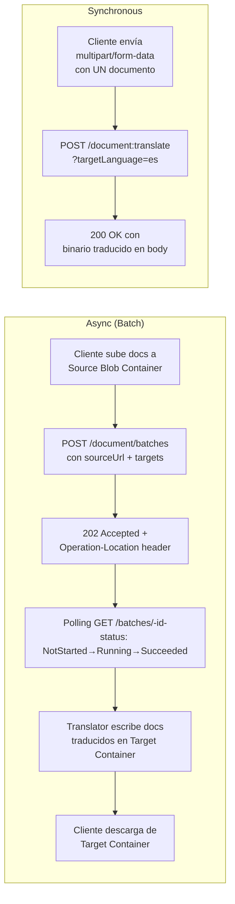
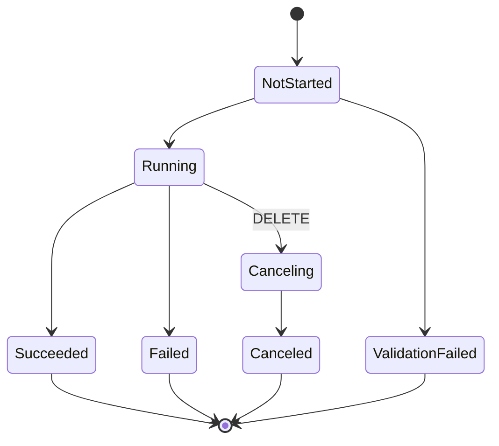
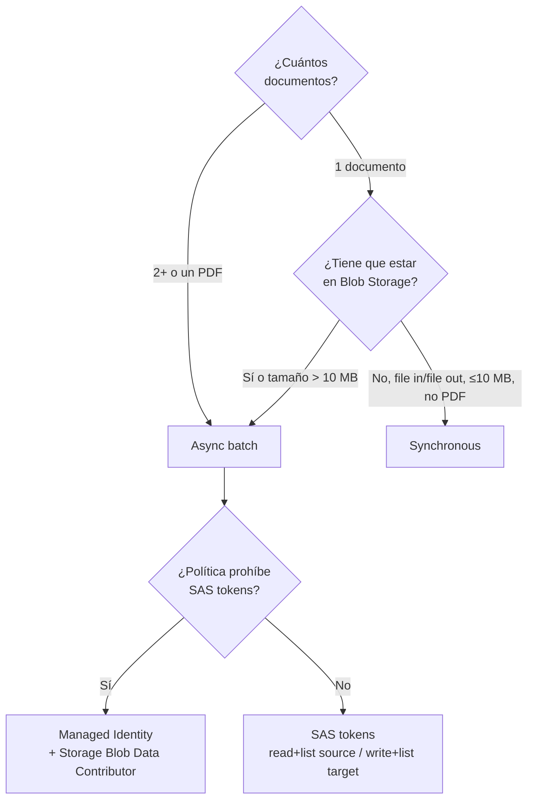

# Document Translation (Azure Translator) — async batch + synchronous

> [!abstract] TL;DR
> **Document Translation** es la *feature* de **Azure Translator in Foundry Tools** que traduce documentos completos **preservando layout y formato** mediante dos workflows: **(1) Asynchronous (batch)** — procesa hasta 1 000 documentos en Blob Storage (source container → target container) con polling de `Operation-Location`; **(2) Synchronous** — sube un único archivo y recibe el binario traducido en la misma respuesta HTTP. Requiere **tier S1+** (no F0), endpoint con **custom domain** y autenticación con **SAS tokens** o **system-assigned managed identity**. Soporta **glossaries** (CSV/TSV/XLF), **custom Translator models** (parámetro `category`) y traducción a **múltiples idiomas en una sola petición**. API version vigente: `2024-05-01`.

## 🎯 Relevancia en el examen

🔥🔥 **Frecuencia media-alta** en D.1. Microsoft examina sobre todo:

- Distinguir **async (batch) vs synchronous** (cuándo elegir cada uno y qué requiere cada uno).
- Patrón de **polling con `Operation-Location`** (status codes 202 → poll → 200).
- **Authentication**: SAS vs managed identity (qué role asignar, en qué scope).
- **Estructura del JSON `inputs`**: `source`, `targets[]`, `glossaries[]`, `filter` (prefix/suffix), `category`, `storageType`.
- **Límites**: tamaño documento, files por batch, batch total, glossary size.
- Diferenciar **Document Translation** de **Text Translation** (`/translate`) y de **Custom Translator** (entrenamiento de modelos).

Escenarios típicos: *"Necesitas traducir 800 PDFs de un container a 3 idiomas preservando layout, sin SAS porque políticas de seguridad lo prohíben"* → MI + batch + 3 targets en single request.

## 📖 Concepto en profundidad

### Posicionamiento dentro del ecosistema Translator

Azure Translator tiene **tres features distintas** que el examen suele mezclar:

| Feature | Endpoint base | Qué hace | Carácteres / Documentos |
|---|---|---|---|
| **Text Translation** | `api.cognitive.microsofttranslator.com/translate` | Traduce strings JSON | Strings |
| **Document Translation** *(este archivo)* | `<resource>.cognitiveservices.azure.com/translator/document/...` | Traduce documentos completos preservando formato | Documentos (PDF, DOCX, ...) |
| **Custom Translator** | Portal aparte (portal.customtranslator.azure.ai) | **Entrena** modelos personalizados (no traduce en runtime) | Se *consume* desde Text o Document mediante `category` |

> [!warning] Trampa clave
> Document Translation **no entrena nada**. Para entrenar un modelo de dominio se usa **Custom Translator** y luego se referencia su **Category ID** en `targets[].category` de Document Translation. Ver [[text-custom-translator-training]].

### Async (batch) vs Synchronous — diferencias quirúrgicas



| Aspecto | **Async (batch)** | **Synchronous** |
|---|---|---|
| Endpoint | `/translator/document/batches` | `/translator/document:translate` |
| Verbo HTTP | POST con JSON `inputs` | POST con `multipart/form-data` |
| Storage | **Obligatorio** Azure Blob (source+target) | **No necesario** (file in/file out) |
| Auth | SAS o MI sobre Storage | Solo Translator key |
| Nº docs | Hasta **1 000** por batch | Exactamente **1** |
| Tamaño máx doc | **≤ 40 MB** | **≤ 10 MB** |
| Total batch | **≤ 250 MB** | n/a |
| Target languages | Hasta **10** simultáneos | **1** |
| Response | `202 Accepted` + `Operation-Location` (polling) | `200 OK` + binary translated doc |
| Glossary size | **≤ 10 MB** | **≤ 1 MB** |
| Formatos | 16+ (incl. PDF con OCR) | 9 (sin PDF) |
| Endpoint Foundry portal | No soportado en portal nuevo | Soportado en playground |

> [!info] Diferencia regional sutil
> El **endpoint synchronous** requiere **custom domain endpoint** (no funciona con el endpoint genérico `api.cognitive.microsofttranslator.com`). Para **managed identity**, el recurso Translator **no puede estar en región `Global`** — debe ser geográfica (East US, West US, ...). Con SAS tokens, sí se puede usar `Global`.

### Formatos soportados (verbatim docs)

**Async batch** acepta: `pdf` (con OCR), `csv`, `html/htm`, `odp`, `ods`, `odt`, `markdown` (md/mkd/mdwn/mdtxt/...), `mhtml/mht`, `xls/xlsx`, `msg`, `ppt/pptx`, `doc/docx`, `rtf`, `tsv/tab`, `txt`, `xlf`, e **image** (`jpeg`, `png`, `bmp`, `webp`) en preview `2025-12-01-preview`.

**Synchronous** acepta solo: `txt`, `tsv/tab`, `csv`, `html/htm`, `mhtml/mht`, `pptx`, `xlsx`, `docx`, `msg`, `xlf`. **No acepta PDF.**

**Glossary**: `csv`, `xlf` (XLIFF), `tsv/tab`. Para versión legacy/sync también con tamaño ≤ 1 MB.

**Conversiones legacy automáticas** (async): `.doc/.odt/.rtf → .docx`, `.xls/.ods → .xlsx`, `.ppt/.odp → .pptx`.

### Status lifecycle del job async



Valores oficiales del campo `status`: `NotStarted`, `Running`, `Succeeded`, `Failed`, `Canceled`, `Canceling`, `ValidationFailed`. **`ValidationFailed`** ocurre cuando el JSON `inputs` no pasa schema validation (típicamente: `targetUrl` duplicado entre targets, o file con mismo nombre ya existente en destino).

## 🏗️ Cómo se hace

### 1) REST — Start batch translation (async)

```http
POST https://<resource>.cognitiveservices.azure.com/translator/document/batches?api-version=2024-05-01
Ocp-Apim-Subscription-Key: <key>
Content-Type: application/json

{
  "inputs": [
    {
      "source": {
        "sourceUrl": "https://<acct>.blob.core.windows.net/source-en?<SAS-or-empty-if-MI>",
        "language": "en",
        "storageSource": "AzureBlob",
        "filter": { "prefix": "2026/", "suffix": ".docx" }
      },
      "targets": [
        {
          "targetUrl": "https://<acct>.blob.core.windows.net/target-es?<SAS>",
          "language": "es",
          "category": "general",
          "storageSource": "AzureBlob",
          "glossaries": [
            { "glossaryUrl": "https://<acct>.blob.core.windows.net/glossaries/en-es.xlf?<SAS>",
              "format": "xliff",
              "version": "1.2" }
          ]
        },
        {
          "targetUrl": "https://<acct>.blob.core.windows.net/target-fr?<SAS>",
          "language": "fr"
        }
      ],
      "storageType": "Folder"
    }
  ]
}
```

**Response**:

```
HTTP/1.1 202 Accepted
Operation-Location: https://<resource>.cognitiveservices.azure.com/translator/document/batches/9dce0aa9-78dc-41ba-8cae-2e2f3c2ff8ec?api-version=2024-05-01
```

El **job ID** es el segmento alfanumérico tras `/batches/`.

### 2) REST — Synchronous Document Translation

```bash
curl -X POST "https://<resource>.cognitiveservices.azure.com/translator/document:translate?targetLanguage=es&api-version=2024-05-01" \
  -H "Ocp-Apim-Subscription-Key: <key>" \
  -F "document=@source.docx;type=application/vnd.openxmlformats-officedocument.wordprocessingml.document" \
  -F "glossary=@en-es.xlf;type=application/xliff+xml" \
  -o translated.docx
```

Devuelve `200 OK` con el documento traducido en el cuerpo binario.

### 3) Python SDK (`azure-ai-translation-document`)

> [!note] Package oficial
> `pip install azure-ai-translation-document` — clase principal `DocumentTranslationClient`.

```python
from azure.ai.translation.document import DocumentTranslationClient, DocumentTranslationInput, TranslationTarget
from azure.core.credentials import AzureKeyCredential
from azure.identity import DefaultAzureCredential

endpoint = "https://<resource>.cognitiveservices.azure.com"
client = DocumentTranslationClient(endpoint, AzureKeyCredential("<key>"))
# Alternativa con MI / AAD:
# client = DocumentTranslationClient(endpoint, DefaultAzureCredential())

# --- Caso simple: 1 source → 1 target language ---
poller = client.begin_translation(
    source_url="https://<acct>.blob.core.windows.net/source-en?<SAS>",
    target_url="https://<acct>.blob.core.windows.net/target-es?<SAS>",
    target_language="es",
)
result = poller.result()   # list[DocumentStatus]
for doc in result:
    print(doc.id, doc.status, doc.translated_document_url, doc.character_charged)

# --- Caso avanzado: múltiples targets + glossary + custom model + filtros ---
inputs = [
    DocumentTranslationInput(
        source_url="https://<acct>.blob.core.windows.net/source-en?<SAS>",
        source_language="en",
        prefix="2026/", suffix=".docx",
        targets=[
            TranslationTarget(target_url="https://<acct>.blob.core.windows.net/target-es?<SAS>",
                              language="es",
                              category_id="<custom-translator-category-guid>",
                              glossaries=[{"glossary_url": "https://<acct>.blob.core.windows.net/glos/en-es.xlf?<SAS>",
                                           "file_format": "xliff"}]),
            TranslationTarget(target_url="https://<acct>.blob.core.windows.net/target-fr?<SAS>",
                              language="fr"),
        ],
    )
]
poller = client.begin_translation(inputs=inputs)
result = poller.result()
```

> [!warning] SDK synchronous endpoint
> El SDK Python `azure-ai-translation-document` históricamente cubre **solo el modo async (batch)**. Para **synchronous single-file** hay que llamar al endpoint REST `/document:translate` directamente (multipart/form-data) o usar el SDK más reciente cuando expone `translate_document(...)`. ⚠️ Verifica la versión instalada antes de asumir cobertura.

### 4) Managed Identity setup (Azure CLI)

```bash
# 1) Habilitar system-assigned MI en el recurso Translator
az cognitiveservices account identity assign \
  --name <translator-name> --resource-group <rg>

# 2) Obtener el principalId
PRINCIPAL_ID=$(az cognitiveservices account show \
  --name <translator-name> --resource-group <rg> \
  --query identity.principalId -o tsv)

# 3) Asignar role Storage Blob Data Contributor sobre la storage account
STORAGE_ID=$(az storage account show \
  --name <storage-acct> --resource-group <rg> --query id -o tsv)

az role assignment create \
  --assignee-object-id $PRINCIPAL_ID \
  --assignee-principal-type ServicePrincipal \
  --role "Storage Blob Data Contributor" \
  --scope $STORAGE_ID
```

> [!important] Con MI, **no incluyas SAS en las URLs** del payload. El formato es `https://<acct>.blob.core.windows.net/<container>` (limpio). Si añades SAS además de MI, la request **falla**.

Ver patrones cross-resource en [[plan-security-managed-identity]].

## 📊 Tablas comparativas / cuándo usar qué

### ¿Async o Sync?



### Document Translation vs alternativas LLM

| Necesidad | Recomendación | Por qué |
|---|---|---|
| Traducir PDF/DOCX/PPTX **preservando layout** | **Document Translation** | OCR + layout preservation built-in |
| Traducir strings en una app | **Text Translation `/translate`** | Latencia baja, JSON in/out |
| Traducción + razonamiento + reescritura de tono | **GPT-4o / GPT-4.1 con prompt** | Más caro, no preserva layout binario, ver [[text-translation-llm-flows]] |
| Entrenar modelo de dominio (legal, médico) | **Custom Translator** (entrena) + Document Translation (`category` ID) | Mejora calidad terminológica |
| Glosarios de terminología fija | **Document Translation `glossaries[]`** | Override determinista por término |

## 🪤 Trampas del examen

1. **Synchronous y async son APIs distintas** — `/document:translate` (multipart, 1 doc, 200 OK con binary) ≠ `/document/batches` (JSON, hasta 1 000 docs, 202 + polling). No se intercambian.
2. **El polling es por `Operation-Location` header**, no por `Location`. Llamadas posteriores van a `GET /batches/{id}` que devuelve `status` + `summary`.
3. **Tier F0 no soporta Document Translation**. Pricing tiers válidos: **S1** Standard o volume plans **C2/C3/C4/D3**. Examen suele preguntar: *"¿Qué cambio mínimo permite habilitar batch translation?"* → cambiar a S1.
4. **Custom domain endpoint obligatorio** — el endpoint genérico `api.cognitive.microsofttranslator.com` (usado por Text Translation) **no funciona** para Document Translation. Debe ser `https://<resource-name>.cognitiveservices.azure.com`.
5. **Managed Identity requiere región geográfica** (East US, West US, ...). Si el recurso Translator está en **Global**, MI no funciona → solo SAS. Truco frecuente en preguntas de seguridad.
6. **Role exacto sobre Storage**: `Storage Blob Data Contributor` (read + write + delete). No es "Reader" ni "Contributor" (que es control-plane). Examen confunde estos.
7. **Con MI, eliminar SAS del payload** — incluir ambos hace fallar la request. Inverso: con SAS tokens, no hace falta MI.
8. **`targetUrl` debe ser único por target language**. Dos targets con el mismo `targetUrl` provocan `ValidationFailed`.
9. **Si existe un archivo con el mismo nombre en el target container, el job falla** — Document Translation no sobreescribe.
10. **PDF solo en async**, no en sync. Para PDF síncrono → fallback a OCR + Text Translation manual o usar batch con 1 documento.
11. **`storageType: "File"` vs `"Folder"`** — si `sourceUrl` apunta a un blob específico (no a un container), hay que especificar `storageType: "File"`; si no, el servicio asume nivel container.
12. **Glossary distinta lengua de target = ignorada silenciosamente**. Si el glossary no cubre el par `source→target`, no se aplica (no error). El nombre de archivo no determina la lengua: el contenido (XLIFF tiene `source-language`/`target-language`).
13. **Image text in `.docx`** (`translateTextWithinImage: true`) requiere **multi-service AI Services resource**, no Translator standalone. Solo en batch.
14. **Custom Translator se referencia con `category`**, que es el **Category ID** (GUID) generado al desplegar el modelo en Custom Translator portal — no es el nombre del modelo.
15. **Storage detrás de firewall**: hay que marcar *"Allow Azure services on the trusted services list"* y añadir `Microsoft.CognitiveServices/accounts` como Resource Instance.
16. **Límites no son los del brief antiguo** — vigentes ahora: doc ≤ 40 MB async / ≤ 10 MB sync; batch total **≤ 250 MB** (no 20 GB); ≤ 10 target languages; glossary ≤ 10 MB async / ≤ 1 MB sync.

## 🧠 Mnemotecnia

- **"BATCH = Blob + Async + Targets + Concurrent + Headers (Operation-Location)"**.
- **"SYNC = Single, Small (≤10 MB), Stateless, no Storage, no PDF"**.
- Auth: **"MI = Mi (yo) en región Geográfica; SAS = Sirve en cualquier sitio"**.
- Role storage: **"Blob Data Contributor — porque escribe (target) además de leer (source)"**. Reader-only fallaría al escribir.
- Lifecycle: **N-R-S-F-C-V** → *No-Running-Succeeded-Failed-Canceled-Validation*.
- API version vigente: **2024-05-01** ("dos-mil-veinticuatro mayo uno" = "el batch nuevo").

## 🔗 Conceptos relacionados

- [[text-translation-foundry-tools]] — el otro endpoint Translator (`/translate` strings).
- [[text-translation-llm-flows]] — comparativa con LLM-based translation.
- [[text-custom-translator-training]] — cómo se obtiene el `category` ID que se usa aquí.
- [[plan-security-managed-identity]] — patrón cross-resource de MI.
- [[plan-security-keys-endpoints]] — gestión de keys y custom domain endpoints.
- [[plan-monitoring-diagnostics]] — diagnóstico de jobs `Failed` / `ValidationFailed`.

## ❓ Autotest

**1.** Quieres traducir 500 PDFs almacenados en un Blob container a español, francés y alemán **en una sola operación**, sin usar SAS por política de seguridad. El recurso Translator está en región **Global** con tier **S1**. ¿Qué cambio es estrictamente necesario?

- a) Cambiar a tier S2
- b) Recrear el recurso Translator en una región geográfica (p. ej. West US)
- c) Asignar role *Reader* sobre la Storage Account
- d) Usar el endpoint synchronous `/document:translate`

<details><summary>Respuesta</summary>

**b)**. Managed Identity para Document Translation **no soporta región Global** — exige región geográfica. S1 ya es válido para batch (a es falso); el role correcto es *Storage Blob Data Contributor*, no Reader (c falso); el endpoint sync no admite múltiples docs ni PDF (d falso).
</details>

**2.** Tras un `POST /translator/document/batches`, recibes `202 Accepted`. ¿Dónde encuentras el job ID para hacer polling?

- a) En el body JSON `{"jobId": "..."}`
- b) En el header `Location`
- c) En el header `Operation-Location`, como último segmento de la URL
- d) En el header `x-ms-correlation-request-id`

<details><summary>Respuesta</summary>

**c)**. El header oficial es `Operation-Location`, cuyo valor contiene la URL `.../document/batches/{id}?api-version=...`. El segmento alfanumérico tras `/batches/` es el job `id`.
</details>

**3.** Necesitas traducir **un único** archivo `.txt` (5 MB), sin pasar por Storage. ¿Qué endpoint y método usas?

- a) `POST /translator/document/batches` con `storageType: "File"`
- b) `POST /translator/document:translate?targetLanguage=es` con `multipart/form-data`
- c) `POST /translate?api-version=3.0` con el texto en el body JSON
- d) `PUT /document` con header `Content-Type: text/plain`

<details><summary>Respuesta</summary>

**b)**. Synchronous Document Translation: endpoint `/document:translate`, multipart con el archivo. La opción (a) sigue requiriendo Storage; (c) es Text Translation (strings, no archivos preservando formato); (d) no existe.
</details>

**4.** ¿Cuál de estas combinaciones provoca `ValidationFailed` al iniciar un batch?

- a) Dos `targets` con el mismo `targetUrl` y distinta `language`
- b) `sourceUrl` apuntando a un container vacío
- c) `category` con valor `"general"`
- d) Glossary en formato `xliff` cuando el documento es `.docx`

<details><summary>Respuesta</summary>

**a)**. `targetUrl` debe ser único por target language; duplicar URL falla validación. Un container vacío no falla (job termina sin documentos procesados). `"general"` es el `category` por defecto válido. Mezclar formatos document/glossary es legítimo si los idiomas coinciden.
</details>

**5.** En un entorno con managed identity habilitado, ¿qué role asignas y a qué scope?

- a) `Cognitive Services Contributor` sobre el recurso Translator
- b) `Storage Blob Data Contributor` sobre la Storage Account (o container)
- c) `Storage Account Contributor` sobre la Storage Account
- d) `Reader` sobre el Resource Group

<details><summary>Respuesta</summary>

**b)**. El Translator (representado por su system-assigned MI) necesita **read + write + delete** sobre los blobs, lo cual aporta el role `Storage Blob Data Contributor` en el plano de datos. `Storage Account Contributor` es control-plane (no da acceso a datos). `Cognitive Services Contributor` se aplica al recurso Translator, no a Storage.
</details>

## ✅ Control de calidad (auto-rúbrica)

| Dimensión | Nota | Justificación |
|---|---|---|
| Completitud | **10** | Cubre async, sync, formats, glossaries, MI, SAS, SDK Python, REST, límites oficiales, status lifecycle, custom Translator. |
| Exactitud técnica | **10** | Todos los endpoints, status values, límites, roles y nombres de paquete verificados verbatim contra Microsoft Learn (4 páginas oficiales) el 2026-05-23. Límites del brief antiguo (20 GB, 100 MB) **corregidos** a valores vigentes (250 MB, 40 MB / 10 MB). |
| Alineación al examen | **9** | Trampas reales (custom domain, región Global incompatible con MI, role exacto Blob Data Contributor, ValidationFailed, F0 no soporta). Autotest tipo AI-103. |
| Claridad pedagógica | **9** | Mermaids, tablas comparativas, mnemónicos, callouts Obsidian, código Python/CLI/REST/JSON ejecutable. |

*Verificado a fecha 2026-05-23 contra Microsoft Learn.*
