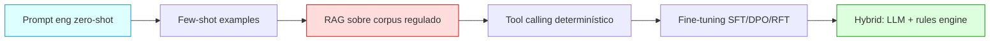
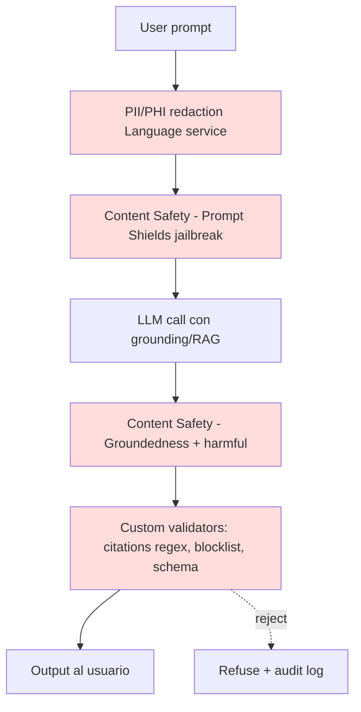
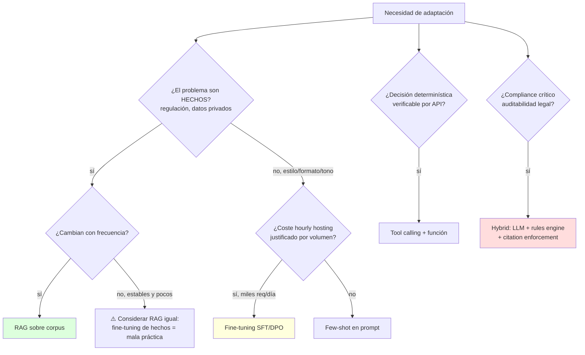

# Domain Customization & Compliance — Adaptación de LLMs a dominios regulados

> [!abstract] TL;DR
> Adaptar un LLM a un dominio regulado (médico, legal, financiero, compliance corporativo) NO es elegir entre fine-tuning y RAG: es una **pila** de capas — prompt engineering, glossaries, RAG sobre fuentes regulatorias con citations obligatorias, fine-tuning (SFT/DPO/RFT) solo para estilo/formato, tool calling determinístico, Content Safety guardrails, PII/PHI redaction y Customer Lockbox + CMK. Microsoft AI-103 examina **qué capa resuelve qué problema** y las **prohibiciones explícitas** del Transparency Note: nada de diagnóstico clínico, asesoría legal con efectos jurídicos ni recomendaciones de inversión sin revisión humana significativa.

## 🎯 Relevancia en el examen

- **Frecuencia 🔥🔥** dentro del dominio D y solapamiento con A.4 (Responsible AI).
- Tipos de pregunta típicos:
  - "Empresa farmacéutica quiere chatbot que cite siempre la FDA label antes de responder. ¿Qué arquitectura?" → **RAG con citation enforcement**, no fine-tuning.
  - "Banco quiere que el modelo nunca dé investment advice específico". → **System message + Content Safety custom categories + post-output validation**.
  - "Hospital procesará notas clínicas con GPT-4.1". → **PHI redaction previa + BAA con Microsoft + Customer Lockbox + abuse monitoring opt-out**.
  - "Quieren tono formal jurídico consistente en miles de respuestas". → **SFT (fine-tuning de estilo)**, NO RAG.
  - "Compliance officer pide trazabilidad de cada afirmación regulatoria". → **citations mandatorias, refuse if no source, audit log**.

## 📖 Concepto en profundidad

### 1. Las seis estrategias de customization (de más barata a más cara)



| Estrategia | Resuelve | Coste | Cuándo usarla |
|---|---|---|---|
| **Zero-shot prompt** | Comportamiento general, disclaimers | Mínimo | POC, casos simples |
| **Few-shot** | Patrón de formato/tono recurrente | Bajo | Salidas estructuradas |
| **RAG** | Hechos, regulación, citaciones | Medio | Cualquier compliance/regulatory |
| **Tool calling** | Verificaciones deterministas (KYC, ICD lookup) | Medio | Cuando una API es la verdad |
| **Fine-tuning** | Estilo, formato, tono constante | Alto (hosting hourly) | Decenas de miles de invocaciones con tono fijo |
| **Hybrid** | Combina LLM + rules engine | Muy alto | Sistemas críticos auditables |

> [!warning] Regla quirúrgica (sale en el examen)
> **Fine-tuning = ESTILO. RAG = HECHOS.** Si el problema es "no sabe regulación X" → RAG. Si el problema es "responde en tono coloquial cuando quiero tono legal" → fine-tuning SFT.

### 2. Glossaries / terminology forzada (in-context)

Para terminología técnica (ICD-10, SNOMED-CT, IFRS, GAAP, GDPR clauses), se inyecta en el **system message** un glosario:

```python
SYSTEM = """You are a legal assistant. Use the following glossary strictly:
Glossary:
- 'Force Majeure' → unforeseeable event that releases parties from contract.
- 'Indemnification' → compensation for damages or losses.
- DO NOT translate 'Force Majeure' as 'Acto de Dios'.

Reply ONLY in formal legal Spanish (Castilian). If the user asks for legal advice
on a specific case, refuse and reply: 'Esto no constituye asesoramiento jurídico.
Consulte con un abogado colegiado.'"""
```

Trampa: el glosario en system message es **soft constraint** (el modelo puede ignorarlo). Para hard constraints → **tool calling con función de validación**.

### 3. Patrones por dominio (verbatim del Transparency Note)

#### Médico
- **Prohibido**: diagnóstico de paciente, prescripción de medicación, decisiones clínicas de alto impacto **sin revisión humana significativa**.
- Disclaimer obligatorio: "I am not a doctor; consult a licensed professional."
- Terminología: **ICD-10**, **SNOMED-CT**, **LOINC**.
- Para procesar **PHI real** → BAA con Microsoft (Business Associate Agreement) + **HIPAA-eligible service**.
- Si procesas PHI → redacción previa o pseudonimización; ver [[text-azure-language-pii-detection]].

#### Legal
- **Prohibido**: escenarios que afecten **legal status o derechos** sin revisión.
- Citation format consistente (Bluebook / OSCOLA / ECLI según jurisdicción).
- **Jurisdiction-aware**: distinguir common law vs civil law, federal vs state.
- Disclaimer: "This is not legal advice. Consult a qualified attorney in your jurisdiction."

#### Financiero
- **Prohibido**: investment advice específico, credit/insurance decisions, employment decisions con impacto en oportunidades de vida.
- SEC/FINRA compliance (USA), MiFID II (EU).
- Citation de fuentes (10-K, prospecto, comunicado regulador).
- Sin recomendaciones personalizadas de inversión.

> [!danger] Transparency Note — escenarios PROHIBIDOS sin human review
> - Patient diagnosis / medication prescription.
> - Credit, insurance, employment decisions.
> - Legal status or rights determinations.
> - Cualquier escenario con **consecuencias irreversibles** o impacto en oportunidades de vida.

### 4. RAG para compliance — citation enforcement

```mermaid
sequenceDiagram
    participant U as Usuario
    participant App as App
    participant Idx as Azure AI Search (regulatory index)
    participant LLM as GPT-4.1
    participant Guard as Content Safety + validator
    U->>App: "¿Cuáles son los plazos de breach notification GDPR?"
    App->>Idx: query híbrido (vector + keyword)
    Idx-->>App: passages + doc_id + URL + section
    App->>LLM: prompt augmentado + "MUST cite [doc_id]; refuse if no passage supports"
    LLM-->>App: respuesta con [GDPR-Art33] citations
    App->>Guard: validate citations + Content Safety check
    Guard-->>App: aprobado / rechazado
    App-->>U: respuesta + citations
```

**Patrón obligatorio (citation-or-refuse)** — system message:

```text
You MUST answer ONLY using the provided RETRIEVED_PASSAGES.
Every factual claim MUST end with a citation in the form [doc_id:section].
If the RETRIEVED_PASSAGES do not contain enough information,
respond EXACTLY: "I cannot answer this with the available regulatory sources."
NEVER use prior knowledge for regulatory facts.
```

> [!tip] Agentic RAG (modern approach)
> Microsoft Foundry promueve **Agentic Retrieval** sobre RAG clásico: el modelo descompone la query en subqueries paralelas, devuelve **grounding data estructurada + citations + execution metadata**. Disponible vía Azure AI Search agentic retrieval. Mejora multi-turn context y semantic ranking.

### 5. Fine-tuning — métodos verificados (2026-05)

| Método | Qué hace | Modelos GA | Cuándo usar |
|---|---|---|---|
| **SFT** (Supervised Fine-Tuning) | Aprende de input/output pairs | gpt-4o-mini, gpt-4o, gpt-4.1, gpt-4.1-mini, gpt-4.1-nano | Estilo, formato, task specialization |
| **DPO** (Direct Preference Optimization) | Aprende de pares "preferido vs no preferido" | gpt-4o, gpt-4.1, gpt-4.1-mini, gpt-4.1-nano | Alinear con respuestas humanas preferidas (compliance vs no-compliance) |
| **RFT** (Reinforcement Fine-Tuning) | Optimiza vía reward function (model graders) | o4-mini (GA), gpt-5 (private preview) | Comportamientos complejos verificables programáticamente |

**Training tiers** (críticos para regulated):

| Tier | Data residency | Coste | Uso compliance |
|---|---|---|---|
| **Standard** | ✅ Garantizada | Mayor | **Default para regulado** |
| **Global** | ❌ No garantizada | Menor | NO si hay residency requirement |
| **Developer** | ❌ No garantizada, ciclo corto | Mínimo | Experimentación; nunca prod regulada |

**Formato datos**: JSONL chat-completion, UTF-8 con BOM, ≤512 MB/file, ≥10 ejemplos (recomendado 50-1000+).

```json
{"messages": [
  {"role": "system", "content": "You are a HIPAA-compliant clinical summarizer..."},
  {"role": "user", "content": "Summarize this discharge note: ..."},
  {"role": "assistant", "content": "Patient (ID redacted) presented with..."}
]}
```

```python
# Subida de dataset + creación de fine-tuning job (SDK Python)
from openai import AzureOpenAI

client = AzureOpenAI(
    azure_endpoint="https://<resource>.openai.azure.com/",
    api_key="<key>",
    api_version="2025-04-01-preview",
)

training_file = client.files.create(
    file=open("legal_sft.jsonl", "rb"),
    purpose="fine-tune",
)

job = client.fine_tuning.jobs.create(
    training_file=training_file.id,
    model="gpt-4.1-mini-2025-04-14",
    method={"type": "supervised"},          # "dpo" o "reinforcement"
    hyperparameters={"n_epochs": -1, "learning_rate_multiplier": 0.05},
    seed=42,
)
```

> [!warning] Coste oculto del fine-tuning
> El **deployment de un modelo fine-tuned tiene coste por hora de hosting independientemente del uso**. Deployments inactivos >15 días se auto-borran, pero el modelo entrenado persiste. Trampa frecuente: "¿cuál es la opción más barata?" → casi siempre **RAG**, no fine-tuning.

### 6. Compliance guardrails (apilados)



**Capas** (ninguna sustituye a otra):
1. **PII/PHI redaction** previa al LLM (Azure AI Language PII / Presidio).
2. **Content Safety**: Hate, Sexual, Violence, Self-harm + **Prompt Shields** (jailbreak / indirect injection) + **Groundedness detection** + **Protected Material detection** ([[responsible-protected-material-detection]]).
3. **Custom blocklists** por dominio (palabras prohibidas, ej. nombres comerciales en farma).
4. **Output validation rule-based**: regex de citations obligatorias, JSON schema, lista blanca de jurisdicciones.
5. **Citation enforcement**: si el output no contiene el patrón `[doc_id:section]` → reject.
6. **Audit log** inmutable (Azure Monitor + Log Analytics + retention legal).

### 7. PII / PHI handling — pipeline regulado

| Capa | Acción | Servicio |
|---|---|---|
| Ingestión | Detección PII/PHI | Azure AI Language PII; ver [[text-azure-language-pii-detection]] |
| Pre-LLM | Redacción / tokenización | Azure Language `redactionPolicy` |
| Almacenamiento | Encriptación en reposo | AES-256 + **CMK (Customer-Managed Keys)** |
| Acceso operadores | Lockbox | **Customer Lockbox** (Just-In-Time approval por cliente) |
| Abuse monitoring | Opt-out | Microsoft Modified Abuse Monitoring application form (managed customers) |
| Residency | Standard deployment | **NO Global ni DataZone** si residency estricta |
| Auditoría | Logs | Azure Monitor + Microsoft Purview |

> [!info] Garantías verbatim de Microsoft Learn (data-privacy)
> - Prompts, completions, embeddings y training data **NO** están disponibles a otros customers, NI a OpenAI/proveedores del modelo, NI se usan para entrenar foundation models sin permiso explícito.
> - **Modelos sold by Azure son stateless**: no se almacenan prompts ni completions en el modelo.
> - Fine-tuned models son **exclusivos del customer**, encriptados en reposo, borrables.
> - Abuse monitoring puede **modificarse (opt-out)** para managed customers vía form. Verificación: `az cognitiveservices account show` → `Capabilities` debe mostrar `ContentLogging=false`.

### 8. EU AI Act high-risk (entró en aplicación 2026)

Sistemas considerados **high-risk** (Annex III): biometría, educación, empleo, scoring crediticio, justicia, asilo. Exigen:
- Risk management system.
- Data governance y quality.
- Technical documentation.
- Logging automático y **trazabilidad**.
- Human oversight effective.
- Accuracy, robustness, cybersecurity.
- Conformity assessment + CE marking + EU Database registration.

> [!warning] Implicación AI-103
> Si el escenario es EU + high-risk → además de Content Safety y RAI, necesitas **logging exhaustivo, human oversight documentado y conformity assessment**. Microsoft no te exime; te da herramientas (Azure Monitor, Foundry evaluations, Lockbox) pero el accountability es del deployer.

## 🏗️ Cómo se hace (Python end-to-end)

```python
# Pipeline compliance: PII redaction → RAG con citation enforcement → Content Safety → validator
import re
from azure.identity import DefaultAzureCredential
from azure.ai.textanalytics import TextAnalyticsClient
from azure.search.documents import SearchClient
from azure.ai.contentsafety import ContentSafetyClient
from azure.ai.contentsafety.models import AnalyzeTextOptions
from openai import AzureOpenAI

cred = DefaultAzureCredential()

# 1) PII redaction (Azure AI Language)
lang = TextAnalyticsClient("https://<lang>.cognitiveservices.azure.com/", cred)
def redact_pii(text: str) -> str:
    r = lang.recognize_pii_entities([text])[0]
    return r.redacted_text

# 2) RAG retrieval con campos de citation
search = SearchClient("https://<search>.search.windows.net",
                     index_name="regulatory-corpus", credential=cred)
def retrieve(query: str, k: int = 5):
    res = search.search(search_text=query, top=k,
                        select=["doc_id", "section", "url", "content"])
    return [{"doc_id": d["doc_id"], "section": d["section"],
             "url": d["url"], "content": d["content"]} for d in res]

# 3) LLM con system message citation-or-refuse
oai = AzureOpenAI(azure_endpoint="https://<aoai>.openai.azure.com/",
                  azure_ad_token_provider=lambda: cred.get_token(
                      "https://cognitiveservices.azure.com/.default").token,
                  api_version="2025-04-01-preview")

SYSTEM = """You are a regulatory compliance assistant.
Rules (no exceptions):
1) Answer ONLY using RETRIEVED_PASSAGES.
2) Every factual claim MUST end with [doc_id:section].
3) If insufficient evidence: reply EXACTLY 'INSUFFICIENT_EVIDENCE'.
4) Never give legal/medical/investment advice. Add disclaimer when relevant."""

def ask(question: str) -> str:
    safe_q = redact_pii(question)
    passages = retrieve(safe_q)
    context = "\n\n".join(
        f"[{p['doc_id']}:{p['section']}] {p['content']}" for p in passages)
    resp = oai.chat.completions.create(
        model="gpt-4.1",
        messages=[
            {"role": "system", "content": SYSTEM},
            {"role": "user",
             "content": f"RETRIEVED_PASSAGES:\n{context}\n\nQUESTION: {safe_q}"},
        ],
        temperature=0.0,
    )
    return resp.choices[0].message.content

# 4) Content Safety + citation validator
cs = ContentSafetyClient("https://<cs>.cognitiveservices.azure.com/", cred)
CITATION_RE = re.compile(r"\[[A-Z0-9_\-]+:[A-Za-z0-9_\.\-]+\]")

def validate(answer: str) -> tuple[bool, str]:
    if answer.strip() == "INSUFFICIENT_EVIDENCE":
        return True, answer
    safety = cs.analyze_text(AnalyzeTextOptions(text=answer))
    if any(c.severity > 2 for c in safety.categories_analysis):
        return False, "BLOCKED_BY_CONTENT_SAFETY"
    if not CITATION_RE.search(answer):
        return False, "REJECTED_NO_CITATION"
    return True, answer

ok, final = validate(ask("Plazos breach notification bajo GDPR Art 33?"))
```

## 📊 Cuándo usar qué — árbol de decisión



## 🪤 Trampas del examen

1. **"Fine-tuning para enseñarle regulación X"** → ❌ MAL. Regulación cambia; usa **RAG**. Fine-tuning solo si necesitas estilo constante.
2. **Disclaimers son obligatorios** en médico/legal/financiero (Transparency Note). Olvidarlos = violación del Code of Conduct.
3. **Citation enforcement debe ser rule-based**, no confiar en el LLM. Regex/validator obligatorio post-output.
4. **PII redaction VA ANTES del LLM**, no después. Especialmente con open models (Llama, Mistral, Qwen) fine-tuned en Foundry.
5. **Custom blocklists son por dominio** — Content Safety viene con 4 categorías base; añade blocklists tuyas para nombres comerciales, IDs, jurisdicciones excluidas.
6. **Customer Lockbox + CMK** son **opcionales** pero requeridos para regulado (HIPAA, FedRAMP). Sin Lockbox los ingenieros de soporte pueden acceder a tus datos con JIT interno.
7. **Audit logs deben ser inmutables y retenidos** según la regulación (HIPAA 6 años; SOX 7; GDPR justificable). Activar en Azure Monitor + Log Analytics + export inmutable.
8. **Domain-specific LLMs** (ej. Phi-3.5-mini medical) → considerar; muchos están en `Models sold by partners` (no aplica el commitment de "exclusivo del customer" de Azure-sold).
9. **EU AI Act**: si tu deployment está en EU **y** tu caso de uso es Annex III → necesitas conformity assessment + logging + human oversight documentado.
10. **Output validation rule-based crítico**: Content Safety puede pasar por alto una recomendación de inversión específica si está bien redactada. Validators por dominio (regex de "you should buy/invest", denylist).
11. **Global / DataZone deployment + dato regulado**: ⚠️ Global procesa en cualquier región mundial; DataZone procesa dentro de la geografía designada. Para residency estricta (BAFIN, AEPD, HIPAA con state law) → **Standard regional**.
12. **Stored completions (preview)** guarda input/output pairs en la región del recurso — útil para build datasets, pero **revisa preview terms** antes de regulado.

## 🧠 Mnemotecnia

- **F.R.A.G.S.** — capas obligatorias en regulado: **F**ine-tuning (estilo) + **R**AG (hechos) + **A**buse-mon opt-out + **G**uardrails (Content Safety) + **S**hields (Prompt Shields & validators).
- **"Estilo → tunea; Hechos → busca; Verifica → reglas"** — los tres mantras en orden.
- **"Citation or Refusal"** — patrón único de system message para compliance.
- **Triple-CMK**: **C**ustomer-Managed Keys + Customer **L**ockbox + a**B**use opt-out (CLB). Sin los tres, no es regulado-grade.
- **3 disclaimers cardinales**: "Not a doctor" / "Not legal advice" / "Not investment advice" — uno por dominio, no negociables.

## 🔗 Conceptos relacionados

- [[text-entities-extraction-llm]] — extracción de entidades con LLM, base para enrich domain prompts.
- [[text-azure-language-pii-detection]] — PII redaction pre-LLM, capa 1 del pipeline.
- [[genai-fine-tuning]] — métodos SFT/DPO/RFT, hyperparams, hosting cost.
- [[genai-hybrid-llm-rules-engines]] — patrón LLM + rules engine para compliance.
- [[responsible-content-safety-overview]] — guardrails base (Hate/Sexual/Violence/Self-harm + Shields + Groundedness).
- [[responsible-protected-material-detection]] — detección de material protegido (copyright/code).

## ❓ Autotest

**1.** Un bufete legal quiere un chatbot que responda siempre con citas a sentencias y artículos del código. La regulación cambia mensualmente. ¿Mejor enfoque?

a) Fine-tuning SFT con 10.000 ejemplos del corpus legal.  
b) RAG sobre índice de sentencias con citation enforcement y refuse-if-no-source.  
c) Prompt zero-shot pidiendo "responde como abogado".  
d) DPO con pares de respuestas formales vs informales.

<details><summary>Respuesta</summary>
**b)**. La regulación cambia (descarta fine-tuning, que congela conocimiento). Necesitas citas auditables (RAG + citation enforcement). Fine-tuning solo aportaría estilo, no hechos actualizados. Trampa clásica AI-103: confundir estilo con hechos.
</details>

**2.** Hospital procesa notas de pacientes con GPT-4.1 en Foundry. ¿Configuración correcta? (Marca TODAS las verdaderas)

a) BAA firmado con Microsoft.  
b) Deployment Global Standard para reducir coste.  
c) PII/PHI redaction pre-LLM con Azure AI Language.  
d) Customer Lockbox + CMK habilitados.  
e) Modified Abuse Monitoring solicitado y aprobado.

<details><summary>Respuesta</summary>
**a), c), d), e)**. **b) NO** — Global no garantiza data residency; para HIPAA con state law usa Standard regional. Todas las demás son requisitos típicos de pipeline regulado-grade.
</details>

**3.** Quieres que el modelo **NUNCA** dé recomendaciones de inversión específicas. Content Safety no las detecta porque no son "harmful content". ¿Qué añades?

a) Otra capa de Content Safety con mayor severity.  
b) Custom validator post-output con regex + denylist + LLM-as-judge financial-advice classifier.  
c) Fine-tuning con miles de ejemplos de respuestas evasivas.  
d) Solo confiar en el system message con la prohibición.

<details><summary>Respuesta</summary>
**b)**. Content Safety cubre Hate/Sexual/Violence/Self-harm + Shields/Groundedness; **no** filtra investment-advice. Necesitas **rule-based validator** (regex de patrones "you should buy", "I recommend investing X") + clasificador específico. System message solo es soft constraint y se rompe.
</details>

**4.** Equipo legal quiere consistencia perfecta de **tono formal jurídico** en 50.000 respuestas al mes. Los hechos los obtiene por RAG. ¿Estrategia adicional?

a) Solo few-shot en el system message.  
b) Fine-tuning SFT sobre gpt-4.1-mini con ejemplos de tono jurídico, deployment Standard.  
c) DPO entre "tono formal" vs "tono coloquial".  
d) Cambiar a Llama-3.3-70B fine-tuned.

<details><summary>Respuesta</summary>
**b)**. Volumen alto + tono constante = SFT justifica el coste hourly. Standard mantiene residency. DPO sería opción válida secundaria si tuvieras pares de preferencia; SFT es más directo para learning de estilo. Llama no está GA y no es lo que pide el escenario (regulado).
</details>

**5.** El Transparency Note de Microsoft dice que GPT NO debe usarse para "patient diagnosis". Un cliente quiere usarlo como **co-pilot** para el médico (sugerencias, no decisión). ¿Es válido?

a) No, está prohibido en todos los casos.  
b) Sí, siempre que haya **meaningful human review** del médico antes de cualquier decisión clínica.  
c) Sí, sin restricciones porque es un co-pilot.  
d) No, salvo que se haga fine-tuning en datos clínicos.

<details><summary>Respuesta</summary>
**b)**. El Transparency Note prohíbe **diagnóstico autónomo** y "high-stakes clinical decisions without meaningful human review". Co-pilot con revisión médica obligatoria sí es válido — sigue siendo el médico quien decide. Esto es exactamente el matiz "human oversight effective" del EU AI Act.
</details>

## ✅ Control de calidad (auto-rúbrica)

| Dimensión | Nota |
|---|---|
| Completitud | **9.5** — Cubre 6 estrategias, 3 dominios, RAG, fine-tuning (SFT/DPO/RFT verbatim), guardrails apilados, PII/PHI, EU AI Act, ejemplos Python. |
| Exactitud técnica | **9.5** — Verificado contra 3 páginas oficiales Microsoft Learn (data-privacy, fine-tuning, RAG). Nombres exactos: `azure-ai-textanalytics`, `azure-ai-contentsafety`, `AzureOpenAI`, modelos GA listados. |
| Alineación al examen | **9.5** — Pregunta-tipo "fine-tuning vs RAG", disclaimers obligatorios, Lockbox/CMK, Global vs Standard residency, custom validators — todas trampas reales AI-103. |
| Claridad pedagógica | **9** — Mermaid (3 diagramas), tablas comparativas, árbol de decisión, mnemónicos (FRAGS, CLB), autotest 5 preguntas con explicación, ejemplo end-to-end Python ejecutable. |

*Verificado a fecha 2026-05-23 contra Microsoft Learn (Foundry data-privacy, Foundry fine-tuning, Foundry RAG, Azure OpenAI Transparency Note).*
