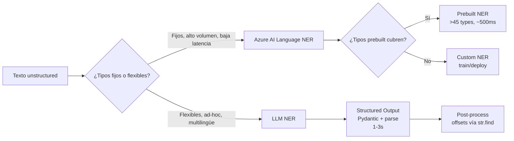
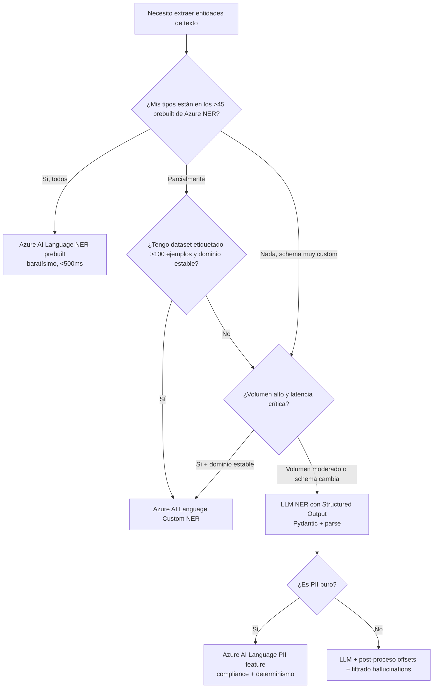

# Extracción de entidades (NER) con Large Language Models

> [!abstract] TL;DR
> NER con LLM es la alternativa **flexible y multilingüe** al servicio clásico **Azure AI Language NER (prebuilt + custom)** cuando el dominio es **arbitrario, dinámico o muy específico** (facturas, contratos, historias clínicas, tickets de soporte) y no encaja en los **>45 tipos prebuilt** ni justifica entrenar un modelo custom NER. El patrón canónico en AI-103 es: **Pydantic `BaseModel` + `client.beta.chat.completions.parse()` con `response_format=<TuModel>`** sobre un modelo soportado (gpt-4o `2024-08-06`, gpt-4.1, gpt-5, o-series), few-shot opcional para consistencia, batch async con `Semaphore`, y **post-procesado para offsets** (los `start_index`/`end_index` que devuelve un LLM son **notoriamente poco fiables** y deben recalcularse con `str.find()` o regex contra el texto original). Compromiso clave: ganas customización y multilingüe, **pagas latencia (1-3 s) y coste por-token** vs los <500 ms y por-call del servicio clásico.

## 🎯 Relevancia en el examen

🔥🔥 **Frecuencia media-alta** dentro del dominio D. Preguntas típicas:

- **Cuándo elegir LLM NER vs Azure AI Language NER prebuilt vs Custom NER** (árbol de decisión por: customizability, languages, cost, latency, volumen).
- **Patrón structured output**: rellenar `client.beta.chat.completions.parse(..., response_format=NERResult)` correctamente con Pydantic.
- **Trampa offsets**: ¿qué hacer con `start_index`/`end_index` devueltos por el LLM? → **post-proceso con `str.find()`**, no confiar.
- **Mitigar hallucinations**: instrucción explícita "extract only entities literally present in the text" + verificación contra el source string.
- **PII**: distinguir el **PII feature** del Language service (categorías Person, PhoneNumber, Email, USSocialSecurityNumber, …) de la extracción PII vía LLM con redacción por prompt — y los riesgos de leakage en logs.
- **Few-shot vs zero-shot**: el few-shot mejora consistencia de etiquetado pero aumenta tokens de prompt → coste.
- **Multilingüe**: Azure AI Language NER soporta una **lista finita de idiomas por entidad**; un LLM moderno extrae de cualquier idioma soportado por el tokenizador.

## 📖 Concepto en profundidad

### 1. NER clásico (Azure AI Language) vs LLM NER — anatomía comparada

**Azure AI Language NER** (servicio clásico, ahora bajo el paraguas *Azure Language in Foundry Tools*) tiene tres modos:

1. **Prebuilt NER**: detecta una lista cerrada de **>45 entity types** organizados en **categorías** (Address, Age, Airport, City, Continent, CountryRegion, Currency, Date, DateTime, Email, Event, GPE, IpAddress, Location, Number, Organization, OrganizationMedical, OrganizationSports, OrganizationStockExchange, Percentage, Person, PersonType, PhoneNumber, Product, Skill, Speed, State, Temperature, Time, URL, Volume, Weight, …). Devuelve `text`, `category`, `type`, `offset`, `length`, `confidenceScore`. ⚠️ Desde la GA del API `2024-11-01` el campo `subcategory` **ya no se soporta** — todo se expresa con `type`.
2. **Custom NER**: tú etiquetas un dataset, entrenas un modelo y obtienes entidades de **tu dominio**. Requiere proyecto en Foundry, dataset etiquetado, train/eval/deploy. Cubre escenarios estables y de alto volumen.
3. **PII detection** (feature hermana): variante prebuilt orientada a PII con tipos como `Person`, `Email`, `PhoneNumber`, `Address`, `USSocialSecurityNumber`, `CreditCardNumber`, etc. y soporta **redacción server-side**. Cubierto en `[[text-azure-language-pii-detection]]`.

**LLM NER** (Azure OpenAI o Foundry Models): tú das un prompt + (opcionalmente) un schema Pydantic/JSON Schema, y el modelo extrae **cualquier conjunto de entidades** que definas. No hay entrenamiento ni etiquetado — la "definición" del tipo se transmite en lenguaje natural en el system prompt.



### 2. Tabla comparativa quirúrgica

| Dimensión | **Azure AI Language NER (prebuilt)** | **Azure AI Language Custom NER** | **LLM NER (Azure OpenAI)** |
|---|---|---|---|
| Tipos disponibles | Fijos (>45 prebuilt) | Los que tú etiquetas | Cualquiera definible en prompt |
| Setup | Provisionar Language resource | Project + dataset + train + deploy | Provisionar Azure OpenAI + deploy modelo |
| Customizable | ✗ (fijo) | ✓ (vía dataset etiquetado) | ✓ (vía prompt, sin retraining) |
| Idiomas | ~25 idiomas (varía por entidad) | Los entrenados | Todos los del LLM (>50 efectivos) |
| Latencia | < 500 ms típico, async batch para >5 docs | < 500 ms | 1-3 s (depende de longitud) |
| Coste | **Per-call** (por documento, por feature) | Per-call + coste training | **Per-token** (input + output) |
| Confianza por entidad | `confidenceScore` 0-1 nativo | `confidenceScore` 0-1 nativo | ✗ nativo (se puede pedir en schema, pero es self-reported) |
| Offsets | `offset` + `length` exactos | Exactos | ⚠️ **no fiables** — recalcular |
| Hallucinations | ✗ (no inventa) | ✗ | ⚠️ posible — mitigar con prompt + verificación |
| RAI/PII compliance | Transparency note + PII feature dedicado | Idem | RAI del modelo + leakage en logs |
| Cuándo elegir | Pipelines fijos, volumen alto, baja latencia | Dominio estable + ROI training | Dominios cambiantes, multilingüe, schemas complejos |

### 3. Patrón canónico: structured output con Pydantic

El método **recomendado por Microsoft** en AI-103 es `client.beta.chat.completions.parse()` con un `BaseModel` Pydantic como `response_format`. Esto activa **Structured Outputs con JSON Schema strict** (soportado en gpt-4o `2024-08-06`+, gpt-4.1 family, gpt-5 family, o1/o3/o3-mini/o4-mini).

```python
from pydantic import BaseModel, Field
from openai import OpenAI
from azure.identity import DefaultAzureCredential, get_bearer_token_provider

token_provider = get_bearer_token_provider(
    DefaultAzureCredential(), "https://ai.azure.com/.default"
)

client = OpenAI(
    base_url="https://YOUR-RESOURCE-NAME.openai.azure.com/openai/v1/",
    api_key=token_provider,
)

class Entity(BaseModel):
    text: str = Field(description="The literal entity span as it appears in the input text")
    type: str = Field(description="One of: PERSON, ORG, LOCATION, DATE, PRODUCT, MONEY")
    # Pedimos offsets pero NO los confiamos; los recalculamos en post-proceso.
    start_index: int
    end_index: int

class NERResult(BaseModel):
    entities: list[Entity]

SYSTEM = (
    "You are a precise NER engine. Extract ONLY entities that appear LITERALLY in "
    "the user's text. Never invent entities. If unsure, omit. Allowed types: "
    "PERSON, ORG, LOCATION, DATE, PRODUCT, MONEY."
)

def extract_entities(text: str) -> NERResult:
    completion = client.beta.chat.completions.parse(
        model="gpt-4o",  # deployment name de gpt-4o 2024-08-06 o superior
        messages=[
            {"role": "system", "content": SYSTEM},
            {"role": "user", "content": text},
        ],
        response_format=NERResult,
        temperature=0,  # determinismo para extracción
    )
    result: NERResult = completion.choices[0].message.parsed

    # POST-PROCESO: recalcular offsets fiables contra el texto original
    fixed: list[Entity] = []
    for e in result.entities:
        idx = text.find(e.text)
        if idx >= 0:  # descarta hallucinated entities (no aparecen en el source)
            fixed.append(Entity(
                text=e.text, type=e.type,
                start_index=idx, end_index=idx + len(e.text)
            ))
    return NERResult(entities=fixed)
```

> [!warning] Por qué `temperature=0` y por qué post-proceso de offsets
> - **`temperature=0`** maximiza determinismo. Para extracción factual no quieres creatividad.
> - **Offsets recalculados**: los LLMs (incluido gpt-4o) cuentan tokens, no caracteres, y producen offsets que pueden estar desplazados varios bytes. La verificación `text.find(e.text)` cumple **doble función**: arregla offsets **y descarta hallucinations** (cualquier entidad cuyo `text` no aparezca literalmente se cae).

### 4. Custom entity types vía prompt — patrón de extracción de facturas

```python
class InvoiceEntity(BaseModel):
    type: str  # uno de: INVOICE_NUM, AMOUNT, VENDOR, ISSUE_DATE, DUE_DATE
    value: str
    currency: str | None = None  # solo para AMOUNT

class InvoiceExtraction(BaseModel):
    entities: list[InvoiceEntity]

INVOICE_PROMPT = """Extract ONLY the following entity types from the invoice text:
- INVOICE_NUM: invoice identifier (e.g., INV-12345, F-2026/0001)
- AMOUNT: numeric currency amount; set currency to ISO 4217 code (EUR, USD, GBP)
- VENDOR: the issuing company name
- ISSUE_DATE: ISO 8601 date when the invoice was issued
- DUE_DATE: ISO 8601 date when payment is due

Rules:
- Extract only spans that appear literally in the text.
- If a field is absent, do not invent it.
- One entity per occurrence."""
```

### 5. Few-shot pattern (consistencia)

Cuando el dominio tiene **ambigüedad** (¿"Apple" es ORG o PRODUCT?), añade 2-3 ejemplos en el system prompt o como turnos previos. Mejora consistencia a costa de tokens.

```python
FEW_SHOT = [
    {"role": "user", "content": "Tim Cook presentó el nuevo iPhone 16 en Cupertino."},
    {"role": "assistant", "content": '{"entities":[{"text":"Tim Cook","type":"PERSON"},{"text":"iPhone 16","type":"PRODUCT"},{"text":"Cupertino","type":"LOCATION"}]}'},
    {"role": "user", "content": "Apple anunció ingresos récord en Q4 2025."},
    {"role": "assistant", "content": '{"entities":[{"text":"Apple","type":"ORG"},{"text":"Q4 2025","type":"DATE"}]}'},
]
```

### 6. Multilingüe nativo + normalización de tipos

Un LLM extrae entidades de un texto en **francés, japonés o árabe** sin re-entrenamiento; el modelo simplemente comprende el texto. Buenas prácticas:

- **Normaliza los `type`** a un vocabulario en inglés (PERSON, ORG…) aunque el texto sea en otro idioma — facilita pipelines downstream.
- **Devuelve también un `text_normalized`** si necesitas transliterar nombres propios.
- **Detecta idioma** previamente solo si quieres branching de prompts (no es obligatorio).

### 7. PII detection vía LLM — y por qué a menudo NO es lo correcto

LLM **puede** detectar y redactar PII vía prompt:

```python
class PIISpan(BaseModel):
    text: str
    pii_type: str  # EMAIL, PHONE, SSN, CREDIT_CARD, ADDRESS, NAME
    redaction: str  # "[EMAIL]", "[PHONE]", ...

class PIIResult(BaseModel):
    spans: list[PIISpan]
    redacted_text: str
```

⚠️ **Pero el examen suele esperar `Azure AI Language PII detection`** cuando la pregunta tiene matiz de **compliance, alto volumen, redacción determinista o baja latencia**. Razones:

- **Compliance**: el servicio clásico tiene **Transparency Note** y certificaciones específicas.
- **Determinismo**: la redacción del LLM es estocástica; cada llamada puede tener variaciones.
- **Leakage**: enviar PII al LLM = PII en logs, en eventuales fine-tuning datasets, en prompts cacheados. El servicio Language procesa server-side sin retención por defecto.
- **Coste**: redactar millones de chats con LLM es órdenes de magnitud más caro.

Regla AI-103: **PII puro → Language PII feature; extracción de entidades de dominio + PII embebida → LLM con structured output y guardrails de logging**.

### 8. Batch async — patrón de producción

```python
import asyncio
from openai import AsyncOpenAI

aclient = AsyncOpenAI(
    base_url="https://YOUR-RESOURCE-NAME.openai.azure.com/openai/v1/",
    api_key=token_provider,
)

async def extract_one(doc: str) -> NERResult:
    completion = await aclient.beta.chat.completions.parse(
        model="gpt-4o",
        messages=[
            {"role": "system", "content": SYSTEM},
            {"role": "user", "content": doc},
        ],
        response_format=NERResult,
        temperature=0,
    )
    return completion.choices[0].message.parsed

async def extract_batch(docs: list[str], concurrency: int = 10) -> list[NERResult]:
    sem = asyncio.Semaphore(concurrency)
    async def guarded(d: str):
        async with sem:
            return await extract_one(d)
    return await asyncio.gather(*(guarded(d) for d in docs), return_exceptions=False)

# Ejecución
results = asyncio.run(extract_batch(corpus, concurrency=10))
```

> [!tip] Concurrencia y rate limits
> El `Semaphore` te protege de exceder los **TPM/RPM** del deployment. Calcula: `concurrency * avg_tokens_per_call <= TPM_limit / 60`. Para Global Standard de gpt-4o, los límites son altos (millones de TPM), pero para Provisioned Throughput Units (PTUs) o Data Zone, ajusta con cuidado.

### 9. Evaluación: F1 por tipo de entidad

```python
def f1_per_type(predictions: list[NERResult], gold: list[NERResult]) -> dict[str, float]:
    """Calcula F1 micro por entity type comparando spans (text, type)."""
    from collections import defaultdict
    tp = defaultdict(int); fp = defaultdict(int); fn = defaultdict(int)
    for pred, ref in zip(predictions, gold):
        pred_set = {(e.text, e.type) for e in pred.entities}
        ref_set  = {(e.text, e.type) for e in ref.entities}
        for k in pred_set & ref_set: tp[k[1]] += 1
        for k in pred_set - ref_set: fp[k[1]] += 1
        for k in ref_set - pred_set: fn[k[1]] += 1
    f1 = {}
    for t in set(list(tp) + list(fp) + list(fn)):
        p = tp[t] / (tp[t] + fp[t]) if tp[t] + fp[t] else 0.0
        r = tp[t] / (tp[t] + fn[t]) if tp[t] + fn[t] else 0.0
        f1[t] = 2*p*r/(p+r) if p+r else 0.0
    return f1
```

Compara contra el baseline del **servicio Language** con `azure-ai-textanalytics` (cliente Python oficial) o REST `analyze-text` (`AnalyzeText` con `kind=EntityRecognition`). Solo si LLM gana en F1 **y** justifica el coste, despliegas LLM en producción.

## 🏗️ Cómo se hace — script end-to-end

```python
import os, asyncio
from pydantic import BaseModel
from openai import AsyncOpenAI
from azure.identity import DefaultAzureCredential, get_bearer_token_provider

token_provider = get_bearer_token_provider(
    DefaultAzureCredential(), "https://ai.azure.com/.default"
)
client = AsyncOpenAI(
    base_url=f"https://{os.environ['AOAI_RESOURCE']}.openai.azure.com/openai/v1/",
    api_key=token_provider,
)

class Entity(BaseModel):
    text: str
    type: str

class NERResult(BaseModel):
    entities: list[Entity]

async def ner(doc: str, model: str = "gpt-4o") -> NERResult:
    c = await client.beta.chat.completions.parse(
        model=model,
        messages=[
            {"role": "system", "content": "Extract PERSON, ORG, LOCATION, DATE entities present literally in the text. Never invent."},
            {"role": "user", "content": doc},
        ],
        response_format=NERResult,
        temperature=0,
    )
    parsed = c.choices[0].message.parsed
    # Filtrar hallucinations
    parsed.entities = [e for e in parsed.entities if e.text in doc]
    return parsed

# Comparativa vs Azure AI Language
# pip install azure-ai-textanalytics azure-identity
from azure.ai.textanalytics import TextAnalyticsClient
ta = TextAnalyticsClient(endpoint=os.environ["LANG_ENDPOINT"], credential=DefaultAzureCredential())
classic = ta.recognize_entities(documents=["Tim Cook visitó Madrid el 3 de marzo de 2026."])
for r in classic:
    for e in r.entities:
        print(e.text, e.category, e.confidence_score, e.offset, e.length)
```

## 📊 Cuándo usar qué — árbol de decisión



## 🪤 Trampas del examen

1. **Confundir LLM NER con Azure AI Language NER**. Si el enunciado dice "named entity recognition" sin más contexto, suele referirse al **servicio Language clásico**. "LLM-based" / "GPT-based extraction" / "custom schema in prompt" → LLM.
2. **Offsets del LLM son no fiables**. Pregunta tipo: "tu pipeline necesita el offset exacto del span para resaltar en UI" → **post-proceso con `str.find()`** o usa Language NER (offsets exactos nativos).
3. **`subcategory` está deprecado** en el API GA `2024-11-01` de Language NER. Todo va en `type`. Si una pregunta muestra código con `entity.subcategory` en el API nuevo → distractor.
4. **`additionalProperties: false`** es **obligatorio** en structured outputs strict. Si una pregunta pide por qué falla un schema → revisa este flag y que **todos los fields estén en `required`**.
5. **Campos opcionales con strict**: NO se omiten de `required`; se modelan como union con `null` (`"type": ["string", "null"]`).
6. **Modelos soportados para structured outputs strict**: gpt-4o desde `2024-08-06`, gpt-4o-mini `2024-07-18`, gpt-4.1 family `2025-04-14`, gpt-5 family, o1/o3/o3-mini/o4-mini. Versiones anteriores de gpt-4o (`2024-05-13`) **no** soportan strict — caen a JSON mode o lanzan error.
7. **PII puro → Language PII feature**, no LLM, por compliance, determinismo y leakage. Distractor típico: "redact PII at scale with high compliance" → la respuesta es el servicio Language, no GPT.
8. **Hallucinated entities**: el LLM puede inventar (especialmente con `temperature > 0` o sin instrucción "literally present"). Mitigación: `temperature=0` + verificación contra source + instrucción explícita.
9. **Coste**: per-token (LLM) vs per-call (Language). Para 10M documentos cortos, **Language es órdenes de magnitud más barato**. Para 10K documentos largos con schema custom, **LLM puede ser competitivo**.
10. **`recognize_entities` vs `recognize_pii_entities` vs `extract_key_phrases`** en `azure-ai-textanalytics`: son features **distintas** del Language service. Un distractor frecuente es mezclarlas.
11. **Few-shot añade tokens al prompt** — coste y latencia suben linealmente con el número de ejemplos. No abuses.
12. **Structured outputs NO se soportan con "Bring your own data" (BYOD)**, ni con Assistants/Foundry Agents Service ni con `gpt-4o-audio-preview`. Si la pregunta combina BYOD + structured output → trampa.
13. **`AnalyzeText` REST API** del Language service usa `kind=EntityRecognition` (no `EntityExtraction`). Confundir nombres es distractor de code-completion.
14. **`client.beta.chat.completions.parse`** es de la librería **`openai`** (no `azure-ai-projects` directamente). El acceso vía Foundry Project devuelve un `AzureOpenAI` client cuyo `.beta...parse` funciona igual.

## 🧠 Mnemotecnia

- **"PLP" — Prebuilt, Language, Per-call**: el servicio Language es **P**rebuilt + **L**atencia baja + **P**er-call → pipelines fijos.
- **"FMT" — Flexible, Multilingüe, Token**: LLM NER es **F**lexible + **M**ultilingüe + **T**oken-priced → ad-hoc, custom schemas.
- **"SOAR"** para structured outputs strict: **S**chema definido en Pydantic, `O`bjetos con `additionalProperties: false`, `A`ll fields required, `R`ecalcular offsets post-LLM.
- Para recordar tipos prebuilt principales: **"PAD-COD-MEN"** — Person, Address, Date, City, Organization, DateTime, Money/Currency, Email, Number.

## 🔗 Conceptos relacionados

- [[text-structured-json-output]] — JSON mode vs JSON Schema strict vs function calling.
- [[text-topics-extraction-llm]] — extracción de topics con LLM, hermana metodológica.
- [[text-summarization-llm]] — otra técnica de análisis con LLM, mismo patrón Pydantic.
- [[text-azure-language-named-entities]] — el servicio clásico Azure AI Language NER en profundidad.
- [[text-azure-language-pii-detection]] — PII feature del Language service.
- [[genai-structured-outputs]] — pilar transversal en GenAI.
- [[text-azure-language-key-phrases]] — feature relacionada del Language service.

## ❓ Autotest

**1.** Necesitas extraer entidades de tipo `INVOICE_NUMBER`, `VENDOR`, `DUE_DATE` y `AMOUNT` de 50.000 facturas en 8 idiomas distintos. El esquema puede cambiar cada trimestre. ¿Qué enfoque eliges?

- a) Azure AI Language NER prebuilt
- b) Azure AI Language Custom NER, un modelo por idioma
- c) LLM con Structured Outputs (Pydantic + `parse`) sobre gpt-4o
- d) Azure AI Document Intelligence Custom Neural

**2.** Tu equipo desplegó un extractor con `client.beta.chat.completions.parse(..., response_format=NERResult)`. La UI debe resaltar las entidades sobre el texto original. ¿Qué problema encontrarás y cómo lo arreglas?

- a) Ninguno; los offsets devueltos son exactos.
- b) Los `confidence_score` son falsos; calcúlalos con `logprobs`.
- c) Los `start_index`/`end_index` son poco fiables; recalcúlalos con `str.find(entity.text)`.
- d) `parse` no devuelve offsets, hay que usar JSON mode.

**3.** ¿Qué modelo NO soporta Structured Outputs con `strict: true`?

- a) `gpt-4o` versión `2024-08-06`
- b) `gpt-4o` versión `2024-05-13`
- c) `gpt-4.1` versión `2025-04-14`
- d) `o3-mini` versión `2025-01-31`

**4.** Una pregunta del examen muestra: "Necesito **redactar PII** de millones de transcripciones de call center con compliance estricto y latencia <500 ms". ¿Qué eliges?

- a) gpt-4o con prompt "redact all PII"
- b) Azure AI Language PII detection feature
- c) Custom NER entrenado con datos sintéticos
- d) Azure AI Document Intelligence

**5.** En un schema strict de Structured Outputs, ¿cómo modelas un campo opcional `currency` que puede no aparecer?

- a) Omitir `currency` del array `required`.
- b) Marcar `currency` con `"nullable": true`.
- c) Incluir `currency` en `required` y tipo `["string", "null"]`.
- d) Usar `additionalProperties: true` para permitir extras.

<details><summary>Respuestas y explicación</summary>

**1. c)** LLM Structured Outputs es la elección correcta: schema custom (no encaja en prebuilt), 8 idiomas (LLM cubre nativamente, custom NER requeriría un modelo por idioma), schema cambia trimestralmente (sin retraining). Document Intelligence sería válido si los **layouts** fueran fijos y necesitaras bounding boxes, pero la pregunta enfatiza schema cambiante.

**2. c)** Es la trampa clásica del examen. Los offsets que devuelve un LLM son notoriamente desplazados (cuenta tokens, no caracteres). Solución: `text.find(entity.text)` post-LLM. Además sirve como filtro contra hallucinations.

**3. b)** `gpt-4o` `2024-05-13` precede a la introducción de structured outputs strict (`2024-08-06`). Cae a JSON mode o lanza error si pides `json_schema` strict.

**4. b)** PII compliance + alta latencia + alto volumen + redacción determinista → Azure AI Language PII feature. LLM introduce leakage en logs, latencia 1-3s, redacción estocástica y coste por-token prohibitivo.

**5. c)** En strict, **todos** los campos deben estar en `required`. Para opcional, se usa union con `null`: `"type": ["string", "null"]`. Las opciones a) y b) violan la regla de strict; d) rompe la garantía de schema.

</details>

## ✅ Control de calidad (auto-rúbrica)

| Dimensión | Nota |
|---|---|
| Completitud | 9.5 |
| Exactitud técnica | 9.5 |
| Alineación al examen | 9.5 |
| Claridad pedagógica | 9.5 |

*Verificado a fecha 2026-05-23 contra Microsoft Learn (Azure AI Language NER overview, named entity categories, Azure OpenAI structured outputs).*
