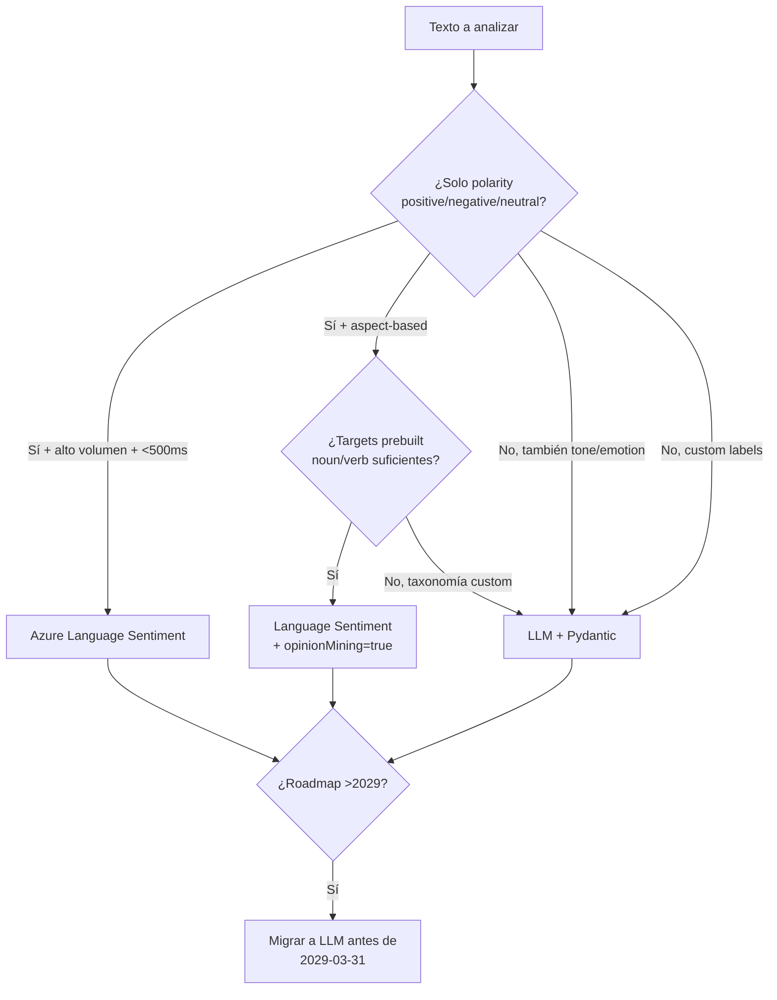

# Sentiment Analysis y Tone Detection con LLM vs Azure AI Language

> [!abstract] TL;DR
> Hay **dos rutas** para análisis afectivo de texto en Azure: **(1) Azure AI Language — Sentiment Analysis + Opinion Mining** (servicio clásico, ahora "Azure Language in Foundry Tools") que devuelve etiquetas fijas `positive | negative | neutral | mixed` con `confidenceScores` que suman 1, por documento y por frase, más **Opinion Mining** = *aspect-based sentiment analysis* con pares **target (noun/verb) + assessment (adjective)** vía flag `opinionMining=true`; **(2) LLM en Azure OpenAI** con Pydantic + `client.beta.chat.completions.parse()` (`response_format=<Model>`), capaz de **sentiment + tone (angry, joyful, sarcastic, formal) + aspect-based + etiquetas custom** en cualquier idioma soportado por el tokenizador. ⚠️ Hito crítico de examen: **Sentiment Analysis y Opinion Mining se retiran de Azure Language el 31 de marzo de 2029**; Microsoft recomienda migrar a **Microsoft Foundry models** (LLM). En AI-103, **"tone" siempre va por LLM** — el servicio classic NO detecta tono. **Sentiment ≠ tone**: polaridad (escalar) vs emoción/estilo (multietiqueta).

## 🎯 Relevancia en el examen

🔥🔥 **Frecuencia media-alta** dentro del dominio D. Lo que Microsoft pregunta:

- **Sentiment vs Tone**: si el escenario pide "detect anger/sarcasm/formality" → LLM. Si pide "positive/negative score" → cualquiera de los dos, pero el classic es la respuesta canónica si exige <500 ms y per-call pricing.
- **Opinion Mining = aspect-based sentiment analysis** en Azure Language: target (noun/verb) + assessment (adjective). Distractores típicos: confundirlo con Key Phrase Extraction o con NER.
- **Flag REST**: `opinionMining=true` (camelCase). En Python SDK: `show_opinion_mining=True` (snake_case con `show_` prefix).
- **Etiquetas exactas**: `positive`, `negative`, `neutral`, `mixed`. La etiqueta **`mixed` SOLO existe a nivel documento**, no a nivel frase. A nivel sentence: `positive | negative | neutral`.
- **Confidence scores** entre 0 y 1 que **suman 1** por item (positive + neutral + negative = 1).
- **Deprecación 31-mar-2029**: tras esa fecha no hay soporte; nueva guidance = LLM (Foundry models).
- **Structured outputs Pydantic** con `client.beta.chat.completions.parse()` y `response_format=Analysis` es el patrón canónico para sentiment+tone+aspects vía LLM.
- **Multilingüe**: classic soporta subset finito (consultar tabla de language support); LLM soporta cualquier idioma del tokenizador sin configuración.
- **Latency / cost tradeoff**: classic <500 ms per-call; LLM 1-3 s per-token.
- **Trampa "hallucinated tone"**: el LLM puede inventar emociones — mitigar con few-shot + lista cerrada de tones permitida vía `Enum`.

## 📖 Concepto en profundidad

### 1. Definiciones quirúrgicas: sentiment vs tone vs emotion

| Concepto | Naturaleza | Cardinalidad | Servicio óptimo |
|---|---|---|---|
| **Sentiment (polarity)** | Escalar discreto sobre eje positivo↔negativo | Mutuamente exclusivo (1 etiqueta) | Language **classic** o LLM |
| **Aspect-based sentiment** | Sentiment **por target** (feature, producto, dimensión) | N targets × 1 sentiment cada uno | Language **Opinion Mining** o LLM |
| **Tone (style/register)** | Estilístico-emocional (formal, sarcastic, urgent, polite) | Multietiqueta | **Solo LLM** |
| **Emotion (affective)** | Categorías psicológicas (angry, joyful, sad, fearful, surprised) | Multietiqueta | **Solo LLM** |

> [!warning] Sentiment ≠ Tone
> Una review puede ser **negativa en sentiment** y **calmada y formal en tone** ("Unfortunately, the product did not meet the documented specifications."). Otra puede ser **positiva en sentiment** y **sarcástica en tone** ("Oh great, another _amazing_ feature that crashes the app."). Microsoft examina exactamente este desfase.

### 2. Azure AI Language — Sentiment Analysis (classic)

#### 2.1 Modelo de etiquetado oficial (verbatim docs)

| Caso de las frases | Etiqueta del documento |
|---|---|
| Al menos una `positive` + resto `neutral` | `positive` |
| Al menos una `negative` + resto `neutral` | `negative` |
| Al menos una `positive` **y** al menos una `negative` | `mixed` |
| Todas las frases `neutral` | `neutral` |

- **Granularidad**: por documento + por sentence.
- **Confidence scores**: `{positive, neutral, negative}` ∈ [0, 1], y **suman 1** por item.
- **Nota crítica**: la etiqueta `mixed` **NO se devuelve a nivel frase**, solo documento. Una frase nunca es "mixed".

#### 2.2 Opinion Mining (aspect-based)

- Es una **feature de Sentiment Analysis**, no un servicio aparte. Equivalente NLP: *Aspect-Based Sentiment Analysis (ABSA)*.
- Modelo: extrae pares **target (sustantivo o verbo) + assessment (adjetivo)** con su propio sentiment.
- Activación REST: `opinionMining=true` en el request.
- Activación Python SDK: `show_opinion_mining=True` en `analyze_sentiment()`.
- **Incluido en el mismo pricing tier** que Sentiment Analysis (sin coste extra).
- Ejemplo canónico de docs: *"The room was great, but the staff was unfriendly."* → targets `{room, staff}` con sentiments `{positive, negative}`.

#### 2.3 Deployment options

| Opción | Cuándo |
|---|---|
| **Microsoft Foundry** (UI) | Exploración, prototipos rápidos |
| **REST API / Azure SDK client library** (C#, Java, JS, Python) | Producción |
| **Docker container** | On-premises, compliance, datos sensibles que no salen del perímetro |

#### 2.4 Asincronía y retención

- Síncrono → stateless, sin almacenamiento, respuesta inmediata.
- Asíncrono → resultados disponibles **24 horas** desde la ingesta; tras eso se purgan.

#### 2.5 Deprecación 2029

> [!danger] Retirement: 31 de marzo de 2029
> Microsoft Learn anuncia: *"Sentiment analysis and opinion mining are retiring from Azure Language effective March 31, 2029. After this date, these features are no longer supported."* Recomendación oficial: migrar a **Microsoft Foundry models** (LLM). Examen: si la pregunta menciona "long-term roadmap" o "future-proof" → LLM.

### 3. LLM approach — sentiment + tone + aspects en una sola llamada

#### 3.1 Por qué LLM gana en flexibilidad

- **Custom labels**: definir taxonomías propias (e.g., `"frustrated_with_billing"`, `"delighted_with_support"`) sin entrenar nada.
- **Tone detection nativa**: pedir simultáneamente `angry | joyful | sarcastic | formal | urgent | polite | …`.
- **Multilingüe sin config**: el modelo razona en cualquier idioma del tokenizador (es, en, fr, de, ja, zh, ar, pt, hi, …).
- **Composición**: sentiment + aspects + tone + summary + entities en un único request.
- **Structured outputs strict**: garantía de schema vía JSON Schema enforcement (modelos `gpt-4o 2024-08-06+`, `gpt-4.1`, `gpt-5*`, o-series).

#### 3.2 Patrón canónico Pydantic (response_format=Model)

```python
from enum import Enum
from pydantic import BaseModel, Field
from openai import OpenAI
from azure.identity import DefaultAzureCredential, get_bearer_token_provider

token_provider = get_bearer_token_provider(
    DefaultAzureCredential(), "https://ai.azure.com/.default"
)
client = OpenAI(
    base_url="https://<resource>.openai.azure.com/openai/v1/",
    api_key=token_provider,
)

class Sentiment(str, Enum):
    POSITIVE = "positive"
    NEGATIVE = "negative"
    NEUTRAL  = "neutral"
    MIXED    = "mixed"

class Tone(str, Enum):
    ANGRY     = "angry"
    FRUSTRATED= "frustrated"
    JOYFUL    = "joyful"
    SARCASTIC = "sarcastic"
    FORMAL    = "formal"
    URGENT    = "urgent"
    POLITE    = "polite"
    NEUTRAL   = "neutral"

class AspectSentiment(BaseModel):
    aspect: str = Field(..., description="Target noun or verb literally present in the text")
    assessment: str = Field(..., description="Adjective/phrase that qualifies the aspect")
    sentiment: Sentiment

class ReviewAnalysis(BaseModel):
    sentiment: Sentiment
    confidence: float = Field(..., ge=0.0, le=1.0)
    tones: list[Tone]                  # multilabel
    aspects: list[AspectSentiment]     # aspect-based
    rationale: str                     # one-line justification

SYSTEM = (
    "You are an expert review analyst. "
    "Extract sentiment, multi-label tone, and aspect-based opinions. "
    "Only use aspects literally present in the text. "
    "Never invent emotions: if no tone applies, return ['neutral']."
)

completion = client.beta.chat.completions.parse(
    model="gpt-4o",          # deployment of gpt-4o version 2024-08-06+
    messages=[
        {"role": "system", "content": SYSTEM},
        {"role": "user",   "content": review_text},
    ],
    response_format=ReviewAnalysis,
    temperature=0,
)

result: ReviewAnalysis = completion.choices[0].message.parsed
```

> [!tip] Mitigación de hallucinated tone
> Cerrar el espacio de tonos con un `Enum` impide que el modelo invente etiquetas (`"meh"`, `"medium-happy"`). Combínalo con `temperature=0` y few-shot de 2-3 ejemplos contrastivos (uno sarcástico, uno formal-negativo, uno entusiasta).

#### 3.3 Few-shot para consistencia

```python
FEWSHOT = [
    {"role": "user",      "content": "Oh great, another amazing feature that crashes."},
    {"role": "assistant", "content": '{"sentiment":"negative","confidence":0.94,"tones":["sarcastic","frustrated"],"aspects":[{"aspect":"feature","assessment":"amazing","sentiment":"negative"}],"rationale":"Sarcasm: positive lexicon contradicting negative behavior."}'},
    {"role": "user",      "content": "Unfortunately, the product did not meet documented specifications."},
    {"role": "assistant", "content": '{"sentiment":"negative","confidence":0.88,"tones":["formal","polite"],"aspects":[{"aspect":"product","assessment":"did not meet","sentiment":"negative"}],"rationale":"Formal register with explicit dissatisfaction."}'}
]
```

### 4. Patrón Azure AI Language SDK — analyze_sentiment con Opinion Mining

```python
from azure.ai.textanalytics import TextAnalyticsClient
from azure.core.credentials import AzureKeyCredential

client = TextAnalyticsClient(
    endpoint="https://<resource>.cognitiveservices.azure.com/",
    credential=AzureKeyCredential("<key>"),
)

documents = [
    "The room was great, but the staff was unfriendly. Breakfast was fine."
]

response = client.analyze_sentiment(
    documents=documents,
    show_opinion_mining=True,   # <-- activa aspect-based
    language="en",              # opcional; default = en
)

for doc in response:
    if doc.is_error:
        print("Error:", doc.error)
        continue
    print(f"Document sentiment: {doc.sentiment}")
    print(f"Doc scores: pos={doc.confidence_scores.positive:.2f} "
          f"neu={doc.confidence_scores.neutral:.2f} "
          f"neg={doc.confidence_scores.negative:.2f}")
    for sentence in doc.sentences:
        print(f"  Sentence ({sentence.sentiment}): {sentence.text!r}")
        for opinion in sentence.mined_opinions:
            t = opinion.target
            print(f"    Target: {t.text!r} ({t.sentiment}) "
                  f"pos={t.confidence_scores.positive:.2f} "
                  f"neg={t.confidence_scores.negative:.2f}")
            for assessment in opinion.assessments:
                print(f"      Assessment: {assessment.text!r} ({assessment.sentiment})")
```

> [!note] Paquete y clase exactos (verificado contra Microsoft Learn)
> - Package pip: **`azure-ai-textanalytics`**.
> - Cliente: **`azure.ai.textanalytics.TextAnalyticsClient`**.
> - Método: **`analyze_sentiment(documents=..., show_opinion_mining=True, language=...)`**.
> - Respuesta jerarquía: `DocumentSentiment` → `.sentences` (`SentenceSentiment`) → `.mined_opinions` → `(target, assessments)`. El **target** y cada **assessment** tienen su propio `sentiment` y `confidence_scores`.

### 5. REST endpoint (referencia rápida)

```http
POST https://<resource>.cognitiveservices.azure.com/language/:analyze-text?api-version=2023-04-01
Content-Type: application/json
Ocp-Apim-Subscription-Key: <key>

{
  "kind": "SentimentAnalysis",
  "parameters": {
    "modelVersion": "latest",
    "opinionMining": true
  },
  "analysisInput": {
    "documents": [
      { "id": "1", "language": "en", "text": "The room was great, but the staff was unfriendly." }
    ]
  }
}
```

> [!warning] camelCase vs snake_case
> En **REST** el flag es `opinionMining` (camelCase). En **Python SDK** es `show_opinion_mining` (con prefix `show_`). En **examen** este pequeño detalle es una trampa habitual: dan un snippet REST mal escrito y piden corregirlo.

## 📊 Tablas comparativas / cuándo usar qué

### Decisión LLM vs Azure AI Language Sentiment



### Matriz capacidades (verificada contra docs)

| Capability | Azure AI Language Sentiment (classic) | LLM (Azure OpenAI) |
|---|---|---|
| Polarity (pos/neg/neu/mixed) | ✅ etiquetas fijas | ✅ via Enum |
| `mixed` label | ✅ solo documento | ✅ libre |
| Confidence scores que suman 1 | ✅ nativo (`confidence_scores`) | ⚠️ requiere prompt explícito |
| Aspect-based (target+assessment) | ✅ Opinion Mining | ✅ via Pydantic |
| **Tone detection** (angry, sarcastic, formal) | ❌ **NO** | ✅ multietiqueta |
| **Emotion detection** | ❌ | ✅ |
| Custom labels (domain-specific) | ❌ | ✅ via Enum/schema |
| Latencia típica | <500 ms | 1-3 s |
| Coste | Per-call (cheap, predictable) | Per-token (depende longitud) |
| Multilingüe | ✅ subset (ver language support) | ✅ amplio (cualquier tokenizable) |
| On-prem (Docker) | ✅ container | ❌ |
| Async batch retención 24 h | ✅ | N/A (síncrono) |
| Long-term support | ❌ retire **2029-03-31** | ✅ |

### Tiempos de respuesta y coste (orden de magnitud)

| Escenario | Classic | LLM gpt-4o |
|---|---|---|
| 1 review corta (200 chars) | ~200-400 ms · 1 transacción | ~1-2 s · ~150 tokens |
| 1 review larga (2 000 chars) | ~400-800 ms · 1 transacción | ~2-4 s · ~700 tokens |
| Batch 100 docs | 1 call async (~segundos) | 100 calls (paralelizar con `asyncio.Semaphore`) |

## 🪤 Trampas del examen

1. **Sentiment ≠ Tone**. Si la pregunta dice "detect sarcasm / anger / formality" la respuesta correcta es **LLM**, NUNCA Azure AI Language Sentiment. El servicio classic **no detecta tono**.
2. **`mixed` solo a nivel documento**. Si el snippet muestra una *sentence* con `sentiment="mixed"` → el snippet es incorrecto. A nivel frase solo hay `positive | negative | neutral`.
3. **Opinion Mining flag es `opinionMining` en REST pero `show_opinion_mining` en Python SDK**. Distractor habitual.
4. **Opinion Mining ≠ Key Phrase Extraction**. Opinion Mining extrae **target + assessment + sentiment**; Key Phrases extrae solo frases salientes sin sentiment ni estructura par.
5. **Retirement 2029-03-31** específicamente para Sentiment + Opinion Mining en Azure Language. Si la pregunta menciona "long-term / future-proof / 2030" → migrar a LLM (Foundry models).
6. **Confidence scores suman 1** por item (`positive + neutral + negative = 1`). Distractores ponen scores que no suman 1.
7. **Structured outputs strict requiere modelos soportados**: `gpt-4o` versión `2024-08-06`+, `gpt-4o` `2024-11-20`, `gpt-4o-mini` `2024-07-18`, `gpt-4.1`, `gpt-5*`, `o1`, `o3*`, `o4-mini`. Versiones anteriores de gpt-4o (e.g., `2024-05-13`) **NO** soportan `response_format=BaseModel` con strict enforcement.
8. **API version mínima** para Structured Outputs: `2024-08-01-preview`; GA `v1`.
9. **Custom labels imposibles en classic**. Si la pregunta pide etiquetas como `"frustrated_with_billing"`, la respuesta es LLM con Enum.
10. **Hallucinated tone**: sin Enum cerrado el LLM puede inventar emociones (`"meh"`, `"medium-happy"`). Mitigar con `Enum` + `temperature=0` + few-shot.
11. **Long text** → si el doc excede contexto eficiente, **chunk + map-reduce** (analizar por chunk y agregar) o **summarize first** y analizar el summary. El classic tiene límites de tamaño del request (consultar `data-limits`) — chunk también allí.
12. **Multilingüe en classic ≠ todos los idiomas**. Existe una tabla finita de idiomas soportados; el examen puede preguntar por un idioma fuera de la lista (ej. swahili) → LLM.
13. **`mined_opinions` viven en `sentence.mined_opinions`, NO en `document`**. La iteración debe ser `for doc → for sentence → for mined_opinion → target + assessments`.
14. **Per-call vs per-token**: para volúmenes muy altos y polaridad simple el classic es **drásticamente más barato**. Para análisis multi-dimensional (sentiment+tone+aspects+custom) el LLM amortiza coste por densidad informativa.
15. **Async classic NO almacena datos persistentemente**: los resultados se purgan a las 24 h. Hay que recogerlos a tiempo.

## 🧠 Mnemotecnia

- **"PNNM"** (Pinkie No-No-Mixed): los 4 sentiment labels en orden de docs → `Positive · Negative · Neutral · Mixed`. **Mixed solo en documento**.
- **"Target + Assessment = Aspect"**: regla del Opinion Mining. Target es **sustantivo o verbo**, Assessment es **adjetivo**.
- **"Tone needs Talk model"**: si piden Tone → necesitas un **modelo conversacional (LLM)**, no el classic.
- **"opinion**M**ining (REST) vs show**\_**opinion**\_**mining (Python)"**: la **M mayúscula** te dice "estás en REST".
- **"2029-03-31"**: marca **fin del classic Sentiment**. Tres dígitos para tres palabras: *Migrate · Move · Modernize*.
- **"Strict ⇒ Schema + Enum + Required + additionalProperties:false + temperature 0"** = receta anti-hallucination de tone.

## 🔗 Conceptos relacionados

- [[text-entities-extraction-llm]] — NER con LLM y comparación con Azure AI Language NER.
- [[text-topics-extraction-llm]] — Topic extraction y clasificación, comparte el patrón Pydantic.
- [[text-structured-json-output]] — Detalle completo de JSON mode vs JSON Schema strict vs function calling.
- [[text-summarization-llm]] — Summarization que precede al análisis de sentiment en docs largos.
- [[text-azure-language-key-phrase]] — Key Phrase Extraction (no confundir con Opinion Mining).

## ❓ Autotest

**1.** Una pregunta del examen describe: "You need to detect whether customer reviews exhibit sarcasm and frustration, in Spanish, French and Japanese, with low-volume traffic." ¿Qué servicio eliges?

- a) Azure AI Language — Sentiment Analysis con `opinionMining=true`.
- b) Azure AI Language — Custom Text Classification.
- c) Azure OpenAI con `client.beta.chat.completions.parse()` y schema Pydantic con `Enum` de tones.
- d) Azure AI Language — Sentiment con Docker container en cada región.

<details><summary>Respuesta</summary>
<b>c)</b>. Solo el LLM detecta <i>tone/emoción</i> (sarcasm, frustration); Azure AI Language Sentiment classic no soporta tone, únicamente polarity. Multilingüe + multi-dimensional + bajo volumen = LLM. El (a) cubriría polarity por aspect pero no sarcasm.
</details>

**2.** Estás llamando al SDK Python `azure-ai-textanalytics`. ¿Qué argumento activa el aspect-based sentiment analysis?

- a) `aspect_based=True`
- b) `opinionMining=True`
- c) `show_opinion_mining=True`
- d) `enable_opinion=True`

<details><summary>Respuesta</summary>
<b>c)</b> <code>show_opinion_mining=True</code>. La camelCase <code>opinionMining</code> es la del request REST. Distractor clásico de AI-103.
</details>

**3.** ¿Cuál de estas afirmaciones sobre los confidence scores devueltos por `analyze_sentiment` es correcta?

- a) Cada score es independiente y pueden sumar más de 1.
- b) Los scores `positive + neutral + negative` suman exactamente 1, por documento y por frase.
- c) Solo se devuelve el score de la etiqueta ganadora.
- d) `mixed` tiene su propio score que se añade al sumatorio.

<details><summary>Respuesta</summary>
<b>b)</b>. Microsoft Learn lo enuncia explícitamente: "the predicted scores associated with the labels (positive, negative, and neutral) add up to 1". <i>Mixed</i> es derivada de la combinación; no tiene score propio.
</details>

**4.** Una review dice: *"The screen quality is stunning, but the battery life is terrible."* Tras llamar a `analyze_sentiment` con `show_opinion_mining=True`, ¿dónde encuentras los pares `(screen, stunning)` y `(battery, terrible)` en la respuesta Python?

- a) `doc.mined_opinions[*].target` y `.assessments`
- b) `doc.sentences[*].mined_opinions[*].target` y `.assessments`
- c) `doc.opinions[*].aspect` y `.adjective`
- d) `doc.entities[*]` con categoría `Opinion`

<details><summary>Respuesta</summary>
<b>b)</b>. La jerarquía es <code>doc → sentences → mined_opinions → (target, assessments)</code>. Las opiniones viven en la <b>sentence</b>, no en el documento.
</details>

**5.** Microsoft anuncia el retirement de Sentiment Analysis y Opinion Mining en Azure Language. ¿Cuál es la fecha exacta y la recomendación oficial?

- a) 2026-12-31 — migrar a Custom Text Classification.
- b) 2027-06-30 — migrar a Conversational Language Understanding.
- c) 2029-03-31 — migrar a Microsoft Foundry models (LLM).
- d) 2030-01-01 — migrar a Azure AI Search semantic ranker.

<details><summary>Respuesta</summary>
<b>c)</b>. Verbatim docs (2026-03-30): retiran las features el <b>31 de marzo de 2029</b> y la recomendación es Microsoft Foundry models.
</details>

**6.** ¿Cuál de los siguientes modelos de Azure OpenAI **NO** soporta `client.beta.chat.completions.parse(..., response_format=PydanticModel)` con strict JSON Schema enforcement?

- a) `gpt-4o` versión `2024-08-06`
- b) `gpt-4.1` versión `2025-04-14`
- c) `gpt-4o` versión `2024-05-13`
- d) `gpt-5` versión `2025-08-07`

<details><summary>Respuesta</summary>
<b>c)</b>. La versión inicial de gpt-4o (<code>2024-05-13</code>) no soporta Structured Outputs strict; el soporte arranca con <code>gpt-4o 2024-08-06</code>. API mínima: <code>2024-08-01-preview</code>.
</details>

## ✅ Control de calidad (auto-rúbrica)

| Dimensión | Nota |
|---|---|
| Completitud (sentiment + tone + aspect-based + classic + LLM + deprecación + tablas + REST + SDK) | **9.5** |
| Exactitud técnica (verbatim: 2029-03-31, etiquetas, opinionMining vs show_opinion_mining, jerarquía mined_opinions, modelos strict) | **9.7** |
| Alineación al examen (trampas reales, distractores, decisión LLM vs classic, deprecación) | **9.5** |
| Claridad pedagógica (TL;DR, mnemónicos, diagramas mermaid, autotest con explicaciones) | **9.4** |

*Verificado a fecha 2026-05-23 contra Microsoft Learn (overview sentiment-opinion-mining ms.date 2026-03-30, how-to call-api ms.date 2025-11-18, structured-outputs ms.date 2026-05-13).*
