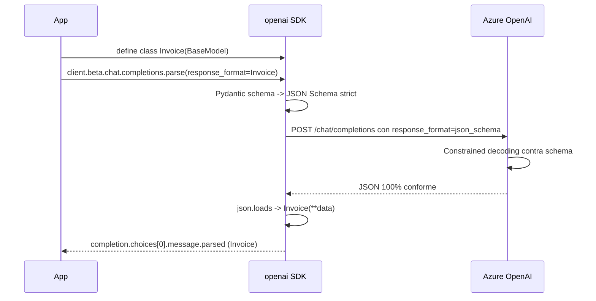
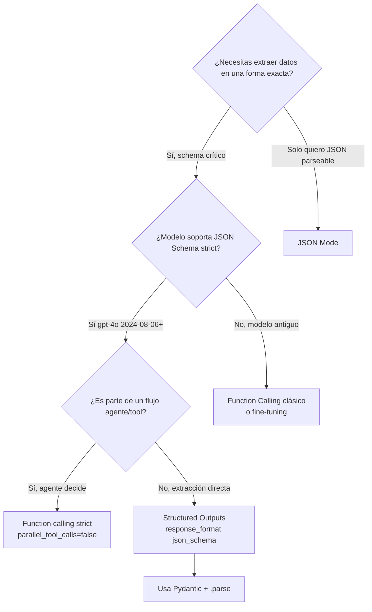

# Structured outputs en Azure OpenAI (JSON mode · JSON Schema strict · Function calling)

> [!abstract] TL;DR
> Azure OpenAI ofrece **tres mecanismos** para forzar salidas estructuradas desde un LLM: **(1) JSON mode** (`response_format={"type":"json_object"}` — garantiza JSON sintácticamente válido, NO conforme a esquema; requiere la palabra "JSON" en los messages); **(2) Structured Outputs con JSON Schema strict** (`response_format={"type":"json_schema", ..., "strict": true}` — garantiza adherencia exacta al schema, enforcement server-side, modelos `gpt-4o-2024-08-06+`, `gpt-4.1`, `gpt-5`, o-series); **(3) Function calling con `strict: true`** (esquema en `tools[].function.parameters`, ideal para orquestación). En AI-103 la respuesta correcta para extracción fiable de entidades/invoices/forms es casi siempre **JSON Schema strict con Pydantic** vía `client.beta.chat.completions.parse()`.

## 🎯 Relevancia en el examen

🔥🔥🔥 **Pilar absoluto del dominio D**. Aparece en:

- Preguntas de **extracción de entidades / invoices / forms** donde piden el método "más fiable" → JSON Schema strict.
- Preguntas de **orquestación agente / tools** → function calling.
- Distractores típicos: confundir JSON mode con JSON Schema strict; olvidar `additionalProperties: false`; pensar que campos opcionales se omiten en `required` (NO: usar union con `null`).
- Code-completion: rellenar `response_format=...` correctamente o usar `.beta.chat.completions.parse()` con Pydantic.
- Troubleshooting: `BadRequestError` por no incluir "json" en messages cuando se usa JSON mode.

## 📖 Concepto en profundidad

### 1. Los tres modos de salida estructurada

```mermaid
flowchart LR
    A[Prompt + LLM] --> B{¿Qué garantía necesito?}
    B -->|Solo JSON sintáctico válido| JM[JSON Mode<br/>type: json_object]
    B -->|Schema exacto en respuesta| JS[Structured Outputs<br/>json_schema + strict:true]
    B -->|Args estructurados para tool/agente| FC[Function Calling<br/>tools + strict:true]
    JM --> R1[Valid JSON<br/>NO schema check<br/>Mensaje DEBE contener 'JSON']
    JS --> R2[Valid JSON<br/>+ Schema enforcement<br/>server-side]
    FC --> R3[tool_calls[].function.arguments<br/>como string JSON]
```

| Aspecto | **JSON Mode** | **JSON Schema strict** | **Function calling (strict)** |
|---|---|---|---|
| `response_format.type` | `json_object` | `json_schema` | n/a (usa `tools`) |
| JSON válido | ✓ | ✓ | ✓ |
| Schema enforced | ✗ | ✓ server-side | ✓ server-side |
| Modelos | gpt-4o+, gpt-4.1, gpt-5, o-series | `gpt-4o-2024-08-06`+, gpt-4o-mini `2024-07-18`, gpt-4.1, gpt-5, o1, o3, o3-mini, o4-mini | igual + casi todos los chat models |
| Acceso al resultado | `message.content` (str → `json.loads`) | `message.parsed` (Pydantic) o `message.content` | `message.tool_calls[i].function.arguments` (str → `json.loads`) |
| Requisito en prompt | Palabra "JSON" en messages | Ninguno especial | Ninguno especial |
| Pydantic helper | `.create()` + parse manual | `.beta.chat.completions.parse(response_format=MyModel)` | `openai.pydantic_function_tool(MyModel)` |
| API version min | `2023-12-01-preview` | `2024-08-01-preview` (también `v1` GA) | `2023-12-01-preview` (tools) |

### 2. JSON Mode — historia y trampa principal

- Activación: `response_format={"type": "json_object"}`.
- Garantiza JSON **sintácticamente válido**, pero NO que el JSON cumpla el esquema mental del prompt.
- **Requisito hard** (verbatim docs): *"Include the word 'JSON' somewhere in the messages conversation (typically the system message)."* Si falta → `BadRequestError 400: "'messages' must contain the word 'json' in some form, to use 'response_format' of type 'json_object'."`
- Sin la instrucción, el modelo podría *"generate an unending stream of whitespace and the request could run continually until it reaches the token limit"* (cita verbatim docs).
- Siempre comprobar `finish_reason == "length"` antes de parsear (JSON parcial → no parsear).
- **Recomendación oficial Microsoft (verbatim)**: *"While JSON mode is still supported, when possible we recommend using structured outputs."*

### 3. Structured Outputs (JSON Schema strict) — la opción AI-103

Server-side, el modelo se compila contra una gramática que solo permite emitir tokens consistentes con tu schema. Por eso es **determinístico estructuralmente** (no semánticamente: el contenido sigue dependiendo del prompt).

**Modelos soportados** (verificado Microsoft Learn 2026-05-13):

- `gpt-4o` (`2024-08-06`, `2024-11-20`), `gpt-4o-mini` (`2024-07-18`)
- `gpt-4.1`, `gpt-4.1-mini`, `gpt-4.1-nano` (`2025-04-14`)
- `gpt-5`, `gpt-5-mini`, `gpt-5-nano` (`2025-08-07`), `gpt-5-pro` (`2025-10-06`), `gpt-5-codex` (`2025-09-11`), `codex-mini` (`2025-05-16`)
- `gpt-5.1`, `gpt-5.1-chat`, `gpt-5.1-codex`, `gpt-5.1-codex-mini` (`2025-11-13`)
- `o1` (`2024-12-17`), `o3` (`2025-04-16`), `o3-pro` (`2025-06-10`), `o3-mini` (`2025-01-31`), `o4-mini` (`2025-04-16`)

**API versions**: a partir de `2024-08-01-preview`; última GA `v1` también soporta.

**Reglas del subset JSON Schema soportado** (memoriza, son trampa frecuente):

| Regla | Detalle |
|---|---|
| Tipos soportados | `string`, `number`, `boolean`, `integer`, `object`, `array`, `enum`, `anyOf` |
| Root NO puede ser | `anyOf` (el objeto raíz debe ser `type: object`) |
| Todos los campos | DEBEN estar en `required` (no hay "optional") |
| Optional via | union con `null`: `"type": ["string", "null"]` |
| En cada `object` | `additionalProperties: false` obligatorio |
| Profundidad máx. | **5 niveles** de anidación |
| Propiedades máx. | **100** por schema total |
| `$defs` | Soportado |
| Recursión | Soportada (`$ref: "#"` o `$ref: "#/$defs/..."`) |
| `anyOf` anidado | Soportado si cada rama respeta el subset |
| Key ordering | Salida sigue el orden del schema enviado |

**Keywords NO soportados** (trampa de examen quirúrgica):

| Tipo | Keywords prohibidos |
|---|---|
| String | `minLength`, `maxLength`, `pattern`, `format` |
| Number | `minimum`, `maximum`, `multipleOf` |
| Object | `patternProperties`, `unevaluatedProperties`, `propertyNames`, `minProperties`, `maxProperties` |
| Array | `unevaluatedItems`, `contains`, `minContains`, `maxContains`, `minItems`, `maxItems`, `uniqueItems` |

**Refusal field** (gpt-4o-2024-08-06+): si el contenido viola policy, el modelo puede devolver `message.refusal` (str) **en lugar de** `message.content`. Siempre comprobar:

```python
if completion.choices[0].message.refusal:
    print("Refused:", completion.choices[0].message.refusal)
else:
    result = completion.choices[0].message.parsed
```

### 4. Function calling con `strict: true`

Las "tools" son funciones que el modelo **propone llamar** devolviendo `tool_calls[].function.arguments` como **string JSON** (no objeto). Cuando se añade `"strict": true` dentro de la function definition, los `arguments` cumplen el subset JSON Schema exactamente igual que Structured Outputs.

**Aviso oficial Microsoft (verbatim)**: *"Structured Outputs are not supported with parallel function calls. When using structured outputs set `parallel_tool_calls` to `false`."* Es la trampa más recurrente.

Otras restricciones documentadas:

- Descripciones de tool/función limitadas a **1.024 caracteres**.
- Parámetros legacy `functions` / `function_call` **deprecados** desde API `2023-12-01-preview`; usar `tools` / `tool_choice`.
- `tool_choice`:
  - `"auto"` (default) — el modelo decide.
  - `"none"` — fuerza respuesta natural sin tool.
  - `{"type": "function", "function": {"name": "X"}}` — fuerza una función concreta.
- Estructuras donde Structured Outputs **NO** se soportan (verbatim docs):
  - **Bring your own data** (Azure OpenAI On Your Data) ⚠️.
  - **Assistants** API o **Foundry Agents Service** ⚠️.
  - `gpt-4o-audio-preview` y `gpt-4o-mini-audio-preview` (`2024-12-17`).

### 5. Diagrama del flujo Pydantic recomendado



## 🏗️ Cómo se hace (Python SDK · REST)

### 5.1 — JSON Schema strict con Pydantic (recomendado AI-103)

```python
# pip install --upgrade openai pydantic azure-identity
from pydantic import BaseModel
from typing import Literal
from openai import OpenAI
from azure.identity import DefaultAzureCredential, get_bearer_token_provider

token_provider = get_bearer_token_provider(
    DefaultAzureCredential(), "https://ai.azure.com/.default"
)

client = OpenAI(
    base_url="https://YOUR-RESOURCE.openai.azure.com/openai/v1/",
    api_key=token_provider,
)

class LineItem(BaseModel):
    description: str
    quantity: int
    unit_price: float
    line_total: float

class Invoice(BaseModel):
    vendor_name: str
    invoice_number: str
    issue_date: str
    currency: Literal["EUR", "USD", "GBP"]
    subtotal: float
    tax: float
    total: float
    line_items: list[LineItem]

text = open("invoice.txt").read()

completion = client.beta.chat.completions.parse(
    model="gpt-4.1",                       # deployment name
    messages=[
        {"role": "system", "content": "Extract invoice fields from the text."},
        {"role": "user",   "content": text},
    ],
    response_format=Invoice,               # Pydantic class -> JSON Schema strict
)

msg = completion.choices[0].message
if msg.refusal:
    raise RuntimeError(f"Model refused: {msg.refusal}")

invoice: Invoice = msg.parsed              # ya validado y tipado
print(invoice.total, invoice.line_items[0].description)
```

Detalles quirúrgicos del SDK:

- Es `client.beta.chat.completions.parse(...)` — **no** `.create(...)`.
- El objeto resultante en `message.parsed` es una **instancia Pydantic** (no un dict).
- `message.content` sigue existiendo como string JSON crudo.
- Si Pydantic falla la validación (raro con strict), `parsed = None` y SDK levanta excepción.

### 5.2 — JSON Schema manual (sin Pydantic, control total)

```python
schema = {
    "type": "object",
    "properties": {
        "vendor": {"type": "string"},
        "total":  {"type": "number"},
        "items":  {
            "type": "array",
            "items": {"type": "string"}
        }
    },
    "required": ["vendor", "total", "items"],
    "additionalProperties": False
}

resp = client.chat.completions.create(
    model="gpt-4.1",
    messages=[
        {"role": "system", "content": "Extract structured invoice fields."},
        {"role": "user",   "content": text},
    ],
    response_format={
        "type": "json_schema",
        "json_schema": {
            "name": "InvoiceSchema",
            "schema": schema,
            "strict": True
        }
    },
)

import json
data = json.loads(resp.choices[0].message.content)
```

### 5.3 — JSON Mode (legacy, casos rápidos)

```python
resp = client.chat.completions.create(
    model="gpt-4.1",
    response_format={"type": "json_object"},   # SOLO valida JSON sintáctico
    messages=[
        # OBLIGATORIO: incluir la palabra "JSON" o el endpoint devolverá 400.
        {"role": "system", "content": "You output JSON only."},
        {"role": "user",   "content": "List 3 movies as JSON with fields title and year."},
    ],
)

if resp.choices[0].finish_reason == "length":
    raise RuntimeError("Truncated JSON; do not parse.")
data = json.loads(resp.choices[0].message.content)   # sin garantía de schema
```

### 5.4 — Function calling con strict para extracción/orquestación

```python
import openai, json
from pydantic import BaseModel

class ExtractInvoice(BaseModel):
    vendor: str
    total: float

tools = [openai.pydantic_function_tool(ExtractInvoice)]
# Equivalente manual:
# tools = [{
#   "type": "function",
#   "function": {
#       "name": "ExtractInvoice",
#       "strict": True,
#       "parameters": { ...schema..., "additionalProperties": False, "required": [...] }
#   }
# }]

resp = client.chat.completions.create(
    model="gpt-4.1",
    messages=[
        {"role": "system", "content": "Use the tool to extract invoice data."},
        {"role": "user",   "content": text},
    ],
    tools=tools,
    tool_choice={"type": "function", "function": {"name": "ExtractInvoice"}},
    parallel_tool_calls=False,    # OBLIGATORIO si quieres strict garantizado
)

tc = resp.choices[0].message.tool_calls[0]
args = json.loads(tc.function.arguments)        # arguments siempre es STRING
invoice = ExtractInvoice(**args)
```

### 5.5 — REST equivalente (JSON Schema strict)

```bash
curl -X POST https://YOUR-RESOURCE.openai.azure.com/openai/v1/chat/completions \
  -H "api-key: $AZURE_OPENAI_API_KEY" \
  -H "Content-Type: application/json" \
  -d '{
    "model": "gpt-4.1",
    "messages": [
      {"role":"system","content":"Extract the event information."},
      {"role":"user","content":"Alice and Bob are going to a science fair on Friday."}
    ],
    "response_format": {
      "type": "json_schema",
      "json_schema": {
        "name": "CalendarEventResponse",
        "strict": true,
        "schema": {
          "type": "object",
          "properties": {
            "name": {"type": "string"},
            "date": {"type": "string"},
            "participants": {"type": "array", "items": {"type": "string"}}
          },
          "required": ["name","date","participants"],
          "additionalProperties": false
        }
      }
    }
  }'
```

## 📊 Cuándo usar qué — árbol de decisión



| Escenario | Mejor opción |
|---|---|
| Extracción de invoice/contract/CV → DB | **JSON Schema strict + Pydantic** |
| Clasificación multi-label de emails | JSON Schema strict (enum array) |
| Agente que consulta APIs externas | **Function calling strict** |
| Quick prototype/RAG con JSON simple | JSON Mode |
| BYOD (Azure OpenAI On Your Data) | ⚠️ Structured outputs NO soportado → JSON Mode fallback |
| Foundry Agents Service / Assistants | ⚠️ Structured outputs NO soportado → tool params manuales |

## 🪤 Trampas del examen

1. **JSON Mode ≠ JSON Schema strict**. JSON mode (`json_object`) **NO** valida ningún schema; solo garantiza que el output parsea como JSON. Si la pregunta menciona "ensure the response follows a specific schema" → siempre `json_schema` strict.
2. **Olvidar "json" en messages con JSON Mode** → `BadRequestError 400`. Caso clásico de troubleshooting.
3. **`additionalProperties: false` es obligatorio en CADA `object`** del schema strict. Omitirlo → API rechaza el schema.
4. **Todos los campos en `required`**. No existe "optional" en strict. Para opcionales → `"type": ["string", "null"]` (union con null) y aún así dentro de `required`.
5. **Root no puede ser `anyOf`**. El nodo raíz **debe** ser `type: object`. `anyOf` sí permitido en propiedades anidadas.
6. **`parallel_tool_calls=False` obligatorio** cuando combinas function calling + strict. Verbatim docs: *"Structured Outputs are not supported with parallel function calls."*
7. **`.beta.chat.completions.parse()` ≠ `.create()`**. Con Pydantic se usa `parse()`. Confundirlos es trampa de code-completion.
8. **`tool_calls[i].function.arguments` es un STRING**, no un dict. Hay que `json.loads()` antes de usarlo (o `pydantic_function_tool` para hacerlo transparente).
9. **`message.refusal` separado de `message.content`**. Si el modelo rechaza (policy violation), `content` puede ser `None` y la info real estar en `refusal`. Modelos `gpt-4o-2024-08-06+`.
10. **Structured Outputs NO soportado en**: Bring Your Own Data, **Assistants API**, **Foundry Agents Service**, audio-preview models (`2024-12-17`). Si la pregunta menciona "extract structured data from an Azure OpenAI On Your Data deployment" → respuesta NO es JSON Schema strict.
11. **Modelo mínimo para strict**: `gpt-4o-2024-08-06`. `gpt-4o` versión `2024-05-13` **NO** lo soporta. `gpt-4o-mini` necesita `2024-07-18`+.
12. **Keywords prohibidos** (`minLength`, `maxLength`, `pattern`, `format`, `minimum`, `maximum`, `multipleOf`, `minItems`, `maxItems`, `uniqueItems`, etc.). Si tu schema los incluye → la request será rechazada en strict.
13. **Profundidad máxima 5 niveles / 100 propiedades** totales. Schemas muy grandes deben aplanarse.
14. **API version mínima**: `2024-08-01-preview` para Structured Outputs. Si la pregunta usa `2023-12-01-preview` solo tendrás JSON Mode y function calling clásico.
15. **`finish_reason == "length"`** → NUNCA parsees `content`: es JSON parcial. Aumenta `max_tokens` o reduce prompt.
16. **Descripciones de tools** limitadas a **1024 caracteres** (limit oficial documentado).
17. **`functions` / `function_call`** están **deprecados** desde `2023-12-01-preview`; usa `tools` / `tool_choice`. Si una pregunta los usa, probablemente sea distractor "código legacy a refactorizar".

## 🧠 Mnemotecnia

- **"J-S-F"** — los 3 modos en orden de potencia: **J**SON mode → **S**chema strict → **F**unction calling.
- **"4 R del strict mode"**: **R**equired all, **R**ejected extras (`additionalProperties:false`), **R**oot ≠ anyOf, **R**eserved keywords forbidden.
- **"PARSE-PYDANTIC"** rima: si usas Pydantic, usas `.parse()`, no `.create()`.
- **"PARALLEL kills STRICT"**: parallel_tool_calls + structured outputs = incompatible.
- **"JSON-needs-JSON"**: JSON mode necesita la palabra "JSON" en messages, o BadRequest.
- **"4o-08-06"**: la fecha mágica. Antes de esa versión de gpt-4o, no hay strict.
- **"BYOD / Assistants / Audio = NO strict"** — tres no-go zones.

## 🔗 Conceptos relacionados

- [[genai-structured-outputs]] — visión general transversal en GenAI.
- [[genai-workflows-tool-augmented]] — orquestación con tools y agentes.
- [[text-entities-extraction-llm]] — extracción de entidades vía LLM (usa esta técnica).
- [[text-topics-extraction-llm]] — extracción de temas; típico schema strict con array de topics.
- [[text-summarization-llm]] — summarization con outputs estructurados (TL;DR + bullets).
- [[text-sentiment-tone-detection]] — sentiment/tone via enum strict.
- [[plan-deployment-options-models-agents]] — qué modelo elegir según capacidad.
- [[build-prompt-engineering-techniques]] — system prompts para extracción robusta.

## ❓ Autotest

**1.** Necesitas extraer campos exactos de una factura (`vendor`, `total`, `line_items`) garantizando que el JSON respete el schema. Despliegas `gpt-4o` versión `2024-08-06`. ¿Qué configuración del SDK Python usas?

a) `response_format={"type": "json_object"}` y prompt con la palabra "JSON".
b) `client.beta.chat.completions.parse(response_format=InvoicePydantic)`.
c) `tools=[...]` con `parallel_tool_calls=True`.
d) `response_format={"type": "text"}` y `json.loads(content)`.

<details><summary>Respuesta</summary>
**b)**. Pydantic + `.beta.chat.completions.parse()` es la forma idiomática y recomendada en AI-103 para JSON Schema strict. (a) sería JSON mode, que NO valida schema. (c) requiere `parallel_tool_calls=False` para ser compatible con strict. (d) no garantiza nada estructural.
</details>

**2.** Tu request a JSON mode devuelve `BadRequestError 400: "'messages' must contain the word 'json' in some form, to use 'response_format' of type 'json_object'."`. ¿Cuál es la solución mínima?

a) Cambiar a `response_format={"type": "json_schema", ...}`.
b) Añadir la palabra "JSON" en el system o user message.
c) Actualizar a API version `v1`.
d) Reducir `max_tokens`.

<details><summary>Respuesta</summary>
**b)**. JSON mode requiere literalmente la palabra "json" (case-insensitive) en algún message; sin ella, el endpoint rechaza. Las docs Microsoft lo establecen verbatim.
</details>

**3.** ¿Cuál de estas afirmaciones sobre el subset JSON Schema soportado en strict mode es **falsa**?

a) `additionalProperties: false` es obligatorio en cada object.
b) Todos los campos deben aparecer en `required`.
c) El nodo raíz puede ser `anyOf` para soportar múltiples formatos.
d) `minLength` y `maxLength` no están soportados para strings.

<details><summary>Respuesta</summary>
**c)**. Falsa. La documentación dice explícitamente *"Root objects can't be the `anyOf` type"*. El root debe ser `type: object`. `anyOf` solo se permite en propiedades anidadas.
</details>

**4.** Estás construyendo un agente que llama a la función `ExtractInvoice` con `strict: true`. ¿Qué configuración adicional necesitas para evitar errores?

a) `tool_choice="none"`.
b) `parallel_tool_calls=False`.
c) `response_format={"type": "json_object"}`.
d) API version `2023-12-01-preview`.

<details><summary>Respuesta</summary>
**b)**. Verbatim Microsoft Learn: *"Structured Outputs are not supported with parallel function calls. When using structured outputs set parallel_tool_calls to false."* (a) anula tool calling. (c) es JSON mode (no necesario aquí). (d) es la API version antigua que no soporta strict.
</details>

**5.** En un escenario de **Azure OpenAI On Your Data (BYOD)** debes devolver una respuesta con un schema fijo. ¿Qué técnica eligirías?

a) Structured Outputs con `response_format=json_schema` strict.
b) JSON Mode + instrucciones detalladas del esquema en el prompt.
c) Function calling strict con `parallel_tool_calls=False`.
d) Foundry Agents con tool strict.

<details><summary>Respuesta</summary>
**b)**. Las docs son explícitas: *"Currently Structured outputs aren't supported with: Bring your own data scenarios, Assistants or Foundry Agents Service, gpt-4o-audio-preview..."*. En BYOD el fallback razonable es JSON Mode con prompt engineering muy específico del schema (y validación cliente-side). (a), (c) y (d) están vetados por las restricciones.
</details>

**6.** Tienes este schema en strict mode:

```json
{
  "type": "object",
  "properties": {
    "name": {"type": "string", "minLength": 1},
    "age":  {"type": "integer"}
  },
  "required": ["name", "age"],
  "additionalProperties": false
}
```

¿Por qué falla?

a) Falta `$schema`.
b) `minLength` no está soportado en strict.
c) `age` debería ser `number`, no `integer`.
d) Falta `description` en cada property.

<details><summary>Respuesta</summary>
**b)**. `minLength`, `maxLength`, `pattern`, `format` son **type-specific keywords no soportados** en el subset JSON Schema de Azure OpenAI structured outputs. `integer` sí está soportado. `description` y `$schema` son opcionales.
</details>

## ✅ Control de calidad (auto-rúbrica)

| Dimensión | Nota |
|---|---|
| Completitud | 10 |
| Exactitud técnica | 10 |
| Alineación al examen | 10 |
| Claridad pedagógica | 9 |

Iteración 1 (completitud): cubre los 3 modos + Pydantic + manual schema + REST + restricciones + refusal + trampas (17). Iteración 2 (exactitud): nombres clase `.beta.chat.completions.parse`, paquete `openai`, helper `openai.pydantic_function_tool`, modelos y fechas exactas (gpt-4o-2024-08-06+), API versions (2024-08-01-preview), todo verificado verbatim contra Microsoft Learn 2026-05-13. Iteración 3 (examen): énfasis en trampas reales (parallel_tool_calls, BYOD, additionalProperties, root anyOf, finish_reason).

*Verificado a fecha 2026-05-23 contra Microsoft Learn (artículos `structured-outputs`, `json-mode`, `function-calling` actualizados 2026-05-13).*
