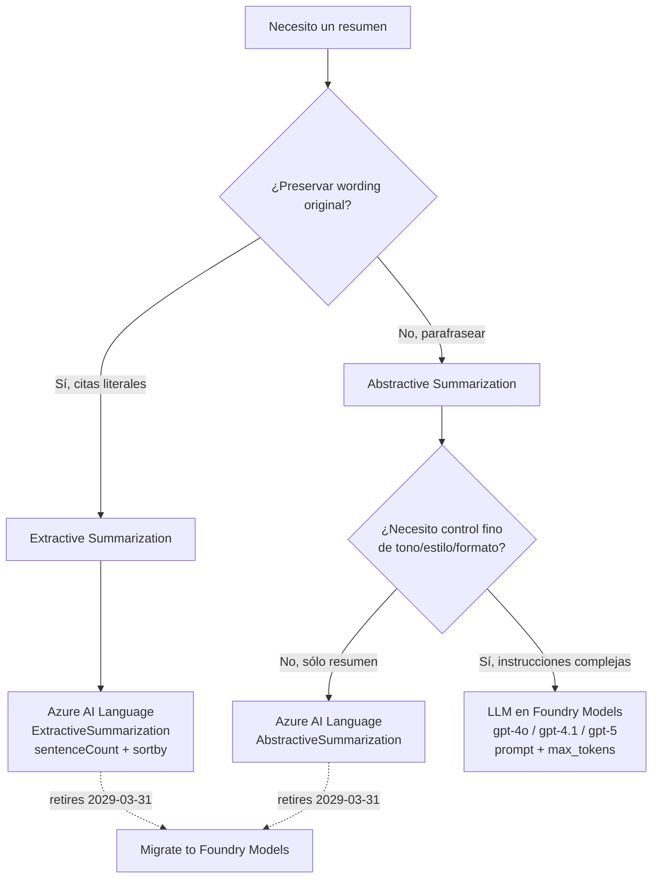
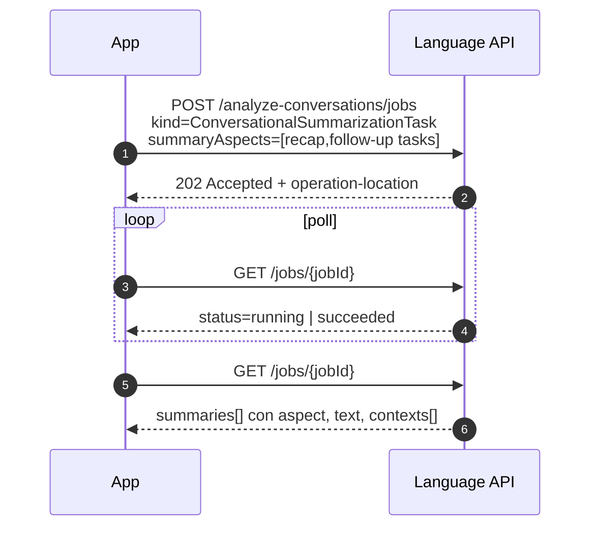
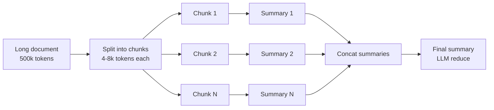
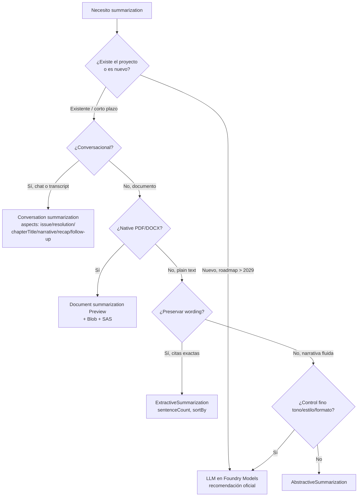

# Summarization de texto con LLMs y Azure AI Language

> [!abstract] TL;DR
> **Summarization en AI-103 vive en dos paradigmas** que el examen distingue quirúrgicamente: **(1) Extractive** — seleccionar las *frases originales* más salientes con un `rankScore` (servicio clásico **Azure AI Language Summarization** dentro de *Foundry Tools*); **(2) Abstractive** — generar texto nuevo coherente, ya sea vía el endpoint `AbstractiveSummarization` del Language service o vía **LLM en Foundry Models** con prompt explícito. Hito crítico: **Azure Language Summarization se retira el 31-marzo-2029**, y Microsoft recomienda **migrar a Foundry Models** desde nuevos proyectos. Patrones LLM canónicos: **length control vía prompt** (no parámetro API), **MapReduce** para documentos que exceden la context window, **style/tone control** por instrucción, **multi-document** por concatenación o map-reduce. Para conversaciones (chat, transcripts speech-to-text) existe `ConversationalSummarizationTask` con cinco *aspects*: `issue`, `resolution`, `chapterTitle`, `narrative`, `recap`, `follow-up tasks`. Evaluación con **ROUGE/BLEU** (referencia) + **LLM-judge** (relevance, faithfulness, conciseness) vía `azure-ai-evaluation`.

## 🎯 Relevancia en el examen

🔥 **Frecuencia media** en el dominio D. Tipos de pregunta:

- **Elegir paradigma**: cuando el escenario pide "preserve original wording" → extractive; "generate a coherent narrative" o "rewrite in plain language" → abstractive (LLM o Language service).
- **Identificar servicio**: pista del aspect (`issue`, `resolution`, `chapterTitle`, `narrative`, `recap`, `follow-up tasks`) ⇒ **Conversation summarization** del Language service. Pista de `.docx` / `.pdf` / `.txt` en blob ⇒ **Native document summarization** (asíncrono con SAS).
- **Length control LLM**: trampa clásica — *no* hay parámetro API "summary_length" en chat completions; se controla vía **prompt + `max_tokens`**.
- **MapReduce**: largo > context window ⇒ partir, summarize cada chunk, summarize los summaries.
- **Retirement**: Azure Language Summarization deja de soportarse **31-mar-2029** → escenarios de "new project" deben ir a Foundry Models.
- **Conversation vs Document**: Conversation acepta `modality: text` (chat) o `modality: transcript` (speech). Document opera sobre *plain text* o native (.docx/.pdf/.txt) en Blob.
- **Evaluación**: ROUGE/BLEU requieren *reference summary*; LLM-judge no, pero introduce coste.

## 📖 Concepto en profundidad

### 1. Dos paradigmas, tres caminos



| Paradigma | Mecánica | Calidad | Coste | Latencia | Cuándo |
|---|---|---|---|---|---|
| **Extractive (Language)** | Selecciona N frases originales con `rankScore` ∈ [0,1] + `offset`/`length` | Fiel pero fragmentaria | Por-call (T0/F0) | ~500 ms-async LRO | Citas legales, auditoría, preservar wording exacto |
| **Abstractive (Language)** | Genera texto nuevo agrupado en `contextualInputRange`s | Coherente, simple | Por-call | Async LRO (segundos) | Resúmenes simples sin control de estilo |
| **LLM (Foundry Models)** | Prompt → generación libre + `max_tokens` | **Máxima**, controlable | Por-token (in + out) | 1-3 s típico | Tono, formato, multi-doc, estilo, idioma, audiencia |

### 2. Azure AI Language Summarization — anatomía del servicio (Foundry Tools)

> [!warning] Retirement crítico
> **Summarization is retiring from Azure Language effective March 31, 2029.** Microsoft recomienda migrar workloads y dirigir **todos los nuevos proyectos a Microsoft Foundry Models**. Si en el examen aparece "new project … long-term roadmap" → Foundry Models. Si aparece "existing production workload" → válido seguir hasta 2029.

El servicio ofrece tres *genres*:

| Genre | Entrada | Endpoint job | Capabilities |
|---|---|---|---|
| **Text summarization** | Plain text (string) | `POST /language/analyze-text/jobs` | Extractive + Abstractive |
| **Conversation summarization** | Lista de `conversationItems` (chat o transcript) | `POST /language/analyze-conversations/jobs` | `issue`, `resolution`, `chapterTitle`, `narrative`, `recap`, `follow-up tasks` |
| **Document summarization** (Preview) | Documentos nativos `.txt` / `.pdf` / `.docx` en Blob (source + target containers, autenticado con **SAS** o **Managed Identity**) | `POST /language/analyze-documents/jobs?api-version=2024-11-15-preview` | Extractive + Abstractive |

**Límites Document summarization**: ≤ 20 docs/request, ≤ 10 MB total. **PDFs escaneados completos, imágenes con texto embebido y tablas en docs escaneados NO se soportan** — pre-procesa con Document Intelligence si hace falta.

**Resultados** disponibles solo **24 h** tras la ingestión.

### 3. Extractive summarization — parámetros quirúrgicos

```http
POST /language/analyze-text/jobs?api-version=2023-04-01
```

```json
{
  "tasks": [{
    "kind": "ExtractiveSummarization",
    "parameters": {
      "sentenceCount": 3,
      "sortBy": "Offset"
    }
  }]
}
```

| Parámetro | Valores | Default | Significado |
|---|---|---|---|
| `sentenceCount` | 1-20 | **3** | Cuántas frases devolver |
| `sortBy` | `Offset` \| `Rank` | **`Offset`** | Orden de devolución |

Respuesta incluye por frase: `text`, `rankScore` ∈ [0,1], `offset`, `length`.

> [!tip] Diferencia con Key Phrase Extraction
> **Key phrase extraction** devuelve *frases nominales* (e.g., "smart brew machine"). **Extractive summarization** devuelve *oraciones completas* con su `rankScore` y posición. No las confundas en el examen.

### 4. Abstractive summarization — task `AbstractiveSummarization`

```json
{
  "tasks": [{
    "kind": "AbstractiveSummarization",
    "taskName": "Text Abstractive Summarization Task 1"
  }]
}
```

Devuelve `summaries[]` con `text` + `contexts[]` (`offset`, `length`) — el modelo puede segmentar inputs largos en múltiples sub-summaries con su rango de origen.

### 5. Conversation summarization — `ConversationalSummarizationTask`

Acepta `modality: "text"` (chat) o `modality: "transcript"` (output del Speech service, con `lexical`, `itn`, `maskedItn`, `audioTimings`). Cada `conversationItem` lleva `role` (`Agent` | `Customer` | …) y `participantId`.

**Aspects** (parámetro `summaryAspects: [...]`):

| Aspect | Descripción verbatim (docs) |
|---|---|
| `issue` | Customer issue en conversación agente-cliente (call center) |
| `resolution` | Soluciones intentadas en la misma conversación |
| `chapterTitle` | Segmenta la conversación y genera un *title* por segmento (suele ir con `narrative`) |
| `narrative` | Genera detail call notes / meeting notes / chat summaries por segmento |
| `recap` | Condensa la conversación entera en *un* párrafo |
| `follow-up tasks` | Action items (devueltos como aspect `"Follow-Up Tasks"` con `@participantId`) |

> [!example] Aspect = `chapterTitle` + `narrative`
> Microsoft los recomienda **combinados** ("usually cowork"): obtienes una tabla de contenido jerárquica con título + cuerpo por capítulo.



### 6. LLM-driven summarization — patrón canónico Foundry Models

El **AI-103 audience profile es Python**. Usa el cliente `openai` (Azure OpenAI) o `azure-ai-inference` para Foundry Models. Length control: **prompt explícito + `max_tokens`**, no hay parámetro `summary_length` en la API.

```python
import os
from openai import OpenAI
from azure.identity import DefaultAzureCredential, get_bearer_token_provider

# Auth con Entra ID (recomendado producción)
token_provider = get_bearer_token_provider(
    DefaultAzureCredential(), "https://ai.azure.com/.default"
)
client = OpenAI(
    base_url=f"https://{os.environ['RESOURCE']}.openai.azure.com/openai/v1/",
    api_key=token_provider,
)

PROMPT_TEMPLATE = """You are a precise summarizer.
Summarize the following text in EXACTLY {length} words.
Preserve factual accuracy. Do NOT introduce information absent from the source.
Output only the summary, no preamble.

Text:
\"\"\"
{text}
\"\"\"
"""

resp = client.chat.completions.create(
    model="gpt-4o",  # deployment name
    messages=[
        {"role": "user", "content": PROMPT_TEMPLATE.format(text=long_text, length=100)}
    ],
    max_tokens=300,         # ceiling de salida, ~ words*1.5 + buffer
    temperature=0.2,        # baja → más fiel
)
summary = resp.choices[0].message.content.strip()
```

### 7. Length & style control — patterns canónicos

| Objetivo | Prompt phrase |
|---|---|
| N frases | `"Summarize in exactly 3 sentences."` |
| N palabras | `"Summarize in approximately 100 words."` |
| TL;DR | `"TL;DR in 1-2 lines."` |
| Bullets | `"Provide a bullet-point summary with 5 bullets."` |
| Audiencia | `"Explain to a 5-year-old."` / `"Summarize for an executive board."` |
| Tono | `"In a professional tone."` / `"In a friendly, casual tone."` |
| Foco | `"Highlight only risks and next steps."` |
| Formato structured | `"Output JSON: {key_points: list[str], risks: list[str]}"` (combina con structured outputs → `response_format=Pydantic`) |

> [!tip] Structured summary con Pydantic
> Para forzar formato (e.g., `{summary, key_points, action_items}`) usa `client.beta.chat.completions.parse(..., response_format=SummaryModel)` (gpt-4o `2024-08-06`+ / gpt-4.1 / gpt-5). Ver `[[text-structured-json-output]]`.

```python
from pydantic import BaseModel

class MeetingSummary(BaseModel):
    tl_dr: str
    key_points: list[str]
    action_items: list[str]
    risks: list[str]

completion = client.beta.chat.completions.parse(
    model="gpt-4o",
    messages=[
        {"role": "system", "content": "Extract a structured meeting summary."},
        {"role": "user", "content": transcript},
    ],
    response_format=MeetingSummary,
)
summary: MeetingSummary = completion.choices[0].message.parsed
```

### 8. MapReduce para documentos > context window

Si tu input supera la context window del modelo (e.g., un libro de 500k tokens contra gpt-4o `128k`), aplica **MapReduce**:



```python
import asyncio
from openai import AsyncOpenAI

aclient = AsyncOpenAI(base_url=..., api_key=...)

def split_into_chunks(text: str, chunk_size_chars: int = 12000, overlap: int = 500):
    """Split por longitud + overlap para preservar contexto en bordes."""
    out, i = [], 0
    while i < len(text):
        out.append(text[i : i + chunk_size_chars])
        i += chunk_size_chars - overlap
    return out

async def summarize(text: str, length_words: int = 150) -> str:
    resp = await aclient.chat.completions.create(
        model="gpt-4o",
        messages=[{
            "role": "user",
            "content": f"Summarize in ~{length_words} words, preserving all facts:\n\n{text}"
        }],
        max_tokens=400,
        temperature=0.2,
    )
    return resp.choices[0].message.content

async def map_reduce_summarize(long_doc: str, final_words: int = 300) -> str:
    chunks = split_into_chunks(long_doc, chunk_size_chars=12000, overlap=500)
    # MAP — concurrencia con semáforo para no saturar TPM
    sem = asyncio.Semaphore(5)
    async def _one(c):
        async with sem:
            return await summarize(c, length_words=200)
    partials = await asyncio.gather(*[_one(c) for c in chunks])
    # REDUCE — resumen de resúmenes (recursivo si N grande)
    joined = "\n\n---\n\n".join(partials)
    if len(joined) > 12000:
        return await map_reduce_summarize(joined, final_words=final_words)
    return await summarize(joined, length_words=final_words)
```

> [!warning] Recursividad y pérdida de información
> Cada nivel de reduce **pierde** detalle. Para evidence-preserving summaries, considera *refine* (iterar chunk → actualizar summary acumulativo) en lugar de MapReduce puro. Ambos son patrones LangChain/LlamaIndex aplicables sobre Azure OpenAI.

### 9. Multi-document summarization

Dos estrategias:

| Estrategia | Cuándo | Pros | Contras |
|---|---|---|---|
| **Concatenar** N docs + un prompt | Total tokens < context window | Una sola llamada, mantiene cross-references | Limitado por context window; coste por-token escala lineal |
| **MapReduce sobre docs** | Total > context window, o quieres pesos | Escalable arbitrariamente; permite filtrar relevantes | Pierde cross-references entre docs en el map |

```python
# Estrategia 1: concat (caso simple)
prompt = "Summarize the following N documents, highlighting common themes and differences:\n\n"
for i, doc in enumerate(docs, 1):
    prompt += f"=== Document {i} ===\n{doc}\n\n"
# llamada normal a chat.completions

# Estrategia 2: map-reduce sobre N docs
async def multi_doc_summarize(docs: list[str]) -> str:
    partials = await asyncio.gather(*[summarize(d, 150) for d in docs])
    combined = "\n\n".join(f"Doc {i+1}: {p}" for i, p in enumerate(partials))
    return await summarize(combined, 400)
```

### 10. Conversation summarization con LLM (alternativa al servicio)

Para chats y transcripts, un LLM moderno hace **mejor** trabajo que el servicio clásico en escenarios complejos (acción items contextualizados, sentiment, decisiones). Patrón:

```python
SYSTEM = """You are an expert meeting summarizer. Given a chat transcript with
participants identified by name, produce:
- 1-paragraph recap
- Bullet list of decisions made
- Bullet list of action items with @owner
- Open questions
Be faithful: do NOT invent facts."""

transcript = "Alice: ...\nBob: ...\nCarol: ..."
resp = client.chat.completions.create(
    model="gpt-4o",
    messages=[
        {"role": "system", "content": SYSTEM},
        {"role": "user", "content": transcript},
    ],
)
```

### 11. Evaluación de summaries

Tres aproximaciones, combinables:

| Métrica | Necesita reference? | Mide | Caveat |
|---|---|---|---|
| **ROUGE-N** (1, 2, L) | ✅ Sí | Overlap de n-gramas summary vs reference | Penaliza paráfrasis correcta; sesgo a extractive |
| **BLEU** | ✅ Sí | Precision de n-gramas (heredado MT) | Idem; menos usado para summarization que ROUGE |
| **LLM-judge** | ❌ No | Relevance, faithfulness, conciseness, coherence (1-5) | Coste extra; sesgo del judge; reproducibilidad |
| **Human eval** | ❌ No | Gold standard | Caro, lento |

**SDK Foundry**: `azure-ai-evaluation` ofrece evaluators built-in (`RelevanceEvaluator`, `CoherenceEvaluator`, `GroundednessEvaluator`, …) y permite custom evaluators via prompty. Ver `[[genai-evaluation-quality-safety]]`.

```python
from azure.ai.evaluation import evaluate, RelevanceEvaluator, CoherenceEvaluator

result = evaluate(
    data="eval_data.jsonl",  # {query, response, ground_truth}
    evaluators={
        "relevance": RelevanceEvaluator(model_config=...),
        "coherence": CoherenceEvaluator(model_config=...),
    },
)
```

## 🏗️ Cómo se hace — receta end-to-end

### A. Document summarization (Language service, native PDF en Blob)

```bash
# 1) Subir PDF a source container; preparar target container; generar SAS URLs (read+list, write+list)
# 2) POST job
curl -X POST "https://<lang-endpoint>/language/analyze-documents/jobs?api-version=2024-11-15-preview" \
  -H "Content-Type: application/json" \
  -H "Ocp-Apim-Subscription-Key: <key>" \
  -d '{
    "tasks": [{
      "kind": "ExtractiveSummarization",
      "parameters": {"sentenceCount": 6}
    }],
    "analysisInput": {
      "documents": [{
        "source": {"location": "https://<acct>.blob.core.windows.net/source/doc.pdf?<SAS>"},
        "targets": {"location": "https://<acct>.blob.core.windows.net/target?<SAS>"}
      }]
    }
  }'
# Devuelve 202 + operation-location → polling GET con el jobId
```

### B. Conversation summarization (text chat, recap + follow-up)

```python
import requests, time

endpoint = "https://<lang-endpoint>"
headers = {"Ocp-Apim-Subscription-Key": "<key>", "Content-Type": "application/json"}
body = {
  "displayName": "ConvSum",
  "analysisInput": {
    "conversations": [{
      "id": "c1", "language": "en", "modality": "text",
      "conversationItems": [
        {"id": "1", "role": "Agent", "participantId": "A1", "text": "Hello, ..."},
        {"id": "2", "role": "Customer", "participantId": "C1", "text": "Hi, ..."},
      ]
    }]
  },
  "tasks": [{
    "taskName": "t1",
    "kind": "ConversationalSummarizationTask",
    "parameters": {"summaryAspects": ["recap", "follow-up tasks"]}
  }]
}
r = requests.post(f"{endpoint}/language/analyze-conversations/jobs?api-version=2023-11-15-preview",
                  headers=headers, json=body)
op_loc = r.headers["operation-location"]
while True:
    j = requests.get(op_loc, headers=headers).json()
    if j["status"] in ("succeeded", "failed"): break
    time.sleep(2)
```

### C. LLM summarization (Foundry Models, structured + map-reduce)

Ver snippets §6, §7, §8 arriba — patrón canónico para AI-103.

## 📊 Cuándo usar qué — árbol de decisión



## 🪤 Trampas del examen

1. **Extractive ≠ Abstractive**. Extractive devuelve **frases originales** con `rankScore` y `offset`; Abstractive **genera** texto nuevo con `contexts[]`. El examen testa si entiendes el output schema.
2. **Retirement 31-mar-2029**: si el escenario habla de "long-term", "new project", "future-proof" → **Foundry Models LLM**, no Azure Language Summarization. Pista verbatim Microsoft Learn.
3. **`sortBy` default = `Offset`**, no `Rank`. Si la pregunta dice "return sentences in original order" → ya es el default; si dice "most relevant first" → explicitar `sortBy: "Rank"`.
4. **`sentenceCount` rango 1-20, default 3.** Pedir 25 falla.
5. **No hay parámetro `summary_length` en chat completions LLM** — se controla con **prompt + `max_tokens`**. Trampa típica preguntando qué API param usar.
6. **Conversation summarization aspects literalmente**: `issue`, `resolution`, `chapterTitle`, `narrative`, `recap`, `follow-up tasks`. Memoriza los seis. El `follow-up tasks` se devuelve con aspect `"Follow-Up Tasks"` (PascalCase con guión).
7. **`modality`** en conversation: `text` (chat logs) vs `transcript` (output Speech-to-Text con `lexical`/`itn`/`audioTimings`). Confundirlos rompe la request.
8. **Native document summarization es Preview** (api-version `2024-11-15-preview`), requiere **Blob storage** source + target con **SAS o Managed Identity**, **≤ 20 docs / ≤ 10 MB** por request, y **resultados purgados a las 24 h**.
9. **PDFs escaneados, imágenes con texto y tablas en docs escaneados NO se soportan** en Document summarization. Necesitas Document Intelligence Layout primero. Cross-ref: `[[E.1-Document-Intelligence]]`.
10. **MapReduce pierde información** en el reduce; usa **refine** (iterativo, acumulando) si el escenario exige fidelidad alta o quotes literales.
11. **ROUGE/BLEU necesitan reference summary** (gold). Si no tienes referencias, usa **LLM-judge** (`RelevanceEvaluator`, `CoherenceEvaluator`, `GroundednessEvaluator` del `azure-ai-evaluation`).
12. **Hallucinations**: incluso con `temperature=0.2`, un LLM puede inventar hechos en el summary. Mitigaciones: prompt explícito ("do NOT add information"), `GroundednessEvaluator`, post-verificación NLI.
13. **Coste escala con input + output tokens** en LLM; el Language service factura **por record** (5,000 chars = 1 record). Para batches grandes, Language puede ser más barato si el caso encaja en su capability.
14. **Resultados Language API se purgan a las 24 h** — siempre persistir el output en tu storage.
15. **Foundry resource vs single-service Language resource**: Document summarization (Preview) hoy requiere **single-service Language resource**, **no** un multi-service Foundry resource. Sutileza importante.

## 🧠 Mnemotecnia

- **"E-A-C-D"**: Extractive, Abstractive, Conversation, Document. Los cuatro genres/tareas de Azure Language Summarization.
- **"I-R-C-N-R-F"** (aspects conversation): **I**ssue · **R**esolution · **C**hapterTitle · **N**arrative · **R**ecap · **F**ollow-up. "*I'd Rather Chat Now, Really? Fine.*"
- **"3-20-Offset"**: `sentenceCount` default 3, max 20, `sortBy` default `Offset`.
- **"20-10-24"**: Document summarization → 20 docs max, 10 MB max, 24 h disponibilidad.
- **"2029-03-31"**: deadline retirement. "*Two thousand twenty-nine, march thirty-one — summarization done.*"
- **MapReduce mental model**: *"Map a thousand pages, reduce to one page."*

## 🔗 Conceptos relacionados

- `[[text-structured-json-output]]` — `response_format=Pydantic` para forzar JSON en summaries
- `[[text-entities-extraction-llm]]` — extracción NER complementaria
- `[[text-topics-extraction-llm]]` — topic modeling sobre el mismo input
- `[[text-sentiment-tone-detection]]` — combinar summary con sentiment
- `[[text-azure-language-key-phrase]]` — alternativa más simple que extractive summarization
- `[[genai-evaluation-quality-safety]]` — `RelevanceEvaluator`, `GroundednessEvaluator`, ROUGE custom
- `[[B.2-Azure-OpenAI-Foundation]]` — gpt-4o / gpt-4.1 / gpt-5 deployments
- `[[E.1-Document-Intelligence]]` — Layout para pre-procesar PDFs escaneados antes de summarization

## ❓ Autotest

**1.** Un cliente bancario necesita resumir contratos PDF largos (50-200 páginas) preservando wording exacto de cláusulas, para fines de auditoría legal. ¿Qué eliges?

- a) Abstractive summarization en Foundry Models con `temperature=0`
- b) ExtractiveSummarization del Language service con `sentenceCount=20`
- c) MapReduce con gpt-4o
- d) `RelevanceEvaluator` del `azure-ai-evaluation`

<details><summary>Respuesta</summary>

**b)**. Auditoría legal exige **citas literales** → extractive paradigm (frases originales con `offset`/`length`/`rankScore`). Abstractive (a, c) genera paráfrasis que pierde validez legal. (d) es un evaluator, no un summarizer.

</details>

**2.** En `ConversationalSummarizationTask`, ¿qué `summaryAspects` combinarías para generar una tabla de contenido jerárquica de una reunión larga (título + cuerpo por sección)?

- a) `["recap"]`
- b) `["issue", "resolution"]`
- c) `["chapterTitle", "narrative"]`
- d) `["follow-up tasks"]`

<details><summary>Respuesta</summary>

**c)**. Microsoft documenta que **`chapterTitle` y `narrative` "usually cowork"**: segmenta la conversación en capítulos, genera título y narrativa por cada uno. `recap` da **un solo párrafo** (no jerárquico). `issue`/`resolution` son call-center específicos.

</details>

**3.** Estás resumiendo un documento de 500.000 tokens con gpt-4o (context window 128k). ¿Qué patrón aplicas?

- a) Aumentar `max_tokens` a 500.000
- b) Usar Abstractive summarization del Language service
- c) MapReduce: chunking → summarize en paralelo → reduce de los summaries
- d) Pasar `summary_length=300` al SDK

<details><summary>Respuesta</summary>

**c)**. La context window de gpt-4o no admite 500k tokens, así que troceas (map), resumes cada chunk en paralelo (con `Semaphore` para TPM), y luego ejecutas un summarize de los summaries (reduce). (a) `max_tokens` es para salida, no entrada. (b) Language service también tiene límite. (d) no existe ese parámetro.

</details>

**4.** Un cliente quiere lanzar un **nuevo** proyecto de summarization en Q3-2026 con visión a 5 años. ¿Qué recomendación oficial Microsoft?

- a) Usar Azure AI Language Summarization (estable, GA)
- b) Migrar a Microsoft Foundry Models (LLM-based), porque Language Summarization retires 2029-03-31
- c) Usar Custom Text Classification con etiquetas "summary"
- d) Esperar a que GA Native Document Summarization

<details><summary>Respuesta</summary>

**b)**. Cita verbatim Microsoft Learn: *"Summarization is retiring from Azure Language effective March 31, 2029. … we recommend that users migrate existing workloads and direct all new projects to Microsoft Foundry models."*

</details>

**5.** ¿Cuáles son los límites de Document summarization (native PDF/DOCX/TXT)?

- a) 100 docs / 100 MB / 7 días
- b) 20 docs / 10 MB / 24 horas
- c) 50 docs / 50 MB / 48 horas
- d) Ilimitado

<details><summary>Respuesta</summary>

**b)**. Verbatim docs: **Total number of documents per request ≤ 20**, **Total content size per request ≤ 10 MB**, **resultados disponibles 24 h** y luego purgados.

</details>

## ✅ Control de calidad (auto-rúbrica)

| Dimensión | Nota | Justificación |
|---|---|---|
| Completitud | **9.5** | Cubre los dos paradigmas, los tres genres del Language service, los seis aspects de conversation, el patrón LLM completo (length/style/MapReduce/multi-doc), evaluación, retirement, límites. |
| Exactitud técnica | **9.5** | Todos los nombres verificados (`AbstractiveSummarization`, `ExtractiveSummarization`, `ConversationalSummarizationTask`, aspects literales, `sentenceCount` 1-20, `sortBy` default `Offset`, api-versions `2023-04-01`/`2023-11-15-preview`/`2024-11-15-preview`, deadline 2029-03-31, límites 20/10/24). Snippet structured outputs alineado con docs `gpt-4o 2024-08-06`. |
| Alineación al examen | **9** | 15 trampas reales, árbol de decisión, mnemónicos, 5 preguntas estilo examen con explicación, énfasis en distinguir paradigmas y servicios. |
| Claridad pedagógica | **9** | Tablas comparativas, mermaid (flowchart, sequence, decision tree), código Python ejecutable, callouts warning/tip/example, mnemónicos memorables. |

*Verificado a fecha 2026-05-23 contra Microsoft Learn (Azure AI Language Summarization overview, Document summarization how-to, Conversation summarization how-to, Foundry OpenAI structured outputs).*
