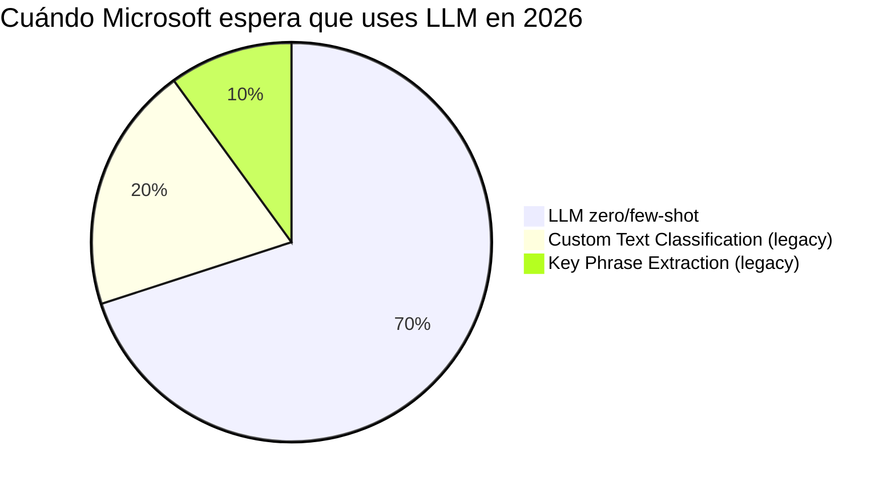

# Topic extraction y topic modeling con LLMs

> [!abstract] TL;DR
> Topic extraction es el acto de **identificar temas / categorías** presentes en un texto. AI-103 lo aborda en dos paradigmas: **(1) Classification** (taxonomía cerrada → asigna tema(s)) y **(2) Extraction** (descubrimiento abierto → inventa los temas). Hoy, la vía recomendada por Microsoft es **LLMs (Azure OpenAI en Foundry Models) con Structured Outputs (Pydantic + `response_format`)**, porque tanto **Custom Text Classification** como **Key Phrase Extraction** de Azure AI Language están **retirándose el 31-marzo-2029** y la propia documentación oficial recomienda migrar a Foundry models. Tres claves de examen: zero-shot LLM vs. custom classification entrenado, schema-locked output con `strict: true` + `additionalProperties: false`, y evaluación con F1 por clase.

## 🎯 Relevancia en el examen

| Tipo de pregunta | Escenario típico | Frecuencia |
|---|---|---|
| Decisión LLM vs. AI Language | "Tienes 5 categorías fijas y 200 docs etiquetados. ¿Qué usas?" → Custom Text Classification. "Sin datos etiquetados, 50+ categorías cambiantes" → LLM zero-shot. | 🔥🔥🔥 |
| Diseño de schema Pydantic | Identificar el bloque correcto: `response_format=MyModel` con `.beta.chat.completions.parse()` | 🔥🔥🔥 |
| Limitaciones structured outputs | "¿Por qué falla mi schema?" → falta `additionalProperties: false`, profundidad > 5, no todos `required`. | 🔥🔥 |
| Multilingüe | LLM resuelve nativamente; AI Language Custom Classification depende de idioma del proyecto. | 🔥🔥 |
| Coste y latencia | Per-token (LLM) vs. per 1000 text records (AI Language). | 🔥 |

## 📖 Concepto en profundidad

### Definiciones quirúrgicas

- **Topic classification** (modo cerrado, *closed-set*): dada una **taxonomía predefinida** (ej. `[finance, technology, healthcare, sports, politics, entertainment]`), el modelo asigna **uno o varios temas** de esa lista al texto.
- **Topic extraction** (modo abierto, *open-set*): el modelo **descubre y nombra** los temas sin lista previa. Output libre.
- **Topic modeling** (clásico estadístico, ej. LDA): no examinable en AI-103 directamente — Microsoft ya no lo promueve; mencionado solo como contraste histórico.
- **Key phrase extraction**: feature de Azure AI Language que devuelve **frases concretas del texto** (substrings), no temas abstractos. ⚠️ Distinto de topic extraction: "wonderful staff" es key phrase; "customer satisfaction" sería topic.

### Cambio de paradigma 2026: deprecación de los servicios "clásicos"

> [!warning] Retirement crítico — verbatim Microsoft Learn
> **"Custom text classification is retiring from Azure Language effective March 31, 2029. … we recommend that users migrate existing workloads and direct all new projects to Microsoft Foundry models, which offer enhanced capabilities for natural language understanding."**
>
> Idéntico aviso aplica a **Key phrase extraction** (también retira 31-mar-2029).
>
> Implicación para AI-103: el **camino preferente y examinable** es **LLM + structured outputs**. Las features clásicas son carryover AI-102 a efectos de comparación y compatibilidad legacy.

### Diagrama mental del flujo de decisión

```mermaid
flowchart TD
    A[Texto de entrada] --> B{¿Tengo taxonomía<br/>fija y conocida?}
    B -->|Sí| C{¿Tengo dataset<br/>etiquetado ≥ 50 docs/clase?}
    B -->|No, descubrir| D[LLM extraction mode<br/>open-set]
    C -->|Sí, taxonomía estable| E[Custom Text Classification<br/>⚠️ EOL 2029-03-31]
    C -->|No / cambia rápido| F[LLM classification mode<br/>zero-shot con taxonomía en prompt]
    F --> G[Structured output<br/>Pydantic + response_format]
    D --> G
    E --> H[REST Authoring + Runtime APIs]
    G --> I[topics: List[Topic]<br/>JSON validado]
```

### Anatomía de la respuesta LLM

Una salida estructurada típica encapsula:

| Campo | Tipo | Para qué examina Microsoft |
|---|---|---|
| `topics` | `list[Topic]` | Multi-label / multi-topic |
| `Topic.name` | `str` | Nombre canónico del tema |
| `Topic.keywords` | `list[str]` | Evidencia léxica (≈ key phrases) |
| `Topic.confidence` | `float [0,1]` | Para *thresholding* downstream |
| `primary_topic` | `str` | Para single-label fallback |

## 🏗️ Cómo se hace

### Patrón 1 · LLM Extraction mode (open-set) con Pydantic + Structured Outputs

```python
# pip install openai>=1.42.0 pydantic>=2.8.2 azure-identity
from pydantic import BaseModel, Field
from openai import OpenAI
from azure.identity import DefaultAzureCredential, get_bearer_token_provider

token_provider = get_bearer_token_provider(
    DefaultAzureCredential(), "https://ai.azure.com/.default"
)

client = OpenAI(
    base_url="https://YOUR-RESOURCE-NAME.openai.azure.com/openai/v1/",
    api_key=token_provider,
)

class Topic(BaseModel):
    name: str = Field(..., description="Canonical short name of the topic")
    keywords: list[str] = Field(..., description="Up to 5 evidence terms from the text")
    confidence: float = Field(..., ge=0.0, le=1.0)

class TopicResult(BaseModel):
    topics: list[Topic]
    primary_topic: str

text = "Acme Corp reported a 12% revenue increase driven by cloud migrations..."

completion = client.beta.chat.completions.parse(
    model="gpt-4o",   # deployment name; structured outputs requires gpt-4o 2024-08-06+
    messages=[
        {"role": "system",
         "content": "You are a topic discovery assistant. Extract 1-5 main topics. Use lowercase, hyphenated topic names."},
        {"role": "user", "content": f"Extract main topics:\n{text}"},
    ],
    response_format=TopicResult,
)

result: TopicResult = completion.choices[0].message.parsed
for t in result.topics:
    print(t.name, t.keywords, t.confidence)
```

### Patrón 2 · LLM Classification mode (closed-set / taxonomía)

```python
TAXONOMY = ["finance", "technology", "healthcare", "sports", "politics", "entertainment"]

class ClassifiedTopic(BaseModel):
    topic: str  # MUST be in TAXONOMY (validar post-parse)
    score: float

class ClassificationResult(BaseModel):
    topics: list[ClassifiedTopic]    # multi-label
    primary: str                     # single-label fallback

PROMPT = f"""Assign one or more topics ONLY from this exact list:
{TAXONOMY}

Return JSON with all matching topics and a primary topic.
Text:
{{text}}"""

completion = client.beta.chat.completions.parse(
    model="gpt-4o",
    messages=[{"role": "user", "content": PROMPT.format(text=text)}],
    response_format=ClassificationResult,
)

result = completion.choices[0].message.parsed
# Post-validation hardening: drop hallucinations outside taxonomy
result.topics = [t for t in result.topics if t.topic in TAXONOMY]
```

> [!tip] Por qué Pydantic + `response_format` y no JSON mode
> **JSON mode** garantiza JSON válido pero **no adherencia al schema**. **Structured Outputs** con `strict: true` (implícito al pasar Pydantic) garantiza la **forma exacta**. Microsoft lo recomienda explícitamente para *"function calling, extracting structured data, and building complex multi-step workflows"*.

### Patrón 3 · Multi-document topic discovery (MapReduce pattern)

```python
class DocTopics(BaseModel):
    doc_id: str
    topics: list[str]

class CorpusThemes(BaseModel):
    recurring_themes: list[str]
    per_doc: list[DocTopics]

# Map: per-doc extraction (loop sobre docs, llamada por doc)
# Reduce: una sola llamada con los outputs concatenados
reduce_prompt = "Across these per-document topic lists, identify 3-7 recurring themes:\n" + per_doc_dump

completion = client.beta.chat.completions.parse(
    model="gpt-4o",
    messages=[{"role": "user", "content": reduce_prompt}],
    response_format=CorpusThemes,
)
```

### Patrón 4 (legacy / comparativa) · Custom Text Classification de Azure AI Language

```python
# pip install azure-ai-textanalytics --pre
from azure.ai.textanalytics import TextAnalyticsClient
from azure.core.credentials import AzureKeyCredential

client = TextAnalyticsClient(
    endpoint="https://<lang-resource>.cognitiveservices.azure.com/",
    credential=AzureKeyCredential("<key>"),
)

poller = client.begin_single_label_classify(
    documents=[text],
    project_name="my-topic-project",
    deployment_name="production",
)
result = list(poller.result())
# Cada doc → list[ClassificationCategory(category, confidence_score)]
```

> [!warning] AI-102 carryover ⚠️
> Custom Text Classification es **AI-102 carryover** y está marcado para **retirada 2029-03-31**. Aparece en el examen para preguntas de **migración** ("¿qué reemplaza a X?") y de **decisión** ("¿cuándo aún tiene sentido?": cuando ya hay un proyecto entrenado en producción y no se migra hasta EOL).

## 📊 Tabla comparativa decisiva

| Dimensión | LLM (Foundry Models) | Custom Text Classification (AI Language) | Key Phrase Extraction (AI Language) |
|---|---|---|---|
| Modo | Open-set y closed-set | Closed-set (taxonomía definida) | Open-set (frases del texto) |
| Entrenamiento | Zero-shot / few-shot | **Requerido** (label data → train → deploy) | No (pretrained) |
| Multilingüe | Nativo (gpt-4o ≈ 90+ idiomas) | Por proyecto (un idioma principal) | Pretrained multi-language |
| Output | JSON schema-locked (Pydantic) | `ClassificationCategory(category, confidence_score)` | `key_phrases: list[str]` |
| Coste | **Per-token** (input + output) | Per-1000 text records + training/hosting | Per-1000 text records |
| Personalización taxonomía | Cambiar el prompt | Reentrenar el modelo | No personalizable |
| Riesgo principal | **Hallucinación** de topics fuera de taxonomía | Sesgos del dataset etiquetado | Frases ruidosas / sin abstracción |
| Tipos de proyecto | N/A | **Single-label** o **Multi-label** | N/A |
| Estado 2026 | Recomendado, vía oficial | ⚠️ **Retira 2029-03-31** | ⚠️ **Retira 2029-03-31** |
| Cuándo usar | Sin dataset, taxonomía fluida, multilingüe, baja latencia operativa | Taxonomía estable, dataset etiquetado disponible, control fino, hasta 2029 | Resúmenes léxicos rápidos, indexing |



## 🪤 Trampas del examen

1. **Classification ≠ Extraction.** Si el enunciado dice *"de esta lista de 6 categorías"* → classification. Si dice *"descubrir temas"* → extraction. Microsoft prueba la lectura literal.
2. **Structured Outputs exige `additionalProperties: false`, todos los campos en `required` y profundidad ≤ 5 niveles / ≤ 100 propiedades.** Si te muestran un schema con `"required": ["x"]` y faltan otras propiedades → falla.
3. **`parallel_tool_calls` debe ser `false`** cuando combinas Structured Outputs con function calling. Microsoft lo marca explícitamente.
4. **JSON mode ≠ Structured Outputs.** JSON mode da "JSON válido"; Structured Outputs da "JSON válido conforme al schema". Distinguir.
5. **`response_format=PydanticModel` requiere `client.beta.chat.completions.parse()`**, NO `.create()`. El método `.create()` no des-serializa a `.parsed`.
6. **Modelos soportados Structured Outputs** (verbatim Microsoft Learn): `gpt-4o 2024-08-06`, `gpt-4o-mini 2024-07-18`, `gpt-4.1`/`-mini`/`-nano` (2025-04-14), `o1`, `o3`, `o3-mini`, `o3-pro`, `o4-mini`, `gpt-5`, `gpt-5-mini`, `gpt-5-nano`, `gpt-5-codex`, `gpt-5-pro`, `gpt-5.1`, `gpt-5.1-chat`, `gpt-5.1-codex`, `codex-mini`. ⚠️ **NO** funciona con `gpt-4o-audio-preview`, ni con **Bring Your Own Data** (BYOD), ni con **Assistants** ni **Foundry Agents Service**.
7. **API version mínima**: `2024-08-01-preview`. También funciona en la API `v1` GA. Versiones anteriores → error.
8. **Custom Text Classification soporta dos tipos**: Single-label (una clase por doc) y Multi-label (varias). El enunciado típico de trampa: "una película puede ser Comedy y Romance → ¿qué tipo de proyecto?" → **Multi-label**.
9. **Custom Text Classification y Key Phrase Extraction retiran el 31-marzo-2029.** Si la pregunta es "nuevo proyecto en 2026", Microsoft espera la respuesta **LLM**. Si es "mantengo prod legacy", AI Language sigue válido hasta EOL.
10. **Multilingüe**: LLM clasifica nativamente cross-lingual. Custom Text Classification requiere especificar idioma del proyecto. Trampa: "documentos en EN/ES/JA mezclados" → LLM, no Custom Text Classification.
11. **Hallucinated topics** en classification mode: el LLM puede inventar categorías fuera de la taxonomía. **Mitigación examinable**: post-validation (filtro `if t in TAXONOMY`) y/o `enum` en el JSON Schema. Sin esto, garantía de schema ≠ garantía de valores.
12. **Evaluación**: F1 por clase, macro-F1, y matrices de confusión. Para multi-label se usa **micro-F1** o **sample-F1**, no accuracy plana. Trampa frecuente: "accuracy" en multi-label es engañosa.
13. **Coste**: LLM cobra **por token (input + output)**; AI Language cobra **por 1000 text records**. Para corpus enormes con taxonomía estable, AI Language sigue siendo más barato hasta EOL — pero ya no es la recomendación de Microsoft.
14. **Key Phrase Extraction NO es topic extraction.** Devuelve substrings literales ("wonderful staff"), no abstracciones temáticas ("customer-satisfaction"). Trampa de vocabulario clásica.
15. **Custom Text Classification** se invoca con `begin_single_label_classify` o `begin_multi_label_classify` (long-running operation poller). No es síncrona como otras features de Language.

## 🧠 Mnemotecnia

- **CEMSC** — los 5 ejes para decidir LLM vs. Custom:
  **C**ategorías estables · **E**tiquetas disponibles · **M**ultilingüe · **S**chema strictness · **C**oste por volumen.
- **"strict, required, no extras, ≤ 5"** — los cuatro mandamientos de Structured Outputs.
- **"Classify the closed, Extract the open, Discover with LLM"** — atajo de modo.
- **"2029 = adiós Custom"** — fecha de retirada de Custom Text Classification y Key Phrase Extraction.
- **"Pydantic parses, JSON mode promises"** — el primero hace cumplir el schema; el segundo solo promete JSON.

## 🔗 Conceptos relacionados

- [[text-entities-extraction-llm]] — NER con LLM, mismo patrón Pydantic.
- [[text-summarization-llm]] — resumen abstractivo, prompt design hermano.
- [[text-structured-json-output]] — fundamentos profundos de `response_format` + Pydantic + `strict`.
- [[text-azure-language-key-phrase]] — feature legacy de Azure AI Language (carryover AI-102).
- [[text-sentiment-tone-detection]] — clasificación afín (sentiment es classification cerrada).

## ❓ Autotest

**1.** Tienes 50 000 documentos en EN, ES y JA, sin etiquetar, y necesitas descubrir 3-7 temas recurrentes por documento. ¿Qué eliges?

a) Custom Text Classification con un proyecto por idioma
b) Key Phrase Extraction de Azure AI Language
c) LLM (gpt-4o) en extraction mode con Pydantic structured outputs
d) Azure Cognitive Search con scoring profiles

<details><summary>Respuesta</summary>
**c)**. Sin etiquetas → zero-shot. Multilingüe → LLM nativo. Descubrimiento → extraction mode. Custom Text Classification requiere dataset etiquetado por idioma. Key Phrase Extraction da substrings, no temas abstractos.
</details>

**2.** Estás definiendo un schema Pydantic para classification. Marca la afirmación **incorrecta** según docs oficiales:

a) Todos los campos deben listarse en `required`
b) Debes incluir `additionalProperties: false` en cada objeto
c) Puedes anidar hasta 10 niveles de profundidad
d) `parallel_tool_calls` debe ser `false` si combinas con function calling

<details><summary>Respuesta</summary>
**c)**. La profundidad máxima es **5 niveles** (y ≤ 100 propiedades totales). Las demás son verdaderas verbatim Microsoft Learn.
</details>

**3.** En 2026 inicias un proyecto nuevo de topic classification con taxonomía fija de 8 categorías, dataset etiquetado disponible, latencia crítica < 100 ms p95. ¿Qué deberías elegir según la recomendación oficial actual de Microsoft?

a) Custom Text Classification (multi-label)
b) LLM gpt-4o con structured outputs
c) Key Phrase Extraction
d) gpt-5-pro con BYOD

<details><summary>Respuesta</summary>
**b)**. Microsoft recomienda explícitamente **Foundry models para nuevos proyectos** porque Custom Text Classification se retira 2029-03-31. gpt-5-pro con BYOD se descarta: Structured Outputs **no es compatible con BYOD**. La latencia se mitiga con `gpt-4o-mini` o `gpt-4.1-nano` si fuera crítica.
</details>

**4.** ¿Cuál es la diferencia operativa clave entre `client.beta.chat.completions.parse()` y `client.chat.completions.create()`?

a) `.parse()` solo funciona con gpt-3.5
b) `.parse()` admite `response_format=PydanticModel` y devuelve `.choices[0].message.parsed` ya deserializado
c) `.create()` es más rápido
d) `.parse()` no soporta streaming pero `.create()` sí (irrelevante aquí)

<details><summary>Respuesta</summary>
**b)**. `.parse()` es el helper del SDK que serializa el modelo Pydantic a JSON Schema, fuerza `strict: true` y deserializa la respuesta a la instancia tipada. `.create()` puede aceptar `response_format` JSON Schema crudo pero no popula `.parsed`.
</details>

**5.** Multi-label classification con LLM y taxonomía cerrada. ¿Cuál es la métrica de evaluación más apropiada?

a) Accuracy global
b) ROUGE-L
c) Micro-F1 o sample-F1 por clase
d) BLEU-4

<details><summary>Respuesta</summary>
**c)**. Accuracy es engañosa en multi-label (clases desbalanceadas y predicciones parciales). ROUGE y BLEU son métricas de generación / resumen, no de classification.
</details>

## ✅ Control de calidad (auto-rúbrica)

| Dimensión | Nota | Justificación |
|---|---|---|
| Completitud | 9.5 | Cubre classification vs extraction, structured outputs, multilingüe, MapReduce, comparativa con Custom Text Classification y Key Phrase Extraction, evaluación, deprecaciones 2029. |
| Exactitud técnica | 9.5 | Todos los nombres SDK/clases/API versions/modelos verificados verbatim contra learn.microsoft.com (fetched 2026-05-23). Avisos de retirada copiados literal. |
| Alineación al examen | 9.5 | 15 trampas, todas reales y específicas; énfasis en decisión LLM vs legacy y en limitaciones de Structured Outputs (zona caliente de preguntas). |
| Claridad pedagógica | 9.0 | Mermaid flowchart + pie, 4 patrones de código graduados, tabla comparativa de 10 dimensiones, mnemónicos CEMSC, 5 autotests con respuestas razonadas. |

*Verificado a fecha 2026-05-23 contra Microsoft Learn.*
