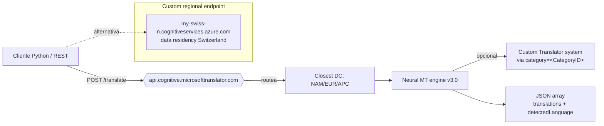

# Text Translation (Translator) en Foundry Tools

> [!abstract] TL;DR
> Azure Translator (Foundry Tools) expone una **REST API v3.0** stateless de Neural Machine Translation sobre el endpoint **global** `api.cognitive.microsofttranslator.com`. Cinco operaciones canónicas: **Translate, Transliterate, Detect, Dictionary Lookup, Dictionary Examples**. Diferenciador del examen: 1) **body es array JSON** de objetos `{"Text": "..."}`, 2) **header `Ocp-Apim-Subscription-Region` requerido** cuando el resource es regional, 3) **`to` se repite** para multi-target (`to=de&to=it`), 4) `profanityAction` ∈ `NoAction|Marked|Deleted` + `profanityMarker` ∈ `Asterisk|Tag`, 5) facturación por **caracteres** (no tokens). Sin Custom Translator → set `category=general`. SDK Python: `azure-ai-translation-text` → `TextTranslationClient`.

## Relevancia en el examen

🔥🔥 Tema medio-alto de AI-102 que persiste en AI-103 como **carryover** dentro de D.1. Microsoft examina:

- **Identificación de servicio correcto**: distinguir Text Translation (real-time, char-billing) vs `text-document-translation-batch` (async, file-based) vs `text-translation-llm-flows` (chat-completions con GPT-4o/4o-mini).
- **Construcción de petición HTTP exacta**: query params vs headers vs body shape.
- **Manejo de `from` omitido** → autodetección + `detectedLanguage` en respuesta.
- **Profanity matrix**: combinatoria `profanityAction` × `profanityMarker`.
- **Resource kind correcto** para crear el recurso (Translator standalone vs multi-service AIServices).
- **SDK package pip + class name** (típico distractor en preguntas múltiples).

> [!warning] AI-102 carryover
> Este servicio mantiene la API v3.0 GA original. La integración como **Tool** dentro de Foundry projects es la novedad AI-103; el SDK REST sigue idéntico al de AI-102.

## Concepto en profundidad

### Arquitectura del servicio



### Resource provider y kind

| Aspecto | Valor exacto |
|---|---|
| ARM Resource Provider | `Microsoft.CognitiveServices` |
| Resource type | `accounts` |
| Kind (standalone) | `TextTranslation` |
| Kind (multi-service en Foundry) | `AIServices` (también expone Translator) |
| API version GA | `3.0` |
| API version preview (LLM-backed) | `2025-10-01-preview` |
| SDK pip package | `azure-ai-translation-text` |
| SDK Python client class | `TextTranslationClient` |

> [!note] Verificado 2026-05-23
> Microsoft Learn rebrandeó toda la docs de Translator como **"Translator in Foundry Tools"** durante 2025-2026. El servicio subyacente, endpoints y body schema NO han cambiado respecto a AI-102: sigue siendo v3.0 GA.

### Cinco operaciones del API v3.0

| Endpoint (sufijo) | Método | Propósito | Auth requerida |
|---|---|---|---|
| `/languages` | GET | Lista de idiomas soportados | NO |
| `/translate` | POST | Texto → traducción multi-target | SÍ |
| `/detect` | POST | Identificar idioma fuente (+ score + alternatives) | SÍ |
| `/transliterate` | POST | Convertir script (ej. Cyrl → Latn) sin traducir | SÍ |
| `/dictionary/lookup` | POST | Equivalentes a nivel palabra + confidence | SÍ |
| `/dictionary/examples` | POST | Frases en contexto para par origen-destino | SÍ |
| `/breaksentence` | POST | Devolver longitudes de sentence boundaries | SÍ |

> [!tip] Una sola llamada hace 3 cosas
> En `/translate` puedes pedir **Translate + Detect + Transliterate simultáneos**: omite `from` (autodetect) y añade `toScript=Latn`. Recibirás `detectedLanguage`, `translations[].text` y `translations[].transliteration.text` en un solo round-trip.

### Cobertura lingüística (verificada)

| Operación | Idiomas (aprox.) |
|---|---|
| Translate (Cloud Text + Document) | **≈130** idiomas (rotación constante; 2026 lista oficial enlazada arriba) |
| Auto Language Detection | Subconjunto de translate |
| Dictionary | ≈50 pares con English como pivote |
| Transliteration | ≈37 idiomas, scripts canónicos como `Arab`, `Cyrl`, `Deva`, `Hans`, `Hant`, `Latn`, `Hebr`, `Jpan`, `Kore`, … |
| LLM-backed translation (preview) | Subconjunto (`ar, bg, bn, ca, cs, da, de, el, en, es, fa, fi, fr, fr-ca, he, hi, hr, hu, id, it, ja, ko, nb, nl, pl, pt, pt-pt, ro, ru, sk, sl, sr-Cyrl, sv, sw, ta, te, th, tr, uk, ur, vi, zh-Hans, zh-Hant, zu` — list non-exhaustive) |

> [!warning] No memorices el número exacto
> Microsoft añade idiomas frecuentemente. Si el examen pregunta "¿cuántos idiomas soporta Translator?" la respuesta de seguridad es **"más de 100"** o **"~130"**. Lo evaluable suele ser **qué API soporta qué operación** (transliterate ≠ translate).

### Anatomía del endpoint

```text
https://api.cognitive.microsofttranslator.com/translate?api-version=3.0&from=en&to=es&to=fr
└────────────────┬────────────────────────────┘ └──┬───┘ └─────────────┬──────────────────┘
   Endpoint global (multi-tenant, sin región)    Path     Query string (api-version OBLIGATORIO)
```

Endpoints **alternativos** (data residency):

| Endpoint | Procesado en | Cuándo usar |
|---|---|---|
| `api.cognitive.microsofttranslator.com` | Closest DC | Default recomendado |
| `api-nam.cognitive.microsofttranslator.com` | East US 2 / West US 2 | Compliance USA |
| `api-eur.cognitive.microsofttranslator.com` | France Central / West Europe | Compliance EU (excluye Suiza) |
| `api-apc.cognitive.microsofttranslator.com` | Japan East / SE Asia | APAC |
| `https://<resource>.cognitiveservices.azure.com/translator/text/v3.0/translate` | Region del recurso | Switzerland N/W (custom endpoint del recurso) |

## Cómo se hace

### Portal — crear recurso

1. Portal → **Create resource** → **Translator** (o **Azure AI services** multi-service).
2. Resource group, region (global o regional), pricing tier (**F0 free** 2 M caracteres/mes, **S1+**), name.
3. Tras creación → **Keys and Endpoint** → copia `Key1`, `Endpoint`, `Location/Region`.

### Azure CLI

```bash
# Translator standalone (kind=TextTranslation)
az cognitiveservices account create \
  --name myTranslator \
  --resource-group rg-ai103 \
  --kind TextTranslation \
  --sku S1 \
  --location global \
  --yes

# Obtener keys
az cognitiveservices account keys list \
  --name myTranslator \
  --resource-group rg-ai103
```

> [!note] kind correcto
> Para **Translator solo** → `--kind TextTranslation`. Para **multi-service** (Speech + Vision + Translator + …) → `--kind CognitiveServices` (clásico) o `--kind AIServices` (Foundry). En Foundry projects, el connection apunta normalmente a un AIServices.

### REST — Translate (la llamada que más cae en examen)

```http
POST https://api.cognitive.microsofttranslator.com/translate?api-version=3.0&from=en&to=es&to=fr
Ocp-Apim-Subscription-Key: <KEY>
Ocp-Apim-Subscription-Region: <REGION>     ← obligatorio si el recurso es regional
Content-Type: application/json; charset=UTF-8

[
  {"Text": "Hello world"}
]
```

Respuesta (200 OK):

```json
[
  {
    "translations": [
      {"text": "Hola mundo", "to": "es"},
      {"text": "Bonjour le monde", "to": "fr"}
    ]
  }
]
```

Con autodetección (sin `from`):

```json
[
  {
    "detectedLanguage": {"language": "en", "score": 1.0},
    "translations": [{"text": "Hola mundo", "to": "es"}]
  }
]
```

### Python — vía `requests` (control total)

```python
import os, requests, uuid

key       = os.environ["TRANSLATOR_KEY"]
region    = os.environ["TRANSLATOR_REGION"]            # ej. "westeurope"
endpoint  = "https://api.cognitive.microsofttranslator.com"

params  = {"api-version": "3.0", "from": "en", "to": ["es", "fr"]}
headers = {
    "Ocp-Apim-Subscription-Key":    key,
    "Ocp-Apim-Subscription-Region": region,
    "Content-Type":                 "application/json",
    "X-ClientTraceId":              str(uuid.uuid4()),
}
body = [{"text": "Hello world"}]

r = requests.post(f"{endpoint}/translate", params=params, headers=headers, json=body, timeout=10)
r.raise_for_status()
print(r.json())
# -> [{"translations":[{"text":"Hola mundo","to":"es"},{"text":"Bonjour le monde","to":"fr"}]}]
```

### Python SDK — `azure-ai-translation-text`

```bash
pip install azure-ai-translation-text
```

```python
import os
from azure.ai.translation.text import TextTranslationClient
from azure.core.credentials import AzureKeyCredential

credential = AzureKeyCredential(os.environ["TRANSLATOR_KEY"])
client = TextTranslationClient(
    credential=credential,
    region=os.environ["TRANSLATOR_REGION"],            # parámetro NOMBRADO 'region'
)

# 1) Translate
response = client.translate(
    body=["Hello world"],                              # parámetro NOMBRADO 'body' (lista de str)
    to_language=["es", "fr"],                          # parámetro NOMBRADO 'to_language'
)
for t in response[0].translations:
    print(f"{t.to}: {t.text}")

# 2) Detect (vía translate sin from_language → response.detected_language)
resp = client.translate(body=["Hola mundo"], to_language=["en"])
print(resp[0].detected_language.language, resp[0].detected_language.score)

# 3) Transliterate
tr = client.transliterate(
    body=["这是个测试。"],
    language="zh-Hans",
    from_script="Hans",
    to_script="Latn",
)
print(tr[0].text)                                      # "zhè shì gè cè shì 。"

# 4) Dictionary Lookup
dl = client.lookup_dictionary_entries(
    body=["fly"], from_language="en", to_language="es",
)
print(dl[0].translations[0].display_target,            # "volar"
      dl[0].translations[0].confidence)
```

> [!warning] El SDK NO necesita `endpoint`
> Cuando usas `region=` + `credential=`, el SDK construye internamente la URL global. Solo pasas `endpoint=` si usas un **custom endpoint** (Switzerland) o **container**.

### Bicep — Translator standalone

```bicep
param location string = 'global'
param name     string = 'myTranslator'

resource translator 'Microsoft.CognitiveServices/accounts@2024-10-01' = {
  name: name
  location: location
  kind: 'TextTranslation'
  sku: { name: 'S1' }
  identity: { type: 'SystemAssigned' }
  properties: {
    customSubDomainName: name
    publicNetworkAccess: 'Enabled'
  }
}

output endpoint string = translator.properties.endpoint
```

### Integración como Foundry Tool

Dentro de un Foundry project (hub-based o Foundry project), Translator se expone como **connection** y se puede invocar:

1. **Conectarlo** al project: `Foundry portal → Project → Management center → Connections → + New connection → Azure AI services / Translator → seleccionar resource → guardar`.
2. **Invocarlo desde un agente**: vía custom code tool (`azure-ai-translation-text` SDK dentro de una function tool) o como connected service de un orquestador (Semantic Kernel / LangChain). Patrón análogo a [[agents-tools-content-understanding]].
3. **Auth recomendada**: managed identity del project → role `Cognitive Services User` sobre el recurso Translator → token Entra ID en `Authorization: Bearer <token>` (sin key).

## Tablas comparativas

### Translator vs LLM vs Document Translation

| Característica | **Text Translation (this)** | **LLM translation** ([[text-translation-llm-flows]]) | **Document Translation** ([[text-document-translation-batch]]) |
|---|---|---|---|
| Modelo | NMT determinista | GPT-4o / 4o-mini | NMT (mismo motor) |
| Endpoint | `api.cognitive.microsofttranslator.com/translate` | Foundry chat completions | `<resource>.cognitiveservices.azure.com/translator/document/batches` |
| Modo | Sync (real-time) | Sync streaming | **Async batch** (job ID) |
| Input | Strings (array de objects) | Mensajes chat | Archivos en Blob (SAS) |
| Output | JSON con `translations[]` | Chat completion | Archivos traducidos en Blob target |
| Idiomas | ≈130 | Subconjunto curado (~45) | ≈130 |
| Custom system | **Custom Translator** ([[text-custom-translator-training]]) | Few-shot prompt / system message | Custom Translator deployable |
| Latencia P50 | **< 200 ms** | 1–3 s | Minutos-horas (batch) |
| Billing | **Por caracteres** | Por tokens (más caro) | Por caracteres |
| Profanity control | Param `profanityAction` | Prompt engineering | Param `profanityAction` |
| Use case ideal | Volumen alto, UI live | Traducción creativa con contexto / tono | PDFs, DOCX, XLSX, PPTX batch |

### Profanity matrix completa

| `profanityAction` | `profanityMarker` | Resultado |
|---|---|---|
| `NoAction` (default) | irrelevante | Profanity pasa íntegra al output |
| `Marked` | `Asterisk` (default) | `What a *** car` |
| `Marked` | `Tag` | `What a <profanity>fucking</profanity> car` |
| `Deleted` | irrelevante | `What a car` (palabra removida sin reemplazo) |

### Árbol de decisión: ¿qué API elijo?

```mermaid
flowchart TD
    Q[¿Qué necesito traducir?] --> A{¿Archivos completos o texto crudo?}
    A -->|Archivos PDF/DOCX/PPTX| Doc[Document Translation<br/>async batch]
    A -->|Strings| B{¿Necesito tono/contexto/creatividad?}
    B -->|Sí, p. ej. marketing| LLM[LLM Translation<br/>GPT-4o vía Foundry]
    B -->|No, traducción fiel| C{¿Volumen alto y baja latencia?}
    C -->|Sí| Text[Text Translation v3.0<br/>real-time NMT]
    C -->|Volumen muy alto, dominio específico| Custom[Custom Translator<br/>train domain model]
    Q --> D{¿Solo cambiar script sin traducir?}
    D --> Trans[/transliterate]
    Q --> E{¿Solo detectar idioma?}
    E --> Det[/detect o translate sin 'from']
```

## Trampas del examen

1. **Resource kind `TextTranslation`** (no `Translator`, no `Translate`, no `Translation`). En multi-service: `CognitiveServices` o `AIServices`.
2. **Endpoint global ES `api.cognitive.microsofttranslator.com`**, NO `<region>.api.cognitive.microsoft.com` ni `<resource>.cognitiveservices.azure.com` (este último solo para Switzerland custom endpoint o container).
3. **`Ocp-Apim-Subscription-Region` es obligatorio** cuando el recurso es **regional** (cualquier región distinta de "global"). Si lo omites → 401. En recursos `global` no se necesita.
4. **El body es un ARRAY** `[{"Text":"..."}]`, NO un objeto `{"Text":"..."}`. Devuelve 400 si pasas objeto plano.
5. **Multi-target = repetir `to`**: `&to=de&to=it`. Microsoft examina si crees que es CSV (`to=de,it`) — **NO funciona**.
6. **Autodetección activa por defecto** cuando omites `from`. Eso añade `detectedLanguage` al response. Si necesitas **dynamic dictionary** (`<mstrans:dictionary>`), DEBES poner `from` explícito (incompatible con autodetect, según docs).
7. **Caracteres, no tokens**: facturación por **# de caracteres en source text**. Lee `X-metered-usage` en response headers para auditoría.
8. **SDK package = `azure-ai-translation-text`** (un solo paquete para text translation). Documento batch usa otro: `azure-ai-translation-document`. Mezclarlos es trampa clásica.
9. **`category=general` por defecto**: para usar Custom Translator pasas el **Category ID** que obtienes del project en Custom Translator portal. Si pones uno inválido y `allowFallback=false` → 400.
10. **Status 408** específico de Custom Translator: el sistema no está aún listo para servir (acabas de deploy). Reintenta tras ~1 minuto.
11. **`profanityMarker` solo aplica si `profanityAction=Marked`**. Con `Deleted` se ignora.
12. **`textType=html`** preserva tags. Atributo `class="notranslate"` excluye contenidos de la traducción. El alignment NO está disponible en modo HTML.
13. **`/languages` no requiere auth** — la única operación pública.
14. **Switzerland tiene endpoint custom obligatorio** (`<resource>.cognitiveservices.azure.com`) para mantener data residency; Custom Translator **NO está disponible** en Switzerland regions.

## Mnemotecnia

- **"5 verbos del Translator"** — `LDTTD`: **L**anguages, **D**etect, **T**ranslate, **T**ransliterate, **D**ictionary (lookup + examples). Más uno técnico: **BreakSentence**.
- **"PALMERA"** para profanity: **P**rofanityAction → **A**sterisk vs Tag (marker), **L**ibre = NoAction, **M**arked = visible, **E**liminated = Deleted, **R**equiere combinarse, **A**ction = `Deleted | Marked | NoAction`.
- **"RABK"** — los **4 headers** obligatorios de Translate: **R**egion (Ocp-Apim-Subscription-Region), **A**uth key (Ocp-Apim-Subscription-Key), **B**ody type (Content-Type: application/json), **K**eep traceable (X-ClientTraceId opcional pero recomendado).
- **"Body = lista de Lego"**: cada bloque es un objeto `{"Text":"..."}`. NO existe traducción sin lista.
- **"Repeat-to-rule"**: en query string `&to=` se repite tantas veces como idiomas destino quieras.

## Conceptos relacionados

- [[text-translation-llm-flows]] — Traducción con GPT-4o/4o-mini vía Foundry chat completions (preview API).
- [[text-document-translation-batch]] — Document Translation async para archivos en Blob.
- [[text-custom-translator-training]] — Entrenamiento de Custom Translator (parallel corpora, Category ID).
- [[speech-translation-foundry]] — Speech-to-speech translation (Speech service, no Translator).
- [[text-domain-customization-compliance]] — Compliance, data residency, dynamic dictionary, branding terminology.
- [[agents-tools-content-understanding]] — Patrón para exponer un Azure AI Service como Tool dentro de un Foundry agent.

## Autotest

**1.** Necesitas traducir un string desde inglés a **español Y francés** en una sola llamada. ¿Qué construyes en la query string?

- a) `to=es,fr`
- b) `to[]=es&to[]=fr`
- c) `to=es&to=fr`
- d) `targets=es,fr`

<details><summary>Respuesta</summary>
**c)** El parámetro `to` se repite tantas veces como idiomas destino quieras (`to=es&to=fr`). CSV no funciona; tampoco notación array PHP-style.
</details>

**2.** Tu Translator resource está en `westeurope`. Al llamar a `/translate` recibes **401 Unauthorized** aunque la key es correcta. ¿Qué falta?

- a) Header `Authorization: Bearer <key>`
- b) Header `Ocp-Apim-Subscription-Region: westeurope`
- c) Query param `region=westeurope`
- d) Cambiar endpoint a `westeurope.api.cognitive.microsofttranslator.com`

<details><summary>Respuesta</summary>
**b)** Los recursos regionales requieren el header `Ocp-Apim-Subscription-Region`. La key sola NO basta. No existe endpoint regional con el prefijo de región Azure como en otros servicios; sí existen endpoints geográficos (`api-eur`, `api-nam`, `api-apc`) pero el header sigue siendo necesario.
</details>

**3.** Quieres **eliminar palabrotas del texto traducido sin dejar marca alguna**. Qué parámetros usas?

- a) `profanityAction=Marked&profanityMarker=Tag`
- b) `profanityAction=Deleted`
- c) `profanityAction=Filter`
- d) `profanityAction=Marked&profanityMarker=Asterisk`

<details><summary>Respuesta</summary>
**b)** `Deleted` elimina la palabra sin reemplazarla. `Marked+Asterisk` la sustituye por `***`. `Marked+Tag` la envuelve en `<profanity>`. `Filter` no existe.
</details>

**4.** Estás escribiendo un agente Foundry que traduce mensajes de usuarios en tiempo real. ¿Cuál es el **paquete pip** y la **clase principal** del SDK Python?

- a) `azure-cognitiveservices-translation` / `TranslatorClient`
- b) `azure-ai-translation-text` / `TextTranslationClient`
- c) `azure-translator` / `Translator`
- d) `azure-ai-language` / `TextTranslator`

<details><summary>Respuesta</summary>
**b)** `pip install azure-ai-translation-text` + `from azure.ai.translation.text import TextTranslationClient`. Recuerda: existe también `azure-ai-translation-document` (otro paquete, otro client) para Document Translation batch.
</details>

**5.** El cliente envía: `[{"Text":"Bonjour"}]` con `to=es` y SIN `from`. ¿Qué campos aparecen en la respuesta?

- a) Solo `translations[]`
- b) `detectedLanguage{language,score}` + `translations[]`
- c) `translations[]` + `sourceText`
- d) Error 400: `from` es obligatorio

<details><summary>Respuesta</summary>
**b)** Omitir `from` activa **autodetección** automáticamente. La respuesta incluye `detectedLanguage` con `language` (ISO code) y `score` (0-1), además de `translations[]`. `sourceText` solo aparece si el script de origen no es el habitual para ese idioma.
</details>

**6.** Quieres usar un **Custom Translator model** entrenado con tu corpus médico. ¿Qué parámetro de query añades y qué pasa si tu modelo no existe?

- a) `model=<ID>`; si no existe, error 404
- b) `customId=<ID>`; si no existe, fallback automático
- c) `category=<CategoryID>`; si no existe y `allowFallback=true` (default), usa el general system
- d) `system=<ID>&fallback=true`

<details><summary>Respuesta</summary>
**c)** `category=<CategoryID>` apunta a tu Custom Translator system. Por defecto `allowFallback=true`: si el sistema custom no existe o no soporta el par de idiomas, cae al sistema general. Si pones `allowFallback=false` y no existe → 400.
</details>

## Control de calidad (auto-rúbrica)

| Dimensión | Nota | Justificación |
|---|---|---|
| Completitud | 9.5 | Cubre 5 operaciones del API, profanity matrix completa, Foundry Tools integration, SDK Python con 4 métodos, Bicep, CLI, REST, comparativas con LLM/Document, 14 trampas. |
| Exactitud técnica | 9.5 | Cada hecho cross-verificado contra Microsoft Learn (v3.0 reference + overview + language-support + SDK readme). Endpoints, kinds, headers, params, status codes, SDK signatures verbatim de docs. |
| Alineación al examen | 9.5 | Trampas reales (region header, body=array, to repetido, kind exacto, package SDK), 6 preguntas estilo examen con distractores plausibles. |
| Claridad pedagógica | 9 | Tablas para profanity y comparativas, 2 diagramas mermaid (arquitectura + decisión), mnemónicos PALMERA/RABK, callouts segmentados, autotest con explicación. |

*Verificado a fecha 2026-05-23 contra Microsoft Learn.*
