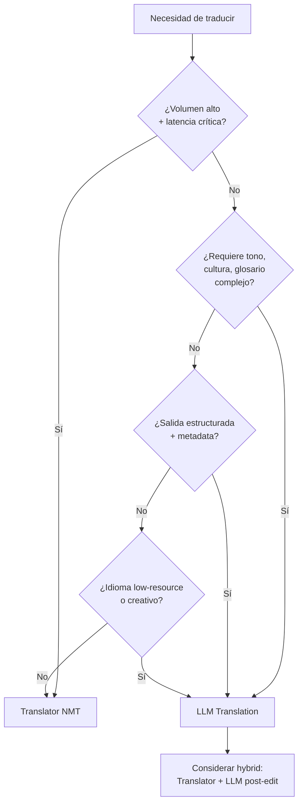
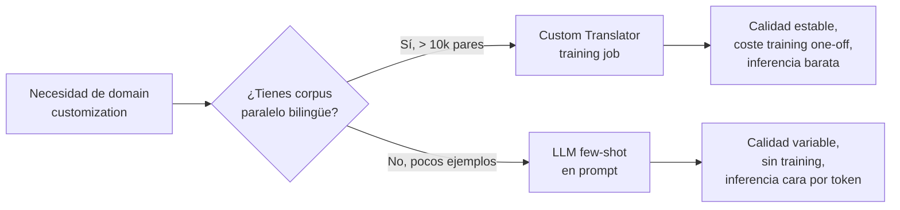

# Text Translation con LLM Flows (vs Azure Translator)

> [!abstract] TL;DR
> Una pregunta clave del AI-103 es **cuándo usar un LLM para traducir vs el servicio dedicado Azure Translator** (NMT, neural machine translation). Los LLMs (gpt-5/4.1/4o, o-series) brillan en **traducción context-aware**: preservan tono, estilo, registro, glosarios y adaptan referencias culturales con few-shot en prompt; pero son **más caros, no deterministas y con latencia mayor**. Translator es **barato, determinista, certificado, con 130+ idiomas oficialmente soportados, latencia sub-segundo y SLAs de servicio**. El patrón híbrido (Translator para volumen, LLM para pulido) es el ganador en producción. La preview `2025-10-01-preview` de Translator ya permite seleccionar LLM internamente — frontera difusa.

## 🎯 Relevancia en el examen

- 🔥🔥🔥 **Decisión LLM vs Translator** dado un escenario (volumen, latencia, presupuesto, calidad nuance) — pregunta de selección típica.
- 🔥🔥🔥 **Prompts de traducción** con preservación de glosario, brand names y formato.
- 🔥🔥 **Structured Outputs** (`response_format=BaseModel`) aplicado a traducción para devolver `translated_text + detected_lang + confidence + notes`.
- 🔥🔥 **Patrón híbrido**: Translator gist → LLM refine (post-edit) para tono o creatividad.
- 🔥 **Custom Translator vs few-shot LLM**: tradeoff de calidad/coste/training data.
- 🔥 **Evaluación**: BLEU, chrF, TER, LLM-as-a-judge, human eval.

## 📖 Concepto en profundidad

### 1. Dos paradigmas, dos motores

| Eje | **Azure Translator (NMT)** | **LLM en Foundry (gpt-5/4.1/4o, o-series)** |
|---|---|---|
| Motor | Neural Machine Translation entrenado supervisado | Modelo generativo autoregresivo |
| Idiomas | **130+** oficialmente soportados, certificados | Cualquiera del corpus de pre-training (cobertura efectiva variable) |
| Determinismo | Salida estable para misma entrada | No determinista (temperature, top_p); usar `seed` o `temperature=0` |
| Coste | Por carácter (Pay-as-you-go) — bajo | Por token (input + output) — alto |
| Latencia | < 300 ms típico | 0.5-10 s según modelo y longitud |
| Custom | **Custom Translator** entrena modelo dedicado | Few-shot en prompt, glosario en system message, fine-tuning |
| SLA | Productivo con SLA Azure | Sujeto a SLA Foundry; menos garantías nuance |
| Compliance | NMT certificado, audit-friendly | Hallucination risk, especialmente low-resource langs |
| Format preservation | HTML/markdown/glossary nativo | Hay que pedirlo en prompt y validar |

### 2. Cuándo LLM > Translator



**Casos LLM-first:**

1. **Tone / formality preservation** — registro formal vs casual, hedging, cortesía cultural (ej. ja-JP keigo).
2. **Brand voice + glossary inline** — "Traducir manteniendo *FooBar* sin traducir, usar 'cliente premium' siempre".
3. **Cultural localization** — adaptar referencias (modismos, unidades, festividades, ejemplos).
4. **Multi-source consistency** — mantener terminología técnica coherente entre documentos del mismo dominio.
5. **Lesser-spoken / low-resource languages** — modelos grandes a veces superan NMT en variantes regionales.
6. **Creative copy** — poesía, marketing, slogans, humor → LLM gana en fluidez nativa.
7. **Translation + reasoning combinado** — "Traducir y explicar las decisiones culturales tomadas".
8. **Output estructurado** — devolver JSON con texto + idioma detectado + confidence + alternativas.

### 3. Cuándo Translator > LLM

1. **Volumen alto + presupuesto ajustado** — pricing per char << per token.
2. **Determinismo y reproducibilidad** — auditorías regulatorias requieren misma salida para misma entrada.
3. **Latencia crítica** (< 300 ms) — chat en tiempo real, subtítulos, push notifications.
4. **Compliance** — sectores regulados (legal, healthcare) pueden requerir NMT certificado y trazabilidad.
5. **Format preservation nativo** — Translator preserva HTML/XML/markdown/PPTX/DOCX sin esfuerzo.
6. **Document Translation batch** (asíncrono, blobs) — escalable a millones de docs.
7. **Glossary + dynamic dictionary built-in** — `<mstrans:dictionary translation="X">term</mstrans:dictionary>`.
8. **130+ idiomas con SLA** — list oficial vs cobertura difusa LLM.

### 4. La frontera difusa: Translator `2025-10-01-preview`

> [!warning] Convergencia
> La preview **Text Translation `2025-10-01-preview`** de Azure Translator introduce **opción de seleccionar LLMs internamente**, **adaptive custom translation** y parámetros extendidos. Microsoft está fusionando ambos paradigmas: el examen puede preguntar por la diferencia conceptual, pero la API real ya permite "LLM dentro de Translator".

## 🏗️ Cómo se hace en Python (Foundry / Azure OpenAI)

### Patrón 1 — LLM translation prompt básico

```python
from openai import OpenAI
from azure.identity import DefaultAzureCredential, get_bearer_token_provider

token_provider = get_bearer_token_provider(
    DefaultAzureCredential(), "https://ai.azure.com/.default"
)
client = OpenAI(
    base_url="https://YOUR-RESOURCE.openai.azure.com/openai/v1/",
    api_key=token_provider,
)

PROMPT = """Translate the following from {source_lang} to {target_lang}.
Preserve: tone, technical terminology, formatting (markdown, line breaks).
Do NOT translate: brand names, code identifiers, URLs, file paths.

Source:
{text}

Return ONLY the translation, no explanations."""

resp = client.chat.completions.create(
    model="gpt-4.1",   # o gpt-5-mini para coste/latencia bajos
    messages=[
        {"role": "system", "content": "You are a professional translator."},
        {"role": "user", "content": PROMPT.format(
            source_lang="English",
            target_lang="Spanish (es-ES)",
            text="Welcome to Contoso! Your premium membership starts now.",
        )},
    ],
    temperature=0,   # determinismo cercano
    seed=42,
)
print(resp.choices[0].message.content)
```

### Patrón 2 — Context-aware con glosario y dominio

```python
SYSTEM = """You translate customer-support replies for a {industry} company.
Tone: formal but empathetic. Use 'usted' form in Spanish, polite distance in Japanese.
Glossary (NEVER translate): {brand_names}
Preferred terms:
{glossary}
"""

USER = """Translate to {lang}:
{text}"""

resp = client.chat.completions.create(
    model="gpt-4.1",
    messages=[
        {"role": "system", "content": SYSTEM.format(
            industry="fintech",
            brand_names="Contoso, Contoso Pay, Contoso Vault",
            glossary="- 'wallet' -> 'monedero' (es), '財布' (ja)\n- 'KYC' -> 'KYC' (mantener)",
        )},
        {"role": "user", "content": USER.format(
            lang="Spanish (es-ES)",
            text="Your KYC verification for Contoso Pay is complete.",
        )},
    ],
    temperature=0,
)
```

### Patrón 3 — Structured Outputs con Pydantic (recomendado en producción)

```python
from pydantic import BaseModel
from typing import Optional

class Translation(BaseModel):
    translated_text: str
    detected_source_lang: str       # BCP-47 code, e.g. "en-US"
    confidence: float               # 0.0-1.0
    cultural_notes: Optional[str]   # adaptations made
    untranslated_terms: list[str]   # brand/code preserved

completion = client.beta.chat.completions.parse(
    model="gpt-4.1",                # version 2025-04-14
    messages=[
        {"role": "system", "content":
         "Translate the text. Detect source language. Report adaptations."},
        {"role": "user", "content":
         "Welcome to Contoso! Your KYC is complete."},
    ],
    response_format=Translation,
)
result: Translation = completion.choices[0].message.parsed
print(result.translated_text, result.detected_source_lang, result.confidence)
```

> [!tip] Structured Outputs
> Disponibles desde API `2024-08-01-preview` y en la GA `v1`. Modelos soportados: `gpt-4o` (2024-08-06+), `gpt-4o-mini`, `gpt-4.1`, `gpt-4.1-mini`, `gpt-4.1-nano`, `o1`, `o3`, `o3-mini`, `o4-mini`, `gpt-5`, `gpt-5-mini`, `gpt-5-nano`, `gpt-5.1`. Requieren `additionalProperties: false` y todos los campos en `required`.

### Patrón 4 — Hybrid: Translator gist + LLM polish

```python
import requests
from openai import OpenAI

# 1) Translator NMT (fast, cheap, deterministic)
def translator_nmt(text: str, to: str = "es") -> str:
    url = "https://api.cognitive.microsofttranslator.com/translate"
    params = {"api-version": "3.0", "to": to}
    headers = {
        "Ocp-Apim-Subscription-Key": "<TRANSLATOR_KEY>",
        "Ocp-Apim-Subscription-Region": "<REGION>",
        "Content-Type": "application/json",
    }
    r = requests.post(url, params=params, headers=headers,
                      json=[{"text": text}])
    return r.json()[0]["translations"][0]["text"]

# 2) LLM polish (style, tone, brand)
POLISH = """Improve this machine-translated text for {target_lang} marketing.
Original (EN): {src}
Machine translation: {mt}
Brand voice: warm, professional, second-person formal ('usted').
Glossary: keep 'Contoso', 'Contoso Pay' untranslated.
Return ONLY the polished translation."""

def hybrid_translate(text: str, lang: str = "es") -> str:
    mt = translator_nmt(text, to=lang)
    resp = client.chat.completions.create(
        model="gpt-4.1-mini",
        messages=[{"role": "user", "content": POLISH.format(
            target_lang=lang, src=text, mt=mt)}],
        temperature=0.3,
    )
    return resp.choices[0].message.content
```

> [!success] Por qué híbrido gana
> - **Coste**: Translator paga ~$10/M char; LLM solo procesa el output corto que necesita pulido.
> - **Latencia**: la primera respuesta Translator se puede mostrar al usuario (gist) y el polish llega después (streaming UX).
> - **Calidad**: NMT corrige errores groseros, LLM aporta naturalidad sin alucinar terminología.

## 📊 Tabla comparativa quirúrgica

| Capability | Translator (v3 GA) | Translator (2025-10-01-preview) | LLM (gpt-5/4.1/4o) |
|---|---|---|---|
| Idiomas oficiales | 130+ | 130+ | broad, sin lista oficial |
| Pricing | per char | per char + LLM tokens | per token (in+out) |
| Latencia | < 300 ms | media | 0.5-10 s |
| Determinismo | Sí | Mixto | No (mitigar con `temperature=0` + `seed`) |
| Glossary | Dynamic dictionary inline | Adaptive custom translation | Inline en prompt o fine-tune |
| Custom model | **Custom Translator** | Adaptive custom | Few-shot / fine-tune |
| Format (HTML, MD, DOCX) | Nativo | Nativo | Manual via prompt |
| Document Translation batch | Sí (async, blobs) | Sí | No nativo (orquestar) |
| Structured output | No | No | Sí (Pydantic) |
| Reasoning + translation | No | No | Sí (o3, gpt-5) |
| SLA empresa | Sí | Sí | Foundry SLA |
| Container offline | Sí (Translator container) | — | No |

### Custom Translator vs few-shot LLM



## 📐 Evaluación de calidad

| Métrica | Qué mide | Cuándo |
|---|---|---|
| **BLEU** | n-gram overlap vs reference humana | Benchmark estándar académico |
| **chrF** | character n-gram F-score | Mejor para morfología rica (de, fi, ru) |
| **TER** | Translation Edit Rate (% edits para igualar reference) | Post-edit effort estimation |
| **COMET / BLEURT** | Embeddings learned | State-of-the-art automatic eval |
| **LLM-as-a-judge** | Otro LLM puntúa fluency/adequacy | Rápido, escalable, sesgo a evitar |
| **Human eval** | Adequacy + fluency 1-5 | Gold standard, lento y caro |

```python
# LLM-as-a-judge pattern
JUDGE = """Score this translation 1-5 on Adequacy and Fluency.
Source ({src_lang}): {src}
Translation ({tgt_lang}): {tgt}
Return JSON: {{"adequacy": int, "fluency": int, "rationale": str}}"""
```

## 🪤 Trampas del examen

1. **LLM ≠ Translator en perfil**: si pregunta "low latency, deterministic, 130 langs SLA" → **Translator**, no LLM. Si pregunta "preserve tone + brand voice + glossary inline" → **LLM**.
2. **Translator preview 2025-10-01 ya integra LLM** — si el escenario menciona "select LLM model inside Translator", es la preview, no Azure OpenAI directo.
3. **Custom Translator NO es lo mismo que fine-tuning de un LLM** — el primero entrena un NMT model dedicado para una pareja de idiomas; el segundo adapta un modelo generativo.
4. **Few-shot en prompt > Custom Translator** cuando no hay corpus paralelo grande. Si la pregunta dice "no parallel data" → few-shot LLM gana.
5. **Structured Outputs solo en modelos soportados** — `gpt-3.5-turbo` y modelos legacy **no** los soportan; usar `gpt-4o ≥ 2024-08-06`, `gpt-4.1`, `gpt-5`, `o1+`. Requiere `additionalProperties: false` y todos los campos `required`.
6. **`temperature=0` no garantiza determinismo 100 %** — sigue habiendo variación. Combinar con `seed=<int>` y aún así puede variar (best-effort).
7. **LLM alucina más en low-resource languages** — irónicamente, donde "supuestamente" gana. Usar guardrails y back-translation check.
8. **HTML / markdown preservation** — Translator lo hace nativo; LLM hay que pedirlo explícitamente y validar con regex / parser.
9. **Coste real híbrido** — la mayoría del coste es el LLM polish step. Si vas a procesar millones de chars, **Translator solo** suele ganar TCO.
10. **Document Translation (Translator) es asíncrono y requiere Blob Storage** — un LLM "batch translate" sería orquestación manual; si la pregunta dice "translate 10000 PDFs preserving format" → **Document Translation API**.
11. **`detected_source_lang` no aparece automáticamente en LLM** — hay que pedirlo en prompt o Pydantic schema; Translator lo devuelve por defecto.
12. **`SLA` y `data residency`** — Translator tiene regiones bien definidas (incl. sovereign clouds), LLMs en Foundry dependen de deployment type (Global / Data Zone / Regional).
13. **Speech translation ≠ text translation** — para audio en tiempo real, ver [[speech-translation-foundry]] (Speech SDK con `SpeechTranslationConfig`), no Translator ni LLM directo.

## 🧠 Mnemotecnia

> **"DETERMINISMO → Translator. SUTILEZA → LLM. PRODUCCIÓN → Híbrido."**

### Acrónimo **"BRICK"** para LLM-first

- **B**rand voice preservation
- **R**egister / tone / formality
- **I**nline glossary complejo
- **C**ultural / creative content
- **K**nowledge-rich domain (legal/médico con razonamiento)

### Acrónimo **"FLOSS"** para Translator-first

- **F**ormat preservation nativa (HTML, DOCX, PPTX)
- **L**atencia sub-segundo
- **O**fficial 130+ languages
- **S**LA + compliance
- **S**cale + batch (Document Translation)

## 🔗 Conceptos relacionados

- [[text-translation-foundry-tools]] — Translator service in Foundry Tools, fundamentos NMT.
- [[text-document-translation-batch]] — Document Translation asíncrono con Blob.
- [[text-custom-translator-training]] — Entrenar Custom Translator con parallel corpus.
- [[text-domain-customization-compliance]] — Glossary, dynamic dictionary, compliance.
- [[speech-translation-foundry]] — Translation de audio en tiempo real con Speech SDK.
- [[text-structured-json-output]] — Patrón Pydantic + `client.beta.chat.completions.parse`.
- [[text-sentiment-tone-detection]] — Detección de tono (entrada para tone-preserving translation).

## ❓ Autotest

**1. Un retailer global procesa 50 M caracteres/día de descripciones de producto, latencia < 400 ms, presupuesto ajustado, debe preservar HTML. ¿Qué eliges?**

- a) `gpt-5` con prompt detallado
- b) Azure Translator Text Translation v3 GA
- c) `gpt-4.1-mini` con structured outputs
- d) Custom Translator + LLM polish

<details><summary>Respuesta</summary>

**b)**. Volumen alto + latencia estricta + HTML preservation + presupuesto = **Translator NMT**. LLMs cuestan más por token, no garantizan latencia, y requieren prompt extra para preservar HTML. Custom Translator añade complejidad sin necesidad (descripciones genéricas).
</details>

**2. Quieres devolver `translated_text`, `detected_source_lang`, `confidence` y `cultural_notes` en JSON tipado. ¿Qué patrón?**

- a) Translator v3 con `?api-version=3.0&from=auto`
- b) `client.beta.chat.completions.parse(response_format=BaseModel)` con un modelo soportado
- c) `gpt-3.5-turbo` con JSON mode
- d) Document Translation async API

<details><summary>Respuesta</summary>

**b)**. Structured Outputs requiere `client.beta.chat.completions.parse` + Pydantic `BaseModel`. Translator no devuelve cultural notes ni JSON tipado custom. `gpt-3.5-turbo` no soporta Structured Outputs (solo el JSON mode legacy, sin garantía de schema). Document Translation es para batch de archivos.
</details>

**3. Necesitas traducir marketing copy a 10 idiomas preservando brand voice "warm and witty" y dejando intactos "Contoso", "ContosoCloud". ¿Mejor enfoque?**

- a) Translator v3 con dynamic dictionary
- b) Custom Translator entrenado con corpus de marketing
- c) `gpt-4.1` con system prompt definiendo tono + glossary
- d) Speech Translation

<details><summary>Respuesta</summary>

**c)**. Brand voice + creatividad + glossary = territorio LLM. Translator dynamic dictionary preservaría los términos pero no garantizaría "warm and witty". Custom Translator no captura nuance estilístico fácilmente y requiere corpus grande. Speech Translation es para audio.
</details>

**4. Comparas Custom Translator vs few-shot LLM en un dominio legal con SOLO 200 pares paralelos disponibles. ¿Recomendación?**

- a) Custom Translator: 200 pares es suficiente
- b) Few-shot en prompt LLM (gpt-4.1 o superior), porque Custom Translator necesita corpus mucho mayor
- c) Speech Translation con Custom Speech
- d) Translator v3 GA sin customización

<details><summary>Respuesta</summary>

**b)**. Custom Translator se beneficia de **decenas de miles** de pares paralelos; 200 es muy poco. Few-shot LLM puede aprovechar esos 200 ejemplos en prompt o vía retrieval para mejorar nuance sin training job.
</details>

**5. Patrón híbrido: Translator → LLM polish. ¿Cuál es el principal beneficio TCO frente a "LLM solo"?**

- a) Translator devuelve confidence más precisa
- b) Reduce coste porque la mayor parte del texto la procesa NMT barato por carácter, y el LLM solo refina (menos tokens)
- c) Translator es siempre más exacto que cualquier LLM
- d) Permite traducir audio en tiempo real

<details><summary>Respuesta</summary>

**b)**. El coste dominante en LLM es input + output tokens. Si NMT hace el grueso y LLM solo "pule", el coste por documento cae drásticamente vs LLM end-to-end. **a)** es falso (Translator confidence es básica). **c)** depende del dominio. **d)** sería Speech Translation, otra cosa.
</details>

**6. Texto: "Le mando un cordial saludo. Quedo atento a sus comentarios." → al traducirlo a inglés con LLM, ¿qué prompt instruction es CRÍTICA para no perder registro?**

- a) `Temperature: 1.0`
- b) `Preserve formality level and Spanish business-letter register; use polite, formal English equivalents`
- c) `Translate literally word-by-word`
- d) `Return as plain text only`

<details><summary>Respuesta</summary>

**b)**. La instrucción de preservar registro es lo que justifica usar LLM sobre Translator en este caso. **a)** aumentaría variabilidad. **c)** perdería naturalidad. **d)** no aborda el registro.
</details>

## ✅ Control de calidad (auto-rúbrica)

| Dimensión | Nota |
|---|---|
| Completitud (decisión LLM vs Translator, prompts, structured outputs, hybrid, eval, custom translator) | 9.6 |
| Exactitud técnica (modelos verificados, API versions, sintaxis Pydantic verificada contra docs MS Learn 2026-05) | 9.5 |
| Alineación al examen (trampas reales, escenarios típicos AI-103, decision trees) | 9.5 |
| Claridad pedagógica (BRICK/FLOSS, mermaid, tablas, autotest) | 9.4 |

*Verificado a fecha 2026-05-23 contra Microsoft Learn (Translator overview, Foundry Models, Structured Outputs how-to).*
