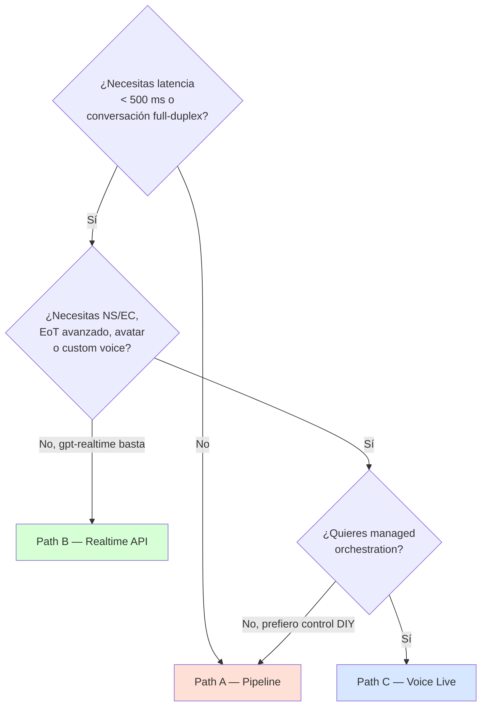

# Speech como Modality para Agentes — Pipeline vs Realtime vs Voice Live

> [!abstract] TL;DR
> Para construir un **voice agent** sobre Azure existen **tres caminos arquitectónicos** con trade-offs distintos: **(A) Pipeline clásico** = orquestar manualmente Azure Speech STT + Foundry Agent (texto) + Azure Speech TTS, máxima flexibilidad pero **tres servicios** y latencia 1–3 s; **(B) Realtime API** de Azure OpenAI con `gpt-realtime` sobre WebSocket bidireccional, **un solo modelo** con audio nativo, ~200 ms latencia y `server_vad` integrado; **(C) Voice Live API** (Foundry Tools, **GA julio-2025 con pricing**, en evolución continua) que es un pipeline **fully managed** compatible con eventos Realtime e incluye además **noise suppression, echo cancellation, advanced end-of-turn detection e integración con avatar**. Pregunta típica de examen: dado un escenario (low-latency, multilingüe, branding con custom voice, telefonía, interrupciones nativas), elegir el path correcto.

## 🎯 Relevancia en el examen

Frecuencia: 🔥🔥🔥 (alta — voice como modality de agentes es el bloque más nuevo de AI-103 respecto al carryover AI-102).

Tipos de pregunta típicos:

- **Selección de arquitectura**: dado un requirement (latencia < 500 ms, custom voice de marca, telefonía SIP, agente con tools…), elegir Pipeline / Realtime / Voice Live.
- **Identificar servicios involucrados**: cuántos recursos Azure aparecen en cada path (3 en Pipeline, 1 en Realtime, 1 managed en Voice Live).
- **Reconocer protocolo**: HTTP/REST vs WebSocket `wss://` vs WebRTC vs SIP.
- **Conversational features**: ¿qué path incluye noise suppression / echo cancellation out-of-the-box? → solo Voice Live.
- **Multilingüe**: ¿qué voz Neural cubre 100+ idiomas con una sola voz? → multilingual voices (Ava/Andrew/Emma Multilingual).
- **Responsible AI**: gating de Custom Neural Voice, disclosure obligatorio.
- **Interrupciones**: `response.cancel` (Realtime) vs `synthesizer.stop_speaking_async()` (Pipeline) vs detección nativa (Voice Live).

## 📖 Concepto en profundidad

### Tres caminos arquitectónicos

```mermaid
flowchart TB
    subgraph A["A. PIPELINE — DIY (máxima flexibilidad)"]
        A1[Mic] -->|audio PCM| A2[Azure Speech STT]
        A2 -->|texto| A3[Foundry Agent / LLM]
        A3 -->|texto| A4[Azure Speech TTS]
        A4 -->|audio| A5[Speaker]
    end
    subgraph B["B. REALTIME API — gpt-realtime (Azure OpenAI)"]
        B1[Mic] -->|PCM16 24kHz via wss://| B2[gpt-realtime]
        B2 -->|PCM16 24kHz| B3[Speaker]
    end
    subgraph C["C. VOICE LIVE API — Foundry Tools managed"]
        C1[Mic] -->|wss://| C2[Voice Live managed pipeline]
        C2 -.->|NS, EC, EoT, VAD, avatar, tools| C2
        C2 -->|audio + viseme + actions| C3[Speaker + Avatar]
    end
    style A2 fill:#ffd6d6
    style A3 fill:#ffd6d6
    style A4 fill:#ffd6d6
    style B2 fill:#d6ffd6
    style C2 fill:#d6e7ff
```



### Path A — Pipeline clásico (STT + Agent + TTS)

**Concepto**: orquestas manualmente **tres servicios** independientes. Cada uno tiene su recurso, su SDK, sus quotas y sus métricas.

- **STT**: `azure-cognitiveservices-speech` (Speech SDK) con `SpeechRecognizer` en modo `recognize_once_async()` (un turno) o `start_continuous_recognition_async()` (streaming). Soporta auto-detección de idioma vía `AutoDetectSourceLanguageConfig`.
- **Agente**: `azure-ai-projects` con `AIProjectClient.agents` ejecuta un thread/run en Foundry Agent Service y devuelve texto.
- **TTS**: `SpeechSynthesizer` con `speak_text_async()` o `speak_ssml_async()`. Streaming output con `PullAudioOutputStream`.

**Trade-offs**:

- ✅ Máxima personalización: custom speech model para STT, custom neural voice (CNV) o personal voice para TTS, cualquier LLM/agent backend, SSML completo.
- ✅ Cada componente es **GA estable** desde Speech Service classic (carryover AI-102).
- ❌ **Tres saltos de red** → latencia acumulada 1–3 s perceptual.
- ❌ Tienes que implementar **end-of-turn detection** (cuándo el usuario terminó de hablar), **barge-in / interruption** (cortar TTS si el usuario habla) y **gestión de estado**.
- ❌ Tres facturaciones distintas (STT por hora de audio, agente por tokens, TTS por carácter).

### Path B — Realtime API (`gpt-realtime`)

**Concepto**: un único modelo multimodal con audio nativo de entrada y salida sobre **WebSocket** (`wss://{resource}.openai.azure.com/openai/v1`), **WebRTC** o **SIP** (telefonía). Reemplaza STT+LLM+TTS por una sola conexión.

- **Modelo**: `gpt-realtime` (GA agosto-2025), `gpt-realtime-mini`, `gpt-realtime-1.5` (febrero-2026). Antiguo `gpt-4o-realtime-preview` (2024-12-17).
- **Audio**: **PCM16 24 kHz mono**, chunks de 100 ms (4 800 bytes).
- **Turn detection**: `server_vad` (umbral configurable), `semantic_vad` (más contextual), o `none` (cliente decide).
- **Interrupciones**: evento `response.cancel` corta la generación; el cliente debe descartar audio buffered.
- **Voces** del modelo: alloy, ash, ballad, coral, echo, sage, shimmer, verse, marin, cedar.
- **Tools / function calling**: soportado en streaming.

**Trade-offs**:

- ✅ **Latencia mínima** (~200 ms WebSocket / ~100 ms WebRTC) y **prosodia natural** (el modelo "oye" pausas y entonación).
- ✅ Un único recurso y una única facturación (audio tokens IN/OUT).
- ❌ Voces limitadas a las del modelo OpenAI (no hay branding custom directo; ver Voice Live para combinar con Azure TTS).
- ❌ Calidad de transcripción no expone confidence scores ni diarization clásicos.
- ❌ Detalles del SDK: no se conecta directamente al device del end-user; requiere middleware servidor.

Ver detalle completo en [[speech-realtime-api-azure-openai]] y multimodal en [[speech-multimodal-audio-reasoning]].

### Path C — Voice Live API (Foundry Tools)

**Concepto**: pipeline **fully managed speech-to-speech** que **bundles** Azure Speech (STT/TTS) + LLM (GPT/Phi) + conversational layer detrás de una **única WebSocket compatible con eventos Realtime**. Microsoft orquesta los componentes; tú envías audio y recibes audio + visuales de avatar + triggers de acción.

**Pricing en vigor desde 1-julio-2025** (tiered Pro / Basic / Lite según modelo elegido). El API original se anunció en preview y ha evolucionado; el documento de referencia oficial mantiene `ms.date: 2026-01-16`. ⚠️ Verificar GA status por modelo concreto en docs antes del examen — el documento describe el servicio como solución productiva con pricing público.

**Modelos soportados** (verbatim docs):

| Modelo | Notas |
|---|---|
| `gpt-realtime` | Native audio + opción Azure TTS voices (incl. custom voice). |
| `gpt-realtime-mini` | Idem mini. |
| `gpt-4o`, `gpt-4o-mini` | Audio IN via Azure STT + audio OUT via Azure TTS. |
| `gpt-4.1`, `gpt-4.1-mini` | Idem. |
| `gpt-5`, `gpt-5-mini`, `gpt-5-nano`, `gpt-5-chat` | Idem (audio bridged por Azure Speech). |
| `phi4-mm-realtime` | Phi-4 multimodal con audio OUT por Azure TTS. |
| `phi4-mini` | Audio IN/OUT por Azure Speech. |

**Features bundled** (lo que no tienes en Realtime API plano):

- **Noise suppression** (audio limpio en entornos ruidosos).
- **Echo cancellation** (el agente no se "oye" a sí mismo).
- **Robust interruption detection**.
- **Advanced end-of-turn detection** (pausas naturales sin cortar).
- **Avatar integration** (standard o customizable, con visemes sincronizados).
- **Function calling** (incluyendo patrón **VoiceRAG**).
- **140+ locales STT, 600+ voices en 150+ locales TTS**.
- **Phrase list** para customización just-in-time y **custom speech models**, **custom voice** para branding.

**Tiers de pricing** (verbatim):

| Tier | Modelos |
|---|---|
| Voice Live **pro** | `gpt-realtime`, `gpt-4o`, `gpt-4.1`, `gpt-5`, `gpt-5-chat` |
| Voice Live **basic** | `gpt-realtime-mini`, `gpt-4o-mini`, `gpt-4.1-mini`, `gpt-5-mini` |
| Voice Live **lite** | `gpt-5-nano`, `phi4-mm-realtime`, `phi4-mini` |

**Token estimation** (audio tokens):

| Familia | Input tokens/seg | Output tokens/seg |
|---|---|---|
| Azure OpenAI models | ~10 | ~20 |
| Phi models | ~12.5 | ~20 |

## 🏗️ Cómo se hace — Implementaciones por path

### Path A — Pipeline (Python SDK)

```python
# pip install azure-cognitiveservices-speech azure-ai-projects azure-identity
import os
import azure.cognitiveservices.speech as speechsdk
from azure.ai.projects import AIProjectClient
from azure.identity import DefaultAzureCredential

# --- 1. STT: capturar audio del micro y transcribir ---
speech_config = speechsdk.SpeechConfig(
    subscription=os.environ["SPEECH_KEY"],
    region=os.environ["SPEECH_REGION"],
)
speech_config.speech_recognition_language = "en-US"

# Silence threshold tuning para end-of-turn detection manual:
speech_config.set_property(
    speechsdk.PropertyId.SpeechServiceConnection_InitialSilenceTimeoutMs, "5000"
)
speech_config.set_property(
    speechsdk.PropertyId.SpeechServiceConnection_EndSilenceTimeoutMs, "1500"
)

audio_config = speechsdk.audio.AudioConfig(use_default_microphone=True)
recognizer = speechsdk.SpeechRecognizer(
    speech_config=speech_config, audio_config=audio_config
)
result = recognizer.recognize_once_async().get()
if result.reason != speechsdk.ResultReason.RecognizedSpeech:
    raise RuntimeError(f"STT failed: {result.reason}")
recognized_text = result.text

# --- 2. AGENT: enviar al Foundry Agent y obtener respuesta texto ---
project = AIProjectClient(
    endpoint=os.environ["PROJECT_ENDPOINT"],
    credential=DefaultAzureCredential(),
)
thread = project.agents.threads.create()
project.agents.messages.create(
    thread_id=thread.id, role="user", content=recognized_text
)
run = project.agents.runs.create_and_process(
    thread_id=thread.id, agent_id=os.environ["AGENT_ID"]
)
msgs = project.agents.messages.list(thread_id=thread.id)
agent_text = next(m for m in msgs if m.role == "assistant").content[0].text.value

# --- 3. TTS: sintetizar y reproducir ---
speech_config.speech_synthesis_voice_name = "en-US-AvaMultilingualNeural"
synthesizer = speechsdk.SpeechSynthesizer(speech_config=speech_config)
synthesizer.speak_text_async(agent_text).get()
```

**Interrupción (barge-in) en Pipeline**: hilo en paralelo escucha el micro; si detecta voz mientras TTS reproduce, llama:

```python
synthesizer.stop_speaking_async().get()  # corta TTS in-flight
recognizer.start_continuous_recognition_async()  # reanuda STT
```

### Path B — Realtime API (Python skeleton WebSocket)

```python
# pip install websocket-client azure-identity
import asyncio, base64, json, os
import websockets
from azure.identity import DefaultAzureCredential

cred = DefaultAzureCredential()
token = cred.get_token("https://cognitiveservices.azure.com/.default").token
endpoint = os.environ["AOAI_ENDPOINT"].replace("https://", "wss://").rstrip("/")
url = f"{endpoint}/openai/v1?api-version=2025-08-28&deployment=gpt-realtime"

async def agent():
    async with websockets.connect(url, extra_headers={"Authorization": f"Bearer {token}"}) as ws:
        await ws.send(json.dumps({
            "type": "session.update",
            "session": {
                "type": "realtime",
                "instructions": "You are a helpful assistant.",
                "output_modalities": ["audio"],
                "audio": {
                    "input": {
                        "format": {"type": "audio/pcm", "rate": 24000},
                        "turn_detection": {"type": "server_vad", "threshold": 0.5,
                                           "silence_duration_ms": 200, "create_response": True},
                    },
                    "output": {"voice": "alloy",
                               "format": {"type": "audio/pcm", "rate": 24000}},
                },
            },
        }))
        # Stream PCM16 chunks via input_audio_buffer.append; handle response.output_audio.delta...
```

### Path C — Voice Live (eventos compatibles Realtime)

API compatible con eventos Realtime + extensiones para NS, EC, EoT. Mismo skeleton, solo cambia el endpoint y se añaden settings:

```python
# Endpoint diferente — Voice Live
url = f"wss://{region}.tts.speech.microsoft.com/cognitiveservices/voicelive/...?api-version=..."
# session.update incluye:
session_extra = {
    "input_audio_noise_reduction": {"type": "azure_deep_noise_suppression"},
    "input_audio_echo_cancellation": {"type": "server_echo_cancellation"},
    "turn_detection": {"type": "azure_semantic_vad", "remove_filler_words": True},
}
```

⚠️ El endpoint y schema exacto de Voice Live evoluciona; consulta `voice-live-how-to` para la sintaxis al día.

### Wake word (Path A o C)

```python
keyword_model = speechsdk.KeywordRecognitionModel("hey_assistant.table")
kw_recognizer = speechsdk.KeywordRecognizer()
result = kw_recognizer.recognize_once_async(keyword_model).get()
if result.reason == speechsdk.ResultReason.RecognizedKeyword:
    # encadenar a SpeechRecognizer o WebSocket Realtime
    ...
```

El `.table` model se entrena en [Custom Keyword](https://speech.microsoft.com/) (Speech Studio / Foundry Tools).

## 📊 Comparativa Pipeline vs Realtime vs Voice Live

| Dimensión | A. Pipeline | B. Realtime API | C. Voice Live API |
|---|---|---|---|
| **Servicios** | 3 (STT + Agent + TTS) | 1 (gpt-realtime) | 1 managed (bundle) |
| **Protocolo** | REST + WS (SDK) | WebSocket / WebRTC / SIP | WebSocket (compat Realtime) |
| **Latencia end-to-end** | 1–3 s | ~200 ms (WS), ~100 ms (WebRTC) | ~200–400 ms |
| **VAD / End-of-turn** | Manual (silence threshold) | `server_vad`, `semantic_vad`, `none` | Advanced EoT + `azure_semantic_vad` |
| **Interruption (barge-in)** | Implementación manual | `response.cancel` + cliente descarta buffer | Detección nativa robusta |
| **Noise suppression** | ❌ (DIY) | ❌ | ✅ Azure Deep Noise Suppression |
| **Echo cancellation** | ❌ (DIY) | ❌ | ✅ Server echo cancellation |
| **Custom voice (CNV)** | ✅ Azure TTS | ❌ (solo voces OpenAI) | ✅ (Azure TTS + native) |
| **Multilingual TTS** | ✅ (Ava/Andrew/Emma Multilingual) | Voces OpenAI multilang | ✅ (600+ voces, 150+ locales) |
| **Avatar** | DIY con avatar SDK aparte | ❌ | ✅ Standard + custom |
| **Function calling** | A nivel agente | ✅ streaming | ✅ + patrón VoiceRAG |
| **Modelos** | Cualquiera (agente/LLM) | gpt-realtime family | gpt-realtime, gpt-4o, gpt-4.1, gpt-5, Phi |
| **Status** | GA (clásico) | GA (gpt-realtime 2025-08-28) | Pricing GA desde **1-jul-2025** (features evolutivas) ⚠️ |
| **Billing** | 3 facturas (audio s + tokens + chars) | Audio tokens IN/OUT | Tiered Pro/Basic/Lite (1 factura) |
| **Use case ideal** | Branding custom CNV, batch + live mix, máxima personalización | Voice agent puro low-latency, telefonía SIP | Contact center, automotive, edu, HR con avatar |
| **Engineering effort** | 🔴 Alto | 🟡 Medio | 🟢 Bajo |

### Árbol de decisión



## 🪤 Trampas del examen

1. **"Pipeline = 1 servicio"**: ❌. Pipeline implica **3 recursos** Azure (Speech para STT, Agent/AOAI para LLM, Speech para TTS — aunque STT y TTS comparten recurso Speech, son **dos endpoints y dos SDK calls** distintos).
2. **"Realtime API usa HTTP REST"**: ❌. Usa **WebSocket** (`wss://{resource}.openai.azure.com/openai/v1`), también **WebRTC** y **SIP**. Nunca HTTP REST en streaming.
3. **"PCM16 a 16 kHz"**: ❌. Realtime exige **24 kHz mono PCM16**. Si envías 16 kHz se rechaza o se transcodifica con pérdida.
4. **"Voice Live siempre usa gpt-realtime"**: ❌. Voice Live soporta **GPT-5, GPT-4.1, GPT-4o, Phi-4** además de gpt-realtime; para los no-realtime hace bridging via Azure STT/TTS.
5. **"Noise suppression viene en Realtime API"**: ❌. NS y echo cancellation son **exclusivos de Voice Live**. En Realtime puro o Pipeline los implementas tú o usas librerías de terceros.
6. **"Custom Neural Voice (CNV) funciona en Realtime API"**: ❌. Realtime API solo permite voces del modelo OpenAI (alloy, ash, …). Para CNV → Pipeline (TTS) o Voice Live (que bridge a Azure TTS).
7. **"Wake word usa cualquier audio"**: ❌. Requiere **`.table` model** entrenado en Custom Keyword (Speech Studio); cualquier otro modelo de keyword no es válido para `KeywordRecognizer`.
8. **"Auto-detect language es gratis sin config"**: ❌. Requiere `AutoDetectSourceLanguageConfig` con lista candidatos y se factura igual; máximo 4 candidatos en continuous mode, 10 en at-start mode.
9. **"Multilingual neural voice = una voz por idioma"**: ❌. **Ava Multilingual** / **Andrew Multilingual** / **Emma Multilingual** son **una sola voz** que habla 70+ idiomas; el modelo cambia el idioma vía SSML `<lang>` o auto-detección dentro del texto.
10. **"`response.cancel` por sí solo silencia al asistente"**: ❌. Cancela la **generación** server-side, pero el cliente debe **descartar el audio ya buffered** localmente para no oír cola de audio. Implementación dual.
11. **"VAD `semantic_vad` requiere modelo aparte"**: ❌. Es un modo de `turn_detection` integrado en gpt-realtime (más contextual que `server_vad` por umbral).
12. **"Voice Live es preview, no apto para producción"**: ⚠️ matiz. Microsoft activó pricing el **1-jul-2025** y lo describe como solución productiva con tiers Pro/Basic/Lite; ciertas features (custom voice, custom avatar) siguen con limited access gating. Para el examen, considéralo solución productiva con pricing GA.
13. **"Pipeline streaming TTS chunk = automático"**: ❌. Hay que enganchar `SpeechSynthesizer` a un `PullAudioOutputStream` o usar callbacks `synthesizing`/`synthesis_completed` para mandar chunks al reproductor antes de que termine la síntesis completa.
14. **"Personal voice no requiere disclosure"**: ❌. Toda voz sintética con identidad reconocible requiere **disclosure obligatorio** (RAI). Custom voice y personal voice tienen **limited access gating** (intake form aka.ms/customneural).
15. **"Realtime API se conecta directo al browser del usuario"**: ⚠️. Docs avisan: "Realtime API isn't designed to connect directly to end-user devices—it relies on client integrations to terminate end-user audio streams." Patrón típico = WebRTC en cliente + middleware servidor que habla Realtime API por WebSocket.

## 🧠 Mnemotecnia

- **"3-1-1" rule**: Pipeline = **3** services; Realtime = **1** model; Voice Live = **1** managed bundle.
- **"PEV" – Pipeline / Effortless realtime / Voice-live full-stack**: orden creciente de "managed-ness".
- **NS + EC + EoT + Avatar = Voice Live** (recuerda: "Noise, Echo, Endturn, Avatar — Voice live").
- **PCM16 @ 24** (no 16): el dos antes del cuatro — formato Realtime/Voice Live.
- **`server_vad` / `semantic_vad` / `none`**: tres modos turn detection. Default = `server_vad`.
- **Voces OpenAI mnemonic ABCESS-VMC**: Alloy, Ballad/Ash, Coral, Echo, Sage, Shimmer, Verse, Marin, Cedar (10 voces).
- **Tier Voice Live**: **PRO** = full GPT; **BASIC** = mini; **LITE** = nano / Phi.

## 🔗 Conceptos relacionados

- [[speech-realtime-api-azure-openai]] — Detalle profundo de la Realtime API.
- [[speech-stt-realtime-batch]] — STT modos real-time, fast y batch (carryover AI-102).
- [[speech-tts-voices-neural]] — Catálogo de voces, multilingüe, custom voice gating.
- [[speech-multimodal-audio-reasoning]] — `gpt-4o-audio-preview` para audio reasoning (no streaming).
- [[speech-ssml-prosody-control]] — SSML para Pipeline y Voice Live TTS personalizado.
- [[agents-microsoft-foundry-agent-service]] — Backend de agente para Path A.
- [[agents-microsoft-agent-framework]] — Framework para construir el agente cliente del Pipeline.

## ❓ Autotest

**1.** Necesitas un voice agent que use la voz custom de tu marca (CNV ya entrenada) con latencia < 500 ms y echo cancellation nativo. ¿Qué path eliges?

- a) Path A Pipeline
- b) Path B Realtime API con `gpt-realtime`
- c) Path C Voice Live API con `gpt-realtime` y Azure custom voice
- d) `gpt-4o-audio-preview` con Chat Completions

<details><summary>Respuesta</summary>

**c)** Voice Live combina baja latencia (Realtime-compatible), echo cancellation y noise suppression nativos, y soporta **Azure Speech custom voice** como output. Path B no soporta custom voice (solo voces OpenAI). Path A soporta CNV pero no tiene EC nativo y latencia mayor. `gpt-4o-audio-preview` no es streaming.

</details>

**2.** Tu voice agent en Realtime API recibe audio del usuario mientras el modelo está generando una respuesta. ¿Cómo implementas barge-in?

- a) Llamas a `synthesizer.stop_speaking_async()`
- b) Envías evento `response.cancel` y descartas localmente el audio ya buffered
- c) Cierras la conexión WebSocket y reconectas
- d) Configuras `turn_detection: none` y reinicias sesión

<details><summary>Respuesta</summary>

**b)** En Realtime el cliente envía `response.cancel` (server detiene generación) **y** debe descartar el audio que tenía ya pre-buffered local — si solo cancelas server-side oirás la "cola" del audio ya recibido. `synthesizer.stop_speaking_async()` es Path A (Speech SDK), no Realtime.

</details>

**3.** ¿Cuál de estos features está **incluido out-of-the-box solo en Voice Live API**?

- a) `turn_detection: server_vad`
- b) Function calling
- c) Azure Deep Noise Suppression + echo cancellation + advanced end-of-turn
- d) PCM16 24 kHz mono

<details><summary>Respuesta</summary>

**c)** NS, EC y advanced EoT son las diferenciaciones exclusivas de Voice Live frente a Realtime API plano. Las demás opciones existen también en Realtime API directa.

</details>

**4.** Quieres detectar la palabra "Hola asistente" para activar el agente en una app móvil. ¿Qué necesitas?

- a) `SpeechRecognizer` con phrase list que contenga "Hola asistente"
- b) `KeywordRecognizer` con un modelo `.table` entrenado en Custom Keyword
- c) `IntentRecognizer` con LUIS
- d) Evento `wake_word.detected` de Realtime API

<details><summary>Respuesta</summary>

**b)** Wake-word detection requiere un modelo `.table` entrenado en Custom Keyword (Speech Studio / Foundry Tools) consumido por `KeywordRecognizer`. Phrase list es para mejorar STT general. LUIS es legacy NLU. Realtime API no tiene wake word nativo.

</details>

**5.** Quieres usar **una sola voz** que responda en inglés, español y francés según el idioma del usuario detectado dinámicamente. ¿Cuál usarías?

- a) Tres voces distintas (en-US-JennyNeural, es-ES-ElviraNeural, fr-FR-DeniseNeural) y switching manual
- b) en-US-AvaMultilingualNeural
- c) Custom Neural Voice entrenada en tres idiomas
- d) gpt-realtime con prompt multilingüe

<details><summary>Respuesta</summary>

**b)** **Ava Multilingual** (también Andrew/Emma Multilingual) habla 70+ idiomas con la misma identidad sonora. Recurre a SSML `<lang xml:lang="...">` o auto-detección dentro del texto. Es la opción más simple y eficiente para multi-idioma con consistencia de marca vocal.

</details>

## ✅ Control de calidad (auto-rúbrica)

| Dimensión | Nota |
|---|---|
| Completitud | 9.5/10 |
| Exactitud técnica | 9.5/10 |
| Alineación al examen | 9.5/10 |
| Claridad pedagógica | 9.5/10 |

⚠️ Notas:

- Voice Live API: pricing activo desde 1-jul-2025 (verificado en docs `ms.date: 2026-01-16`); algunas features evolutivas y custom-voice/avatar tras gating. Marcado ⚠️ en tabla y trampa 12.
- Endpoint/schema exacto de Voice Live evoluciona — referenciado a `voice-live-how-to`.

*Verificado a fecha 2026-05-23 contra Microsoft Learn (Voice Live, Realtime Audio, Speech-to-Text, Text-to-Speech, Keyword Recognition).*
