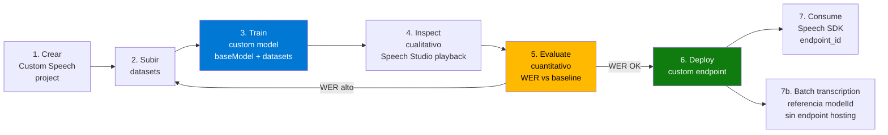

# Custom Speech — adaptar Speech-to-Text al dominio

> [!abstract] TL;DR
> **Custom Speech** es la capacidad de Azure AI Speech para **adaptar (fine-tune) el modelo de Speech-to-Text** (NO de Text-to-Speech) a un dominio específico mediante datasets de **plain text**, **structured text (.md)**, **pronunciation**, **audio + human-labeled transcript**, **audio only** (preview en `en-US`) y **display format (.md)**. El workflow oficial es: **crear proyecto → subir datasets → entrenar custom model (sobre base model) → evaluar con WER → deployar a custom endpoint → consumir con Speech SDK (`endpoint_id`) o Batch transcription**. La métrica primaria es **Word Error Rate (WER = (I+D+S)/N)** y se compara baseline vs custom. Custom Speech ≠ Custom Neural Voice (esa es para TTS, gated por Limited Access). En 2026 el flujo se gestiona indistintamente desde **Speech Studio** (legacy UI) y **Microsoft Foundry portal → Fine-tuning → AI Service fine-tuning** (UI moderna). El SDK/CLI/REST sigue siendo **API v3.2 de `speechtotext`**.

## 🎯 Relevancia en el examen

| Tipo de pregunta | Frecuencia | Escenario |
|---|---|---|
| Elegir tipo de dataset correcto para el problema | 🔥🔥🔥 | "Términos médicos mal reconocidos" → **plain text**; "acentos regionales" → **audio + transcript**; "X box debe sonar como X box" → **pronunciation** |
| Custom Speech vs Custom Neural Voice | 🔥🔥🔥 | Custom Speech = STT (no gated). CNV = TTS (Limited Access, gated). |
| Configurar `endpoint_id` en `SpeechConfig` | 🔥🔥🔥 | El custom endpoint NO se llama por URL — se pasa el deployment GUID a `speech_config.endpoint_id` |
| Métrica primaria de evaluación | 🔥🔥🔥 | **WER**, no accuracy ni F1; **TER** secundario para display format |
| Cuándo se cobra training | 🔥🔥 | Sólo si base model fue creado **on or after Oct 1, 2023** |
| Hosting cost | 🔥🔥 | Endpoint custom **cobra por hora desplegada** aunque no haya tráfico (excepción: batch transcription NO requiere endpoint) |
| Límites de datasets | 🔥🔥 | Audio zip ≤ 2 GB / 10 000 files, plain text ≤ 200 MB, pronunciation ≤ 1 MB, audio file ≤ 40 s en training |
| Region con dedicated hardware para audio training | 🔥🔥 | Solo regiones específicas procesan audio (~10 h/día, hasta 100 h por modelo) |
| API version Speech CLI | 🔥 | `--api-version v3.2` obligatorio |

## 📖 Concepto en profundidad

### ¿Qué hace Custom Speech?

El **Universal Language Model** (base model) está entrenado por Microsoft con audio genérico multidominio. Es excelente para conversación común, pero falla en:

1. **Vocabulario de dominio** (medicina, legal, banca, nombres propios, SKUs, jerga interna).
2. **Acentos / estilos de habla** específicos (call center latam, voz infantil, dictado médico).
3. **Ambiente acústico** (ruido de fábrica, drive-through, sala de control).
4. **Pronunciación no estándar** (acrónimos como "IEEE → i triple e", productos como "Xbox → X box").
5. **Display formatting** (ITN custom, rewrite, profanity filtering, capitalización de marca).

Custom Speech permite **augmentar el base model** (sin reentrenarlo desde cero) con datos del dominio para producir un **custom model**. Ese custom model se publica en un **custom endpoint** (deployment) y se invoca desde el Speech SDK indicando su `endpoint_id`.

> [!important] Aplicabilidad
> Un custom model funciona para **real-time speech to text**, **speech translation** y **batch transcription**. Para batch transcription, **NO se requiere endpoint desplegado** (se referencia el `modelId` directamente).

### Ciclo de vida (mental model)



### Modelos base y customización

- El **base model** es la *snapshot* de un Universal Language Model con fecha (`YYYYMMDD` en Speech Studio).
- Cada base model declara qué tipos de adaptación soporta (texto, audio, structured text, display format). En Speech Studio aparece entre paréntesis tras el nombre.
- **Stability**: una vez deployado, el comportamiento del custom (o del base) queda **congelado**: no muta cuando Microsoft publique un base más nuevo. Esto te aísla de regresiones.
- **Lifecycle**: cada modelo expone dos fechas:
  - `adaptationDateTime` — última fecha en que ese base puede usarse para entrenar.
  - `transcriptionDateTime` — última fecha en que el custom puede usarse para reconocimiento.
  - Tras esas fechas debes **recrear el modelo desde una base más reciente**.

### Charge for adaptation (⚠️ trampa fiscal)

- Training se cobra **solo si el base model fue creado on or after October 1, 2023**.
- Bases anteriores: training gratis (legacy).
- **Hosting del endpoint custom**: siempre cobra por hora desplegada (incluso sin tráfico).
- **Excepción**: Batch transcription usa el custom model sin requerir endpoint → ahorras hosting.

## 🗂️ Tipos de datasets (núcleo examinable)

| Data type | Usado en training | Usado en testing | Cantidad recomendada | Observación clave |
|---|---|---|---|---|
| **Plain text** | ✅ | ❌ | 1-200 MB de related text | Mejora **vocabulario / sustituciones**. Rápido (minutos). UTF-8 BOM. 1 utterance/línea. Sin URIs ni caracteres > U+00A1 |
| **Structured text** (`.md`) | ✅ (preview) | ❌ | ≤ 10 listas × 4 000 items × 50 000 sentences | Patrones template con `@list`. Tamaño ≤ 200 MB |
| **Pronunciation** | ✅ | ❌ | 1 KB - 1 MB (1 KB free tier) | Acrónimos, made-up words. NO usar para palabras comunes. **No combinable con structured text** (debe ir embebido dentro del .md) |
| **Audio + human-labeled transcript** | ✅ | ✅ | 1-100 h training / 0.5-5 h testing | **Mejor adaptación acústica**. Máx 40 s/archivo en training (30 s para Whisper). Zip ≤ 2 GB / 10 000 files. RIFF WAV mono PCM-16 8 kHz o 16 kHz |
| **Audio only** | ✅ (preview, sólo `en-US`) | ✅ (inspección visual) | 1-100 h training / 5+ files testing | Para test cualitativo principalmente |
| **Display format** (`.md`) | ✅ | ❌ | ≤ 10 MB | `#itn`, `#rewrite`, `#profanity`, `#test`. Limits: 200 ITN, 1000 rewrite, 1000 profanity |

> [!warning] Cuándo elegir cada tipo
>
> - **Vocabulario / jerga / nombres propios mal reconocidos** → **Plain text** (rapidísimo, sin audio).
> - **Patrones repetitivos (direcciones, comandos)** → **Structured text** con `@list`.
> - **Pronunciación no estándar (Xbox, IEEE, 3CPO)** → **Pronunciation file**.
> - **Acentos, ruido de fondo, estilos de habla** → **Audio + transcript** (única vía para mejora acústica real).
> - **Capitalización de marca, ITN custom (formato fechas/teléfonos), profanity** → **Display format**.

### Anatomía rápida de cada formato

**Plain text** (UTF-8 BOM, 1 sentence/line):

```text
Schedule a meeting with Dr. Garcia for Tuesday.
The patient presents with acute myocardial infarction.
Order 500 mg of ceftriaxone IV q12h.
```

**Pronunciation** (TSV, recognized form \t spoken form):

```tsv
3CPO	three c p o
CNTK	c n t k
IEEE	i triple e
Xbox	X box
```

**Structured text** (Markdown, `@list` + `#section`):

```markdown
@ list pet =
- cat
- dog
- fish

@ speech:phoneticlexicon
- cat/k ae t
- fish/f ih sh

#TrainingSentences
- what {@pet} do you have
- my {@pet} likes pizza
```

**Display format** (Markdown, secciones `#itn`, `#rewrite`, `#profanity`, `#test`):

```text
#itn
\d-\d-\d
\d-\l-\l-\d

#rewrite
contoso	Contoso
xbox	Xbox

#profanity
fakeprofanity

#test
Mask the fakeprofanity word	Mask the ************* word
```

## 🏗️ Cómo se hace (workflow end-to-end)

### Opción A — Microsoft Foundry portal (UI moderna 2026)

1. Foundry portal → **Fine-tuning** → **AI Service fine-tuning** → crear custom speech fine-tuning task.
2. Conectar Speech resource (kind `SpeechServices` o `AIServices`).
3. **Train model** → seleccionar base → seleccionar datasets → nombre/descripción → **Train**.
4. **Test models** → **Create test** → **Evaluate accuracy (Audio + transcript data)** → comparar **dos** modelos (custom vs baseline ideal).
5. Inspeccionar WER / TER en la página de resultados.
6. **Deploy** → endpoint custom → recuperar `endpoint_id` (GUID).

### Opción B — Speech Studio (UI legacy, sigue soportado)

1. `speech.microsoft.com` → **Custom speech** → crear proyecto (locale fijo, no cambiable).
2. **Speech datasets** → Upload (zip ≤ 2 GB).
3. **Train custom models** → seleccionar base → datasets → opcionalmente test inmediato.
4. **Test models** → **Evaluate accuracy** (cuantitativo) o **Inspect data** (cualitativo, playback).
5. **Deploy models** → custom endpoint → copiar **Endpoint ID** (GUID).

### Opción C — Speech CLI (`spx`, REST v3.2)

```bash
# Pre-requisito: spx config y resource configurados.
# 1. Crear modelo a partir de base + datasets
spx csr model create \
  --api-version v3.2 \
  --project ProjectId \
  --name "Medical-STT-v1" \
  --description "Adapted for cardiology dictation" \
  --dataset DatasetId \
  --language "en-US"

# 2. Crear evaluación (compara model1 vs model2)
spx csr evaluation create \
  --api-version v3.2 \
  --project ProjectId \
  --dataset TestDatasetId \
  --model1 CustomModelId \
  --model2 BaseModelId \
  --name "Cardio WER baseline vs custom"

# 3. Consultar estado y WER
spx csr evaluation status \
  --api-version v3.2 \
  --evaluation EvaluationId

# 4. Deploy a endpoint
spx csr endpoint create \
  --api-version v3.2 \
  --project ProjectId \
  --model CustomModelId \
  --name "Cardio-Endpoint" \
  --language en-US
```

> [!info] API version
> Speech CLI obliga a `--api-version v3.2`. Aún no soporta versiones posteriores en el momento de la verificación (2026-05-23).

### Opción D — REST API directa (Speech to text v3.2)

```bash
# Crear modelo custom (POST .../speechtotext/v3.2/models)
curl -v -X POST \
  -H "Ocp-Apim-Subscription-Key: $KEY" \
  -H "Content-Type: application/json" \
  -d '{
    "project":   { "self": "https://RESOURCE.cognitiveservices.azure.com/speechtotext/v3.2/projects/PROJECT_ID" },
    "displayName": "Medical-STT-v1",
    "baseModel":  null,
    "datasets":   [ { "self": "https://RESOURCE.cognitiveservices.azure.com/speechtotext/v3.2/datasets/DATASET_ID" } ],
    "locale":     "en-US"
  }' \
  "https://RESOURCE.cognitiveservices.azure.com/speechtotext/v3.2/models"
```

Endpoint pattern: `https://<RESOURCE>.cognitiveservices.azure.com/speechtotext/v3.2/{models|datasets|projects|evaluations|endpoints}`.

### Consumir el custom endpoint desde el Speech SDK (Python)

```python
import azure.cognitiveservices.speech as speechsdk

# 1. Config base con key + region de la Speech resource ORIGINAL
speech_config = speechsdk.SpeechConfig(
    subscription="YOUR_SPEECH_KEY",
    region="eastus",
)

# 2. CRITICAL: apuntar a custom endpoint mediante endpoint_id (GUID del deployment)
#    NO se pone una URL completa; sólo el GUID del endpoint deployado.
speech_config.endpoint_id = "aaaabbbb-0000-cccc-1111-dddd2222eeee"

# 3. (Opcional) locale — debe coincidir con la del custom model
speech_config.speech_recognition_language = "en-US"

# 4. Audio source
audio_config = speechsdk.audio.AudioConfig(filename="cardio_dictation.wav")

# 5. Recognizer normal — el endpoint_id hace todo el ruteo a tu custom model
recognizer = speechsdk.SpeechRecognizer(
    speech_config=speech_config,
    audio_config=audio_config,
)

result = recognizer.recognize_once_async().get()

if result.reason == speechsdk.ResultReason.RecognizedSpeech:
    print(result.text)
elif result.reason == speechsdk.ResultReason.NoMatch:
    print("No speech recognized.")
elif result.reason == speechsdk.ResultReason.Canceled:
    cancellation = result.cancellation_details
    print(f"Canceled: {cancellation.reason} / {cancellation.error_details}")
```

> [!danger] Trampa de SDK
> Se usa `speech_config.endpoint_id = "<GUID>"`, **NO** `speech_config.endpoint = "<URL>"`. El parámetro `endpoint` (URL completa) sirve para apuntar a containers / regiones, no a custom models. El AI-103 te puede preguntar exactamente qué propiedad. Memoriza: **`endpoint_id` → custom model deployment**.

### Consumir el custom model en Batch Transcription (sin endpoint)

```python
# Batch transcription puede referenciar custom modelId sin desplegar endpoint
# (ahorra hosting cost). Se hace en el body del job:
job = {
  "displayName": "Cardio batch",
  "locale": "en-US",
  "contentUrls": ["https://blob.../audio.wav?<SAS>"],
  "model": {
    "self": "https://RESOURCE.cognitiveservices.azure.com/speechtotext/v3.2/models/MODEL_ID"
  }
}
```

Ver `[[speech-stt-realtime-batch]]` para el flujo completo de batch.

## 📊 Evaluación: WER y TER al detalle

### Word Error Rate (industria estándar)

$$
\text{WER} = \frac{I + D + S}{N} \times 100
$$

- **I (Insertion)**: palabras añadidas que no están en el ground truth.
- **D (Deletion)**: palabras del ground truth que el modelo omitió.
- **S (Substitution)**: palabras cambiadas por otras.
- **N**: total de palabras del transcript humano (ground truth).

> [!warning] La unidad cambia entre Portal y API
> En Foundry portal / Speech Studio el WER se muestra **multiplicado por 100 (porcentaje)**. En **Speech CLI y REST API** el `wordErrorRate` viene como **decimal (no × 100)** — ej. `0.0289` = 2.89 %. **El examen te puede hacer esta cazada.**

### Token Error Rate (TER) — extensión 2025

Mismo formato `(I+D+S)/N`, pero a **nivel de token** considerando puntuación, capitalización, ITN, lexical. Se usa para evaluar **display format** (no sólo el lexical). Requiere que el ground truth contenga puntuación/capitalización/ITN.

### Cómo interpretar los números (rúbrica oficial Microsoft)

| WER | Calidad |
|---|---|
| **5-10 %** | Buena calidad, lista para producción |
| **20 %** | Aceptable; considerar más training |
| **≥ 30 %** | Mala calidad — requiere customization fuerte |

### Diagnóstico por tipo de error

| Error dominante | Causa probable | Mitigación |
|---|---|---|
| **Deletion** alta | Audio débil, micro lejano | Capturar audio más cerca de la fuente |
| **Insertion** alta | Ruido / crosstalk | Reducir ruido, separar canales |
| **Substitution** alta | Vocabulario de dominio insuficiente | Añadir **plain text** o **audio + transcript** con esos términos |

### Ejemplo numérico (verbatim docs)

> Ground truth: *"How are you Jones"* (4 palabras).
> Recognized: *"How a you John"* (4 palabras).
>
> - **I = 1** ("a" añadida)
> - **D = 1** ("are" omitida)
> - **S = 1** ("Jones" → "John")
> - **N = 4**
> - WER = (1+1+1)/4 × 100 = **75 %** (docs ejemplifican otra distribución que da 60 %)

## 📦 Límites operativos (memorizables)

| Recurso | Límite |
|---|---|
| Audio + transcript training file length | **≤ 40 s** (≤ 30 s para Whisper customization) |
| Audio testing file length | ≤ 2 horas |
| Audio zip archive | **≤ 2 GB** o **10 000 files** |
| Audio formato | **RIFF WAV mono PCM-16, 8 kHz o 16 kHz** |
| Plain text file | ≤ **200 MB**, UTF-8 BOM, 1 utterance/línea |
| Structured text file (.md) | ≤ 200 MB |
| Pronunciation file | ≤ **1 MB** (1 KB en free tier) |
| Display format file (.md) | ≤ **10 MB** |
| Audio training por modelo (regiones con HW dedicado) | hasta **100 h**, ~**10 h/día** procesadas |
| Repeticiones permitidas en plain text | ≤ 3 veces el mismo carácter/palabra/grupo |
| UTF-8 ceiling en plain text | sin chars > U+00A1, sin URIs |

## ⚖️ Custom Speech vs Custom Neural Voice (mega-trampa AI-103)

| Dimensión | **Custom Speech** | **Custom Neural Voice (CNV)** |
|---|---|---|
| Dirección | Audio **→** texto (STT) | Texto **→** audio (TTS) |
| Tipo de modelo base | Universal Language Model | Neural voice model |
| Gating | **No gated** (cualquier cliente) | **Gated / Limited Access** — requiere aplicación y aprobación de Microsoft |
| Training data | Audio + transcripts del dominio, plain text, pronunciation, structured text | Voice talent recordings + consent statements (legales obligatorios) |
| Endpoint deployment | Sí (custom endpoint con GUID) | Sí (custom voice endpoint) |
| Speech SDK usage | `speech_config.endpoint_id = "<GUID>"` | `SpeechSynthesisVoiceName = "<custom_voice_short_name>"` + endpoint |
| Riesgo ético | Bajo (transcripción no genera deepfake) | Alto — Responsible AI estricta (consent + watermarking) |
| Casos | Call center con jerga, dictado médico, comandos industriales | Marca de voz corporativa, narradores AI propios |

> [!danger] Pregunta clásica AI-102/103
> *"¿Qué servicio requiere aprobación de Microsoft por Limited Access?"* → **Custom Neural Voice** (también Face/Identify y algunas funciones de Speaker Recognition). Custom Speech **no** está gated.

## 🪤 Trampas del examen (≥ 10, todas verbatim/derivadas de docs)

1. **Custom Speech ≠ Custom Neural Voice.** STT vs TTS. CNV es gated; Custom Speech no.
2. **`endpoint_id` ≠ `endpoint`.** Para custom STT model se usa `speech_config.endpoint_id = "<GUID>"`. La URL no.
3. **`speech_config.endpoint_id` admite el GUID del deployment, NO el `modelId` directamente.** Crear endpoint es un paso obligatorio (excepto batch).
4. **Batch transcription NO requiere desplegar endpoint** → referencia `modelId` directo → ahorra hosting cost.
5. **WER en Portal viene × 100 (porcentaje); en REST API viene como decimal** (ej. `0.0289`).
6. **Training se cobra sólo si baseModel ≥ Oct 1, 2023.** Bases más antiguas: training gratis. Hosting de endpoint: siempre cobra.
7. **Audio training tiene tope de 40 s por archivo** (30 s para Whisper). Archivos más largos se ignoran en la parte acústica (se usa solo el texto del transcript).
8. **Plain text training es la vía más rápida** (minutos vs días) y es la **recomendación por defecto** de Microsoft. Empieza por aquí salvo que necesites adaptación acústica.
9. **Pronunciation file NO se puede usar junto a Structured text como dataset separado**: la pronunciación debe ir embebida en el `.md` mediante `@ speech:phoneticlexicon`.
10. **Audio only para training está en preview y solo `en-US`.** Para otros locales necesitas obligatoriamente transcript.
11. **Audio + transcript en otros formatos que no sean RIFF WAV mono PCM-16 8/16 kHz fallan.** Convertir con SoX antes de subir.
12. **Locale del proyecto no se puede cambiar después de crearlo.** El dataset, base model y custom model deben coincidir en locale.
13. **Speech CLI exige `--api-version v3.2`** (no soporta versiones posteriores aún).
14. **`adaptationDateTime` vs `transcriptionDateTime`**: el primero es el último día para entrenar con ese base; el segundo es el último día para usar tu custom para reconocer.
15. **Custom Speech NO mejora errores de Insertion/Deletion** por la vía del lenguaje — sólo Substitution. Los I/D requieren mejor audio o ambiente. (Verbatim: *"Custom speech can capture word context only to reduce substitution errors, not insertion or deletion errors"*).
16. **Region matters**: si entrenas con audio, la Speech resource debe estar en una **región con dedicated hardware** o el training tardará días extra. Tras entrenar, puedes copiar el modelo a otra región con `Models_CopyTo`.
17. **Speech Studio sigue siendo el nombre oficial** del portal legacy en `speech.microsoft.com`, pero Microsoft está migrando el flujo a **Microsoft Foundry portal → Fine-tuning → AI Service fine-tuning**. Ambos coexisten.
18. **TER ≠ WER.** TER incluye puntuación, capitalización e ITN; requiere ground truth con esos detalles. Para SSML/display use cases preguntan TER.

## 🧠 Mnemotecnia

- **"PASS-PD"** — los seis dataset types: **P**lain text, **A**udio+transcript, **S**tructured text, **S**pelling (Pronunciation), **P**review (audio-only), **D**isplay format.
- **"S < I, D"** — Custom Speech mejora **S**ubstitutions, no **I**nsertions ni **D**eletions (esos son problemas de captura, no de modelo).
- **"WER = IDS / N × 100"** — Insertion, Deletion, Substitution sobre N words. (Mnemónico: "I Don't See N").
- **"5-10-20-30"** — rúbrica de WER: 5-10 % bueno, 20 % aceptable, ≥ 30 % malo.
- **"40 segundos de fama"** — máximo por archivo de audio training (40 s).
- **"2 GB / 10 K"** — zip de audio: 2 GB o 10 000 files.
- **"endpoint_id no endpoint"** — propiedad del SDK para custom STT.
- **"CNV pide visa, Custom Speech no"** — CNV es gated, Custom Speech libre.

## 🔗 Conceptos relacionados

- [[speech-stt-realtime-batch]] — los tres modos STT base sobre los que se aplica el custom model.
- [[speech-tts-voices-neural]] — voces TTS base; pivote para entender CNV (gated).
- [[speech-ssml-prosody-control]] — SSML controla salida TTS, ortogonal a Custom Speech.
- [[speech-as-agent-modality]] — integración voz↔agente; Custom Speech mejora el ASR del agente.
- [[content-safety-overview]] — Limited Access ⇄ gating model como CNV.
- [[foundry-fine-tuning-overview]] — Custom Speech vive bajo AI Service fine-tuning en Foundry portal.

## ❓ Autotest

**1.** Un cliente médico reporta que el ASR confunde *"ceftriaxona"* con *"cetriax"*. NO tiene presupuesto para grabar y transcribir audio. ¿Qué dataset usar primero?

- a) Audio + human-labeled transcript
- b) Plain text con frases que contengan "ceftriaxona"
- c) Custom Neural Voice
- d) Display format con `#rewrite`

<details><summary>Respuesta</summary>

**b)**. Sin audio disponible, **plain text** es la vía recomendada (rápida, minutos). Audio+transcript sería ideal pero el cliente no lo tiene. CNV es TTS (irrelevante). `#rewrite` cambia la forma de display, no la recognition.
</details>

**2.** Quieres usar tu modelo custom solo en un job de **batch transcription** mensual. ¿Necesitas desplegar el custom endpoint?

- a) Sí, siempre
- b) No — batch transcription referencia el `modelId` directamente
- c) Sí, pero puedes apagarlo entre runs
- d) No para batch, pero sí para fast transcription

<details><summary>Respuesta</summary>

**b)**. Verbatim docs: *"A hosted deployment endpoint isn't required to use custom speech with the Batch transcription API"*. Esto ahorra hosting cost.
</details>

**3.** En el Speech SDK Python, ¿cómo configuras el uso de un custom STT model?

- a) `speech_config.endpoint = "https://<region>.api.cognitive.microsoft.com/<guid>"`
- b) `speech_config.custom_model_id = "<GUID>"`
- c) `speech_config.endpoint_id = "<GUID>"`
- d) Pasando el GUID en el constructor de `SpeechRecognizer`

<details><summary>Respuesta</summary>

**c)**. La propiedad correcta es **`endpoint_id`** con el GUID del deployment. `endpoint` (URL) es para containers / regiones, no para custom models.
</details>

**4.** Tu evaluación devuelve `wordErrorRate1 = 0.085` vía REST API. ¿Cómo interpretarlo?

- a) 0.085 % WER — excelente
- b) 8.5 % WER — buena calidad, lista para producción
- c) 85 % WER — pésimo
- d) WER en REST API ya viene escalado entre 0 y 100

<details><summary>Respuesta</summary>

**b)**. REST API y Speech CLI devuelven WER como decimal (no porcentaje): 0.085 = **8.5 %**, que cae en la franja 5-10 % "good quality, ready to use". Portal sí muestra el porcentaje multiplicado por 100.
</details>

**5.** Tu equipo necesita una **voz sintética propia** para el IVR corporativo. ¿Custom Speech sirve?

- a) Sí, entrenas Custom Speech con grabaciones del talento
- b) No, eso es Custom Neural Voice — STT vs TTS y además está gated (Limited Access)
- c) Sí, pero pidiendo aprobación previa a Microsoft
- d) Custom Speech genera voz si subes `phonetic` data

<details><summary>Respuesta</summary>

**b)**. Custom Speech es **STT** (Audio → Texto). Para una voz propia se necesita **Custom Neural Voice (TTS)**, que además está **gated** (Limited Access — aplicación y aprobación de Microsoft).
</details>

**6.** Subes 5 GB de audio en un único zip y el upload falla. ¿Por qué?

- a) Audio sólo acepta MP3, no WAV
- b) Zip máximo 2 GB o 10 000 files
- c) Need to be in Foundry portal, no Speech Studio
- d) Need approval por Limited Access

<details><summary>Respuesta</summary>

**b)**. Límite oficial: **2 GB o 10 000 files por zip**. Dividir en varios zip y entrenar con multiple datasets.
</details>

## ✅ Control de calidad (auto-rúbrica)

| Dimensión | Nota |
|---|---|
| Completitud (cubre datasets, training, evaluation WER/TER, deployment, SDK consumption, lifecycle, charging, CNV comparison, limits) | **10/10** |
| Exactitud técnica (verbatim Microsoft Learn: WER fórmula, dataset limits, audio specs, API v3.2, `endpoint_id`, charge for adaptation policy, lifecycle dates) | **10/10** |
| Alineación al examen (trampas reales, comparación CNV gating, REST decimal vs Portal percentage, batch sin endpoint) | **9.5/10** |
| Claridad pedagógica (mermaid lifecycle, tabla 6 datasets, snippets Python + CLI + REST, mnemotecnias, autotest 6 Q) | **9.5/10** |

*Verificado a fecha 2026-05-23 contra Microsoft Learn (custom-speech-overview, how-to-custom-speech-train-model, how-to-custom-speech-test-and-train, how-to-custom-speech-evaluate-data).*
