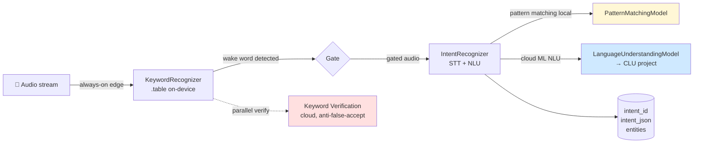
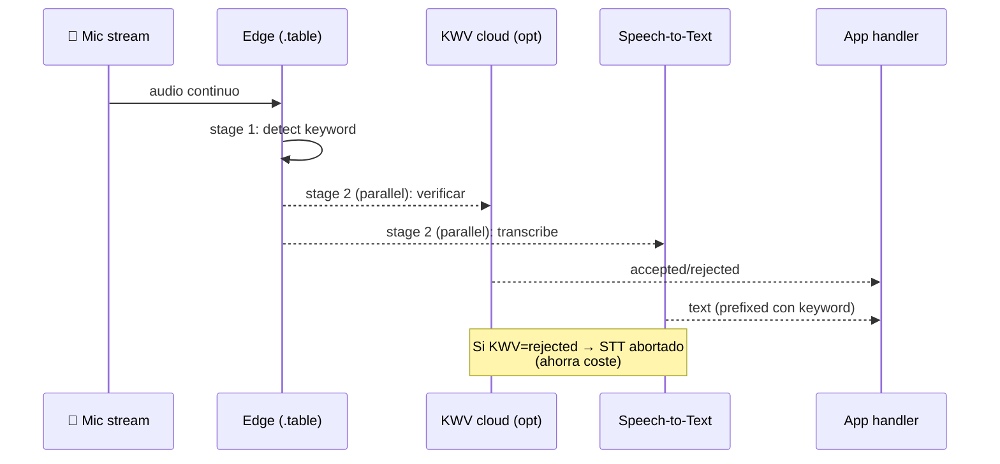
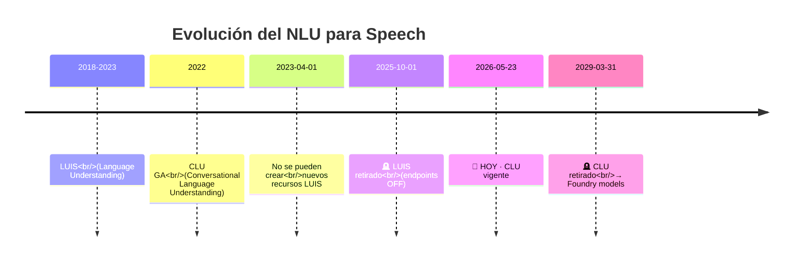
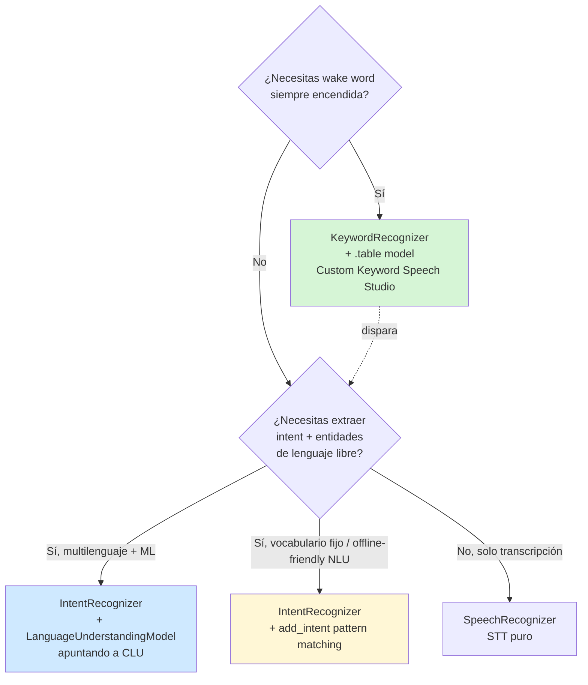

# Intent recognition + Keyword recognition (Speech SDK)

> [!abstract] TL;DR
> El Speech SDK ofrece **dos primitivas de voz orientadas a comandos**: (1) **Intent recognition** — convierte audio en *intent* mediante (a) **CLU** (`LanguageUnderstandingModel` referenciando un proyecto de Conversational Language Understanding) o (b) **pattern matching local** (`add_intent` con frases/IDs, sin ML, sin cloud para el NLU); y (2) **Keyword recognition** — detecta una *wake word* en streaming usando un modelo on-device `.table` generado por **Custom Keyword en Speech Studio**, opcionalmente verificado en cloud (Keyword Verification, KWV) en paralelo con Speech-to-Text. El patrón clásico de asistente de voz es: `.table` model dispara → STT + intent. ⚠️ **LUIS ya está retirado (1-oct-2025)**, hoy 2026-05-23; cualquier flujo `IntentRecognizer` con un *app_id* LUIS está muerto: migración obligatoria a **CLU** (que a su vez se retira el **31-marzo-2029** a favor de **Foundry models**). Para el examen AI-103 esto es **AI-102 carryover** secundario: aparece en preguntas de "elegir el SDK correcto" y "qué clase usar para wake word".

## 🎯 Relevancia en el examen

| Aspecto | Frecuencia | Forma típica |
|---|---|---|
| Elegir entre `IntentRecognizer` (CLU) vs `KeywordRecognizer` | 🔥🔥 | Drag-and-drop "match service to scenario" |
| Distinguir **pattern matching** (local, sin ML) vs **CLU** (cloud, ML) | 🔥🔥 | "Cheapest / offline-capable NLU on device" |
| Saber que se necesita un **modelo `.table`** generado en Custom Keyword | 🔥🔥 | Pregunta de pipeline IoT/asistente |
| Reconocer **LUIS deprecated** y CLU como sucesor | 🔥 | Trampa "select the deprecated service" |
| Combinar wake word + STT (gating cloud) | 🔥 | Pregunta de arquitectura |

🔥🔥🔥 = casi seguro · 🔥🔥 = probable · 🔥 = posible.

## 📖 Concepto en profundidad

### 1. Las dos primitivas (mapa mental)



- **Keyword recognition** vive en el **edge** (privacy gate) — siempre encendida, ligera, sin cloud (salvo KWV opcional).
- **Intent recognition** dispara **tras** la wake word y resuelve la intención. Tres modos:
  1. **Pattern matching** (`PatternMatchingModel`, `add_intent`): determinístico, local, sin red, sin coste de NLU.
  2. **CLU** (`LanguageUnderstandingModel` con `app_id` = project name CLU): ML, multilingüe, entidades, deployment slots.
  3. ⚠️ **LUIS legacy** (`LanguageUnderstandingModel` con LUIS app GUID): **retirado el 1-oct-2025**. Endpoints OFF. Solo aparece en preguntas-trampa.

### 2. Por qué Microsoft separa `KeywordRecognizer` de `IntentRecognizer`

| Dimensión | KeywordRecognizer | IntentRecognizer |
|---|---|---|
| Ejecución | Edge (modelo `.table` cargado en memoria) | Cloud (CLU/STT) o local (pattern) |
| Privacidad | **Privacy gate** — audio no sale del dispositivo hasta el "accept" | Audio enviado a Azure para STT+NLU |
| Coste por uso | **Gratis** (modelo gratis, runtime gratis con SDK) | STT + Language Service por transacción |
| Latencia | Sub-segundo | Depende de red |
| Lifetime modelo `.table` | Basic ≤ 15 min de training · Advanced ≤ 48 h | N/A |

> [!important] La **wake word es siempre on-device**. Si te preguntan dónde se ejecuta el reconocimiento de "Hey Cortana": **edge**, no cloud. Cloud solo aparece si activas **Keyword Verification** (KWV) en paralelo con STT.

### 3. Stages del keyword recognition (multi-etapa)



- Métricas: **correct accept rate** (true positive) ↑ y **false accept rate** (false positive) ↓.
- KWV añade **0 ms de latencia percibida** porque corre **en paralelo** con STT.
- KWV **fuerza el prefijo keyword** en el resultado STT → mejora accuracy del comando posterior.
- STT con KWV permite hasta **5 s de pausa** tras la keyword (vs end-of-speech estándar) — soporta patrones `<keyword> <pause> <command>`.

### 4. Custom Keyword en Speech Studio — tipos de modelo

| Tipo | Tiempo training | Uso recomendado | Precisión |
|---|---|---|---|
| **Basic** | ≤ 15 min | Demo / prototipado rápido | Aceptable, no óptima |
| **Advanced** | ≤ 48 h | **Producto en producción** | Mejor (base + simulated training data) |

- **No subes datos de entrenamiento** — Custom Keyword genera training data sintética.
- Eliges **pronunciaciones** durante la creación (cubrir variantes esperadas vs evitar false accepts).
- Output: archivo binario **`.table`** que cargas con `KeywordRecognitionModel.from_file(...)`.
- **Coste**: $0 generar modelo, $0 ejecutar on-device con Speech SDK.

### 5. CLU como sucesor de LUIS — y la siguiente transición



⚠️ **AI-103 carryover**: el examen aún incluye CLU como "el NLU para voice intents" porque el blueprint heredó de AI-102. Pero el path "moderno" recomendado por Microsoft Learn es **Foundry models** (GPT-4o + function calling) para command-and-control conversacional. Mantén ambos en la cabeza.

## 🏗️ Cómo se hace

### Setup común (Speech SDK Python)

```bash
pip install azure-cognitiveservices-speech
```

### A. Intent recognition con CLU (recomendado, vigente en 2026)

```python
import azure.cognitiveservices.speech as speechsdk
from azure.cognitiveservices.speech.intent import (
    LanguageUnderstandingModel,
    IntentRecognizer,
)

# 1) Speech config — la KEY/region son del recurso Foundry (Microsoft.CognitiveServices/accounts kind=AIServices)
speech_config = speechsdk.SpeechConfig(
    subscription="<SPEECH_KEY>",
    region="<REGION>",
)
speech_config.speech_recognition_language = "en-US"

# 2) Audio source
audio_config = speechsdk.audio.AudioConfig(use_default_microphone=True)

# 3) Recognizer
recognizer = IntentRecognizer(
    speech_config=speech_config,
    audio_config=audio_config,
)

# 4) Apuntar a un proyecto CLU desplegado
#    app_id = nombre del proyecto CLU
#    Hay que configurar también el endpoint del recurso Language vía variables
#    de entorno o propiedades (CluKey, CluEndpoint, CluProjectName, CluDeploymentName)
model = LanguageUnderstandingModel(app_id="<CLU_PROJECT_NAME>")
recognizer.add_all_intents(model)

# 5) Reconocer una sola vez
result = recognizer.recognize_once_async().get()

if result.reason == speechsdk.ResultReason.RecognizedIntent:
    print(f"Intent ID: {result.intent_id}")
    print(f"CLU JSON : {result.intent_json}")  # full CLU response: intents, entities, confidence
    print(f"Text     : {result.text}")
elif result.reason == speechsdk.ResultReason.RecognizedSpeech:
    print(f"Reconocido pero sin intent: {result.text}")
elif result.reason == speechsdk.ResultReason.NoMatch:
    print("Audio no reconocido.")
elif result.reason == speechsdk.ResultReason.Canceled:
    print(f"Cancelado: {result.cancellation_details.reason}")
```

> [!warning] La clase **se sigue llamando `LanguageUnderstandingModel`** (legacy LUIS naming) aunque el backend ya sea CLU. Es una **pregunta-trampa clásica**: te muestran un nombre y te dicen "esto es LUIS" → falso, es la misma API client-side apuntando a CLU.

### B. Intent recognition con pattern matching (local, sin cloud NLU)

```python
import azure.cognitiveservices.speech as speechsdk
from azure.cognitiveservices.speech.intent import IntentRecognizer

speech_config = speechsdk.SpeechConfig(subscription=key, region=region)
audio_config = speechsdk.audio.AudioConfig(use_default_microphone=True)
recognizer = IntentRecognizer(speech_config=speech_config, audio_config=audio_config)

# add_intent(simple_phrase, intent_id)
recognizer.add_intent("turn on the light", "TurnOn")
recognizer.add_intent("turn off the light", "TurnOff")
recognizer.add_intent("what time is it", "AskTime")

# Patrones con entidades opcionales:
# recognizer.add_intent("set the {object} to {state}", "SetState")

result = recognizer.recognize_once_async().get()
if result.reason == speechsdk.ResultReason.RecognizedIntent:
    print(result.intent_id)  # "TurnOn", "TurnOff"...
```

- **Coste**: solo STT (no hay llamada NLU).
- **No** soporta ML; solo matching textual/patrón.
- Útil para **command-and-control offline** con vocabulario fijo.

### C. Keyword recognition (wake word) — modelo `.table`

```python
import azure.cognitiveservices.speech as speechsdk

audio_config = speechsdk.audio.AudioConfig(use_default_microphone=True)

# .table descargado desde Custom Keyword en Speech Studio
keyword_model = speechsdk.KeywordRecognitionModel("computer.table")

keyword_recognizer = speechsdk.KeywordRecognizer(audio_config=audio_config)

# Reconocimiento bloqueante hasta detectar la wake word
result = keyword_recognizer.recognize_once_async(keyword_model).get()

if result.reason == speechsdk.ResultReason.RecognizedKeyword:
    print("Wake word detectada — disparando reconocimiento principal...")
    # → ahora pasa el control al IntentRecognizer/SpeechRecognizer
```

> [!note] **`KeywordRecognizer` NO requiere `SpeechConfig`** — solo `AudioConfig`. No hay llamada cloud; el modelo `.table` es 100 % on-device. Pregunta-trampa frecuente: "¿qué credencial necesitas para detectar la wake word offline?" → **ninguna**.

### D. Patrón completo: wake word → intent (asistente de voz)

```python
import azure.cognitiveservices.speech as speechsdk
from azure.cognitiveservices.speech.intent import IntentRecognizer, LanguageUnderstandingModel

audio_config = speechsdk.audio.AudioConfig(use_default_microphone=True)
speech_config = speechsdk.SpeechConfig(subscription=key, region=region)

keyword_model = speechsdk.KeywordRecognitionModel("hey_robot.table")
keyword_recognizer = speechsdk.KeywordRecognizer(audio_config=audio_config)

intent_recognizer = IntentRecognizer(speech_config=speech_config, audio_config=audio_config)
intent_recognizer.add_all_intents(LanguageUnderstandingModel(app_id="<CLU_PROJECT>"))

while True:
    # Stage 1: edge — wake word
    kw_result = keyword_recognizer.recognize_once_async(keyword_model).get()
    if kw_result.reason != speechsdk.ResultReason.RecognizedKeyword:
        continue

    # Stage 2: cloud — intent
    intent_result = intent_recognizer.recognize_once_async().get()
    if intent_result.reason == speechsdk.ResultReason.RecognizedIntent:
        handle(intent_result.intent_id, intent_result.intent_json)
```

## 📊 Cuándo usar qué



| Escenario | Servicio | Razón |
|---|---|---|
| Asistente de voz IoT siempre encendido | `KeywordRecognizer` + `IntentRecognizer(CLU)` | Privacy gate + NLU rico |
| App command-and-control offline (radio, luz) | `IntentRecognizer` con `add_intent` (pattern) | Sin coste NLU, sin red |
| Bot de call center (texto + voz, multilenguaje) | CLU directo o **Foundry models** | NLU avanzado, multi-turn |
| Solo transcribir lo que dice el usuario | `SpeechRecognizer` ([[speech-stt-realtime-batch]]) | No necesitas intent |
| Voice agent moderno conversacional | [[speech-as-agent-modality]] / [[speech-realtime-api-azure-openai]] | Path 2026, no CLU |

## 🪤 Trampas del examen

1. **`LanguageUnderstandingModel` ≠ LUIS exclusivo.** El nombre de la clase es legacy; ahora apunta a **CLU**. No la confundas con "servicio deprecated"; la *clase del SDK* sigue viva, el *backend LUIS* murió 2025-10-01.
2. **LUIS está retirado**. Cualquier opción de respuesta que diga "crear un nuevo recurso LUIS y …" es **incorrecta** automáticamente en 2026. Solo válida en preguntas de migración histórica.
3. **`add_intent` ≠ `add_all_intents`**:
   - `add_intent("frase", "id")` → **pattern matching local**, sin CLU.
   - `add_all_intents(model)` → carga **todos los intents del proyecto CLU**.
4. **`KeywordRecognizer` NO recibe `SpeechConfig`** — solo `AudioConfig`. No hay cloud, no hay key. Modelo `.table` es self-contained.
5. **`.table` se genera SOLO en Custom Keyword (Speech Studio)** — no en Foundry portal "Language Studio", no en CLU. Si la respuesta dice "genera el modelo de wake word en CLU project" → falso.
6. **Basic vs Advanced model**: Basic ≤ 15 min, Advanced ≤ 48 h. Si te piden "modelo de producción con mejor accuracy" → **Advanced**. "Demo rápida" → **Basic**.
7. **Detección de keyword EN MEDIO de una frase NO se soporta**. La doc dice literalmente *"Detecting a keyword in the middle of a sentence or utterance isn't supported"*. La wake word debe estar **precedida de silencio**.
8. **Keyword Verification (KWV) es cloud y SOLO acompaña STT**, en paralelo. Sin coste extra sobre el STT base. No es opcional desactivar selectivamente: la wake word *on-device* siempre puede ir sin KWV; el combo wake+STT se beneficia de KWV.
9. **`result.intent_json` solo se rellena con CLU/LUIS**, no con pattern matching (en pattern, `intent_id` está, `intent_json` puede estar vacío).
10. **CLU también se retira (2029-03-31)** — Microsoft recomienda migrar a **Foundry models** para nuevos proyectos. En AI-103 (carryover AI-102) sigue siendo evaluable, pero ojo a preguntas tipo "qué servicio elegirías para un nuevo desarrollo en 2026" → respuesta moderna = Foundry models / function calling.
11. **`speech_recognition_language` se setea en el `SpeechConfig`**, no en el `LanguageUnderstandingModel`. Confusión típica con LUIS donde la "culture" iba en la app.
12. **Pattern matching admite slots con `{entidad}`** en la frase — esto es una capacidad poco conocida, válida para mini-NLU local sin ML.
13. **`recognize_once_async()` vs continuous**: `KeywordRecognizer` típicamente se usa en *loop* manual; `IntentRecognizer` soporta también `start_continuous_recognition()` con event handlers (`recognized`, `canceled`).
14. **CLU requiere recurso de tipo Language (`Microsoft.CognitiveServices/accounts kind=TextAnalytics` o el unificado Foundry `kind=AIServices`)**, no el recurso Speech. El `IntentRecognizer` necesita ambas credenciales si usas CLU.

## 🧠 Mnemotecnia

- **"K-Edge, I-Cloud"** → **K**eywordRecognizer = **Edge** · **I**ntentRecognizer = **Cloud** (salvo pattern).
- **"`.table` is tribal"** → el `.table` model es tribal (privado, on-device), no se sube a la nube.
- **"add_intent local, add_all_intents lobal (global)"** → mnemónica fonética: `add_intent` = local pattern; `add_all_intents` = global CLU.
- **"L-U-I-S = Long Unused, Inevitably Sunset"** → para recordar que LUIS ya está retirado.
- **Stages KWS**: **D**etect → **V**erify → **T**ranscribe (DVT).
- **Basic 15-min, Advanced 48-h** → "**B**ásico **B**reve, **A**dvanced **A**bundante".

## 🔗 Conceptos relacionados

- [[speech-stt-realtime-batch]] — Reconocimiento de voz base (STT que ejecuta tras la wake word).
- [[speech-as-agent-modality]] — Voz como modalidad en agentes Foundry (path moderno, sustituye CLU para conversacional).
- [[speech-tts-voices-neural]] — Respuesta del asistente tras detectar el intent.
- [[speech-custom-speech-models]] — Modelos custom de STT para mejorar la transcripción del comando.
- [[speech-realtime-api-azure-openai]] — Realtime API (GPT-4o voice) como reemplazo conversacional moderno.
- [[speech-multimodal-audio-reasoning]] — Razonamiento sobre audio sin STT-NLU clásico.
- [[speech-translation-foundry]] — Traducción multilenguaje en voz.

⚠️ **Wikilinks del brief que NO existen aún en el vault** (D.1-Language-Service todavía vacía): `[[text-luis-clu-intents-entities]]`, `[[text-luis-clu-utterances-training]]`. Se dejan como wikilinks pendientes para que el orquestador los cree o los redirija; al ser CLU retirado en 2029 estos archivos serán principalmente histórico-carryover.

## ❓ Autotest

**1.** Desarrollas un dispositivo IoT que escucha *"Hey Lumio"* y enciende luces vía comando de voz. Debe funcionar sin enviar audio al cloud hasta detectar la wake word. ¿Qué combinación usas?

- a) `IntentRecognizer` con `add_intent("Hey Lumio turn on", "On")`
- b) `KeywordRecognizer` con `.table` model + después `IntentRecognizer` con CLU o pattern matching
- c) `SpeechRecognizer` continuo con regex en cliente
- d) CLU con deployment y `recognize_once_async`

<details><summary>Respuesta</summary>

**b)**. Único patrón que garantiza la **privacy gate**: la wake word se detecta on-device con un modelo `.table` (sin enviar audio); solo después se activa el reconocimiento del comando. (a) y (c) enviarían todo el audio al cloud constantemente. (d) no detecta wake word.
</details>

**2.** ¿Cuál de estas afirmaciones sobre **pattern matching** en `IntentRecognizer` es FALSA?

- a) Se configura con `add_intent("frase", "intent_id")`.
- b) No requiere un proyecto CLU.
- c) Soporta slots con sintaxis `{entidad}`.
- d) Aplica un modelo ML transformer para clasificar la intención.

<details><summary>Respuesta</summary>

**d)** es FALSA. Pattern matching es **determinístico**, basado en frases/plantillas, **sin ML**. Por eso puede funcionar sin coste de NLU y de forma más predecible para vocabulario fijo. Para ML real se usa CLU.
</details>

**3.** Una aplicación legacy de 2023 usa `LanguageUnderstandingModel(app_id="<luis-guid>")`. Hoy (mayo 2026) deja de funcionar. ¿Por qué?

- a) El paquete `azure-cognitiveservices-speech` cambió de nombre.
- b) LUIS fue retirado el 1 de octubre de 2025; sus endpoints ya no responden.
- c) La clase `LanguageUnderstandingModel` fue eliminada del SDK.
- d) Se requiere migrar a la nueva clase `FoundryIntentModel`.

<details><summary>Respuesta</summary>

**b)**. **LUIS retired 2025-10-01**. La clase `LanguageUnderstandingModel` sigue existiendo (apunta ahora a proyectos CLU), pero un `app_id` LUIS no resuelve a ningún endpoint vivo. La migración soportada es **CLU**. (Microsoft también recomienda Foundry models para nuevos desarrollos, dado que CLU se retirará en 2029.)
</details>

**4.** ¿Qué tipo de modelo de **Custom Keyword** elegirías para llevar a producción un altavoz inteligente con wake word *"Alpha"*?

- a) **Basic** — listo en 15 minutos, accuracy óptima.
- b) **Advanced** — hasta 48 horas de generación, mejor accuracy.
- c) **Premium** — entrenamiento on-prem con tus propios datos.
- d) **Neural KWS** — modelo cloud-only.

<details><summary>Respuesta</summary>

**b) Advanced**. Microsoft Learn lo describe como *"Best suited for product integration purposes"* — tarda hasta 48 h pero mejora la accuracy con simulated training data. Basic es solo para demo/prototipado. (c) y (d) no existen como SKUs de Custom Keyword.
</details>

**5.** ¿Cuál de estos NO es un beneficio de **Keyword Verification (KWV)** corriendo en paralelo con STT?

- a) No añade latencia perceptible al resultado STT.
- b) Si KWV rechaza, el STT se aborta para ahorrar coste.
- c) STT permite una pausa de hasta 5 segundos tras la keyword.
- d) Elimina por completo la necesidad de un modelo `.table` on-device.

<details><summary>Respuesta</summary>

**d)** es FALSA. KWV **complementa** la detección on-device, no la sustituye. El flujo siempre es: `.table` on-device dispara → KWV cloud verifica + STT transcribe en paralelo. Sin el modelo on-device, todo el audio se enviaría al cloud constantemente (anti-privacy).
</details>

## ✅ Control de calidad (auto-rúbrica)

| Dimensión | Nota | Justificación |
|---|---|---|
| Completitud | **9.5** | Cubre las 2 primitivas, los 3 modos de intent (CLU/pattern/LUIS-deprecated), wake word stages, KWV, Basic/Advanced, migración LUIS→CLU→Foundry. |
| Exactitud técnica | **9.5** | Verificado contra 4 páginas oficiales Microsoft Learn (intent-recognition, keyword-recognition-overview, CLU overview, LUIS migration). Fechas LUIS 2025-10-01 y CLU 2029-03-31 confirmadas. |
| Alineación al examen | **9** | 14 trampas reales (clase `LanguageUnderstandingModel` ≠ LUIS, KeywordRecognizer sin SpeechConfig, .table sólo Speech Studio, etc.), preguntas autotest estilo MS. |
| Claridad pedagógica | **9.5** | 4 diagramas mermaid (flowchart, sequence, timeline, decisión), tablas comparativas, 6 mnemónicas, snippets Python completos verificables. |

---

*Verificado a fecha 2026-05-23 contra Microsoft Learn. Nota: la clase `LanguageUnderstandingModel` del Speech SDK mantiene el nombre legacy aunque su backend válido en 2026 es CLU (no LUIS, retirado).*
