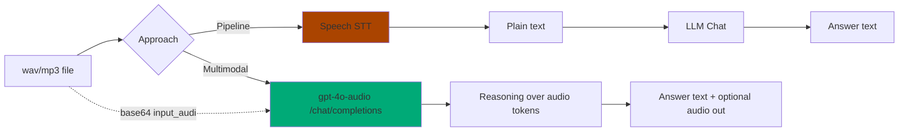
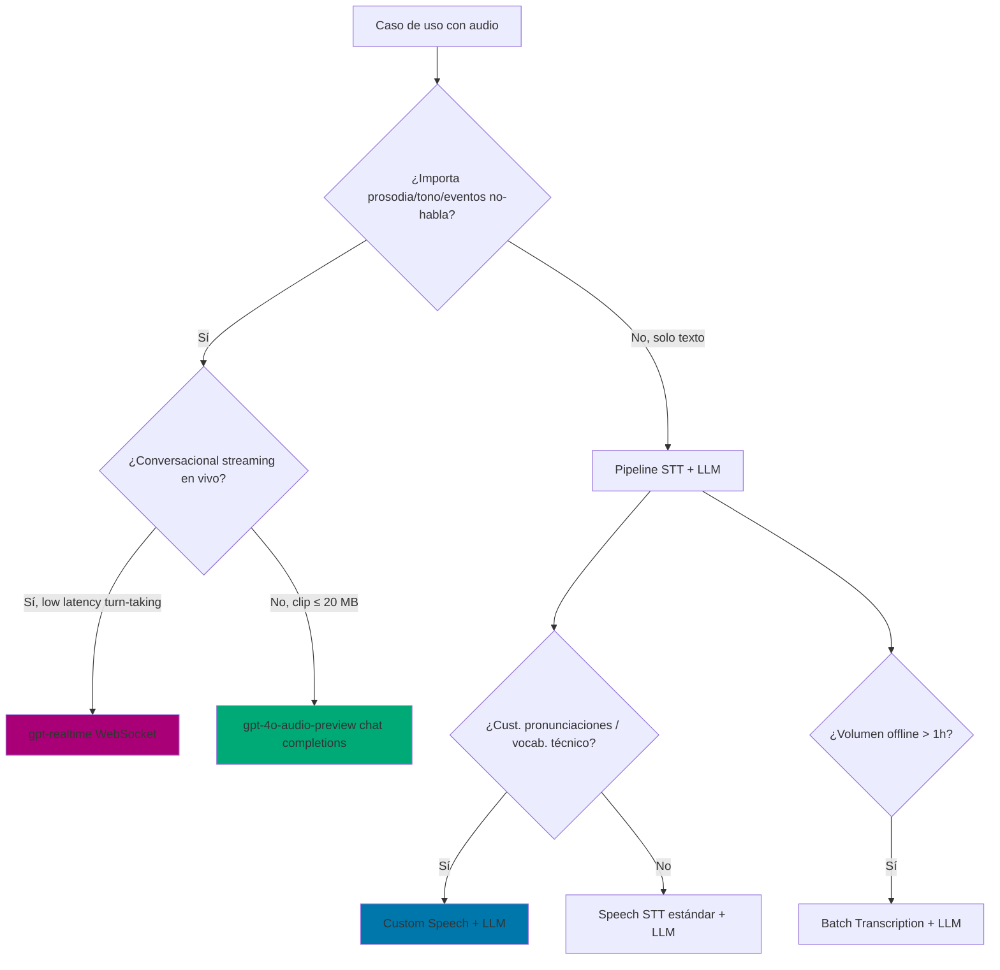

# Razonamiento multimodal con audio input (gpt-4o-audio family · Phi-4-multimodal)

> [!abstract] TL;DR
> Los modelos **audio-in / audio-out** del catálogo Azure OpenAI (`gpt-4o-audio-preview`, `gpt-4o-mini-audio-preview`) y `gpt-realtime` / `gpt-realtime-mini`, junto con `Phi-4-multimodal-instruct` (Foundry Models), permiten **transcribir, razonar y responder en una sola llamada `/chat/completions`** consumiendo audio como `input_audio` codificado en Base64. Reemplazan el pipeline clásico **STT → LLM → TTS** cuando la **prosodia, el tono y los eventos acústicos** son relevantes (sentiment de voz, scene analysis, meeting QA). Coste y latencia distintos: 1 sola call, **audio_tokens** facturados aparte (≈ 10× texto). `gpt-4o-audio-preview` es **chat completions síncrono**; `gpt-realtime` es **WebSocket bidireccional** — son productos distintos.

## 🎯 Relevancia en el examen

- 🔥🔥🔥 **Elegir entre pipeline (Speech STT + LLM) vs multimodal LLM audio**: la trampa más típica de D.2.
- 🔥🔥🔥 **Identificar `gpt-4o-audio-preview` ≠ `gpt-realtime`** (chat completions vs WebSocket conversational).
- 🔥🔥 **API shape**: `modalities`, `audio={voice,format}`, `input_audio` content type.
- 🔥🔥 **Phi-4-multimodal limitación**: NO acepta text+image+audio simultáneos.
- 🔥 **Audio tokens billing** y voces fijas (no custom voice).

Tipo de pregunta: escenario "necesito detectar emoción a partir de la **voz** del cliente y resumir → ¿qué modelo?" (multimodal LLM); o "transcripción 100% offline batch con custom lexicon → STT". Distinguir.

## 📖 Concepto en profundidad

### Por qué existe audio-in nativo en LLMs

El pipeline clásico **STT → LLM → TTS** convierte la señal acústica en **texto plano**, perdiendo:

- **Prosodia** (entonación, énfasis).
- **Tono emocional** (enfado, ironía, urgencia).
- **Eventos no-habla** (música, alarmas, risas, silencios, solapamientos).
- **Identidad y características del hablante** (no diarización, pero sí "voz cansada").

Un LLM **audio-native** tokeniza la forma de onda directamente (audio tokens), de modo que el razonamiento atiende a todas esas dimensiones sin pérdida intermedia.



### Familia de modelos con audio input/output

| Modelo | Modalidades I/O | Producto | Uso típico | Verificado |
|---|---|---|---|---|
| `gpt-4o-audio-preview` | text+audio ↔ text+audio | Azure OpenAI · `/chat/completions` | Reasoning audio asíncrono | ✓ |
| `gpt-4o-mini-audio-preview` | text+audio ↔ text+audio | Azure OpenAI · `/chat/completions` | Mismo, smaller/cheaper | ✓ |
| `gpt-realtime` | audio streaming ↔ audio streaming | Azure OpenAI · **WebSocket** `/realtime` | Conversational low-latency | ✓ |
| `gpt-realtime-mini` | audio streaming bidireccional | Azure OpenAI · WebSocket | Voice agents barato | ✓ |
| `gpt-4o-mini-tts` | text → audio | Azure OpenAI | TTS rápido | ✓ |
| `Phi-4-multimodal-instruct` | text + (image OR audio) | Foundry Models (serverless) | Razonamiento multimodal small | ✓ |
| `gpt-5` audio (preview) | text+audio ↔ text+audio | Azure OpenAI | Próxima generación | ⚠️ Disponibilidad/region rolling |

> [!warning] gpt-4o-audio-preview ≠ gpt-realtime
> Son **dos productos distintos** con API distintas. `gpt-4o-audio-preview` usa el endpoint REST `/chat/completions` (síncrono, request-response, basado en clip completo). `gpt-realtime` usa **WebSocket `/realtime`** con streaming bidireccional, VAD del servidor, turn-taking automático. Ver [[speech-realtime-api-azure-openai]].

### Audio tokens: una nueva unidad de facturación

Los modelos audio-native tokenizan la señal y exponen el desglose en la respuesta de la API:

```json
"usage": {
  "prompt_tokens": 120,
  "prompt_tokens_details": { "text_tokens": 20, "audio_tokens": 100 },
  "completion_tokens": 250,
  "completion_tokens_details": { "text_tokens": 50, "audio_tokens": 200 }
}
```

Los **audio_tokens** se facturan a una tasa muy superior a los text tokens (aproximadamente **un orden de magnitud**, ≈ 10×, varía por modelo y región). Implicación de examen: si un escenario pide minimizar coste y NO requiere capturar prosodia, **pipeline STT + LLM** es más barato.

### Phi-4-multimodal-instruct (Foundry Models)

`Phi-4-multimodal-instruct` es un SLM (small language model) **abierto pesos** desplegable serverless (pay-as-you-go MaaS) o managed compute. Acepta texto + imagen + audio… **pero NO los tres a la vez**:

> [!error] Limitación oficial Phi-4-multimodal
> *"Phi-4-multimodal does not support text + audio + image inputs in the same prompt."* — Microsoft Q&A oficial. Soporta **text + image** O **text + audio**, no la combinación de las tres. Workaround: transcribir el audio a texto primero (con STT o el propio Phi vía audio→text), luego combinar texto+imagen en una segunda llamada.

Context window: **131 072 tokens**. Tamaño: ~5B parámetros (variantes). Adecuado para edge / on-device potential (ONNX, DirectML).

## 🏗️ Cómo se hace (Python SDK)

### Patrón canónico audio-in + reasoning (Azure OpenAI)

```python
import os
import base64
from openai import AzureOpenAI

client = AzureOpenAI(
    azure_endpoint=os.environ["AZURE_OPENAI_ENDPOINT"],
    api_key=os.environ["AZURE_OPENAI_API_KEY"],
    api_version="2025-01-01-preview",   # audio completions REQUIERE >= 2025-01-01-preview
)

# 1. Leer y codificar el clip
with open("meeting_clip.wav", "rb") as f:
    audio_b64 = base64.b64encode(f.read()).decode("utf-8")

# 2. Llamar al modelo con input_audio content type
response = client.chat.completions.create(
    model="gpt-4o-audio-preview",          # deployment name
    modalities=["text", "audio"],          # array OBLIGATORIO si quieres audio output
    audio={"voice": "alloy", "format": "wav"},
    messages=[{
        "role": "user",
        "content": [
            {"type": "text",
             "text": "Resume este audio en 3 viñetas y clasifica el sentimiento del hablante."},
            {"type": "input_audio",
             "input_audio": {"data": audio_b64, "format": "wav"}},
        ],
    }],
)

# 3. Procesar la respuesta (texto + audio)
print("Transcript del modelo:", response.choices[0].message.audio.transcript)
audio_bytes = base64.b64decode(response.choices[0].message.audio.data)
with open("answer.wav", "wb") as f:
    f.write(audio_bytes)

# 4. Inspeccionar facturación
u = response.usage
print(f"Prompt text:{u.prompt_tokens_details.text_tokens}  "
      f"audio:{u.prompt_tokens_details.audio_tokens}")
print(f"Compl. text:{u.completion_tokens_details.text_tokens}  "
      f"audio:{u.completion_tokens_details.audio_tokens}")
```

### Conversación multi-turn con referencia a audio previo

Cuando el modelo genera audio, devuelve un `audio.id`. Para mantener contexto sin re-enviar el wav:

```python
messages.append({
    "role": "assistant",
    "audio": {"id": response.choices[0].message.audio.id}   # referencia, no bytes
})
messages.append({
    "role": "user",
    "content": "Ahora dame solo la primera viñeta, muy breve."
})

followup = client.chat.completions.create(
    model="gpt-4o-mini-audio-preview",
    modalities=["text"],
    messages=messages,
)
```

### Phi-4-multimodal-instruct (Foundry Models / serverless)

```python
from azure.ai.inference import ChatCompletionsClient
from azure.ai.inference.models import (
    SystemMessage, UserMessage, TextContentItem, AudioContentItem, InputAudio, AudioContentFormat
)
from azure.core.credentials import AzureKeyCredential

client = ChatCompletionsClient(
    endpoint=os.environ["AZURE_AI_INFERENCE_ENDPOINT"],
    credential=AzureKeyCredential(os.environ["AZURE_AI_INFERENCE_KEY"]),
    model="Phi-4-multimodal-instruct",
)

response = client.complete(messages=[
    SystemMessage(content="Eres un asistente que analiza audio."),
    UserMessage(content=[
        TextContentItem(text="¿De qué habla el clip y en qué idioma?"),
        AudioContentItem(input_audio=InputAudio.load(
            audio_file="clip.wav", audio_format=AudioContentFormat.WAV)),
    ]),
])
print(response.choices[0].message.content)
```

> [!note] `InputAudio.load` codifica a base64 internamente
> El SDK `azure-ai-inference` ofrece helpers para evitar `base64.b64encode` manual.

## 📊 Comparativas y árboles de decisión

### Multimodal LLM audio vs pipeline STT + LLM

| Dimensión | Multimodal LLM (`gpt-4o-audio`) | Pipeline (Azure Speech STT + LLM) |
|---|---|---|
| Nº llamadas API | **1** | 2 (STT + chat) |
| Latency end-to-end | Más baja (una llamada) | Mayor (round-trip extra) |
| Coste por minuto | **Más alto** (audio tokens ≈ 10× texto) | Más bajo (STT $/h fijo + LLM text tokens) |
| Tono / sentimiento de voz | ✓ capta prosodia | ✗ se pierde en transcripción |
| Eventos no-habla (música, ruido) | ✓ scene analysis | ✗ solo texto |
| Custom lexicon / pronunciaciones | ✗ no soportado | ✓ Custom Speech model |
| Diarización por hablante | Limitada | ✓ Speech `diarization=true` |
| Idiomas | Multi-idioma nativo (subset) | ~100+ idiomas Speech STT |
| Batch / offline > 1 h | ✗ chunks (max 20 MB) | ✓ Batch Transcription |
| Streaming bidireccional | `gpt-realtime` (otro modelo) | Speech SDK realtime |

### Árbol de decisión



### Formatos de audio soportados (verificado)

| Operación | Formatos |
|---|---|
| **Input** (`input_audio.format`) | wav, mp3, flac, opus, pcm16, aac |
| **Output** (`audio.format`) | wav, mp3, flac, opus, pcm16, aac |
| Tamaño máx por clip | **20 MB** |

### Catálogo de voces (output)

> Alloy · Ash · Ballad · Coral · Echo · Sage · Shimmer · Verse · Marin · Cedar

**Voces fijas. No hay custom voice** en `gpt-4o-audio`. Si necesitas voz de marca → Azure Speech Custom Neural Voice ([[speech-tts-voices-neural]]).

## 🪤 Trampas del examen

1. **`gpt-4o-audio-preview` ≠ `gpt-realtime`**. La pregunta dirá *"streaming bidireccional con VAD"* → `gpt-realtime` (WebSocket). *"Subir un clip y obtener resumen"* → `gpt-4o-audio-preview` (REST).
2. **Content type es `input_audio`**, no `audio` ni `audio_url`. Los distractores meterán `image_url`-style.
3. **`modalities` es un array**: `["text", "audio"]`. Si solo quieres texto de salida, basta `["text"]`. Sin el array `audio={voice,format}` el output será solo texto.
4. **API version mínima `2025-01-01-preview`**. Versiones anteriores no soportan audio completions y devolverán 400.
5. **Base64 inline obligatorio** para input_audio. NO hay `input_audio_url` con http.
6. **Phi-4-multimodal NO admite text+image+audio simultáneamente**. Solo text+image O text+audio. Workaround: transcribir audio antes.
7. **No hay custom voice** en gpt-4o-audio. Si el examen pide voz personalizada de marca → Azure AI Speech **Custom Neural Voice**, no Azure OpenAI.
8. **Audio tokens facturados aparte** (`prompt_tokens_details.audio_tokens` + `completion_tokens_details.audio_tokens`), ≈ 10× texto. Optimización de coste: ¿realmente necesito audio out? si no → `modalities=["text"]`.
9. **Tamaño max 20 MB por clip**. Para reuniones de 1 h → trocear o usar Speech Batch Transcription.
10. **Tono/sentimiento desde voz se PIERDE en pipeline STT-text**. Si la pregunta menciona "detectar enfado/ironía del cliente desde la voz" → multimodal LLM, no Sentiment Analysis sobre texto.
11. **`gpt-4o-audio-preview` está en preview** — no usar para SLAs de producción crítica (warning oficial). Regiones limitadas; comprobar disponibilidad antes.
12. **Voice cloning prohibido por RAI**: solo voces del catálogo fijo (Alloy, Ash, …). Generar voz de una persona real con muestra subida es uso prohibido.
13. **Audio out se devuelve como base64 en `message.audio.data`** (no en `content`). Si haces `response.choices[0].message.content` esperando wav → None.
14. **Multi-turn: referenciar `audio.id`** en lugar de re-enviar el wav. Ahorra audio tokens y latencia.
15. **`gpt-4o-audio-preview` no es para transcripción masiva**: para STT a escala (batch, custom vocabulary, diarización) usa Azure AI Speech ([[speech-stt-realtime-batch]]).

## 🧠 Mnemotecnia

- **"MIA"** — los tres ingredientes de la request audio-in: **M**odalities array + **I**nput_audio content type + **A**udio dict (voice+format) para output.
- **"PVT"** — qué pierde el pipeline STT-text: **P**rosodia, **V**oz (timbre/emoción), **T**iming/eventos.
- **"4o vs Realtime"** — *"4o = file, Realtime = phone"*. Uno sube clip, el otro habla.
- **"PHI no PIA"** — Phi-4-multimodal **NO** acepta **P**icture + **I**mage **+ A**udio simultáneo. Solo dos modalidades por turno.
- **10× regla**: 1 minuto de audio in ≈ 10× el coste de la misma transcripción en text tokens. Decide pipeline si solo necesitas texto.
- **20 MB es el techo** — recuerda como un CD-ROM en miniatura para clips audio-in.

## 🔗 Conceptos relacionados

- [[speech-realtime-api-azure-openai]] — `gpt-realtime` WebSocket, comparativa con `gpt-4o-audio`.
- [[speech-stt-realtime-batch]] — Pipeline alternativo: Speech STT (realtime/batch).
- [[speech-tts-voices-neural]] — Custom Neural Voice cuando se necesita voz de marca.
- [[speech-as-agent-modality]] — Patrón de uso de voz como modalidad en agentes.
- [[genai-deploy-multimodal-models]] — Deployment types (Global Standard, Data Zone) para modelos multimodales.
- [[genai-azure-openai-foundry-models]] — Catálogo Foundry Models vs Azure OpenAI nativos.
- [[vision-multimodal-visual-analysis]] — Contraparte visual: gpt-4o con `image_url`.

## ❓ Autotest

**1.** Necesitas detectar **frustración en la voz** de clientes a partir de grabaciones de llamadas de 30 s, generar un resumen y responder por audio. Maximizar simplicidad de pipeline. ¿Qué eliges?

a) Azure AI Speech STT + Azure AI Language Sentiment + Azure OpenAI chat + Azure AI Speech TTS  
b) `gpt-4o-audio-preview` con `modalities=["text","audio"]`  
c) `gpt-realtime` por WebSocket  
d) Phi-4-multimodal-instruct con text+image+audio

<details><summary>Respuesta</summary>
**b)**. Una sola llamada `/chat/completions` captura prosodia (frustración), resume y devuelve audio. (a) pierde tono al pasar por STT-text. (c) `gpt-realtime` es para streaming bidireccional en vivo, no clips. (d) Phi-4-multimodal NO soporta las tres modalidades simultáneas y aquí solo necesitamos audio.
</details>

**2.** ¿Cuál es la estructura correcta del `content` para enviar un clip de audio?

a) `{"type": "audio_url", "audio_url": {"url": "..."}}`  
b) `{"type": "input_audio", "input_audio": {"data": "<base64>", "format": "wav"}}`  
c) `{"type": "audio", "audio": {"voice": "alloy"}}`  
d) `{"type": "file", "file": {"data": "<base64>"}}`

<details><summary>Respuesta</summary>
**b)**. El content type oficial es `input_audio` con `data` (Base64) y `format`. No existe `audio_url`. La opción (c) confunde con el dict de **output** `audio={voice,format}` que va en el top-level del request, no en messages.
</details>

**3.** Sobre la facturación de `gpt-4o-audio-preview`, ¿cuál es correcta?

a) Solo se facturan text tokens; el audio es gratis  
b) Los audio tokens se facturan al mismo precio que los text tokens  
c) Los audio tokens aparecen en `prompt_tokens_details.audio_tokens` y `completion_tokens_details.audio_tokens`, y cuestan ≈ 10× más que text tokens  
d) Se factura por minuto de audio, no por tokens

<details><summary>Respuesta</summary>
**c)**. La API desglosa text/audio tokens en `prompt_tokens_details` y `completion_tokens_details`. Los audio tokens cuestan aproximadamente un orden de magnitud más que text tokens, por lo que minimizar coste puede implicar usar `modalities=["text"]` (sin audio out) o un pipeline STT+LLM.
</details>

**4.** Tu cliente pide un **agente conversacional telefónico** que escuche y responda en streaming, con interrupciones naturales (turn-taking). ¿Qué tecnología es correcta?

a) `gpt-4o-audio-preview` polling cada segundo  
b) `gpt-realtime` por WebSocket `/realtime`  
c) Azure Speech SDK con `recognize_once_async`  
d) `Phi-4-multimodal-instruct` en chat completions

<details><summary>Respuesta</summary>
**b)**. `gpt-realtime` es el modelo conversational con WebSocket bidireccional, server-side VAD y turn-taking. `gpt-4o-audio-preview` es REST request-response sobre clips completos: no apto para streaming en vivo.
</details>

**5.** Quieres usar `Phi-4-multimodal-instruct` para analizar **una imagen de un panel de control + un clip de audio de la alarma sonando + texto de instrucción**, todo en el mismo prompt. ¿Funciona?

a) Sí, Phi-4-multimodal acepta cualquier combinación de modalidades  
b) Sí, pero solo si activas el flag `multi_modal=true`  
c) No: Phi-4-multimodal permite text+image O text+audio, pero NO las tres a la vez  
d) No: Phi-4 no soporta audio

<details><summary>Respuesta</summary>
**c)**. Limitación oficial documentada: Phi-4-multimodal-instruct acepta text+image **o** text+audio, pero no las tres modalidades simultáneamente. Workaround: transcribir el audio (con el propio Phi en una primera pasada o con Speech STT) y luego enviar texto + imagen en una segunda llamada.
</details>

## ✅ Control de calidad (auto-rúbrica)

| Dimensión | Nota | Justificación |
|---|---|---|
| Completitud | 9.5 | Cubre los 9 sub-puntos del brief: modelos, use cases, API shape, formatos, billing, comparativa pipeline, Phi-4 limitación, RAI, 15 trampas. |
| Exactitud técnica | 9.5 | Verificado contra Microsoft Learn: modelos (gpt-4o-audio-preview, gpt-4o-mini-audio-preview, gpt-realtime, gpt-realtime-mini), API version `2025-01-01-preview`, content type `input_audio`, formatos (wav/mp3/flac/opus/pcm16/aac), 20 MB max, catálogo de 10 voces (Alloy…Cedar), Phi-4 limitación verbatim, 131k tokens. ⚠️ `gpt-5` audio preview marcada como rolling availability. |
| Alineación al examen | 9.5 | Trampas reales (gpt-4o-audio vs gpt-realtime, Phi-4 limitación, audio tokens billing, voces fijas, custom voice → Speech), 5 preguntas tipo escenario. |
| Claridad pedagógica | 9.0 | Mermaid flow + decision tree, tablas comparativas, mnemónicos (MIA, PVT, "4o vs Realtime", PHI no PIA, 10× regla), código Python ejecutable con comentarios quirúrgicos. |

*Verificado a fecha 2026-05-23 contra Microsoft Learn (Azure OpenAI audio completions quickstart, Foundry Models multimodal chat, modelos sold-directly-by-azure).*
