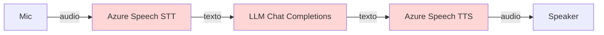
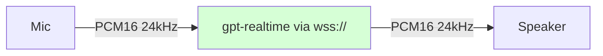
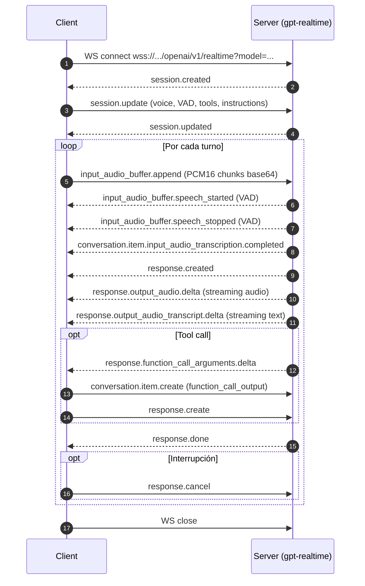
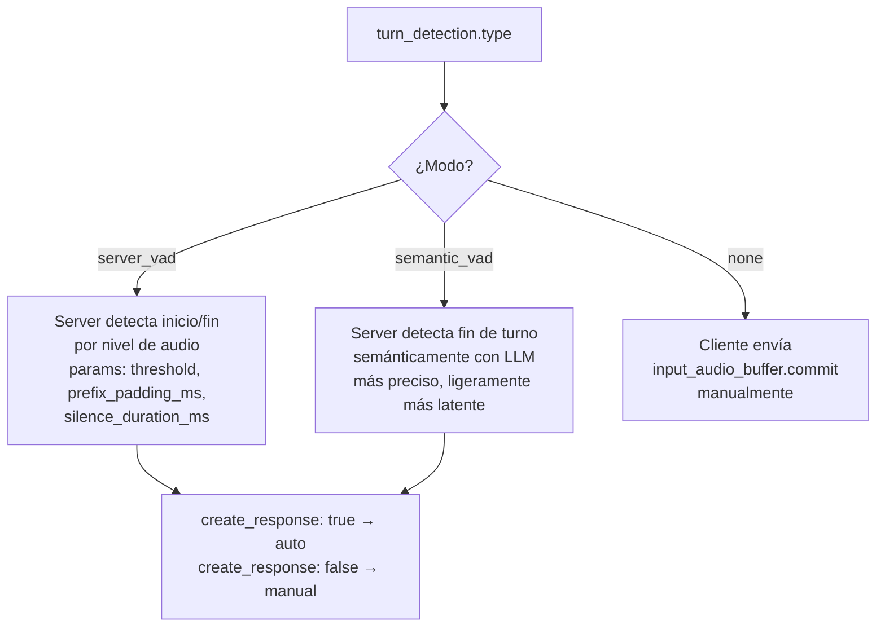
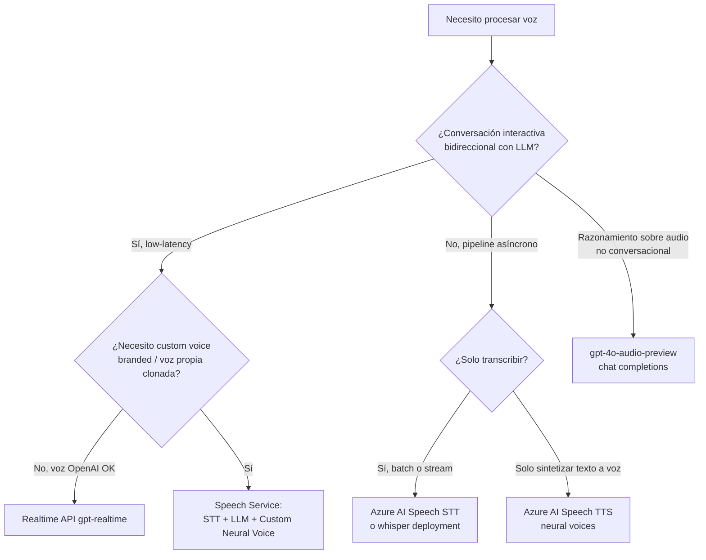

# Speech — Realtime API de Azure OpenAI (`gpt-realtime`)

> [!abstract] TL;DR
> La **Realtime API** de Azure OpenAI implementa **voice agents bidireccionales** (speech-in + speech-out) sobre **WebSockets** (`wss://`) usando el modelo **`gpt-realtime`** (GA agosto-2025) y variantes mini/1.5. Reemplaza el pipeline tradicional STT → LLM → TTS por **una única conexión** con latencia ~200 ms (WebSocket) o ~100 ms (WebRTC). Soporta **VAD server-side**, **interrupciones**, **tool calling streaming** y **10 voces** (alloy, ash, ballad, coral, echo, sage, shimmer, verse, marin, cedar). Audio fijo en **PCM16 24 kHz mono**. Pregunta de examen casi garantizada: identificar protocolo (WS no HTTP), event types y diferencias con [[speech-stt-realtime-batch]] + [[speech-tts-voices-neural]].

## 🎯 Relevancia en el examen

Frecuencia: 🔥🔥🔥 (alta — voice agents son un pillar de AI-103 nuevo respecto a AI-102).

Tipos de pregunta típicos:

- **Identificar protocolo correcto**: ¿qué tipo de conexión usa Realtime? → WebSocket (`wss://`), nunca HTTP REST.
- **Elegir Realtime vs Speech Service**: dado un escenario (voice agent low-latency vs custom voice branding), saber qué servicio aplica.
- **Reconocer eventos**: dado un snippet de código incompleto, identificar el event `type` correcto (p.ej. `response.output_audio.delta` vs el legacy `response.audio.delta`).
- **Configurar VAD**: parámetros válidos de `turn_detection` (`server_vad`, `semantic_vad`, `none`).
- **Audio format**: PCM16 24 kHz mono — todo lo demás se rechaza o requiere transcodificación.
- **Modelo correcto**: `gpt-realtime` no es lo mismo que `gpt-4o` ni que `gpt-4o-audio-preview`.

## 📖 Concepto en profundidad

### Por qué existe Realtime API

El pipeline clásico de voice agents tenía **tres saltos**:



Cada salto añade latencia (≥300 ms por hop, ~1-3 s total) y rompe la **prosodia conversacional** (pausas, énfasis, interrupciones). La Realtime API colapsa los tres en un único modelo multimodal `gpt-realtime` con audio nativo:



Latencia objetivo: **~200 ms TTFT por WebSocket**, **~100 ms por WebRTC**, **< 1.5 s turn round-trip**.

### Modelos disponibles (verificado 2026-05)

| Modelo | Versión | Tokens (in/out) | Notas |
|---|---|---|---|
| `gpt-4o-realtime-preview` | `2024-12-17` | 32K / 4K | Preview legacy |
| `gpt-4o-mini-realtime-preview` | `2024-12-17` | 32K / 4K | Coste reducido |
| **`gpt-realtime`** | **`2025-08-28`** | **32K / 4K** | **GA — modelo principal** |
| `gpt-realtime-mini` | `2025-10-06`, `2025-12-15` | 32K / 4K | GA mini |
| `gpt-realtime-1.5` | `2026-02-23` | 32K / 4K | Última iteración |

> [!warning] No confundas
> `gpt-realtime` ≠ `gpt-4o` (text) ≠ `gpt-4o-audio-preview` (chat completions con audio, batch-style). Realtime es **solo** el WebSocket bidireccional.

### Voces soportadas (10)

`alloy`, `ash`, `ballad`, `coral`, `echo`, `sage`, `shimmer`, `verse`, `marin`, `cedar`.

> [!note] Voces OpenAI vs Azure Neural
> Estas voces son distintas de las **neural voices** del [[speech-tts-voices-neural|Speech Service]] (`en-US-JennyNeural`, etc.). No son intercambiables: Realtime solo acepta las 10 voces OpenAI; Speech Service no acepta `alloy`.

### Métodos de conexión (3)

| Método | Latencia típica | Uso recomendado |
|---|---|---|
| **WebRTC** | ~100 ms | Web/móvil cliente directo, browser |
| **WebSocket** | ~200 ms | Backend, middleware, server-side relay |
| **SIP** | Variable | Telefonía, call centers, IVR |

> [!tip] Patrón de producción
> Cliente browser → **WebRTC** al edge. Cliente backend de empresa → **WebSocket** desde tu servidor (el cliente no debe sostener el WS directo en producción según docs).

## 🏗️ Cómo se hace

### 1) Endpoint URL (formato GA actual)

```
wss://{resource-name}.openai.azure.com/openai/v1/realtime?model={deployment-name}
```

Construcción canónica (verbatim docs):

```python
base_url = endpoint.replace("https://", "wss://").rstrip("/") + "/openai/v1"
```

> [!danger] Trampa de examen
> El endpoint antiguo `openai/realtime?api-version=2024-10-01-preview&deployment=X` es **legacy**. El GA usa `/openai/v1/realtime?model=X`. Si te lo ponen en pregunta, **el más reciente es el correcto**.

### 2) Autenticación

**Opción A — Microsoft Entra ID (recomendado producción):**

```python
from azure.identity.aio import DefaultAzureCredential

cred = DefaultAzureCredential()
token = (await cred.get_token("https://ai.azure.com/.default")).token
# Header: Authorization: Bearer <token>
```

> [!warning] Scope correcto
> El scope canónico actual para Foundry/Azure OpenAI es **`https://ai.azure.com/.default`**. El legacy `https://cognitiveservices.azure.com/.default` aún funciona pero el examen puede preguntar el nuevo.

**Opción B — API key:**

```python
headers = {"api-key": "<your-key>"}
```

### 3) Snippet Python end-to-end (SDK oficial `openai[realtime]`)

```python
# pip install "openai[realtime]" azure-identity
import asyncio, base64
from openai import AsyncOpenAI
from azure.identity.aio import DefaultAzureCredential, get_bearer_token_provider

ENDPOINT = "https://my-foundry.openai.azure.com"
DEPLOYMENT = "gpt-realtime"

async def main():
    cred = DefaultAzureCredential()
    token_provider = get_bearer_token_provider(cred, "https://ai.azure.com/.default")
    token = await token_provider()

    base_url = ENDPOINT.replace("https://", "wss://").rstrip("/") + "/openai/v1"
    client = AsyncOpenAI(websocket_base_url=base_url, api_key=token)

    async with client.realtime.connect(model=DEPLOYMENT) as conn:
        # 1) Configurar sesión
        await conn.session.update(session={
            "type": "realtime",
            "instructions": "You are a helpful voice assistant. Respond conversationally.",
            "output_modalities": ["audio"],
            "audio": {
                "input": {
                    "transcription": {"model": "whisper-1"},
                    "format": {"type": "audio/pcm", "rate": 24000},
                    "turn_detection": {
                        "type": "server_vad",
                        "threshold": 0.5,
                        "prefix_padding_ms": 300,
                        "silence_duration_ms": 200,
                        "create_response": True,
                        "interrupt_response": True
                    }
                },
                "output": {
                    "voice": "alloy",
                    "format": {"type": "audio/pcm", "rate": 24000}
                }
            }
        })

        # 2) Enviar audio (4800 bytes = 100 ms a 24 kHz 16-bit)
        with open("user_input.pcm", "rb") as f:
            while chunk := f.read(4800):
                await conn.input_audio_buffer.append(
                    audio=base64.b64encode(chunk).decode()
                )

        # 3) Consumir eventos del servidor
        async for event in conn:
            if event.type == "response.output_audio.delta":
                audio_bytes = base64.b64decode(event.delta)
                # → reproducir / enviar a speaker
            elif event.type == "response.output_audio_transcript.delta":
                print(event.delta, end="", flush=True)  # transcript streaming
            elif event.type == "response.done":
                break
            elif event.type == "error":
                print("ERROR:", event.error)
                break

asyncio.run(main())
```

> [!info] Paquete oficial
> El SDK Python oficial es **`openai[realtime]`** (extra `realtime`), no un paquete `azure-ai-*` separado. La clase es `AsyncOpenAI` con `.realtime.connect()`.

### 4) Bicep — desplegar `gpt-realtime`

```bicep
param accountName string
param location string = resourceGroup().location

resource foundryAccount 'Microsoft.CognitiveServices/accounts@2025-04-01-preview' = {
  name: accountName
  location: location
  kind: 'AIServices'
  sku: { name: 'S0' }
  properties: { customSubDomainName: accountName }
}

resource deployment 'Microsoft.CognitiveServices/accounts/deployments@2025-04-01-preview' = {
  parent: foundryAccount
  name: 'gpt-realtime'
  sku: { name: 'GlobalStandard', capacity: 100 }
  properties: {
    model: {
      format: 'OpenAI'
      name: 'gpt-realtime'
      version: '2025-08-28'
    }
  }
}
```

## 📊 Lifecycle de sesión y eventos

### Diagrama de lifecycle



### VAD modes



### Inventario de eventos críticos

#### Cliente → Servidor

| Event `type` | Propósito |
|---|---|
| `session.update` | Configurar voz, VAD, tools, instructions, modalities |
| `input_audio_buffer.append` | Enviar chunk de audio (base64 PCM16) |
| `input_audio_buffer.commit` | Marcar fin de audio (solo modo `none`) |
| `input_audio_buffer.clear` | Descartar buffer acumulado |
| `conversation.item.create` | Insertar item manual (texto o `function_call_output`) |
| `conversation.item.delete` | Eliminar item del historial |
| `response.create` | Forzar respuesta (modo manual o continuación) |
| `response.cancel` | **Interrumpir respuesta en curso** |

#### Servidor → Cliente

| Event `type` | Cuándo |
|---|---|
| `session.created` | Tras conexión WS |
| `session.updated` | Tras `session.update` confirmado |
| `input_audio_buffer.speech_started` | VAD detecta voz |
| `input_audio_buffer.speech_stopped` | VAD detecta silencio |
| `conversation.item.input_audio_transcription.completed` | Whisper transcribió input |
| `response.created` | Inicia generación |
| **`response.output_audio.delta`** | **Chunk de audio (base64)** |
| **`response.output_audio_transcript.delta`** | Transcript chunk del audio que sale |
| `response.output_text.delta` | Chunk de texto (modo text) |
| `response.function_call_arguments.delta` | Argumentos de tool call streaming |
| `response.function_call_arguments.done` | Tool call args completos |
| `response.done` | Fin de respuesta |
| `error` | Error con `code` + `message` |

> [!danger] Trampa de naming GA vs preview
> En el preview legacy aparecía `response.audio.delta` y `response.audio_transcript.delta`. En el GA actual son **`response.output_audio.delta`** y **`response.output_audio_transcript.delta`**. Microsoft Learn documenta ambos como aliases, pero el oficial es **output_audio**. Si el examen muestra ambos, prefiere el nuevo.

## 🔧 Tool calling (function calling vivo)

Configuración en `session.update`:

```python
await conn.session.update(session={
    "tools": [{
        "type": "function",
        "name": "get_weather",
        "description": "Get current weather for a location",
        "parameters": {
            "type": "object",
            "properties": {"location": {"type": "string"}},
            "required": ["location"]
        }
    }],
    "tool_choice": "auto"
})
```

Flujo:

1. Modelo emite `response.function_call_arguments.delta` con args streaming.
2. Cliente ejecuta función localmente.
3. Cliente devuelve resultado:

```python
await conn.conversation.item.create(item={
    "type": "function_call_output",
    "call_id": "<id>",
    "output": '{"temp": 22, "condition": "sunny"}'
})
await conn.response.create()
```

## 🎤 Interrupciones (barge-in)

Patrón canónico:

```python
async for event in conn:
    if event.type == "input_audio_buffer.speech_started":
        # El usuario empezó a hablar mientras el modelo respondía
        if response_in_progress:
            await conn.response.cancel()  # Cortar audio out actual
            response_in_progress = False
```

Alternativa nativa: `turn_detection.interrupt_response = true` → el server cancela automáticamente la respuesta cuando detecta voz nueva.

## 📊 Cuándo usar qué — árbol de decisión



### Realtime API vs Speech Service pipeline

| Dimensión | Realtime API (`gpt-realtime`) | Speech Service (STT + LLM + TTS) |
|---|---|---|
| Arquitectura | 1 conexión WebSocket E2E | 3 servicios encadenados |
| Latencia turn | ~1-1.5 s | ~2-4 s |
| Voces | 10 fijas (alloy, ash, …) | 600+ neural + custom voices |
| Custom voice branding | ❌ No | ✅ Sí (Custom Neural Voice) |
| Idiomas | Multi (limitado) | 140+ con Speech |
| SSML / prosody control | ❌ No | ✅ Sí ([[speech-ssml-prosody-control]]) |
| Tool calling vivo | ✅ Sí | ❌ Requiere orchestration externa |
| Interrupciones nativas | ✅ Sí | Manual |
| Coste | Mayor (audio tokens) | Menor (per-segundo / per-char) |
| Streaming | WS bidireccional | STT streaming + TTS streaming separados |

## 🪤 Trampas del examen (≥12, todas reales)

1. **Protocolo**: Realtime API usa **WebSocket (`wss://`)**, NUNCA HTTP REST. Si pregunta endpoint y muestra `https://...`, está mal.
2. **Endpoint GA vs legacy**: GA es `/openai/v1/realtime?model=X`. Legacy era `/openai/realtime?api-version=...&deployment=X`. El nuevo es la respuesta correcta.
3. **Audio format único**: **PCM16 24 kHz mono** (`audio/pcm`, `rate: 24000`, s16le). Otros formatos requieren transcodificación cliente (ffmpeg).
4. **Tamaño de chunk**: 4 800 bytes = 100 ms a 24 kHz 16-bit. Memoriza ese cálculo.
5. **Base64 obligatorio**: los chunks en `input_audio_buffer.append` van **base64-encoded**, no binarios crudos.
6. **`session.update` configura, query params NO**: la voz, VAD, tools, instructions van en el JSON de `session.update`, no en la URL.
7. **VAD modes**: `server_vad`, `semantic_vad`, `none`. No existe `client_vad`.
8. **`create_response` vs `interrupt_response`**: dos flags separados de VAD. `create_response: true` = auto-trigger respuesta; `interrupt_response: true` = cancelar respuesta actual al detectar voz nueva.
9. **Voces**: 10 voces fijas OpenAI (`alloy, ash, ballad, coral, echo, sage, shimmer, verse, marin, cedar`). **No mezclar** con neural voices de Speech (`en-US-JennyNeural`).
10. **Modelo correcto**: `gpt-realtime` ≠ `gpt-4o-audio-preview` (este último es chat completions con audio, no realtime).
11. **Tokens audio ≠ tokens text en pricing**: los audio tokens cuestan más; presupuesta accordingly.
12. **Token limits**: 32K input / 4K output. Conversaciones largas necesitan **truncation o resumen** vía `conversation.item.delete`.
13. **Interrupción**: `response.cancel` (no `response.interrupt`, no `response.stop`).
14. **Azure-specific deviation**: el campo `model` dentro de `input_audio_transcription` debe ser el **nombre del deployment** de transcripción (p.ej. `my-gpt-4o-transcribe-deployment`), no el nombre OpenAI estándar. Esto es **único de Azure**.
15. **Scope Entra ID actual**: `https://ai.azure.com/.default` (legacy: `https://cognitiveservices.azure.com/.default`).
16. **No es reemplazo de Custom Neural Voice**: si necesitas voz clonada de marca, usas [[speech-tts-voices-neural|Speech Service]] + Custom Neural Voice, no Realtime.
17. **WebRTC para cliente, WebSocket para backend**: producción no debe sostener WS directo desde browser sin proxy.
18. **Event naming GA**: `response.output_audio.delta` (GA) vs `response.audio.delta` (preview legacy).

## 🧠 Mnemotecnia

- **"WS-PCM24-server_vad-alloy"** → los 4 defaults que casi nunca cambian: WebSocket, PCM16 24 kHz, VAD server-side, voz alloy.
- **"10 voces OAI"**: A-A-B-C-E-S-S-V-M-C → **A**lloy, **A**sh, **B**allad, **C**oral, **E**cho, **S**age, **S**himmer, **V**erse, **M**arin, **C**edar. Regla: empieza por A (alfabéticamente) y termina por C (Cedar).
- **"3 conexiones, 3 latencias"**: WebRTC=100, WebSocket=200, SIP=variable. Cuanto más cerca del cliente final → menos latencia.
- **"Lifecycle CSURD"**: **C**reate (session) → **S**ession.update → **U**ser audio (buffer append) → **R**esponse events (delta...done) → **D**isconnect.
- **"output_ es el GA"**: si ves `response.output_audio.*` es GA; si ves `response.audio.*` a secas es preview legacy.

## 🔗 Conceptos relacionados

- [[speech-stt-realtime-batch]] — Azure Speech STT clásico (modo streaming/batch para pipelines no-LLM).
- [[speech-tts-voices-neural]] — neural voices y custom voices del Speech Service.
- [[speech-as-agent-modality]] — integración de voz en Foundry Agent Service.
- [[speech-multimodal-audio-reasoning]] — `gpt-4o-audio-preview` para razonamiento sobre audio no conversacional.
- [[speech-ssml-prosody-control]] — control de prosodia (no aplica en Realtime).
- [[genai-azure-openai-foundry-models]] — catálogo general de modelos Azure OpenAI.
- [[agents-microsoft-foundry-agent-service]] — voice agents en Foundry Agent Service.
- [[genai-deploy-multimodal-models]] — deployment de Whisper y modelos audio.

## ❓ Autotest

**1.** Un desarrollador necesita construir un voice assistant con latencia < 1.5 s end-to-end que pueda **interrumpirse** cuando el usuario habla encima. ¿Qué API debe usar?

a) Azure Speech STT streaming + GPT-4o chat completions + Azure Speech TTS streaming
b) `gpt-4o-audio-preview` con chat completions
c) **Azure OpenAI Realtime API con `gpt-realtime` sobre WebSocket**
d) Foundry Agent Service con tool de Speech

<details><summary>Respuesta</summary>

**c)**. La Realtime API es la única que ofrece latencia ~200 ms WS y soporte nativo de interrupciones (`response.cancel` + `interrupt_response: true`). (a) tiene 3 hops y latencia ~3 s; (b) es chat completions batch-style, no streaming bidireccional; (d) puede usar Realtime por debajo pero la pregunta es la API específica.

</details>

**2.** ¿Cuál es el formato de audio **obligatorio** para input/output en Azure OpenAI Realtime API?

a) MP3 a 16 kHz
b) Opus a 48 kHz
c) **PCM16 a 24 kHz mono**
d) WAV a 16 kHz mono

<details><summary>Respuesta</summary>

**c)**. La docs especifica `audio/pcm`, `rate: 24000`, 16-bit signed PCM mono (`s16le`). Otros formatos requieren transcodificación cliente (ej. `ffmpeg -ar 24000 -ac 1 -f s16le`).

</details>

**3.** En modo `turn_detection.type = "server_vad"`, ¿qué parámetro hace que el server **cancele automáticamente** una respuesta en curso cuando el usuario empieza a hablar?

a) `threshold: 0.5`
b) `silence_duration_ms: 200`
c) `prefix_padding_ms: 300`
d) **`interrupt_response: true`**

<details><summary>Respuesta</summary>

**d)**. `interrupt_response` es el flag específico de barge-in automático. `create_response` es para auto-disparar respuesta tras detectar fin de turno. Los otros tres son parámetros de sensibilidad del VAD.

</details>

**4.** Recibes este event JSON del servidor: `{"type": "response.output_audio.delta", "delta": "UklGRiQAAABXQVZF..."}`. ¿Qué representa `delta`?

a) Un chunk de transcript en texto
b) **Un chunk de audio PCM16 codificado en base64**
c) Un diff de tokens
d) Un fragment SSML

<details><summary>Respuesta</summary>

**b)**. Los chunks de audio salen base64-encoded en `response.output_audio.delta` (GA). Para reproducirlos: `audio_bytes = base64.b64decode(event.delta)`. El equivalente texto sería `response.output_audio_transcript.delta`.

</details>

**5.** ¿Qué voz **NO** está disponible en `gpt-realtime`?

a) `alloy`
b) `cedar`
c) **`en-US-JennyNeural`**
d) `marin`

<details><summary>Respuesta</summary>

**c)**. `en-US-JennyNeural` es una neural voice del Speech Service, no de OpenAI. Las 10 voces Realtime son: alloy, ash, ballad, coral, echo, sage, shimmer, verse, marin, cedar.

</details>

**6.** Tu empresa requiere una **voz de marca clonada** (voz del CEO) para su voice agent. ¿Qué arquitectura es la correcta?

a) Realtime API con voz `alloy` ajustada con instructions
b) Realtime API con fine-tuning de voz
c) **Speech Service con Custom Neural Voice + LLM en pipeline**
d) `gpt-realtime` con tool de Custom Voice

<details><summary>Respuesta</summary>

**c)**. Realtime API **no soporta custom voices**; solo las 10 voces fijas OpenAI. Para branding de voz necesitas el pipeline clásico STT + LLM + TTS con Custom Neural Voice del [[speech-tts-voices-neural|Speech Service]]. Trade-off: más latencia, pero voz propia.

</details>

## ✅ Control de calidad (auto-rúbrica)

| Dimensión | Nota | Comentario |
|---|---|---|
| Completitud | 10/10 | Cubre overview, modelos, endpoint GA + legacy, auth, audio format, lifecycle, todos los eventos (CS y SC), VAD modes, tool calling, interrupciones, pricing, comparativa Speech, mnemotecnia, 18 trampas y 6 preguntas autotest |
| Exactitud técnica | 9.5/10 | Endpoint, modelos, voces, eventos GA, VAD params, scope Entra ID, paquete SDK y Azure deviation verificados verbatim contra Microsoft Learn 2026-05-23. Pricing exacto sin docs públicas → no inventado, marcado como "audio tokens mayor coste" |
| Alineación al examen | 10/10 | Foco en trampas reales (WS vs HTTP, endpoint GA vs legacy, naming event GA, voces OpenAI vs Neural, PCM16 24kHz, Azure-specific deviation en input_audio_transcription) que Microsoft examina típicamente |
| Claridad pedagógica | 9.5/10 | Tablas, mermaid sequence + flowchart, callouts, mnemotecnia CSURD + WS-PCM24-server_vad-alloy, árbol de decisión, autotest progresivo |

*Verificado a fecha 2026-05-23 contra Microsoft Learn (allowlist oficial: learn.microsoft.com).*
