# SSML — Control quirúrgico de Text-to-Speech en Azure Speech

> [!abstract] TL;DR
> **SSML (Speech Synthesis Markup Language)** es un XML basado en la spec W3C 1.0 que Azure Speech extiende con el namespace **`mstts`** (`http://www.w3.org/2001/mstts`). Permite controlar voz, prosody, estilos emocionales, roles, pronunciación fonética, pausas, audio insertado y eventos de bookmark. La raíz `<speak>` exige **tres atributos obligatorios** (`version="1.0"`, `xmlns`, `xml:lang`). El examen mide sobre todo `<prosody>`, `<mstts:express-as style + styledegree + role>`, `<phoneme alphabet ph>`, `<say-as interpret-as format>` y reglas de fallback (estilo inválido → todo el bloque se ignora).

## 🎯 Relevancia en el examen

Frecuencia **🔥🔥🔥** dentro del 15-20 % de D.2. Tipos de pregunta típicos:

- Completar SSML válido (drag-and-drop de etiquetas).
- "What attribute value pronounces *10/19/2010* as October 19, 2010?" → `<say-as interpret-as="date" format="mdy">`.
- "How to make voice sound cheerful with double intensity?" → `<mstts:express-as style="cheerful" styledegree="2">`.
- "Which alphabet supports international phonemes?" → `ipa`.
- "Why is the entire `<mstts:express-as>` block ignored?" → estilo inválido / no soportado por la voz.
- Identificar declaración correcta del namespace `mstts` (URI exacta).
- Billing: ¿qué tags incrementan caracteres facturables? → contenido fonético/prosody **sí**, tags `<speak>`/`<voice>` **no**.

## 📖 Concepto en profundidad

### 1. Base W3C + extensiones Microsoft

Azure implementa **SSML 1.0** de W3C (`https://www.w3.org/TR/2004/REC-speech-synthesis-20040907/`). Las extensiones propietarias viven bajo el namespace `mstts` y exigen declararlo cuando se usan.

```xml
<speak version="1.0"
       xmlns="http://www.w3.org/2001/10/synthesis"
       xmlns:mstts="http://www.w3.org/2001/mstts"
       xml:lang="en-US">
  <voice name="en-US-AvaMultilingualNeural">
    Hello world.
  </voice>
</speak>
```

| Atributo de `<speak>` | Valor | Obligatorio |
|---|---|---|
| `version` | `"1.0"` (único válido) | ✅ |
| `xmlns` | `http://www.w3.org/2001/10/synthesis` | ✅ |
| `xml:lang` | Locale por defecto del documento (ej. `en-US`) | ✅ |
| `xmlns:mstts` | `http://www.w3.org/2001/mstts` | Solo si usas extensiones `mstts:*` |

> [!warning] El `speak` SIEMPRE debe contener **al menos un `<voice>`**. No es opcional.

### 2. Árbol de elementos SSML soportados

```mermaid
graph TD
    speak["&lt;speak&gt; (root)"]
    bgaudio["&lt;mstts:backgroundaudio&gt;<br/>1 max, primer hijo"]
    voice["&lt;voice name effect&gt;"]
    audio["&lt;audio src&gt;"]
    bookmark["&lt;bookmark mark&gt;"]
    brk["&lt;break strength time&gt;"]
    emph["&lt;emphasis level&gt;"]
    lang["&lt;lang xml:lang&gt;"]
    lex["&lt;lexicon uri&gt;"]
    expressas["&lt;mstts:express-as&gt;<br/>style styledegree role"]
    silence["&lt;mstts:silence&gt;"]
    viseme["&lt;mstts:viseme&gt;"]
    p["&lt;p&gt; &lt;s&gt;"]
    phoneme["&lt;phoneme alphabet ph&gt;"]
    prosody["&lt;prosody&gt;<br/>rate pitch volume<br/>contour range"]
    sayas["&lt;say-as interpret-as format&gt;"]
    sub["&lt;sub alias&gt;"]
    math["&lt;math&gt; MathML"]

    speak --> bgaudio
    speak --> voice
    voice --> audio
    voice --> bookmark
    voice --> brk
    voice --> emph
    voice --> lang
    voice --> lex
    voice --> expressas
    voice --> silence
    voice --> viseme
    voice --> p
    voice --> phoneme
    voice --> prosody
    voice --> sayas
    voice --> sub
    voice --> math
```



**Regla de anidamiento clave:** `<voice>` puede contener TODO excepto `<mstts:backgroundaudio>` y `<speak>`. `<phoneme>`, `<say-as>` y `<sub>` solo pueden contener texto plano.

### 3. `<voice>` y voice switching

```xml
<speak version="1.0" xmlns="http://www.w3.org/2001/10/synthesis" xml:lang="en-US">
  <voice name="en-US-AvaMultilingualNeural">Good morning!</voice>
  <voice name="en-US-AndrewMultilingualNeural">Good morning to you too!</voice>
</speak>
```

Atributos:

| Atributo | Valores | Notas |
|---|---|---|
| `name` | Nombre exacto de voz (ej. `en-US-AvaNeural`, `en-US-Ava:DragonHDLatestNeural`, `my-custom-voice`) | **Requerido** |
| `effect` | `eq_car`, `eq_telecomhp8k` | Optimiza la salida para coche o telefonía 8 kHz |

Ver [[speech-tts-voices-neural]] para catálogo completo de voces (Neural standard, HD, Multilingual, Multi-Talker).

### 4. `<prosody>` — control rate / pitch / volume / contour / range

Atributos verbatim verificados:

| Atributo | Valores constantes | Valor numérico | Rango efectivo |
|---|---|---|---|
| `rate` | `x-slow` (0.5), `slow` (0.64), `medium` (1.0, default), `fast` (1.55), `x-fast` (2.0) | multiplicador (`1`, `0.5`, `2`) o `±N%` | **0.5× — 2×** del original |
| `pitch` | `x-low` (-45 %), `low` (-20 %), `medium` (default), `high` (+20 %), `x-high` (+45 %) | `+/-NHz`, `+/-Nst` (semitonos), `+/-N%`, `NHz` absoluto | **0.5× — 1.5×** del original |
| `volume` | `silent`, `x-soft` (0.2), `soft` (0.4), `medium` (0.6), `loud` (0.8), `x-loud` (1, default) | `0.0` a `100.0` absoluto, o `±N` / `±N%` relativo | 0-100 |
| `contour` | n/a | Lista de `(posición%, ±valor)` ej. `(0%,+20Hz) (50%,-2st)` | Solo frases largas |
| `range` | mismos valores que `pitch` | mismos valores | rango de pitch |

```xml
<prosody rate="+30.00%" pitch="-2st" volume="+20%">
  Enjoy using text to speech.
</prosody>
```

> [!warning] Valores fuera de rango (ej. `pitch="1MHz"`, `volume="120"`) son **sustituidos o limitados** silenciosamente; el servicio no falla pero el resultado no es el deseado.

### 5. `<break>` — pausas explícitas

| Atributo | Valores | Duración |
|---|---|---|
| `strength` | `x-weak` | 250 ms |
|  | `weak` | 500 ms |
|  | `medium` (default) | 750 ms |
|  | `strong` | 1 000 ms |
|  | `x-strong` | 1 250 ms |
| `time` | `Ns` o `Nms` | 0 — **20 000 ms** (todo lo que supere se trunca a 20 000) |

> [!note] Si pones `time`, **`strength` se ignora**. NO existe `none` como valor de `strength` (mito común; los valores oficiales son los 5 anteriores).

### 6. `<mstts:express-as>` — emoción, intensidad y role-play

| Atributo | Valores |
|---|---|
| `style` | `advertisement_upbeat`, `affectionate`, `angry`, `assistant`, `calm`, `chat`, `cheerful`, `customerservice`, `depressed`, `disgruntled`, `documentary-narration`, `embarrassed`, `empathetic`, `envious`, `excited`, `fearful`, `friendly`, `gentle`, `hopeful`, `lyrical`, `narration-professional`, `narration-relaxed`, `newscast`, `newscast-casual`, `newscast-formal`, `poetry-reading`, `sad`, `serious`, `shouting`, `sports_commentary`, `sports_commentary_excited`, `terrified`, `unfriendly`, `whispering` |
| `styledegree` | **0.01 a 2 inclusive** (default 1) |
| `role` | `Girl`, `Boy`, `YoungAdultFemale`, `YoungAdultMale`, `OlderAdultFemale`, `OlderAdultMale`, `SeniorFemale`, `SeniorMale` |

```xml
<voice name="zh-CN-XiaomoNeural">
  <mstts:express-as style="sad" styledegree="2" role="YoungAdultFemale">
    快走吧，路上一定要注意安全。
  </mstts:express-as>
</voice>
```

> [!danger] **Si `style` es inválido o no soportado por la voz → todo el bloque `<mstts:express-as>` se ignora** y se vuelve a la voz neutra default. Verifica con la API [`list voices`](https://learn.microsoft.com/en-us/azure/ai-services/speech-service/rest-text-to-speech#get-a-list-of-voices) qué estilos soporta cada voz.

Para HD voices (DragonHD) existe **además** la sintaxis de **style markers** `[whispering] Don't tell...[ecstatic] Amazing!` dentro del texto plano.

### 7. `<phoneme>` — pronunciación fonética custom

| `alphabet` | Caso de uso |
|---|---|
| `ipa` | **International Phonetic Alphabet** (estándar W3C, recomendado) |
| `sapi` | Microsoft SAPI legacy (solo locales seleccionados) |
| `ups` | Universal Phone Set (Microsoft Speech Platform SDK 11) |
| `x-sampa` | SAMPA ASCII-safe |

```xml
<phoneme alphabet="ipa" ph="tə.ˈmeɪ.toʊ">tomato</phoneme>
<phoneme alphabet="sapi" ph="iy eh n y uw eh s">en-US</phoneme>
<phoneme alphabet="ups" ph="JH AU">Zhou</phoneme>
```

Si `ph` contiene phones no reconocidos → **HTTP 400 invalid SSML**. La marca de acento `ˈ` debe colocarse **antes** de la sílaba en IPA y **después** en SAPI.

### 8. `<lexicon>` — diccionarios PLS externos

```xml
<lexicon uri="https://contoso.blob.core.windows.net/customlexicon.xml"/>
```

Reglas verbatim verificadas:

- Archivo `.xml` o `.pls` conforme a **W3C PLS 1.0**.
- **Tamaño máximo: 100 KB** (excederlo → fallo de síntesis).
- **Cache: 15 minutos** con la URI como clave → los cambios tardan hasta 15 min en propagarse.
- HTTPS público; Azure Blob Storage recomendado (SAS válido).
- `xml:lang` por archivo → un lexicon = un locale.
- `alphabet` admite `ipa` o `x-microsoft-sapi`.
- Si `alias` y `phoneme` coexisten en un `<lexeme>`, **gana `alias`**.
- Case-sensitive: "Hello" ≠ "hello".

⚠️ **NO soportado por Long Audio API** (usa batch synthesis en su lugar).

### 9. `<say-as>` — interpretación tipada

| `interpret-as` | `format` (si aplica) | Ejemplo |
|---|---|---|
| `characters` / `spell-out` | `casesensitive` | `Test` → "T E S T" |
| `alphanumeric` | `spell` | `ABCDEF` → "A B C ... D E F" |
| `cardinal` / `number` | — | `10` → "ten" |
| `ordinal` | — | `3rd` → "third" |
| `number_digit` | — | `123` → "one two three" |
| `fraction` | — | `3/8` → "three eighths" |
| `date` | `dmy`, `mdy`, `ymd`, `ym`, `my`, `md`, `dm`, `d`, `m`, `y` | `10-12-2016` + `mdy` → "October 12, 2016" |
| `time` | `hms12`, `hms24` | `4:00am` + `hms12` → "four AM" |
| `duration` | `hms`, `hm`, `ms` | `01:18:30` → "one hour eighteen minutes thirty seconds" |
| `telephone` | — | `(888) 555-1212` |
| `currency` | — | `99.9 USD` → "ninety-nine US dollars ninety cents" |
| `unit` | — | `10 m` → "ten meters" |
| `address` | — | `150th CT NE, Redmond, WA` |
| `name` | — | nombre propio (pronuncia variantes culturales) |

> [!warning] `expletive` (palabra censurada) está documentado en variantes antiguas pero **NO aparece** en la tabla oficial actual de Azure Speech. Si te lo preguntan en examen, marca con cautela y prefiere `characters`/`spell-out` o un `<sub alias="...">`. ⚠️ AI-102 carryover.

### 10. `<sub alias>`, `<audio src>`, `<bookmark mark>`, `<mstts:silence>`, `<mstts:viseme>`

```xml
<sub alias="World Wide Web Consortium">W3C</sub>
<audio src="https://contoso.com/beep.wav">fallback text si falla</audio>
<bookmark mark='flower_1'/>
<mstts:silence type="Sentenceboundary" value="200ms"/>
<mstts:viseme type="FacialExpression"/>
```

**Reglas de `<audio>`:**

- Formatos: `.mp3`, `.wav`, `.opus`, `.ogg`, `.flac`, `.wma`.
- **HTTPS obligatorio** con certificado TLS válido.
- **Duración combinada total (texto + audio) ≤ 600 segundos** por respuesta.
- No soportado por **Long Audio API**.

**Reglas de `<bookmark>`:**

- No se habla; emite evento `BookmarkReached` en el SDK con `(offset_ticks, mark_text)`.
- Útil para sincronizar UI/animación con audio.

**Reglas de `<mstts:silence>`:**

- `type` válidos: `Leading`, `Leading-exact`, `Tailing`, `Tailing-exact`, `Sentenceboundary`, `Sentenceboundary-exact`, `Comma-exact`, `Semicolon-exact`, `Enumerationcomma-exact`.
- `-exact` sustituye el silencio natural; sin `-exact` lo añade.
- `value` ∈ 0 — 20 000 ms.
- WordBoundary event **sobrescribe** las silences de puntuación.

**Reglas de `<mstts:viseme>`:**

- `type="redlips_front"` → lip-sync (solo `en-US`).
- `type="FacialExpression"` → blend shapes (solo `en-US`, `zh-CN`).

## 🏗️ Cómo se hace — Python SDK end-to-end

### 11. Instalación

```bash
pip install azure-cognitiveservices-speech
```

### 12. Síntesis con SSML + suscripción a eventos

```python
import azure.cognitiveservices.speech as speechsdk

speech_config = speechsdk.SpeechConfig(
    subscription="<SPEECH_KEY>",
    region="<REGION>"
)
# Microsoft Entra ID (preferred): use AAD token instead of key
# speech_config = speechsdk.SpeechConfig(auth_token=token, region="...")

speech_config.set_speech_synthesis_output_format(
    speechsdk.SpeechSynthesisOutputFormat.Riff24Khz16BitMonoPcm
)

synthesizer = speechsdk.SpeechSynthesizer(
    speech_config=speech_config,
    audio_config=speechsdk.audio.AudioOutputConfig(filename="out.wav")
)

# Suscripción a BookmarkReached
def on_bookmark(evt: speechsdk.SessionEventArgs):
    print(f"Bookmark reached: {evt.text} at {evt.audio_offset / 10_000} ms")

synthesizer.bookmark_reached.connect(on_bookmark)
synthesizer.synthesis_word_boundary.connect(
    lambda e: print(f"Word: {e.text} @ {e.audio_offset/10_000} ms")
)

ssml = """
<speak version="1.0"
       xmlns="http://www.w3.org/2001/10/synthesis"
       xmlns:mstts="http://www.w3.org/2001/mstts"
       xml:lang="en-US">
  <voice name="en-US-AvaMultilingualNeural">
    <mstts:express-as style="cheerful" styledegree="1.5">
      Welcome <bookmark mark="intro"/> to Azure Speech!
    </mstts:express-as>
    <break time="500ms"/>
    <prosody rate="-10%" pitch="+2st">
      Your order number is
      <say-as interpret-as="number_digit">123456</say-as>,
      shipping on
      <say-as interpret-as="date" format="mdy">06/15/2026</say-as>.
    </prosody>
    <phoneme alphabet="ipa" ph="ˈæʒʊr"> Azure </phoneme>
    is ready.
  </voice>
</speak>
"""

result = synthesizer.speak_ssml_async(ssml).get()

if result.reason == speechsdk.ResultReason.SynthesizingAudioCompleted:
    print(f"Synthesized {len(result.audio_data)} bytes")
elif result.reason == speechsdk.ResultReason.Canceled:
    details = result.cancellation_details
    print(f"Canceled: {details.reason}, {details.error_details}")
```

### 13. Patrón "voice switching multilingüe"

```xml
<speak version="1.0" xmlns="http://www.w3.org/2001/10/synthesis"
       xmlns:mstts="http://www.w3.org/2001/mstts" xml:lang="en-US">
  <voice name="en-US-AvaMultilingualNeural">
    <lang xml:lang="es-MX">¡Hola!</lang>
    <lang xml:lang="fr-FR">Bonjour!</lang>
    <lang xml:lang="en-US">Hello!</lang>
  </voice>
  <voice name="en-US-AndrewMultilingualNeural">
    Reply from a different speaker.
  </voice>
</speak>
```

### 14. Audio insertion (telco IVR pattern)

```xml
<speak version="1.0" xmlns="http://www.w3.org/2001/10/synthesis" xml:lang="en-US">
  <voice name="en-US-AvaMultilingualNeural" effect="eq_telecomhp8k">
    <audio src="https://contoso.com/welcome.wav"/>
    Please leave a message after the beep.
    <audio src="https://contoso.com/beep.wav">
      Beep could not be played.
    </audio>
  </voice>
</speak>
```

### 15. REST API (cuando aplique)

`POST https://<region>.tts.speech.microsoft.com/cognitiveservices/v1`

Headers:

```
Ocp-Apim-Subscription-Key: <key>
Content-Type: application/ssml+xml
X-Microsoft-OutputFormat: riff-24khz-16bit-mono-pcm
User-Agent: <app-name>
```

Body: SSML completo.

## 📊 Tabla comparativa — qué etiqueta para qué problema

| Problema | Etiqueta | Notas |
|---|---|---|
| Acelerar o ralentizar lectura | `<prosody rate>` | 0.5× — 2× |
| Cambiar emoción | `<mstts:express-as style>` | Voz debe soportar el estilo |
| Pronunciar siglas correctamente | `<sub alias>` o `<lexicon>` | Lexicon para muchas entradas |
| Pronunciar fonética exótica | `<phoneme alphabet="ipa">` | Mejor para no nativos |
| Pausa exacta | `<break time>` | Hasta 20 s |
| Pausa relativa | `<break strength>` | x-weak a x-strong |
| Sincronizar con UI | `<bookmark>` + `BookmarkReached` event | Útil para karaoke/avatar |
| Reproducir sonido pregrabado | `<audio src>` | HTTPS, ≤ 600 s total |
| Música de fondo | `<mstts:backgroundaudio>` | Solo 1, primer hijo de `<speak>` |
| Mezclar idiomas | `<lang xml:lang>` | Solo voces Multilingual |
| Forzar silencio entre oraciones | `<mstts:silence type="Sentenceboundary">` | Por `<voice>` enclosure |
| Lip-sync / avatar | `<mstts:viseme>` | `redlips_front` o `FacialExpression` |
| Leer fecha/hora/moneda correctamente | `<say-as interpret-as>` | Format atributo crítico |
| Personal voice (CNV) | `<mstts:ttsembedding speakerProfileId>` | Ver [[speech-tts-voices-neural]] |

## 🪤 Trampas del examen

1. **`xml:lang` en `<speak>` es OBLIGATORIO**, no opcional. Su ausencia → SSML inválido → HTTP 400.
2. **El namespace `mstts` debe declararse** (`xmlns:mstts="http://www.w3.org/2001/mstts"`) si se usa CUALQUIER tag `mstts:*`. Si lo olvidas, el servicio ignora la etiqueta o falla.
3. **`styledegree` rango: 0.01 – 2 inclusive** (NO 0-1 ni 0-10). Default = 1. Marca trampa común en exámenes: respuestas "0-1" o "1-10" son incorrectas.
4. **`<break strength>` valores válidos**: `x-weak`, `weak`, `medium`, `strong`, `x-strong`. **NO existe `none`**. Si te dan opción "none", es señuelo.
5. **Si `style` es inválido o no soportado → todo el `<mstts:express-as>` se ignora** (no solo el atributo style; el bloque entero vuelve a neutral).
6. **`<phoneme>` con phones no reconocidos → HTTP 400** (no degradación silenciosa). Verifica el set fonético del locale.
7. **`<audio>` sumado al texto ≤ 600 segundos** total por respuesta. No es 600 s por audio; es global.
8. **`<lexicon>` cachea 15 minutos** por URI. Si cambias el archivo y mantienes URI, esperar o cambiar nombre.
9. **`<lexicon>` máximo 100 KB**. Si superas, divide en múltiples lexicons y referencia varios en el mismo SSML.
10. **Voice switching**: puedes tener **múltiples `<voice>`** dentro de un `<speak>`. Caen de la voz default a la siguiente al cerrar el tag.
11. **`BookmarkReached` event**: el atributo `mark` es de tipo string libre; los eventos llegan con `audio_offset` en ticks (100-ns unidades → divide por 10 000 para milisegundos).
12. **Billing**: las etiquetas `<speak>` y `<voice>` NO se facturan, pero **el contenido textual sí**, y los caracteres consumidos por **phoneme, prosody, lexicon, etc. cuentan como facturables** porque alteran la síntesis. Cita oficial: *"the service counts optional elements that you use to adjust how the text is converted to speech, like phonemes and pitch, as billable characters"*.
13. **`<say-as interpret-as="date">` SIN `format` es ambiguo**: el motor elegirá una interpretación (en `en-US`, suele ser `mdy`). Siempre especifica `format` para fechas no claras como `10-12-2016`.
14. **`<mstts:backgroundaudio>` solo UNO por documento, y debe ser primer hijo de `<speak>`**, antes de cualquier `<voice>`.
15. **`<lang xml:lang>` solo funciona con voces Multilingual** (terminadas en `MultilingualNeural` o las HD que lo soportan). En voces mono-locale es ignorada por diseño.
16. **`emphasis` word-level solo en `en-US-GuyNeural`, `en-US-DavisNeural` y `en-US-JaneNeural`** (las demás voces ignoran el efecto).
17. **HD voices, personal voices y embedded voices NO soportan todas las etiquetas SSML** — consultar tabla específica por tipo. Trampa: estilos clásicos (`cheerful`, `sad`, etc.) son distintos en DragonHD (que tiene su propio set: `amazed`, `ecstatic`, `whispering`, paralinguistics como `[laughter]`).

## 🧠 Mnemotecnia

- **VPP-VS** orden mental dentro de `<voice>`: **V**oice → **P**rosody → **P**honeme/say-as → **V**iseme → **S**ilence/break.
- **"0.01 a 2, default 1"** para styledegree → "el doble como mucho, una centésima como mínimo".
- **"5 pesos de break"**: x-weak (250) → weak (500) → medium (750) → strong (1000) → x-strong (1250). Suben de 250 en 250.
- **"600 segundos audio + 100 KB lexicon + 15 min cache + 20 segundos break"** — las cuatro constantes numéricas favoritas del examen.
- **"mstts requiere xmlns"** — mnemónico: *Microsoft Speech Tagged Text Service*.
- **DRACU** para say-as: **D**ate, **R**dinal (cardinal/ordinal), **A**ddress, **C**urrency, **U**nit + telephone, time.

## 🔗 Conceptos relacionados

- [[speech-tts-voices-neural]] — catálogo de voces, HD vs Neural standard, Multilingual.
- [[speech-stt-realtime-batch]] — el contrapunto STT (no usa SSML, input es audio).
- [[speech-as-agent-modality]] — usar TTS+STT como modalidad de Foundry Agent.
- [[speech-realtime-api-azure-openai]] — Azure OpenAI Realtime API (NO usa SSML; controla voz por system prompt).
- [[speech-custom-speech-models]] — Custom Neural Voice (CNV) y `mstts:ttsembedding`.

## ❓ Autotest

**1. ¿Qué declaración del root `<speak>` es válida?**

a) `<speak xml:lang="en-US">`
b) `<speak version="1.0" xml:lang="en-US">`
c) `<speak version="1.0" xmlns="http://www.w3.org/2001/10/synthesis" xml:lang="en-US">`
d) `<speak xmlns="http://www.w3.org/2001/10/synthesis">`

<details><summary>Respuesta</summary>
**c)**. Los tres atributos `version`, `xmlns`, `xml:lang` son obligatorios.
</details>

**2. Quieres que la voz suene MUY triste, doblando la intensidad por defecto. ¿Cuál es el SSML correcto?**

a) `<mstts:express-as style="sad" styledegree="10">`
b) `<mstts:express-as style="sad" styledegree="2">`
c) `<mstts:express-as emotion="very-sad">`
d) `<prosody style="sad">`

<details><summary>Respuesta</summary>
**b)**. Rango `0.01-2`, default 1. `2` duplica la intensidad. La (a) excede el rango; (c) y (d) son sintaxis inventada.
</details>

**3. SSML retorna HTTP 400. Inspecciona:**

```xml
<speak version="1.0" xmlns="http://www.w3.org/2001/10/synthesis" xml:lang="en-US">
  <voice name="en-US-AvaNeural">
    <mstts:express-as style="cheerful">Hello!</mstts:express-as>
  </voice>
</speak>
```

¿Cuál es el fallo?

a) `style="cheerful"` no existe.
b) Falta `xmlns:mstts="http://www.w3.org/2001/mstts"` en `<speak>`.
c) `en-US-AvaNeural` no soporta SSML.
d) Falta `styledegree`.

<details><summary>Respuesta</summary>
**b)**. Usar cualquier tag `mstts:*` sin declarar el namespace produce XML inválido.
</details>

**4. Necesitas leer "10-12-2016" como "October 12, 2016". ¿Qué etiqueta usas?**

a) `<say-as interpret-as="date">10-12-2016</say-as>`
b) `<say-as interpret-as="date" format="dmy">10-12-2016</say-as>`
c) `<say-as interpret-as="date" format="mdy">10-12-2016</say-as>`
d) `<say-as interpret-as="date" format="ymd">10-12-2016</say-as>`

<details><summary>Respuesta</summary>
**c)**. `mdy` = month-day-year → "October 12, 2016". La (b) leería "December 10". La (a) confía en el motor (que en `en-US` suele acertar pero es ambiguo).
</details>

**5. ¿Cuántos `<voice>` puede contener un `<speak>`?**

a) Exactamente 1.
b) Máximo 5.
c) Al menos 1, sin límite superior documentado.
d) Solo 1 a menos que se use `<mstts:dialog>`.

<details><summary>Respuesta</summary>
**c)**. La doc oficial dice *"You can include multiple `voice` elements in a single SSML document"* — al menos uno (obligatorio), sin tope formal.
</details>

## ✅ Control de calidad (auto-rúbrica)

| Dimensión | Nota |
|---|---|
| Completitud | 10 |
| Exactitud técnica | 10 |
| Alineación al examen | 9 |
| Claridad pedagógica | 9 |

*Verificado a fecha 2026-05-23 contra Microsoft Learn (speech-synthesis-markup, speech-synthesis-markup-structure, speech-synthesis-markup-voice, speech-synthesis-markup-pronunciation).*
