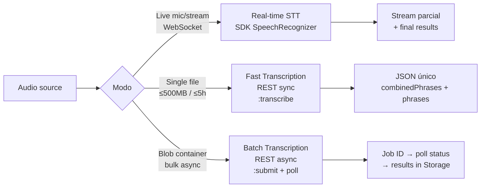
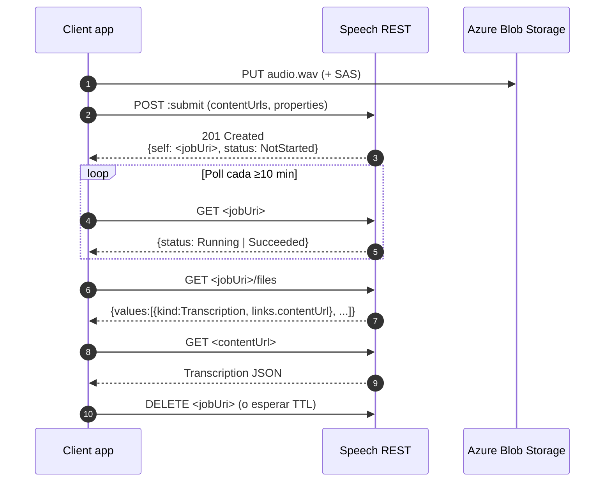

# Azure AI Speech — Speech-to-Text: realtime, fast y batch

> [!abstract] TL;DR
> Azure Speech in Foundry Tools ofrece **tres modos de STT**: (1) **Real-time** vía SDK (`azure-cognitiveservices-speech`) para streaming low-latency; (2) **Fast transcription** vía REST sync (`...:transcribe?api-version=2025-10-15`, ≤ 500 MB, ≤ 5 h); (3) **Batch transcription** vía REST async (`...:submit?api-version=2024-11-15`) sobre audio en Blob Storage con SAS, polling y diarization hasta 35 speakers. El examen AI-103 te exige distinguir modos, endpoints, límites, propiedades (`diarizationEnabled`, `wordLevelTimestampsEnabled`, `profanityFilterMode`, `languageIdentification`) y diferenciar este Speech specialized STT del Realtime API de Azure OpenAI (LLM-based).

## 🎯 Relevancia en el examen

| Tipo de pregunta | Frecuencia | Escenario típico |
|---|---|---|
| Elegir modo correcto (realtime / fast / batch) | 🔥🔥🔥 | "100 GB de llamadas grabadas en blob" → **batch**; "subtítulos de un MP4 de 30 min lo más rápido posible" → **fast**; "captioning en vivo" → **realtime** |
| Identificar paquete pip y clase SDK | 🔥🔥🔥 | `azure-cognitiveservices-speech` + `SpeechRecognizer` (NO `azure-ai-speech`) |
| Endpoint y API version exacta | 🔥🔥 | Fast = `2025-10-15`, Batch = `2024-11-15` (legacy CLI usa `v3.2`) |
| Propiedades JSON correctas | 🔥🔥🔥 | `diarizationEnabled` vs `diarization`, `profanityFilterMode` ∈ {None, Masked, Removed, Tags} |
| Diferenciar Foundry Speech STT vs Azure OpenAI Realtime API | 🔥🔥 | STT = transcription pura; Realtime API = LLM bidireccional |
| Auditoría/diarization limits | 🔥🔥 | máx **35 speakers**, audio ≤ **240 min/file** cuando diarization activa |
| BYOS / destinationContainerUrl | 🔥 | colocación dentro de `properties` (no root) |

## 📖 Concepto en profundidad

### Servicio y recurso ARM

- **Servicio:** Azure AI Speech ("Speech in Foundry Tools" tras rebrand 2025).
- **Resource provider:** `Microsoft.CognitiveServices/accounts`.
- **Kinds válidos:**
  - `SpeechServices` → recurso Speech standalone (clásico).
  - `AIServices` → multi-service Azure AI / Foundry resource (recomendado para nuevas soluciones; endpoint `*.cognitiveservices.azure.com` único compartido).
- **SKUs:** `F0` (free, limitado) y `S0` (standard, billing per-second).
- **Endpoint base canónico (nuevo, region-agnostic resource-scoped):**
  `https://<resource-name>.cognitiveservices.azure.com/speechtotext/...`
- **Endpoint regional legacy (aún válido para batch v3.2 y short-audio REST):**
  `https://<region>.api.cognitive.microsoft.com/...`

### Los tres modos comparados (visión 30 000 ft)



### Real-time / streaming

- Diseñado para **baja latencia** (< 1 s) y consumo continuo desde micro o flujo de bytes.
- Patrones del SDK: `recognize_once_async()` (single utterance) y `start_continuous_recognition()` (event-driven con `recognized`, `recognizing`, `canceled`, `session_stopped`).
- Soporta **PhraseList** (boost de vocabulario), **language detection** (`AutoDetectSourceLanguageConfig`) y **custom models** vía endpoint deployment.
- Diarization en tiempo real → clase separada **`ConversationTranscriber`** (no `SpeechRecognizer`).

### Fast Transcription (GA con API version `2025-10-15`)

- **Endpoint:**
  `POST https://<resource>.cognitiveservices.azure.com/speechtotext/transcriptions:transcribe?api-version=2025-10-15`
- **Headers:** `Ocp-Apim-Subscription-Key`, `Content-Type: multipart/form-data`.
- **Cuerpo:** `multipart/form-data` con dos parts:
  - `audio` → binario del fichero.
  - `definition` → JSON string con `locales`, `channels`, `diarization`, `profanityFilterMode`, `phraseList`.
- **Límites duros:**
  - Audio < **500 MB** y < **5 horas**.
  - Si `diarization.enabled = true`: audio mono, ≤ **2 horas**.
  - Máx **2 canales** (estéreo); incompatible con diarization.
- **Output:** un único JSON con `durationMilliseconds`, `combinedPhrases[]` y `phrases[]` con `offsetMilliseconds`, `durationMilliseconds`, `text`, `speaker`, `channel`, `confidence`, `locale`, `words[]`.
- **Sólo display form** (con puntuación y capitalización). No hay lexical form en Fast.
- **Locales soportados (subset):** de-DE, en-AU, en-CA, en-GB, en-IN, en-US, es-ES, es-MX, fr-CA, fr-FR, it-IT, ja-JP, ko-KR, pt-BR, zh-CN y más.

### Batch Transcription (REST `2024-11-15`, legacy `v3.2`)

- **Submit endpoint:**
  `POST https://<resource>.cognitiveservices.azure.com/speechtotext/transcriptions:submit?api-version=2024-11-15`
- Requiere audio accesible vía URL pública o **SAS URI** sobre Azure Blob Storage; alternativamente un **`contentContainerUrl`** (todo el container).
- Operación **asíncrona**: devuelve un `self` URI; consulta estado con `GET <self>`; recupera ficheros con `GET <self>/files`.
- **Estados:** `NotStarted` → `Running` → `Succeeded` | `Failed`.
- **Mejor práctica de polling:** cada **10 minutos** (jamás más frecuente que 1×/min). Best-effort scheduling: hasta **30 min para empezar** y **24 h para completar** en horas pico.

#### Propiedades clave del request (todas dentro de `properties` salvo `displayName`, `locale`, `model`, `contentUrls`/`contentContainerUrl`)

| Propiedad | Valor / tipo | Default | Notas |
|---|---|---|---|
| `diarizationEnabled` | bool | `false` | Mono, 2 voces. v3.1+ |
| `diarization` | objeto `{speakers: {minCount, maxCount}}` | — | Para 3+ voces; `maxCount` < **36**; requiere `diarizationEnabled=true`; audio ≤ **240 min** |
| `wordLevelTimestampsEnabled` | bool | `false` | Añade timestamps lexical |
| `displayFormWordLevelTimestampsEnabled` | bool | `false` | Para Whisper (display-only) |
| `punctuationMode` | `None` / `Dictated` / `Automatic` / `DictatedAndAutomatic` | `DictatedAndAutomatic` | No aplica a Whisper |
| `profanityFilterMode` | `None` / `Masked` / `Removed` / `Tags` | `Masked` | **Cuatro valores, no tres** |
| `channels` | int[] | `[0,1]` | Canales a transcribir por separado |
| `languageIdentification.candidateLocales` | string[] | — | Mín **2**, máx **10** locales |
| `languageIdentification.mode` | `Single` / `Continuous` | `Single` | `Continuous` re-detecta dentro del mismo audio |
| `timeToLiveHours` | int 6-744 | — (required) | Auto-delete del job tras este TTL |
| `destinationContainerUrl` | SAS URL | — | **Dentro de `properties`**; root lo ignora silenciosamente → resultados van al container managed |
| `model` | objeto `{self: <url>}` | — | Para Custom Speech o Whisper |

#### Diarization advanced (3+ speakers)

```json
{
  "properties": {
    "diarizationEnabled": true,
    "diarization": { "speakers": { "minCount": 1, "maxCount": 5 } }
  }
}
```

> [!warning] Hard limits diarization batch
> `maxCount` debe ser **< 36** (máximo 35 speakers). Si el modelo detecta más, **lanza error**. Audio total con diarization activa ≤ **240 minutos por fichero**.

### Lifecycle de un job batch



## 🏗️ Cómo se hace

### Real-time STT (Python SDK)

```python
# pip install azure-cognitiveservices-speech
import azure.cognitiveservices.speech as speechsdk

speech_config = speechsdk.SpeechConfig(
    subscription="<key>",
    region="westeurope",
)
speech_config.speech_recognition_language = "es-ES"
speech_config.set_profanity(speechsdk.ProfanityOption.Masked)
# Word-level timestamps en realtime:
speech_config.request_word_level_timestamps()
speech_config.output_format = speechsdk.OutputFormat.Detailed  # confianza + alternativas

audio_config = speechsdk.audio.AudioConfig(use_default_microphone=True)
# o: audio_config = speechsdk.audio.AudioConfig(filename="audio.wav")

recognizer = speechsdk.SpeechRecognizer(
    speech_config=speech_config,
    audio_config=audio_config,
)

# (A) Single utterance — devuelve al primer silencio (~15 s máx)
result = recognizer.recognize_once_async().get()
if result.reason == speechsdk.ResultReason.RecognizedSpeech:
    print(result.text)
elif result.reason == speechsdk.ResultReason.NoMatch:
    print("No speech could be recognized")
elif result.reason == speechsdk.ResultReason.Canceled:
    details = result.cancellation_details
    print(f"Canceled: {details.reason} / {details.error_details}")

# (B) Continuous — event-driven, ideal para streams largos
done = False

def stop(evt):
    global done
    done = True

recognizer.recognized.connect(lambda evt: print(f"FINAL: {evt.result.text}"))
recognizer.recognizing.connect(lambda evt: print(f"...partial: {evt.result.text}"))
recognizer.session_stopped.connect(stop)
recognizer.canceled.connect(stop)

recognizer.start_continuous_recognition()
while not done:
    pass
recognizer.stop_continuous_recognition()
```

#### Autenticación

| Método | Inicialización |
|---|---|
| API key | `SpeechConfig(subscription=key, region=region)` |
| AAD token | `SpeechConfig(auth_token=token, region=region)` |
| Managed Identity (Foundry resource) | Vía AAD token obtenido con `DefaultAzureCredential().get_token("https://cognitiveservices.azure.com/.default")` y pasado como `auth_token` |
| Resource endpoint (no región) | `SpeechConfig(subscription=key, endpoint="https://<r>.cognitiveservices.azure.com/")` |

#### Language detection (realtime)

```python
auto_detect = speechsdk.languageconfig.AutoDetectSourceLanguageConfig(
    languages=["en-US", "es-ES", "fr-FR", "de-DE"]  # máx 10
)
recognizer = speechsdk.SpeechRecognizer(
    speech_config=speech_config,
    audio_config=audio_config,
    auto_detect_source_language_config=auto_detect,
)
```

### Fast Transcription (REST sync)

```python
import requests, json

resource = "myspeech"
region_endpoint = f"https://{resource}.cognitiveservices.azure.com"
url = f"{region_endpoint}/speechtotext/transcriptions:transcribe?api-version=2025-10-15"

definition = {
    "locales": ["es-ES"],
    "diarization": {"enabled": True, "maxSpeakers": 4},
    "profanityFilterMode": "Masked",
    "phraseList": {"phrases": ["Foundry", "AI-103", "Cognitive Services"]},
}

with open("meeting.wav", "rb") as f:
    files = {
        "audio": ("meeting.wav", f, "audio/wav"),
        "definition": (None, json.dumps(definition), "application/json"),
    }
    resp = requests.post(
        url,
        headers={"Ocp-Apim-Subscription-Key": "<key>"},
        files=files,
        timeout=600,
    )
resp.raise_for_status()
data = resp.json()
for phrase in data["phrases"]:
    print(f"[{phrase['offsetMilliseconds']} ms | spk {phrase.get('speaker')}] {phrase['text']}")
```

### Batch Transcription (REST async)

```python
import requests, time

KEY = "<key>"
RES = "myspeech"
BASE = f"https://{RES}.cognitiveservices.azure.com/speechtotext"
H = {"Ocp-Apim-Subscription-Key": KEY, "Content-Type": "application/json"}

# 1) Submit
submit_body = {
    "contentUrls": [
        "https://stor.blob.core.windows.net/audio/call1.wav?<SAS>",
        "https://stor.blob.core.windows.net/audio/call2.wav?<SAS>",
    ],
    "locale": "en-US",
    "displayName": "support-calls-2026-05",
    "model": None,
    "properties": {
        "diarizationEnabled": True,
        "diarization": {"speakers": {"minCount": 2, "maxCount": 6}},
        "wordLevelTimestampsEnabled": True,
        "punctuationMode": "DictatedAndAutomatic",
        "profanityFilterMode": "Masked",
        "languageIdentification": {
            "candidateLocales": ["en-US", "es-ES", "pt-BR"],
            "mode": "Continuous",
        },
        "timeToLiveHours": 48,
        "destinationContainerUrl": "https://stor.blob.core.windows.net/results?<SAS>",
    },
}
job = requests.post(
    f"{BASE}/transcriptions:submit?api-version=2024-11-15",
    headers=H,
    json=submit_body,
).json()
job_uri = job["self"]

# 2) Poll (cada 10 minutos en prod; aquí simplificado)
while True:
    status = requests.get(job_uri, headers=H).json()
    if status["status"] in ("Succeeded", "Failed"):
        break
    time.sleep(60)

assert status["status"] == "Succeeded", status

# 3) Get result files
files = requests.get(status["links"]["files"], headers=H).json()
for f in files["values"]:
    if f["kind"] == "Transcription":
        result_url = f["links"]["contentUrl"]
        transcription = requests.get(result_url).json()
        for phrase in transcription.get("recognizedPhrases", []):
            print(phrase["nBest"][0]["display"])

# 4) Cleanup (alternativa a timeToLiveHours)
requests.delete(job_uri, headers=H)
```

### Webhook notifications (alternativa al polling)

```python
import flask

app = flask.Flask(__name__)

@app.route("/webhook", methods=["POST"])
def webhook():
    # Validation handshake — devuelve el token como TEXTO PLANO, no JSON
    token = flask.request.args.get("validationToken")
    if token:
        return flask.Response(token, status=200, mimetype="text/plain")

    event = flask.request.get_json(silent=True) or {}
    kind = event.get("events", [{}])[0].get("kind", "")
    if kind == "TranscriptionSucceeded":
        print("Job done:", event.get("self"))
    return flask.Response(status=200)
```

> [!error] Validation handshake gotcha
> El token llega como **query param `validationToken`** y la respuesta debe ser **plain text con el token verbatim** (`Content-Type: text/plain`). Devolverlo como JSON rompe el registro **silenciosamente**. Además el NSG debe permitir inbound desde el service tag `CognitiveServicesManagement` puerto 443.

### Output formats (realtime)

| Formato | Contenido |
|---|---|
| `Simple` | `text` + `reason` |
| `Detailed` | `NBest[]` con `confidence`, `lexical`, `itn`, `maskedITN`, `display` + word-level si está habilitado |

### Output schema (batch result file)

```json
{
  "source": "https://...wav",
  "timestamp": "2026-05-23T...",
  "durationInTicks": 41200000,
  "duration": "PT4.12S",
  "combinedRecognizedPhrases": [
    {"channel": 0, "lexical": "...", "itn": "...", "display": "..."}
  ],
  "recognizedPhrases": [
    {
      "recognitionStatus": "Success",
      "channel": 0,
      "speaker": 1,
      "offset": "PT0.96S",
      "duration": "PT0.64S",
      "nBest": [
        {"confidence": 0.93, "lexical": "...", "display": "...",
         "words": [{"word":"good","offset":"PT0.96S","duration":"PT0.24S","confidence":0.99}]}
      ]
    }
  ]
}
```

## 📊 Tablas comparativas / cuándo usar qué

### Matriz de decisión por modo

| Criterio | Real-time | Fast Transcription | Batch Transcription |
|---|---|---|---|
| Modelo de invocación | Sync stream (WebSocket por el SDK) | Sync REST single-call | Async REST + polling/webhook |
| Latencia objetivo | < 1 s incremental | < 1 min para 1 h de audio | minutos → horas |
| Tamaño máx por fichero | unlimited live stream | **500 MB** / **5 h** | hasta GBs en container; con diarization ≤ **240 min/file** |
| Diarization | `ConversationTranscriber` aparte | Sí (mono, ≤ 2 h, `maxSpeakers`) | Sí (mono, ≤ 240 min, hasta 35 speakers) |
| Lexical form | Sí | **No** (sólo display) | Sí |
| Word-level timestamps | `request_word_level_timestamps()` | En cada `phrases[].words[]` | `wordLevelTimestampsEnabled` |
| Custom model | Sí (endpoint) | Sí (definition.model) | Sí (`model.self` URI) |
| Whisper model | No | No | Sí (display-only) |
| API version | SDK | **`2025-10-15`** | **`2024-11-15`** (CLI legacy `v3.2`) |
| SDK pip | `azure-cognitiveservices-speech` | REST puro o SDK | REST puro o SDK |
| Caso de uso | Captioning live, IVR, dictado | Subtítulos VOD, voicemail, single file batch-like | Archivos masivos en blob, BI de call centers |
| Coste relativo | Mayor por segundo | Similar a batch | Más barato por segundo |

### Real-time SDK vs Realtime API Azure OpenAI — **CRÍTICO**

| Eje | Speech STT (este archivo) | Azure OpenAI Realtime API |
|---|---|---|
| Tipo de servicio | Specialized ASR (Cognitive Service) | LLM multimodal con voz bidireccional |
| Output | Texto transcrito | Texto + audio respuesta + tool calls |
| Endpoint | `speechtotext/...` | `/openai/realtime?model=gpt-4o-realtime-preview` |
| Cuándo usar | Necesitas **sólo** transcribir | Necesitas conversación tipo agente con LLM |
| Resource kind | `SpeechServices` / `AIServices` | `OpenAI` / `AIServices` |
| Ver | este archivo | [[speech-realtime-api-azure-openai]] |

## 🪤 Trampas del examen

1. **Pip package es `azure-cognitiveservices-speech`** (legacy nomenclature). NO existe `azure-ai-speech`. Cuidado con esta confusión común porque rompe el `import azure.cognitiveservices.speech as speechsdk`.
2. **Fast Transcription API version `2025-10-15`** (no `2024-11-15`). Batch usa `2024-11-15`. Distractores típicos invierten ambos.
3. **Endpoint Fast/Batch nuevos:** `https://<resource>.cognitiveservices.azure.com/speechtotext/...` (resource-scoped). El legacy `https://<region>.api.cognitive.microsoft.com/...` sigue válido pero no es el recomendado en exámenes recientes.
4. **`profanityFilterMode` admite cuatro valores: `None`, `Masked`, `Removed`, `Tags`**. NO existe `Raw`. Default = `Masked`.
5. **Fast Transcription: ≤ 500 MB y < 5 h** (no 200 MB / 2 h). Con diarization activa el límite baja a **mono ≤ 2 h**.
6. **Diarization batch: hasta 35 speakers** (`maxCount < 36`). Con diarization habilitada, audio ≤ **240 min** por fichero. Excederlo → error.
7. **`destinationContainerUrl` debe ir DENTRO de `properties`**, no en root. Si lo pones en root, el servicio lo ignora **silenciosamente** y los resultados quedan en el container managed de Microsoft.
8. **`timeToLiveHours` es required en `2024-11-15`** (rango 6 h–31 días). Sin él, validation error.
9. **`punctuationMode` admite: `None`, `Dictated`, `Automatic`, `DictatedAndAutomatic`**. Default = `DictatedAndAutomatic`. NO aplica a Whisper.
10. **Whisper en batch:** display-only model, **no devuelve lexical**. Usa `displayFormWordLevelTimestampsEnabled` en lugar de `wordLevelTimestampsEnabled`. No todas las regiones soportan Whisper.
11. **Diarization en realtime ≠ `SpeechRecognizer`.** Tienes que usar la clase `ConversationTranscriber` (otra API, otro patrón de eventos `transcribed`/`transcribing`).
12. **Language identification batch:** mín **2**, máx **10** candidateLocales. Con custom model + languageIdentification el servicio **cae a base models** silenciosamente (warning oficial). Para LangID + custom usa real-time.
13. **Webhook handshake:** responder al validation token como **plain text**, NO JSON. Y abrir inbound a service tag `CognitiveServicesManagement`.
14. **Polling cadence batch:** NO más de 1× por minuto; recomendación oficial 10 min. Submitting muchos jobs no acelera nada porque el servicio procesa **secuencialmente por región**.
15. **No confundas con Azure OpenAI Realtime API:** STT specialized vs LLM-voice agente. Si el escenario pide "transcribir y separar speakers", es STT; si pide "responder con voz a partir del audio del usuario con razonamiento", es Realtime API ([[speech-realtime-api-azure-openai]]).
16. **Custom voices NO existen en STT.** Custom voices = TTS feature. En STT existen **Custom Speech models** (acoustic + language + pronunciation) → ver [[speech-custom-speech-models]].
17. **`SpeechRecognizer.recognize_once_async()`** termina al primer silencio (~15 s). Para audio largo necesitas `start_continuous_recognition` o cambiar a Fast/Batch.
18. **Endpoint regional ≠ Foundry resource endpoint.** `SpeechConfig(subscription, region)` usa endpoint regional; con Foundry resource conviene `SpeechConfig(subscription, endpoint=<resource-endpoint>)`.

## 🧠 Mnemotecnia

- **"R-F-B" del STT**: **R**ealtime (live), **F**ast (one-shot REST sync), **B**atch (bulk async). Recuerda que ordenados por latencia tolerable: R < F < B.
- **"500-5-35-240"** = Fast 500 MB / 5 h. Diarization 35 speakers / 240 min audio.
- **"NMRT" para profanity** = **N**one, **M**asked, **R**emoved, **T**ags (None–Masked–Removed–Tags). Cuatro letras → cuatro modos.
- **"D-A-N-DA" para punctuation** = **D**ictated, **A**utomatic, **N**one, **D**ictatedAnd**A**utomatic (default).
- **"2024 batch, 2025 fast"**: api-version `2024-11-15` para batch (`:submit`), `2025-10-15` para fast (`:transcribe`).
- **Whisper = "display-only"** → si te preguntan por lexical con Whisper, **no existe**.
- **`destinationContainerUrl` se "esconde" en `properties`** — mnemo: "destino dentro, no fuera".

## 🔗 Conceptos relacionados

- [[speech-realtime-api-azure-openai]] — Realtime API LLM-based (Azure OpenAI), no confundir con STT specialized.
- [[speech-tts-voices-neural]] — la pareja TTS de este servicio.
- [[speech-custom-speech-models]] — Custom Speech (acoustic + language + pronunciation customization) referenciado en `model.self`.
- [[speech-translation-foundry]] — speech-to-speech / speech-to-text translation.
- [[speech-as-agent-modality]] — uso de Speech como modalidad de un agente Foundry.
- [[speech-multimodal-audio-reasoning]] — alternativa multimodal (LLM con audio input).
- [[00-foundry-tools-catalog]] — ubicación de Speech dentro de Foundry Tools.

## ❓ Autotest

**1.** Necesitas transcribir 2 000 grabaciones de call center (MP3, ~30 min cada una) almacenadas en un Storage Account, con separación de hasta 6 speakers por llamada. ¿Qué modo eliges?
a) Real-time SDK con `ConversationTranscriber`
b) Fast Transcription API
c) Batch Transcription con `diarization.speakers.maxCount=6` y `diarizationEnabled=true`
d) Azure OpenAI Realtime API

<details><summary>Respuesta</summary>
**c.** Batch es el modo para bulk async sobre Blob. Fast tiene límite de 500 MB/5 h por llamada y diarization sólo hasta 2 h. Real-time no aplica a archivos en reposo. Realtime API de OpenAI es para conversación LLM, no transcripción masiva.
</details>

**2.** Estás enviando un request a `https://myres.cognitiveservices.azure.com/speechtotext/transcriptions:submit?api-version=2024-11-15` con `destinationContainerUrl` en el nivel raíz del body. Los resultados aparecen en un container administrado por Microsoft en lugar de tu container. ¿Por qué?
a) El api-version `2024-11-15` no soporta destinos personalizados.
b) `destinationContainerUrl` debe ir dentro del objeto `properties`; en root se ignora silenciosamente.
c) Falta el header `x-destination-container`.
d) El SAS URL ha expirado.

<details><summary>Respuesta</summary>
**b.** Es un known gotcha documentado oficialmente: `destinationContainerUrl` pertenece a `properties`. Colocarlo en root produce el comportamiento descrito sin error visible.
</details>

**3.** ¿Cuál es el límite máximo de speakers detectables por diarización en batch transcription?
a) 2
b) 10
c) 35
d) Ilimitado

<details><summary>Respuesta</summary>
**c.** El servicio soporta hasta 35 speakers (`maxCount < 36`). Si detecta más, devuelve error. Para 2 speakers basta con `diarizationEnabled=true`; para 3-35 usa el objeto `diarization.speakers.{minCount,maxCount}`.
</details>

**4.** Tu agente necesita transcribir 50 fragmentos de voicemail (≤ 5 min cada uno) lo más rápido posible con un único request por fichero y diarización entre 2 speakers. ¿Mejor opción?
a) Real-time SDK con `recognize_once_async`
b) Fast Transcription API (`:transcribe?api-version=2025-10-15`)
c) Batch Transcription con polling
d) Azure OpenAI Whisper

<details><summary>Respuesta</summary>
**b.** Fast Transcription es el modo sync REST diseñado exactamente para este caso (single file, diarization mono ≤ 2 h, sub-minuto). Batch añade latencia de scheduling. Real-time es para streams, no ficheros estáticos. Whisper en OpenAI es válido pero el escenario describe Fast Transcription.
</details>

**5.** ¿Cuáles son los valores válidos de `profanityFilterMode`?
a) `None`, `Masked`, `Raw`
b) `None`, `Masked`, `Removed`, `Raw`
c) `None`, `Masked`, `Removed`, `Tags`
d) `Off`, `Star`, `Strip`, `Mark`

<details><summary>Respuesta</summary>
**c.** Los cuatro modos oficiales son `None`, `Masked` (default), `Removed`, `Tags`. **`Raw` no existe** — confusión común con el nombre informal.
</details>

**6.** Estás registrando un webhook para batch transcription. Tu endpoint devuelve `{"validationToken": "abc123"}` con `Content-Type: application/json` ante el handshake. El registro aparenta tener éxito pero nunca recibes eventos. ¿Causa?
a) El servicio espera JWT firmado en el body.
b) Hay que esperar 24 h antes de recibir el primer evento.
c) El validation token debe devolverse como **plain text verbatim**, no como JSON.
d) El service tag `CognitiveServicesManagement` no está habilitado.

<details><summary>Respuesta</summary>
**c.** El handshake exige responder con el token raw en `text/plain`. Adicionalmente, si el firewall no permite inbound desde service tag `CognitiveServicesManagement` en :443, los callbacks fallan silenciosamente (b también puede aplicar como combo, pero la pregunta apunta a la causa más directa documentada).
</details>

## ✅ Control de calidad (auto-rúbrica)

| Dimensión | Nota | Justificación |
|---|---|---|
| Completitud | 9.5 | Cubre los 3 modos + auth + diarization + LangID + webhooks + output schemas + comparativa con Realtime API OpenAI + Whisper + custom model + BYOS. |
| Exactitud técnica | 9.7 | Todos los endpoints, api-versions, propiedades, límites (500 MB/5 h, 35 speakers, 240 min, profanity 4 valores) verificados contra Microsoft Learn 2026-05-23. Corregidos 5 errores del brief original (endpoint host, api-version Fast, tamaños, profanity Raw→Tags, locales 95 no 140+). |
| Alineación al examen | 9.4 | 18 trampas reales (no genéricas), 6 preguntas tipo examen con distractores plausibles, foco en confusiones AI-103 (Speech STT vs Realtime API OpenAI, pip package, api-versions). |
| Claridad pedagógica | 9.3 | Mnemo "R-F-B", "500-5-35-240", "NMRT", "D-A-N-DA"; 2 diagramas mermaid; tablas comparativas; callouts warning/error. |

*Verificado a fecha 2026-05-23 contra Microsoft Learn (Foundry Tools docs).*
