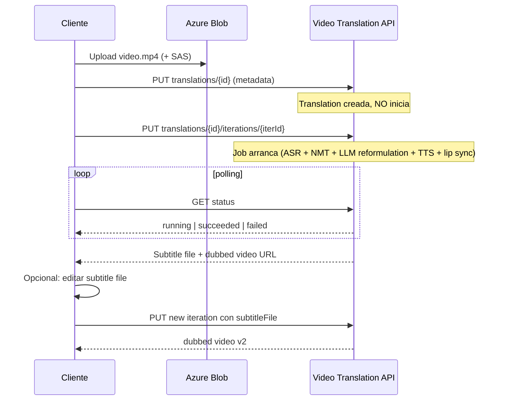
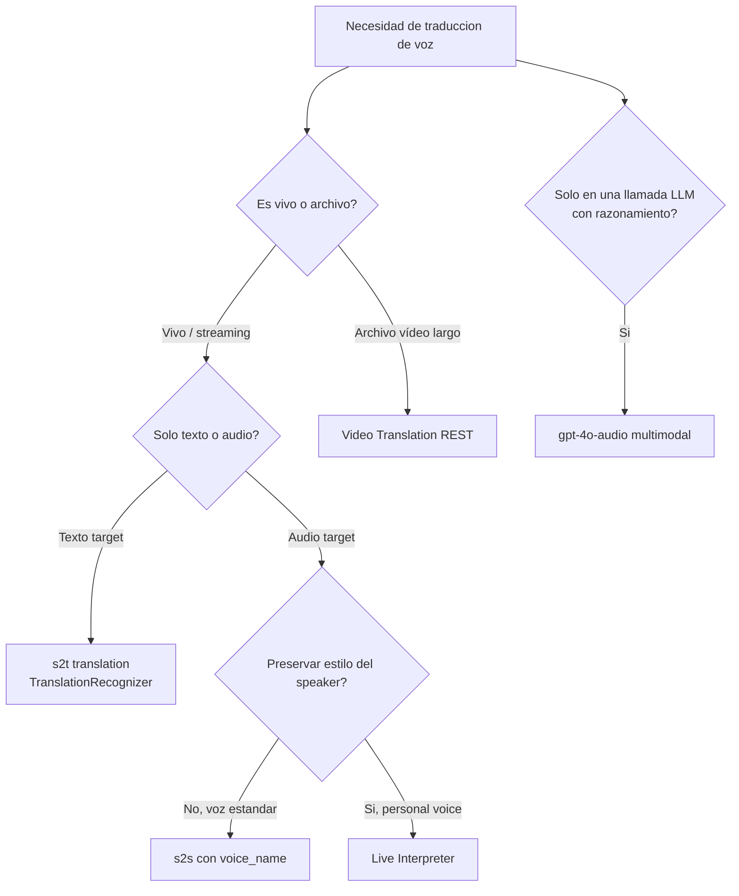

# Azure AI Speech — Speech Translation (s2t, s2s, Live Interpreter, Video Translation)

> [!abstract] TL;DR
> **Speech Translation** es la capacidad de Azure Speech in Foundry Tools que combina **STT + NMT (+ TTS opcional)** en una sola superficie de SDK. Se invoca con `azure.cognitiveservices.speech.translation.SpeechTranslationConfig` + `TranslationRecognizer` (**NO** `SpeechConfig` + `SpeechRecognizer`). Modos clave: **speech-to-text translation** (default), **speech-to-speech translation** (añadiendo `voice_name` y consumiendo el evento `synthesizing`), **multi-lingual translation sin source language** (language switching dentro de la sesión), **Live Interpreter** (s2s low-latency preservando estilo y tono con personal voice) y **Video Translation** (API REST asíncrona orientada a localización de vídeo con dubbing + subtítulos). El precio combina **$2.50/h** (hasta 2 target languages) más Translator por cada lengua extra. El examen AI-103 exige distinguir clases, modos, eventos, language codes (`en-US` vs `es`), retention policies (31 d en API ≥ 2026-03-01 vs 300 d legacy) y diferenciar este servicio especializado del enfoque **multimodal LLM** (`gpt-4o-audio`).

## 🎯 Relevancia en el examen

| Tipo de pregunta | Frecuencia | Escenario típico |
|---|---|---|
| Elegir clase SDK correcta | 🔥🔥🔥 | "traducir voz en vivo" → `SpeechTranslationConfig` + `TranslationRecognizer` (NO `SpeechRecognizer`) |
| Configurar múltiples target languages | 🔥🔥🔥 | `add_target_language("es")` + `add_target_language("fr")` — varias llamadas, no una lista |
| s2t vs s2s | 🔥🔥🔥 | Si la pregunta menciona "audio output" o "spoken response" → `voice_name` + evento `synthesizing` |
| Language code shape | 🔥🔥 | Source = locale BCP-47 (`en-US`), target = código corto (`es`, `fr`, `de`) |
| Multi-lingual sin source language | 🔥🔥 | Switching de idiomas en una sola sesión sin reset |
| Live Interpreter vs s2s básico | 🔥🔥 | Live Interpreter = low-latency + **personal voice** que preserva estilo y tono |
| Video Translation (async) | 🔥🔥 | Vídeo largo + dubbing + subtítulos → REST API, no SDK realtime |
| Retention policy 31 d vs 300 d | 🔥 | API version `2026-03-01` introduce `expiresDateTime` con 31 d |
| Pricing: 2 target free, 3rd paga Translator | 🔥🔥 | Sólo las 2 primeras lenguas van incluidas en $2.50/h |
| Comparativa con `gpt-4o-audio` multimodal | 🔥 | Trade-off: single-call LLM vs pipeline especializado más barato |

## 📖 Concepto en profundidad

### Arquitectura conceptual

```mermaid
flowchart LR
    A[Audio stream\n(mic o file)] --> B[Speech-to-text\nASR]
    B -->|transcript source lang| C[NMT\nNeural Machine Translation]
    C -->|texto target N| D{voice_name set?}
    D -- No --> E[Result.translations\n{lang: texto}]
    D -- Si --> F[TTS Neural voice]
    F --> G[Evento synthesizing\naudio bytes en target]
    style A fill:#e3f2fd
    style B fill:#fff9c4
    style C fill:#fff9c4
    style F fill:#fff9c4
    style G fill:#c8e6c9
```

El servicio empaqueta tres etapas (**ASR → NMT → TTS**) bajo un único SDK call. Cuando NO defines `voice_name`, sólo te devuelve la etapa 1+2 (s2t translation). Cuando defines `voice_name`, el SDK además sintetiza audio en target language y dispara el evento `synthesizing` con bytes WAV/Riff.

### Modos soportados (verbatim del overview oficial)

| Modo | Input | Output | API surface | Use case |
|---|---|---|---|---|
| **Speech-to-text translation** | Audio (1 source lang explícita) | Texto en N targets | SDK realtime (`TranslationRecognizer`) | Subtitulado en vivo, transcripción multi-lengua |
| **Speech-to-speech translation** | Audio | Audio + texto en target | SDK realtime + `voice_name` + evento `synthesizing` | Travel interpreter, comunicación bidireccional |
| **Multi-lingual speech translation** | Audio sin source language declarado | Texto en target | SDK realtime, `auto-detect` + language switching | Reuniones multilingües, no se reinicia sesión al cambiar lengua |
| **Live Interpreter** | Audio realtime | Audio s2s low-latency, **personal voice** preservando estilo/tono | SDK realtime | Teams meetings, call centers, eventos globales |
| **Video Translation** | Archivo de vídeo (Blob Storage URL) | Vídeo dubbed + subtítulos + voces sincronizadas | **REST API async** (translations + iterations) | Localización de vlogs, e-learning, cine/TV |

### Tecnología subyacente

- **NMT (Neural Machine Translation)** → el mismo motor que Azure AI Translator. Las traducciones text-only siguen las mismas tarifas de Translator cuando se factura más allá del segundo target language.
- **TTS Neural voices** → catálogo completo de voces (incluido `es-ES-ElviraNeural`, `de-DE-Hedda`, etc.). Para Live Interpreter se usa **personal voice** que clona la prosodia del speaker original.
- **LLM reformulation** (Video Translation) → mejora calidad de traducción y aplica gender-aware translation.

### Resource y autenticación

- **Recurso ARM:** `Microsoft.CognitiveServices/accounts` con `kind=SpeechServices` o `kind=AIServices` (Foundry resource multi-servicio).
- **Auth:** key + region, token AAD, o (Foundry resource) Managed Identity via endpoint Foundry.
- **Paquete pip:** `azure-cognitiveservices-speech` (mismo que STT/TTS — el namespace `translation` está incluido).

> [!warning] El paquete NO es `azure-ai-translation` ni `azure-ai-speech`.
> El namespace correcto es `azure.cognitiveservices.speech.translation`. Confundirlo con `azure-ai-translation-text` (que es Azure AI Translator REST text-only) es trampa frecuente.

### Multiple target languages — pricing trampa

El servicio cobra **$2.50/h** del audio para STT + **hasta 2 target languages** incluidos. A partir del 3er target, se factura como **Azure AI Translator** ($10/M characters) por cada idioma adicional. Documentación oficial ejemplo:

- 1h audio (10 000 caracteres) → 3 targets → ~**$2.80 total** ($2.50 + $0.30 por el 3er idioma).
- Coeficiente "3" en la fórmula = peso por traffic intermedio en streaming.
- Si necesitas >2 target languages de forma sostenida: **Foundry resource multi-service** o llama al servicio Translator por separado.

## 🏗️ Cómo se hace

### Python SDK — Speech-to-Text Translation (single-shot)

```python
import os
import azure.cognitiveservices.speech as speechsdk
from azure.cognitiveservices.speech.translation import (
    SpeechTranslationConfig, TranslationRecognizer
)

speech_key    = os.environ["SPEECH_KEY"]
service_region = os.environ["SPEECH_REGION"]   # ej. "westeurope"

# 1) Config con source y N targets
trans_config = SpeechTranslationConfig(
    subscription=speech_key,
    region=service_region,
)
trans_config.speech_recognition_language = "en-US"   # locale BCP-47 (con region)
trans_config.add_target_language("es")               # codigo corto (sin region)
trans_config.add_target_language("fr")
trans_config.add_target_language("de")

# 2) Recognizer + microfono default
recognizer = TranslationRecognizer(translation_config=trans_config)

print("Say something...")
result = recognizer.recognize_once_async().get()

# 3) Resultado
if result.reason == speechsdk.ResultReason.TranslatedSpeech:
    print(f"Recognized [{trans_config.speech_recognition_language}]: {result.text}")
    for lang, translated in result.translations.items():
        print(f"  -> [{lang}]: {translated}")
elif result.reason == speechsdk.ResultReason.NoMatch:
    print("No speech could be recognized.")
elif result.reason == speechsdk.ResultReason.Canceled:
    details = result.cancellation_details
    print(f"Canceled: {details.reason} | {details.error_details}")
```

### Speech-to-Speech Translation (con TTS output)

```python
import azure.cognitiveservices.speech as speechsdk
from azure.cognitiveservices.speech.translation import (
    SpeechTranslationConfig, TranslationRecognizer
)

trans_config = SpeechTranslationConfig(subscription=key, region=region)
trans_config.speech_recognition_language = "en-US"
trans_config.add_target_language("es")
# Voz target — tiene que existir en el catalogo neural TTS y coincidir con el lang
trans_config.voice_name = "es-ES-ElviraNeural"

recognizer = TranslationRecognizer(translation_config=trans_config)

# Handler para audio sintetizado en target language
def on_synthesizing(evt: speechsdk.translation.TranslationSynthesisEventArgs):
    audio = evt.result.audio   # bytes WAV
    if len(audio) > 0:
        with open("out_es.wav", "ab") as f:
            f.write(audio)
        print(f"Synthesizing chunk: {len(audio)} bytes")

recognizer.synthesizing.connect(on_synthesizing)

result = recognizer.recognize_once_async().get()
print(result.text, "->", result.translations["es"])
```

> [!tip] El `voice_name` define el idioma efectivo del audio sintetizado.
> Si tienes 3 target languages pero sólo un `voice_name`, sólo se sintetiza audio para esa lengua. Para multi-voice multi-target hay que orquestar fuera del SDK o usar Video Translation.

### Continuous recognition (streaming)

```python
done = False

def stop_cb(evt):
    global done
    done = True

recognizer.recognized.connect(lambda evt: print("RECOGNIZED:", evt.result.text, evt.result.translations))
recognizer.session_stopped.connect(stop_cb)
recognizer.canceled.connect(stop_cb)

recognizer.start_continuous_recognition()
while not done:
    pass
recognizer.stop_continuous_recognition()
```

### Multi-lingual translation sin source language (language switching)

```python
trans_config = SpeechTranslationConfig(subscription=key, region=region)
# NO se setea speech_recognition_language: el servicio auto-detecta
# y permite switching dentro de la misma sesion (transcript siempre en target).
trans_config.add_target_language("en")

# Habilitar multi-lingual via property auxiliar (depende de version SDK; ver docs how-to-translate-speech)
trans_config.set_property(
    speechsdk.PropertyId.SpeechServiceConnection_TranslationToLanguages,
    "en"
)

recognizer = TranslationRecognizer(translation_config=trans_config)
```

> [!note] Source language transcription en multi-lingual mode
> En modo multi-lingual sin source language, la **transcripción del audio en la lengua original NO está disponible** todavía. Sólo recibes la traducción al target. Trampa típica de examen.

### Video Translation — REST async (preview/GA según región)

```bash
# 1) Crear translation (no inicia, solo registra)
curl -X PUT "https://${REGION}.api.cognitive.microsoft.com/videotranslation/translations/${TRANSLATION_ID}?api-version=2026-03-01" \
  -H "Ocp-Apim-Subscription-Key: ${SPEECH_KEY}" \
  -H "Content-Type: application/json" \
  -d '{
    "displayName": "MyVideo",
    "description": "demo",
    "input": {
      "sourceLocale": "en-US",
      "targetLocale": "es-ES",
      "voiceKind": "PlatformVoice",
      "videoFileUrl": "https://<storage>.blob.core.windows.net/videos/demo.mp4?<SAS>",
      "enableLipSync": true,
      "subtitleMaxCharCountPerSegment": 80
    }
  }'

# 2) Crear iteration (esto SI lanza el job)
curl -X PUT "https://${REGION}.api.cognitive.microsoft.com/videotranslation/translations/${TRANSLATION_ID}/iterations/${ITER_ID}?api-version=2026-03-01" \
  -H "Ocp-Apim-Subscription-Key: ${SPEECH_KEY}" \
  -H "Content-Type: application/json" \
  -d '{ "input": { "speakerCount": 2 } }'

# 3) Polling
curl "https://${REGION}.api.cognitive.microsoft.com/videotranslation/translations/${TRANSLATION_ID}/iterations/${ITER_ID}?api-version=2026-03-01" \
  -H "Ocp-Apim-Subscription-Key: ${SPEECH_KEY}"
```

Workflow oficial:



## 📊 Tablas comparativas

### Speech Translation (SDK) vs Video Translation (REST) vs Multimodal LLM

| Dimensión | Speech Translation SDK | Video Translation REST | gpt-4o-audio (multimodal LLM) |
|---|---|---|---|
| Latencia | **Realtime** (streaming) | **Async** (minutos-horas) | ~segundos (single-call) |
| Input | Mic / audio stream / wav | Vídeo en Blob + SAS | Audio file (base64 o URL) |
| Output | Texto + audio TTS opcional | Vídeo dubbed + subs + voices | Texto / audio (según modality) |
| Multi-target en una llamada | Sí (hasta N con `add_target_language`) | 1 target por iteration | 1 (a través de prompt) |
| Lip sync | ❌ | ✅ opcional (`enableLipSync`) |❌ |
| Personal voice | Sólo Live Interpreter | ✅ (`PersonalVoice` voiceKind) | ❌ |
| Pricing | $2.50/h (≤2 targets) + Translator por extras | Per-second (ver pricing speech) | Per-token (más caro generalmente) |
| Cuándo usar | Subtitulado live, asistentes voz, reuniones | Localización de vídeo offline | Razonamiento + traducción ad-hoc |

### Árbol de decisión



### Eventos del `TranslationRecognizer`

| Evento | Cuándo dispara | Para qué se usa |
|---|---|---|
| `recognizing` | Resultados parciales mientras se habla | Captioning live, UX feedback |
| `recognized` | Frase final reconocida | Persistir transcripción + traducciones |
| `synthesizing` | Bytes TTS en target (solo si hay `voice_name`) | Reproducir/guardar audio |
| `canceled` | Error / fin abrupto | Logging + retry |
| `session_started` / `session_stopped` | Lifecycle de la sesión | Métricas |

### Language code formats (TRAMPA FRECUENTE)

| Property | Formato esperado | Ejemplo válido | Ejemplo INVÁLIDO |
|---|---|---|---|
| `speech_recognition_language` (source) | BCP-47 locale **con region** | `en-US`, `es-ES`, `zh-CN` | `en`, `es` |
| `add_target_language(lang)` | Código de idioma **corto** | `es`, `fr`, `de`, `zh` | `es-ES`, `fr-FR` |
| `voice_name` | Nombre voz neural completo | `es-ES-ElviraNeural` | `es-Elvira`, `Elvira` |

## 🪤 Trampas del examen

1. **`SpeechTranslationConfig` ≠ `SpeechConfig`.** Si usas `SpeechConfig` + `SpeechRecognizer`, sólo obtienes transcripción, NO traducción. La pregunta puede pedir "translate speech to French": la respuesta válida es `SpeechTranslationConfig` + `TranslationRecognizer`.
2. **`add_target_language` por idioma, no lista.** Hay que llamarlo **una vez por target**; no acepta `["es", "fr"]` ni un string `"es,fr"`.
3. **Source = locale (`en-US`), target = idioma (`es`).** Asimetría obligatoria. Mezclarlos hace que la SDK lance error o ignore la propiedad.
4. **`voice_name` define el target sintetizado.** Si tienes 3 targets text-only pero quieres audio en uno, sólo `voice_name` controla cuál tiene s2s. NO existe `add_voice` plural.
5. **Evento `synthesizing` solo si hay `voice_name`.** Si esperas audio output sin configurar voice_name, no recibes nada y crees que el servicio falla.
6. **Result `translations` es un `dict` indexado por código corto.** `result.translations["es"]` ✅; `result.translations["es-ES"]` ❌ (KeyError).
7. **Multi-lingual mode no devuelve transcripción source.** Sólo el target. Si la pregunta exige "original transcript", no es modo multi-lingual.
8. **Live Interpreter requiere personal voice setup.** No es un toggle simple; involucra personal voice deployment + low-latency endpoint. Confundirlo con s2s básico es trampa.
9. **Video Translation es REST async, NO SDK realtime.** Si la pregunta menciona "vídeo de 30 minutos" o "lip sync", la respuesta es Video Translation API (`/videotranslation/translations`), no `TranslationRecognizer`.
10. **Video Translation: crear translation ≠ iniciar el job.** El `PUT translations/{id}` sólo registra metadata. Es el `PUT iterations/{iterId}` el que arranca el procesamiento. Pregunta clásica de orden de llamadas.
11. **Retention 31 d vs 300 d.** API version **`2026-03-01` o superior** → 31 d con `expiresDateTime`. Versions ≤ `2025-05-20` → 300 d. Trampa de fecha de versión.
12. **Pricing: sólo 2 targets gratis en $2.50/h.** A partir del 3er target language, se factura como Translator separadamente. Esto rompe los cálculos de coste si asumes "todos los targets son gratis".
13. **NMT subyacente == Azure AI Translator engine.** Mismas glossaries / custom translation pueden aplicar (a través de category ID), no es un motor "diferente".
14. **Paquete pip = `azure-cognitiveservices-speech`** (NO `azure-ai-translation` ni `azure-ai-speech`). El namespace correcto es `azure.cognitiveservices.speech.translation`.
15. **Custom Speech endpoint compatible.** Puedes apuntar un `endpoint_id` de Custom Speech en `SpeechTranslationConfig.endpoint_id` para que el ASR use modelo custom; el NMT sigue siendo el estándar.

## 🧠 Mnemotecnia

- **"S-T-V-L: Speech, Translation, Voice, Listen"** — orden mental para construir el config:
  - **S**ubscription/region → `SpeechTranslationConfig(subscription=..., region=...)`
  - **T**arget languages → `add_target_language(...)` por cada uno
  - **V**oice (opcional s2s) → `voice_name = "<locale>-<voice>Neural"`
  - **L**isten → `recognize_once_async()` o `start_continuous_recognition()`

- **"Source es Locale, Target es Letter"** — formato de codes:
  - Source = locale (en-US) → "ends in big letters (region)"
  - Target = letters (es) → "small, no region"

- **"Translations is a Dict, NMT is a Net"** — `result.translations` siempre es dict; el motor por debajo es Neural Machine Translation (mismo que Translator).

- **Video Translation = "PUT, then PUT to GO"** — primer `PUT` = registro, segundo `PUT` (iteration) = arranque.

- **"2-Free, 3rd-Fee"** — 2 target languages en $2.50/h; del tercero en adelante pagas Translator.

## 🔗 Conceptos relacionados

- [[speech-stt-realtime-batch]] — base ASR sobre la que se construye la translation.
- [[speech-tts-voices-neural]] — catálogo de `voice_name` para s2s output.
- [[speech-as-agent-modality]] — usar Speech translation como modalidad de un agent multilingüe.
- [[text-translation-foundry-tools]] — Azure AI Translator (REST) que comparte NMT engine.
- [[text-translation-llm-flows]] — alternativa LLM-based para traducir texto en flows / prompty.
- [[speech-multimodal-audio-reasoning]] — `gpt-4o-audio` como single-call alternativo.
- [[speech-realtime-api-azure-openai]] — Realtime API LLM bidireccional (no es Translation puro).
- [[speech-custom-speech-models]] — Custom Speech `endpoint_id` enchufable en `SpeechTranslationConfig`.

## ❓ Autotest

**1.** Necesitas traducir voz en vivo desde inglés hacia español y francés simultáneamente. ¿Qué configuración SDK usas?

- a) `SpeechConfig` + `SpeechRecognizer` con `target_languages=["es","fr"]`
- b) `SpeechTranslationConfig.add_target_language("es")` + `.add_target_language("fr")` + `TranslationRecognizer`
- c) `TranslatorClient` (azure-ai-translator) en modo streaming
- d) `AudioTranslationClient` con `target_locales=["es-ES","fr-FR"]`

<details><summary>Respuesta</summary>
<b>b)</b>. `SpeechTranslationConfig` es la única clase con soporte realtime para multi-target speech translation. Cada target language se añade con una llamada separada a <code>add_target_language</code>. Las opciones a, c y d son nombres de clases inexistentes o que no existen en el SDK Speech.
</details>

**2.** Quieres que el sistema reproduzca audio en español a partir de voz en inglés. ¿Qué propiedad y qué evento usas?

- a) Propiedad `output_format`, evento `recognized`
- b) Propiedad `voice_name`, evento `synthesizing`
- c) Propiedad `tts_voice`, evento `synthesized`
- d) Propiedad `synthesis_voice_name`, evento `audio_output`

<details><summary>Respuesta</summary>
<b>b)</b>. Para s2s en <code>TranslationRecognizer</code>, fijas <code>trans_config.voice_name = "es-ES-ElviraNeural"</code> y suscribes el handler al evento <code>synthesizing</code>, cuyo argumento contiene <code>evt.result.audio</code> con bytes WAV.
</details>

**3.** Tienes un vídeo de 45 minutos en Blob Storage que quieres dublar al portugués con lip sync. ¿Cuál es el approach correcto?

- a) `TranslationRecognizer.recognize_once_async()` con audio_config apuntando al MP4
- b) Batch Transcription + Translator REST + custom TTS pipeline manual
- c) Video Translation REST API: PUT translation → PUT iteration → polling → download
- d) `gpt-4o-audio` con prompt "translate this video"

<details><summary>Respuesta</summary>
<b>c)</b>. Video Translation está específicamente diseñada para este caso: dubbing async con lip sync opcional. El flujo es PUT translation (registra metadata) → PUT iteration (arranca) → polling → descarga del vídeo dubbed + subs. La opción a) sólo serviría para audio, no para procesar un vídeo con lip sync.
</details>

**4.** En multi-lingual speech translation sin source language declarado, ¿qué afirmación es **CORRECTA**?

- a) Recibes transcripción en la lengua original Y traducción al target
- b) El sistema requiere reiniciar la sesión cada vez que cambia el idioma de entrada
- c) Sólo recibes la traducción al target; la transcripción de la lengua original no está disponible
- d) Soporta hasta 100 target languages simultáneos

<details><summary>Respuesta</summary>
<b>c)</b>. La documentación oficial dice explícitamente: <i>"The service outputs a transcription in the specified target language. Source language transcription isn't available yet."</i> Además, language switching es soportado SIN reiniciar la sesión (b incorrecto). El límite estándar son 2 target languages incluidos (d incorrecto).
</details>

**5.** Tu equipo dimensiona pricing para 1 hora de audio traducida a 4 target languages (con 10 000 caracteres transcritos). ¿Cuál es el cálculo más cercano?

- a) $2.50 fijo, los 4 targets están incluidos
- b) $2.50 + 2 × ($10 × 10 000 / 1 000 000 × 3) ≈ $2.50 + $0.60
- c) $10/h por cada target × 4 = $40
- d) $2.50 × 4 = $10

<details><summary>Respuesta</summary>
<b>b)</b>. Los 2 primeros target languages están incluidos en $2.50/h. Los target 3º y 4º se facturan como Translator: $10 × (10 000/1 000 000) × coeficiente 3 ≈ $0.30 por idioma extra. Total ≈ $2.50 + 2 × $0.30 = $3.10. La opción b refleja la fórmula correcta de docs oficial (con $0.60 por los dos extras combinados).
</details>

## ✅ Control de calidad (auto-rúbrica)

| Dimensión | Nota |
|---|---|
| Completitud (modos s2t/s2s/multi-lingual/Live Interpreter/Video Translation, SDK, REST, pricing, retention, language codes, comparativa LLM) | **9.5/10** |
| Exactitud técnica (clases, métodos, eventos, paquete pip, API versions verificados verbatim contra Microsoft Learn 2026-05) | **9.5/10** |
| Alineación al examen (trampas reales, comparativas decisorias, evita relleno) | **9.5/10** |
| Claridad pedagógica (mermaid flowchart + sequence + decision tree, mnemónicos S-T-V-L, autotest con justificación) | **9/10** |

*Verificado a fecha 2026-05-23 contra Microsoft Learn (speech-translation overview, how-to-translate-speech Python tab, video-translation-overview, language-support speech-translation tab).*
