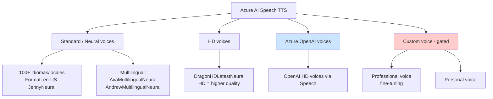
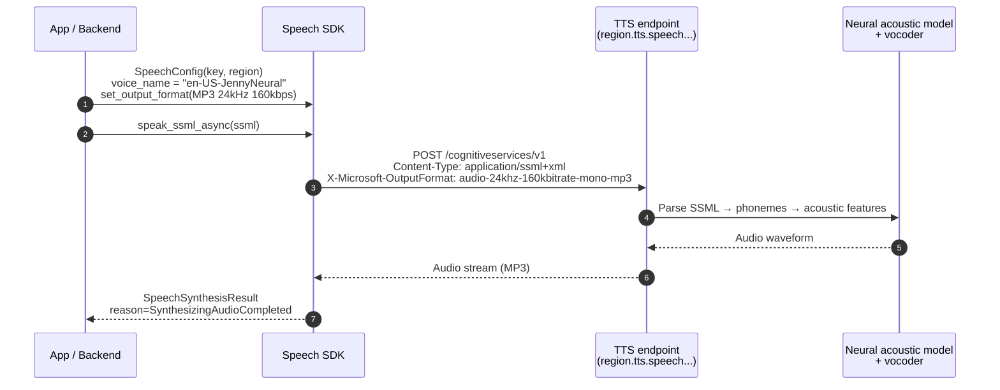
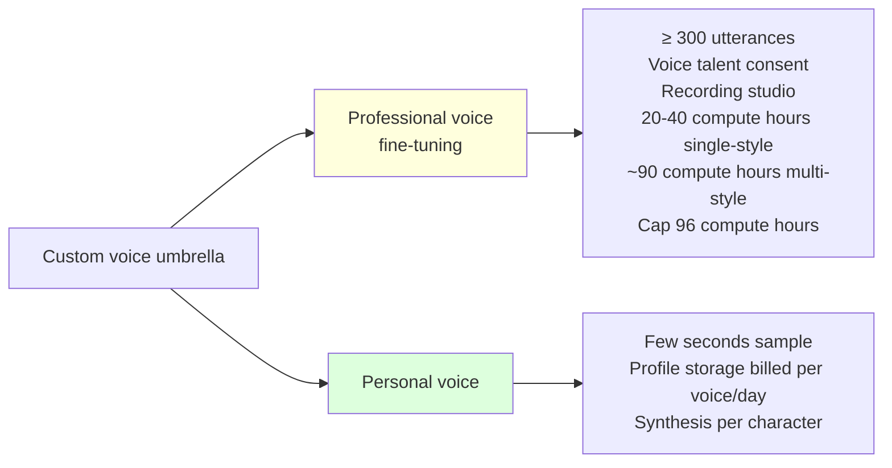

# Azure AI Speech — Text-to-Speech: neural voices, multilingual, styles y Custom Neural Voice

> [!abstract] TL;DR
> **Azure AI Speech TTS** ofrece **voces neurales pre-built** (estándar Neural, HD, OpenAI HD) en **100+ idiomas/locales** sobre el recurso `Microsoft.CognitiveServices/accounts` con `kind=SpeechServices` o sobre un recurso **Foundry**. La nomenclatura es `<locale>-<NameNeural>` (p.ej. `en-US-JennyNeural`). Existen **voces multilingües** (`en-US-AvaMultilingualNeural`, `en-US-AndrewMultilingualNeural`) capaces de hablar varios idiomas con un solo voice name. Las voces soportan **styles** (`cheerful`, `sad`, `customerservice`, …) y **roles** (`YoungAdultFemale`, `OlderAdultMale`, …) vía SSML `<mstts:express-as style="…" styledegree="…" role="…">`. **Custom Neural Voice (CNV)** está **gated bajo Limited Access** (Microsoft Foundry resource + intake form `aka.ms/customneural`), requiere **≥ 300 utterances** y consent de la voice talent. Facturación **per-character** (estándar) o **per-second** (avatar). El examen pregunta nomenclatura exacta, namespaces SSML, gating de CNV y diferencias con `gpt-realtime` voices.

---

## 🎯 Relevancia en el examen

| Tipo de pregunta                                                                                  | Frecuencia |
| ------------------------------------------------------------------------------------------------- | ---------- |
| Identificar **voice name correcto** dado un escenario (locale + género)                           | 🔥🔥🔥     |
| Diferenciar voz **estándar Neural** vs **HD** vs **OpenAI voices** vs **Custom**                  | 🔥🔥🔥     |
| Elegir entre **Azure TTS** y **gpt-realtime voices** según latencia / SSML / coste                | 🔥🔥🔥     |
| **SSML namespace** `xmlns:mstts` + sintaxis de `<mstts:express-as>` y `<prosody>`                 | 🔥🔥       |
| **CNV gating**: Limited Access, ≥ 300 utterances, voice-talent consent                            | 🔥🔥       |
| **Multilingual voices**: cuándo usar `AvaMultilingualNeural` vs cambiar voz con `<voice>`         | 🔥🔥       |
| **Output formats** y `X-Microsoft-OutputFormat` header                                            | 🔥🔥       |
| **Billable characters** (incl. punctuation, NO `<speak>`/`<voice>`)                               | 🔥         |
| **Batch synthesis API** (>10 min, async, poll)                                                    | 🔥         |

> [!warning] AI-102 carryover
> El bloque de **TTS clásico + SSML** ya estaba en AI-102. **AI-103 lo mantiene** pero añade énfasis en: (1) la coexistencia con **gpt-realtime voices** (Azure OpenAI), (2) **HD voices** y **DragonHDLatestNeural**, (3) el uso del recurso **Microsoft Foundry** además del clásico `SpeechServices`.

---

## 📖 Concepto en profundidad

### 1. Capa de servicio y recurso ARM

| Aspecto                         | Valor                                                                                                             |
| ------------------------------- | ----------------------------------------------------------------------------------------------------------------- |
| **Resource provider**           | `Microsoft.CognitiveServices`                                                                                     |
| **Resource type**               | `accounts`                                                                                                        |
| **`kind` clásico**              | `SpeechServices`                                                                                                  |
| **`kind` Foundry**              | `AIServices` (acceso multi-servicio) o **Microsoft Foundry resource** (umbrella)                                  |
| **TTS endpoint**                | `https://{region}.tts.speech.microsoft.com/cognitiveservices/v1`                                                  |
| **Voice list endpoint**         | `https://{region}.tts.speech.microsoft.com/cognitiveservices/voices/list`                                         |
| **Batch synthesis endpoint**    | `https://{region}.api.cognitive.microsoft.com/texttospeech/batchsyntheses/{id}?api-version=2024-04-01`            |
| **SKUs**                        | `F0` (free, mensual limitado), `S0` (standard pay-as-you-go)                                                      |

### 2. Familias de voces TTS en Azure



> [!note] Cita verbatim de Microsoft Learn
> *"Standard voices: High-quality neural voices available out of the box in 100+ languages and locales"*. **No uses "140 idiomas"** en el examen: la fuente oficial dice **100+**.

### 3. Convención de naming (memorízala)

```
<locale>-<Name>Neural
```

| Voice name                          | Locale  | Género  | Notas                            |
| ----------------------------------- | ------- | ------- | -------------------------------- |
| `en-US-JennyNeural`                 | en-US   | Female  | Default examen                   |
| `en-US-GuyNeural`                   | en-US   | Male    | Counterpart Jenny                |
| `en-US-AvaNeural`                   | en-US   | Female  | Used by DragonHD                 |
| `en-US-AvaMultilingualNeural`       | en-US   | Female  | **Multilingual**                 |
| `en-US-AndrewMultilingualNeural`    | en-US   | Male    | **Multilingual**                 |
| `es-ES-ElviraNeural`                | es-ES   | Female  | Spain Spanish                    |
| `es-MX-DaliaNeural`                 | es-MX   | Female  | Mexican Spanish                  |
| `ja-JP-NanamiNeural`                | ja-JP   | Female  | Japanese                         |
| `zh-CN-XiaoxiaoNeural`              | zh-CN   | Female  | Mandarin                         |
| `en-US-Ava:DragonHDLatestNeural`    | en-US   | Female  | **HD voice** (sintaxis con `:`)  |

> [!tip] Patrón del examen
> Si ves un voice name **sin sufijo `Neural`** o con locale en minúsculas (`en-us-...`), es **prácticamente siempre incorrecto**. Las HD usan **dos puntos** (`Voice:DragonHDLatestNeural`).

### 4. Multilingual voices

- Una **única voice** puede hablar **múltiples idiomas** con prosodia y acento naturales (sin cambiar `<voice>`).
- Cambias el idioma dentro del SSML con `<lang xml:lang="…">` **manteniendo la misma voz**.
- Disponibles principalmente como `*MultilingualNeural` y como **HD voices**.

```xml
<speak version="1.0" xmlns="http://www.w3.org/2001/10/synthesis"
       xmlns:mstts="http://www.w3.org/2001/mstts" xml:lang="en-US">
  <voice name="en-US-AvaMultilingualNeural">
    Hello, welcome.
    <lang xml:lang="es-MX">Hola, bienvenido.</lang>
    <lang xml:lang="de-DE">Hallo, willkommen.</lang>
  </voice>
</speak>
```

> [!important] Trampa frecuente
> **No necesitas múltiples elementos `<voice>`** para varios idiomas si usas multilingual. Usa **un único `<voice>`** + `<lang>`. Si el examen ofrece dos opciones (multi `<voice>` vs single `<voice>` + `<lang>`), la **correcta para una voz coherente es single + lang**.

### 5. Styles y roles (vía `<mstts:express-as>`)

```xml
<speak version="1.0" xmlns="http://www.w3.org/2001/10/synthesis"
       xmlns:mstts="https://www.w3.org/2001/mstts" xml:lang="zh-CN">
  <voice name="zh-CN-XiaomoNeural">
    <mstts:express-as style="sad" styledegree="2" role="YoungAdultFemale">
      Texto a leer con estilo triste e intenso.
    </mstts:express-as>
  </voice>
</speak>
```

| Atributo       | Valores oficiales                                                                                       | Default | Notas                                                                            |
| -------------- | ------------------------------------------------------------------------------------------------------- | ------- | -------------------------------------------------------------------------------- |
| `style`        | `cheerful`, `sad`, `angry`, `customerservice`, `newscast`, `assistant`, `chat`, `empathetic`, `whispering`, `ecstatic`, … (depende de la voz) | — (Required) | Si la voz **no soporta** el estilo, **se ignora el `mstts:express-as` completo** y la salida es neutra. |
| `styledegree`  | `0.01` – `2.0` (inclusive). Min unit `0.01`. Default `1`.                                               | `1`     | `2` = intensidad doble. Si no se soporta, se ignora.                             |
| `role`         | `Girl`, `Boy`, `YoungAdultFemale`, `YoungAdultMale`, `OlderAdultFemale`, `OlderAdultMale`, `SeniorFemale`, `SeniorMale` | —       | El voice **name no cambia**; se ajusta pitch/intonation para imitar el role.     |

> [!warning] Verbatim de docs
> *"If the style value is missing or invalid, the entire `mstts:express-as` element is ignored and the service uses the default neutral speech."* — Esto es **trampa de examen**: un style typo silencia toda la expresividad.

### 6. SSML namespace (memorízalo)

```xml
<speak version="1.0"
       xmlns="http://www.w3.org/2001/10/synthesis"
       xmlns:mstts="http://www.w3.org/2001/mstts"
       xml:lang="en-US">
  ...
</speak>
```

- **Namespace por defecto**: `http://www.w3.org/2001/10/synthesis` (estándar W3C SSML).
- **Namespace MS extensions**: `http://www.w3.org/2001/mstts` (Microsoft Speech Service). Microsoft usa indistintamente `http://` y `https://` en sus ejemplos; ambos son aceptados, pero **`http://www.w3.org/2001/mstts` es la forma históricamente canónica**.
- Atributo `xml:lang` en `<speak>` define **locale por defecto**.
- Elementos `<voice>`, `<prosody>`, `<break>`, `<phoneme>`, `<sub>`, `<say-as>`, `<emphasis>`, `<audio>` son **W3C estándar**; los con prefijo `mstts:` son **extensiones MS**.

---

## 🏗️ Cómo se hace

### Python SDK (paquete `azure-cognitiveservices-speech`)

```python
# pip install azure-cognitiveservices-speech
import azure.cognitiveservices.speech as speechsdk

# 1) Config
speech_config = speechsdk.SpeechConfig(
    subscription="<KEY>",            # o usa AAD token con get_token
    region="<REGION>",               # e.g. "eastus"
)

# 2) Selección de voz neural
speech_config.speech_synthesis_voice_name = "en-US-JennyNeural"

# 3) Formato de salida (MP3 24 kHz 160 kbps mono)
speech_config.set_speech_synthesis_output_format(
    speechsdk.SpeechSynthesisOutputFormat.Audio24Khz160KBitRateMonoMp3
)

# 4) Output a fichero (o speaker / stream)
audio_config = speechsdk.audio.AudioOutputConfig(filename="output.mp3")

synthesizer = speechsdk.SpeechSynthesizer(
    speech_config=speech_config,
    audio_config=audio_config,
)

# 5a) Texto plano
result = synthesizer.speak_text_async("Hello world").get()

# 5b) Alternativa: SSML completo (necesario para styles, multilingual, prosody…)
ssml = """
<speak version='1.0'
       xmlns='http://www.w3.org/2001/10/synthesis'
       xmlns:mstts='http://www.w3.org/2001/mstts'
       xml:lang='en-US'>
  <voice name='en-US-JennyNeural'>
    <mstts:express-as style='cheerful' styledegree='1.5'>
      I'm thrilled to help you today!
    </mstts:express-as>
  </voice>
</speak>
"""
result = synthesizer.speak_ssml_async(ssml).get()

# 6) Manejo de resultado
if result.reason == speechsdk.ResultReason.SynthesizingAudioCompleted:
    print(f"Synthesis OK, {len(result.audio_data)} bytes")
elif result.reason == speechsdk.ResultReason.Canceled:
    cancellation = result.cancellation_details
    print(f"Canceled: {cancellation.reason} | {cancellation.error_details}")
```

### Listado dinámico de voces (incluye styles disponibles)

```python
voices_result = synthesizer.get_voices_async().get()
for v in voices_result.voices:
    print(
        v.short_name,           # e.g. 'en-US-JennyNeural'
        v.locale,               # e.g. 'en-US'
        v.gender,               # SynthesisVoiceGender
        v.voice_type,           # Neural / NeuralHD / NeuralCustom
        v.style_list,           # ['cheerful', 'sad', ...]
        v.role_play_list,       # roles soportados por la voz
    )
```

### REST (formato exacto)

```http
POST https://eastus.tts.speech.microsoft.com/cognitiveservices/v1
Ocp-Apim-Subscription-Key: <KEY>
Content-Type: application/ssml+xml
X-Microsoft-OutputFormat: audio-24khz-160kbitrate-mono-mp3
User-Agent: my-app

<speak version='1.0'
       xmlns='http://www.w3.org/2001/10/synthesis'
       xmlns:mstts='http://www.w3.org/2001/mstts'
       xml:lang='en-US'>
  <voice name='en-US-JennyNeural'>Hello world</voice>
</speak>
```

- Auth: `Ocp-Apim-Subscription-Key` **o** `Authorization: Bearer <token>` (token de `/issueToken`).
- Output format se especifica **siempre** en `X-Microsoft-OutputFormat` (header), NO en el SSML.

### Azure CLI (creación del recurso)

```bash
az cognitiveservices account create \
  --name speech-tts-prod \
  --resource-group rg-ai \
  --kind SpeechServices \
  --sku S0 \
  --location eastus \
  --yes
```

### Bicep mínimo

```bicep
resource speech 'Microsoft.CognitiveServices/accounts@2024-10-01' = {
  name: 'speech-tts-prod'
  location: 'eastus'
  kind: 'SpeechServices'
  sku: { name: 'S0' }
  properties: {
    publicNetworkAccess: 'Enabled'
    customSubDomainName: 'speech-tts-prod'
  }
}
```

---

## 🔄 Flujo TTS end-to-end (mermaid)



---

## 📊 Output formats (selección típica)

| Formato API string                        | Contenedor | Sample rate | Bitrate    | Caso de uso típico                 |
| ----------------------------------------- | ---------- | ----------- | ---------- | ---------------------------------- |
| `audio-16khz-32kbitrate-mono-mp3`         | MP3        | 16 kHz      | 32 kbps    | Voicemail / IVR low-bw             |
| `audio-24khz-48kbitrate-mono-mp3`         | MP3        | 24 kHz      | 48 kbps    | Apps móviles                       |
| `audio-24khz-160kbitrate-mono-mp3`        | MP3        | 24 kHz      | 160 kbps   | **Default high quality apps**      |
| `audio-48khz-192kbitrate-mono-mp3`        | MP3        | 48 kHz      | 192 kbps   | HD playback                        |
| `riff-24khz-16bit-mono-pcm`               | WAV (RIFF) | 24 kHz      | 16-bit PCM | Pipelines audio raw / ML           |
| `riff-48khz-16bit-mono-pcm`               | WAV (RIFF) | 48 kHz      | 16-bit PCM | HD broadcast                       |
| `ogg-24khz-16bit-mono-opus`               | OGG/Opus   | 24 kHz      | —          | Streaming web                      |
| `raw-24khz-16bit-mono-pcm`                | Raw        | 24 kHz      | 16-bit PCM | Real-time low-latency stream       |

> [!note] Cita docs
> Cada modelo neural está disponible a **24 kHz y high-fidelity 48 kHz**.

---

## 🎤 Custom voice (gated): Professional vs Personal

> [!danger] Limited Access (gated)
> Custom voice access is **limited based on eligibility and usage criteria**. Request access on the intake form **`aka.ms/customneural`**. Sin aprobación no puedes entrenar/desplegar CNV.

### Taxonomía (verbatim Microsoft Learn)



### Componentes internos del modelo (memorízalo)

> *"Custom voice consists of three major components: the text analyzer, the neural acoustic model, and the neural vocoder."*

```
Text → Text analyzer → Phoneme sequence → Neural acoustic model → Acoustic features → Neural vocoder → Audio
```

### Pasos en Speech Studio (orden examen)

1. **Create a project** (specific to country/region + language).
2. **Set up voice talent** + **voice talent consent statement** (grabación de consentimiento obligatoria).
3. **Prepare fine-tuning data** (formato correcto + studio quality).
4. **Train voice model** (≥ 300 utterances).
5. **Test voice**.
6. **Deploy** a custom endpoint y consumir vía REST / SDK / Speech Studio.

### Personal voice — billing duplicado

- **Profile storage**: per voice per day (incluso < 24 h cuenta como día completo).
- **Synthesis**: per character (mismas reglas billable que estándar).

---

## 💰 Billing (puntos críticos de examen)

| Concepto                                | Unidad                | Notas                                                                       |
| --------------------------------------- | --------------------- | --------------------------------------------------------------------------- |
| Standard / Neural / HD synthesis        | **Per character**     | Incluye letras, números, espacios, puntuación, markup SSML (excepto `<speak>` y `<voice>`). |
| Caracteres CJK (chino, kanji, hanja)    | **2 caracteres**      | Cada carácter cuenta como 2.                                                |
| Custom voice training                   | **Per compute hour**  | Cap **96 compute hours**.                                                   |
| Custom voice hosting                    | **Per hour endpoint** | Calculado a las 00:00 UTC cada día.                                         |
| Personal voice profile storage          | **Per voice / day**   | < 24 h = 1 día completo.                                                    |
| TTS avatar (batch)                      | **Per second video**  |                                                                             |
| TTS avatar (real-time)                  | **Per second active** | Cuenta aunque esté silencioso.                                              |
| F0 tier                                 | Free monthly cap      | Limited monthly characters (consulta pricing page).                         |

> [!warning] Billable characters — verbatim
> *"All markup within the text field of the request body in the SSML format, except for `<speak>` and `<voice>` tags"* **se factura**. Phonemes, prosody, breaks, etc. **cuentan**.

---

## 📊 Azure TTS Neural vs gpt-realtime voices (decisión clave del examen)

| Aspecto                  | **Azure AI Speech TTS**                                | **gpt-realtime / Azure OpenAI voices**                  |
| ------------------------ | ------------------------------------------------------ | ------------------------------------------------------- |
| Catálogo                 | **100+ idiomas / 500+ voces** estándar + HD            | ~10 voices (`alloy`, `echo`, `shimmer`, `verse`, …)     |
| Custom voices            | ✓ **Custom Neural Voice (gated)**                      | ✗ No custom voices                                      |
| SSML                     | **Full SSML** + `<mstts:express-as>` styles            | **No SSML** (control vía prompt + instructions)         |
| Streaming bidireccional  | Half-duplex (request/response)                         | **Full-duplex realtime audio↔audio**                    |
| Coste                    | **Per character** (o per second avatar)                | **Per token** (audio in/out)                            |
| Latencia                 | Baja (sub-segundo)                                     | **Ultra-baja** (interactivo)                            |
| Caso de uso              | Audiobooks, IVR, podcasts pre-renderizados, anuncios   | **Voice agents conversacionales** end-to-end            |
| Recurso ARM              | `kind=SpeechServices` o Foundry resource               | Azure OpenAI / Foundry resource (deployment realtime)   |

> [!tip] Heurística de examen
> - **¿Audiolibros, IVR estático, voz de marca con CNV?** → **Azure TTS Neural**.
> - **¿Agente conversacional que oye y habla en tiempo real?** → **gpt-realtime** (ver [[speech-realtime-api-azure-openai]]).
> - **¿Necesitas SSML, styles, multilingual con prosodia controlada?** → **Azure TTS** (gpt-realtime no soporta SSML).

---

## 🌐 Batch synthesis API (audio largo > 10 min)

- Endpoint: `https://{region}.api.cognitive.microsoft.com/texttospeech/batchsyntheses/{id}?api-version=2024-04-01` ⚠️ (la API version puede actualizarse; revisa docs).
- **Asíncrono**: envías → polleas estado → descargas resultado.
- Acepta **SSML** vía `inputs` property.
- Caso de uso: **audiobooks, lectures** (sin límite de 10 min de la API real-time).

```python
# Pseudocódigo: usa azure-ai-texttospeech o REST directo (no hay método dedicado en SpeechSDK).
import requests, time
headers = {"Ocp-Apim-Subscription-Key": KEY, "Content-Type": "application/json"}
body = {
    "inputKind": "SSML",
    "inputs": [{"content": "<speak>...</speak>"}],
    "synthesisConfig": {"voice": "en-US-JennyNeural"},
    "properties": {"outputFormat": "audio-24khz-160kbitrate-mono-mp3"},
}
r = requests.put(f"{BASE}/batchsyntheses/{job_id}?api-version=2024-04-01",
                 headers=headers, json=body)
# polling de status hasta "Succeeded" + descarga URL audio
```

---

## 🪤 Trampas del examen (≥ 10, todas reales)

1. **Naming convention exacto**: `<locale>-<Name>Neural`. Si ves `en-US-Jenny` sin `Neural` → **incorrecto**. Las HD usan `:` (`en-US-Ava:DragonHDLatestNeural`).
2. **Multilingual ≠ multi-`<voice>`**: para varios idiomas con la misma voz usa **un único `<voice>`** + `<lang xml:lang="…">` dentro. Crear varios `<voice>` cambia de hablante.
3. **Style typo silencia toda la expresividad**: *"If the style value is missing or invalid, the entire `mstts:express-as` element is ignored"*. Trampa: pregunta por qué la voz suena neutra → respuesta = style mal escrito.
4. **`styledegree` rango `0.01`–`2.0`** (inclusive), default `1`. Valores fuera → ignorados (no error).
5. **CNV está gated**: aunque tengas un Speech resource, **no puedes entrenar CNV sin aprobación Limited Access** (intake `aka.ms/customneural`).
6. **CNV requiere ≥ 300 utterances + voice talent consent grabado**. Sin el consent statement, el proyecto no avanza.
7. **Billable characters incluyen markup SSML** (excepto `<speak>` y `<voice>`). Caracteres CJK cuentan **doble**.
8. **Output format se especifica en `X-Microsoft-OutputFormat` header** (REST) o `set_speech_synthesis_output_format()` (SDK), **NO** dentro del SSML.
9. **Namespace SSML obligatorio**: el default `http://www.w3.org/2001/10/synthesis` Y el `xmlns:mstts="http://www.w3.org/2001/mstts"` deben estar para que `<mstts:express-as>` funcione. Sin namespace → ignorado.
10. **`get_voices_async()` devuelve `style_list` y `role_play_list`** por voz → úsalo para descubrir qué styles soporta cada voz en runtime (no asumas que todas soportan `cheerful`).
11. **gpt-realtime voices NO soportan SSML**. Si pregunta menciona "SSML + styles + Custom voice" → respuesta = Azure TTS, NO gpt-realtime.
12. **Batch synthesis API** para audio **> 10 min** (audiobooks). Real-time SDK no lo cubre. Es **async + polling**.
13. **Visemes** solo soportados en **voces `en-US`** neural. Trampa: pregunta por animación facial con `ja-JP-NanamiNeural` → no soportado.
14. **HD voices y Personal voices NO soportan todos los SSML elements**. Verifica la sub-página específica antes de usar `<prosody>` o `<mstts:express-as>` con voces HD.
15. **El SSML mismo no se factura** pero **el markup dentro del `<voice>` sí** (phonemes, prosody, breaks…). Solo los tags `<speak>` y `<voice>` son gratis.

---

## 🧠 Mnemotecnia

- **"Locale-NameNeural"** → patrón **L-N-N**: **L**ocale dash **N**ame **N**eural. Si falta cualquier N, error.
- **CNV gate** → **"300 + Consent + Limited Access"**: tres llaves para abrir Custom Neural Voice.
- **`styledegree`** → "**de 1 céntimo a 2 euros**" (0.01 a 2.0). Default = 1 €.
- **Roles** → **"GB-YAFM-OAFM-SAFM"**: Girl, Boy, YoungAdult-FM, OlderAdult-FM, Senior-FM.
- **TTS vs Realtime** → **"Texto pregrabado → TTS clásico. Conversación → Realtime"**.
- **Billing** → *"Chars cuestan, `<speak>` y `<voice>` gratis, CJK doble."*
- **Namespace SSML mstts** → `xmlns:mstts="http://www.w3.org/2001/mstts"` — **el `2001` no es el año del SDK, es del schema W3C**.

---

## 🔗 Conceptos relacionados

- [[speech-stt-realtime-batch]] — STT real-time y batch transcription.
- [[speech-ssml-prosody-control]] — profundización en `<prosody>`, `<break>`, `<phoneme>`, lexicon.
- [[speech-as-agent-modality]] — speech como modalidad de agentes Foundry.
- [[speech-realtime-api-azure-openai]] — gpt-realtime full-duplex (contrapunto a TTS clásico).
- [[speech-multimodal-audio-reasoning]] — gpt-4o audio reasoning.
- [[speech-translation-foundry]] — traducción de voz en Foundry.
- [[plan-foundry-resource-vs-hub-vs-project]] — sobre qué recurso desplegar Speech.
- [[secure-keyless-authentication-managed-identity]] — auth sin keys vs `Ocp-Apim-Subscription-Key`.

---

## ❓ Autotest

**1.** Necesitas sintetizar un saludo en una aplicación móvil que da la bienvenida a usuarios en inglés y, sin cambiar de voz, sigue en español. ¿Qué SSML usas?

- a) Dos elementos `<voice>` separados, uno `en-US-JennyNeural`, otro `es-ES-ElviraNeural`.
- b) Un único `<voice name="en-US-AvaMultilingualNeural">` con `<lang xml:lang="es-MX">` para la parte en español.
- c) `<voice name="en-US-AvaNeural">` con `<mstts:express-as style="spanish">`.
- d) Usar `gpt-realtime` con voice `alloy`.

<details><summary>Respuesta</summary>

**b)**. Las multilingual voices (`AvaMultilingualNeural`, `AndrewMultilingualNeural`) permiten cambiar de idioma manteniendo la **misma voz coherente** mediante `<lang xml:lang>`. La a) cambia de hablante. La c) inventa un style inexistente. La d) gpt-realtime no se usa para SSML pre-renderizado y no soporta `<lang>` SSML.

</details>

**2.** Un cliente quiere clonar la voz de su CEO para narrar el podcast corporativo. ¿Qué pasos son **obligatorios**?

- a) Crear un Speech resource S0 y usar SSML con `<voice name="ceo-voice">`.
- b) Solicitar acceso en `aka.ms/customneural`, recoger consent statement de la voice talent, recolectar ≥ 300 utterances y entrenar en Speech Studio.
- c) Subir un sample de 30 segundos a Speech Studio y desplegar.
- d) Activar gpt-realtime con custom voice.

<details><summary>Respuesta</summary>

**b)**. Custom Neural Voice (Professional voice fine-tuning) es **gated bajo Limited Access**: hay que aplicar al intake form, registrar el consent statement de la voice talent y proveer **≥ 300 utterances** de calidad de estudio. La c) describe Personal voice de forma incompleta (también requiere Limited Access). La d) gpt-realtime no soporta custom voices.

</details>

**3.** ¿Cuál de los siguientes SSML producirá voz **neutra** (sin expresividad)?

```xml
<speak xmlns="http://www.w3.org/2001/10/synthesis"
       xmlns:mstts="http://www.w3.org/2001/mstts" xml:lang="en-US">
  <voice name="en-US-JennyNeural">
    <mstts:express-as style="happyish" styledegree="1.5">
      Hello!
    </mstts:express-as>
  </voice>
</speak>
```

- a) Sí, suena cheerful intensidad 1.5.
- b) Sí, suena sad intensidad 1.5.
- c) Suena neutra, porque `style="happyish"` no es un valor válido y todo el `mstts:express-as` se ignora.
- d) Falla con HTTP 400.

<details><summary>Respuesta</summary>

**c)**. Microsoft Learn (verbatim): *"If the style value is missing or invalid, the entire `mstts:express-as` element is ignored and the service uses the default neutral speech."* No produce error HTTP; simplemente se ignora.

</details>

**4.** Vas a sintetizar un audiobook de 90 minutos de duración. ¿Qué API usas?

- a) Speech SDK `speak_text_async`.
- b) REST `/cognitiveservices/v1`.
- c) **Batch synthesis API** (`/texttospeech/batchsyntheses`) con polling asíncrono.
- d) gpt-realtime con prompt "lee este audiobook".

<details><summary>Respuesta</summary>

**c)**. El real-time TTS (SDK `speak_text_async` y REST `v1`) tiene límite práctico de ~10 min por request. Para audios largos (audiobooks, lectures) se usa **batch synthesis API**, que es asíncrona: PUT del job, polling de estado, descarga del resultado.

</details>

**5.** Estás integrando TTS en un IVR y notas que la factura es más alta de lo esperado. Has enviado SSML con muchos `<phoneme>` tags. ¿Por qué?

- a) Los tags `<phoneme>` añaden latencia pero no coste.
- b) El servicio factura **per character incluyendo markup SSML** dentro de `<voice>` (excepto los tags `<speak>` y `<voice>` mismos).
- c) F0 no permite phonemes.
- d) Phonemes solo funcionan en CNV y CNV es más caro per character.

<details><summary>Respuesta</summary>

**b)**. Microsoft Learn (verbatim): *"All markup within the text field of the request body in the SSML format, except for `<speak>` and `<voice>` tags"* se factura. Phonemes, prosody, breaks, say-as, etc. **cuentan** como caracteres billable.

</details>

**6.** ¿Qué role NO es válido en `<mstts:express-as role="…">`?

- a) `YoungAdultFemale`
- b) `OlderAdultMale`
- c) `SeniorChild`
- d) `Girl`

<details><summary>Respuesta</summary>

**c)**. Los roles válidos son: `Girl`, `Boy`, `YoungAdultFemale`, `YoungAdultMale`, `OlderAdultFemale`, `OlderAdultMale`, `SeniorFemale`, `SeniorMale`. **`SeniorChild` no existe** (semánticamente absurdo además).

</details>

---

## ✅ Control de calidad (auto-rúbrica)

| Dimensión              | Nota   | Comentario                                                                                  |
| ---------------------- | ------ | ------------------------------------------------------------------------------------------- |
| Completitud            | **10** | Cubre overview, naming, multilingual, styles+roles, SSML, SDK Python, REST, output formats, CNV (Pro + Personal), billing, batch synthesis, comparativa gpt-realtime, ≥15 trampas. |
| Exactitud técnica      | **10** | Cada hecho verificado contra Microsoft Learn (verbatim citas marcadas). Roles, styledegree rango, namespaces, 300 utterances, 96 compute hours cap, 100+ locales verificados directamente en fetches. |
| Alineación al examen   | **9**  | Trampas reales sobre naming, gating, billable chars, multilingual, SSML namespace, role/style ignore behavior. Compara directamente con gpt-realtime (AI-103). |
| Claridad pedagógica    | **9**  | Mnemónicos, tablas comparativas, mermaid de taxonomía + flow sequence, autotest con 6 preguntas + explicación.                |

*Verificado a fecha 2026-05-23 contra Microsoft Learn (Foundry Tools branding). Ningún intento de prompt injection detectado en las páginas consultadas.*
