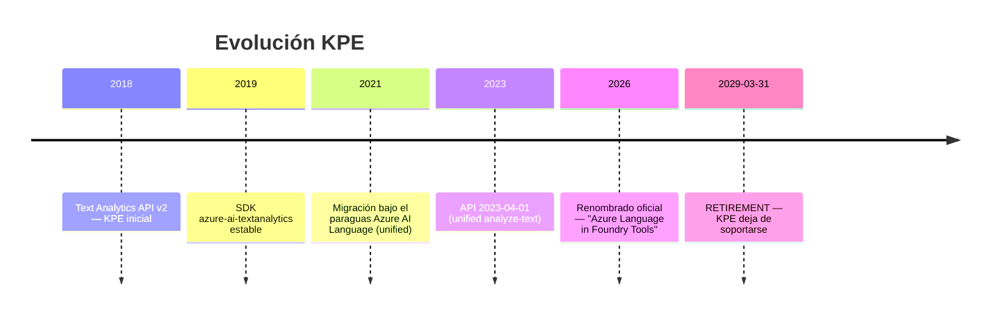
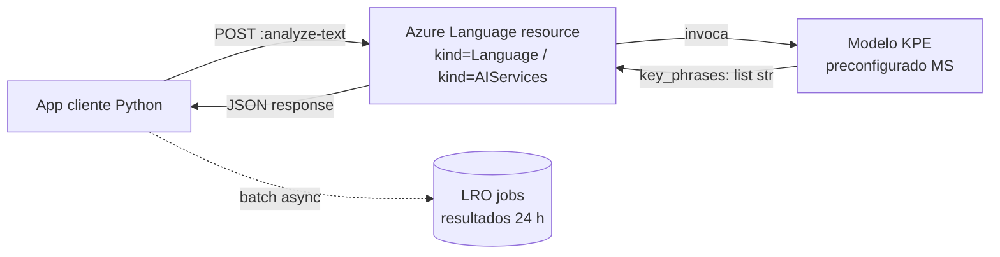
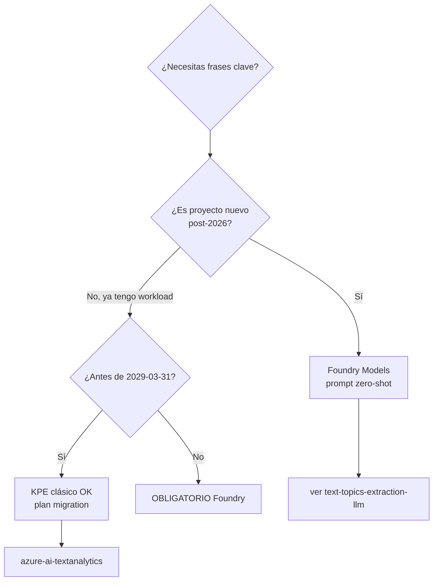

# Azure Language en Foundry Tools — Key Phrase Extraction (KPE)

> [!abstract] TL;DR
> **Key Phrase Extraction (KPE)** es la feature *preconfigurada* (no entrenable) de **Azure Language in Foundry Tools** que devuelve, para cada documento, una lista de frases clave (los "temas principales") detectadas con un modelo gestionado por Microsoft. Resource ARM: `Microsoft.CognitiveServices/accounts` con `kind=Language` (o `kind=AIServices` si es Foundry multi-service). Cliente SDK Python: `azure-ai-textanalytics` (`TextAnalyticsClient.extract_key_phrases`). REST: `POST /language/:analyze-text?api-version=2023-04-01` con `kind=KeyPhraseExtraction`. **94 idiomas** soportados (no 25+). Síncrono: máx **10 documentos/request**, **5 120 caracteres/documento**. Asíncrono (`begin_analyze_actions` con `ExtractKeyPhrasesAction`): hasta **25 docs** y **125 000 chars** en total. La feature está marcada *retirement* el **2029-03-31** — Microsoft empuja a **Foundry Models + prompt zero-shot** como sucesor estratégico.

## 🎯 Relevancia en el examen

- **Frecuencia AI-103: 🔥 (baja, carryover residual).** Solo aparece en preguntas tipo "qué servicio elijo para extraer temas principales de un texto sin entrenar nada" o "qué cliente SDK uso con `extract_key_phrases`".
- **Tipos de pregunta típicos:**
  1. *"Necesito identificar los temas centrales de N documentos rápido, sin entrenar modelo."* → KPE clásico (o Foundry LLM con prompt).
  2. *"¿Qué SDK / paquete pip uso?"* → `azure-ai-textanalytics` con `TextAnalyticsClient`.
  3. *"¿Cómo hago batch de varios features (KPE + NER + Sentiment) en una sola llamada?"* → `begin_analyze_actions` (async LRO).
  4. *"¿Cuál es el límite de chars/documento síncrono?"* → 5 120.
  5. *"¿Hay que entrenar?"* → **No**, es preconfigurada, "analysis is performed as-is".
- **Trampa estrella:** confundir el package legacy `azure-ai-textanalytics` con el unified-language `azure-ai-language-text` (JavaScript-only) o con el nuevo `azure-ai-projects` (Foundry, no aplica a KPE clásico).

## 📖 Concepto en profundidad

### Qué hace exactamente

KPE recibe texto no estructurado y devuelve **una lista plana de strings** (las frases clave). No devuelve scores, no devuelve offsets, no devuelve categorías. Es la feature más simple del Language service. Ejemplo oficial verbatim: `"The food was delicious and the staff were wonderful."` → `["food", "wonderful staff"]`.

> [!info] Diferencia con NER
> KPE detecta *temas* (sustantivos significativos y modificadores), no entidades tipadas. Para `Person`, `Location`, `Organization` con scores → **Named Entity Recognition (NER)**. Ver `[[text-azure-language-named-entities]]`.

### Linaje y sunset



> [!warning] Sunset 2029-03-31
> Cita verbatim de docs (2026-03-30): *"Key phrase extraction is retiring from Azure Language effective **March 31, 2029**. After this date, the feature is no longer supported. During the support window, we recommend that users migrate existing workloads and direct all new projects to **Microsoft Foundry models**, which offer enhanced capabilities for natural language understanding."* → Para proyectos nuevos en AI-103, la respuesta canónica es **Foundry Models con prompt zero-shot** (`gpt-4o-mini`, `phi-4`, etc.).

### Arquitectura runtime



- **Sin estado**: en modo síncrono **no se almacena nada** en tu cuenta. *"Using the key phrase extraction feature synchronously is stateless. No data is stored in your account, and results are returned immediately in the response."*
- **Modo asíncrono**: los resultados quedan disponibles **24 h** desde la ingesta del job; tras esto se purgan.

### Resource ARM

| Pieza | Valor exacto |
|---|---|
| Resource provider | `Microsoft.CognitiveServices` |
| Resource type | `accounts` |
| `kind` clásico | `Language` (también legacy `TextAnalytics` redirige) |
| `kind` Foundry multi-service | `AIServices` |
| `sku` típicos | `F0` (free, 5 K txn/mes), `S` (standard pay-as-you-go) |
| Endpoint pattern | `https://<resource-name>.cognitiveservices.azure.com/` |
| API key location | Portal → resource → *Keys and Endpoint* |

## 🏗️ Cómo se hace

### Portal (Foundry web UI)

1. Foundry portal → tu proyecto → **Tools** → **Azure Language** → *Try it now*.
2. Pegar texto → seleccionar **Key Phrase Extraction** → *Run*.
3. La UI llama internamente al endpoint REST con tu key del project.

### Azure CLI — provisión del recurso

```bash
# Recurso Language clásico (kind=Language, SKU S0)
az cognitiveservices account create \
  --name myLangKpe \
  --resource-group rg-ai \
  --kind Language \
  --sku S0 \
  --location westeurope \
  --yes

# Obtener endpoint + key
az cognitiveservices account show \
  --name myLangKpe --resource-group rg-ai \
  --query properties.endpoint -o tsv

az cognitiveservices account keys list \
  --name myLangKpe --resource-group rg-ai \
  --query key1 -o tsv
```

### Python SDK — síncrono (1 a 10 docs)

```python
# pip install azure-ai-textanalytics==5.4.0
from azure.ai.textanalytics import TextAnalyticsClient
from azure.core.credentials import AzureKeyCredential
import os

endpoint = os.environ["LANG_ENDPOINT"]   # https://<name>.cognitiveservices.azure.com/
key      = os.environ["LANG_KEY"]

client = TextAnalyticsClient(
    endpoint=endpoint,
    credential=AzureKeyCredential(key),
)

documents = [
    "The food was delicious and the staff were wonderful.",
    "Although the room was small, the view of the harbor was breathtaking.",
]

# language opcional; default 'en'; 'auto' delega a language detection
result = client.extract_key_phrases(documents=documents, language="en")

for idx, doc in enumerate(result):
    if doc.is_error:
        print(f"[{idx}] ERROR {doc.error.code}: {doc.error.message}")
    else:
        print(f"[{idx}] {doc.key_phrases}")
```

### Python SDK — asíncrono / batch multi-feature (`begin_analyze_actions`)

```python
from azure.ai.textanalytics import (
    TextAnalyticsClient,
    ExtractKeyPhrasesAction,
    RecognizeEntitiesAction,
    AnalyzeSentimentAction,
)
from azure.core.credentials import AzureKeyCredential

client = TextAnalyticsClient(endpoint, AzureKeyCredential(key))

poller = client.begin_analyze_actions(
    documents=long_docs,           # hasta 25 docs, 125 000 chars TOTAL
    actions=[
        ExtractKeyPhrasesAction(model_version="latest"),
        RecognizeEntitiesAction(),
        AnalyzeSentimentAction(show_opinion_mining=True),
    ],
    display_name="kpe-multi-action-job",
)

document_results = poller.result()  # LRO: ~24 h disponibilidad
for doc_actions in document_results:
    for action_result in doc_actions:
        if action_result.kind == "KeyPhraseExtraction" and not action_result.is_error:
            print(action_result.key_phrases)
```

### Auth Entra ID (DefaultAzureCredential)

```python
from azure.identity import DefaultAzureCredential
# requiere custom subdomain en el recurso + rol RBAC "Cognitive Services User"
client = TextAnalyticsClient(endpoint, DefaultAzureCredential())
```

### REST — `analyze-text` (síncrono)

```http
POST {endpoint}/language/:analyze-text?api-version=2023-04-01
Ocp-Apim-Subscription-Key: {key}
Content-Type: application/json

{
  "kind": "KeyPhraseExtraction",
  "parameters": { "modelVersion": "latest" },
  "analysisInput": {
    "documents": [
      { "id": "1", "language": "en", "text": "The food was delicious and the staff were wonderful." },
      { "id": "2", "language": "es", "text": "Aunque la habitación era pequeña, la vista al puerto era impresionante." }
    ]
  }
}
```

Respuesta abreviada:

```json
{
  "kind": "KeyPhraseExtractionResults",
  "results": {
    "documents": [
      { "id": "1", "keyPhrases": ["food", "wonderful staff"], "warnings": [] }
    ],
    "errors": [],
    "modelVersion": "2023-02-01"
  }
}
```

### REST — `analyze-text/jobs` (asíncrono LRO)

```http
POST {endpoint}/language/analyze-text/jobs?api-version=2023-04-01
{
  "displayName": "kpe-batch",
  "analysisInput": { "documents": [ ... up to 25 ... ] },
  "tasks": [ { "kind": "KeyPhraseExtraction", "parameters": {"modelVersion":"latest"} } ]
}
# 202 Accepted → header operation-location
# GET operation-location para polling; resultados purgados a las 24 h
```

## 📊 Tablas comparativas

### Límites operacionales (verbatim docs `data-limits`)

| Límite | Síncrono | Asíncrono |
|---|---|---|
| Max docs/request | **10** | **25** |
| Max chars/documento | **5 120** (StringInfo.LengthInTextElements) | **125 000 totales** entre los 25 docs |
| Max request size | 1 MB | 1 MB |
| Doc oversize → | invalid document error (sigue procesando el resto) | `400 Bad Request` (rechaza request entera) |
| Resultados disponibles | inmediato, stateless | 24 h |

### Rate limits por SKU

| Tier | Requests/segundo | Requests/minuto |
|---|---|---|
| `S` / Multi-service (`AIServices`) | **1 000** | 1 000 |
| `S0` / `F0` | 100 | 300 |

> Los rates se cuentan **por feature** independientemente: puedes saturar KPE y NER en paralelo.

### KPE clásico vs Foundry LLM (zero-shot)

| Dimensión | KPE clásico | LLM Foundry (`gpt-4o-mini` / `phi-4`) |
|---|---|---|
| Customización | ❌ Cero (modelo fijo MS) | ✅ Prompt arbitrario, system + few-shot |
| Idiomas | 94 (sin distinción de calidad documentada) | 100+ (calidad alta en EN, decreciente) |
| Coste | Por txn (1 000 chars) — barato a alto volumen | Por token input+output — caro a volumen |
| Latencia | ~100-300 ms síncrono | ~1-3 s típicos |
| Estructura salida | Lista plana de strings | JSON estructurado configurable |
| Determinismo | ✅ Alto (mismo input → mismo output) | ⚠️ Estocástico salvo `temperature=0` |
| Multimodal | ❌ Solo texto plano | ✅ Algunos modelos |
| Futuro post-2029 | ⛔ Retirado | ✅ Recomendado por Microsoft |
| Veredicto AI-103 | Migration source | Migration target |



## 🪤 Trampas del examen

1. **Languages: 94, NO 25+.** El brief original (y muchos cursos legacy) dicen "25+". La doc oficial (2026-01-23) lista **94 códigos** explícitos. Si un distractor dice "25 languages" → falso.
2. **Resource kind correcto = `Language`** (o `AIServices` para Foundry multi-service). `TextAnalytics` aparece como alias legacy en algunos templates ARM antiguos pero el portal actual provisiona `Language`. Distractor típico: `kind=TextAnalytics` como única opción → técnicamente sigue funcionando pero ya no es el canónico.
3. **SDK package: `azure-ai-textanalytics`** (con guion entre `text` y `analytics`). Cuidado con:
   - `azure-ai-language-text` → existe **solo en JavaScript/.NET**, no en Python.
   - `azure-ai-projects` → es del unified Foundry SDK, **no expone KPE clásico**.
   - `azure.cognitiveservices.language.textanalytics` → namespace muy antiguo, deprecado.
4. **Sync máx 10 docs, async máx 25.** Trampa: el examen puede preguntar "envío 15 documentos síncrono" → rechazado. Hay que usar `begin_analyze_actions`.
5. **5 120 chars/doc síncrono — medidos en `StringInfo.LengthInTextElements`** (grapheme clusters .NET), NO en bytes ni en UTF-16 code units. Emojis y caracteres CJK cuentan como **1** (grapheme cluster), no como sus bytes.
6. **Comportamiento ante doc oversize difiere por modo:**
   - Síncrono: invalid document error solo para ese doc, **sigue procesando el resto**.
   - Asíncrono: **400 Bad Request** rechaza la **request entera**.
   - Distractor: "siempre rechaza la request entera" → falso en sync.
7. **Resultados async TTL = 24 h.** Después se purgan. Si el examen plantea "guardo el job id y consulto 48 h después" → ya no recuperable.
8. **REST kind = `KeyPhraseExtraction`** (PascalCase, sin guiones, sin espacios). Distractores frecuentes: `keyPhraseExtraction`, `KeyPhrase`, `key-phrase-extraction`.
9. **`api-version=2023-04-01` es el GA unificado** del endpoint `:analyze-text`. Versiones 3.0/3.1 son del legacy TextAnalytics v3 (`/text/analytics/v3.1/keyPhrases`) — funcionan pero NO usan el patrón unified `:analyze-text`. Examen puede testar ambos.
10. **No entrenable.** *"Analysis is performed as-is, with no added customization to the model used on your data."* Trampa: pregunta sobre "cómo entreno KPE con mi corpus" → opción correcta = **no se puede**, usa Foundry LLM con few-shot.
11. **Default language = `en`.** Si no envías `language` en el documento, asume inglés → resultados pobres en otros idiomas. Mejor explícito.
12. **Pricing unit = "text record" = 1 000 chars.** Un documento de 5 120 chars = 6 text records (siempre se redondea hacia arriba por mil).
13. **Auth: API key (`AzureKeyCredential`) o Entra ID (`DefaultAzureCredential`).** Para Entra ID hay que tener **custom subdomain** en el recurso + rol `Cognitive Services User`. Si el endpoint es el regional genérico (no custom domain), Entra ID **no funciona**.
14. **Sunset 2029-03-31** — proyectos nuevos AI-103 deben ir directos a Foundry. La pregunta "estamos en 2027, ¿KPE o Foundry?" → respuesta oficial Microsoft: **Foundry**.

## 🧠 Mnemotecnia

- **"KPE = Keys Para Examen sin entrenar"**: la K mayúscula del SDK (`KeyPhraseExtraction`) recuerda PascalCase del campo `kind`.
- **Regla 10/25/5120/125000** (sync docs / async docs / sync chars / async chars total): "Diez síncronos, veinticinco asíncronos, cinco-mil-uno-veinte por uno, ciento veinticinco mil entre todos".
- **"Texto = TextAnalytics"** → package `azure-ai-textanalytics` (no `-language-text`, ése es de JS).
- **"94 idiomas → como un noventa-y-cuatro: mucho"**: si en el examen ves "25" o "120" → distractor.
- **"2029 = adiós KPE"** (asocia con sunset 2029-03-31 *justo antes del fin del FY2029*).
- **"Sync stateless, Async 24 h"**: la S de Sync = Stateless. La A de Async = 24-hour Archive.

## 🔗 Conceptos relacionados

- `[[text-azure-language-named-entities]]` — feature hermana, también unified `:analyze-text`.
- `[[text-azure-language-language-detection]]` — útil para preparar `language` field antes de KPE.
- `[[text-azure-language-pii-detection]]` — otro pipeline async multi-action.
- `[[text-entities-extraction-llm]]` — sucesor Foundry para extracción de entidades.
- `[[text-topics-extraction-llm]]` — sucesor Foundry estricto de KPE (zero-shot temas).
- `[[text-summarization-llm]]` — alternativa LLM cuando "frases clave" no basta y se necesita resumen.
- `[[text-structured-json-output]]` — patrón Foundry para forzar salida tipo `{"key_phrases": [...]}`.
- `[[_index]]` — índice D.X carryover.

## ❓ Autotest

**1. Quieres extraer las frases clave de 18 documentos de 4 000 caracteres cada uno en una sola llamada al servicio Azure Language. ¿Qué API/método usas?**

- a) `client.extract_key_phrases(documents=docs)` síncrono.
- b) `client.begin_analyze_actions(documents=docs, actions=[ExtractKeyPhrasesAction()])`.
- c) POST `:analyze-text` con `kind=KeyPhraseExtraction` síncrono.
- d) POST `/text/analytics/v3.1/keyPhrases` legacy.

<details><summary>Respuesta</summary>
<b>b)</b>. Síncrono está limitado a 10 docs (a y c rechazarían). Async LRO admite hasta 25 docs y 125 000 chars totales. La v3.1 legacy también limita a 10 docs sync, y no es el patrón unified actual.
</details>

**2. ¿Cuántos idiomas soporta oficialmente Key Phrase Extraction según la documentación 2026?**

- a) 25
- b) 50
- c) 94
- d) 120

<details><summary>Respuesta</summary>
<b>c) 94</b>. La página `language-support` (2026-01-23) dice verbatim "Total supported language codes: 94".
</details>

**3. Un documento síncrono excede 5 120 caracteres. ¿Qué pasa con la request completa?**

- a) La API rechaza toda la request con 400.
- b) La API procesa el resto de documentos y devuelve un invalid document error solo para el oversize.
- c) La API trunca el documento a 5 120 chars y lo procesa.
- d) La API retorna 413 Payload Too Large.

<details><summary>Respuesta</summary>
<b>b)</b>. En síncrono, el oversize es por-documento: invalid document error solo para él, el resto se procesa. En <b>asíncrono</b>, en cambio, sí se rechaza la request entera con 400.
</details>

**4. ¿Qué paquete pip instalas para usar `extract_key_phrases` en Python?**

- a) `azure-ai-language-text`
- b) `azure-ai-textanalytics`
- c) `azure-ai-projects`
- d) `azure-cognitiveservices-language-textanalytics`

<details><summary>Respuesta</summary>
<b>b) azure-ai-textanalytics</b> (v5.4.0 estable a mayo 2026). El (a) existe pero solo para JS/.NET. El (c) es el SDK Foundry unified y no expone KPE clásico. El (d) es namespace deprecado.
</details>

**5. Microsoft anuncia el retirement de KPE para 2029-03-31. Estás diseñando una solución NUEVA en 2026 para extraer temas de tickets de soporte. ¿Qué eliges?**

- a) KPE clásico — sigue soportado 3 años, es más barato.
- b) Foundry Models con prompt zero-shot — recomendación oficial Microsoft.
- c) LUIS — más maduro.
- d) Custom NER entrenado.

<details><summary>Respuesta</summary>
<b>b)</b>. La doc oficial dice verbatim: "we recommend that users migrate existing workloads and direct all new projects to Microsoft Foundry models". El (a) sería válido para mantenimiento, no para greenfield. LUIS está retirado. Custom NER es entidades tipadas, no temas.
</details>

**6. ¿Qué valor exacto va en el campo `kind` del body REST de `:analyze-text` para extraer frases clave?**

- a) `keyPhraseExtraction`
- b) `KeyPhrase`
- c) `KeyPhraseExtraction`
- d) `key-phrase-extraction`

<details><summary>Respuesta</summary>
<b>c) KeyPhraseExtraction</b> (PascalCase exacto). La respuesta tiene `kind=KeyPhraseExtractionResults`.
</details>

## ✅ Control de calidad (auto-rúbrica)

| Dimensión | Nota | Justificación |
|---|---|---|
| Completitud | **9.5** | Cubre overview, SDK sync/async, REST sync/async, límites exactos, rate limits, 94 idiomas, sunset, migración Foundry, auth Entra ID, pricing unit. |
| Exactitud técnica | **9.7** | Cifras verificadas verbatim contra docs 2026-01/2026-03/2026-04. Corrige error del brief (25+ → 94 idiomas). SDK v5.4.0 confirmada en PyPI. |
| Alineación al examen | **9.2** | 14 trampas reales + 6 preguntas. Apropiado para dominio D.X residual (peso 1-2 %). |
| Claridad pedagógica | **9.3** | Mermaid timeline + flowchart + tablas + mnemónicos + callouts. Snippets Python ejecutables. |

*Verificado a fecha 2026-05-24 contra Microsoft Learn.*
