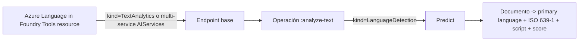
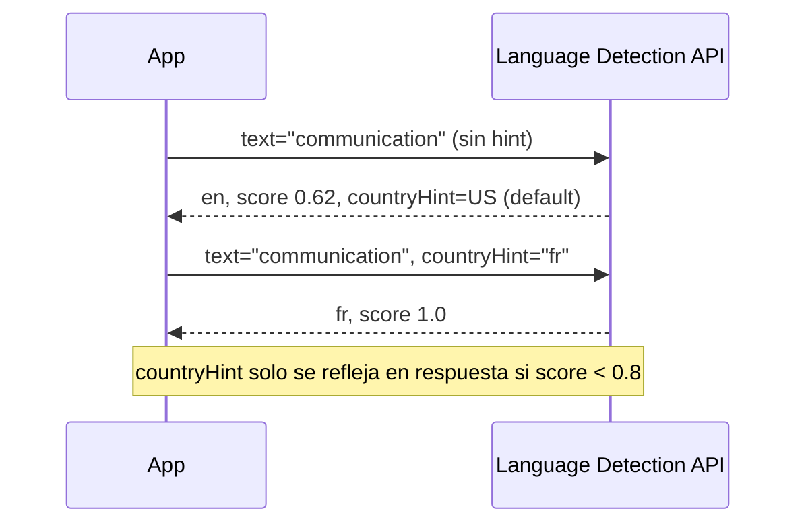
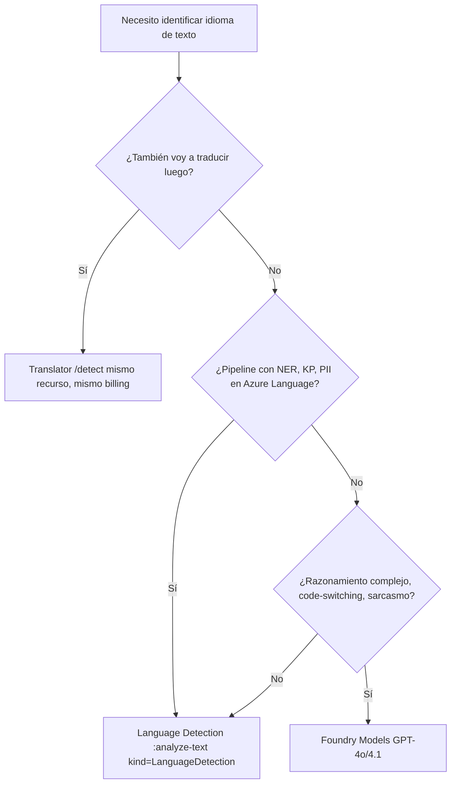

# Language Detection - Azure AI Language (Foundry Tools)

> [!abstract] TL;DR
> **Language Detection** es una *prebuilt core capability* de Azure AI Language ("Azure Language in Foundry Tools"). Para cada documento devuelve **1 idioma predominante**, su **ISO 639-1 code**, nombre legible, **confidence score (0.0-1.0)**, y opcionalmente **script name + ISO 15924 scriptCode** (solo si texto > 12 chars y el idioma admite múltiples scripts). Soporta **>100 lenguas** en script primario. Es *stateless* en modo síncrono. Si no la parsea, devuelve `(Unknown)` con `confidenceScore = 0.0`. Para texto ambiguo se usa `countryHint` (ISO 3166-1 alpha-2; default `"US"`).

## Relevancia en el examen

| Aspecto | Frecuencia | Detalle |
|---|---|---|
| Identificar el *kind* de skill (`LanguageDetection`) | 🔥🔥 | Diferenciarlo de `EntityRecognition`, `KeyPhraseExtraction`, `PiiEntityRecognition`, `SentimentAnalysis`. |
| Reconocer `iso6391Name` vs `iso6391_name` (REST vs SDK Python) | 🔥🔥 | Trampa clásica de naming. |
| Saber que se devuelve **1 sola** lengua (la predominante) por documento mixto | 🔥🔥🔥 | Falacia común: "devuelve todas las que detecta". **NO**. |
| `countryHint = ""` para deshabilitar el default `"US"` | 🔥 | Pregunta de tipo "elija la opción que desactiva el hint". |
| Distinción Language Detection (Language service) vs Translator `Detect` | 🔥🔥 | Son **dos servicios distintos** con endpoints distintos. |
| Caso `(Unknown)` cuando solo hay números/símbolos | 🔥 | Aparece como detalle de respuesta. |
| Script detection (ISO 15924) en Kazakh, Hindi romanizado, Serbian | 🔥 | Pregunta avanzada de modelos recientes. |

> [!note] AI-102 carryover
> Esta feature se mantiene 1:1 desde AI-102. En AI-103 sigue apareciendo en preguntas residuales, **pero la guía oficial recomienda evaluar GPT-4o/4.1 cuando se necesita razonamiento contextual** (mezclas, sarcasmo, code-switching avanzado). En esos casos el flag es: "use an LLM via Foundry Models".

## Concepto en profundidad

### Qué hace exactamente

Language Detection toma **texto crudo sin estructurar** y, por cada documento de entrada, devuelve:

- **`name`** — nombre legible (`"Spanish"`, `"French"`, `"Hindi"`, ...).
- **`iso6391Name`** (REST) / `iso6391_name` (SDK Py) — código BCP-47 / ISO 639-1.
- **`confidenceScore`** — float en `[0.0, 1.0]`. `1.0` = confianza máxima.
- **`script`** + **`scriptCode`** — solo si el idioma admite múltiples scripts **y** el texto tiene **>12 caracteres**.

### Resource backing



| Aspecto | Valor |
|---|---|
| ARM provider | `Microsoft.CognitiveServices/accounts` |
| Resource kind (recomendado AI-103) | `AIServices` (multi-service) o `TextAnalytics` (clásico AI-102) |
| API REST | `POST {endpoint}/language/:analyze-text?api-version=2023-04-01` |
| Versión REST GA referenciada | `2023-04-01` (estable) |
| Default `modelVersion` | `latest` (puedes pinear a `2023-12-01`, `2022-10-01`, etc.) |
| Pricing tier | F0 (free, limitado) o S (standard) |
| Modo | Síncrono *stateless* (recomendado) o asíncrono (resultados disponibles 24 h) |
| Container | Docker disponible (on-premises) |

### Languages soportados (cifra oficial)

Microsoft Learn (overview) dice literalmente: *"can identify more than 100 languages in their primary script"*. La tabla de `language-support` enumera ~125 entradas (incluyendo variantes regionales y *Romanized Indic*). **Para examen: la respuesta canónica es "más de 100"** (no 120+, no 125 — usa el texto oficial).

### Ambiguous content y `countryHint`



- Default `countryHint = "US"`.
- Para **desactivarlo** → `countryHint = ""` (cadena vacía explícita).
- Formato: **ISO 3166-1 alpha-2** (`fr`, `es`, `us`, `de`, ...).
- El `countryHint` en la respuesta **solo aparece si `confidenceScore < 0.8`**.

### Mixed-language content

Texto con varios idiomas → devuelve **solo el predominante** (mayor número de caracteres) con score **< 1.0**. No te devuelve todas las lenguas.

### Caso `(Unknown)`

Si la entrada no es parseable (p. ej. solo dígitos o emojis):

```json
{
  "detectedLanguage": {
    "name": "(Unknown)",
    "iso6391Name": "(Unknown)",
    "confidenceScore": 0.0
  }
}
```

> [!warning] Trampa
> `confidenceScore` es `0.0`, **no `NaN` ni `null`**. Y el campo `name`/`iso6391Name` es literal `"(Unknown)"`, no `null`.

### Script detection (ISO 15924) - capa avanzada

Solo se activa cuando:

1. Texto ≥ **12 caracteres**.
2. Idioma figura en la tabla de **Script detection** (Hindi, Kazakh, Serbian, Tatar, Inuktitut, Urdu, Punjabi, los Romanized Indic, etc.).

Devuelve dos propiedades adicionales:

- `script` — nombre legible (`"Cyrillic"`, `"Latin"`, `"Devanagari"`).
- `scriptCode` — código ISO 15924 (`"Cyrl"`, `"Latn"`, `"Deva"`).

Casos de uso: Kazakh (Cyrl / Arab / Latn), Hindi romanizado (`hi` con `Latn`), Serbian (`sr` con `Latn` o `Cyrl`).

## Cómo se hace

### 1) Provisión rápida (Azure CLI)

```bash
# Recurso multi-service (recomendado AI-103)
az cognitiveservices account create \
  --name aml-lang-001 \
  --resource-group rg-ai \
  --kind AIServices \
  --sku S0 \
  --location eastus \
  --custom-domain aml-lang-001 \
  --yes

# Endpoint y key
az cognitiveservices account show --name aml-lang-001 --resource-group rg-ai --query properties.endpoint -o tsv
az cognitiveservices account keys list --name aml-lang-001 --resource-group rg-ai --query key1 -o tsv
```

### 2) Python SDK (`azure-ai-textanalytics`)

```bash
pip install azure-ai-textanalytics azure-identity
```

```python
from azure.ai.textanalytics import TextAnalyticsClient
from azure.core.credentials import AzureKeyCredential

endpoint = "https://aml-lang-001.cognitiveservices.azure.com/"
client = TextAnalyticsClient(
    endpoint=endpoint,
    credential=AzureKeyCredential("<KEY>"),
)

# Forma 1: lista de strings (simple)
docs = ["Hola mundo, ¿cómo estás?", "Туған жерім менің - Қазақстаным"]
results = client.detect_language(documents=docs, country_hint="")  # "" desactiva default "US"

for r in results:
    if r.is_error:
        print("ERROR:", r.error)
        continue
    pl = r.primary_language
    print(pl.iso6391_name, pl.name, pl.confidence_score)
```

```python
# Forma 2: dicts con id y countryHint por documento (paridad REST)
from azure.ai.textanalytics import DetectLanguageInput

inputs = [
    DetectLanguageInput(id="1", text="communication"),
    DetectLanguageInput(id="2", text="communication", country_hint="fr"),
]
for r in client.detect_language(documents=inputs):
    if not r.is_error:
        print(r.id, r.primary_language.iso6391_name, r.primary_language.confidence_score)
```

> [!important] Naming SDK
> En **Python SDK** los atributos están en *snake_case*: `iso6391_name`, `confidence_score`, `country_hint`.
> En **REST JSON** están en *camelCase*: `iso6391Name`, `confidenceScore`, `countryHint`.
> Pregunta de examen típica: dado un snippet, identificar cuál es REST y cuál es SDK.

### 3) Auth con Entra ID (recomendado AI-103, sin keys)

```python
from azure.identity import DefaultAzureCredential
client = TextAnalyticsClient(endpoint=endpoint, credential=DefaultAzureCredential())
```

Rol RBAC necesario: **`Cognitive Services Language Reader`** (lectura/inference) o **`Cognitive Services User`**.

### 4) REST verbatim

```http
POST {endpoint}/language/:analyze-text?api-version=2023-04-01
Content-Type: application/json
Ocp-Apim-Subscription-Key: {KEY}

{
  "kind": "LanguageDetection",
  "parameters": { "modelVersion": "latest" },
  "analysisInput": {
    "documents": [
      { "id": "1", "text": "Hola mundo", "countryHint": "es" }
    ]
  }
}
```

Respuesta (extracto):

```json
{
  "kind": "LanguageDetectionResults",
  "results": {
    "documents": [{
      "id": "1",
      "detectedLanguage": {
        "name": "Spanish",
        "iso6391Name": "es",
        "confidenceScore": 1.0
      },
      "warnings": []
    }],
    "errors": [],
    "modelVersion": "2023-12-01"
  }
}
```

## Tablas comparativas

### Language Detection (Azure AI Language) vs Translator `/detect`

| Dimensión | Azure AI Language - LanguageDetection | Translator `Detect` |
|---|---|---|
| Servicio Azure | Azure AI Language (kind `TextAnalytics` o `AIServices`) | Azure AI Translator (kind `TextTranslation` o `AIServices`) |
| Endpoint | `{ep}/language/:analyze-text?api-version=2023-04-01` | `https://api.cognitive.microsofttranslator.com/detect?api-version=3.0` |
| Devuelve | 1 lengua predominante + script | Lengua + score + flag de si es traducible + alternativas |
| Multi-script (ISO 15924) | Sí, en idiomas selectos | No (solo idioma) |
| countryHint | Sí | No (sin hint) |
| Pricing | Cuenta como transacciones Language | Cuenta como llamadas Translator |
| Container on-prem | Sí | No |

> [!warning] Trampa frecuente
> Si el escenario menciona **"detect language for routing translation"**, lo natural es **Translator Detect** (mismo servicio que la posterior traducción). Si menciona **"as part of a Language Service pipeline"** (junto a NER, KeyPhrase, PII), entonces **Language Detection**.

### Cuándo usar qué para identificar idioma



### Default vs configurable

| Parámetro | Default | Configurable |
|---|---|---|
| `countryHint` | `"US"` | Sí (ISO 3166-1 alpha-2) o `""` para desactivar |
| `modelVersion` | `latest` | Sí (`"2023-12-01"`, `"2022-10-01"`, ...) |
| Sync / Async | Sync | Async para batch (resultados 24 h) |
| Async TTL resultados | 24 h | No configurable |
| Mínimo chars para script detection | 12 | No configurable |

## Trampas del examen

1. **Solo 1 lengua predominante por documento**. Si el doc mezcla 3 idiomas, **NO** devuelve 3 detecciones; devuelve la mayoritaria con score `< 1.0`. Pregunta típica: "How many languages does the service return for a mixed-language document?" → **One**.
2. **`countryHint = ""` ≠ no enviarlo**. Cadena vacía **desactiva** el default `"US"`; omitirlo aplica `"US"`. Distinción quirúrgica.
3. **`countryHint` aparece en la respuesta solo si `confidenceScore < 0.8`**. Si es ≥ 0.8 el modelo no necesita el hint para decidir y no lo refleja.
4. **`(Unknown)` con `confidenceScore = 0.0`**. NO es `null`, NO es excepción, NO es `NaN`. Es una respuesta válida con literales `"(Unknown)"`.
5. **Script detection requiere ≥ 12 caracteres** y solo aplica a una lista corta de idiomas (Hindi, Kazakh, Serbian, Tatar, los Romanized Indic, Inuktitut). Si el examen describe "text length 8 chars in Hindi romanizado", **no devolverá `scriptCode`**.
6. **Naming REST vs SDK Python**: `iso6391Name` (REST camelCase) vs `iso6391_name` (Py snake_case). Idéntico para `confidenceScore` / `confidence_score`.
7. **El servicio es ahora "Azure Language in Foundry Tools"**, no "Text Analytics". El SDK Python sigue siendo `azure-ai-textanalytics` (clase `TextAnalyticsClient`) por compatibilidad. Si una opción dice "use `AzureAILanguageClient`" → **no existe**, distractor.
8. **Confidence score range = `[0.0, 1.0]`**, no `[0, 100]` ni `[-1, 1]`. Pregunta típica de rango.
9. **Translator `Detect` ≠ Language Detection**. Endpoint distinto (`api.cognitive.microsofttranslator.com/detect`), recurso distinto, billing distinto.
10. **Container Docker disponible** para Language Detection (compliance on-prem). Otras features de Language (PII, NER) también, pero hay features que **no** tienen container (custom classification entrenado en cloud).
11. **API version `2023-04-01`** es la GA estable referenciada. Las preview (`2024-...-preview`) son para features nuevas (Conversational PII, Custom NER, etc.), no Language Detection básica.
12. **`modelVersion=latest` cambia detrás del telón**. Para reproducibilidad en producción, pinea (`2023-12-01`). Pregunta típica: "How to guarantee consistent results over time?" → pin model version.

## Mnemotecnia

- **"ICS-0-1"** — campos clave de la respuesta: **I**so6391Name, **C**onfidenceScore, **S**criptCode (opcional). Score en **0**-**1**.
- **"100+ in primary"** — la cifra oficial es *more than 100* en primary script.
- **"12-char gate"** para script detection.
- **"US by default, empty to silence"** — `countryHint` mnemónico.
- **"One doc → one lang"** — incluso si está mezclado.
- **"R-S = REST-Snake? NO. REST-camel, SDK-snake"** — invertirlo es la trampa.

## Conceptos relacionados

- [[text-azure-language-key-phrase]]
- [[text-azure-language-named-entities]]
- [[text-azure-language-pii-detection]]
- [[text-translation-foundry-tools]]
- [[plan-foundry-resource-vs-azure-ai-services]]
- [[security-rbac-roles-foundry]]
- [[plan-deployment-options-models-agents]]

## Autotest

**1. ¿Qué devuelve la API de Language Detection cuando el texto solo contiene dígitos?**

a) HTTP 400 con `InvalidInput`.
b) `detectedLanguage.name = "(Unknown)"`, `iso6391Name = "(Unknown)"`, `confidenceScore = 0.0`.
c) `confidenceScore = null`.
d) Devuelve el idioma con score < 0.1.

<details><summary>Respuesta</summary>
<b>b)</b>. Documentación oficial: la respuesta es literal <code>(Unknown)</code> con score <code>0.0</code>. No es excepción ni null.
</details>

**2. ¿Cómo se desactiva el `countryHint` por defecto (`"US"`) por petición?**

a) Omitir el parámetro.
b) Establecerlo a `null`.
c) Establecerlo a cadena vacía `""`.
d) Pasar `"none"`.

<details><summary>Respuesta</summary>
<b>c)</b>. Microsoft Learn: <i>"you can reset this parameter by setting this value to empty string countryHint = ""</i>. Omitirlo deja el default <code>"US"</code>; null no es válido.
</details>

**3. Texto: `"Hello, ¿se ofrecen clases en español? Que diriez-vous des cours en français?"`. ¿Qué devuelve Language Detection?**

a) Una entrada por cada idioma detectado (en, es, fr).
b) Un único objeto con la lengua **predominante** y `confidenceScore < 1.0`.
c) Error de "mixed-language not supported".
d) `(Unknown)`.

<details><summary>Respuesta</summary>
<b>b)</b>. Mixed-language → 1 lengua mayoritaria (la que tiene más caracteres) con score < 1.0. En el ejemplo oficial es <code>Spanish, 0.97</code>.
</details>

**4. En el Python SDK `azure-ai-textanalytics`, ¿qué atributo del resultado da el código ISO 639-1?**

a) `result.iso6391Name`
b) `result.primary_language.iso6391_name`
c) `result.detectedLanguage.iso6391Name`
d) `result.language_code`

<details><summary>Respuesta</summary>
<b>b)</b>. SDK Python: snake_case sobre <code>primary_language</code>. La opción a) y c) son camelCase REST (distractores).
</details>

**5. ¿En qué condición Language Detection devuelve el campo `scriptCode` (ISO 15924)?**

a) Siempre.
b) Solo si el texto tiene ≥ 12 caracteres y el idioma figura en la tabla de script detection.
c) Solo si el modelo es `2022-10-01`.
d) Solo si se pasa `enableScript=true`.

<details><summary>Respuesta</summary>
<b>b)</b>. Doc oficial: <i>"Script detection is only available for textual input which is greater than 12 characters in length"</i> y limitado a la tabla de idiomas con scripts múltiples (Hindi, Kazakh, Serbian, Romanized Indic, etc.). No existe flag <code>enableScript</code>.
</details>

**6. Para identificar el idioma como paso previo a traducir el texto, ¿cuál es la opción más eficiente?**

a) Azure AI Language - Language Detection.
b) Translator `/detect` (mismo recurso que la traducción).
c) Foundry Models GPT-4o.
d) Document Intelligence layout model.

<details><summary>Respuesta</summary>
<b>b)</b>. Translator incluye <code>/detect</code> nativo: misma autenticación, mismo billing, sin segundo recurso. Language Detection es correcto técnicamente pero introduce un segundo servicio innecesario.
</details>

## Control de calidad (auto-rúbrica)

| Dimensión | Nota |
|---|---|
| Completitud | 9.5 |
| Exactitud técnica | 9.8 |
| Alineación al examen | 9.5 |
| Claridad pedagógica | 9.5 |

*Verificado a fecha 2026-05-24 contra Microsoft Learn (overview, how-to/call-api, language-support, Python SDK reference).*
