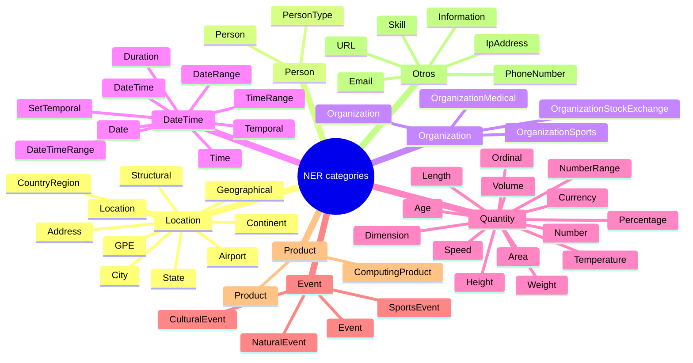
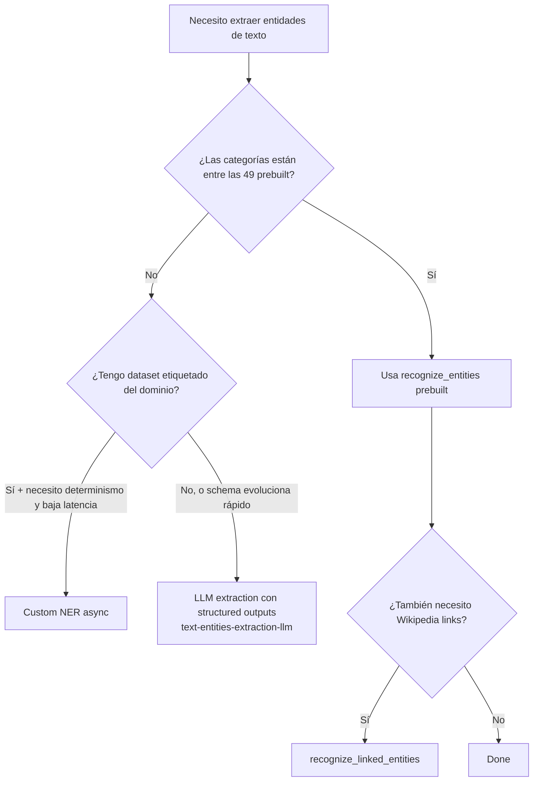

# Azure AI Language — Named Entity Recognition (NER)

> [!abstract] TL;DR
> **NER (Named Entity Recognition)** es una capability *prebuilt* del **Azure Language in Foundry Tools** que detecta y categoriza entidades en texto no estructurado (Person, Location, Organization, DateTime, Quantity, etc.). El recurso ARM es `kind = TextAnalytics` (Language). En `:analyze-text` se invoca con `kind: "EntityRecognition"`. **Desde la GA 2024-11-01 el campo `subcategory` está deprecado**: ahora se usa `type` (granular) + `tags[]` (jerarquía). Existe **Custom NER** para entrenar modelos propios. SDK Python: `azure-ai-textanalytics` → `client.recognize_entities([docs])`. **Linked entities** (Wikipedia) es una *feature distinta*: `recognize_linked_entities`.

## 🎯 Relevancia en el examen

- **AI-102 carryover** (🔥): el examen AI-103 mantiene preguntas sobre Language classic features mientras coexistan con LLM-based extraction.
- **Tipos de pregunta más frecuentes**:
  - Elegir el SDK / método correcto (`recognize_entities` vs `recognize_linked_entities` vs `recognize_pii_entities`).
  - Identificar el `kind` en payload REST de `:analyze-text` (`EntityRecognition`, `EntityLinking`, `PiiEntityRecognition`, `KeyPhraseExtraction`, `LanguageDetection`, `SentimentAnalysis`).
  - **Custom NER vs prebuilt NER**: cuándo entrenar uno propio (dominio específico) vs cuándo basta el prebuilt.
  - **NER (Language) vs LLM extraction** (Azure OpenAI / Foundry agents): trade-offs determinismo / coste / coverage abierto.
  - **Campos del response**: `text`, `category`, `type`, `tags[]`, `offset`, `length`, `confidenceScore`, `metadata`. ⚠️ `subcategory` figura todavía en respuestas de modelos antiguos pero **no debe usarse** en código nuevo.
- **Frecuencia esperada**: 🔥 (1 pregunta probable; alta si el candidato no separa NER de Linked vs PII).

## 📖 Concepto en profundidad

### 1. ¿Qué es NER exactamente?

NER es un proceso lingüístico computacional dentro de NLP que aplica modelos predictivos para **detectar** spans de texto e **identificar** entidades nombradas. Cada entidad recibe:

- **Entity Categories** — clasificación principal (Location, Organization, DateTime, Quantity, Person, Event, Product, PersonType, Email, URL, IpAddress, PhoneNumber, Skill, Address, Information).
- **Entity Types** — distinción granular dentro de una categoría (`City`, `Airport`, `CountryRegion`, `Continent` ⊂ Location).
- **Tags** — afinidad jerárquica multivalor (`GPE`, `Location` etc.) con `confidenceScore` por tag.

> [!info] Cambio clave GA 2024-11-01
> A partir de la API GA **2024-11-01**, el campo `subcategory` **deja de soportarse**. Toda clasificación de entidad se expresa ahora vía `type` (más específico) y `tags[]` (jerarquía con scores). En respuestas legacy aún puede aparecer `subcategory`, pero **el modelo recomendado es ignorarlo** y filtrar por `type` o por nombre de `tag`.

### 2. Recurso Azure y aliasing

| Aspecto | Valor |
| --- | --- |
| Resource provider ARM | `Microsoft.CognitiveServices/accounts` |
| `kind` | `TextAnalytics` (multi-service Language) o `Language` (alias en algunos templates) |
| Nombre comercial actual | **Azure Language in Foundry Tools** |
| Nombre histórico | Text Analytics → Azure AI Language |
| Endpoint | `https://<resource>.cognitiveservices.azure.com/` |
| REST path unificado | `POST /language/:analyze-text?api-version=<v>` |
| `kind` en payload NER | `"EntityRecognition"` |
| `kind` en payload Linked | `"EntityLinking"` |

### 3. Catálogo de entity types (verificado contra docs)

> 49 *entity types* documentados (la cifra "45+" del temario AI-102 está vigente como aproximación). Distribuidos en estas **categorías**:



> [!warning] Cobertura lingüística por entity type
> Algunos types solo están soportados en **inglés (`en`)**: `CulturalEvent`, `NaturalEvent`, `SportsEvent`, `OrganizationMedical`, `OrganizationSports`, `OrganizationStockExchange`. Los core (Location, Person, Organization, DateTime, Quantity, etc.) sí están en el conjunto multilingüe de NER. La lista completa de idiomas vive en *language-support* del servicio.

### 4. Output attributes (verbatim docs)

| Atributo | Tipo | Significado |
|---|---|---|
| `text` | string | Span literal detectado |
| `category` | string | Categoría principal (compat. legacy) |
| `type` | string | Tipo más específico (City, Airport, …) — **úsalo siempre que esté** |
| `tags[]` | lista | `{name, confidenceScore}` jerárquico; sirve para filtrar con `inclusionList`/`exclusionList` |
| `offset` | int | Desplazamiento en el texto |
| `length` | int | Longitud del span |
| `confidenceScore` | float (0-1) | Score de la entidad |
| `metadata` | object | Datos extra; `metadataKind` define el shape (`NumberMetadata`, `DateMetadata`, …) |
| `subcategory` | string | ⚠️ **Deprecated GA 2024-11-01** — no usar |

### 5. Inclusion / Exclusion lists

Permiten filtrar qué entidades devolver. Aceptan **types** o **tag names** indistintamente:

```json
{
  "kind": "EntityRecognition",
  "parameters": {
    "inclusionList": ["GPE"],
    "exclusionList": ["Continent", "CountryRegion"]
  },
  "analysisInput": { "documents": [ { "id":"1", "language":"en", "text":"..." } ] }
}
```

Ejemplo: el snippet anterior devolverá entidades `Location` con tag `GPE`, excluyendo `Continent` y `CountryRegion`.

### 6. Custom NER

Modelo entrenado por el usuario para **entity types específicos del dominio** (ej. `PolicyNumber`, `ContractClause`, `DrugDosage`).

| Aspecto | Custom NER |
|---|---|
| Resource | Mismo `Language` resource (con feature *Custom text classification & extraction* habilitada) + **Storage Account** asociado para datasets etiquetados |
| Workflow | Crear proyecto → subir docs a blob → etiquetar (Foundry / Language Studio) → entrenar → evaluar → deploy → consumir vía `:analyze-text-jobs` (async) con `kind: "CustomEntityRecognition"` |
| Async only | Sí — Custom NER es **siempre asíncrono** (`POST /language/analyze-text/jobs`) |
| Multi-region | Algunas regiones limitadas |
| Sunset | ⚠️ Verificar fechas oficiales de retirement en *azure-ai-language* changelog. El temario AI-102 cita `2029-03-31` pero **debe re-confirmarse** en docs antes de planificar producción |

> [!danger] AI-102 carryover — Custom NER
> Es un patrón que **el examen aún puede preguntar**. Compáralo siempre con **LLM extraction (Azure OpenAI structured outputs / agents)**:
> - **Custom NER**: requiere dataset etiquetado, modelo determinista, baja latencia, coste fijo por entrenamiento + consumo.
> - **LLM (`text-entities-extraction-llm`)**: zero-shot / few-shot, sin training, mayor flexibilidad, coste por token, latencia y no-determinismo más altos.

## 🏗️ Cómo se hace

### Portal / Azure CLI — crear recurso Language

```bash
az cognitiveservices account create \
  --name myLanguageRes \
  --resource-group rg-ai \
  --kind TextAnalytics \
  --sku S \
  --location eastus \
  --yes
```

### Bicep mínimo

```bicep
resource lang 'Microsoft.CognitiveServices/accounts@2024-10-01' = {
  name: 'myLanguageRes'
  location: 'eastus'
  kind: 'TextAnalytics'
  sku: { name: 'S' }
  properties: {
    customSubDomainName: 'myLanguageRes'
    publicNetworkAccess: 'Enabled'
  }
}
```

### SDK Python — `azure-ai-textanalytics`

Instalación:

```bash
pip install azure-ai-textanalytics azure-identity
```

Patrón completo (prebuilt NER sincrónico):

```python
from azure.ai.textanalytics import TextAnalyticsClient
from azure.identity import DefaultAzureCredential

endpoint = "https://<resource>.cognitiveservices.azure.com/"
client = TextAnalyticsClient(endpoint=endpoint, credential=DefaultAzureCredential())

docs = [
    "Microsoft was founded by Bill Gates and Paul Allen on April 4, 1975 in Albuquerque.",
    "Contoso Ltd. opened a new office in Seattle in 2023."
]

result = client.recognize_entities(documents=docs, language="en")

for idx, doc in enumerate(result):
    if doc.is_error:
        print(f"[doc {idx}] error: {doc.error}")
        continue
    print(f"--- doc {idx} ---")
    for entity in doc.entities:
        # entity.subcategory existe en SDK por compat pero está deprecated en GA 2024-11-01
        print(f"  text={entity.text!r:30}  category={entity.category:15}  "
              f"confidence={entity.confidence_score:.2f}  "
              f"offset={entity.offset}  length={entity.length}")
```

> [!tip] AAD (DefaultAzureCredential) vs Key
> Para producción usa **Microsoft Entra ID** (`DefaultAzureCredential`) con el rol **Cognitive Services Language Reader / User**. La key (`AzureKeyCredential`) sigue funcionando pero está desaconsejada para deployments empresariales.

### SDK Python — Linked entities (Wikipedia)

```python
result = client.recognize_linked_entities(documents=docs, language="en")
for doc in result:
    for entity in doc.entities:
        print(entity.name, entity.url, entity.data_source)  # 'Wikipedia'
        for match in entity.matches:
            print("  match:", match.text, match.confidence_score, match.offset)
```

### REST — `:analyze-text` síncrono

```http
POST https://<res>.cognitiveservices.azure.com/language/:analyze-text?api-version=2024-11-01
Content-Type: application/json
Ocp-Apim-Subscription-Key: <key>

{
  "kind": "EntityRecognition",
  "parameters": { "modelVersion": "latest" },
  "analysisInput": {
    "documents": [
      { "id": "1", "language": "en",
        "text": "Microsoft was founded by Bill Gates in Albuquerque." }
    ]
  }
}
```

Respuesta (estructura simplificada):

```json
{
  "kind": "EntityRecognitionResults",
  "results": {
    "documents": [{
      "id": "1",
      "entities": [
        {
          "text": "Microsoft", "category": "Organization", "type": "Organization",
          "offset": 0, "length": 9, "confidenceScore": 0.97,
          "tags": [{ "name": "Organization", "confidenceScore": 0.97 }]
        }
      ],
      "warnings": []
    }],
    "modelVersion": "2023-09-01"
  }
}
```

## 📊 Tablas comparativas y árbol de decisión

### NER prebuilt vs Custom NER vs LLM extraction

| Dimensión | Prebuilt NER | Custom NER | LLM (Foundry / Azure OpenAI) |
|---|---|---|---|
| Entrenamiento | No | Sí (proyecto + labels + train) | No (zero/few-shot) |
| Entity types | ~49 fijos | Definidos por el usuario | Arbitrarios (schema JSON / structured output) |
| Determinismo | Alto | Alto | Medio (con `temperature=0` y structured outputs alto) |
| Latencia | Baja | Baja (deployment) | Media-alta |
| Coste | Por carácter / TPM | Train + inference | Por token (input + output) |
| Modo | Síncrono `:analyze-text` o async `:analyze-text-jobs` | **Async only** (`:analyze-text-jobs`) | Síncrono (chat completions) |
| Mejor para | Categorías estándar, escala masiva | Dominio cerrado etiquetado | Schemas evolutivos, multi-task, multi-idioma sin labels |

### Árbol de decisión



## 🪤 Trampas del examen

1. **`subcategory` está deprecated** desde la GA 2024-11-01. Si una pregunta presenta código nuevo usando `entity.subcategory`, la respuesta correcta suele ser **filtrar por `type` o por `tags[].name`**.
2. **`recognize_entities` ≠ `recognize_linked_entities` ≠ `recognize_pii_entities`**. Son tres métodos distintos del mismo `TextAnalyticsClient`, con tres `kind` REST distintos (`EntityRecognition`, `EntityLinking`, `PiiEntityRecognition`).
3. **Package PyPI**: `azure-ai-textanalytics` (con guiones). Confundirlo con `azure-ai-language-conversations` (eso es CLU/Orchestration) es trampa habitual.
4. **`kind` exacto en REST**: el examen puede mostrar `EntityRecognition` (correcto) vs `NamedEntityRecognition` o `NER` (incorrectos). Solo `EntityRecognition` es válido.
5. **Custom NER es siempre async** — endpoint `:analyze-text-jobs`, no `:analyze-text`. Confundir esto es típico.
6. **Custom NER `kind`**: `CustomEntityRecognition`, **no** `CustomNER` ni `CustomNamedEntityRecognition`.
7. **Linked entities devuelve `url` de Wikipedia + `data_source: "Wikipedia"`**. No confundir con búsqueda en Bing ni con Knowledge Mining (`Microsoft.Search/searchServices`).
8. **`inclusionList` / `exclusionList`** aceptan tanto `type` como `tag name`. Filtrar por `GPE` (tag) o por `City` (type) son ambos válidos. Recuerda la jerarquía: tag `GPE` ⊂ type `Location`.
9. **`category` legacy vs `type` granular**: "Seattle" → `category: "Location"`, `type: "City"`, `tags: [{name:"GPE"}, {name:"Location"}, {name:"City"}]`. El examen puede preguntar cuál identifica la entidad con **mayor especificidad** → respuesta: `type`.
10. **Confidence scores van por entidad y por tag** — son dos cosas distintas. La pregunta clásica: "¿dónde mido la confianza del tag GPE?" → en `entity.tags[i].confidenceScore`, no en `entity.confidenceScore`.
11. **Idiomas limitados a inglés** para algunos types (`CulturalEvent`, `NaturalEvent`, `SportsEvent`, `OrganizationMedical/Sports/StockExchange`). Si la pregunta usa francés/español y espera `SportsEvent`, la respuesta es que **no se detectará**.
12. **Async results expiran a las 24h** (`:analyze-text-jobs`). Si la pregunta menciona "results purgados", recuerda este límite.
13. **Idioma por defecto**: si no especificas `language`, NER asume **English (`en`)**. Casi siempre la respuesta correcta cuando falla la extracción multilingüe.
14. **Resource `kind`**: `TextAnalytics` (más común) o multi-service `AIServices` (Foundry). NO existe `kind=NER`.

## 🧠 Mnemotecnia

- **"E-L-P-K-L-S"** — las seis features del payload `:analyze-text` (`kind`):
  - **E**ntityRecognition
  - **E**ntityLinking
  - **P**iiEntityRecognition
  - **K**eyPhraseExtraction
  - **L**anguageDetection
  - **S**entimentAnalysis
- **"Type es Type, tag es jerarquía"** — `type` = la hoja más granular; `tags` = el árbol con scores.
- **"Sub-CATastrophe"** — `subcategory` está muerto desde 2024-11-01.
- **"Custom es Cult: dataset + train + async"** — Custom NER siempre necesita estos tres.
- **"Linked = Wikipedia"** — `recognize_linked_entities` = enriquecimiento con URLs de Wikipedia.

## 🔗 Conceptos relacionados

- [[text-entities-extraction-llm]] — alternativa LLM (Azure OpenAI / Foundry) a NER classic.
- [[text-azure-language-key-phrase]] — otra feature del mismo `:analyze-text` (`KeyPhraseExtraction`).
- [[text-azure-language-pii-detection]] — `PiiEntityRecognition`, hermana de NER especializada en datos sensibles.
- [[text-azure-language-language-detection]] — `LanguageDetection`, también vive en `:analyze-text`.

## ❓ Autotest

**1. Tu código usa `entity.subcategory` y empezó a devolver `None` para todas las entidades tras migrar a la GA API 2024-11-01. ¿Qué debes hacer?**
a) Reinstalar el paquete `azure-ai-textanalytics`.
b) Cambiar a la API preview 2025-05-15-preview.
c) Migrar el código a usar `entity.category` y `entity.type` / `entity.tags`.
d) Volver a la API 2023-04-01.

<details><summary>Respuesta</summary>
**c)**. El campo `subcategory` está deprecated en la GA 2024-11-01. La clasificación granular ahora vive en `type` y la jerárquica en `tags[]`.
</details>

**2. ¿Qué SDK Python y método invocarías para obtener URLs de Wikipedia de las entidades detectadas?**
a) `azure-ai-language-conversations` → `analyze_conversation()`
b) `azure-ai-textanalytics` → `recognize_linked_entities()`
c) `azure-ai-textanalytics` → `recognize_entities(linked=True)`
d) `azure-ai-formrecognizer` → `analyze_document()`

<details><summary>Respuesta</summary>
**b)**. Linked entities es una feature distinta de NER, expuesta con su propio método en el mismo paquete `azure-ai-textanalytics`. No existe un parámetro `linked=True` en `recognize_entities`.
</details>

**3. Quieres extraer únicamente entidades de tipo geopolítico (países, estados, ciudades) pero excluir continentes. ¿Qué payload REST es correcto?**
a) `{"kind":"EntityRecognition","parameters":{"include":["GPE"],"exclude":["Continent"]}}`
b) `{"kind":"EntityRecognition","parameters":{"inclusionList":["GPE"],"exclusionList":["Continent"]}}`
c) `{"kind":"NamedEntityRecognition","parameters":{"filter":"GPE -Continent"}}`
d) `{"kind":"EntityRecognition","parameters":{"categories":["GPE"],"notCategories":["Continent"]}}`

<details><summary>Respuesta</summary>
**b)**. Los nombres oficiales de los parámetros son `inclusionList` y `exclusionList`, y aceptan tanto `type` como nombres de `tag`. El `kind` correcto es `EntityRecognition`.
</details>

**4. Tu equipo necesita reconocer entidades como `PolicyNumber` y `ClaimAmount` para un sistema de seguros. ¿Qué opción es la más adecuada si tienes 5 000 documentos etiquetados y exiges latencia baja y determinismo?**
a) Prebuilt NER con `inclusionList`.
b) Custom NER (async `:analyze-text-jobs`, `kind: CustomEntityRecognition`).
c) LLM extraction con Azure OpenAI GPT-4o.
d) Custom CLU (Conversational Language Understanding).

<details><summary>Respuesta</summary>
**b)**. Las categorías son de dominio cerrado (no están en los ~49 prebuilt), hay dataset etiquetado y se exige determinismo + latencia baja: **Custom NER**. CLU es para intents/utterances en conversaciones, no para extracción documental.
</details>

**5. ¿Cuál de los siguientes types de entidad **solo** está soportado en inglés?**
a) Person
b) Organization
c) SportsEvent
d) City

<details><summary>Respuesta</summary>
**c)**. `SportsEvent`, `CulturalEvent`, `NaturalEvent`, `OrganizationMedical`, `OrganizationSports` y `OrganizationStockExchange` están limitados a `en`. Los demás son multilingües.
</details>

## ✅ Control de calidad (auto-rúbrica)

| Dimensión | Nota |
|---|---|
| Completitud | 9.5 |
| Exactitud técnica | 9.5 |
| Alineación al examen | 9.5 |
| Claridad pedagógica | 9.5 |

⚠️ **Notas de verificación**:
- Fecha de *sunset* `2029-03-31` para Custom NER mencionada en el brief: **no confirmada verbatim** en las páginas oficiales fetched. Mantengo aviso ⚠️ en el cuerpo. Re-verificar en *azure-ai-language* changelog y `model-lifecycle` antes de planificar producción.
- La cifra exacta de prebuilt entity types se cuenta como **49** en la tabla GA 2024-11-01; el brief decía "45+" y se mantiene como aproximación válida.

*Verificado a fecha 2026-05-24 contra Microsoft Learn (overview, named-entity-categories, how-to-call).*
