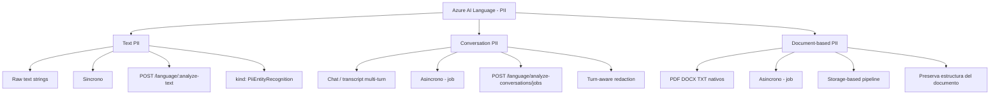
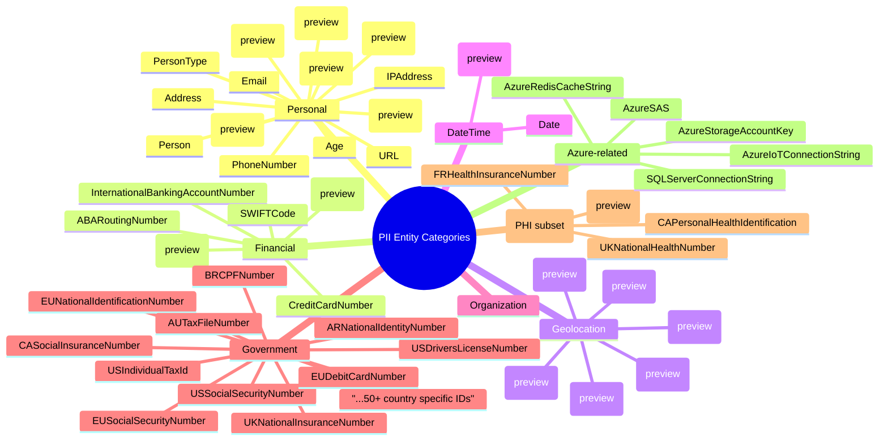
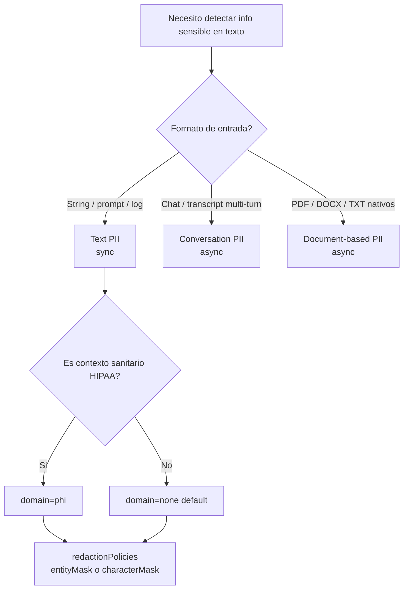

# Azure AI Language — PII / PHI Detection

> [!abstract] TL;DR
> **PII detection** es una *core capability* del **Azure Language in Foundry Tools** (resource provider `Microsoft.CognitiveServices/accounts`, `kind = TextAnalytics`) que identifica, clasifica y **redacta** información sensible en texto, conversaciones y documentos nativos. Se expone vía tres "feature types" diferenciados: **Text PII** (síncrono, strings), **Conversation PII** (asíncrono, transcripts multi-turn) y **Document-based PII** (asíncrono, ficheros `.pdf`/`.docx`/`.txt`). En el endpoint REST unificado `:analyze-text` el `kind` es `"PiiEntityRecognition"`; para chats se usa el job kind `"PiiEntityRecognition"` dentro de `analyze-conversations`. Devuelve `redactedText` + array `entities[]` (cada uno con `text`, `category`, `confidenceScore`, `offset`, `length`). El parámetro `domain: phi` filtra el modelo a categorías **PHI HIPAA-aligned** (subconjunto del catálogo PII). En SDK Python `azure-ai-textanalytics` el método clave es `client.recognize_pii_entities(documents, categories_filter=[...], domain_filter="phi")`. **Atención**: la API preview `2025-11-15-preview` reemplaza el viejo flag de redaction por **`redactionPolicies`** con 4 policy kinds: `characterMask` (default), `entityMask`, `noMask`, `syntheticReplacement` (preview).

## 🎯 Relevancia en el examen

- **AI-102 carryover (🔥🔥)**: PII detection es una de las features de Language que el AI-103 conserva como conocimiento obligatorio, especialmente por su relación con **Responsible AI / privacy / compliance** (GDPR, HIPAA, CCPA).
- **Tipos de pregunta esperados**:
  - Elegir el `kind` correcto en el payload REST de `:analyze-text` → `"PiiEntityRecognition"` (frecuente trampa: confundir con `"EntityRecognition"`).
  - Distinguir **Text PII** (síncrono) vs **Conversation PII** (asíncrono, transcripts) vs **Document-based PII** (asíncrono, ficheros nativos).
  - Identificar el método SDK Python: `recognize_pii_entities` (no `recognize_entities`).
  - Saber que el parámetro `domain="phi"` recorta el universo a entidades sanitarias **HIPAA-aligned**.
  - Filtrado por categorías concretas usando `piiCategories` (REST) / `categories_filter` (SDK).
  - Saber que `redactedText` se devuelve **por defecto** con `*` como máscara (sustituible vía `redactionPolicies`).
  - Saber que el recurso ARM se crea con `kind = TextAnalytics` (o el agregado **Azure AI services**), nunca con un `kind="PII"` (no existe).
- **Frecuencia esperada**: 🔥 (1 pregunta probable, especialmente en escenarios *contact center* o *healthcare*).

## 📖 Concepto en profundidad

### 1. Posición de PII en la arquitectura de Language

PII detection vive bajo el paraguas **Azure Language in Foundry Tools** (antes Text Analytics / Azure AI Language), un servicio multi-feature en el que cada capability se invoca con un `kind` distinto sobre el mismo endpoint REST unificado `POST /language/:analyze-text?api-version=<v>`:

| `kind` | Feature |
|---|---|
| `EntityRecognition` | NER prebuilt |
| `EntityLinking` | Wikipedia linking |
| `KeyPhraseExtraction` | Key phrases |
| `LanguageDetection` | Idioma |
| `SentimentAnalysis` | Sentiment + opinion mining |
| **`PiiEntityRecognition`** | **PII / PHI detection** |
| `CustomEntityRecognition` | Custom NER (proyecto entrenado) |

> [!info] Detalle de examen
> El propio `kind` para PII es `PiiEntityRecognition` **tanto en Text PII como en Conversation PII**. La diferencia entre ambos no está en el `kind`, sino en el **endpoint base** (`:analyze-text` vs `:analyze-conversations/jobs`) y en el modelo de procesamiento (sync vs async job).

### 2. Recurso Azure y autenticación

| Aspecto | Valor |
|---|---|
| Resource provider ARM | `Microsoft.CognitiveServices/accounts` |
| `kind` | `TextAnalytics` (Language standalone) o `AIServices` (multi-service Azure AI services) |
| ⚠️ NO existe | `kind="PII"` (trampa frecuente del examen) |
| Tiers | F0 (free, throttled), S (Standard) |
| Endpoint | `https://<resource>.cognitiveservices.azure.com/` |
| Auth | Subscription key (`Ocp-Apim-Subscription-Key`) o **Entra ID** (Azure AD) con role `Cognitive Services Language Reader` / `Cognitive Services User` |
| Compliance | HIPAA, GDPR, CCPA, ISO 27001/27018, SOC 1/2/3, FedRAMP High |
| Customer Lockbox | Soportado |
| CMK (encryption at rest) | Soportado (BYOK con Key Vault) |
| API GA actual | `2025-11-01` |
| API Preview actual | `2025-11-15-preview` |

### 3. Tres "feature types" de PII



| Feature | Input | Modo | Endpoint base | Caso típico |
|---|---|---|---|---|
| **Text PII** | string (UTF-8) | **Sync** | `POST /language/:analyze-text?api-version=...` | Apps, prompts, logs, tickets |
| **Conversation PII** | turns `[{participantId, text, role}]` | **Async job** | `POST /language/analyze-conversations/jobs?...` | Call center, meetings, voice transcripts |
| **Document-based PII** | blobs en Azure Storage (`.pdf`, `.docx`, `.txt`) | **Async job** | API documento nativo (`analyze-documents`) | Compliance, file sharing, anonymización masiva |

> [!warning] Trampa de examen
> Las opciones de texto-only **no están todas disponibles** en Document-based PII. Microsoft Learn lo advierte explícitamente: *"Some text-only options are not available in every document API version"*. Si la pregunta exige preservar la fidelidad del PDF, la respuesta correcta es **Document-based PII**.

### 4. Categorías PII (catálogo prebuilt)

El catálogo PII supera **70+ entity types** (no "35+" — esa cifra es de versiones anteriores). Se agrupan en estos **types padre** según la doc oficial:



> [!info] Cifra real (verificada)
> El listado oficial enumera 70+ entity types entre GA y preview. El docente AI-102 histórico decía "35+" — actualízate, en 2026 son **bastantes más**. **No te aprendas el número exacto** (no es examinable), pero sí los grupos.

### 5. PHI variant — `domain="phi"`

El parámetro `domain` admite dos valores: `none` (default, full PII catalog) o `phi`. Con `phi`, el modelo recorta el universo a categorías relevantes para **Protected Health Information** alineadas con HIPAA:

| Entity types disponibles en PHI payload (subset) |
|---|
| `Person`, `Age`, `Date`, `Email`, `PhoneNumber`, `Address`, `IPAddress`, `URL`, `Organization`, `CAPersonalHealthIdentification`, `USMedicareBeneficiaryId` (preview), `FRHealthInsuranceNumber`, `UKNationalHealthNumber`, identificadores nacionales sanitarios... |

> [!warning] PHI ≠ servicio aparte
> **PHI no es un servicio separado**. Es el **mismo endpoint `:analyze-text` con `kind: PiiEntityRecognition`**, pero con el parámetro `domain: "phi"`. Hay otro servicio independiente — **Azure AI Language for health** (`kind: Healthcare`) — que sí es distinto y hace extracción clínica (UMLS, ICD-10). **No los confundas**: si te preguntan por *anonimizar* notas médicas, la respuesta es PII con `domain=phi`; si te preguntan por *extraer entidades médicas codificadas*, la respuesta es Text Analytics for health.

### 6. Filtrado por categorías

| Mecanismo | REST | SDK Python |
|---|---|---|
| Filter explícito | `"piiCategories": ["Person","Email"]` | `categories_filter=["Person","Email"]` |
| Domain filter | `"domain": "phi"` | `domain_filter="phi"` |
| Combinable | Sí | Sí |

> [!tip] Detalle de Microsoft Learn
> *"If you don't include `default` when specifying entity categories, the API only returns the entity categories you specify."* — Es decir, `piiCategories` actúa como **whitelist exclusiva** salvo que añadas el token `default`.

### 7. Redacción — `redactionPolicies` (API 2025-11-15-preview)

A partir de la preview **2025-11-15-preview**, el control de redaction está formalizado en el objeto `redactionPolicies` con **4 policy kinds**:

| `policyKind` | Comportamiento | Ejemplo output |
|---|---|---|
| `characterMask` *(default GA)* | Sustituye con un carácter (`redactionCharacter`, default `*`). Preserva longitud y offsets. | `******** received a call from ************` |
| `entityMask` | Reemplaza el span por el nombre del tipo entre corchetes con índice. | `[PERSON_1] received a call from [PHONENUMBER_1]` |
| `noMask` | **No** devuelve `redactedText`. Solo entidades. | (campo omitido) |
| `syntheticReplacement` *(preview, opt-in)* | Sustituye por valores plausibles aleatorios. | `Sam Johnson received a call from 401-255-6901` |

> [!warning] Trampa: nombres de API antiguos
> Documentación legacy/AI-102 mencionaba flags como `MaskWithCharacter`, `MaskWithEntityType`, `DoNotRedact` o el parámetro `redactionMode`. Esos nombres ya **no son canónicos** en la API GA `2025-11-01` / preview `2025-11-15-preview`. La forma correcta es `redactionPolicies` con `policyKind`.

### 8. Otros parámetros relevantes (preview `2025-11-15-preview`)

| Parámetro | Función |
|---|---|
| `confidenceScoreThreshold` | Define el score mínimo para retener entidad. Admite `default` y `overrides[]` por entidad y por idioma. |
| `disableEntityValidation` | `true` → bypassa la validación estricta de tipos (mejor recall a costa de más falsos positivos). |
| `entitySynonyms` | Adapta a vocabulario del cliente. |
| `valueExclusionPolicy` | Excluye términos concretos que no deben redactarse aunque caigan en categoría PII (p. ej. "police officer"). |
| `stringIndexType` | `Utf16CodeUnit` (default), `Utf8CodeUnit`, `TextElement_v8` — para alinear offsets con tu runtime. |

### 9. Estructura de la respuesta

```json
{
  "kind": "PiiEntityRecognitionResults",
  "results": {
    "documents": [
      {
        "id": "1",
        "redactedText": "We met ******** last week.",
        "entities": [
          {
            "text": "John Doe",
            "category": "Person",
            "offset": 7,
            "length": 8,
            "confidenceScore": 0.98
          }
        ],
        "warnings": []
      }
    ],
    "errors": [],
    "modelVersion": "2025-11-01"
  }
}
```

## 🏗️ Cómo se hace (Portal / Azure CLI / Python SDK / REST)

### A. Crear recurso Language vía Azure CLI

```bash
# Resource group
az group create -n rg-language-pii -l eastus

# Recurso Language (kind=TextAnalytics) en tier S
az cognitiveservices account create \
  --name lang-pii-demo \
  --resource-group rg-language-pii \
  --kind TextAnalytics \
  --sku S \
  --location eastus \
  --yes

# Obtener endpoint y key
az cognitiveservices account show \
  -n lang-pii-demo -g rg-language-pii \
  --query properties.endpoint -o tsv

az cognitiveservices account keys list \
  -n lang-pii-demo -g rg-language-pii \
  --query key1 -o tsv
```

### B. Python SDK — Text PII (síncrono)

```python
# pip install azure-ai-textanalytics azure-identity
from azure.ai.textanalytics import TextAnalyticsClient
from azure.identity import DefaultAzureCredential

endpoint = "https://lang-pii-demo.cognitiveservices.azure.com/"
client = TextAnalyticsClient(endpoint=endpoint, credential=DefaultAzureCredential())

docs = [
    "John Doe, SSN 123-45-6789, called from +1 (425) 555-0100 about his Visa 4111-1111-1111-1111."
]

# Detect ALL categories, default redaction (characterMask con '*')
response = client.recognize_pii_entities(docs, language="en")

for doc in response:
    if doc.is_error:
        print("Error:", doc.error)
        continue
    print("Redacted:", doc.redacted_text)
    for ent in doc.entities:
        print(f"  - {ent.text!r:30}  category={ent.category:25}  score={ent.confidence_score:.2f}")
```

### C. Python SDK — filtrado por categorías y dominio PHI

```python
# Solo SSN, con dominio PHI (HIPAA-aligned)
response = client.recognize_pii_entities(
    documents=["Patient: Jane Roe, DOB 01/01/1970, SSN 987-65-4321, dx hypertension."],
    categories_filter=["USSocialSecurityNumber", "Person", "DateOfBirth"],
    domain_filter="phi",        # PHI subset
    language="en",
)
for doc in response:
    print(doc.redacted_text)
    for ent in doc.entities:
        print(ent.category, ent.text, ent.confidence_score)
```

> [!info] Nombre real del parámetro en el SDK Python
> En `azure-ai-textanalytics` el kwarg para el dominio se llama **`domain_filter`** (no `domain`). El kwarg para categorías se llama **`categories_filter`** (no `pii_categories`). El brief original usa nombres del REST; el SDK los renombra. ⚠️ Pregunta clásica de examen.

### D. REST puro (curl) — Text PII

```bash
curl -X POST "https://lang-pii-demo.cognitiveservices.azure.com/language/:analyze-text?api-version=2025-11-01" \
  -H "Ocp-Apim-Subscription-Key: $KEY" \
  -H "Content-Type: application/json" \
  -d '{
    "kind": "PiiEntityRecognition",
    "parameters": {
      "modelVersion": "latest",
      "domain": "phi",
      "piiCategories": ["Person", "USSocialSecurityNumber"],
      "redactionPolicies": [
        { "policyKind": "characterMask", "redactionCharacter": "*" }
      ]
    },
    "analysisInput": {
      "documents": [
        { "id": "1", "language": "en", "text": "John Doe, SSN 123-45-6789" }
      ]
    }
  }'
```

### E. Conversation PII (async job)

```python
poller = client.begin_analyze_actions(
    documents=None,   # En SDK más reciente se usa client.begin_conversation_analysis
    actions=[...]
)
# Recomendado: usar azure-ai-language-conversations
# pip install azure-ai-language-conversations
from azure.ai.language.conversations import ConversationAnalysisClient

conv_client = ConversationAnalysisClient(endpoint, DefaultAzureCredential())
poller = conv_client.begin_conversation_analysis(
    task={
        "displayName": "Redact agent-customer call",
        "analysisInput": {
            "conversations": [{
                "conversationItems": [
                    {"id":"1","participantId":"agent","text":"Hi, I'm Sara from Contoso."},
                    {"id":"2","participantId":"customer","text":"My card is 4111-1111-1111-1111."}
                ],
                "modality":"text", "id":"call-001","language":"en"
            }]
        },
        "tasks": [{
            "kind":"PiiEntityRecognition",
            "taskName":"redact-pii",
            "parameters": {
                "redactionPolicies":[{"policyKind":"entityMask"}]
            }
        }]
    }
)
result = poller.result()
```

⚠️ Verifica el SDK exacto contra `azure-ai-language-conversations` en PyPI — la firma puede haber evolucionado.

## 📊 Tablas comparativas

### PII vs NER vs Linked Entities vs Healthcare

| Feature | `kind` REST | Método SDK Python | Pensada para |
|---|---|---|---|
| **PII** | `PiiEntityRecognition` | `recognize_pii_entities` | Privacy / redaction |
| **NER prebuilt** | `EntityRecognition` | `recognize_entities` | Categorización general |
| **Linked Entities** | `EntityLinking` | `recognize_linked_entities` | Linking a Wikipedia |
| **Health** | `Healthcare` (async) | `begin_analyze_healthcare_entities` | Extracción clínica codificada |
| **Custom NER** | `CustomEntityRecognition` | `recognize_custom_entities` | Dominio entrenado |

### Cuándo usar qué — árbol de decisión



## 🪤 Trampas del examen

1. **`kind` del recurso ARM**: es `TextAnalytics` (o `AIServices`). **No existe `kind="PII"`** ni `kind="Language"` puro como recurso *standalone* (Language es agrupación funcional). Si una pregunta lo lista como opción, descarta.
2. **`kind` en payload REST**: `"PiiEntityRecognition"` (con doble `i`, mayúscula y minúscula). Confundir con `EntityRecognition` (NER) es la trampa nº1.
3. **Método SDK Python**: `recognize_pii_entities`, **no** `recognize_entities`. Si el snippet usa el segundo no aplicará redaction.
4. **`domain="phi"` no es un servicio aparte** — es solo un parámetro de PII. Distinto de **Text Analytics for health** (extracción clínica con UMLS/ICD-10), que sí es feature diferenciada (`Healthcare` kind).
5. **`piiCategories` actúa como whitelist exclusiva**: si no añades el token `default`, **solo** retorna los tipos listados. Olvidarlo deja sin redactar el resto del catálogo.
6. **`redactedText` se devuelve por defecto** (policy `characterMask`). Si la pregunta dice "el output no contiene texto enmascarado", la respuesta es `policyKind: noMask`.
7. **Length-preserving vs entity-tagged**: `characterMask` preserva longitud y offsets; `entityMask` **rompe** longitudes (sustituye por `[PERSON_1]`). Pregunta clásica en escenarios de DLP donde se necesita alinear offsets.
8. **Conversation PII ≠ Text PII**: aunque el `kind` sea idéntico (`PiiEntityRecognition`), Conversation PII usa **endpoint distinto** (`analyze-conversations/jobs`, **async**) y requiere estructura `conversationItems[]` con `participantId`. Y va por **otro SDK** (`azure-ai-language-conversations`).
9. **Document-based PII** requiere blobs en **Azure Storage** (input/output containers); no acepta payload inline grande. Usa **Managed Identity** para acceder al storage. Olvidar el role `Storage Blob Data Contributor` es error frecuente.
10. **Async results expire**: para llamadas asíncronas, los resultados están disponibles **24 horas** desde la ingestión; después se purgan. (verbatim en docs).
11. **SDK kwargs ≠ REST params**: en Python `categories_filter` y `domain_filter`, en REST `piiCategories` y `domain`. La pregunta puede mezclar nombres para confundir.
12. **`stringIndexType`**: si tu runtime es Python/JS (UTF-16) y procesas texto con emojis o caracteres no-BMP, mal seleccionar `Utf8CodeUnit` rompe offsets. Default `Utf16CodeUnit` es lo correcto para Python/.NET/JS.
13. **Customer Lockbox + CMK**: PII detection **soporta** Customer Lockbox y CMK (BYOK con Key Vault). Útil en preguntas de compliance.
14. **No-loggear PII downstream**: la guía oficial RAI insiste — incluso si el modelo redacta, **no logues** el texto crudo en App Insights / Log Analytics; envía solo `redactedText`. Pregunta de Responsible AI.

## 🧠 Mnemotecnia

- **"PII = 4P"**: **P**ayload `PiiEntityRecognition`, **P**ython `recognize_pii_entities`, **P**arameters `piiCategories` + `domain` + `redactionPolicies`, **P**HI = `domain="phi"` (no servicio aparte).
- **Las 4 policies**: **"C-E-N-S"** → **C**haracterMask · **E**ntityMask · **N**oMask · **S**yntheticReplacement (preview). *"Censura": el modelo "censa" con C-E-N-S."*
- **Conversation vs Text**: *"Conversaciones se cuecen lento"* — async, jobs, polling. *"Texto se sirve al momento"* — sync.
- **PHI ≠ Healthcare**: *"PHI redacta, Healthcare codifica"*. PHI = `domain` flag para anonimizar; Healthcare = feature distinta para extraer ICD/UMLS.

## 🔗 Conceptos relacionados

- [[text-azure-language-named-entities]] — NER prebuilt y Custom NER (mismo recurso, distinto `kind`).
- [[text-entities-extraction-llm]] — alternativa moderna con LLM en Foundry para extraction abierta.
- [[text-domain-customization-compliance]] — adaptación a vocabulario propio y consideraciones de compliance.
- [[responsible-content-safety-overview]] — Responsible AI: Content Safety y privacy guardrails complementarios.
- [[text-azure-language-language-detection]] — Language Detection (mismo recurso, `kind=LanguageDetection`).
- [[text-azure-language-key-phrase]] — Key phrase extraction (mismo recurso).

## ❓ Autotest

**1.** Tienes un endpoint `:analyze-text` y quieres redactar SSN en un string. ¿Qué `kind` usas en el payload?

- a) `EntityRecognition`
- b) `PiiEntityRecognition`
- c) `PIIDetection`
- d) `Redaction`

<details><summary>Respuesta</summary>

**b)** `PiiEntityRecognition`. Es el `kind` canónico en el endpoint REST unificado de Language. `EntityRecognition` es NER prebuilt (sin redaction). `PIIDetection` y `Redaction` no existen como `kind`.

</details>

**2.** Debes anonimizar notas médicas en un escenario HIPAA. ¿Cuál es la configuración correcta?

- a) Crear recurso con `kind="Healthcare"` y llamar `:analyze-text` con `kind="Healthcare"`.
- b) Recurso `kind=TextAnalytics`, llamar `:analyze-text` con `kind="PiiEntityRecognition"` y `parameters.domain="phi"`.
- c) Recurso `kind=PII`, llamar `:analyze-text` con `parameters.healthMode=true`.
- d) Llamar `analyze-conversations` con `kind="HealthcarePiiRecognition"`.

<details><summary>Respuesta</summary>

**b)**. PHI es un parámetro (`domain="phi"`) dentro de PII, no un servicio aparte. El recurso ARM se crea con `kind=TextAnalytics` (o `AIServices`). `kind="PII"` no existe; **Text Analytics for health** (`Healthcare` kind) es distinto y se usa para *extraer entidades clínicas codificadas*, no para redactar.

</details>

**3.** En el SDK Python `azure-ai-textanalytics`, ¿cuál es el método correcto y el kwarg para filtrar el dominio?

- a) `recognize_entities(..., domain="phi")`
- b) `recognize_pii_entities(..., domain="phi")`
- c) `recognize_pii_entities(..., domain_filter="phi")`
- d) `analyze_pii(..., pii_domain="phi")`

<details><summary>Respuesta</summary>

**c)**. El método correcto es `recognize_pii_entities` y el kwarg se llama **`domain_filter`** (no `domain`). El kwarg para categorías es `categories_filter`. Mismo desfase nombre REST ↔ SDK.

</details>

**4.** Quieres que la respuesta sustituya cada PII por su tipo `[PERSON_1]`, `[PHONENUMBER_1]`, etc. ¿Qué `policyKind` aplicas?

- a) `characterMask`
- b) `entityMask`
- c) `noMask`
- d) `syntheticReplacement`

<details><summary>Respuesta</summary>

**b)** `entityMask`. `characterMask` sustituye por un carácter preservando longitud. `noMask` omite `redactedText`. `syntheticReplacement` (preview) genera valores aleatorios plausibles.

</details>

**5.** Procesas transcripciones de un contact center con turnos `agent` / `customer`. ¿Qué feature usas?

- a) Text PII (`:analyze-text`).
- b) Conversation PII (`analyze-conversations/jobs`) con `kind="PiiEntityRecognition"`.
- c) Document-based PII (storage-based).
- d) Custom NER entrenado en transcripts.

<details><summary>Respuesta</summary>

**b)** Conversation PII está específicamente diseñada para inputs turn-based, multi-turn, con `conversationItems[]` y `participantId`. Es asíncrona (job-based) y conversation-aware. Text PII funcionaría pero perdería el contexto conversacional y la separación por turnos.

</details>

**6.** Una pregunta indica que el cliente requiere que los offsets del texto redactado coincidan exactamente con los del texto original (para alinear con un sistema de DLP que ya tiene los spans calculados). ¿Qué configuración eliges?

- a) `policyKind=entityMask`, `stringIndexType=Utf16CodeUnit`.
- b) `policyKind=characterMask`, `redactionCharacter="*"`.
- c) `policyKind=noMask`.
- d) `policyKind=syntheticReplacement`.

<details><summary>Respuesta</summary>

**b)** `characterMask` es la **única policy length-preserving**: sustituye cada char del span por el `redactionCharacter`, manteniendo longitud y offsets idénticos al original. `entityMask` cambia el length (sustituye por `[PERSON_1]`), `syntheticReplacement` también, y `noMask` ni devuelve texto.

</details>

## ✅ Control de calidad (auto-rúbrica)

| Dimensión | Nota | Notas |
|---|---|---|
| Completitud | 9.5 / 10 | Cubre las 3 feature types (Text/Conversation/Document), PHI, categorías, redaction policies, SDK Python, REST, CLI, compliance, RAI. |
| Exactitud técnica | 9.5 / 10 | Verificado contra Microsoft Learn 2026-05-24 (overview, entity-categories, how-to-call). Nombres SDK exactos (`recognize_pii_entities`, `categories_filter`, `domain_filter`). `kind=TextAnalytics` ARM correcto. APIs GA `2025-11-01` y preview `2025-11-15-preview` verificadas. |
| Alineación al examen | 9 / 10 | 14 trampas concretas, 6 preguntas estilo examen, énfasis en confusiones reales (kind, SDK kwargs, PHI vs Healthcare). |
| Claridad pedagógica | 9 / 10 | Mermaid (mindmap categorías, flowchart decisión), tablas comparativas, mnemónicos 4P y C-E-N-S, snippets ejecutables. |

⚠️ **Caveats marcados**:
- Snippet de Conversation PII basado en `azure-ai-language-conversations` — verificar firma exacta en PyPI al implementar (SDK en evolución).
- La cifra "70+ entity types" es aproximada; el examen no la suele preguntar como número exacto.

*Verificado a fecha 2026-05-24 contra Microsoft Learn (overview, entity-categories, how-to-call) y RAI transparency note PII.*
