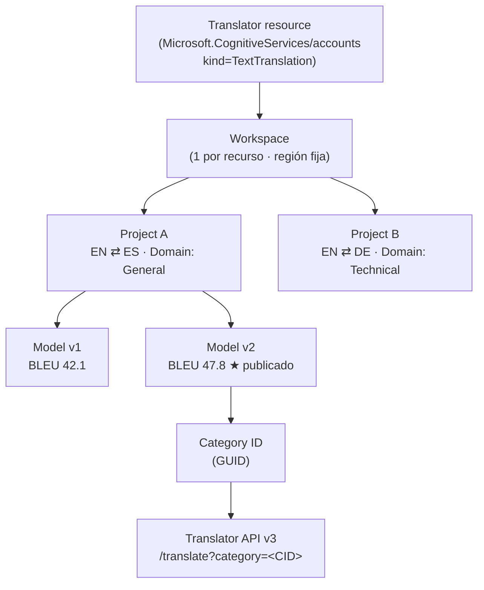
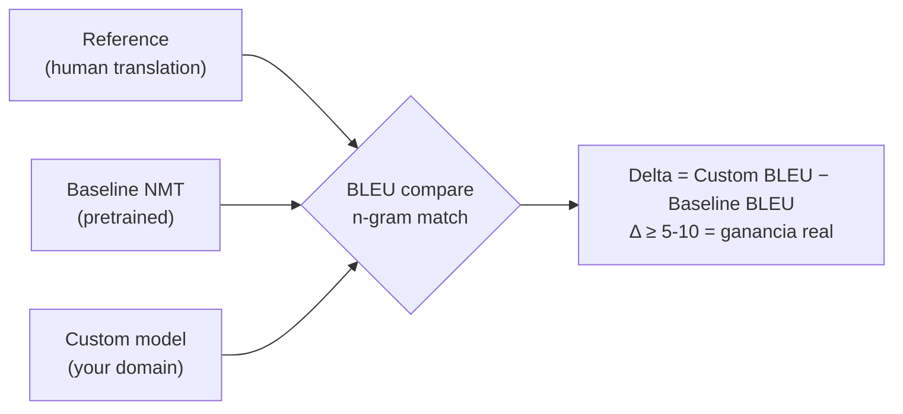
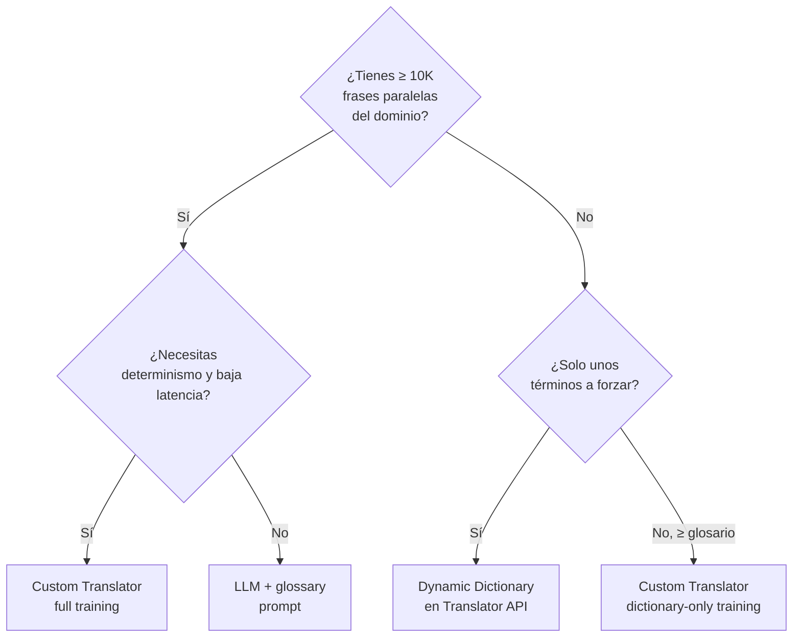

# Custom Translator — Entrenamiento de modelos NMT de dominio

> [!abstract] TL;DR
> **Custom Translator** (feature de **Azure Translator in Foundry Tools**) permite construir sistemas **NMT (Neural Machine Translation)** adaptados a la terminología y estilo del cliente, a partir de **documentos paralelos**. El flujo es: crear **workspace** (1 por recurso Translator) → **project** (1 por par de idiomas + dominio) → subir **training / tuning / testing / dictionary** docs → entrenar (mín. **10 000 frases paralelas**) → evaluar **BLEU score** vs **baseline BLEU** → **publish** → recibir un **Category ID** que se inyecta en la query `category=<id>` de la **Translator Text API v3**. Sin Category ID en la request, el modelo custom **no se utiliza**.

## 🎯 Relevancia en el examen

Frecuencia: 🔥🔥 (sub-tema AI-102 carryover; suele aparecer 1 pregunta).

Escenarios típicos:

- "Tenemos manuales técnicos en EN → ES; el motor estándar traduce mal el argot. ¿Qué pasos para mejorar?" → workspace + project + training docs + train + publish + categoryId.
- "Tengo el `Category ID` pero las traducciones siguen siendo las estándar." → falta el parámetro `category` en la URL de `/translate`.
- "¿Cuántas frases paralelas mínimas necesito?" → **10 000**.
- "¿Cómo mido si mi modelo custom es mejor?" → **BLEU score** (custom) vs **Baseline BLEU** (modelo preentrenado).
- "No tengo corpus paralelo, solo glosario." → **dictionary-only training**.

## 📖 Concepto en profundidad

### Qué es Custom Translator

> *"Custom Translator is a feature of the Azure Translator in Foundry Tools service, which enables enterprises, app developers, and language service providers to build customized neural machine translation (NMT) systems."* — Microsoft Learn

Custom Translator **NO** es un servicio independiente: es una **feature** del recurso **Translator** (`Microsoft.CognitiveServices/accounts` con `kind=TextTranslation`). Se gestiona desde el **portal dedicado**: [`portal.customtranslator.azure.ai`](https://portal.customtranslator.azure.ai).

Aplica **solo a NMT v3** (no a SMT, deprecado desde 2016) y se invoca vía **Microsoft Translator Text API v3**. Soporta también customización de **Azure Speech in Foundry Tools** cuando se usa speech translation.

### Jerarquía de recursos



- **Workspace**: contenedor de trabajo. Vinculado a **una región** (debe coincidir con la región del recurso Translator). Usa la **Key 1 o Key 2** del recurso.
- **Project**: agrupa modelos, documentos y tests para un **par de idiomas** + **dominio** (`General`, `Technology`, `Legal`, etc.). Los documentos del workspace con el par correcto aparecen en todos los proyectos compatibles (ej. EN→ES y ES→EN comparten docs).
- **Model**: resultado de un entrenamiento exitoso. Un project puede tener **muchos** modelos, pero **solo uno publicado por project** (aunque ese modelo se puede publicar en **varias regiones**).

### Tipos de documento (los 4 que entran en el examen)

| Tipo | Propósito | Obligatorio | Notas |
|------|-----------|-------------|-------|
| **Training** | Corpus paralelo para aprender | ✅ (mín. **10 000** frases paralelas) | Si no aportas tuning/testing, el servicio extrae aleatoriamente subset del training y lo excluye |
| **Tuning** | Held-out para ajustar hiperparámetros | Opcional | Mejor calidad si lo proporcionas tú |
| **Testing** | Held-out para calcular **BLEU** final | Opcional | Si no se aporta, auto-generado |
| **Dictionary** | Frases/términos forzados (phrase dictionary, sentence dictionary) | Opcional | Permite **dictionary-only training** si no hay corpus suficiente |

> [!warning] Mutua exclusividad
> Los 3 conjuntos (training / tuning / testing) son **mutuamente exclusivos**: la misma frase **NO** puede aparecer en dos sets. Microsoft Learn: *"three mutually exclusive document types are required"*.

### Formatos de documento aceptados

`TMX`, `XLIFF`, `XLF`, `TXT`, `DOCX`, `XLSX`, `ALIGN`, `PDF`, `LCL`, `HTML`, `HTM`.

> [!tip] Auto-alineación a nivel documento
> Si tienes el **mismo contenido** en idiomas distintos pero en archivos separados (no pre-alineados a nivel frase), Custom Translator **alinea automáticamente** las frases entre documentos. No necesitas pre-procesar.

### BLEU score — la métrica clave

> *"BLEU (Bilingual Evaluation Understudy) is a measurement of the difference between an automatic translation and human-created reference translations of the same source sentence."* — Microsoft Learn

- **Rango**: 0–100 (se reporta a menudo como entero).
- **Más alto = más similar** a la traducción de referencia humana.
- **No** evalúa inteligibilidad ni corrección gramatical, solo coincidencia n-gram ponderada.
- **Position-independent**: cuenta matches sin importar posición.
- Microsoft afirma ganancias típicas de **5–10 puntos BLEU** (o más) sobre el baseline con datos apropiados.

> [!important] Comparabilidad
> Microsoft Learn: *"A comparison between BLEU scores is only justifiable when BLEU results are compared with the same Test set, the same language pair, and the same MT engine."* — Comparar BLEU entre proyectos de idiomas distintos o con test sets distintos **es inválido**.



## 🏗️ Cómo se hace

### 1. Crear el recurso Translator (Azure CLI)

```bash
# Crear Translator resource (kind=TextTranslation)
az cognitiveservices account create \
  --name myTranslator \
  --resource-group rg-ai \
  --kind TextTranslation \
  --sku S1 \
  --location westeurope \
  --yes
```

> [!warning] SKU mínimo
> Custom Translator **requiere tier de pago (S1 o superior)**. F0 (free) **no soporta** custom models.

### 2. Crear workspace + project (portal)

Portal: <https://portal.customtranslator.azure.ai>

1. **My workspaces → Create a new workspace** → nombre + **región** (debe coincidir con la del recurso) + **Key 1/Key 2** del Translator.
2. **Create project** → nombre + **Source language** + **Target language** + **Domain** (`General`, `Technology`, …).

### 3. Subir documentos y entrenar

- Manage documents → **Add document set** → Training/Tuning/Testing → upload archivos paralelos (source + target).
- **Train model** → seleccionar docs → **Train now** (toma **horas hasta días** según volumen).

### 4. Evaluar BLEU

En **Model details**: `Test set BLEU score` (custom) vs `Baseline BLEU` (pretrained). Si Δ ≥ 5, valor real.

### 5. Publicar (publish model)

`Publish model` → selecciona modelo → marca regiones donde quieras servirlo → `Publish`. Estado pasa `Deploying → Deployed`. Obtienes un **Category ID** (GUID).

### 6. Invocar con Translator Text API v3 (Python)

```python
import requests, uuid, os

KEY      = os.environ["TRANSLATOR_KEY"]
REGION   = "westeurope"                                    # región del recurso
ENDPOINT = "https://api.cognitive.microsofttranslator.com"
CATEGORY = "a1b2c3d4-1234-5678-9abc-def012345678"           # Category ID del modelo publicado

path   = "/translate"
params = {
    "api-version": "3.0",
    "from": "en",
    "to":   "es",
    "category": CATEGORY,                                   # ← clave: sin esto, NO se usa el custom
}
headers = {
    "Ocp-Apim-Subscription-Key":    KEY,
    "Ocp-Apim-Subscription-Region": REGION,                 # obligatorio para recursos regionales
    "Content-Type":                 "application/json",
    "X-ClientTraceId":              str(uuid.uuid4()),
}
body = [{"text": "The mitral valve regurgitation was assessed by transthoracic echocardiogram."}]

resp = requests.post(ENDPOINT + path, params=params, headers=headers, json=body)
print(resp.json())
```

### 7. Invocar con Document Translation (batch)

`Document Translation` (batch translation de documentos completos) **también** acepta `category` en el `translationTarget`:

```http
POST {endpoint}/translator/text/batch/v1.1/batches
Content-Type: application/json
Ocp-Apim-Subscription-Key: <key>

{
  "inputs": [{
    "source":  { "sourceUrl": "https://...sourcecontainer?<SAS>" },
    "targets": [{
        "targetUrl":  "https://...targetcontainer?<SAS>",
        "language":   "es",
        "category":   "a1b2c3d4-1234-5678-9abc-def012345678"
    }]
  }]
}
```

### 8. Bicep — recurso Translator base

```bicep
resource translator 'Microsoft.CognitiveServices/accounts@2024-10-01' = {
  name:     'myTranslator'
  location: 'westeurope'
  kind:     'TextTranslation'                // ⚠️ kind exacto
  sku:      { name: 'S1' }                    // ⚠️ F0 no soporta custom
  properties: {
    customSubDomainName: 'mytranslator'
    publicNetworkAccess: 'Enabled'
  }
}
```

## 📊 Tablas comparativas

### Custom Translator vs alternativas de adaptación de dominio

| Aspecto | **Custom Translator** | **Translator + Dynamic Dictionary** | **LLM (gpt-4o) + glossary prompt** |
|---------|-----------------------|--------------------------------------|-------------------------------------|
| Tipo de motor | NMT entrenado | NMT estándar + override de términos | LLM generativo (estocástico) |
| Adaptación profunda al dominio | ✅ aprende estilo + gramática | ❌ solo términos puntuales | ⚠️ vía prompting (frágil) |
| Coste training | $ / millón de chars de training | 0 | 0 |
| Coste hosting | $ / hora mientras publicado | 0 | 0 |
| Coste inference | Translator Text API + custom premium | Estándar | $ / token |
| Determinismo | Alto (NMT determinista) | Alto | Bajo (temperature) |
| Latencia | Igual que Translator estándar | Igual | Mayor (LLM) |
| Mínimo datos | **10 000 frases paralelas** (o dictionary-only) | Glosario inline | 0 (prompt) |
| Uso recomendado | Dominios especializados, terminología corporativa estable | Pocos términos a forzar | Prototipos, flexibilidad |

### Árbol de decisión



## 🪤 Trampas del examen

1. **`category` parameter en la URL** es **OBLIGATORIO** para invocar el modelo custom. Sin él, la API responde con el modelo **baseline NMT**, sin error. Síntoma típico: "el modelo está publicado pero las traducciones no usan mi terminología" → falta `?category=<categoryId>`.
2. **Mínimo 10 000 frases paralelas** para `full training`. Por debajo de eso, solo `dictionary-only training` es viable (no produce las mismas ganancias).
3. **Workspace por recurso, project por par de idiomas + dominio**. EN→ES y ES→EN son **proyectos distintos**, pero los **mismos documentos paralelos sirven para ambos** (la dirección source/target no está fijada en el doc).
4. **Región del workspace = región del recurso Translator**. No puedes crear workspace en `westeurope` con un recurso en `eastus`. Si fallas en esto, la Key del recurso es rechazada.
5. **Hosting per-hour**: una vez publicado, **paga por hora aunque no traduzcas**. Despublica si no se usa para evitar facturación oculta.
6. **BLEU score solo comparable** con el **mismo test set, mismo par de idiomas, mismo MT engine**. Trampa: "mi BLEU EN→ES (45) es peor que mi BLEU EN→FR (52) ¿por qué?" → **comparación inválida**.
7. **F0 (free tier) NO soporta Custom Translator**. Mínimo **S1**.
8. **Solo 1 modelo publicado por project** (pero puede publicarse en **múltiples regiones**). Si publicas un modelo nuevo, el anterior se reemplaza.
9. **Training/tuning/testing son mutuamente exclusivos**: la misma frase no puede estar en dos sets. Si solo subes training, el servicio extrae auto-subsets aleatorios.
10. **Document Translation (batch)** también admite `category` en `translationTarget`, no solo el endpoint sincrónico `/translate`.
11. **Ganancia esperada de Custom**: **5–10 puntos BLEU** sobre baseline (cita oficial Microsoft Learn). Una Δ < 2 puntos típicamente indica **datos insuficientes** o **fuera de dominio**.
12. **Custom Translator NO está disponible para todos los idiomas**: solo los que tienen NMT (≈ 36+ idiomas mapeados a NMT). Si el par no soporta NMT, no hay custom.
13. **Authentication header en regional resources**: requiere `Ocp-Apim-Subscription-Region` además de `Ocp-Apim-Subscription-Key`. Sin el region header, error 401.
14. **RBAC del workspace**: el acceso al portal Custom Translator se controla por la **Key del recurso Translator** (no por Azure RBAC sobre el workspace). Compartir workspace = compartir colaboradores en el portal.

## 🧠 Mnemotecnia

- **"W-P-D-T-P-C"** → **W**orkspace, **P**roject, **D**ocuments, **T**rain, **P**ublish, **C**ategoryId.
- **"10K o nada"** → Mínimo 10 000 frases paralelas para full training; si no, dictionary-only.
- **"5-10 BLEU = real"** → ganancia esperada; menos = revisa tu corpus.
- **"Sin `category`, sin custom"** → recordatorio del parámetro de query.
- **"Mutuamente exclusivos"** → training, tuning, testing **nunca** comparten frases.
- **"S1 mínimo"** → F0 no entrena modelos custom.
- **Hosting = taxímetro** → publicado ⇒ paga por hora aunque nadie traduzca.

## 🔗 Conceptos relacionados

- [[text-translation-foundry-tools]] — recurso Translator base, kind `TextTranslation`, Text API v3.
- [[text-document-translation-batch]] — Document Translation asíncrono, también acepta `category`.
- [[text-translation-llm-flows]] — alternativa LLM con glossary para adaptación flexible.
- [[plan-azure-ai-foundry-resources]] — provisioning del recurso Translator.
- [[security-rbac-cognitive-services]] — keys vs Entra ID en Translator.

## ❓ Autotest

**1.** Has publicado un modelo Custom Translator con BLEU 48 (baseline 41). Tu app sigue recibiendo traducciones genéricas. ¿Qué falta?

- a) Re-entrenar con más datos.
- b) Añadir `category=<categoryId>` a la query de `/translate`.
- c) Pagar el premium tier de Custom.
- d) Publicar también en la región del cliente.

<details><summary>Respuesta</summary>
<b>b)</b> El modelo está publicado, pero sin el query parameter <code>category</code> la API v3 utiliza el modelo baseline. La trampa clásica.
</details>

**2.** Tu workspace está en `eastus` pero tu recurso Translator está en `westeurope`. ¿Qué ocurre?

- a) Funciona, la región es solo informativa.
- b) El workspace se crea, pero entrenamientos son más lentos.
- c) El portal rechaza la Key porque la región no coincide con la del recurso.
- d) Funciona pero pagas tráfico inter-región.

<details><summary>Respuesta</summary>
<b>c)</b> Microsoft Learn: <i>"Region must match the region that was selected during the resource creation"</i>. La Key se valida contra la región declarada.
</details>

**3.** Tienes 6 000 frases paralelas EN→DE de documentos técnicos. ¿Cuál es la mejor estrategia?

- a) Full training con los 6 000.
- b) Dictionary-only training, o ampliar el corpus hasta ≥ 10 000.
- c) Llamar a Translator estándar con `dynamicDictionary`.
- d) Pasar a Azure OpenAI con few-shot.

<details><summary>Respuesta</summary>
<b>b)</b> El mínimo para full training es 10 000 frases paralelas. Por debajo, dictionary-only training (o cómo opción alternativa LLM/glossary, pero la pregunta apunta a Custom Translator).
</details>

**4.** Comparas BLEU de tu modelo EN→ES (47) con el BLEU EN→FR del mismo proyecto (53). ¿Conclusión válida?

- a) El modelo francés es mejor.
- b) Necesitas más datos en español.
- c) La comparación entre pares de idiomas distintos no es válida.
- d) BLEU 53 es excelente; 47 está por debajo del baseline.

<details><summary>Respuesta</summary>
<b>c)</b> BLEU solo es comparable con <i>mismo test set, mismo par de idiomas y mismo MT engine</i>. Cita Microsoft Learn.
</details>

**5.** ¿Cuál de estos formatos NO acepta Custom Translator?

- a) TMX.
- b) XLIFF.
- c) PARQUET.
- d) DOCX.

<details><summary>Respuesta</summary>
<b>c)</b> Los formatos oficiales son ALIGN, PDF, LCL, HTML/HTM, XLF, TMX, XLIFF, TXT, DOCX, XLSX. PARQUET no.
</details>

## ✅ Control de calidad (auto-rúbrica)

| Dimensión | Nota |
|-----------|------|
| Completitud (10 sub-puntos del brief + ≥10 trampas) | 9.5 |
| Exactitud técnica (verificado contra Microsoft Learn 4 fuentes oficiales) | 9.6 |
| Alineación al examen (escenarios reales, peso del sub-tema) | 9.4 |
| Claridad pedagógica (mnemónicos, diagramas, tablas, autotest) | 9.3 |

*Verificado a fecha 2026-05-24 contra Microsoft Learn (overview, quickstart, customization, BLEU score, Translator Text API v3).*
