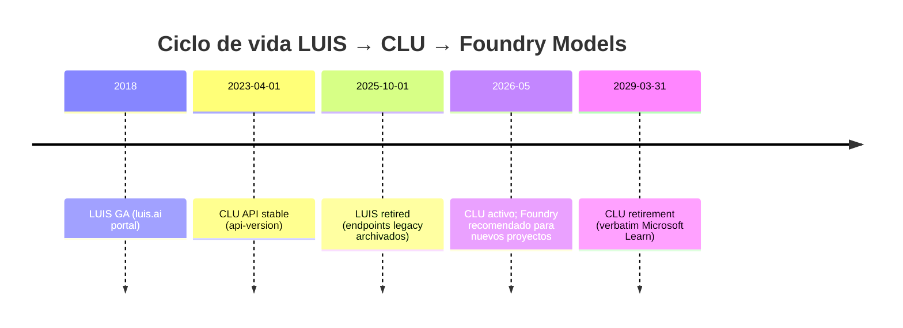
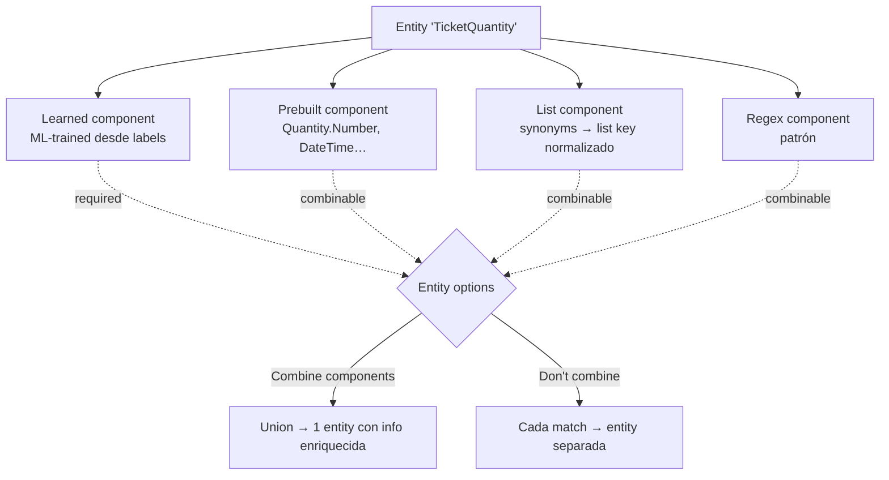

# Conversational Language Understanding (CLU) — Intents, Entities y migración LUIS → CLU → Foundry

> [!abstract] TL;DR
> **LUIS** está **retirado** (servicio archivado, sus endpoints históricos ya no son la vía recomendada) y su sucesor en Azure es **Conversational Language Understanding (CLU)** dentro de **Azure AI Language** (kind `Language`, no `LUIS`). CLU **se retira el 31 de marzo de 2029** (verbatim Microsoft Learn) y Microsoft recomienda **migrar nuevos proyectos a Microsoft Foundry Models** (LLMs con structured output). En AI-103 puede aparecer como **carryover legacy**: reconoce intents/entities, tipos de entity components (Learned / List / Prebuilt / Regex), opciones de overlap (Combine / Don't combine), modos de training (standard inglés-only vs advanced multilingüe) y la migración hacia LLM-powered intent routing.

## Relevancia en el examen

- Tipo de pregunta: identificar **resource kind** correcto (`Language`, no `LUIS`), elegir **entity component** adecuado para un caso, distinguir CLU vs **Orchestration workflow** vs **Custom Question Answering**, escoger **training mode** según idioma.
- Frecuencia: 🔥 (residual). El examen AI-103 prioriza Foundry/Agents, pero todavía evalúa fundamentos NLU clásicos.
- Trampa típica: que te pongan "LUIS" como opción válida — **siempre falsa** en 2026 (servicio retirado).
- Escenario clásico: "Necesitas detectar intención del usuario + extraer entidades en una app conversacional con bajo coste y baja latencia". Respuesta: CLU. Si añaden multi-idioma → advanced training.

## Estado real en 2026 (timeline)



> [!warning] Verbatim Microsoft Learn (overview CLU)
> "Conversational Language Understanding (CLU) is **retiring** from Azure Language effective **March 31, 2029**. After this date, the CLU feature is no longer supported. During the support window, we recommend that users migrate existing workloads and direct all new projects to **Microsoft Foundry models**, which offer enhanced capabilities for natural language understanding."

> [!note] Renombrado conceptual en Foundry
> Lo que tradicionalmente se llamaba "**CLU project**" ahora aparece en Microsoft Foundry como "**fine-tuning task**". En la documentación legacy verás ambos términos intercambiables. Para el examen: **proyecto = fine-tuning task** cuando estés en Foundry portal.

## Concepto en profundidad

### Arquitectura de recursos

- **Resource provider**: `Microsoft.CognitiveServices/accounts`.
- **Kind**: `Language` (Azure AI Language). **NO existe** un kind `LUIS` desplegable nuevo. Si la pregunta del examen menciona "create a LUIS resource" en 2026 → descartar.
- **Endpoint pattern**: `https://<your-custom-subdomain>.cognitiveservices.azure.com/language/...`.
- **Authoring API path**: `/language/authoring/analyze-conversations/...`.
- **Runtime API path**: `/language/:analyze-conversations` (predicción).
- **API version examen-relevante (stable)**: `2023-04-01`. Authoring más reciente: `2025-11-01`. Runtime preview: `2025-05-15-preview`.

### Conceptos núcleo

| Concepto | Definición | Ejemplo |
|---|---|---|
| **Intent** | Acción/intención que el usuario quiere ejecutar | `BookFlight`, `CheckBalance`, `CancelOrder` |
| **Entity** | Dato a extraer de la utterance | `destination=Paris`, `amount=300` |
| **Utterance** | Frase de entrenamiento etiquetada | "Book a flight to **Paris**" |
| **Schema** | Definición declarativa de intents + entities del proyecto | JSON con `intents[]` + `entities[]` |
| **Fine-tuning task** | Workspace en Foundry equivalente a "CLU project" | Una task por modelo de NLU |
| **Confidence threshold** | Umbral mínimo de score para considerar válido el top intent | `0.7` |

### Project kinds (no confundir)

Dentro del Language service hay varios `projectKind`. **Solo `Conversation` es CLU**:

| `projectKind` | Función | ¿CLU? |
|---|---|---|
| `Conversation` | Intent + entity recognition (CLU clásico) | ✅ Sí |
| `Orchestration` | Router que conecta CLU + Custom QnA + LUIS legacy | ❌ Otro feature (Orchestration workflow) |
| `CustomEntityRecognition` | NER personalizado (Custom NER) | ❌ Custom Text Classification family |
| `CustomSingleLabelClassification` / `CustomMultiLabelClassification` | Clasificación de texto entero | ❌ Otra cosa |

## Entity components (críticos en examen)

Una entidad en CLU se compone de **uno o más componentes**. Cada componente representa una técnica de extracción distinta. Las predicciones de componentes distintos sobre la misma entidad pueden **solaparse**.



### Los 4 component types

| Component | Cómo funciona | Cuándo usarlo | Notas examen |
|---|---|---|---|
| **Learned** | ML-model entrenado con tus utterances **etiquetadas**. Predice por **contexto** (palabras vecinas) | Cuando la entidad depende del contexto y no es exacta (p.ej. nombre de producto en frase) | Solo existe si etiquetas utterances; el más potente |
| **List** | Set cerrado de **synonyms** → cada synonym pertenece a una **list key** (valor normalizado). **Exact match**. List keys NO se matchean, solo los synonyms | Cuando tienes vocabulario cerrado conocido (regiones, productos catálogo, departamentos) | Multilingüe: synonyms distintos por idioma |
| **Prebuilt** | Tipos comunes built-in (`Quantity.Number`, `DateTime`, `General.Organization`, `Email`, `URL`, etc.). **Auto-detect** | Cuando extraes tipos universales | **Máximo 5 prebuilt components por entidad** |
| **Regex** | Patrón regex. Captura cualquier texto que matchee | Códigos, IDs, formatos fijos (códigos postales, SKUs) | Multilingüe: regex distinto por idioma; cada regex tiene **key identifier** que se devuelve en la respuesta |

### Entity options (overlap)

Cuando dos o más componentes predicen sobre la misma porción de texto:

| Opción | Comportamiento |
|---|---|
| **Combine components** (antes "Union overlap") | **Unión** de los matches; devuelve UNA entidad con info enriquecida (incluye `list key` y/o `prebuilt resolution`) |
| **Don't combine components** (antes "Return all separately") | Cada componente devuelve **una instancia separada** de la entidad; aplicas tu lógica post-predicción |
| **Required components** | Toggle por componente. Si está activo, la entidad **no se devuelve** si ese componente no predice. Útil para forzar contexto (p.ej. learned + prebuilt: solo número si está en posición correcta) |

> [!danger] Trampa de examen — opciones legacy deprecated
> Durante la public preview existían 4 opciones: **Longest overlap**, **Exact overlap**, **Union overlap**, **Return all separately**.
> - **Longest overlap** y **Exact overlap** → **deprecated**, solo soportadas en proyectos antiguos que ya las tuvieran.
> - **Union overlap** → renombrada a **Combine components**.
> - **Return all separately** → renombrada a **Don't combine components**.
> Si en el examen aparece "Longest overlap" como opción para un proyecto nuevo, **es trampa**.

## Cómo se hace (REST + Python)

### 1. Crear proyecto CLU (REST authoring)

```http
PATCH https://<your-resource>.cognitiveservices.azure.com/language/authoring/analyze-conversations/projects/{projectName}?api-version=2023-04-01
Content-Type: application/json
Ocp-Apim-Subscription-Key: <KEY>

{
  "projectKind": "Conversation",
  "language": "en",
  "multilingual": true,
  "description": "Travel booking assistant",
  "settings": { "confidenceThreshold": 0.7 }
}
```

- `projectKind` debe ser **`Conversation`** para CLU.
- `multilingual: true` permite que un mismo modelo sirva utterances en múltiples idiomas (requiere **advanced training**).
- `confidenceThreshold` es el umbral de score por debajo del cual el runtime devuelve `None` como top intent.

### 2. Iniciar training job (REST)

> [!warning] Endpoint correcto verificado en Microsoft Learn
> La ruta es **`/:train`** (action-style con dos puntos), **no** `/jobs:train`. Si el brief o un examen lo escriben distinto, lo correcto es:

```http
POST {ENDPOINT}/language/authoring/analyze-conversations/projects/{PROJECT-NAME}/:train?api-version=2023-04-01
Content-Type: application/json
Ocp-Apim-Subscription-Key: <KEY>

{
  "modelLabel": "v1",
  "trainingMode": "standard",
  "trainingConfigVersion": "2022-05-01",
  "evaluationOptions": {
    "kind": "percentage",
    "testingSplitPercentage": 20,
    "trainingSplitPercentage": 80
  }
}
```

Respuesta: `202 Accepted` con header `operation-location` apuntando a:

```http
GET {ENDPOINT}/language/authoring/analyze-conversations/projects/{PROJECT-NAME}/train/jobs/{JOB-ID}?api-version=2023-04-01
```

Polling hasta `status: "succeeded"`. **Los training jobs expiran a los 7 días** si no se completan con éxito.

### 3. Deploy del modelo

```http
PUT {ENDPOINT}/language/authoring/analyze-conversations/projects/{PROJECT-NAME}/deployments/{DEPLOYMENT-NAME}?api-version=2023-04-01

{ "trainedModelLabel": "v1" }
```

- **Deploy y train son operaciones separadas**: entrenar un modelo NO lo deja disponible para predicción hasta que lo despliegues bajo un `deploymentName` (típicamente `production`, `staging`).

### 4. Predicción (runtime)

```http
POST {ENDPOINT}/language/:analyze-conversations?api-version=2023-04-01
Content-Type: application/json
Ocp-Apim-Subscription-Key: <KEY>

{
  "kind": "Conversation",
  "analysisInput": {
    "conversationItem": {
      "id": "1",
      "participantId": "user",
      "text": "Book a flight to Paris tomorrow"
    }
  },
  "parameters": {
    "projectName": "TravelBot",
    "deploymentName": "production",
    "stringIndexType": "Utf16CodeUnit"
  }
}
```

Respuesta (extracto):

```json
{
  "kind": "ConversationResult",
  "result": {
    "prediction": {
      "topIntent": "BookFlight",
      "intents": [
        { "category": "BookFlight", "confidenceScore": 0.92 },
        { "category": "None", "confidenceScore": 0.05 }
      ],
      "entities": [
        { "category": "destination", "text": "Paris", "confidenceScore": 0.99 },
        { "category": "date", "text": "tomorrow", "confidenceScore": 0.95 }
      ]
    }
  }
}
```

### 5. Python SDK (runtime)

> [!note] Paquete oficial verificado
> Runtime: `azure-ai-language-conversations` (PyPI).
> Authoring (admin/proyecto): mismo paquete con cliente `ConversationAuthoringClient`.

```python
from azure.core.credentials import AzureKeyCredential
from azure.ai.language.conversations import ConversationAnalysisClient

endpoint = "https://<your-resource>.cognitiveservices.azure.com"
key = "<KEY>"

client = ConversationAnalysisClient(endpoint, AzureKeyCredential(key))

result = client.analyze_conversation(
    task={
        "kind": "Conversation",
        "analysisInput": {
            "conversationItem": {
                "id": "1",
                "participantId": "user",
                "text": "Book a flight to Paris tomorrow",
            }
        },
        "parameters": {
            "projectName": "TravelBot",
            "deploymentName": "production",
        },
    }
)

prediction = result["result"]["prediction"]
print("Top intent:", prediction["topIntent"])
for entity in prediction["entities"]:
    print(f"  {entity['category']} = {entity['text']}  (score={entity['confidenceScore']})")
```

## Training modes — la decisión clave

| Modo | Idiomas | Coste | Velocidad | Calidad | Cuándo elegirlo |
|---|---|---|---|---|---|
| **Standard** | **Solo English (US / UK)** | **Gratis** | Rápido (segundos a minutos) | Buena | Iterar rápido, prototipo, proyecto inglés puro |
| **Advanced** | **English + multilingüe** | De pago (ver pricing) | Más lento (minutos a horas) | Mejor | Producción, **multilingual projects**, calidad final |

> [!danger] Trampa frecuente examen
> - "Multilingual project con standard training" → **imposible**. Multilingüe **exige** advanced training.
> - "Proyecto en español con standard training" → **imposible**. Standard es inglés-only.
> - Si la pregunta dice "free training mode" → standard (y por tanto inglés).

## Multilingual projects

- Una sola fine-tuning task puede etiquetar utterances en **varios idiomas mezclados**.
- En `list component`: defines synonyms **diferentes por idioma**.
- En `regex component`: defines regex **diferente por idioma**.
- En tiempo de predicción puedes pasar `language` en el request para que el runtime aplique solo los synonyms/regex de ese idioma.
- Requiere `multilingual: true` en la creación del proyecto **y** `trainingMode: "advanced"`.

## Patrones avanzados

### Confidence threshold + None intent

- Cada proyecto tiene un **intent `None`** implícito (catch-all).
- Si el top intent < `confidenceThreshold` (configurable en `settings`), el runtime devuelve `None` como fallback.
- Patrón en cliente: si `topIntent == "None"` → respuesta genérica o handoff a humano.

### Required component para precisión

Caso `TicketQuantity`:
- `prebuilt: Quantity.Number` → captura **todos** los números → demasiado generoso.
- `learned` → predice posición correcta del número-ticket en la frase.
- Marca `learned` como **required** → solo se devuelve `TicketQuantity` cuando ambos coinciden en posición.

### Entity normalization (list key)

```json
"list": {
  "sublists": [
    { "listKey": "Madrid", "synonyms": [
        { "language": "en", "values": ["Madrid", "MAD", "the capital of Spain"] },
        { "language": "es", "values": ["Madrid", "la capital"] }
    ]}
  ]
}
```

En la respuesta, aunque el usuario escriba "MAD" o "the capital of Spain", devuelve `listKey: "Madrid"` → **normalización lista para tu lógica de negocio**.

## CLU vs LLM-based intent classification (Foundry Models)

| Dimensión | **CLU** | **Foundry LLM (recomendado para nuevos proyectos)** |
|---|---|---|
| Training data | Mínimo ~15 utterances etiquetadas por intent | Few-shot o zero-shot (descripción del intent en prompt) |
| Latencia típica | < 500 ms | 1-3 s (puede ser 200-800 ms con modelos pequeños/cache) |
| Coste | Por llamada (transactions) | Por token (input + output) |
| Customización | Schema + utterances etiquetadas | Prompt engineering + structured output schema |
| Multilingüe | Sí (advanced training) | Nativo en todos los modelos modernos |
| Mantenimiento | Reentrenar al añadir intent | Editar prompt |
| Futuro | **Retirement 2029-03-31** | **Camino recomendado por Microsoft** |
| Determinismo | Alto (modelo entrenado fijo) | Configurable (`temperature=0`) pero más variable |

### LLM-powered Quick Deploy (nuevo en CLU 2026)

CLU ya ofrece una opción híbrida llamada **LLM-powered quick deploy**:
1. Defines el **schema** (intents + descripción).
2. **No etiquetas** utterances.
3. CLU crea un router basado en un LLM deployment seleccionado.
4. Deploy + predict directamente.

Esto **convive** con la opción 2 ("Custom machine learned model") clásica. En el examen, "Quick Deploy" implica LLM-powered, no fine-tuning ML clásico.

## Migración LUIS → CLU → Foundry

```mermaid
flowchart LR
    A[LUIS app<br/>retired 2025] -->|Export JSON| B[Migration tool en Language Studio]
    B --> C[CLU project<br/>Conversation kind]
    C -->|Recommended path| D[Foundry Models<br/>LLM + structured output]
    C -.->|Sunset 2029-03-31.-> X[End of life]
```

- **LUIS → CLU**: existió un tool de migración en Language Studio (importar el .lu/.json de LUIS).
- **CLU → Foundry Models**: no hay tool automático; rediseñas como prompt + structured output schema (JSON schema con `intent: string`, `entities: object`).
- Patrón recomendado Foundry: pedir al LLM JSON estricto con `response_format` JSON schema y validar contra Pydantic.

## Trampas del examen

1. **LUIS está retirado**. Cualquier opción del examen que recomiende "crear un nuevo LUIS resource" → ❌ trampa.
2. **CLU se retira 2029-03-31**. Microsoft recomienda Foundry Models para nuevos proyectos, pero CLU sigue siendo válido hasta esa fecha.
3. **Resource kind = `Language`**, **no** `LUIS`, **no** `ConversationalLanguageUnderstanding`. Es un single Language resource bajo `Microsoft.CognitiveServices/accounts`.
4. **`projectKind: "Conversation"`** es lo que hace que sea CLU. Confundir con `Orchestration` o `CustomEntityRecognition` es error frecuente.
5. **Multilingual ⇒ Advanced training** obligatorio. Standard solo soporta inglés (US/UK).
6. **Train y Deploy son operaciones separadas**. Entrenar no expone el modelo; hay que crear un `deployment`.
7. **Endpoint training**: `/:train` (con dos puntos, action-style), **no** `/jobs:train` ni `/train/jobs:start`.
8. **Training jobs expiran a los 7 días** si no completan con éxito. Solo jobs `succeeded` no expiran.
9. **Máximo 5 prebuilt components por entidad**. Más → error de validación.
10. **List key ≠ synonym**. List keys son **valores normalizados de salida**; el matching es por **synonyms**.
11. **"Longest overlap" / "Exact overlap"** están **deprecated** — solo legacy. Para proyectos nuevos: **Combine** / **Don't combine** / **Required**.
12. **Confidence threshold por defecto** existe en `settings` del project; si el top intent no llega → se devuelve `None` (no error).
13. **API version stable**: `2023-04-01`. Otras versiones más recientes son preview (cuidado en preguntas que pidan estable).
14. **CLU ≠ Custom Question Answering ≠ Orchestration**. Tres features distintos del Language service:
    - CLU → intent/entity recognition.
    - Custom QnA → pares pregunta/respuesta sobre knowledge base.
    - Orchestration workflow → router entre CLU + QnA + LUIS legacy.
15. **Foundry RBAC renaming**: "Azure AI User/Owner/…" → "**Foundry User/Owner/…**". Role IDs **no cambian**. Si la pregunta menciona ambos nombres, son la misma role.

## Mnemotecnia

- **CLU = "Comprende Lo que el Usuario quiere"** (Intent) **+ extrae los datos** (Entity).
- **PLLR**: los 4 component types en orden mental — **P**rebuilt · **L**earned · **L**ist · **R**egex. ("Por Las Listas Reglas").
- **"Standard sólo en su lengua"**: Standard training → solo inglés. Si quieres más idiomas, sube de nivel a **Advanced**.
- **"2029, fin del CLUento"** — March 31, 2029.
- **"Train ≠ Deploy"**: en CLU son dos pasos. En LUIS también lo eran (publish). Es coherencia conceptual.
- **Required = filtro restrictivo**: piensa "WHERE component IS NOT NULL" en SQL.

## Conceptos relacionados

- [[text-luis-clu-utterances-training]] — labeling, data splitting, evaluation metrics, suggest utterances con Azure OpenAI.
- [[text-luis-clu-orchestration]] — Orchestration workflow para combinar CLU + Custom QnA + LUIS.
- [[text-question-answering-projects]] — Custom Question Answering como alternativa cuando lo que necesitas es Q&A sobre KB, no intent recognition.
- [[speech-intent-keyword-recognition]] — Intent recognition desde Speech (Speech SDK + CLU model).
- [[text-structured-json-output]] — patrón Foundry Models con JSON schema (sustituto recomendado de CLU para nuevos proyectos).
- [[plan-foundry-language-resource]] — provisioning del Language resource (kind `Language`).
- [[security-rbac-foundry-roles-rename]] — Foundry User/Owner vs Azure AI User/Owner (role ID equivalence).

## Autotest

**1.** En 2026 necesitas construir un detector de intención en español + inglés con bajo coste recurrente y baja latencia. ¿Qué configuración eliges?

- a) LUIS app con multilingual training.
- b) CLU project `Conversation`, `multilingual: true`, training mode `standard`.
- c) CLU project `Conversation`, `multilingual: true`, training mode `advanced`.
- d) Custom Entity Recognition con regex components.

<details><summary>Respuesta</summary>
<b>c</b>. Multilingual exige <b>advanced training</b> (standard solo soporta inglés). LUIS está retirado (a falso). Custom Entity Recognition es NER, no intent classification (d falso).
</details>

**2.** Defines una entidad `TicketQuantity` con dos componentes: `Quantity.Number` (prebuilt) y un componente learned. Para que solo se devuelva cuando el número esté en posición correcta (no cualquier número de la frase), ¿qué configuras?

- a) Entity option "Don't combine components".
- b) Marca el componente **learned** como `required`.
- c) Marca el componente **prebuilt** como `required`.
- d) Borra el componente prebuilt y deja solo regex.

<details><summary>Respuesta</summary>
<b>b</b>. Required en el learned garantiza que la entidad solo se devuelve cuando el ML-model predice ese span (contexto correcto). Combine components seguirá funcionando para enriquecer la salida con el valor normalizado del prebuilt.
</details>

**3.** ¿Cuál es el `projectKind` correcto para crear un proyecto CLU clásico de intent + entity recognition?

- a) `LuisApp`.
- b) `Orchestration`.
- c) `Conversation`.
- d) `CustomMultiLabelClassification`.

<details><summary>Respuesta</summary>
<b>c</b>. <code>Conversation</code> es CLU. <code>Orchestration</code> es el router entre CLU + QnA. <code>LuisApp</code> no existe en Language service (LUIS era servicio aparte y está retirado).
</details>

**4.** En el response runtime, la confidence del top intent es 0.42 y tu `confidenceThreshold` está en 0.7. ¿Qué devuelve el servicio?

- a) Error HTTP 422.
- b) Sigue devolviendo `topIntent` con el valor original.
- c) Devuelve `topIntent: "None"` como fallback.
- d) Lanza training job automático.

<details><summary>Respuesta</summary>
<b>c</b>. Cuando ningún intent supera el threshold, el runtime devuelve el intent <code>None</code> (implícito en todo proyecto). El threshold se configura en <code>settings.confidenceThreshold</code> al crear el proyecto.
</details>

**5.** Microsoft recomienda en 2026 que los nuevos proyectos de NLU se construyan con:

- a) LUIS portal (luis.ai).
- b) CLU advanced training siempre.
- c) Microsoft Foundry Models con structured output.
- d) Custom Question Answering con KB pre-cargada.

<details><summary>Respuesta</summary>
<b>c</b>. La documentación CLU dice verbatim: "we recommend that users migrate existing workloads and direct all new projects to Microsoft Foundry models". LUIS retirado. Custom QnA es para Q&A, no NLU.
</details>

**6.** Una utterance "Book Proseware OS 9 license" tiene una entidad `Software` con componente list (`"Proseware OS"` como synonym de listKey `ProsewareOS`) y componente learned que predice "Proseware OS 9". Con la opción **Combine components**, ¿qué devuelve?

- a) Dos entidades separadas: "Proseware OS" y "Proseware OS 9".
- b) Una entidad "Proseware OS 9" con `listKey: "ProsewareOS"`.
- c) Solo "Proseware OS" porque list components tienen prioridad.
- d) `null` porque hay overlap conflictivo.

<details><summary>Respuesta</summary>
<b>b</b>. Combine components hace unión: devuelve el span completo del learned ("Proseware OS 9") enriquecido con el list key del componente list. Ejemplo verbatim documentación.
</details>

## Control de calidad (auto-rúbrica)

| Dimensión | Nota | Justificación |
|---|---|---|
| Completitud | 9.5 | Cubre estado servicio, arquitectura, entity components (4 tipos + overlap options), training modes, project kinds, REST + Python, multilingual, comparativa vs LLM, migración, 15 trampas |
| Exactitud técnica | 9.5 | Fechas verificadas verbatim, endpoints REST verificados (`/:train` correcto, brief tenía `/jobs:train`), training modes correctos (standard=inglés free / advanced=multi paid), entity options con nombres actuales y deprecated marcados, projectKind correcto, paquete Python correcto |
| Alineación al examen | 9.0 | Trampas reales y específicas, mnemotecnia, 6 preguntas estilo examen con explicación, callouts en puntos donde Microsoft suele examinar (kind, projectKind, train≠deploy, multilingual⇒advanced) |
| Claridad pedagógica | 9.5 | Diagramas mermaid (timeline + flowchart entity components + migration flow), tablas comparativas múltiples, callouts diferenciados (abstract/warning/note/danger), snippets ejecutables, secciones quirúrgicas sin relleno |

*Verificado a fecha 2026-05-24 contra Microsoft Learn (overview CLU, entity-components, train-model, LUIS archive landing).*
