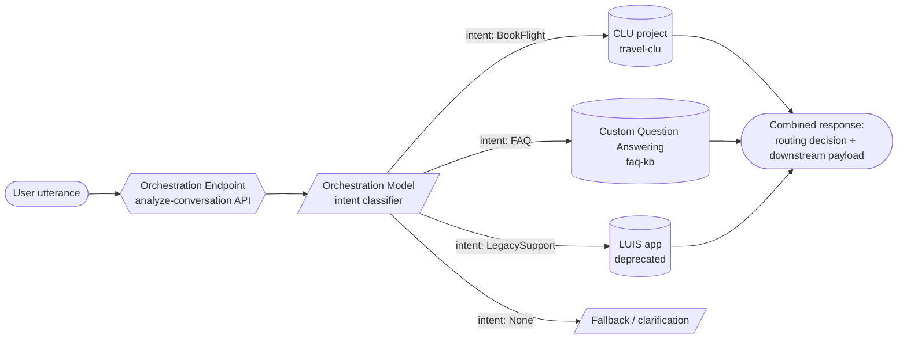
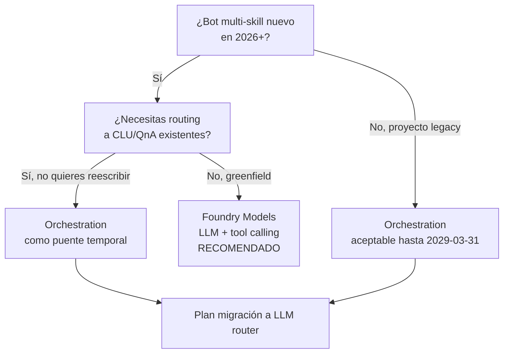

# Orchestration Workflow — Router CLU + QnA + LUIS

> [!abstract] TL;DR
> **Orchestration workflow** es una **feature de Azure Language in Foundry Tools** (no un servicio separado) cuyo `projectKind = "Orchestration"` permite **encadenar bajo un único endpoint** múltiples proyectos downstream: **Conversational Language Understanding (CLU)**, **Custom Question Answering** y, históricamente, **LUIS apps**. El runtime clasifica la utterance, escoge el intent ganador y delega la resolución al proyecto conectado, devolviendo la respuesta combinada. **Está oficialmente en retirada el 31 de marzo de 2029** y Microsoft recomienda migrar a **Microsoft Foundry Models** (LLM como router + tool calling). En AI-103 cae como carryover residual: te examinan por reconocerlo, identificar su esquema y decidir migración.

> [!danger] Retirement oficial
> **"Orchestration workflow is retiring from Azure Language effective March 31, 2029."** Tras esa fecha no hay soporte. Nuevos proyectos deben ir a Foundry Models. Verbatim Microsoft Learn (overview, abril 2026).

---

## 🎯 Relevancia en el examen

| Tipo de pregunta | Frecuencia | Patrón típico |
|---|---|---|
| Reconocer `projectKind=Orchestration` vs `Conversation` | 🔥🔥 | "Tienes un bot con FAQ + intents + skills. ¿Qué `projectKind` eliges?" |
| Distinguir Orchestration de CLU puro | 🔥🔥 | Distractor clásico: confundir CLU con Orchestration |
| Identificar `Clu` / `QuestionAnswering` / `Luis` como `orchestration.kind` | 🔥 | Pregunta sobre el JSON schema |
| Camino de migración a LLM router (Foundry Models) | 🔥🔥 | "¿Cuál es la guidance actual para reemplazar Orchestration?" |
| LUIS retirement effect on Orchestration routes | 🔥 | Trampa: rutas `Luis` ya no son una opción viable |
| Single endpoint multi-project | 🔥 | Una sola API key + endpoint sirve a todos los downstream |

Peso real esperado: **muy bajo** (~0-1 pregunta). Aún así Microsoft suele usarlo como **distractor en escenarios de bot/copilot** para ver si lo descartas correctamente a favor de Foundry Agents.

---

## 📖 Concepto en profundidad

### 1. Qué es (y qué no es)

> [!info] Definición oficial verbatim
> *"Orchestration workflow is one of the features offered by Azure Language in Foundry Tools. This cloud-based API service uses machine learning to facilitate the development of orchestration models that seamlessly integrate Conversational Language Understanding (CLU) and Custom question Answering projects."* — Microsoft Learn, overview.

**No es** un recurso Azure independiente. **Es un `projectKind` más** dentro del **Language resource** (`kind = "Language"`, provider `Microsoft.CognitiveServices/accounts`). Comparte el mismo endpoint authoring/runtime que CLU y QnA.

### 2. Arquitectura conceptual



El router clasifica la utterance contra los **intents** declarados en el schema. Cada intent puede estar:

- **Conectado** a un proyecto downstream (`kind = Clu | QuestionAnswering | Luis`) → se delega.
- **No conectado** (intent directo en Orchestration, p.ej. `Greeting`, `Confirm`, `None`) → se resuelve in-place.

### 3. Cuándo usarlo (guidance oficial)

> [!quote] Build-schema doc
> *"Build orchestration projects when you need to manage the NLU for a multi-faceted virtual assistant or chatbot."*
> *"Orchestrate to Custom question answering knowledge base when a domain has FAQ type questions with static answers."*

Casos canónicos:

- **Enterprise chatbot** con FAQ + comandos calendario + procesado de feedback.
- Necesitas un **único endpoint** para que el cliente bot no tenga que decidir a qué servicio llamar.
- Cada **dominio** (Email vs Restaurant) vive en su propio CLU/QnA y Orchestration arbitra.

> [!warning] Cuándo NO usarlo (examen)
> - Si solo tienes intents simples → usa **CLU directamente** (`projectKind = "Conversation"`).
> - Si solo tienes FAQ → usa **Custom Question Answering** solo.
> - Si arrancas hoy un proyecto nuevo → **migra a Foundry Models** (LLM como router + tool calling).

### 4. Project kind y resource

| Aspecto | Valor |
|---|---|
| Provider ARM | `Microsoft.CognitiveServices/accounts` |
| `kind` del recurso | `Language` (o `TextAnalytics` heredado; preferido `Language`) |
| `projectKind` | `Orchestration` |
| Endpoint base | `https://<custom-subdomain>.cognitiveservices.azure.com` |
| Auth | `Ocp-Apim-Subscription-Key` o Entra ID |
| Authoring API | `…/language/authoring/analyze-conversations/projects/{PROJECT-NAME}/…` |
| Runtime API | `…/language/:analyze-conversations?api-version=2023-04-01` |

> [!tip] Diferencias con CLU
> CLU: `projectKind = "Conversation"`. Orchestration: `projectKind = "Orchestration"`. **Comparten endpoint y SDK** (`azure-ai-language-conversations`), pero **schema y semántica difieren**.

---

## 🏗️ Cómo se hace

### Crear el Language resource (Azure CLI)

```bash
az cognitiveservices account create \
  --name lang-orchestrator-prod \
  --resource-group rg-ai-prod \
  --kind Language \
  --sku S \
  --location westeurope \
  --yes \
  --custom-domain lang-orchestrator-prod
```

### Schema del proyecto (verbatim-shape)

```json
{
  "projectFileVersion": "2023-04-01",
  "stringIndexType": "Utf16CodeUnit",
  "metadata": {
    "projectKind": "Orchestration",
    "projectName": "enterprise-bot-router",
    "multilingual": true,
    "description": "Routes employee queries to CLU travel, QnA faq, and LUIS legacy",
    "language": "en"
  },
  "assets": {
    "projectKind": "Orchestration",
    "intents": [
      {
        "category": "BookFlight",
        "orchestration": {
          "kind": "Clu",
          "cluOrchestration": {
            "projectName": "travel-clu",
            "deploymentName": "production"
          }
        }
      },
      {
        "category": "FAQ",
        "orchestration": {
          "kind": "QuestionAnswering",
          "questionAnsweringOrchestration": {
            "projectName": "faq-kb"
          }
        }
      },
      {
        "category": "LegacySupport",
        "orchestration": {
          "kind": "Luis",
          "luisOrchestration": {
            "appId": "<luis-app-guid>",
            "appVersion": "0.1",
            "slotName": "production"
          }
        }
      },
      { "category": "Greeting" },
      { "category": "None" }
    ],
    "utterances": [
      { "text": "hi there", "intent": "Greeting", "language": "en", "dataset": "Train" },
      { "text": "I want to book a flight to Madrid", "intent": "BookFlight", "language": "en", "dataset": "Train" }
    ]
  }
}
```

> [!warning] Verbatim docs
> *"Orchestration workflow supports two methods for data splitting: Automatically … (80/20 recomendado) … y Use a manual split."*
> *"You can only add utterances in the training dataset for non-connected intents only."* — Si el intent está conectado a CLU/QnA/LUIS, las utterances viven en el proyecto downstream, no en Orchestration.

### Entrenamiento (REST verbatim)

```http
POST {ENDPOINT}/language/authoring/analyze-conversations/projects/{PROJECT-NAME}/:train?api-version=2023-04-01
Ocp-Apim-Subscription-Key: {key}
Content-Type: application/json

{
  "modelLabel": "router-v1",
  "trainingMode": "standard",
  "trainingConfigVersion": "2022-05-01",
  "evaluationOptions": {
    "kind": "percentage",
    "testingSplitPercentage": 20,
    "trainingSplitPercentage": 80
  }
}
```

> [!info] Datos oficiales
> - **Solo existe `trainingMode = "standard"`** en Orchestration (no hay `advanced` como en CLU).
> - Respuesta 202 con `operation-location` → polling hasta `status: "succeeded"`.
> - Solo **un training job concurrente por proyecto**. Jobs **expiran a los 7 días** (los detalles; el modelo persiste).

### Deploy

```http
PUT {ENDPOINT}/language/authoring/analyze-conversations/projects/{PROJECT-NAME}/deployments/{DEPLOYMENT-NAME}?api-version=2023-04-01
{
  "trainedModelLabel": "router-v1"
}
```

### Runtime (Python SDK)

```python
# pip install azure-ai-language-conversations
from azure.core.credentials import AzureKeyCredential
from azure.ai.language.conversations import ConversationAnalysisClient

client = ConversationAnalysisClient(
    endpoint="https://lang-orchestrator-prod.cognitiveservices.azure.com/",
    credential=AzureKeyCredential("<KEY>"),
)

result = client.analyze_conversation(
    task={
        "kind": "Conversation",
        "analysisInput": {
            "conversationItem": {
                "id": "1",
                "participantId": "user",
                "text": "How many vacation days do I have left?",
            }
        },
        "parameters": {
            "projectName": "enterprise-bot-router",
            "deploymentName": "production",
            "verbose": True,
            # Direct target override (skip orchestration intent):
            # "directTarget": "FAQ",
            # Per-target overrides allow forcing downstream config:
            "targetProjectParameters": {
                "FAQ": {
                    "targetProjectKind": "QuestionAnswering",
                    "callingOptions": {"top": 3, "confidenceScoreThreshold": 0.5},
                },
                "BookFlight": {
                    "targetProjectKind": "Conversation",
                    "callingOptions": {"verbose": True},
                },
            },
        },
    }
)

# La respuesta combina la decisión de routing + payload downstream:
top = result["result"]["prediction"]["topIntent"]                       # p.ej. "FAQ"
target = result["result"]["prediction"]["intents"][top]
print("routed_to:", target["targetProjectKind"], "score:", target["confidenceScore"])
print("downstream:", target["result"])  # QnA answers / CLU intents+entities / LUIS payload
```

> [!tip] Esquema de respuesta runtime
> `prediction.projectKind = "Orchestration"`, `topIntent = "<intent>"`, `intents.<intent>.targetProjectKind ∈ { Conversation | QuestionAnswering | Luis | NonLinked }` y `intents.<intent>.result` contiene la respuesta del downstream.

---

## 📊 Tablas comparativas

### Orchestration vs CLU vs QnA vs LUIS

| Aspecto | Orchestration | CLU | Custom QnA | LUIS (legacy) |
|---|---|---|---|---|
| `projectKind` | `Orchestration` | `Conversation` | (QnA project) | n/a (servicio aparte) |
| Resource kind | `Language` | `Language` | `Language` | `LUIS.Authoring` + `LUIS` (retirado) |
| Función | Router multi-proyecto | Intents + entities | FAQ KB | Intents + entities (deprecated) |
| Endpoint compartido | Sí con CLU/QnA | Sí | Sí | No (independiente) |
| Estado | **Retiring 2029-03-31** | **Retiring 2030-04-01** | Vigente (en revisión) | **Retirado 2025-10-01** |
| SDK Python | `azure-ai-language-conversations` | `azure-ai-language-conversations` | `azure-ai-language-questionanswering` | `azure-cognitiveservices-language-luis` |

### `orchestration.kind` posibles

| `kind` | Apunta a | Campo de config |
|---|---|---|
| `Clu` | Proyecto CLU + deployment | `cluOrchestration: { projectName, deploymentName }` |
| `QuestionAnswering` | Custom QnA project | `questionAnsweringOrchestration: { projectName }` |
| `Luis` | LUIS app (deprecated) | `luisOrchestration: { appId, appVersion, slotName }` |
| *(ninguno)* | Intent directo en Orchestration | — (resuelto como `NonLinked`) |

### Decisión: Orchestration vs LLM router (Foundry Models)



---

## 🔄 Migración a LLM router (path oficial)

> [!success] Guidance Microsoft Learn (verbatim)
> *"During the support window, we recommend that users migrate existing workloads and direct all new projects to Microsoft Foundry models, which offer enhanced capabilities for natural language understanding and can be easily integrated into your applications."*

### Patrón de reemplazo

| Pieza Orchestration | Equivalente moderno |
|---|---|
| Intent classifier router | **LLM con system prompt** clasificador + few-shot |
| `orchestration.kind = Clu` route | **Tool / function call** que invoca CLU (o re-implementa la lógica como skill) |
| `orchestration.kind = QuestionAnswering` route | **RAG** sobre Azure AI Search (preferido) o tool call a QnA |
| Intent `None` | LLM con instrucción de fallback explícito |
| Schema JSON | Tools schema (OpenAI function spec / Foundry Agents tools) |
| Train + deploy job | Prompt engineering + eval; opcional fine-tuning |

### Ejemplo de router LLM (Python — Foundry Models)

```python
# pip install azure-ai-projects azure-identity
from azure.ai.projects import AIProjectClient
from azure.identity import DefaultAzureCredential

project = AIProjectClient(endpoint="https://<proj>.services.ai.azure.com/api/projects/<name>",
                         credential=DefaultAzureCredential())
client = project.inference.get_azure_openai_client(api_version="2024-10-21")

tools = [
    {"type": "function", "function": {
        "name": "book_flight",
        "description": "Books a flight when the user wants travel.",
        "parameters": {"type": "object",
                       "properties": {"destination": {"type": "string"},
                                      "date": {"type": "string"}},
                       "required": ["destination"]}}},
    {"type": "function", "function": {
        "name": "answer_faq",
        "description": "Answers HR/FAQ questions from the knowledge base.",
        "parameters": {"type": "object",
                       "properties": {"question": {"type": "string"}},
                       "required": ["question"]}}},
]

resp = client.chat.completions.create(
    model="gpt-4o-mini",
    messages=[
        {"role": "system", "content": "You are a router. Pick exactly one tool or reply 'None'."},
        {"role": "user", "content": "How many vacation days do I have left?"},
    ],
    tools=tools, tool_choice="auto",
)
# resp.choices[0].message.tool_calls[0].function.name == "answer_faq"
```

---

## 🪤 Trampas del examen

1. **Orchestration NO es un servicio independiente** — es un **`projectKind`** dentro de **Azure Language in Foundry Tools** sobre un Language resource (`kind = Language`). Si la pregunta sugiere crear "an Orchestration resource", es distractor.
2. **El `projectKind` exacto es `Orchestration`**, NO `OrchestrationWorkflow` ni `Orchestrator`. Case-sensitive.
3. **Las rutas `Luis` están técnicamente obsoletas**: LUIS se retiró el **1 de octubre de 2025**. Apuntar `orchestration.kind = "Luis"` a un appId vivo ya no es opción viable en producción 2026.
4. **Orchestration está en retirada 2029-03-31**. No es respuesta correcta para "nuevo proyecto greenfield" — la respuesta correcta es **Foundry Models / LLM router con tool calling**.
5. **Single endpoint multi-project**: una única API key + endpoint del Language resource sirve para CLU + QnA + Orchestration. NO necesitas claves separadas por downstream.
6. **`trainingMode` solo admite `"standard"`** en Orchestration. En CLU existe también `"advanced"`; confundirlos es trampa frecuente.
7. **Las utterances de intents conectados NO se etiquetan en Orchestration**, sino en el proyecto CLU/QnA downstream. Verbatim: *"You can only add utterances in the training dataset for non-connected intents only."* Añadir utterances a `BookFlight` en Orchestration cuando está conectado a CLU **no influirá en la clasificación**; debes añadirlas en el CLU `travel-clu` y reentrenar Orchestration.
8. **Intent `None` es el fallback estándar**: si la utterance no matchea, va a `None`. Olvidarlo o llamarlo `Fallback` es error en preguntas de schema.
9. **`deploymentName` es obligatorio para `Clu`** (porque CLU sí tiene deployments), pero **NO** para QnA (que apunta solo por `projectName`).
10. **El runtime API es `analyze-conversation`** (mismo que CLU). Confundir con un endpoint dedicado `/orchestration` es trampa.
11. **CLU también está en sunset (2030-04-01)** según el roadmap de Azure Language; si la respuesta correcta debe ser "futuro-proof", Foundry Models gana siempre.
12. **`stringIndexType` debe ser consistente** entre Orchestration y el CLU downstream (`Utf16CodeUnit` por defecto); mismatch puede afectar offsets en respuestas combinadas.
13. **`directTarget`** en el runtime permite **bypass del router** y forzar un downstream específico (útil para testing); aparece como parámetro avanzado en preguntas de SDK.
14. **No confundir Orchestration con "Conversation Summarization"** ni con "Custom Text Classification": son features distintas del Language Service.

---

## 🧠 Mnemotecnia

> **"O-R-Q-L"** → **O**rchestration is a kind, **R**outes to **Q**nA / CLU / **L**uis.

> **"Un anillo para gobernarlos a todos"** → un único endpoint Language clasifica y delega. Pero el anillo se funde el **2029-03-31**.

> **"Conectado = aguas abajo, NO conectado = en casa"**: si el intent tiene `orchestration.kind`, las utterances viven downstream; si no, viven en Orchestration.

> **"Standard, only standard"**: Orchestration solo entrena en modo `standard`. CLU ofrece `advanced`.

> **Acrónimo de migración "L-T-R"**: **L**LM clasifica, **T**ools llaman skills, **R**AG resuelve FAQ → reemplaza Orchestration en 2026+.

---

## 🔗 Conceptos relacionados

- [[text-luis-clu-intents-entities]] — fundamentos de intents/entities en CLU que Orchestration enruta.
- [[text-luis-clu-utterances-training]] — etiquetado y entrenamiento estándar de CLU (recuerda: utterances de intents conectados viven aquí, no en Orchestration).
- [[text-question-answering-projects]] — Custom Question Answering como downstream `kind = QuestionAnswering`.
- [[genai-multi-model-orchestration]] — patrón moderno con LLM + tool calling que reemplaza Orchestration.

---

## ❓ Autotest

**1.** Estás diseñando un bot empresarial que debe responder FAQ y procesar comandos de calendario. Quieres reutilizar un proyecto CLU existente (`calendar-clu`) y una KB de Custom Question Answering (`hr-faq`). El bot debe llamar a **un solo endpoint**. ¿Qué `projectKind` creas en el Language resource?

- a) `Conversation`
- b) `CustomQuestionAnswering`
- c) `Orchestration`
- d) `Workflow`

<details><summary>Respuesta</summary>
**c)** `Orchestration`. Es exactamente el caso de uso del enterprise chatbot del overview oficial. `Conversation` (a) es CLU puro (no enruta a QnA). `CustomQuestionAnswering` (b) no existiría como kind compuesto. `Workflow` (d) no es valor válido.
</details>

**2.** En el schema JSON de un proyecto Orchestration, ¿cuál es el valor correcto de `orchestration.kind` para apuntar a una knowledge base de Custom Question Answering?

- a) `QnA`
- b) `CustomQuestionAnswering`
- c) `QuestionAnswering`
- d) `QnAMaker`

<details><summary>Respuesta</summary>
**c)** `QuestionAnswering`. Los tres valores válidos son `Clu`, `QuestionAnswering` y `Luis`. `QnAMaker` (d) es el servicio legacy retirado en 2025; ya no aparece en Orchestration.
</details>

**3.** Tu proyecto Orchestration conecta el intent `BookFlight` a un CLU `travel-clu`. Los usuarios se quejan de que utterances como "I need a plane ticket to Lisbon" se enrutan a `None`. Añades 20 utterances al intent `BookFlight` directamente en el editor de Orchestration y reentrenas. La precisión no mejora. ¿Por qué?

- a) Hay que esperar 24h para que Orchestration consolide los datos
- b) Las utterances de intents conectados deben añadirse en el proyecto downstream (CLU), no en Orchestration
- c) Hay que cambiar `trainingMode` a `advanced`
- d) Falta volver a desplegar el proyecto Orchestration

<details><summary>Respuesta</summary>
**b)** Verbatim docs: *"You can only add utterances in the training dataset for non-connected intents only."* Las utterances de `BookFlight` viven en `travel-clu`. Hay que añadirlas allí, reentrenar CLU, **y luego** reentrenar Orchestration. (c) es trampa: Orchestration solo tiene `standard`.
</details>

**4.** Te piden recomendar arquitectura para un copilot nuevo greenfield en mayo de 2026 que necesita responder FAQ + ejecutar acciones contra APIs internas. ¿Qué guidance oficial das?

- a) Crear un proyecto Orchestration que combine CLU + QnA
- b) Crear un proyecto Conversation (CLU) con muchos intents
- c) Usar Microsoft Foundry Models con LLM como router y tool calling
- d) Migrar a LUIS

<details><summary>Respuesta</summary>
**c)** El overview oficial dice verbatim: *"…we recommend that users migrate existing workloads and direct all new projects to Microsoft Foundry models…"*. Orchestration está en retirada 2029. LUIS (d) ya está retirado desde 2025-10-01.
</details>

**5.** En la respuesta runtime de Orchestration, ¿qué campo identifica el tipo de proyecto al que se enrutó la utterance?

- a) `prediction.projectKind`
- b) `prediction.intents[topIntent].targetProjectKind`
- c) `prediction.routeKind`
- d) `analysisInput.kind`

<details><summary>Respuesta</summary>
**b)** `prediction.intents.<topIntent>.targetProjectKind` con valores `Conversation`, `QuestionAnswering`, `Luis` o `NonLinked`. `projectKind` (a) sería del proyecto Orchestration en sí (`"Orchestration"`), no del target.
</details>

---

## ✅ Control de calidad (auto-rúbrica)

| Dimensión | Nota | Justificación |
|---|---|---|
| Completitud | **9.5** | Cubre concept, schema, train REST, deploy, runtime SDK, migración a LLM, ≥14 trampas, decisión tree. |
| Exactitud técnica | **9.5** | Verbatim de 3 fuentes oficiales (overview, build-schema, train-model). Retirement date verificada. API version `2023-04-01` confirmada. Schema kinds (`Clu`/`QuestionAnswering`/`Luis`) confirmados. |
| Alineación al examen | **9** | Marcado como carryover residual; foco en distractor + decisión de migración, que es el patrón AI-103. |
| Claridad pedagógica | **9** | Mnemónicos OR-QL + LTR, mermaids de arquitectura y decisión, tablas comparativas, autotest con explicaciones. |

*Verificado a fecha 2026-05-24 contra Microsoft Learn (Azure Language in Foundry Tools — Orchestration workflow overview/build-schema/train-model).*
