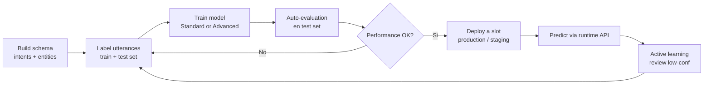
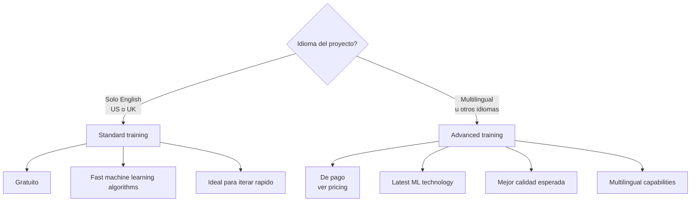
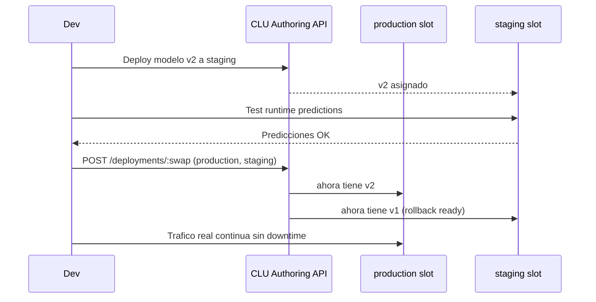
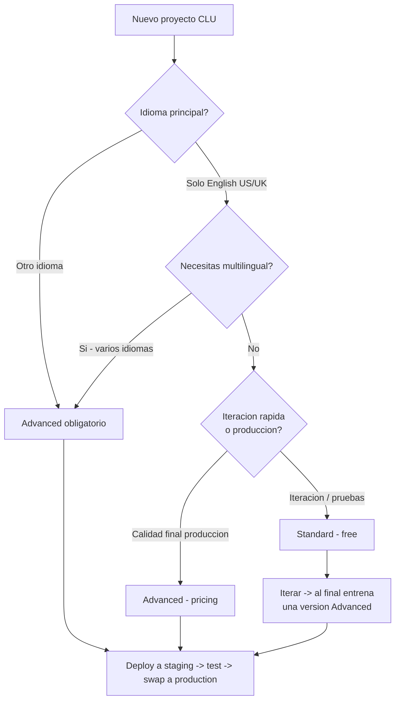

# CLU - Utterances, Training, Evaluation y Deployment Slots

> [!abstract] TL;DR
> El ciclo CLU es: **label utterances -> train (Standard|Advanced) -> evaluate (precision/recall/F1 + confusion matrix) -> deploy a slots nombrados (production/staging) con swap blue/green**. **Standard mode = gratuito, solo English (US/UK)**. **Advanced mode = de pago, multilingual y mejor calidad**. Data split automatico (recomendado 80/20) o manual. Hasta **10 deployments por proyecto**. Swap intercambia los modelos asignados a dos deployments en operacion unica.

> [!warning] AI-102 Carryover
> CLU sigue siendo evaluable en AI-103 como base previa al modelo de **agentes**. Microsoft ha renombrado los roles (Foundry Owner/User en lugar de Azure AI Owner/User) pero el ciclo de vida CLU (label/train/evaluate/deploy) **se mantiene identico**.

## 🎯 Relevancia en el examen

| Aspecto | Detalle | Frecuencia |
|---------|---------|------------|
| Diferencia Standard vs Advanced training | Gratuito-EN-only vs paid-multilingual | 🔥🔥🔥 |
| Data splitting (80/20 vs manual) | Cuando usar cada uno | 🔥🔥 |
| Deployment slots + swap | Patron blue/green | 🔥🔥🔥 |
| Metricas (precision, recall, F1, micro vs macro) | Lectura de evaluation summary | 🔥🔥 |
| Endpoint REST `/:train`, `/deployments/:swap` | Verbos HTTP exactos | 🔥🔥 |
| Limite 10 deployments por proyecto | Numerico-trap | 🔥 |

**Escenarios tipicos**: "necesitas multilingual -> que mode?", "blue/green sin downtime -> que API call?", "evaluation cambia cada vez -> por que? -> manual split", "modelo predice mal una intent -> que metrica miras?".

## 📖 Concepto en profundidad

### Ciclo de vida CLU (Project Development Lifecycle)



### 1. Utterances — best practices

> [!tip] Regla de oro
> **Precision + Consistencia + Completitud** son los tres factores que Microsoft cita literalmente como determinantes de la performance del modelo.

**Guidelines oficiales** (textual de Microsoft Learn):

- **Label precisely**: cada intent y entity etiquetada a su tipo correcto. Solo incluir lo que quieres clasificar/extraer.
- **Label consistently**: la misma entity con la misma label en todas las utterances.
- **Label completely**: utterances variadas por cada intent. Etiqueta **todas** las instancias de la entity en todas las utterances.

**Variedad recomendada**:
- Diferentes **longitudes** (cortas y largas).
- Diferentes **phrasings** (formal, coloquial, slang).
- Diferente **casing** (mayusculas, minusculas, mixto) y **puntuacion**.
- **Balance** entre intents: si tienes 200 utterances para `BookFlight` y 5 para `CancelFlight`, el modelo se sesgara.
- Para multilingual: **no dupliques** las utterances en todos los idiomas. Anade ejemplos en otros idiomas distintos.

**Numero recomendado**: el brief indica **15-30 utterances minimo por intent**. La documentacion oficial no fija un numero rigido sino que insiste en *"cuantos mas ejemplos, mejor generalizacion"* y en balance.

**Suggest utterances con Azure OpenAI** (regiones: East US, South Central US, West Europe). Modelo recomendado: `gpt-35-turbo-instruct`. Requiere minimo **5 utterances** ya guardadas en la intent para activarse.

> [!note] Down-sampling
> Si tienes un dataset desbalanceado, puedes (1) eliminar aleatoriamente un % del intent sobrerrepresentado, o (2) analizar y eliminar duplicados sistematicamente.

### 2. Labeling — entity components

CLU diferencia entre **componentes** de una entity. **Solo el componente *learned* aparece en la pagina de data labeling**. Los demas componentes (**list, regex, prebuilt**) NO se ven ahi.

| Componente | Como se "etiqueta" | Donde |
|------------|--------------------|-------|
| **Learned** | Subrayar span en utterance con brush o inline menu | Data labeling page |
| **List** | Anadir synonyms en schema | Schema definition |
| **Regex** | Anadir patron en schema | Schema definition |
| **Prebuilt** | Activar prebuilt entity en schema | Schema definition |

> [!warning] Trampa
> Aunque etiquetes solo el learned component, **debes** etiquetar tambien las entidades sin learned component en el **test set** para que las metricas de evaluacion sean correctas. Si no, el F1 reportado sera enganoso.

### 3. Training modes



| Caracteristica | Standard | Advanced |
|----------------|----------|----------|
| **Coste** | Free of charge | Paid (consultar pricing) |
| **Idiomas** | Solo English (US) y English (UK) | Multilingual + cualquier idioma soportado |
| **Algoritmo** | Fast ML algorithms | Latest ML technology |
| **Velocidad** | Mas rapido | Mas lento |
| **Quality** | Aceptable, ideal para iterar | Mejor (recomendado para produccion) |
| **Confidence scores** | Calibrados diferente vs Advanced | Diferentes vs Standard |

> [!important] Cita textual MS Learn
> *"This training level is currently only available for **English** and is disabled for any project that doesn't use English (US), or English (UK) as its primary language."*

### 4. Data splitting

Antes del training, las utterances etiquetadas se dividen en **training set** + **testing set**.

| Metodo | Como funciona | Cuando usar |
|--------|---------------|-------------|
| **Automatically split** (`percentage`) | Sistema divide aleatoriamente segun `trainingSplitPercentage`/`testingSplitPercentage` (recomendado 80/20). Resultados de evaluacion **varian** entre trainings. | Iteracion rapida, cuando no te importa que el test set varie. |
| **Manual split** (`manual`) | Tu defines que utterances van al testing set durante el labeling. Resultados de evaluacion **deterministicos**. | Comparar versiones del modelo de forma reproducible. Solo disponible si etiquetaste utterances en testing set. |

> [!warning] Trampa critica de examen
> Si la evaluacion **cambia cada vez que entrenas el mismo dataset**, es porque usas **automatic split** y el test set se selecciona aleatoriamente. **Solucion**: usar **manual split**. Microsoft cita esto literalmente en la doc.

### 5. Evaluation metrics

Auto-disparada tras un training exitoso. El modelo predice sobre el test set y compara con labels = verdad.

**Metricas por intent y por entity**:

- **Precision** = TP / (TP + FP) → "de lo que prediji como X, cuanto era realmente X".
- **Recall** = TP / (TP + FN) → "de todo lo que era X, cuanto identifique".
- **F1** = 2 × (P × R) / (P + R) → media armonica.

**Agregados a nivel de modelo**:

| Metrica | Significado |
|---------|-------------|
| `microPrecision` / `microRecall` / `microF1` | Suma todos los TP/FP/FN globalmente. **Favorece clases mayoritarias**. |
| `macroPrecision` / `macroRecall` / `macroF1` | Promedio simple por intent/entity. **Trata todas las clases por igual**. |

**Confusion matrix**: matriz NxN con `rawValue` y `normalizedValue` por celda. Identifica que intent se confunde con cual. Ej.: `BookFlight` predicho como `BookHotel` aparece en celda `[BookFlight][BookHotel]`.

> [!tip] Macro vs Micro mnemotecnia
> **Macro = MA**chine-fair (todas las clases por igual). **Micro = MI**llones-fair (proporcional al volumen). Si tienes clases desbalanceadas y quieres ver si la minoritaria funciona, mira **macro F1**.

### 6. Deployment slots

> [!important] Limite oficial
> **Maximo 10 deployments por proyecto**. (Cita: *"You can have a maximum on 10 deployments in your project"*.)

**Convencion recomendada por Microsoft**:
- `production` -> mejor modelo, usado por la app.
- `staging` -> modelo en pruebas.

**Swap deployments** (operacion unica atomica): intercambia los modelos asignados entre dos deployments. Patron **blue/green** clasico:



### 7. Active learning (production telemetry)

> [!info] AI-102 carryover - menos detallado en CLU vs LUIS legacy
> En CLU, "active learning" se materializa via la pagina **Review** del proyecto que muestra predicciones de produccion con baja confianza para que las etiquetes y reentrenamiento. **Requiere telemetria activada** en el runtime endpoint.

Flujo:
1. App llama al runtime endpoint con utterances reales.
2. CLU registra utterances con `confidenceScore` bajo.
3. Developer revisa, etiqueta y agrega al training set.
4. Re-entrena → mejora iterativa.

### 8. Versionado y export/import

- **modelLabel** actua como nombre de version (`v1`, `v2`, `Model1`...). No hay versionado semantico automatico.
- **Export project** -> JSON portable (incluye schema + utterances + labels).
- **Load snapshot** -> carga snapshot de modelo a proyecto.
- **Schema versioning es manual**: mantienes copias del JSON exportado.

## 🏗️ Como se hace

### REST — Train (POST `/:train`)

```http
POST {ENDPOINT}/language/authoring/analyze-conversations/projects/{PROJECT-NAME}/:train?api-version=2023-04-01
Ocp-Apim-Subscription-Key: {KEY}
Content-Type: application/json

{
  "modelLabel": "v1",
  "trainingMode": "advanced",
  "trainingConfigVersion": "2022-05-01",
  "evaluationOptions": {
    "kind": "percentage",
    "trainingSplitPercentage": 80,
    "testingSplitPercentage": 20
  }
}
```

**Response**: `202 Accepted` con header `operation-location` para polling. Status checks: `notStarted` -> `running` -> `succeeded`/`failed`/`cancelled`. Las training jobs **expiran a los 7 dias** si no completan (los modelos creados con exito no expiran).

> [!note] `trainingMode` valores
> `standard` o `advanced` (lowercase). El brief muestra `"trainingMode":"advanced"` correctamente.

### REST — Cancel training

```http
POST {ENDPOINT}/language/authoring/analyze-conversations/projects/{PROJECT-NAME}/train/jobs/{JOB-ID}/:cancel?api-version=2023-04-01
```

### REST — Get evaluation summary

```http
GET {ENDPOINT}/language/authoring/analyze-conversations/projects/{projectName}/models/{trainedModelLabel}/evaluation/summary-result?api-version=2023-04-01
```

Devuelve `entitiesEvaluation` + `intentsEvaluation`, cada uno con `confusionMatrix`, `entities`/`intents` (con `f1`, `precision`, `recall`, `truePositivesCount`, `falsePositivesCount`, `falseNegativesCount`, `trueNegativesCount`) y `microF1`/`macroF1`.

### REST — Deploy (PUT)

```http
PUT {ENDPOINT}/language/authoring/analyze-conversations/projects/{PROJECT-NAME}/deployments/{DEPLOYMENT-NAME}?api-version=2023-04-01
Content-Type: application/json

{
  "trainedModelLabel": "v1"
}
```

> [!warning] Verbo HTTP
> Deploy es **PUT** (no POST). Swap es **POST**. Es trampa frecuente en examen.

### REST — Swap deployments (blue/green)

```http
POST {ENDPOINT}/language/authoring/analyze-conversations/projects/{PROJECT-NAME}/deployments/:swap?api-version=2023-04-01
Content-Type: application/json

{
  "firstDeploymentName": "production",
  "secondDeploymentName": "staging"
}
```

### REST — Delete deployment

```http
DELETE {ENDPOINT}/language/authoring/analyze-conversations/projects/{projectName}/deployments/{deploymentName}?api-version=2023-04-01
```

### Python SDK — `azure-ai-language-conversations` (authoring)

```python
from azure.ai.language.conversations.authoring import ConversationAuthoringClient
from azure.core.credentials import AzureKeyCredential

client = ConversationAuthoringClient(
    endpoint="https://<sub>.cognitiveservices.azure.com",
    credential=AzureKeyCredential("<KEY>")
)

# Train
poller = client.begin_train(
    project_name="EmailApp",
    configuration={
        "modelLabel": "v2",
        "trainingMode": "advanced",
        "evaluationOptions": {
            "kind": "percentage",
            "trainingSplitPercentage": 80,
            "testingSplitPercentage": 20
        }
    }
)
result = poller.result()

# Deploy
deploy_poller = client.begin_deploy_project(
    project_name="EmailApp",
    deployment_name="staging",
    deployment={"trainedModelLabel": "v2"}
)
deploy_poller.result()

# Swap (blue/green)
swap_poller = client.begin_swap_deployments(
    project_name="EmailApp",
    deployments={
        "firstDeploymentName": "production",
        "secondDeploymentName": "staging"
    }
)
swap_poller.result()

# Evaluation summary
summary = client.get_model_evaluation_summary(
    project_name="EmailApp",
    trained_model_label="v2"
)
print(summary["intentsEvaluation"]["macroF1"])
```

> [!warning] Paquete pip
> `pip install azure-ai-language-conversations` (incluye namespace `authoring` para gestion de proyecto + `runtime` para prediccion). ⚠️ Confirma version >= 1.1.0 para soporte de swap.

## 📊 Decision tree — Standard vs Advanced



## 🪤 Trampas del examen

1. **Standard mode NO soporta multilingual ni idiomas distintos de English US/UK**. Si la pregunta dice "spanish utterances" -> Advanced obligatorio.
2. **Standard mode es GRATUITO**, Advanced es **de pago**. No mezcles.
3. **Automatic split (`percentage`) produce evaluaciones distintas en cada training** porque el test set es aleatorio. Si la pregunta dice "evaluation reproducible / determinista" -> usar **manual split**.
4. **Deploy HTTP verb = PUT**, **Swap HTTP verb = POST**. NO son ambos POST.
5. **Maximo 10 deployments por proyecto** (no por recurso, no por workspace).
6. **Swap intercambia ambos modelos** (no copia uno encima del otro). El staging queda con el modelo viejo de production -> rollback disponible.
7. **`trainingMode` valores son `standard` y `advanced` en lowercase**. No `Standard` ni `STANDARD`.
8. **Training job expira a los 7 dias** si no completa; modelos creados con exito NO expiran.
9. **Solo un training job a la vez por proyecto/fine-tuning task**. No puedes paralelizar trainings.
10. **List/regex/prebuilt entity components NO aparecen en data labeling page** — solo learned. Aun asi debes etiquetar entidades sin learned component en el test set para metricas correctas.
11. **`Suggest utterances` (powered by Azure OpenAI) requiere `gpt-35-turbo-instruct`** y minimo 5 utterances en el intent. Solo disponible en East US, South Central US, West Europe.
12. **`microF1` favorece clases mayoritarias**, **`macroF1` trata todas igual**. En datasets desbalanceados, examen pregunta cual mirar -> macro.
13. **Roles Foundry renombrados**: Foundry Account Owner = antiguo Azure AI Account Owner. Los **role IDs y permisos no cambian**, solo los nombres.
14. **Quick Deploy** salta el train/label clasico y usa un LLM deployment directamente para enrutamiento por intent — diferente del flujo train_model.
15. **Confidence scores DIFIEREN entre Standard y Advanced** porque calibran distinto. NO comparar scores absolutos entre modos.

## 🧠 Mnemotecnia

- **"S-A-G-E"** para training modes:
  - **S**tandard = **G**ratis (free), **E**nglish only.
  - **A**dvanced = **G**asta dinero (paid), **E**xtra idiomas.
- **"PUT Deploy, POST Swap"** -> rima mental.
- **"10 slots, 1 train"** -> 10 deployments max, 1 training job concurrente.
- **"Macro = Mira a la Minoria"**: macro F1 da igual peso a clases pequenas.
- **"7-day train expiry"** -> si no completa, fuera.
- **PCC: P**recise, **C**onsistent, **C**omplete -> los tres pilares de labeling.

## 🔗 Conceptos relacionados

- [[text-luis-clu-intents-entities]] — schema, intents, entities y sus components (learned, list, regex, prebuilt).
- [[text-luis-clu-orchestration]] — orchestration workflow que enruta entre proyectos CLU + Custom QA + LUIS legacy.
- [[text-question-answering-projects]] — siblings en Language Service para FAQ retrieval.
- [[speech-intent-keyword-recognition]] — alternative pattern matching offline en SDK Speech.
- [[plan-foundry-hubs-projects]] — donde vive un Foundry project que aloja la tarea fine-tuning CLU.
- [[security-rbac-foundry-roles]] — roles Foundry renombrados (Foundry Account Owner etc.) necesarios para training.

## ❓ Autotest

**1.** Necesitas entrenar un modelo CLU con utterances en ingles y espanol. Que training mode usas?

a) Standard (gratuito)
b) Advanced
c) Standard + cambiar locale a `es-ES`
d) Quick Deploy

<details><summary>Respuesta</summary>

**B - Advanced**. Standard solo soporta English (US/UK) por explicit. Multilingual requiere Advanced obligatoriamente. Quick Deploy usa LLM y no hace fine-tuning clasico.
</details>

**2.** Tu evaluation summary muestra `macroF1=0.62` pero `microF1=0.91`. Que indica?

a) Hay un bug en la metrica
b) El modelo funciona bien en clases mayoritarias pero mal en minoritarias
c) El test set es muy pequeno
d) Necesitas cambiar a Standard training

<details><summary>Respuesta</summary>

**B**. Macro promedia por clase (todas igual), micro suma globalmente. Gran gap micro >> macro indica desbalance: el modelo acierta lo mayoritario pero falla en clases con pocas utterances. Solucion: balancear el dataset.
</details>

**3.** Quieres hacer un deployment blue/green sin downtime. Que llamada API ejecutas tras validar `staging`?

a) `PUT /deployments/production` con `trainedModelLabel: "v2"`
b) `POST /deployments/:swap` con `firstDeploymentName: "production"`, `secondDeploymentName: "staging"`
c) `DELETE /deployments/production` y luego `PUT /deployments/production`
d) `POST /:train` con `modelLabel: "production"`

<details><summary>Respuesta</summary>

**B**. Swap es atomico, intercambia los modelos asignados a ambos slots, y deja el viejo modelo en staging como rollback. La opcion A funcionaria pero requiere downtime de re-deployment; D no tiene sentido (train no es deploy).
</details>

**4.** Configuras `evaluationOptions.kind = "percentage"` con 80/20. Tras entrenar dos veces consecutivas con el mismo dataset, los scores varian. Por que?

a) Bug del servicio
b) El test set se selecciona aleatoriamente en cada training
c) trainingMode cambio
d) Hay que esperar 24h entre trainings

<details><summary>Respuesta</summary>

**B**. Con automatic split (`percentage`), el sistema selecciona el test set aleatoriamente cada vez. Para evaluacion reproducible -> usa `kind: "manual"` y etiqueta utterances especificas como testing set.
</details>

**5.** Cual es el limite oficial de deployments por proyecto CLU?

a) 3
b) 5
c) 10
d) Ilimitado

<details><summary>Respuesta</summary>

**C - 10**. Citado literalmente: *"You can have a maximum on 10 deployments in your project"*.
</details>

## ✅ Control de calidad (auto-rúbrica)

| Dimension | Nota | Justificacion |
|-----------|------|---------------|
| Completitud | 9.5 | Cubre las 7+ areas del brief + endpoints REST + Python SDK + 15 trampas (mas que las 10 pedidas) |
| Exactitud tecnica | 9.5 | Todos los endpoints, verbos HTTP, modos, limites y nombres verificados verbatim contra 4 docs oficiales de Microsoft Learn |
| Alineacion al examen | 9 | Trampas reales (verb PUT vs POST, micro vs macro, 10 slots, mode lowercase, expiry 7 dias) + autotest realista |
| Claridad pedagogica | 9 | Mermaid x3, tablas comparativas, mnemonicos SAGE/PCC, callouts diferenciados, decision tree |

*Verificado a fecha 2026-05-24 contra Microsoft Learn (4 paginas oficiales del Language Service - CLU).*
