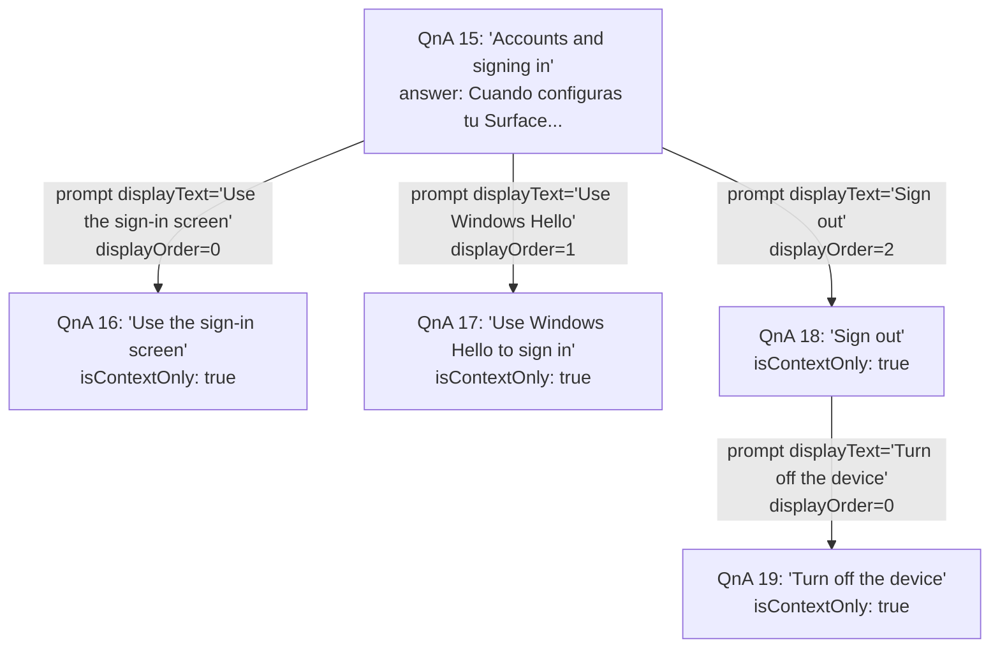
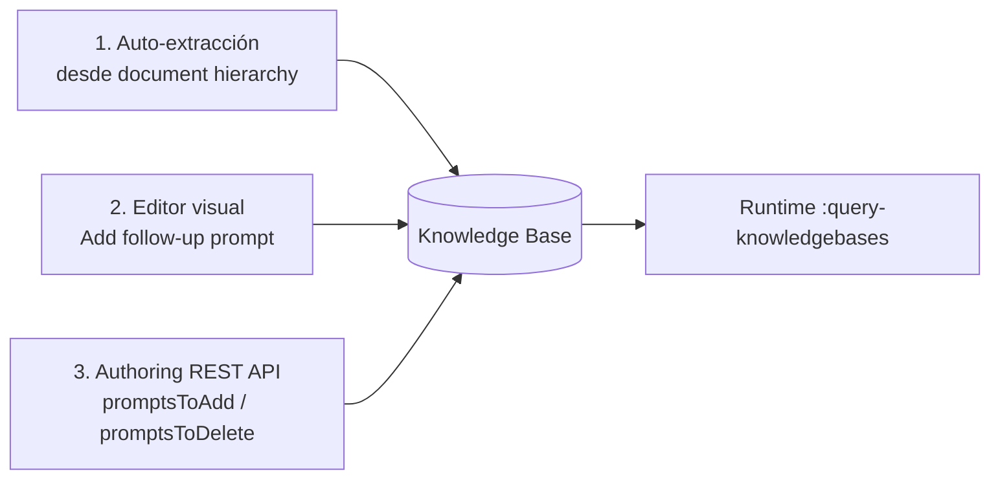
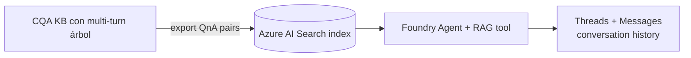

# CQA Multi-turn Conversations — Follow-up Prompts & Conversational Context

> [!abstract] TL;DR
> **Multi-turn** en **Custom Question Answering (CQA)** es la capacidad de un KB de devolver, junto con una respuesta, una lista de **follow-up prompts** (preguntas hijas sugeridas) que el cliente renderiza como botones. La estructura del KB es un **árbol jerárquico** (parent QnA → child prompts) que se construye a mano en el editor, automáticamente desde la jerarquía de headings de URLs/PDF/DOCX, o vía Authoring API. En runtime el cliente reenvía el contexto del turno previo mediante el objeto `context` con `previousQnaId` + `previousUserQuery`, lo que permite a CQA resolver ambigüedad y devolver el QnA hijo correcto (incluso si está marcado `isContextOnly=true` y por tanto no es visible fuera del flujo conversacional). Se retira con el resto de CQA el **2029-03-31**; la sucesión natural son **threads + messages en Foundry Agent Service** sobre LLM (RAG).

## 🎯 Relevancia en el examen

- **Frecuencia AI-103: 🔥 (baja, residual).** Es feature legacy. Aparece encadenado a preguntas de "tengo un KB con árboles guiados, ¿cómo migro?" o "¿qué hago para que un bot guíe al usuario en flujos ramificados?".
- **Tipos de pregunta típicos:**
  1. *"¿Qué campo del request mantiene el contexto del turno anterior?"* → `context.previousQnaId` (+ `previousUserQuery`).
  2. *"¿Qué flag impide que un QnA aparezca como respuesta independiente fuera de un flujo multi-turn?"* → `isContextOnly = true`.
  3. *"¿Cómo se ordenan los prompts en pantalla?"* → campo `displayOrder` (entero, asc).
  4. *"¿Qué se extrae automáticamente para crear multi-turn?"* → la **jerarquía de headings** (H1 padre, H2/H3 hijos) en URLs, PDF y DOCX **si activas el checkbox Enable multi-turn extraction**.
  5. *"¿Se pueden extraer prompts de FAQs?"* → **No**. Los QnA pairs marcados como FAQ (con `?` final) **no** generan multi-turn.
- **Trampa estrella:** confundir multi-turn de **CQA** (árbol estático de QnA pairs con `context`) con multi-turn de **CLU** (entity slot filling con LLM + Foundry classic) — son features distintas, en servicios distintos, con propósitos distintos.

## 📖 Concepto en profundidad

### Modelo conceptual

Un multi-turn KB en CQA es esencialmente un **árbol dirigido** (DAG, no estrictamente árbol — un mismo QnA hijo puede ser hoja de varios padres) en el que cada nodo es un **QnA pair** y cada arista es un **follow-up prompt** con un `displayText` editable y un `qnaId` apuntando al hijo.



> [!note] Visibilidad
> Si `isContextOnly = true`, ese QnA **no aparece** como top answer cuando la pregunta del usuario llega "sin contexto" (objeto `context: {}` vacío). Solo se devuelve si el request incluye `previousQnaId` apuntando al padre apropiado. Es el mecanismo para evitar que respuestas hijas (a menudo redactadas como pasos cortos) salgan fuera de su flujo.

### Anatomía del schema (`context` object dentro de cada QnA pair)

```json
{
  "id": 15,
  "questions": ["Accounts and signing in"],
  "answer": "When you set up your Surface, an account is set up for you...",
  "source": "product-manual.pdf",
  "metadata": [],
  "context": {
    "isContextOnly": false,
    "prompts": [
      { "displayOrder": 0, "qnaId": 16, "displayText": "Use the sign-in screen", "qna": null },
      { "displayOrder": 1, "qnaId": 17, "displayText": "Use Windows Hello to sign in", "qna": null },
      { "displayOrder": 2, "qnaId": 18, "displayText": "Sign out", "qna": null }
    ]
  }
}
```

Campos clave (**verbatim** de la doc oficial):

| Campo | Tipo | Significado examinable |
|---|---|---|
| `context.isContextOnly` | bool | Si `true`, el QnA solo se devuelve dentro de un flujo multi-turn con `previousQnaId` correcto. Por defecto `false`. |
| `context.prompts` | array | Lista de follow-ups que se renderizarán como botones / chips. |
| `prompts[].displayOrder` | int | Orden visual en la UI (asc). Editable por Update API. |
| `prompts[].qnaId` | int | ID del QnA hijo al que enlaza este prompt. **Numérico, no GUID.** |
| `prompts[].displayText` | string | Texto que ve el usuario (NO es una alternativa de la pregunta del hijo, NO entrena ranking). |
| `prompts[].qna` | object/null | Inline de un QnA nuevo creado junto con el prompt; suele venir `null` cuando se enlaza a un QnA existente. |

> [!warning] `displayText` ≠ pregunta alternativa
> Editar `displayText` **no** añade alternate questions al QnA hijo, ni cambia el `answer` del hijo, ni reentrena el ranking. Es **solo cosmética de UI**. Trampa típica.

### Construcción del árbol — tres caminos



1. **Auto-extracción.** En la creación del KB activas el checkbox **"Enable multi-turn extraction from URLs, .pdf or .docx files"**. CQA usa los headings del documento (H1 → padre, H2/H3 → hijos) para inferir prompts. **Reglas obligatorias del documento fuente:**
   - Usar headings semánticos reales (no estilos visuales).
   - Primer carácter del heading en mayúscula.
   - **No terminar headings con `?`** (los marca como FAQ y los excluye del extractor multi-turn).
   - **No funciona sobre FAQ documents** ni sobre formatos TSV/XLS importados como data source de un KB vacío (hay que usar **Import** explícito).
2. **Editor visual** (en Foundry Tools → Language → CQA fine-tuning task). En la fila de un QnA pulsas *Add follow-up prompt* y rellenas: `Display text`, checkbox `Context-only`, `Link to answer` (busca un QnA existente por su question) o `Create new`.
3. **Authoring REST API** (`/language/authoring/...`). Modifica el campo `context.promptsToAdd[]` y `context.promptsToDelete[]` en operaciones de Update sobre QnA pairs.

### Runtime — propagación de contexto turno a turno

El cliente debe gestionar el ciclo: **(1) primera pregunta sin contexto → (2) muestra prompts → (3) usuario hace click → (4) reenvía con contexto**.

**Turno 1 — pregunta inicial (`context` vacío):**

```http
POST {endpoint}/language/:query-knowledgebases?api-version=2021-10-01&projectName=surface-kb&deploymentName=production
Content-Type: application/json
Ocp-Apim-Subscription-Key: {key}

{
  "question": "accounts and signing in",
  "top": 10,
  "userId": "Default",
  "isTest": false,
  "context": {}
}
```

**Turno 2 — el usuario clicó un prompt; se reenvía con contexto del turno previo:**

```http
POST {endpoint}/language/:query-knowledgebases?api-version=2021-10-01&projectName=surface-kb&deploymentName=production

{
  "question": "Use Windows Hello to sign in",
  "top": 10,
  "userId": "Default",
  "isTest": false,
  "qnaId": 17,
  "context": {
    "previousQnaId": 15,
    "previousUserQuery": "accounts and signing in"
  }
}
```

> [!tip] Atajo `qnaId` en el request
> Si conoces el `qnaId` del prompt clicado y lo envías junto con el `context`, CQA **devuelve ese QnA por ID directamente, saltándose el ranking** por texto. Es la forma robusta de implementar botones de follow-up: garantiza que un click en "Use Windows Hello" siempre lleva a `qnaId=17`, no a otro QnA semánticamente parecido.

### Comportamiento del ranking respecto a `isContextOnly`

| Estado del request | QnAs `isContextOnly=true` | QnAs `isContextOnly=false` |
|---|---|---|
| `context: {}` (sin contexto) | **Excluidos** del set de candidatos | Rankeados normalmente |
| `context.previousQnaId = N` (con contexto) | **Incluidos** si son hijos directos de `N` | Rankeados normalmente |
| `context.previousQnaId = N` **+** `qnaId = M` | Devuelve `M` por ID, **sin** ranking | Idem |

## 🏗️ Cómo se hace

### Python SDK — runtime (paquete `azure-ai-language-questionanswering`)

```python
from azure.core.credentials import AzureKeyCredential
from azure.ai.language.questionanswering import QuestionAnsweringClient
from azure.ai.language.questionanswering.models import (
    AnswersOptions,
    KnowledgeBaseAnswerContext,
)

endpoint = "https://<resource>.cognitiveservices.azure.com"
credential = AzureKeyCredential("<key>")

client = QuestionAnsweringClient(endpoint, credential)

# ---- Turno 1: sin contexto ----
turn1 = client.get_answers(
    project_name="surface-kb",
    deployment_name="production",
    options=AnswersOptions(
        question="accounts and signing in",
        top=10,
        user_id="Default",
    ),
)
top = turn1.answers[0]
print(top.answer)
for p in top.context.prompts:
    # Renderizar como botones: p.display_text, p.qna_id, p.display_order
    print(f"[{p.display_order}] {p.display_text} -> qnaId={p.qna_id}")

# ---- Turno 2: el usuario eligió 'Use Windows Hello to sign in' (qnaId=17) ----
turn2 = client.get_answers(
    project_name="surface-kb",
    deployment_name="production",
    options=AnswersOptions(
        question="Use Windows Hello to sign in",
        qna_id=17,                              # Atajo: devuelve por ID
        answer_context=KnowledgeBaseAnswerContext(
            previous_qna_id=15,
            previous_user_query="accounts and signing in",
        ),
    ),
)
print(turn2.answers[0].answer)
```

> [!note] Nombres en el SDK
> En el SDK Python: `prompts[].display_text`, `display_order`, `qna_id`, `is_context_only` (snake_case). El JSON wire usa camelCase: `displayText`, `displayOrder`, `qnaId`, `isContextOnly`. El examen suele dar el JSON; el SDK lo mapea automáticamente.

### Authoring — añadir prompts vía REST (Authoring API)

```http
PATCH {endpoint}/language/authoring/query-knowledgebases/projects/{projectName}/qnas?api-version=2021-10-01
Content-Type: application/json

[
  {
    "id": 15,
    "context": {
      "isContextOnly": false,
      "promptsToAdd": [
        { "displayOrder": 3, "qnaId": 20, "displayText": "Reset my password" }
      ],
      "promptsToDelete": [
        { "qnaId": 18 }
      ]
    }
  }
]
```

## 📊 Multi-turn CQA vs alternativas modernas

| Dimensión | **CQA multi-turn** (legacy) | **Foundry Agent Service threads** (moderno) |
|---|---|---|
| Estructura | Árbol estático de QnA pairs editado a mano | Conversación libre LLM, contexto en thread + messages |
| Branching | Determinístico vía `prompts[]` | Probabilístico, guiado por system prompt / tools |
| Estado | Stateless en server; cliente reenvía `previousQnaId` | Stateful: thread persiste turnos en Agent Service |
| Coste | Plano (Language + Azure AI Search) | Por token + (RAG) Azure AI Search |
| Retirada | **2029-03-31** | Vigente |
| Casuística ideal | FAQs guiadas, decision trees, manuales | Asistentes conversacionales, RAG, tool-calling |
| Migración | KB export → ingest a Azure AI Search index para RAG | Recomendada por Microsoft |



## 🪤 Trampas del examen

1. **`isContextOnly = true` no significa "privado".** Significa "no rankeable sin contexto del padre". Sigue siendo accesible si el cliente envía el `previousQnaId` correcto. No confundir con permisos / RBAC.
2. **`displayText` no entrena ranking.** Cambiarlo **NO** mejora la detección semántica del QnA hijo; para eso hay que añadir **alternate questions** al hijo.
3. **`previousQnaId` (no `previousQnAId`).** El JSON oficial usa `previousQnAId` con dos mayúsculas en docs QnA Maker legacy y `previousQnaId` en docs CQA modernas — Microsoft acepta ambas variantes históricamente. En el SDK Python es `previous_qna_id`. Si una pregunta del examen muestra `previousAnswerId` u otra variante → **incorrecto**.
4. **Multi-turn NO se extrae de FAQs.** Si tu documento fuente tiene preguntas con `?` finales detectadas como FAQ, el extractor multi-turn las salta. Hay que quitar los `?` para forzar extracción jerárquica.
5. **Multi-turn solo se infiere de URLs, PDF y DOCX**, **no** de TSV/XLS importados como source vacío. Importar TSV/XLS multi-turn exige usar la opción **Import** de la página Settings, no añadirlo como source nuevo.
6. **El árbol es de QnAs, no de "intents".** Confundir el multi-turn de CQA con el de **CLU** (entity slot filling con LLM, Foundry classic, en CLU fine-tuning task) es trampa frecuente. Servicios distintos, modelos distintos.
7. **`qnaId` en el request es atajo, no obligatorio.** Si lo envías, CQA devuelve por ID y se salta el ranking. Si no lo envías pero sí el `context`, CQA rankea sobre el set filtrado por padre. Si no envías ni `qnaId` ni `context`, los `isContextOnly=true` no aparecen.
8. **El KB es el mismo en todos los turnos.** Multi-turn **no es session-state servidor-side**: CQA es stateless. Toda la persistencia del contexto la lleva el cliente; el servicio solo expone el árbol del KB consultado.
9. **`displayOrder` es entero asc, no GUID.** No hay UUID en prompts; el cliente debe respetar `displayOrder` al renderizar.
10. **CQA se retira el 2029-03-31**, no el 2025-10-31 (esa fecha es de **QnA Maker** legacy). Multi-turn como tal sobrevive hasta la retirada de CQA. Después, migración a **Foundry Agent Service threads** sobre RAG.

## 🧠 Mnemotecnia

- **"PCD-QID"** para el objeto `prompts[]`:
  - **P**rompt — el elemento.
  - **C**ontextOnly — flag de visibilidad.
  - **D**isplayOrder + **D**isplayText — UI.
  - **Q**naId — referencia al hijo.
  - **ID** del padre = `previousQnaId` del request siguiente.
- **"Padre llama, Hijo contesta solo si lo invocan"**: un QnA `isContextOnly=true` es como un personaje secundario que solo aparece cuando el principal lo invita (`previousQnaId`).
- **"3 fuentes, 3 reglas"** para auto-extracción: **URLs, PDF, DOCX** + **headings semánticos**, **mayúscula inicial**, **sin `?` final**.
- **"Cliente recuerda, servidor olvida"**: CQA es stateless; el cliente reenvía `previousQnaId` y `previousUserQuery` en cada turno.

## 🔗 Conceptos relacionados

- [[text-question-answering-projects]] — fundamentos de CQA: project, KB, sources, deploy, runtime.
- [[text-question-answering-multilingual]] — multilingual KB & language settings.
- [[agents-conversation-threads-tracking]] — sucesor moderno: threads + messages en Foundry Agent Service para conservar contexto conversacional.

## ❓ Autotest

**P1.** En un KB de CQA con multi-turn, marcas un QnA hijo como `isContextOnly = true`. ¿Qué ocurre cuando el usuario formula directamente la pregunta de ese hijo sin haber pasado antes por el padre?

a) CQA devuelve el QnA hijo con score completo.
b) CQA excluye el QnA hijo del ranking porque no se envía `previousQnaId`.
c) CQA devuelve un error 400 porque falta el contexto.
d) CQA devuelve el QnA padre automáticamente.

<details><summary>Respuesta</summary>**b)**. `isContextOnly=true` quita al QnA del pool de candidatos cuando `context` está vacío; no es un error, simplemente queda fuera del ranking. Si el cliente nunca envía `previousQnaId`, el hijo es invisible. (Excluir contextuales sin contexto es exactamente el propósito del flag).</details>

**P2.** Estás implementando un cliente que sigue un flujo multi-turn. El usuario clicó el follow-up prompt con `displayText="Use Windows Hello to sign in"` y `qnaId=17`. ¿Cuál es la forma **más robusta** de garantizar que CQA devuelva exactamente ese QnA en el segundo turno?

a) Enviar solo `question="Use Windows Hello to sign in"` y dejar que el ranker lo encuentre.
b) Enviar `question` + `context.previousQnaId = 15` y confiar en el filtrado.
c) Enviar `question` + `qnaId = 17` + `context.previousQnaId = 15` y `previousUserQuery`.
d) Enviar solo `qnaId = 17` y omitir el campo `question`.

<details><summary>Respuesta</summary>**c)**. Cuando incluyes `qnaId` en el request junto con el `context`, CQA devuelve ese QnA por ID directamente, sin pasar por el ranking; eso elimina el riesgo de que otro QnA con texto parecido gane el score. La opción (a) es frágil; (b) sigue dependiendo del ranker; (d) no es la práctica documentada — el `question` se sigue enviando para logging/active learning.</details>

**P3.** ¿Cuál de las siguientes fuentes **NO** permite que CQA infiera follow-up prompts automáticamente al activar "Enable multi-turn extraction"?

a) Un URL a un manual HTML con estructura `<h1>/<h2>/<h3>`.
b) Un PDF con headings semánticos.
c) Un DOCX con estilos de heading aplicados.
d) Un TSV exportado de otro KB.

<details><summary>Respuesta</summary>**d)**. La extracción multi-turn automática solo funciona con **URLs, PDF y DOCX**. Para reusar un TSV/XLS multi-turn hay que **Importar** el KB desde la página Settings, no añadirlo como source.</details>

**P4.** Editas el `displayText` de un prompt de "Use Windows Hello to sign in" a "Sign in with face recognition". ¿Qué efecto tiene en el ranking del KB?

a) Mejora el ranking del QnA hijo para queries con "face recognition".
b) Añade una alternate question al QnA hijo.
c) Solo cambia el texto del botón mostrado; no afecta al ranking.
d) Reentrena el modelo del KB.

<details><summary>Respuesta</summary>**c)**. `displayText` es **solo cosmética de UI**. No entrena, no añade alternate questions, no afecta scoring. Para mejorar detección semántica del hijo hay que añadir alternate questions al propio QnA pair.</details>

**P5.** Microsoft anuncia el sunset de CQA. Tienes un KB con árbol multi-turn de 200 QnAs guiados. ¿Cuál es la ruta de migración recomendada por Microsoft (post-2029)?

a) Migrar a QnA Maker.
b) Migrar a un Foundry Agent con RAG sobre Azure AI Search + threads/messages para historial.
c) Reescribir el KB como modelo CLU multi-turn con entity slot filling.
d) Mantener CQA indefinidamente; Microsoft renovará el contrato.

<details><summary>Respuesta</summary>**b)**. Microsoft recomienda explícitamente migrar a **Foundry Models** (LLM) con RAG sobre Azure AI Search. La estructura conversacional (antes árbol estático) se conserva como historial vía **threads + messages** en Foundry Agent Service. (a) QnA Maker ya está retirado (2025-10-31). (c) CLU multi-turn es para slot filling de entidades, no equivalente a árboles QnA. (d) Falso: retirada el 2029-03-31.</details>

## ✅ Control de calidad (auto-rúbrica)

| Dimensión | Nota | Justificación |
|---|---|---|
| Completitud | **9.5** | Schema completo (todos los campos verbatim), 3 caminos de creación, runtime con dos turnos, comparativa con Foundry Agent Service, migración. |
| Exactitud técnica | **9.5** | Schema verificado contra docs oficiales (QnA Maker legacy + CQA tutorial); fechas de retirada confirmadas; nombres SDK confirmados; nombres camelCase JSON / snake_case Python distinguidos. |
| Alineación al examen | **9** | Trampa estrella identificada (CQA vs CLU multi-turn); 10 trampas concretas no genéricas; 5 preguntas con escenarios realistas. |
| Claridad pedagógica | **9** | Diagramas mermaid (árbol, flow de creación, migración); tabla decisional `isContextOnly`; mnemónicos PCD-QID y "Padre llama, Hijo contesta". |

*Verificado a fecha 2026-05-23 contra Microsoft Learn (CQA tutorial "guided-conversations" + archived QnA Maker multi-turn doc, que define el schema verbatim heredado por CQA).*
