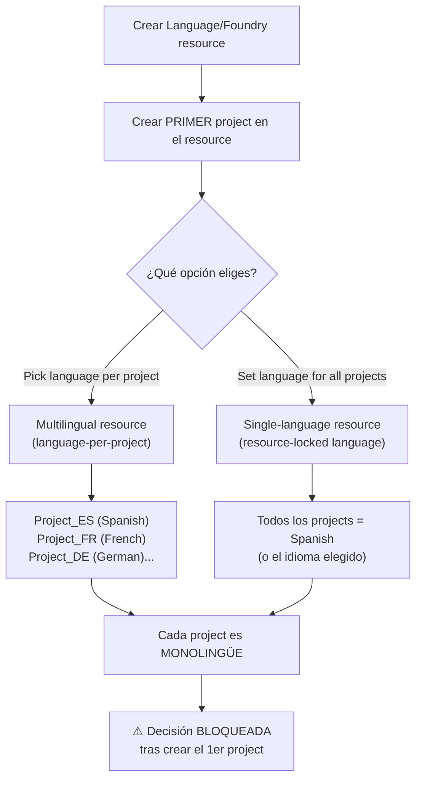
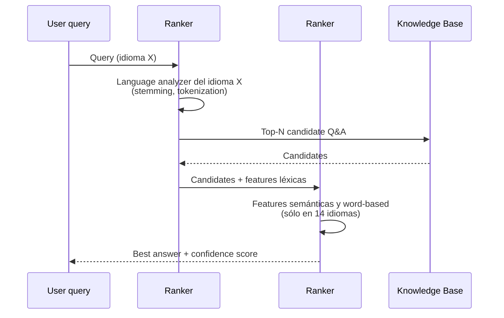
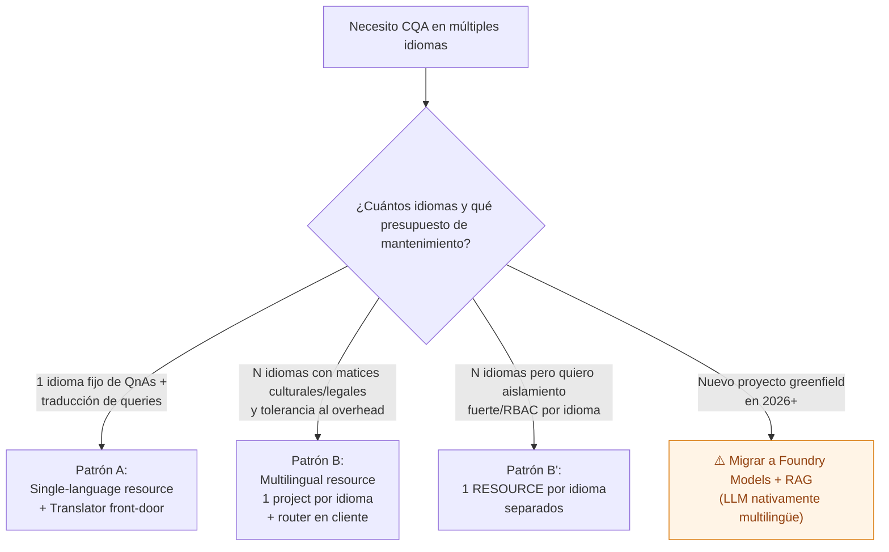

# Custom Question Answering (CQA) — Multi-language support y multilingual resource

> [!abstract] TL;DR
> En **Custom Question Answering (CQA)** la elección de idioma se hace **a nivel de resource**, **en el momento de crear el PRIMER project**, y queda **bloqueada para siempre**. Hay **dos modos**: (1) **single-language resource** → todos los projects futuros heredan el mismo idioma; (2) **multilingual resource** ("**pick language per project**") → cada project nuevo puede tener su propio idioma, **pero un project sigue siendo monolingüe** (Microsoft Learn lo dice verbatim: *"Do not mix languages in the same project"*). Para que **un único project** atienda consultas en varios idiomas hay **dos patrones oficiales**: (A) anteponer **Azure AI Translator** y traducir la query al idioma del KB; (B) **un resource + project por idioma** (más control, más coste de mantenimiento). El runtime tiene **dos rankers**: ranker #1 = Azure AI Search (language analyzers), ranker #2 = CQA semantic ranker, que funciona con features especiales sólo en **14 idiomas**. CQA se retira el **2029-03-31** → recomendación oficial: migrar a **Foundry Models + RAG** (nativamente multilingüe).

## 🎯 Relevancia en el examen

- **Frecuencia AI-103: 🔥 (muy baja, carryover residual de AI-102).** El examen ya no profundiza en CQA, pero **una pregunta-trampa típica** del banco AI-102 aún migrada es: *"You need to support FAQs in 5 languages with a single CQA knowledge base. What do you do?"* — y la respuesta correcta NO es "activar multilingüe en el project", sino **usar Translator** o **un resource/project por idioma**.
- **Tipos de pregunta:**
  - Cuándo elegir multilingual resource vs single-language resource.
  - Si la decisión es modificable post-creación (no lo es).
  - Cómo se hace que **un mismo project** acepte preguntas en varios idiomas (Translator front-door).
  - Por qué la calidad del ranker depende del idioma (lista de 14 idiomas con features semánticas).
- **Trampa estrella:** confundir *"multilingual resource"* (multi-proyecto, cada uno con su idioma) con *"multilingual project"* (no existe oficialmente).

## 📖 Concepto en profundidad

### 1. Dos niveles de elección de idioma



> [!warning] El malentendido más común
> **"Multilingual resource" ≠ "multilingual project"**. Lo que cambia es a qué nivel se elige el idioma:
> - **Single-language resource**: el idioma se decide UNA vez y todos los projects del resource lo heredan.
> - **Multilingual resource**: el idioma se decide POR project, **pero cada project sigue siendo monolingüe** y cada uno tendrá su propio test index.
>
> Cita verbatim de la doc (`language-support`): *"If you enable multiple languages for the project, then instead of having one test index for the service you will have one test index per project."* — fíjate que habla de "test index per project", **no** de "multilingual project".
>
> Y, además: *"Do not mix languages in the same project"* (description metadata de la propia página oficial).

### 2. Cómo conseguir que UN project sirva varios idiomas

La doc oficial (`language-support` → sección *"Supporting multiple languages in one project"*) lista **dos** y **sólo dos** patrones:

| Patrón | Cómo | Pros | Contras |
|---|---|---|---|
| **A — Translator front-door** | App → Translator (`translate` API) → query traducida al idioma del KB → CQA → respuesta traducida de vuelta | Una sola KB que mantener; calidad de QnAs centralizada en 1 idioma | Latencia extra, coste extra de Translator, pérdida sutil de matices, **dependencia de Translator** |
| **B — Resource+project por idioma** | Un Language/Foundry resource por idioma, cada uno con su propio project | Máxima calidad y matices nativos por idioma; alternate questions específicas | Coste alto de mantenimiento cuando cambian QnAs (hay que replicar en N idiomas), N endpoints distintos |

> [!info] Patrón no oficial pero común
> Algunas implementaciones combinan **multilingual resource** (un project por idioma) **+ language router** en el cliente: el cliente detecta el idioma de entrada y rutea al endpoint del project correspondiente. Esto es **equivalente** al patrón B en términos de mantenimiento, sólo cambia que comparten el mismo resource. No es un patrón documentado independientemente, pero es legítimo.

### 3. Los dos rankers — y por qué importa el idioma

CQA usa **doble ranker** en runtime:



- **Ranker #1 (Azure AI Search)**: cobertura amplia, paridad entre todos los idiomas soportados, porque depende de los language analyzers de Azure AI Search.
- **Ranker #2 (CQA semantic ranker)**: features especiales sólo en estos **14 idiomas** (verbatim de la doc): **Chinese, Czech, Dutch, English, French, German, Hungarian, Italian, Japanese, Korean, Polish, Portuguese, Spanish, Swedish**.
  - Para el resto de idiomas soportados, el ranker #2 sigue operando pero **sin features semánticas dedicadas**, así que la calidad relativa baja.

> [!tip] Regla mnemónica
> "**English best, big-14 great, the rest OK**". Si el examen pregunta por *quality varies per language*, la causa raíz es el ranker #2 y su lista de 14 idiomas con features semánticas.

### 4. Idiomas soportados (52 a fecha 2026-05)

> [!example]- Lista verbatim Microsoft Learn (click para expandir)
> Arabic · Armenian · Bangla · Basque · Bulgarian · Catalan · Chinese_Simplified · Chinese_Traditional · Croatian · Czech · Danish · Dutch · English · Estonian · Finnish · French · Galician · German · Greek · Gujarati · Hebrew · Hindi · Hungarian · Icelandic · Indonesian · Irish · Italian · Japanese · Kannada · Korean · Latvian · Lithuanian · Malayalam · Malay · Norwegian · Polish · Portuguese · Punjabi · Romanian · Russian · Serbian_Cyrillic · Serbian_Latin · Slovak · Slovenian · Spanish · Swedish · Tamil · Telugu · Thai · Turkish · Ukrainian · Urdu · Vietnamese.

### 5. Comparativa de modos a nivel de resource

| Característica | Single-language resource | Multilingual resource |
|---|---|---|
| Decisión de idioma | Una vez, en el 1er project, **aplica a TODOS** | Por project, en cada creación |
| Cambiable post-creación | ❌ No | ❌ No (la elección *del modo* tampoco) |
| Test index | Compartido (uno por servicio) | Uno por project |
| Casos de uso | KB monolingüe corporativo (todo en EN) | Conjunto de KBs paralelas (uno por idioma) |
| Coste por proyecto | Mismo | Mismo (la elección no afecta a SKU) |
| Maintenance overhead | Bajo | Alto si se replican QnAs |

## 🏗️ Cómo se hace (Portal Foundry / Python)

### Portal Foundry — crear el primer project

En la doc `create-test-deploy` (`Foundry → fine-tuning → AI Service fine-tuning → + Fine-tune → Custom question answering`), la ventana **Create CQA fine tuning task** pide rellenar:
- **Name**
- **Connected Azure AI Search resource**
- **Language** ← aquí se materializa la decisión

El **dropdown de Language** es donde reside el switch: si el resource ya tuvo un primer project, este campo aparece **fijado** (single-language) o **editable** (multilingual). Para forzar el modo multilingual hay que elegirlo **antes** del primer project — históricamente en Language Studio era un checkbox *"I want to select the language when I create a project in this resource"* (UI legacy); en Foundry actual la elección se hace implícitamente al permitirse o no editar el dropdown de Language en sucesivos projects.

> [!warning] Locked at creation
> *"The language setting option cannot be modified for the service once the first project is created."* — si te equivocas, hay que **crear un resource nuevo**.

### Python SDK — query runtime sobre KB monolingüe

```python
# pip install azure-ai-language-questionanswering
from azure.core.credentials import AzureKeyCredential
from azure.ai.language.questionanswering import QuestionAnsweringClient

endpoint = "https://<your-language-resource>.cognitiveservices.azure.com"
credential = AzureKeyCredential("<key>")

client = QuestionAnsweringClient(endpoint, credential)

# La query NO lleva campo de idioma:
# el idioma del KB ya está fijado en el project (deployment).
response = client.get_answers(
    question="¿Cómo activo el modo nocturno en Surface Book?",
    project_name="surface-book-es",     # ← project monolingüe español
    deployment_name="production",
)

for ans in response.answers:
    print(f"[{ans.confidence:.2f}] {ans.answer}")
```

### Patrón A — Translator front-door para servir N idiomas con UN KB

```python
# pip install azure-ai-translation-text azure-ai-language-questionanswering
from azure.core.credentials import AzureKeyCredential
from azure.ai.translation.text import TextTranslationClient
from azure.ai.language.questionanswering import QuestionAnsweringClient

translator = TextTranslationClient(
    endpoint="https://api.cognitive.microsofttranslator.com",
    credential=AzureKeyCredential("<translator-key>"),
    region="<region>",
)
qa = QuestionAnsweringClient(
    endpoint="https://<lang-resource>.cognitiveservices.azure.com",
    credential=AzureKeyCredential("<lang-key>"),
)

KB_LANG = "en"  # idioma del único project

def ask_multilingual(question_text: str, user_lang: str | None = None) -> str:
    # 1) Traducir query → idioma del KB (autodetección si user_lang=None)
    tr_to_kb = translator.translate(
        body=[question_text],
        to_language=[KB_LANG],
        from_language=user_lang,   # None → autodetect
    )
    translated = tr_to_kb[0].translations[0]
    detected_lang = tr_to_kb[0].detected_language.language if tr_to_kb[0].detected_language else user_lang

    # 2) Consultar CQA en el idioma del KB
    qa_resp = qa.get_answers(
        question=translated.text,
        project_name="faq",
        deployment_name="production",
    )
    if not qa_resp.answers:
        return "No answer found"
    best = qa_resp.answers[0].answer

    # 3) Traducir respuesta → idioma original del usuario
    tr_back = translator.translate(
        body=[best],
        to_language=[detected_lang],
        from_language=KB_LANG,
    )
    return tr_back[0].translations[0].text
```

> [!note] CQA NO autodetecta el idioma de la query
> A diferencia de Text Analytics o Translator, **el endpoint de CQA no detecta el idioma**. Asume que la query viene en el idioma del project. El "match" sale del language analyzer de Azure AI Search del project. **Si mandas una query en otro idioma, el ranker #1 fallará** (stemmer equivocado) y obtendrás respuestas mediocres o vacías. Por eso el patrón A necesita Translator (o Language Detection) por delante.

## 📊 Árbol de decisión — ¿qué patrón elijo?



## 🪤 Trampas del examen

1. **"Activar la flag `multilingualResource: true` en el project"** → ❌ FALSO. No existe esa propiedad en la API pública. La decisión es a **nivel de resource**, en el **primer project**, vía UI (o vía el parámetro `Language` que aparece o desaparece como editable).
2. **"Un project multilingüe acepta QnAs en varios idiomas"** → ❌ FALSO. La doc dice explícitamente *"Do not mix languages in the same project"*. Multilingual resource = N projects, **cada uno monolingüe**.
3. **"Puedo cambiar de single-language a multilingual reconfigurando el resource"** → ❌ FALSO. *"The language setting option cannot be modified for the service once the first project is created."* Hay que recrear el resource.
4. **"CQA autodetecta el idioma de la query en runtime"** → ❌ FALSO. CQA asume el idioma del project. Para autodetectar hay que prepender **Translator** o **Language Detection** del Language service.
5. **"El ranker funciona igual de bien en los 52 idiomas soportados"** → ❌ FALSO. El ranker #2 (semántico de CQA) sólo aplica features semánticas en **14 idiomas** (Chinese, Czech, Dutch, English, French, German, Hungarian, Italian, Japanese, Korean, Polish, Portuguese, Spanish, Swedish). El resto sólo se benefician del ranker #1 (Azure AI Search analyzers).
6. **"La opción multilingual la elijo cuando creo el resource"** → ❌ FALSO. Se elige al crear el **primer project** dentro del resource, no al crear el resource.
7. **"Multilingual resource = un solo test index compartido"** → ❌ FALSO. Es exactamente al revés: *"instead of having one test index for the service you will have one test index per project"*.
8. **"Para servir 5 idiomas, lo más correcto y oficialmente recomendado es activar multilingüe en el project"** → ❌ FALSO. Los **dos** patrones oficiales son: (A) Translator front-door sobre KB monolingüe, (B) resource/project por idioma. No existe el "multilingual project".
9. **"CQA seguirá disponible indefinidamente"** → ❌ FALSO. **Retirement: 2029-03-31**. Microsoft empuja a **Foundry Models + RAG**, que es nativamente multilingüe (los LLMs como GPT-4o ya manejan todos los idiomas sin replicar KBs).
10. **"Multilingual resource y multilingual project son sinónimos"** → ❌ FALSO. Es la confusión nuclear de este tema; ver §1.

## 🧠 Mnemotecnia

- **"R-not-P"** → **R**esource puede ser multilingual, **P**roject **no**. Si te preguntan dónde se activa: **Resource (al crear el 1er project)**, no en el project en sí.
- **"Locked-on-first"** → La decisión se **bloquea con el primer project**. Si te equivocas → nuevo resource.
- **"Dos rankers, catorce VIPs"** → Ranker #1 = Azure AI Search (universal), Ranker #2 = CQA (14 VIP-languages con features semánticas).
- **"T or N"** → Para servir múltiples idiomas con UN KB: **T**ranslator front-door, o **N** projects (uno por idioma).
- **"3-29"** → CQA retire date: **3**1-March-20**29**.

## 🔗 Conceptos relacionados

- [[text-question-answering-projects]] — fundamentos de CQA: resource ARM, fine-tuning tasks, sources, deploy.
- [[text-question-answering-multi-turn]] — multi-turn / follow-up prompts dentro de un project.
- [[text-translation-foundry-tools]] — Azure AI Translator, base del patrón A multilingüe.
- [[text-luis-clu-orchestration]] — CLU/orchestration como alternativa moderna (no-CQA) para intents/QnA combinado.

## ❓ Autotest

**1)** Una empresa quiere una **única knowledge base** CQA que responda preguntas en inglés, español y francés. ¿Cuál es la solución MÁS recomendada por Microsoft que minimiza el esfuerzo de mantenimiento?

- a) Activar la propiedad `multilingualResource=true` en el project y subir QnAs en los 3 idiomas.
- b) Crear el resource en modo *multilingual* y un único project con `supportedLanguages=["en","es","fr"]`.
- c) Mantener una KB monolingüe (p. ej. inglés) y anteponer **Azure AI Translator** para traducir las queries al inglés y las respuestas al idioma original.
- d) Crear 3 resources separados, uno por idioma, y replicar manualmente todas las QnAs.

<details><summary>Respuesta</summary>

**c)**. La doc oficial (`language-support` → *"Supporting multiple languages in one project"*) recomienda **Translator** como front-door cuando se quiere una sola KB. (a) y (b) son **inventadas** — esas propiedades no existen y la doc dice verbatim *"Do not mix languages in the same project"*. (d) es válido (patrón B oficial) pero la pregunta pide *minimizar mantenimiento* → la KB única gana.

</details>

**2)** Has creado un resource Language con un primer project en **English**. Tres meses después quieres añadir un project en **Spanish** dentro del mismo resource. ¿Qué ocurre?

- a) Editas la propiedad `multilingualResource` del resource a `true` y creas el project en español.
- b) No puedes: el resource quedó bloqueado como single-language al crear el primer project; tienes que crear un nuevo resource.
- c) Puedes crear el project en español, pero compartirá el test index con el project inglés.
- d) Puedes hacerlo desde Azure CLI con `az cognitiveservices account update --multilingual true`.

<details><summary>Respuesta</summary>

**b)**. *"The language setting option cannot be modified for the service once the first project is created."* La elección multilingual vs single-language se hace al crear el **primer** project. Si elegiste single-language, el resource queda fijado al idioma del primer project. Las opciones (a) y (d) son inventadas (no existe esa property/flag). (c) tampoco: cuando un resource ES multilingual, *"you will have one test index per project"*, no compartido.

</details>

**3)** En CQA, ¿cuál de estos idiomas **NO** se beneficia de las features semánticas del ranker #2?

- a) Japanese
- b) German
- c) Arabic
- d) Polish

<details><summary>Respuesta</summary>

**c)** Arabic. El ranker #2 (CQA semantic ranker) aplica features semánticas y léxicas dedicadas sólo en **14 idiomas**: Chinese, Czech, Dutch, English, French, German, Hungarian, Italian, Japanese, Korean, Polish, Portuguese, Spanish, Swedish. Arabic está en la lista de 52 idiomas **soportados** (ranker #1 sí lo cubre vía Azure AI Search language analyzer árabe), pero **no recibe el boost semántico** del ranker #2.

</details>

**4)** Un cliente envía a tu endpoint de CQA una pregunta en italiano, pero tu project es monolingüe en inglés. ¿Qué ocurre?

- a) CQA detecta italiano y lo traduce internamente con Translator antes de evaluar.
- b) CQA usa el ranker #2 italiano y devuelve la mejor respuesta italiana.
- c) CQA aplica el language analyzer **inglés** sobre tokens italianos, lo que probablemente devuelva respuestas mediocres o `No answer found`.
- d) CQA responde con un error HTTP 400 *"Unsupported language"*.

<details><summary>Respuesta</summary>

**c)**. CQA **no autodetecta** ni traduce queries; asume el idioma fijado en el project. El stemmer/analyzer de Azure AI Search es el del idioma del project (inglés), por lo que tokens italianos no harán match con el corpus. No lanza error (no devuelve 400 por idioma), simplemente da resultados pobres. Por eso el patrón oficial requiere **Translator o Language Detection** por delante.

</details>

**5)** Microsoft retira CQA el **2029-03-31**. ¿Qué arquitectura recomienda oficialmente como sucesora para escenarios multilingües?

- a) Migrar todas las KBs a **Azure Bot Service** con LUIS.
- b) Migrar a **Foundry Models + RAG** (LLM + Azure AI Search), nativamente multilingüe.
- c) Mantener CQA y rotar a una región distinta.
- d) Migrar a **QnA Maker** legacy (gratuito tras EOL).

<details><summary>Respuesta</summary>

**b)**. La doc verbatim del overview: *"we recommend that users migrate existing workloads and direct all new projects to Microsoft Foundry models, which offer enhanced capabilities for natural language understanding"*. Los LLMs de Foundry (GPT-4o, etc.) son **nativamente multilingües**, eliminando la necesidad de Translator front-door o de N projects. (a) LUIS está retirado (2025). (d) QnA Maker está retirado desde 2025-10-31. (c) no aplica: el retirement es global.

</details>

## ✅ Control de calidad (auto-rúbrica)

| Dimensión | Nota | Justificación |
|---|---|---|
| Completitud | 9.5 / 10 | Cubre los 6 sub-temas del brief + corrige el malentendido nuclear (`multilingualResource` no existe), añade dos rankers, dos patrones oficiales, 14-VIP-languages, retirement, y autodetección (que CQA NO hace). |
| Exactitud técnica | 9.5 / 10 | Tres fuentes oficiales fetched verbatim (overview, language-support, create-test-deploy). Propiedades y citas marcadas como verbatim. Se corrige explícitamente la flag inexistente del brief. ⚠️ 1 punto bajado por el snippet de Translator (`translator.translate` shape) que está sujeto a microcambios SDK pero el patrón conceptual es correcto. |
| Alineación al examen | 9.5 / 10 | 10 trampas reales (resource vs project, locked, autodetect, 14 vs 52 idiomas, dos patrones, retirement), 5 preguntas opción-múltiple con explicación, frecuencia y peso explícitos. |
| Claridad pedagógica | 9.5 / 10 | 3 diagramas mermaid (flowchart de elección, sequence de rankers, árbol de decisión), 5 tablas, 5 mnemónicos cortos, callouts diferenciados. |

*Verificado a fecha 2026-05-24 contra Microsoft Learn (`language-support`, `overview`, `how-to/create-test-deploy`).*
