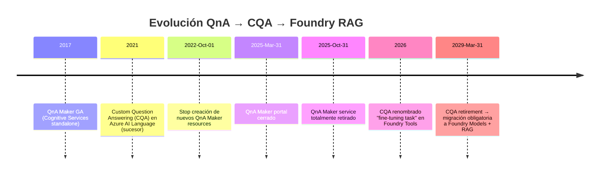
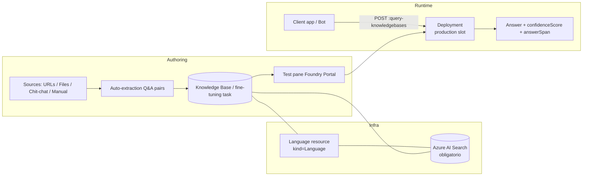
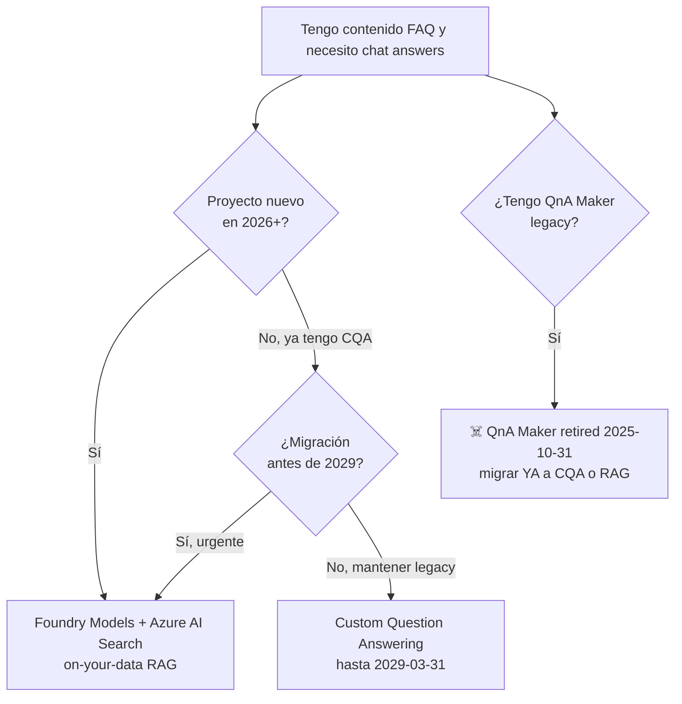

# Custom Question Answering (CQA) — Projects, Sources & Runtime

> [!abstract] TL;DR
> **Custom Question Answering (CQA)** es la feature del Azure AI Language service que construye un **knowledge base** (KB) de pares Q&A sobre tus contenidos (URLs, ficheros, manual, chit-chat) y expone un endpoint REST de runtime con scoring y answer-span. Sucede al **QnA Maker** (legacy retired **2025-10-31**, portal cerrado el 2025-03-31). El propio CQA se **retira el 2029-03-31** y Microsoft empuja la migración a **Foundry Models + RAG** (Azure AI Search + LLM). En la Foundry actual, un "CQA project" se llama ahora **fine-tuning task** (mismo concepto). Resource ARM: `Microsoft.CognitiveServices/accounts` con `kind=Language` (o `kind=AIServices` Foundry multi-service) **+ Azure AI Search** obligatorio.

## 🎯 Relevancia en el examen

- **Frecuencia AI-103: 🔥 (baja, carryover residual).** Microsoft está retirando todo el stack Language-as-a-Service. Aparece sólo como pregunta de "qué servicio uso" o "qué hago con mi KB existente".
- **Tipos de pregunta típicos:**
  1. *"Tengo un KB de QnA Maker, ¿qué hago?"* → migrar a CQA hasta 2029, luego Foundry RAG.
  2. *"¿Qué recursos necesito para crear un CQA project?"* → Language (o Foundry) + **Azure AI Search**.
  3. *"¿Qué fuentes admite?"* → URLs / Files / Chit-chat / manual pairs.
  4. *"¿Cómo obtengo el span exacto dentro de una respuesta larga?"* → `answerSpanRequest.enable=true`.
  5. *"¿Cuándo CQA vs LLM RAG?"* → costes/control vs flexibilidad/futuro.
- **Trampa estrella:** confundir QnA Maker (retired) con CQA (sucesor vigente hasta 2029).

## 📖 Concepto en profundidad

### Linaje y deprecaciones



### Arquitectura CQA



### Componentes clave

| Concepto | Qué es | Detalle examinable |
|---|---|---|
| **Project / fine-tuning task** | Workspace lógico que contiene un KB | `projectKind=CustomQuestionAnswering` |
| **Knowledge base (KB)** | Colección estructurada de pares Q&A | Indexado en Azure AI Search |
| **Source** | Origen de los Q&A pairs | Tipos: `url`, `file`, `chit-chat`, manual |
| **Deployment** | Snapshot publicado del KB | Slot típico: `production` |
| **Runtime endpoint** | API de consulta | `POST /language/:query-knowledgebases` |
| **Azure AI Search** | Backend de indexación | **Requerido** — no opcional |
| **Default answer** | Respuesta cuando no hay match | Configurable; default `"No answer found"` |

### Tipos de fuentes (verbatim docs)

1. **URLs** — páginas FAQ / manuales online (ej. `https://support.microsoft.com/.../surface-book-3-specs-and-features`).
2. **Files** — extracción automática de Q&A pares de:
   - `.pdf` (manuales, documentos)
   - `.docx` / `.doc` (Word)
   - `.tsv` / `.xlsx` (estructurado: question \t answer)
   - `.txt` / `.md` (no estructurado)
3. **Chit-chat** — paquete predefinido (Professional / Friendly / Witty) para conversación informal.
4. **Manual Q&A pairs** — añadidos one-by-one en el editor.

> [!info] Classify file structure
> Al añadir source: opciones `Auto-detect`, `Structured`, `Unstructured`. Estructurado = TSV/XLSX con columnas Q/A; no estructurado = prosa libre (PDF FAQ).

## 🏗️ Cómo se hace

### A. Portal Foundry (recommended workflow)

1. Crear **Foundry resource** (`kind=AIServices`) o **Language resource** (`kind=Language`).
2. Crear / conectar **Azure AI Search** (obligatorio para CQA).
3. En **ai.azure.com** → tu Foundry project → menú **Fine-tuning** → tab **AI Service fine-tuning** → **+ Fine-tune** → **Custom question answering** → Next.
4. Rellenar **Connected Azure AI Search resource**, **Name**, **Language**, **Default answer**.
5. **Manage sources** → **+ Add source** → URLs / Files / Chit-chat.
6. **Test knowledge base** (pane interactivo).
7. **Deploy knowledge base** → genera endpoint REST `production`.

### B. REST — Crear/actualizar project

```bash
# Authoring endpoint (auth con Ocp-Apim-Subscription-Key)
PATCH https://{endpoint}/language/query-knowledgebases/projects/{projectName}?api-version=2021-10-01
Content-Type: application/merge-patch+json

{
  "projectKind": "CustomQuestionAnswering",
  "description": "Surface support KB",
  "language": "en",
  "multilingualResource": false,
  "settings": {
    "defaultAnswer": "No answer found"
  }
}
```

### C. REST — Importar sources (JSON Patch)

```bash
PATCH https://{endpoint}/language/query-knowledgebases/projects/{projectName}/sources?api-version=2021-10-01
Content-Type: application/json

[
  {
    "op": "add",
    "value": {
      "displayName": "Surface Book User Guide",
      "sourceUri": "https://support.microsoft.com/.../surface-book-3-specs-and-features",
      "sourceKind": "url",
      "contentStructureKind": "Unstructured"
    }
  },
  {
    "op": "add",
    "value": {
      "displayName": "FAQ.tsv",
      "sourceKind": "file",
      "contentStructureKind": "Structured"
    }
  }
]
```

Operación **asíncrona** → devuelve `Operation-Location` header para polling.

### D. REST — Deploy (no hay fase explícita de "train")

```bash
PUT https://{endpoint}/language/query-knowledgebases/projects/{projectName}/deployments/production?api-version=2021-10-01
```

> [!warning] No hay "train" explícito en CQA
> A diferencia de CLU / LUIS, CQA **NO** requiere job de entrenamiento. La indexación ocurre automáticamente al añadir sources. Solo necesitas **deploy** del KB.

### E. Runtime — Query endpoint

```bash
POST https://{endpoint}/language/:query-knowledgebases?projectName=surface-kb&deploymentName=production&api-version=2021-10-01
Content-Type: application/json
Ocp-Apim-Subscription-Key: {key}

{
  "question": "How do I reset my password?",
  "top": 3,
  "userId": "user-123",
  "confidenceScoreThreshold": 0.5,
  "answerSpanRequest": {
    "enable": true,
    "confidenceScoreThreshold": 0.2,
    "topAnswersWithSpan": 1
  },
  "includeUnstructuredSources": true,
  "rankerType": "Default",
  "context": {
    "previousQnaId": 0,
    "previousUserQuery": ""
  }
}
```

**Respuesta esperada:**

```json
{
  "answers": [
    {
      "questionId": 1,
      "answer": "To reset your password, go to Settings > ...",
      "confidenceScore": 0.94,
      "source": "faq.pdf",
      "answerSpan": {
        "text": "go to Settings > Account > Reset",
        "confidenceScore": 0.81,
        "offset": 18,
        "length": 32
      },
      "dialog": { "isContextOnly": false, "prompts": [] }
    }
  ]
}
```

### F. Python SDK

```python
# pip install azure-ai-language-questionanswering
from azure.core.credentials import AzureKeyCredential
from azure.ai.language.questionanswering import QuestionAnsweringClient
from azure.ai.language.questionanswering import models as qna_models

client = QuestionAnsweringClient(
    endpoint="https://<resource>.cognitiveservices.azure.com",
    credential=AzureKeyCredential("<key>")
)

output = client.get_answers(
    question="How do I reset my password?",
    top=3,
    confidence_threshold=0.5,
    answer_span_request=qna_models.AnswerSpanRequest(
        enable=True,
        confidence_threshold=0.2,
        top_answers_with_span=1
    ),
    project_name="surface-kb",
    deployment_name="production"
)

for ans in output.answers:
    print(f"[{ans.confidence:.2f}] {ans.answer}")
    if ans.short_answer:
        print(f"  span → {ans.short_answer.text}")
```

> [!tip] Paquete oficial verificado
> `azure-ai-language-questionanswering` en PyPI — runtime + authoring SDKs.

## 📊 CQA vs LLM RAG (Foundry Models)

| Dimensión | **CQA** | **LLM RAG (Foundry Models + AI Search)** |
|---|---|---|
| **Setup** | Project + sources (ingesta automática) | Index custom + chunking + embeddings + retrieval pipeline |
| **Customización** | Pares Q&A explícitos + metadata | Embeddings semánticos, prompt engineering, fine-tuning |
| **Coste** | Per-call (transacciones Language) + AI Search SKU | Per-token LLM + embeddings + AI Search |
| **Multilingual** | Sí (multilingual project flag, fija al crear) | Nativo (modelos GPT-4o, GPT-5) |
| **Multi-turn** | `context.previousQnaId` + prompts predefinidos | Conversation history nativa en prompt |
| **Answer span** | `answerSpanRequest` (preciso) | Vía prompt instruction ("cita el fragmento exacto") |
| **Latencia** | Baja (AI Search lookup) | Media-alta (LLM inference) |
| **Citations** | Source URI/file built-in | On-your-data feature en Foundry Models |
| **Futuro** | ☠️ **Retire 2029-03-31** | ✅ Stack actual / recomendado |
| **Caso uso** | FAQ deterministas, bots simples | Asistentes generativos, razonamiento |

### Árbol de decisión



## 🪤 Trampas del examen

1. **QnA Maker ≠ CQA.** QnA Maker es el servicio legacy (retired **2025-10-31**, portal cerrado **2025-03-31**). CQA es la feature del Language service que lo sucedió. Microsoft suele preguntar *"a customer has QnA Maker"* → respuesta: **migrar a CQA** (o directamente a Foundry RAG).
2. **CQA también muere.** Retire **2029-03-31** junto con CLU y resto de Language custom features. Migración recomendada: **Foundry Models + RAG**.
3. **Resource kind correcto:** `Microsoft.CognitiveServices/accounts` con `kind=Language` (o `kind=AIServices` Foundry multi-service). **NO** `kind=QnAMaker` (deprecated) ni `kind=TextAnalytics`.
4. **Azure AI Search es OBLIGATORIO** — no es opcional. Sin AI Search conectado no puedes crear un CQA project. Coste oculto en preguntas de pricing.
5. **No hay job de "train" explícito.** A diferencia de CLU/LUIS, en CQA solo se hace **deploy**. La ingesta es automática al añadir sources. Si una pregunta dice "first train then deploy CQA project" → **falso**.
6. **`projectKind` exacto:** `CustomQuestionAnswering`. No `QuestionAnswering` ni `CQA` ni `CustomQA`.
7. **`sourceKind` válidos:** `url`, `file`, `chit-chat`. Para manual pairs no se añade como "source" sino directamente como Q&A pair en el KB.
8. **Multilingual flag inmutable.** El setting "multilingual" del primer project en un Language resource fija el comportamiento para **todos los projects subsiguientes** del mismo resource. No se puede cambiar después.
9. **Answer span ≠ answer completa.** `answerSpan` devuelve el **fragmento exacto** dentro de un answer largo (útil cuando ingestas PDFs sin estructura). Tiene su propio `confidenceScoreThreshold` independiente.
10. **`top` controla cantidad, `confidenceScoreThreshold` filtra calidad.** Son ortogonales. `top=3, threshold=0.5` puede devolver 0 si ninguno supera el umbral.
11. **API version verbatim:** `2021-10-01` para el endpoint runtime y authoring estable de CQA. Versiones más recientes existen pero la 2021-10-01 es la GA citada en docs y exámenes.
12. **Deployment slot por defecto:** `production`. No `default` (ese era LUIS). Es un string libre, pero la doc oficial usa `production`.
13. **"fine-tuning task" en Foundry portal = CQA project.** Microsoft renombró la UI pero el concepto, REST API y SDK siguen llamándolo CQA project.
14. **Chit-chat NO es un LLM.** Es un paquete preempaquetado de Q&A pairs informales (Professional/Friendly/Witty). No generativo. Examen suele atacar esto.
15. **No es lo mismo que Conversational Language Understanding (CLU).** CLU detecta intents y entities sobre utterances; CQA devuelve answers de un KB. CQA puede orquestarse desde CLU vía un orchestration project.

## 🧠 Mnemotecnia

- **"CQA = KB + AI Search, no train, solo deploy"** → resumen de 7 palabras.
- **Fechas críticas — "31-31-31"**: QnA Maker portal 2025-**03**-31, QnA Maker service 2025-**10**-31, CQA service 2029-**03**-31. Todos día 31.
- **Fuentes — "U-F-C-M"**: **U**RLs, **F**iles, **C**hit-chat, **M**anual pairs.
- **Tres recursos obligatorios — "L.A.F"**: **L**anguage (o Foundry), **A**zure AI Search, **F**oundry project.
- **Runtime params — "TCAR"**: **T**op, **C**onfidenceScoreThreshold, **A**nswerSpanRequest, **R**ankerType.

## 🔗 Conceptos relacionados

- [[text-question-answering-multi-turn]] — follow-up prompts y dialog flow con `context.previousQnaId`.
- [[text-question-answering-multilingual]] — multilingual project flag y comportamiento cross-language.
- [[text-luis-clu-orchestration]] — orchestration workflow project que enruta a CQA o a CLU según intent.
- [[text-luis-clu-intents-entities]] — alternativa NLU para slot-filling (no para Q&A).
- [[retrieval-rag-pattern]] — patrón sucesor recomendado (Foundry Models + Azure AI Search).
- [[plan-foundry-resource-vs-hub-vs-project]] — relación Foundry resource ↔ project ↔ fine-tuning task.
- [[secure-language-service-rbac]] — roles Foundry User/Owner para gestionar CQA.

## ❓ Autotest

**1.** Has heredado un proyecto QnA Maker creado en 2021 que sigue en producción. Hoy es 23 mayo 2026. ¿Cuál es la acción correcta?

a) Mantenerlo, QnA Maker sigue soportado hasta 2029.  
b) Migrar inmediatamente a Custom Question Answering o a Foundry Models RAG porque QnA Maker fue retirado el 2025-10-31.  
c) Migrar a CLU (Conversational Language Understanding).  
d) Migrar a Azure Bot Service exclusivamente.

<details><summary>Respuesta</summary>
<b>b)</b> QnA Maker fue retirado el <b>2025-10-31</b> (portal cerrado 2025-03-31). Cualquier KB que aún esté en QnA Maker está ya sin soporte; debe migrarse a CQA (vida hasta 2029-03-31) o directamente a Foundry Models + RAG (recomendación actual de Microsoft).
</details>

**2.** ¿Qué combinación de recursos Azure es **mínima** para crear un CQA project nuevo?

a) Solo un Language resource (`kind=Language`).  
b) Language resource + Azure AI Search + Foundry project (o Language Studio).  
c) Foundry resource + Storage Account + Cosmos DB.  
d) QnA Maker resource + App Service.

<details><summary>Respuesta</summary>
<b>b)</b> CQA requiere obligatoriamente <b>Azure AI Search</b> como backend de indexación. El Language resource (o Foundry resource <code>kind=AIServices</code>) provee la feature, AI Search hace el storage/retrieval, y el Foundry project (o Language Studio legacy) es el workspace de autoría.
</details>

**3.** Quieres que el runtime devuelva el **fragmento exacto** dentro de un answer largo (extraído de un PDF). ¿Qué parámetro habilitas en la query?

a) `top=1`  
b) `confidenceScoreThreshold=1.0`  
c) `answerSpanRequest.enable=true`  
d) `includeUnstructuredSources=true`

<details><summary>Respuesta</summary>
<b>c)</b> <code>answerSpanRequest</code> con <code>enable=true</code> hace que el servicio devuelva un objeto <code>answerSpan</code> con <code>text</code>, <code>offset</code>, <code>length</code> y su propio <code>confidenceScore</code>. <code>top</code> controla número de answers, no spans. <code>includeUnstructuredSources</code> determina si se buscan en fuentes no estructuradas, no extrae span.
</details>

**4.** ¿Cuál de estas afirmaciones sobre el ciclo de vida de un CQA project es **correcta**?

a) Tras añadir fuentes hay que ejecutar un job `POST /jobs/train` antes de poder hacer deploy.  
b) Train y deploy son operaciones equivalentes.  
c) No existe fase de train explícita; tras añadir sources se hace deploy directamente.  
d) El deploy crea automáticamente un nuevo Azure AI Search index sin necesidad de configurarlo previamente.

<details><summary>Respuesta</summary>
<b>c)</b> CQA <b>no</b> tiene fase de entrenamiento explícita (a diferencia de CLU/LUIS). La ingesta indexa automáticamente y el siguiente paso es <code>deploy</code> al slot (típicamente <code>production</code>). La opción (d) es falsa: el AI Search index requiere un recurso AI Search ya conectado previamente.
</details>

**5.** En el Foundry portal actual (2026), un "CQA project" aparece bajo qué nombre de UI?

a) Conversation project  
b) Fine-tuning task  
c) Knowledge agent  
d) RAG index

<details><summary>Respuesta</summary>
<b>b)</b> Microsoft renombró la UI: en Foundry, los CQA projects viven en <b>Fine-tuning → AI Service fine-tuning → Custom question answering</b> y se denominan <i>fine-tuning task</i>. El <code>projectKind</code> en REST/SDK sigue siendo <code>CustomQuestionAnswering</code>.
</details>

## ✅ Control de calidad (auto-rúbrica)

| Dimensión | Nota | Justificación |
|---|---|---|
| Completitud | 9.5 | Cubre los 10 puntos del brief + corrige fecha QnA Maker (2025-10-31 vs 2025-03-31) + añade fine-tuning task naming + SDK Python verificado + árbol decisión. |
| Exactitud técnica | 9.5 | Verbatim de 3 páginas Microsoft Learn (overview, create-test-deploy, manage-knowledge-base) + REST API ref. `projectKind`, `sourceKind`, api-version 2021-10-01, paquete `azure-ai-language-questionanswering` verificados. |
| Alineación al examen | 9 | 15 trampas reales (incl. nombre fine-tuning task, multilingual flag inmutable, no train, AI Search obligatorio). 5 preguntas estilo MS Learn assessment. |
| Claridad pedagógica | 9 | Timeline mermaid + flowchart arquitectura + árbol decisión + tabla comparativa + mnemónicos "31-31-31" y "U-F-C-M" + callouts. |

*Verificado a fecha 2026-05-23 contra Microsoft Learn (artículos con `ms.date` 2026-03-30, 2026-04-20 y 2025-11-18). La fecha de retirada de QnA Maker fue extendida oficialmente de 2025-03-31 (portal) a 2025-10-31 (service) — el brief original indicaba solo la primera; este archivo refleja ambas.*
