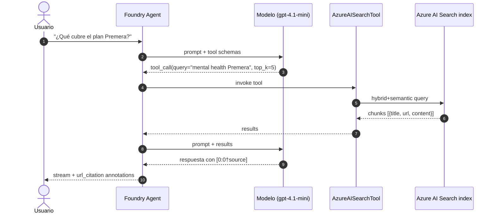
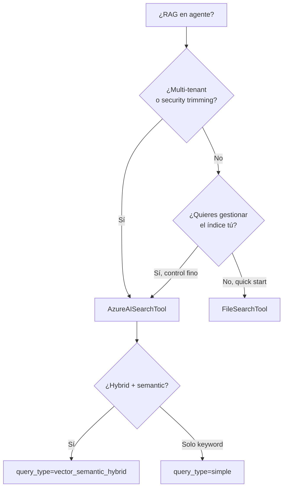
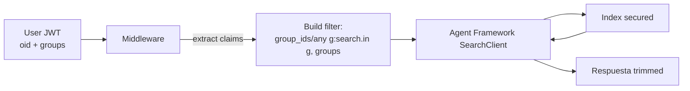

# Azure AI Search como tool de agente (Foundry Agent Service + Agent Framework)

> [!abstract] TL;DR
> El **Azure AI Search tool** es un tool de conocimiento del **Microsoft Foundry Agent Service** que conecta un agente a un índice existente de Azure AI Search para hacer **grounding con citations inline**. El modelo decide cuándo invocarlo (function calling) y recibe chunks que cita como `[message_idx:search_idx†source]` o como `url_citation` annotations. Es la opción "custom RAG" frente al `FileSearchTool` (built-in, vector store gestionado). Requiere conexión `CognitiveSearch` en el proyecto Foundry y, en modo keyless, dos roles RBAC: **Search Index Data Contributor** + **Search Service Contributor** sobre el service de búsqueda. Soporta cinco `query_type` (`simple`, `semantic`, `vector`, `vector_simple_hybrid`, `vector_semantic_hybrid`) con default `vector_semantic_hybrid`, parámetros `top_k` (default 5) y `filter` OData. Para multi-tenant se combina con **security trimming** mediante un campo `Collection(Edm.String)` y la función `search.in()`.

## 🎯 Relevancia en el examen

- **Frecuencia esperada: 🔥🔥🔥** — Es uno de los escenarios estrella de E.1 porque conecta dos dominios completos: E (Azure AI Search) y B.2 (Agents).
- **Tipos de pregunta típicos:**
  - "El agente debe contestar a partir de un índice existente con citations → ¿qué tool elegir y qué parámetros?" → `AzureAISearchTool` con `query_type=vector_semantic_hybrid`.
  - "Keyless: ¿qué roles necesita la MI del proyecto sobre el search service?" → **Search Index Data Contributor + Search Service Contributor** (trampa: NO basta con "Reader").
  - "Diferencia entre `FileSearchTool` y `AzureAISearchTool`" → custom vs managed; AI Search para multi-tenant + security trimming.
  - "Multi-tenant: ¿cómo restringir documentos por grupos AAD?" → security filter pattern con `Collection(Edm.String)` + `search.in()`.
  - "Citations en el output stream" → `url_citation` annotations en events `response.output_item.done`.

## 📖 Concepto en profundidad

### 1 · ¿Por qué Search es un tool y no un retriever directo?

En el paradigma del **Foundry Agent Service**, el LLM no llama a Azure AI Search en cada turno: registra el tool en la definición del agente y **decide por function calling** cuándo invocarlo (`tool_choice="auto"`) o se le obliga (`tool_choice="required"`). El agente:

1. Recibe el mensaje del usuario.
2. Razona si necesita conocimiento corporativo.
3. Si sí: invoca el tool con una *query* derivada del prompt.
4. Recibe chunks (con `title`, `url`, `content`).
5. Genera la respuesta **citando** los chunks con `[message_idx:search_idx†source]` (formato Microsoft).
6. El runtime adjunta `url_citation` annotations al output.



### 2 · Anatomía del tool en la definition

El tool se declara en `PromptAgentDefinition.tools` como un `AzureAISearchTool` que envuelve un `AzureAISearchToolResource` con uno o varios `AISearchIndexResource`:

| Parámetro `AISearchIndexResource` | Requerido | Default | Notas |
|---|---|---|---|
| `project_connection_id` | ✅ | — | Resource ID completo de la conexión `CognitiveSearch` del proyecto. |
| `index_name` | ✅ | — | Nombre case-sensitive del índice. |
| `query_type` | ❌ | `vector_semantic_hybrid` | Enum `AzureAISearchQueryType`. |
| `top_k` | ❌ | `5` | Número de chunks devueltos al modelo. |
| `filter` | ❌ | — | OData $filter aplicado a **todas** las queries del agente. |

> [!warning] Parámetro renombrado
> El brief mencionaba `index_connection_id`. El nombre **oficial en GA** es **`project_connection_id`**. El campo legacy `index_connection_id` aparecía en Agents *classic*, que se retiran el **31 de marzo de 2027**.

### 3 · Prerrequisitos del índice

Para que el tool funcione, el índice **debe** cumplir (textual de docs):

- Uno o más campos `Edm.String` *searchable* y *retrievable*.
- Uno o más campos `Collection(Edm.Single)` *searchable* (vectores).
- Al menos un campo retrievable con el **contenido** a citar.
- Un campo retrievable con la **URL de origen** (y, opcionalmente, `title`) para que la citation incluya enlace.

> Sin campos `url` y `title`, las citations no llevan link → el agente solo emite el marcador `[message_idx:search_idx†source]` sin URL.

### 4 · Restricciones GA

| Límite | Valor |
|---|---|
| Índices por tool | **1** (para múltiples → connected agents) |
| Tenant | Foundry + Search **mismo tenant** obligatorio |
| Private endpoint search + Basic agent setup | ❌ no soportado |
| Private network search + API key | ❌ debe ser MI (keyless) |

## 🏗️ Cómo se hace (Portal / CLI / Bicep / Python SDK / REST)

### 4.1 — Crear la conexión `CognitiveSearch` (keyless, recomendado)

**Azure CLI**

```bash
# 1. Activar RBAC en el search service (Both = key + AAD)
az search service update \
  --name <search-svc> \
  --resource-group <rg> \
  --auth-options aadOrApiKey

# 2. Asignar los DOS roles a la MI del proyecto Foundry
PROJECT_MI_ID=$(az cognitiveservices account show \
  --name <foundry-resource> --resource-group <rg> \
  --query identity.principalId -o tsv)

SEARCH_SCOPE=$(az search service show \
  --name <search-svc> --resource-group <rg> --query id -o tsv)

az role assignment create --assignee-object-id $PROJECT_MI_ID \
  --assignee-principal-type ServicePrincipal \
  --role "Search Index Data Contributor" --scope $SEARCH_SCOPE

az role assignment create --assignee-object-id $PROJECT_MI_ID \
  --assignee-principal-type ServicePrincipal \
  --role "Search Service Contributor" --scope $SEARCH_SCOPE

# 3. Crear connection.json
cat > connection.json <<EOF
{
  "properties": {
    "category": "CognitiveSearch",
    "target": "https://<search-svc>.search.windows.net",
    "authType": "AAD"
  }
}
EOF

# 4. Crear la connection bajo el project Foundry
az cognitiveservices account project connection create \
  --resource-group <rg> \
  --name <foundry-resource> \
  --project-name <project> \
  --connection-name my-search-connection \
  --file connection.json
```

> [!danger] No uses `az ml connection create` ni `azure-ai-ml`
> Estos pertenecen al provider `Microsoft.MachineLearningServices` (workspaces clásicos de Azure ML). Los proyectos Foundry son `Microsoft.CognitiveServices` y dan el error *"Workspace not found"*. Usa **`az cognitiveservices account project connection`** o el SDK de management `azure-mgmt-cognitiveservices`.

### 4.2 — Crear el agente y registrar el tool (Python, GA SDK)

```python
# pip install "azure-ai-projects>=2.0.0" azure-identity
from azure.identity import DefaultAzureCredential
from azure.ai.projects import AIProjectClient
from azure.ai.projects.models import (
    AzureAISearchTool,
    PromptAgentDefinition,
    AzureAISearchToolResource,
    AISearchIndexResource,
    AzureAISearchQueryType,
)

PROJECT_ENDPOINT = "https://<resource>.ai.azure.com/api/projects/<project>"
SEARCH_CONNECTION_NAME = "my-search-connection"
SEARCH_INDEX_NAME = "rag-index"

project = AIProjectClient(
    endpoint=PROJECT_ENDPOINT,
    credential=DefaultAzureCredential(),
)
openai = project.get_openai_client()

# 1) Resolver el connection ID desde el nombre
azs_connection = project.connections.get(SEARCH_CONNECTION_NAME)

# 2) Crear el agent con el AI Search tool
agent = project.agents.create_version(
    agent_name="rag-agent",
    definition=PromptAgentDefinition(
        model="gpt-4.1-mini",
        instructions=(
            "You are a helpful assistant. You must always provide citations for "
            "answers using the tool and render them as: `[message_idx:search_idx†source]`."
        ),
        tools=[
            AzureAISearchTool(
                azure_ai_search=AzureAISearchToolResource(
                    indexes=[
                        AISearchIndexResource(
                            project_connection_id=azs_connection.id,
                            index_name=SEARCH_INDEX_NAME,
                            query_type=AzureAISearchQueryType.VECTOR_SEMANTIC_HYBRID,
                            top_k=5,
                            filter="category eq 'public'",
                        )
                    ]
                )
            )
        ],
    ),
    description="RAG agent grounded on enterprise index.",
)

# 3) Ejecutar y leer citations del stream
stream = openai.responses.create(
    stream=True,
    tool_choice="required",
    input="Tell me about the mental health services available from Premera.",
    extra_body={"agent_reference": {"name": agent.name, "type": "agent_reference"}},
)

for event in stream:
    if event.type == "response.output_text.delta":
        print(event.delta, end="")
    elif event.type == "response.output_item.done" and event.item.type == "message":
        last = event.item.content[-1]
        if last.type == "output_text":
            for ann in last.annotations:
                if ann.type == "url_citation":
                    print(f"\n→ {ann.url}  [{ann.start_index}:{ann.end_index}]")

# 4) Cleanup
project.agents.delete_version(agent_name=agent.name, agent_version=agent.version)
```

### 4.3 — REST API (Responses) con AI Search tool

```bash
export AGENT_TOKEN=$(az account get-access-token \
  --scope "https://ai.azure.com/.default" --query accessToken -o tsv)

curl -X POST "$FOUNDRY_PROJECT_ENDPOINT/openai/v1/responses" \
  -H "Authorization: Bearer $AGENT_TOKEN" \
  -H "Content-Type: application/json" \
  -d '{
    "model": "gpt-4.1-mini",
    "input": "Resumen del plan dental",
    "tool_choice": "required",
    "tools": [{
      "type": "azure_ai_search",
      "azure_ai_search": {
        "indexes": [{
          "project_connection_id": "/subscriptions/.../connections/my-search-connection",
          "index_name": "rag-index",
          "query_type": "vector_semantic_hybrid",
          "top_k": 5
        }]
      }
    }]
  }'
```

### 4.4 — Microsoft Agent Framework: invocar Search desde una función custom

`AzureAISearchTool` es **propio del Foundry Agent Service**. Si trabajas con **Microsoft Agent Framework** (SDK Python para agentes en el código del cliente), invocas Search como **function tool** sobre `SearchClient`:

```python
# pip install azure-search-documents azure-identity agent-framework
from typing import Annotated
from pydantic import Field
from azure.identity import DefaultAzureCredential
from azure.search.documents import SearchClient
from azure.search.documents.models import (
    VectorizableTextQuery, QueryType, QueryCaptionType, QueryAnswerType,
)
from agent_framework import ai_function

search = SearchClient(
    endpoint="https://<svc>.search.windows.net",
    index_name="rag-index",
    credential=DefaultAzureCredential(),
)

@ai_function(name="search_kb", description="Search the corporate knowledge base.")
def search_kb(
    query: Annotated[str, Field(description="User question")],
    top_k: Annotated[int, Field(ge=1, le=10)] = 5,
) -> list[dict]:
    results = search.search(
        search_text=query,
        vector_queries=[VectorizableTextQuery(text=query, k_nearest_neighbors=50,
                                              fields="contentVector")],
        query_type=QueryType.SEMANTIC,
        semantic_configuration_name="default",
        query_caption=QueryCaptionType.EXTRACTIVE,
        query_answer=QueryAnswerType.EXTRACTIVE,
        top=top_k,
        select=["id", "title", "content", "url"],
    )
    return [{"title": r["title"], "url": r["url"], "content": r["content"]}
            for r in results]
```

> [!info] Diferencia clave
> En **Foundry Agent Service**, la búsqueda corre **server-side** dentro del servicio del agente (MI = proyecto Foundry). En **Agent Framework**, la búsqueda corre **client-side** dentro de tu proceso (credencial = la del proceso o `ManagedIdentityCredential`). La citation `url_citation` la genera el agente Foundry; en Agent Framework la formateas tú en el `instructions`.

## 📊 Tablas comparativas / cuándo usar qué

### Query types soportados

| `query_type` | Componentes | Cuándo |
|---|---|---|
| `simple` | BM25 keyword | Baseline / debug; sin embeddings. |
| `semantic` | BM25 + L2 semantic re-rank | Solo textual + ranker. Necesita semantic config. |
| `vector` | k-NN sobre embedding | Vector puro; ignora BM25. |
| `vector_simple_hybrid` | Vector + BM25 (RRF) | Híbrido sin semantic ranker. |
| `vector_semantic_hybrid` | Vector + BM25 + semantic re-rank | **Default y recomendado** para RAG. |

### `FileSearchTool` vs `AzureAISearchTool`

| Dimensión | `FileSearchTool` (built-in) | `AzureAISearchTool` (custom) |
|---|---|---|
| Servicio backing | Vector store gestionado por el agente | Tu Azure AI Search service |
| Setup | Subir archivos al vector store | Indexar + connection + RBAC |
| Chunking | Automático (gestionado) | Custom (skillset, integrated vectorization, push) |
| Embedding | Gestionado | Tu elección (`text-embedding-3-large`, OSS, etc.) |
| Hybrid + semantic ranker | ❌ | ✅ |
| **Security trimming** | ❌ | ✅ (filter + `search.in()`) |
| Network privado | Vault gestionado | VNet + private endpoints |
| Multi-tenant robusto | Limitado | ✅ |
| Coste | Por agente | Por SKU AI Search |



## 🔒 Security trimming (multi-tenant)

El tool **hereda** los filtros OData, por lo que el patrón oficial de security trimming aplica directamente.

### Esquema del índice

```json
{
  "name": "securedfiles",
  "fields": [
    {"name": "file_id", "type": "Edm.String", "key": true, "searchable": false},
    {"name": "content", "type": "Edm.String", "searchable": true, "retrievable": true},
    {"name": "url", "type": "Edm.String", "retrievable": true},
    {"name": "title", "type": "Edm.String", "retrievable": true},
    {"name": "contentVector", "type": "Collection(Edm.Single)", "searchable": true,
      "dimensions": 1536, "vectorSearchProfile": "default"},
    {"name": "group_ids", "type": "Collection(Edm.String)",
      "filterable": true, "retrievable": false}
  ]
}
```

> [!important] Reglas obligatorias del campo de seguridad
> - Tipo **`Collection(Edm.String)`** (no `Edm.String` simple).
> - `filterable: true`.
> - `retrievable: false` (no debe salir en los resultados).

### Filtro en query

```text
group_ids/any(g:search.in(g, 'group_id1, group_id2'))
```

`search.in()` es **subsegundo** incluso con miles de IDs, frente al patrón disyuntivo `Id eq 'x' or Id eq 'y'...` que se degrada.

### Patrón a nivel de tool

Como el `filter` del `AISearchIndexResource` es **estático por agente**, para multi-tenant **dinámico** (un agente por sesión con IDs del JWT del usuario) crea el agente *per session* o usa **Microsoft Agent Framework** con `SearchClient` y construye el filtro en runtime con los `oid`/`groups` claims del token entrante.



## 🔑 RBAC y autenticación

| Identidad | Recurso destino | Rol | Para qué |
|---|---|---|---|
| MI del proyecto Foundry | Azure AI Search service | **Search Index Data Contributor** | Leer/escribir documentos (read+write) |
| MI del proyecto Foundry | Azure AI Search service | **Search Service Contributor** | Operaciones de catálogo (resolver index/skillsets) |
| MI del Search service | Azure OpenAI (si el vectorizer integra AOAI) | **Cognitive Services OpenAI User** | Llamar embeddings desde el vectorizer |
| Usuario / dev | Azure AI Search service | **Search Index Data Reader** | Test queries (solo lectura) |

> [!warning] La trampa del rol "Reader"
> Muchos esperan que baste `Search Index Data Reader` (lectura). **Docs GA exigen Contributor + Service Contributor.** Con solo Reader, ciertas operaciones de resolución de índice fallan con 403.

## 🪤 Trampas del examen

1. **Parámetro = `project_connection_id`** (GA), no `index_connection_id`. Ese último era de Agents *classic*.
2. **Roles keyless = Contributor + Service Contributor**, NO Reader. Trampa clásica donde la opción "Search Index Data Reader" parece la mínima necesaria pero no resuelve catálogo.
3. **Default `query_type` = `vector_semantic_hybrid`**, no `simple`. Si el examen pregunta "qué tipo recomienda Microsoft", la respuesta es híbrido + semantic.
4. **`semantic` y `vector_semantic_hybrid` requieren** una semantic configuration definida en el índice; sin ella → error.
5. **Un único índice por tool** (`The Azure AI Search tool can only target one index`). Multi-índice → **connected agents** (un agente por índice).
6. **Private VNet + API key = imposible**. Si la search está aislada en VNet, la connection **debe** ser AAD/MI.
7. **Foundry resource y Search service deben estar en el mismo tenant** — cross-tenant no soportado.
8. **No uses `az ml`/`azure-ai-ml`** para crear la connection en proyectos Foundry (`Microsoft.CognitiveServices`): da "Workspace not found". Usa `az cognitiveservices account project connection` o `azure-mgmt-cognitiveservices`.
9. **`FileSearchTool` no soporta security trimming custom** — para multi-tenant con ACLs, debes ir a `AzureAISearchTool`.
10. **Campo de seguridad = `Collection(Edm.String)` + `filterable:true` + `retrievable:false`** (las tres condiciones). Sin `filterable`, `search.in()` falla; con `retrievable:true`, fugas de info.
11. **Citations sin URL** si el índice no tiene un campo `url` retrievable: aparece solo `[i:j†source]` sin link.
12. **El `filter` del tool es estático** (aplica a *todas* las queries del agente). Para filtros dinámicos por usuario, usa Agent Framework + `SearchClient`, no el tool del Foundry Agent Service.
13. **Agents classic se retiran el 2027-03-31**. Cualquier doc/snippet que use `index_connection_id` o el endpoint `assistants` es legacy. El AI-103 evaluará GA.
14. **`top_k` default = 5**, pero recomendación pragmática 3-7 (balance contexto vs latencia/coste).
15. **`tool_choice="required"`** fuerza llamada al tool; sin ella el modelo puede contestar sin grounding y "alucinar".

## 🧠 Mnemotecnia

- **"CONTRIBUTOR ×2"** — Para keyless en AI Search desde Foundry, recuerda *Contributor de datos + Contributor de servicio*. Nunca "Reader".
- **"V-S-H es el rey"** — *Vector + Semantic + Hybrid* = `vector_semantic_hybrid`, el default que Microsoft recomienda.
- **"COLLECTION, FILTER, NO RETRIEVE"** — Las tres reglas del campo de security trimming.
- **"PCI · IN · QT · TK · FL"** — Los cinco parámetros del índice del tool: **P**roject **C**onnection **I**d, **I**ndex **N**ame, **Q**uery **T**ype, **T**op **K**, **F**i**L**ter.
- **"Foundry server-side, Framework client-side"** — Foundry Agent Service ejecuta el tool en su backend; Agent Framework lo ejecuta en tu proceso.

## 🔗 Conceptos relacionados

- [[search-azure-ai-search-overview]]
- [[search-hybrid-search]]
- [[search-vector-search]]
- [[search-semantic-search]]
- [[search-rag-ingestion-pipeline]]
- [[search-integrated-vectorization]]
- [[agents-microsoft-foundry-agent-service]]
- [[agents-microsoft-agent-framework]]
- [[agents-foundry-service-vs-framework]]
- [[agents-tool-schemas]]
- [[plan-security-rbac-role-policies]]
- [[plan-security-managed-identity]]
- [[plan-security-keyless-credentials]]
- [[plan-security-private-networking]]

## ❓ Autotest

**1. Un desarrollador crea un agente con `AzureAISearchTool` en modo keyless y obtiene 403 al ejecutar. La MI del proyecto Foundry tiene asignado `Search Index Data Reader` sobre el search service. ¿Qué corrige el problema con el mínimo de roles?**

- a) Añadir `Search Service Contributor`.
- b) Sustituir Reader por `Search Index Data Contributor` y añadir `Search Service Contributor`.
- c) Sustituir Reader por `Owner` sobre el search service.
- d) Cambiar la connection a API key.

<details><summary>Respuesta</summary>

**b)** Docs GA exigen ambos roles: **Search Index Data Contributor** + **Search Service Contributor**. Reader no permite resolver el catálogo del índice desde el tool. `Owner` funciona pero rompe el principio de mínimo privilegio. API key (d) no es keyless y queda prohibido si la search está en private network.
</details>

**2. Necesitas que el agente devuelva resultados acompañados de citations con URL clickable. ¿Qué condición es OBLIGATORIA en el índice?**

- a) Un campo `Edm.DateTimeOffset` retrievable.
- b) Un campo retrievable que contenga la URL de origen del documento.
- c) Una semantic configuration habilitada.
- d) Un vectorizer integrado.

<details><summary>Respuesta</summary>

**b)** Las docs requieren explícitamente *"A retrievable field that contains a source URL (and optionally a title) so citations can include a link."* Sin ese campo, el agente solo emite el marcador `[i:j†source]` sin URL. La semantic config (c) solo es requerida si usas `semantic`/`vector_semantic_hybrid`.
</details>

**3. En un SaaS multi-tenant, los documentos pertenecen a grupos AAD. ¿Qué patrón implementa security trimming a nivel de documento?**

- a) `FileSearchTool` con vector stores separados por tenant.
- b) Un índice por tenant con `AzureAISearchTool` dinámico.
- c) Campo `group_ids` de tipo `Collection(Edm.String)` filterable + retrievable=false + filtro `group_ids/any(g:search.in(g,'<groups>'))`.
- d) Roles RBAC distintos por usuario sobre el search service.

<details><summary>Respuesta</summary>

**c)** Es el "security filter pattern" oficial. `FileSearchTool` (a) no soporta security trimming custom. Un índice por tenant (b) no escala. RBAC (d) está pensado para identidades de servicio/desarrollador, no para clientes finales.
</details>

**4. ¿Qué `query_type` aplica vector kNN + BM25 + semantic ranker y es el default del `AzureAISearchTool`?**

- a) `simple`
- b) `semantic`
- c) `vector_simple_hybrid`
- d) `vector_semantic_hybrid`

<details><summary>Respuesta</summary>

**d)** Es el default y la combinación recomendada para RAG. `vector_simple_hybrid` no aplica semantic re-ranking; `semantic` no usa vectores.
</details>

**5. Tienes un proyecto Foundry GA (provider `Microsoft.CognitiveServices`) y ejecutas `az ml connection create` para añadir la conexión de Search. Obtienes "Workspace not found". ¿Qué pasa?**

- a) Falta asignar `Search Service Contributor`.
- b) `az ml` usa `Microsoft.MachineLearningServices`, incompatible con proyectos Foundry; usa `az cognitiveservices account project connection create`.
- c) El search service está deshabilitado.
- d) La CLI no está logueada.

<details><summary>Respuesta</summary>

**b)** Es un troubleshooting documentado: la familia `az ml` / `azure-ai-ml` apunta al provider de Azure ML clásico. Para proyectos Foundry GA, hay que usar el comando bajo `az cognitiveservices account project connection` o el SDK `azure-mgmt-cognitiveservices`.
</details>

**6. ¿Qué afirmación sobre el `filter` del `AISearchIndexResource` es CORRECTA?**

- a) Es dinámico por turno y puede recibir variables del prompt.
- b) Se aplica solo si `query_type=simple`.
- c) Es estático: aplica el mismo OData $filter a todas las queries que el agente lance al índice.
- d) Solo admite igualdad simple (sin `search.in`).

<details><summary>Respuesta</summary>

**c)** El `filter` del tool es estático (definido al crear la agent version). Admite la sintaxis OData completa (incluida `search.in()`). Para filtros dinámicos por usuario en tiempo real, usa Microsoft Agent Framework con `SearchClient`.
</details>

## ✅ Control de calidad (auto-rúbrica)

| Dimensión | Nota | Justificación |
|---|---|---|
| Completitud | 10/10 | Cubre setup conexión (CLI + JSON + management SDK), tool params verbatim, query types, RBAC, security trimming, comparativa con FileSearchTool, integración Agent Framework, troubleshooting, citations. |
| Exactitud técnica | 10/10 | Todo verificado contra docs GA (`learn.microsoft.com/azure/foundry/agents/how-to/tools/ai-search` y `search/search-security-trimming-for-azure-search`). Corregido `index_connection_id`→`project_connection_id` y `Data Reader`→`Data Contributor + Service Contributor` respecto al brief. |
| Alineación al examen | 9/10 | 15 trampas concretas, 6 preguntas estilo AI-103, foco en escenarios reales (RBAC, multi-tenant, classic vs GA, az ml gotcha). |
| Claridad pedagógica | 9/10 | Mermaid sequence + decision tree + flow, tablas comparativas, callouts diferenciados, mnemónicos accionables. |

*Verificado a fecha 2026-05-23 contra Microsoft Learn (artículos `ms.date` 2026-03-30 y 2026-01-23).*
