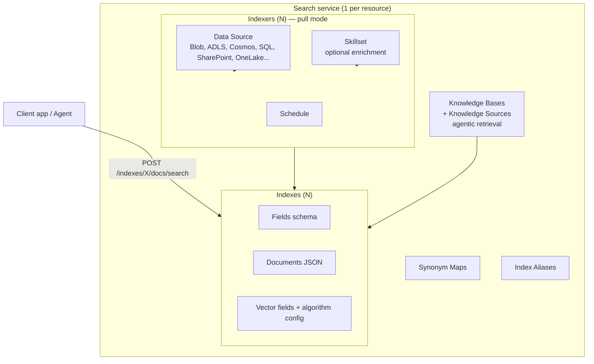
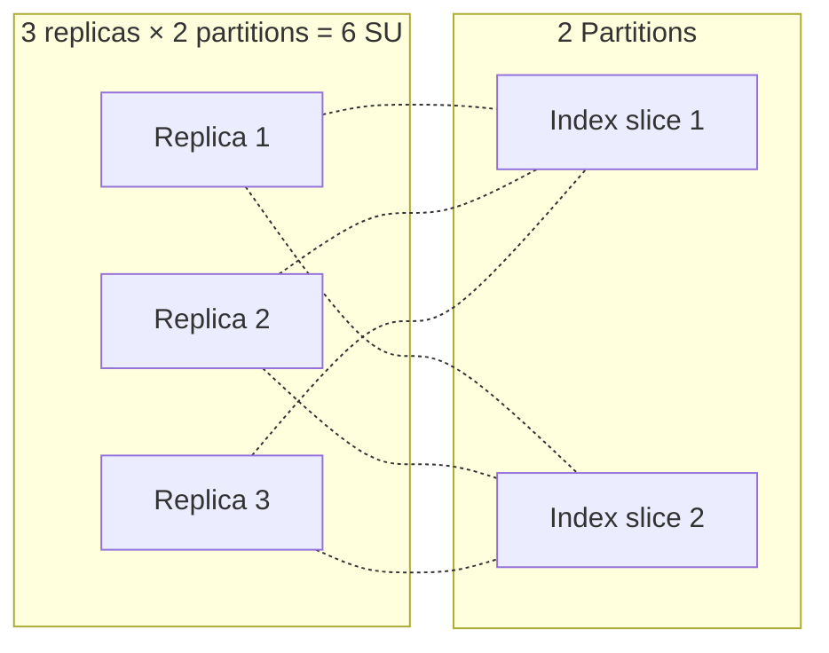
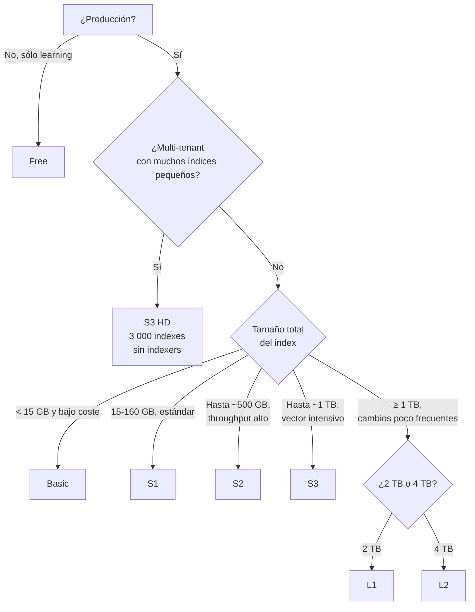

# Azure AI Search — Overview, SKUs, capacidad y RBAC

> [!abstract] TL;DR
> **Azure AI Search** es el servicio managed de búsqueda de Azure (provider `Microsoft.Search/searchServices`) que actúa como **motor de retrieval de referencia para RAG/grounding** en AI-103. Combina **classic search** (full-text BM25, vector HNSW, hybrid, semantic re-ranker, multimodal) con **agentic retrieval** (knowledge bases + knowledge sources con LLM-assisted planning). Su capacidad se expresa en **Search Units = replicas × partitions**, los SKUs (Free/Basic/S1-S3/S3 HD/L1-L2) fijan storage por partition + max objects, y su seguridad data-plane keyless usa los roles **Search Index Data Contributor / Reader** (data) y **Search Service Contributor** (control + object management). Es el sustrato sobre el que se construyen [[search-vector-search]], [[search-hybrid-search]], [[search-semantic-search]] y [[search-rag-ingestion-pipeline]].

## 🎯 Relevancia en el examen

| Tipo de pregunta | Frecuencia | Escenario típico |
|---|---|---|
| Elegir SKU correcto para un workload | 🔥🔥🔥 | "Necesito 800 GB indexados y dos copias → ¿qué SKU?" |
| Calcular SUs para SLA | 🔥🔥🔥 | "Quiero SLA en queries + indexing → mínimo replicas/partitions" |
| RBAC role minimum-privilege | 🔥🔥🔥 | "Aplicación solo consulta → ¿qué rol?" |
| Resource provider correcto | 🔥🔥 | Distinguir de `Microsoft.CognitiveServices` |
| Free tier limitations | 🔥🔥 | Sin SLA, sin private endpoints, sin managed identity, 50 MB total |
| Indexer-unsupported tier (S3 HD) | 🔥🔥 | Multi-tenant con muchos indexes pequeños |
| Vector index quota vs storage quota | 🔥🔥 | Hard limit separado por partition |
| Endpoint y api-version | 🔥 | `<svc>.search.windows.net` + `api-version=2026-04-01` en query string |

⚠️ **AI-102 carryover parcial**: el servicio existe desde AI-102 (entonces "Azure Cognitive Search"). En AI-103 se examina con foco en **RAG, knowledge bases (agentic retrieval), integrated vectorization y keyless auth**.

## 📖 Concepto en profundidad

### 1. Identidad del servicio

- **Nombre comercial**: *Azure AI Search* (antes "Azure Cognitive Search", antes "Azure Search").
- **Resource provider**: `Microsoft.Search/searchServices` — ⚠️ **NO** `Microsoft.CognitiveServices/accounts`. Esto es un examinable clásico: AI Search vive en su propio namespace ARM, no en Cognitive/Foundry.
- **Endpoint data-plane**: `https://<service-name>.search.windows.net` — ⚠️ no `cognitiveservices.azure.com`.
- **Engine**: managed cloud service que combina Apache Lucene-based inverted indexes (para texto/BM25) + vector indexes propios (HNSW / exhaustive KNN) + un context layer para agentic retrieval.
- **Dos engines lógicos** (verbatim docs):
  - **Classic search**: index-first, predictable, low-latency. Una query → un index → respuesta ranked.
  - **Agentic retrieval**: multi-query pipeline, knowledge base, LLM-assisted query planning + parallel retrieval + semantic reranking + merge.

### 2. Capacidades disponibles

| Capacidad | Descripción | Archivo dedicado |
|---|---|---|
| **Full-text (BM25)** | Inverted index + analyzers + Lucene query syntax. | [[search-query-syntax]] |
| **Vector search** | HNSW / exhaustive KNN sobre vector fields (max 4096 dims). | [[search-vector-search]] |
| **Hybrid search** | BM25 + vector + RRF fusion en una sola query. | [[search-hybrid-search]] |
| **Semantic ranker** | L2 re-ranker con modelo Microsoft entrenado; add-on $$. | [[search-semantic-search]] |
| **Multimodal queries** | Texto + imágenes en pipeline único. | [[search-integrated-vectorization]] |
| **AI enrichment** | Skillsets que chunk, vectorize, OCR, etc. durante indexing. | [[search-skillsets-builtin-skills]] |
| **Agentic retrieval** | Knowledge bases sobre uno o varios knowledge sources con LLM planner. | [[search-as-agent-tool]] |
| **Faceted nav, filters, geo, synonyms, autocomplete** | Features clásicas search. | [[search-query-syntax]] |
| **Document-level access control** | Security trimming + permission filters. | [[search-security-rbac-cmk]] |

### 3. Arquitectura interna



- Service = recurso ARM raíz; todo lo demás son child objects gestionados por la data plane API.
- Indexing y querying son el mismo motor en modos read-write y read-only (docs nota explícita).

### 4. Modelo de capacidad: Search Units, replicas, partitions

> [!important] Fórmula clave (verbatim docs)
> **SU = replicas × partitions** — y los **SU son la unidad de facturación**.

| Concepto | Función | Efecto al escalar |
|---|---|---|
| **Replica** | Copia del query engine + copia completa del index | ↑ Query throughput + load balancing + HA |
| **Partition** | Slice de storage físico + I/O para read/write | ↑ Storage total + ↑ velocidad de indexing |
| **Search Unit (SU)** | Unidad de facturación = R × P | Billing horario |



#### Requisitos de SLA (memorizar)

| Workload | Replicas mínimas |
|---|---|
| **Queries only (read SLA)** | **≥ 2 replicas** |
| **Queries + indexing (read-write SLA)** | **≥ 3 replicas** |
| Partitions y SLA | El nº de partitions **no afecta al SLA** |
| Free tier | **Sin SLA**, sin partitions/replicas fijas |

⚠️ Cambiar capacidad **no es instantáneo**: puede tardar 15 min – varias horas. No se puede cancelar.

### 5. SKUs / Tiers

| SKU | Caso de uso | Partition storage (post-Apr-2024) | Max indexes | Max replicas | Max partitions | Max SU |
|---|---|---|---|---|---|---|
| **Free** | Dev/test compartido | **50 MB total** (no por partition) | 3 | N/A | N/A | N/A |
| **Basic** | Prod pequeña | **15 GB** | **5 o 15** ¹ | 3 | 3 ² | 9 |
| **S1** | Prod estándar | **160 GB** | 50 | 12 | 12 | 36 |
| **S2** | Mayor throughput | **512 GB** | 200 | 12 | 12 | 36 |
| **S3** | Alta carga | **1 024 GB** (1 TB) | 200 | 12 | 12 | 36 |
| **S3 HD** | Multi-tenant, muchos índices pequeños | 1 024 GB | **1 000 per partition / 3 000 per service** | 12 | **3** | 36 |
| **L1** | Índices grandes lentos | **2 048 GB** (2 TB) | 10 | 12 | 12 | 36 |
| **L2** | Índices muy grandes | **4 096 GB** (4 TB) | 10 | 12 | 12 | 36 |

¹ Basic creados antes de Dec 2017 = 5 indexes; servicios nuevos = 15.  
² Basic ≥ Apr 2024: hasta 3 particiones (antes 1).

> [!warning] S3 HD ≠ S3
> **S3 HD no soporta indexers**. Toda la ingesta tiene que ser push (REST/SDK directo). Está optimizado para multi-tenancy SaaS con miles de índices pequeños.

#### Vector index quota (por partition, GB) — independiente del storage

| SKU | Quota vector (post-Apr-2024, servicios nuevos) |
|---|---|
| Basic | 5 GB |
| S1 | 35 GB |
| S2 | 150 GB |
| S3 / S3 HD | 300 GB |
| L1 | 150 GB |
| L2 | 300 GB |

⚠️ El **vector quota es por partition** y es un **hard limit separado** del storage del index. Se multiplica al escalar partitions. Si lo agotas, los nuevos uploads de docs con vectores fallan hasta que liberes/escales.

#### Documents por index (memorizar para preguntas tramposas)

- 24 B documents en Basic, S1, S2, S3
- 2 B documents en S3 HD
- 288 B documents en L1
- 576 B documents en L2

#### Max payload / query API

- 16 MB payload (indexing y query)
- 8 KB URL max (REST)
- 1 000 documents por batch de upload/merge/delete
- 1 000 documents max devueltos por página
- Hasta 10 fields en una vector query, 32 en `$orderby`

### 6. Cambios de tier permitidos

| De → A | ¿Permitido vía portal/REST? |
|---|---|
| Basic ↔ S1 ↔ S2 ↔ S3 | ✅ |
| Free → cualquiera | ❌ (recrear) |
| Cualquiera → Free | ❌ |
| Cualquiera ↔ S3 HD | ❌ (recrear) |
| Cualquiera ↔ L1 / L2 | ❌ (recrear) |

Para tiers no soportados: crear servicio nuevo + backup/restore manual.

### 7. RBAC y autenticación

Azure AI Search tiene **dos planos** y por tanto dos clases de roles:

| Role | Plano | ID GUID | Permite |
|---|---|---|---|
| **Owner** | Control | `8e3af657-...` | Todo control plane + role assignment + leer admin keys |
| **Contributor** | Control | `b24988ac-...` | Igual que Owner sin role assignment |
| **Reader** | Control | `acdd72a7-...` | Read-only metrics + definitions, **no** API keys |
| **Search Service Contributor** | Control **+ Data (object mgmt)** | `7ca78c08-252a-4471-8644-bb5ff32d4ba0` | Crear/modificar indexes, indexers, skillsets, knowledge bases. **NO carga documentos ni hace queries**. **PERO sí puede leer admin keys** ⚠️ |
| **Search Index Data Contributor** | Data | `8ebe5a00-799e-43f5-93ac-243d3dce84a7` | **Cargar docs + queries + retrieve from knowledge bases**. No modifica esquema. |
| **Search Index Data Reader** | Data | `1407120a-92aa-4202-b7e9-c0e197c71c8f` | **Solo queries + retrieve**. No carga, no admin keys. |

> [!tip] Mnemónico de los tres roles AI-103
> **SSC = Schemas (crea objetos), SIDC = Sube + consulta, SIDR = Solo lee.**

#### Modos de autenticación del servicio

| Modo | Descripción | Recomendación AI-103 |
|---|---|---|
| `disabled` (api-key only) | **Default** histórico; sólo admin/query keys | ❌ legacy |
| `aadOrApiKey` | Acepta ambos | Migración |
| `aad` (role-based access control only) | **Solo Microsoft Entra + RBAC** | ✅ keyless, alineado con AI-103 |

⚠️ Si tu servicio está en `disabled`, **todos los requests RBAC se deniegan** aunque el role assignment exista. Hay que cambiar a "Both" o "Role-based access control" en `Search service` → `Keys`.

⚠️ Si el request lleva **api-key Y bearer token**, la api-key **gana** (la otra se ignora). Elimina la api-key del header para forzar RBAC.

#### Scope de los roles de data plane

- Por defecto los roles SIDC/SIDR aplican a **todos los indexes** del servicio.
- Se pueden **scopear a un index específico** vía PowerShell/CLI con scope `.../searchServices/<svc>/indexes/<idx>` (el portal no soporta este nivel de granularidad).
- ⚠️ Per-index scoping **no aplica a indexers**: un Search Service Contributor puede crear un indexer que escriba a **cualquier index** porque el indexer corre con credenciales del servicio.

### 8. Networking

| Feature | Free | Basic | S1 | S2 | S3 | S3 HD | L1/L2 |
|---|---|---|---|---|---|---|---|
| IP firewall | ❌ | ✅ | ✅ | ✅ | ✅ | ✅ | ✅ |
| Private endpoint (inbound) | ❌ | ✅ | ✅ | ✅ | ✅ | ✅ | ✅ |
| Private endpoint para indexers | ❌ | ✅ | ✅ | ✅ | ✅ | ❌ | ✅ |
| Private endpoint para indexers con skillset | ❌ | ❌ | ✅ | ✅ | ✅ | ❌ | ✅ |
| Shared Private Link a source | ❌ | parcial | ✅ | ✅ | ✅ | ❌ | ✅ |
| Availability Zones | ❌ | ✅ | ✅ | ✅ | ✅ | ✅ | ✅ |
| Managed identity outbound | ❌ | ✅ | ✅ | ✅ | ✅ | ✅ | ✅ |
| Customer-managed keys (CMK) | ❌ | ✅ | ✅ | ✅ | ✅ | ✅ | ✅ |

### 9. Pricing model (resumen)

- Facturación **por hora de Search Unit** (R × P).
- Vector storage es métrica separada (incluida en quota por partition).
- **Semantic ranker = add-on cobrado aparte** ($ por 1 000 queries; existe plan "Free" de hasta 1 000/mes en tiers billable).
- Egress dentro de region: gratis.
- Free tier: $0, sin SLA, sin escalado.

## 🏗️ Cómo se hace

### 9.1 Crear servicio con Azure CLI (keyless / RBAC-only)

```bash
# Crear servicio S1 con disableLocalAuth = true (sólo Entra ID)
az search service create \
  --name svc-rag-prod \
  --resource-group rg-ai103 \
  --sku standard \
  --location eastus2 \
  --replica-count 2 \
  --partition-count 1 \
  --auth-options aadOrApiKey \
  --identity-type SystemAssigned

# Migrar después a aad-only (keyless)
az search service update \
  --name svc-rag-prod \
  --resource-group rg-ai103 \
  --auth-options aad
```

⚠️ `--sku` minúsculas: `free | basic | standard | standard2 | standard3 | storage_optimized_l1 | storage_optimized_l2`.

### 9.2 Bicep — provisión + role assignment

```bicep
@description('Nombre del servicio (3-60 chars, lower, hyphens).')
param searchName string

@allowed(['free','basic','standard','standard2','standard3','storage_optimized_l1','storage_optimized_l2'])
param sku string = 'standard'

resource search 'Microsoft.Search/searchServices@2024-03-01-preview' = {
  name: searchName
  location: resourceGroup().location
  sku: { name: sku }
  identity: { type: 'SystemAssigned' }
  properties: {
    replicaCount: 2          // SLA queries
    partitionCount: 1
    hostingMode: 'default'   // 'highDensity' sólo para S3 HD
    publicNetworkAccess: 'enabled'
    semanticSearch: 'standard'  // Habilita semantic ranker
    disableLocalAuth: true   // ✅ keyless: sólo Entra ID + RBAC
    authOptions: null        // requerido cuando disableLocalAuth=true
    networkRuleSet: { ipRules: [] }
  }
}

// Conceder a la app cliente el rol Search Index Data Reader sobre el servicio
var sidrRoleId = '1407120a-92aa-4202-b7e9-c0e197c71c8f'

resource ra 'Microsoft.Authorization/roleAssignments@2022-04-01' = {
  name: guid(search.id, appPrincipalId, sidrRoleId)
  scope: search
  properties: {
    roleDefinitionId: subscriptionResourceId(
      'Microsoft.Authorization/roleDefinitions', sidrRoleId)
    principalId: appPrincipalId
    principalType: 'ServicePrincipal'
  }
}
```

### 9.3 Python SDK — query keyless

```python
# pip install azure-search-documents azure-identity
from azure.identity import DefaultAzureCredential
from azure.search.documents import SearchClient

endpoint = "https://svc-rag-prod.search.windows.net"
index_name = "kb-docs"

credential = DefaultAzureCredential()  # usa managed identity / az login / env vars
client = SearchClient(endpoint=endpoint,
                      index_name=index_name,
                      credential=credential)

results = client.search(
    search_text="políticas de devolución",
    top=5,
    query_type="semantic",                 # activa semantic ranker
    semantic_configuration_name="default", # debe existir en el index
    query_caption="extractive",
    query_answer="extractive",
)

for r in results:
    print(r["@search.score"], r.get("@search.rerankerScore"), r["title"])
```

⚠️ `azure-search-documents` es **data plane**. Para crear servicios (control plane) → `azure-mgmt-search`.

### 9.4 REST — Search documents (referencia)

```http
POST https://svc-rag-prod.search.windows.net/indexes/kb-docs/docs/search?api-version=2026-04-01
Authorization: Bearer <token-aud-https://search.azure.com>
Content-Type: application/json

{
  "search": "políticas devolución",
  "top": 5,
  "queryType": "semantic",
  "semanticConfiguration": "default",
  "vectorQueries": [
    { "kind": "vector", "vector": [0.012, -0.034, ...], "fields": "contentVector", "k": 50 }
  ],
  "select": "id,title,content"
}
```

- `api-version` en **query string**, no en header (⚠️ examen).
- Token para data plane: scope `https://search.azure.com/.default`.

## 📊 Cuándo usar qué SKU — árbol de decisión



## 🪤 Trampas del examen

1. **Resource provider** = `Microsoft.Search/searchServices`, **NO** `Microsoft.CognitiveServices/accounts`. AI Search no es parte del Cognitive/Foundry namespace.
2. **Endpoint** = `<name>.search.windows.net`, no `cognitiveservices.azure.com` ni `<name>.search.azure.com`.
3. **`api-version` va en query string**, no en header (al contrario que muchos servicios Foundry).
4. **SLA**: 2 replicas para SLA solo de queries; **3 replicas** para SLA de queries+indexing. Partitions no cuentan.
5. **Free tier**: 50 MB **totales**, no por index; sin SLA; sin private endpoint; sin managed identity; sin CMK; sin IP firewall.
6. **S3 HD no soporta indexers** — ingesta sólo push. Examen recurrente.
7. **Search Service Contributor ≠ Search Index Data Contributor**: el primero **crea esquemas pero NO carga ni consulta**; el segundo carga y consulta pero **no modifica esquema**.
8. **Search Service Contributor puede leer admin keys** → tratarlo como rol "casi-administrador". Aplicar least privilege en producción.
9. **Vector quota** es por partition y **independiente** del storage del index. Agotarlo bloquea uploads aunque haya storage libre.
10. **Cambios de SKU**: sólo Basic ↔ S1/S2/S3 en caliente. Free, S3 HD, L1, L2 → recrear servicio.
11. **api-key gana sobre Bearer** si ambos van en el request: para forzar RBAC hay que **eliminar la api-key del header**, no basta con tener un role assignment.
12. **`disableLocalAuth=true` + `authOptions` set** → error de validación; hay que usar uno u otro.
13. **Per-index role scope** sólo aplica a llamadas directas; los **indexers ignoran per-index scoping** (corren con credenciales del servicio).
14. **Max replicas Basic = 3**, no 12 (es lo mismo que el límite SLA: justito).
15. **Max documents per index** no es "ilimitado" — 24 B en estándar, **2 B en S3 HD**, 288 B/576 B en L1/L2.
16. **Semantic ranker se factura aparte** del SU horario.
17. **Capacidad no se cambia instantáneamente** y **no se puede cancelar** el scale-up.
18. **Backup/restore = sample code**: no existe `az search backup`; se hace con sample scripts (Python/C#).

## 🧠 Mnemotecnia

| Concepto | Regla |
|---|---|
| Fórmula billing | **R × P = SU** ("Replicas por Particiones, Search Units") |
| SLA replicas | **2 para leer, 3 para leer-y-escribir** |
| Roles data plane (en orden de privilegio) | **SSC → SIDC → SIDR** (Schema → Sube → Solo lee) |
| Tier sin indexers | **"S3 HD no Hace Documentos por Indexer"** |
| Tiers "Storage Optimized" | **L1 = Lento 1 TB, L2 = Lentísimo 2 TB** (recordar que tras May-2024 son 2 TB y 4 TB) |
| Resource provider | **"Search está Solo"** — `Microsoft.Search`, fuera de Cognitive |
| Endpoint | "Las queries van por **W**indows.**N**et" (`search.windows.net`) |

## 🔗 Conceptos relacionados

- [[search-index-design]]
- [[search-data-sources-indexers]]
- [[search-vector-search]]
- [[search-hybrid-search]]
- [[search-semantic-search]]
- [[search-integrated-vectorization]]
- [[search-skillsets-builtin-skills]]
- [[search-skillsets-custom-skills]]
- [[search-rag-ingestion-pipeline]]
- [[search-query-syntax]]
- [[search-security-rbac-cmk]]
- [[search-as-agent-tool]]
- [[plan-retrieval-indexing-method-selection]]
- [[plan-grounding-strategies-comparison]]
- [[genai-rag-pattern-end-to-end]]

## ❓ Autotest

**1.** Necesitas SLA para queries E indexing simultáneo en un servicio S1. ¿Cuál es la configuración mínima?

a) 1 replica, 2 partitions  
b) 2 replicas, 1 partition  
c) **3 replicas, 1 partition**  
d) 3 replicas, 3 partitions

<details><summary>Respuesta</summary>

**c**. Para SLA de read+write se requieren ≥ 3 replicas. Partitions no influyen en SLA. La opción d funciona pero no es la mínima (9 SU vs 3 SU).
</details>

**2.** Una app sólo necesita ejecutar `search.documents.search()` contra un índice. ¿Qué rol RBAC asignar (least privilege)?

a) Owner  
b) Search Service Contributor  
c) Search Index Data Contributor  
d) **Search Index Data Reader**

<details><summary>Respuesta</summary>

**d**. Search Index Data Reader es el único rol data-plane de solo lectura (query + retrieve from knowledge bases). Search Service Contributor podría leer admin keys y es excesivo; Search Index Data Contributor también permite upload.
</details>

**3.** Quieres soportar 2 500 indexes pequeños para 2 500 tenants distintos. ¿Qué SKU?

a) S3 con 12 partitions  
b) **S3 HD**  
c) L2  
d) Multiple S1 services

<details><summary>Respuesta</summary>

**b**. S3 HD soporta hasta 3 000 indexes per service (1 000 per partition × 3 partitions) y está específicamente diseñado para multi-tenancy. Trade-off: no soporta indexers (push only).
</details>

**4.** Tu request lleva `api-key: <admin-key>` Y `Authorization: Bearer <token>`. Has asignado correctamente Search Index Data Reader al token. El servicio acepta ambos modos. ¿Qué credencial se usa?

a) Token Bearer (RBAC)  
b) **api-key (gana siempre si está presente)**  
c) Falla la autenticación  
d) Depende del orden de headers

<details><summary>Respuesta</summary>

**b**. La docs explícitamente indica: "If your request includes an API key alongside role-based credentials, the service authenticates using the key." Para forzar RBAC hay que eliminar la api-key del header.
</details>

**5.** Servicio Basic creado en 2026. ¿Cuántas SU máximas puede tener?

a) 3  
b) 6  
c) **9**  
d) 36

<details><summary>Respuesta</summary>

**c**. Basic post-Apr-2024 soporta 3 replicas × 3 partitions = 9 SU. Antes de Apr-2024 era 1 partition × 3 replicas = 3 SU. S1+ llegan a 36 SU.
</details>

**6.** ¿Cuál de estas afirmaciones sobre el vector index quota es CIERTA?

a) Es el mismo número que el storage total por partition.  
b) Solo aplica a HNSW, no a exhaustive KNN.  
c) **Es un hard limit por partition; escalar partitions lo aumenta.**  
d) No existe en tier Basic.

<details><summary>Respuesta</summary>

**c**. Vector quota es per-partition (ej. S1 = 35 GB × N partitions). Cuando se agota, los nuevos uploads de docs con vectores fallan hasta que se libera o se añade partition.
</details>

## ✅ Control de calidad (auto-rúbrica)

| Dimensión | Nota |
|---|---|
| Completitud | 9.7 / 10 |
| Exactitud técnica (verificado contra Microsoft Learn 2026-05-23) | 9.8 / 10 |
| Alineación al examen AI-103 | 9.6 / 10 |
| Claridad pedagógica | 9.5 / 10 |

*Verificado a fecha 2026-05-23 contra Microsoft Learn (search-what-is-azure-search, search-sku-tier, search-capacity-planning, search-limits-quotas-capacity, search-security-rbac).*
