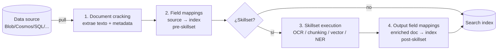
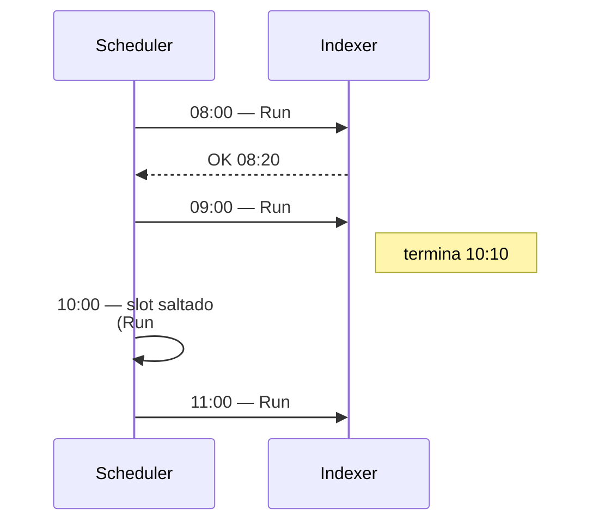
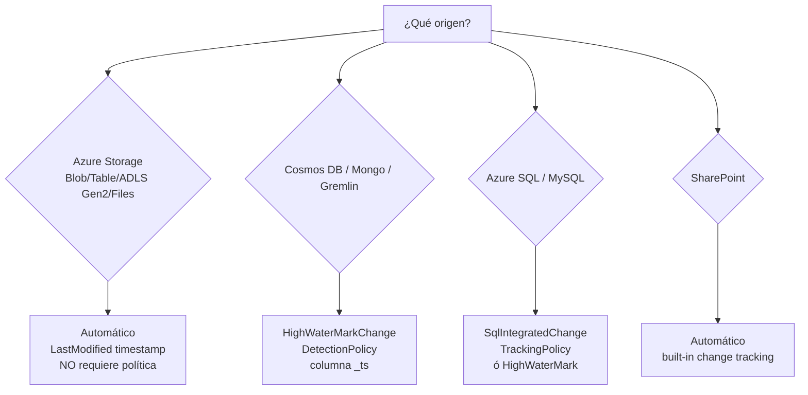

# Azure AI Search — Data sources, indexers y change/delete detection

> [!abstract] TL;DR
> Un **indexer** es un *crawler* "pull model" que conecta un **data source** (Blob, ADLS Gen2, Cosmos DB, SQL, Tables, Files, OneLake, …) con un **index** y, opcionalmente, dispara un **skillset**. Ejecuta cuatro fases: document cracking → field mappings → skillset execution → output field mappings. Se programa con `schedule.interval` en **ISO 8601 XSD dayTimeDuration** (mínimo `PT5M`, máximo `PT24H`). Detecta cambios con **HighWaterMark** o **SqlIntegratedChangeTracking**; detecta borrados con **SoftDeleteColumn** o **NativeBlobSoftDelete**. Mantiene **hasta 50 ejecuciones** en el `executionHistory`, **debug session opera sobre 1 documento** y la conexión recomendada AI-103 es **managed identity** con `ResourceId=...`.

## 🎯 Relevancia en el examen

Tipo de pregunta y frecuencia:

- 🔥🔥🔥 Drag-and-drop de **fases del indexer** (cracking, field mapping, skillset, output field mapping) en orden correcto.
- 🔥🔥🔥 Diferencia entre **`fieldMappings` (pre-skillset)** y **`outputFieldMappings` (post-skillset)**.
- 🔥🔥 Identificar la **política de change detection** correcta por tipo de origen (Cosmos → `_ts` high watermark; SQL → integrated change tracking; Blob → automático por `LastModified`).
- 🔥🔥 Detectar borrados: `SoftDeleteColumnDeletionDetectionPolicy` vs `NativeBlobSoftDeleteDeletionDetectionPolicy`.
- 🔥🔥 `parsingMode` por tipo de blob (`default`, `text`, `json`, `jsonArray`, `jsonLines`, `delimitedText`, `markdown`).
- 🔥 Connection strings: full key, **`ResourceId=...` (managed identity)**, SAS de cuenta, SAS de contenedor.
- 🔥 `schedule.interval` mínimo (PT5M) y máximo (PT24H). XSD dayTimeDuration.

## 📖 Concepto en profundidad

### Pull model vs push model

Azure AI Search tiene dos vías para llenar un índice:

| Modelo | Quién lleva la iniciativa | Uso típico |
|---|---|---|
| **Push** (REST `/indexes/<name>/docs/index` o SDK `upload_documents`) | Tu código empuja documentos al índice (cualquier origen). | Streaming/eventos, freshness < 5 min, datos no nativos en Azure. |
| **Pull (indexer)** | Search "tira" del origen vía un indexer programado. | Orígenes Azure soportados, ingesta declarativa, change/delete detection automática o por política. |

> [!warning] Frecuencia mínima
> Un indexer programado **no puede correr con intervalo inferior a 5 minutos** (`PT5M`). Si necesitas latencia menor → usa el **push model**.

### Anatomía de un indexer (4 fases)



> [!important] Field mappings vs Output field mappings
> - **`fieldMappings`**: source field → index field. Se aplica **antes** del skillset, sobre documentos crudos. **Opcional** (solo si hay discrepancias de nombre/tipo).
> - **`outputFieldMappings`**: skill output (rama del enriched document, ej. `/document/pages/*/keyPhrases/*`) → index field. Se aplica **después** del skillset. **Obligatorio** para cualquier output de skill que deba aterrizar en el índice.

### Relación N:N entre indexers, data sources e indexes

> Un indexer consume **una** data source y escribe en **un** index. Pero:
> - Una data source puede ser reutilizada por varios indexers.
> - Varios indexers pueden escribir al mismo index (consolidar múltiples contenedores).
> - Un mismo indexer puede correr en paralelo con otros indexers diferentes (límite: 1 indexer job por search unit; n réplicas × n particiones = jobs concurrentes para text-based).

## 🏗️ Cómo se hace

### 1) Data sources soportados (connector types verbatim)

| Source | `type` (verbatim) | Estado |
|---|---|---|
| Azure Blob Storage | `azureblob` | GA |
| Azure Data Lake Storage Gen2 | `adlsgen2` | GA |
| Azure Cosmos DB for NoSQL | `cosmosdb` | GA |
| Azure SQL Database / SQL Managed Instance / SQL Server on Azure VM | `azuresql` | GA |
| Azure Table Storage | `azuretable` | GA |
| Microsoft OneLake (Fabric) | `onelake` | GA |
| Azure Files | `azurefile` | ⚠️ Preview |
| Azure Database for MySQL | `mysql` | ⚠️ Preview |
| SharePoint in Microsoft 365 | `sharepoint` | ⚠️ Preview |
| Cosmos DB for MongoDB | `cosmosdb` (con conn-string Mongo) | ⚠️ Preview |
| Cosmos DB for Apache Gremlin | `cosmosdb` | ⚠️ Preview |

> [!warning] Cosmos DB for Cassandra **NO** está soportado.

### 2) Connection strings soportadas (Blob ejemplo, aplica análogo a otros)

| Tipo | Sintaxis | AI-103 keyless |
|---|---|---|
| Full account key | `DefaultEndpointsProtocol=https;AccountName=<a>;AccountKey=<k>;` | ❌ |
| **Managed identity (recomendada)** | `ResourceId=/subscriptions/<sub>/resourceGroups/<rg>/providers/Microsoft.Storage/storageAccounts/<acct>/;` | ✅ |
| Account SAS | `BlobEndpoint=https://<a>.blob.core.windows.net/;SharedAccessSignature=?sv=...` | ❌ |
| Container SAS | `ContainerSharedAccessUri=https://<a>.blob.core.windows.net/<c>?sv=...` | ❌ |

> [!tip] Managed identity setup
> 1. Habilita system-assigned (o asigna user-assigned) MI al Search service.
> 2. Asigna rol **`Storage Blob Data Reader`** (o `Storage Blob Data Contributor` si escribe back).
> 3. En la data source, usa `connectionString = "ResourceId=..."` (sin AccountKey).
> 4. Verifica con `Get Data Source` que no aparece ninguna clave.

### 3) Crear data source + indexer end-to-end con Python SDK

> [!note] Paquete: `azure-search-documents`. Cliente: `SearchIndexerClient`.

```python
# pip install azure-search-documents azure-identity
from datetime import timedelta
from azure.identity import DefaultAzureCredential
from azure.search.documents.indexes import SearchIndexerClient
from azure.search.documents.indexes.models import (
    SearchIndexerDataSourceConnection,
    SearchIndexerDataContainer,
    SearchIndexer,
    IndexingSchedule,
    IndexingParameters,
    IndexingParametersConfiguration,
    FieldMapping,
    FieldMappingFunction,
    HighWaterMarkChangeDetectionPolicy,
    SoftDeleteColumnDeletionDetectionPolicy,
)

endpoint = "https://<your-service>.search.windows.net"
client = SearchIndexerClient(endpoint=endpoint, credential=DefaultAzureCredential())

# --- 1. Data source (Blob via managed identity) ---
data_source = SearchIndexerDataSourceConnection(
    name="my-blob-ds",
    type="azureblob",
    connection_string=(
        "ResourceId=/subscriptions/<sub>/resourceGroups/<rg>/"
        "providers/Microsoft.Storage/storageAccounts/<acct>/;"
    ),
    container=SearchIndexerDataContainer(name="docs", query=None),  # query = virtual folder
)
client.create_or_update_data_source_connection(data_source)

# --- 2. Indexer ---
indexer = SearchIndexer(
    name="my-blob-indexer",
    data_source_name="my-blob-ds",
    target_index_name="my-index",
    skillset_name="my-skillset",  # opcional
    schedule=IndexingSchedule(
        interval=timedelta(hours=1),          # PT1H — mínimo PT5M, máximo PT24H
        start_time=None,                       # UTC; None = ahora
    ),
    parameters=IndexingParameters(
        batch_size=10,                         # Blob default = 10; otros = 1000
        max_failed_items=10,                   # default 0 (fail-fast). -1 = ilimitado
        max_failed_items_per_batch=5,
        configuration=IndexingParametersConfiguration(
            data_to_extract="contentAndMetadata",   # | "storageMetadata" | "allMetadata"
            image_action="generateNormalizedImages", # OCR/Vision sobre imágenes embebidas
            parsing_mode="default",                  # | text | json | jsonArray | jsonLines | delimitedText | markdown
            indexed_file_name_extensions=".pdf,.docx",
            excluded_file_name_extensions=".png,.jpeg",
        ),
    ),
    field_mappings=[
        FieldMapping(
            source_field_name="metadata_storage_path",
            target_field_name="id",
            mapping_function=FieldMappingFunction(name="base64Encode"),
        )
    ],
    output_field_mappings=[],  # rellenar si hay skillset
)
client.create_or_update_indexer(indexer)

# --- 3. Forzar una corrida + leer estado ---
client.run_indexer("my-blob-indexer")
status = client.get_indexer_status("my-blob-indexer")
print(status.status, status.last_result.status, status.last_result.items_processed)
for err in status.last_result.errors:
    print(err.key, err.error_message)
```

### 4) Equivalente REST (Create Indexer)

```http
PUT https://<svc>.search.windows.net/indexers/my-blob-indexer?api-version=2026-04-01
Content-Type: application/json
api-key: <admin-key>

{
  "name": "my-blob-indexer",
  "dataSourceName": "my-blob-ds",
  "targetIndexName": "my-index",
  "skillsetName": "my-skillset",
  "schedule": { "interval": "PT1H", "startTime": "2026-05-23T00:00:00Z" },
  "parameters": {
    "batchSize": 10,
    "maxFailedItems": 10,
    "maxFailedItemsPerBatch": 5,
    "configuration": {
      "dataToExtract": "contentAndMetadata",
      "imageAction": "generateNormalizedImages",
      "parsingMode": "default",
      "indexedFileNameExtensions": ".pdf,.docx",
      "executionEnvironment": "standard"
    }
  },
  "fieldMappings": [
    { "sourceFieldName": "metadata_storage_path",
      "targetFieldName": "id",
      "mappingFunction": { "name": "base64Encode" } }
  ],
  "outputFieldMappings": []
}
```

### 5) Azure CLI

```bash
# Crear data source (vía REST helper):
az search datasource create --service-name <svc> --resource-group <rg> \
  --name my-blob-ds --type azureblob \
  --connection-string "ResourceId=/subscriptions/.../storageAccounts/<acct>/;" \
  --container name=docs

# Crear indexer:
az search indexer create --service-name <svc> --resource-group <rg> \
  --name my-blob-indexer --data-source-name my-blob-ds \
  --target-index-name my-index

# Run / status / reset:
az search indexer run    --service-name <svc> -g <rg> --name my-blob-indexer
az search indexer status --service-name <svc> -g <rg> --name my-blob-indexer
az search indexer reset  --service-name <svc> -g <rg> --name my-blob-indexer
```

### 6) Bicep (data source + indexer)

```bicep
resource ds 'Microsoft.Search/searchServices/dataSources@2024-03-01-preview' = {
  parent: searchService
  name: 'my-blob-ds'
  properties: {
    type: 'azureblob'
    credentials: {
      connectionString: 'ResourceId=/subscriptions/${subId}/resourceGroups/${rg}/providers/Microsoft.Storage/storageAccounts/${acct}/;'
    }
    container: { name: 'docs' }
    dataChangeDetectionPolicy: null  // Blob: cambio automático por LastModified
    dataDeletionDetectionPolicy: {
      '@odata.type': '#Microsoft.Azure.Search.NativeBlobSoftDeleteDeletionDetectionPolicy'
    }
  }
}

resource ix 'Microsoft.Search/searchServices/indexers@2024-03-01-preview' = {
  parent: searchService
  name: 'my-blob-indexer'
  properties: {
    dataSourceName: ds.name
    targetIndexName: 'my-index'
    schedule: { interval: 'PT1H' }
    parameters: {
      batchSize: 10
      maxFailedItems: 10
      configuration: {
        dataToExtract: 'contentAndMetadata'
        parsingMode: 'default'
        indexedFileNameExtensions: '.pdf,.docx'
      }
    }
  }
}
```

## 📊 Schedule — `interval` y `startTime`

| Propiedad | Detalle |
|---|---|
| `interval` (requerido) | **XSD dayTimeDuration** (subset ISO 8601), patrón `P(nD)(T(nH)(nM))`. Ej.: `PT5M`, `PT2H`, `P1D`. |
| Mínimo | **5 minutos** (`PT5M`). |
| Máximo | **24 horas / 1440 minutos** (`PT24H` / `P1D`). |
| `startTime` (opcional) | UTC ISO 8601. Si se omite → ahora. Puede ser pasado (se calcula como si llevara corriendo). |
| Sin `schedule` | Indexer **solo on-demand**. |
| Comportamiento si run actual > interval | El siguiente run **se pospone** hasta el siguiente slot; no se solapan ejecuciones del mismo indexer. |
| Failure persistente sobre el mismo doc | El scheduler degrada el ritmo hasta **2 h o 24 h** entre runs hasta que se resuelva. |

### Diagrama del solapamiento



## 🔁 Change detection (incremental)



### High Watermark (Cosmos DB, custom timestamps)

```json
"dataChangeDetectionPolicy": {
  "@odata.type": "#Microsoft.Azure.Search.HighWaterMarkChangeDetectionPolicy",
  "highWaterMarkColumnName": "_ts"
}
```

- La columna **debe ser sortable** y monótonamente creciente.
- En Cosmos DB SQL API, `_ts` es el timestamp Unix interno (entero) — candidato natural.
- El indexer guarda internamente el último high-water tracked y solo procesa filas con valor mayor.

### SQL Integrated Change Tracking (Azure SQL DB)

```json
"dataChangeDetectionPolicy": {
  "@odata.type": "#Microsoft.Azure.Search.SqlIntegratedChangeTrackingPolicy"
}
```

- Requiere **`ALTER DATABASE ... SET CHANGE_TRACKING = ON`** en SQL Server primero.
- Detecta inserts, updates **y deletes** sin necesidad de policy separada de borrado (en SQL).

## 🗑️ Delete detection

> [!important] La detección de cambios es automática (o por política); **la detección de borrado NO lo es** salvo SQL Integrated CT. Sin política, los documentos borrados en origen quedan **huérfanos en el índice**.

### Opción A — Soft delete por columna/metadata (genérico)

```json
"dataDeletionDetectionPolicy": {
  "@odata.type": "#Microsoft.Azure.Search.SoftDeleteColumnDeletionDetectionPolicy",
  "softDeleteColumnName": "IsDeleted",
  "softDeleteMarkerValue": "true"
}
```

- Funciona en **Blob** (custom metadata), **Cosmos DB**, **SQL**, **Tables**, **Files**.
- Flujo:
  1. Marca el doc en origen (`IsDeleted=true`).
  2. Indexer corre → borra el search document del índice.
  3. *Después*, eliminas físicamente el doc en origen (si lo deseas).

### Opción B — Native Blob Soft Delete (solo Blob Storage)

```json
"dataDeletionDetectionPolicy": {
  "@odata.type": "#Microsoft.Azure.Search.NativeBlobSoftDeleteDeletionDetectionPolicy"
}
```

- Requiere **soft delete** habilitado en la cuenta Blob.
- **NO compatible con blob versioning habilitado**.
- **NO funciona en Azure Files** (solo Blob/ADLS Gen2 blob containers).
- La política **debe estar desde el primer run** del indexer. Añadirla después no recupera deletes anteriores.

| Característica | SoftDeleteColumn | NativeBlobSoftDelete |
|---|---|---|
| Orígenes | Blob (metadata), Cosmos, SQL, Tables, Files | Solo Blob Storage / ADLS Gen2 blobs |
| Setup origen | Añadir columna/metadata flag | Habilitar soft delete en cuenta Storage |
| Versioning compatible | Sí | **No** |
| Restauración | Cambia el flag → reindex | Restore blob + resave metadata para actualizar `LastModified` |

## 📦 Parsing modes (Blob indexer)

| `parsingMode` | Comportamiento | Caso típico |
|---|---|---|
| `default` | 1 blob = 1 search doc. Extrae texto y metadata según content-type. | PDFs, Office, HTML. |
| `text` | Trata el blob entero como **plain text UTF-8**. | Logs, .txt grandes. |
| `json` | 1 objeto JSON por blob = 1 doc. | Archivo único `{ ... }`. |
| `jsonArray` | Cada elemento del array = 1 doc (one-to-many). | `[{...}, {...}, ...]`. |
| `jsonLines` | 1 doc por línea (JSONL/NDJSON). | Logs ML, telemetría. |
| `delimitedText` | CSV-like, configurable con `firstLineContainsHeaders`, `delimitedTextHeaders`, `delimitedTextDelimiter`. | CSV/TSV → one-to-many. |
| `markdown` | Parsea estructura Markdown (headers, secciones). | Repos de docs MD. |

## 🧯 `dataToExtract` y `imageAction`

| Property | Valores | Notas |
|---|---|---|
| `dataToExtract` | `contentAndMetadata` (default), `storageMetadata`, `allMetadata` | `contentAndMetadata` = texto + metadata. `storageMetadata` = solo propiedades blob estándar. `allMetadata` = blob props + metadata específica del content-type. |
| `imageAction` | `none` (default), `generateNormalizedImages`, `generateNormalizedImagePerPage` | Necesario para OCR/Vision sobre PDFs con imágenes embebidas. Coste extra. |
| `failOnUnsupportedContentType` | `true`/`false` | Default `true`: para indexación si tipo desconocido. |
| `failOnUnprocessableDocument` | `true`/`false` | Default `true`. |
| `indexStorageMetadataOnlyForOversizedDocuments` | `true`/`false` | Para blobs que exceden límite — al menos guarda metadata. |
| `executionEnvironment` | `standard`, `private` | `private` solo en SKU Standard2+. |

## 🎯 Field mappings (pre-skillset) — mapping functions

| Función | Uso |
|---|---|
| `base64Encode` | Codifica el valor (típico para `metadata_storage_path` cuando es la key del índice — admite `/` y caracteres especiales). |
| `base64Decode` | Inverso. |
| `urlEncode` / `urlDecode` | URL-safe. |
| `extractTokenAtPosition` | Particiona por delimiter y extrae token N. |
| `jsonArrayToStringCollection` | Convierte string JSON-array en colección de strings. |
| `fixedLengthEncoding` | Compatibilidad con keys que requieren longitud fija. |

Ejemplo:

```json
"fieldMappings": [
  {
    "sourceFieldName": "metadata_storage_path",
    "targetFieldName": "id",
    "mappingFunction": { "name": "base64Encode", "parameters": { "useHttpServerUtilityUrlTokenEncode": true } }
  }
]
```

## 🛡️ Error handling

| Parámetro | Default | Valores | Significado |
|---|---|---|---|
| `maxFailedItems` | **0** (fail-fast) | `-1`, `null`, `0`, positivo | Total de fallos tolerados en todo el run. `-1` = ilimitado. |
| `maxFailedItemsPerBatch` | **0** | mismos valores | Fallos tolerados por batch. |
| `batchSize` | **10 (Blob)** / **1000 (la mayoría)** | 1–1000 | Trade-off velocidad vs. memoria/skill rate-limits. |

> [!warning] **Default 0 = fail-fast**
> Si no defines `maxFailedItems`, un solo fallo aborta el indexer. En producción, sube a `10`–`50` y monitoriza errores en `last_result.errors`.

## 🔍 Indexer status y debug

### `executionHistory` y `last_result`

- El servicio mantiene **hasta 50 ejecuciones recientes** en orden cronológico inverso.
- `lastResult` incluye: `status` (success/failed/inProgress/transientFailure), `itemsProcessed`, `itemsFailed`, `errors[]`, `warnings[]`, `initialTrackingState`, `finalTrackingState`.

```python
status = client.get_indexer_status("my-blob-indexer")
print(status.status)                        # idle | running | error
print(status.last_result.status)            # success | transientFailure | inProgress | reset
print(status.last_result.items_processed)
for run in status.execution_history[:5]:    # historial reciente
    print(run.start_time, run.end_time, run.items_processed, run.items_failed)
```

### Debug session

> [!tip] Quirúrgico: **una debug session procesa exactamente 1 documento**
> Permite inspeccionar input/output de **cada skill** del skillset paso a paso, ver el enriched document como árbol, y editar el skillset en caliente. Nunca son 10 docs (mito común).

## 🪤 Trampas del examen

1. **`schedule.interval` mínimo `PT5M`**, máximo `PT24H` (no `PT1M`, no `PT30S`).
2. **`maxFailedItems` default = `0`** (fail-fast) — no es `-1`. Olvidarlo causa "el indexer murió por 1 PDF corrupto".
3. **Detección de borrado NO es automática** (excepto SQL integrated change tracking). Hay que añadir `dataDeletionDetectionPolicy` explícita.
4. **High watermark column debe ser sortable y monótona creciente**. `_ts` en Cosmos sí; campos `DateTime` con resolución < milisegundos pueden duplicar.
5. **`dataToExtract: "contentAndMetadata"`** es lo necesario para texto + metadata. `"storageMetadata"` **no extrae contenido**, solo propiedades del blob.
6. **`imageAction: "generateNormalizedImages"`** es obligatorio para OCR de imágenes embebidas (PDFs escaneados). Sin él, las imágenes se ignoran.
7. **Connection string keyless = `ResourceId=...`** (managed identity). Si el examen pide "AI-103 keyless" rechaza opciones con `AccountKey=...`.
8. **`executionHistory`** retiene **50** ejecuciones máximo, no ilimitadas.
9. **Debug session = 1 documento**, no 10 ni "todos".
10. **`fieldMappings` (pre-skillset) ≠ `outputFieldMappings` (post-skillset)**. `outputFieldMappings` es **obligatorio** si quieres que outputs del skillset aterricen en el índice.
11. **Parsing mode debe coincidir con el contenido**: usar `default` sobre un JSON Lines pierde estructura → 1 blob = 1 doc gigante en `content`.
12. **`NativeBlobSoftDelete` incompatible con blob versioning** y solo aplica a Blob Storage (no Azure Files, no Cosmos, no SQL).
13. **La política de borrado debe estar desde el primer run.** Añadirla después **no recupera** documentos huérfanos previos — hay que crear un índice nuevo.
14. **Cosmos DB for Cassandra NO está soportado.** Para Mongo y Gremlin → preview.
15. **Cambio de directorio en ADLS Gen2 no actualiza `LastModified`** de los blobs hijos → el indexer **no reindexa** tras un rename. Hay que tocar metadata para forzar.
16. **Un indexer = una data source y un target index.** "Indexador multi-source" no existe; se hacen varios indexers contra el mismo índice.
17. **`base64Encode` en field mapping es típico para `metadata_storage_path`** como key del índice (paths con `/` no son keys válidas tal cual).

## 🧠 Mnemotecnia

- **"CRACK-MAP-SKILL-OUT"** — orden de las 4 fases del indexer.
- **"5M-24H"** — rango de `schedule.interval`.
- **"50 runs, 1 doc debug"** — retención de history y tamaño de debug session.
- **"HighWater Cosmos, IntegratedCT SQL, LastModified Blob"** — política de change detection por origen.
- **"Soft-COL-name + MARKER-value"** — únicas dos props de `SoftDeleteColumnDeletionDetectionPolicy`.
- **"RID = keyless"** — `ResourceId=...` → managed identity, AI-103 friendly.

## 🔗 Conceptos relacionados

- [[search-azure-ai-search-overview]]
- [[search-index-design]]
- [[search-skillsets-builtin-skills]]
- [[search-skillsets-custom-skills]]
- [[search-rag-ingestion-pipeline]]
- [[search-integrated-vectorization]]
- [[search-hybrid-search]]
- [[plan-data-ingestion-index-health]]
- [[plan-security-managed-identity]]
- [[plan-retrieval-indexing-method-selection]]

## ❓ Autotest

**Q1.** Quieres que un indexer Cosmos DB (NoSQL) procese solo documentos modificados desde la última corrida. ¿Qué configuras en la data source?

- a) `dataChangeDetectionPolicy` con `SqlIntegratedChangeTrackingPolicy` sobre la columna `_ts`.
- b) `dataChangeDetectionPolicy` con `HighWaterMarkChangeDetectionPolicy` con `highWaterMarkColumnName: "_ts"`.
- c) No hay que configurar nada, Cosmos DB tiene change detection automático como Blob.
- d) `dataDeletionDetectionPolicy` con `SoftDeleteColumnDeletionDetectionPolicy`.

<details><summary>Respuesta</summary>

**b)** `HighWaterMarkChangeDetectionPolicy` con `_ts` (timestamp interno de Cosmos). `SqlIntegratedChangeTrackingPolicy` (a) es solo para Azure SQL. Cosmos no es automático (c). (d) es para borrados, no para cambios.

</details>

**Q2.** Tu indexer Blob falla en cuanto encuentra un PDF corrupto, abortando 4 000 documentos restantes. ¿Cuál es la causa raíz?

- a) El `batchSize` está demasiado alto.
- b) Falta una skillset.
- c) `maxFailedItems` está en su valor por defecto (`0`).
- d) El `parsingMode` es `default` y debería ser `text`.

<details><summary>Respuesta</summary>

**c)** El default de `maxFailedItems` es **0** (fail-fast). Subiendo a, p. ej., `50` el indexer continúa tras 50 fallos. Adicionalmente puedes setear `failOnUnsupportedContentType=false` y `failOnUnprocessableDocument=false`.

</details>

**Q3.** Quieres ejecutar un indexer cada 3 minutos. ¿Qué `schedule.interval` configuras?

- a) `PT3M`.
- b) `PT5M`, porque es el mínimo permitido.
- c) `PT180S`.
- d) No usas indexer; implementas push model con `IndexDocumentsBatch`.

<details><summary>Respuesta</summary>

**d)** Correcto. El mínimo es **5 minutos** (`PT5M`), no se puede ir más rápido con indexer. Para latencia < 5 min hay que usar el **push model**. (b) técnicamente es la frecuencia máxima del indexer, pero no satisface el requisito de 3 min. (a) y (c) serían rechazados por el servicio.

</details>

**Q4.** ¿Cuál es la diferencia clave entre `fieldMappings` y `outputFieldMappings`?

- a) `fieldMappings` es para Cosmos y `outputFieldMappings` es para Blob.
- b) `fieldMappings` mapea source→index antes del skillset; `outputFieldMappings` mapea outputs de skills→index después del skillset y es **obligatorio** si quieres aterrizar enrichments.
- c) Solo cambia la sintaxis; son funcionalmente equivalentes.
- d) `outputFieldMappings` sustituye a `fieldMappings` cuando hay skillset.

<details><summary>Respuesta</summary>

**b)** `fieldMappings` actúa **antes** del skillset (sobre el documento crudo) y es opcional; `outputFieldMappings` actúa **después** del skillset (sobre el enriched document tree) y es **obligatorio** para que los outputs del skillset acaben en el índice.

</details>

**Q5.** Tras eliminar 500 blobs de la cuenta de Storage, los documentos siguen apareciendo en búsquedas del índice. La política `NativeBlobSoftDeleteDeletionDetectionPolicy` fue añadida ayer. ¿Cuál es la solución correcta?

- a) Resetear el indexer con `Reset Indexer` y reejecutar.
- b) Habilitar blob versioning en la cuenta de Storage.
- c) Crear un nuevo índice e indexer con la política desde el primer run; los documentos huérfanos previos no se recuperan.
- d) Cambiar a `SoftDeleteColumnDeletionDetectionPolicy`.

<details><summary>Respuesta</summary>

**c)** La política de borrado **debe estar desde la primera corrida**. Documentos borrados antes de añadirla quedan huérfanos para siempre en ese índice; la única solución consistente es reconstruir índice + indexer con la política activa desde el inicio. Además, **`NativeBlobSoftDelete` es incompatible con blob versioning** (descarta b).

</details>

## ✅ Control de calidad (auto-rúbrica)

| Dimensión | Nota |
|---|---|
| Completitud (todos los sub-puntos del brief) | 9.7 |
| Exactitud técnica (verificada vs Microsoft Learn 2026-05-23) | 9.8 |
| Alineación al examen AI-103 (trampas, escenarios, peso) | 9.6 |
| Claridad pedagógica (tablas, mermaid, mnemónicos, autotest) | 9.5 |

*Verificado a fecha 2026-05-23 contra Microsoft Learn (search-indexer-overview, search-howto-create-indexers, search-howto-schedule-indexers, search-how-to-index-azure-blob-storage, search-how-to-index-azure-blob-changed-deleted).*
