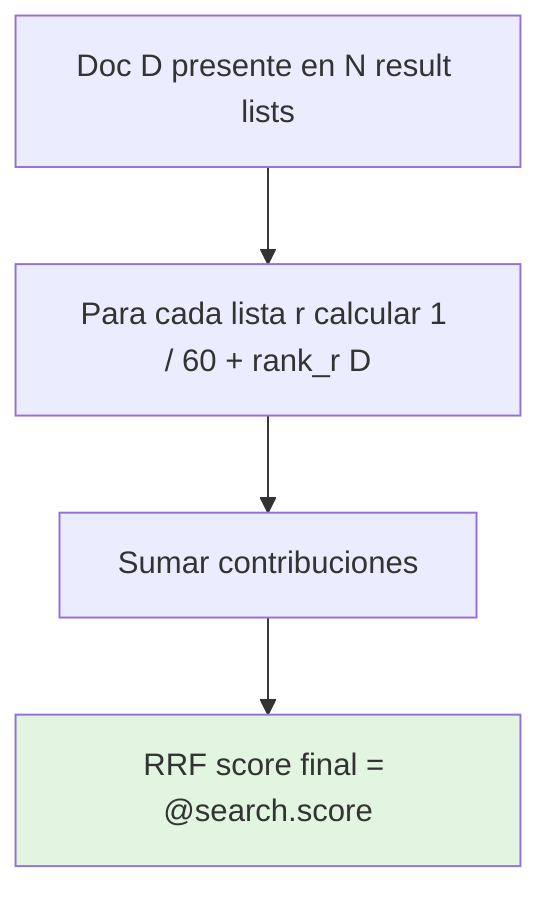
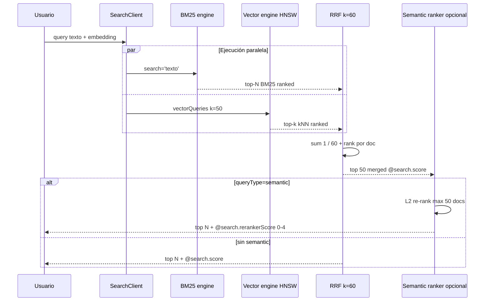
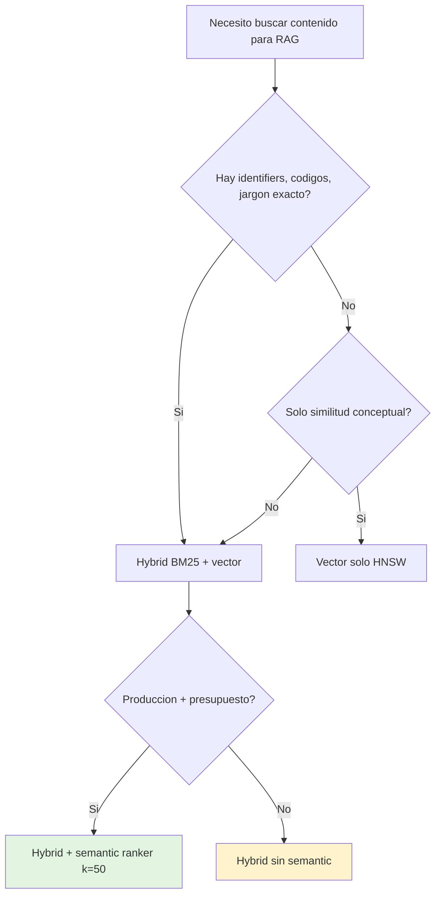

# Hybrid search en Azure AI Search (BM25 + vector + RRF)

> [!abstract] TL;DR
> **Hybrid search** es una **única request** que ejecuta en paralelo una **full-text query (BM25)** y una o más **vector queries (HNSW/eKNN)**, fusionando los rankings mediante **Reciprocal Rank Fusion (RRF)** con fórmula `score(d) = Σ 1 / (k + rank(d))` y **`k = 60` constante** (no confundible con el `k` de kNN). El resultado unificado se expone en `@search.score`. Opcionalmente, con `queryType=semantic` + `semanticConfiguration`, los **top 50** post-RRF se re-ordenan por **semantic ranker** y se devuelven en `@search.rerankerScore` (0.00 – 4.00). Microsoft recomienda **hybrid + semantic ranker** como **default para RAG**: combina precisión léxica (códigos, jargon, nombres propios) con similitud semántica (parafraseo, sinónimos) y supera en benchmarks tanto a vector solo como a BM25 solo.

## Relevancia en el examen

| Aspecto | Detalle |
|---|---|
| Frecuencia | 🔥🔥🔥 — pregunta casi segura en el dominio E (10-15 %). Suele aparecer combinada con grounding/RAG. |
| Tipos de pregunta | Identificar el valor por defecto de `k` en RRF (60). Diferenciar `@search.score` (RRF) vs `@search.rerankerScore` (semantic). Elegir el patrón correcto (solo BM25 / solo vector / hybrid / hybrid + semantic). Saber que semantic ranker re-rankea **máximo 50** documentos. Reconocer `query_type="semantic"` + `semantic_configuration_name` en el SDK Python. Saber que filtros se aplican a **ambos** subqueries. |
| Escenarios típicos | "El usuario busca un código de producto y una descripción parafraseada → ¿qué configurar?" (hybrid). "RAG en producción con mejor relevancia medida → ¿qué activar?" (hybrid + semantic ranker, `k=50`). "Los resultados muestran scores muy bajos (~0.03) pero relevantes → ¿es normal?" (sí, así es RRF). "¿Se puede cambiar el k=60 de RRF?" (es una **constante interna**, no se expone en la API pública). |

## Concepto en profundidad

### 1 · Definición y arquitectura

> **Hybrid search** es *"a single query request that includes both `search` and `vectors` query parameters; runs full-text search and vector search in parallel; merges results from each query by using Reciprocal Rank Fusion (RRF)"* — Microsoft Learn (verbatim).

Algoritmos involucrados:

- **BM25** sobre los inverted indexes (campos `searchable`).
- **HNSW** (Hierarchical Navigable Small World, ANN) o **exhaustiveKnn (eKNN)** sobre los vector indexes.
- **RRF** sobre los rankings independientes.
- **Semantic ranker** (opcional) como **post-procesamiento** sobre el top 50 del merge.

```mermaid
flowchart LR
    Q[Query usuario] --> T[search='texto']
    Q --> V[vectorQueries 'vector embedding']
    T --> BM25[BM25 ranking<br/>inverted index]
    V --> HNSW[HNSW / eKNN<br/>vector index]
    BM25 --> RRF{Reciprocal<br/>Rank Fusion<br/>k=60}
    HNSW --> RRF
    RRF -->|@search.score| TOP[Top 50 merged]
    TOP -->|opcional queryType=semantic| SR[Semantic ranker<br/>L2 re-rank]
    SR -->|@search.rerankerScore 0-4| OUT[Top N final]
    TOP -.->|sin semantic| OUT
```

### 2 · Reciprocal Rank Fusion (RRF) — el corazón

Fórmula oficial (Microsoft Learn):

> *"The score is calculated as `1 / (rank + k)`, where `rank` is the position of the document in the list and `k` is a constant. Experiments show the algorithm performs best when you set `k` to a small value, such as 60."*

$$
\text{RRF}(d) = \sum_{r \in \text{result-lists}} \frac{1}{k + \text{rank}_r(d)}, \qquad k = 60
$$



> [!warning] El `k` de RRF NO es el `k` de kNN
> Microsoft lo dice **literalmente**: *"this `k` value is a constant in the RRF algorithm and entirely separate from the `k` that controls the number of nearest neighbors"*. En la API REST/SDK aparecen ambos:
> - `vectorQueries[].k` / `k_nearest_neighbors` → **kNN, controlas tú** (ej. 10, 50).
> - `k` interno de RRF → **constante 60, no se expone**, no se puede cambiar desde la API pública.

#### Implicaciones numéricas

- El **máximo teórico** de `@search.score` cuando un documento aparece **primero** en *N* listas es ≈ `N · (1 / 61) ≈ N · 0.0164`. Por eso scores hybrid de ~0.03 son normales y NO comparables con scores de vector puro (0.33–1.0 en cosine).
- Más subqueries (multi-vector + BM25) → score teóricamente mayor y mejor estabilidad de ranking.
- Documentos que aparecen en **varias listas** reciben **suma** de inversos → boost por coincidencia multimodal.

### 3 · Estructura de la query hybrid

#### Mínimo viable (REST)

```http
POST https://{service}.search.windows.net/indexes/{index}/docs/search?api-version=2026-04-01
Content-Type: application/json

{
  "search": "historic hotel walk to restaurants and shopping",
  "vectorQueries": [
    {
      "kind": "vector",
      "vector": [0.0194, 0.0040, -0.0078, ...],
      "fields": "DescriptionVector",
      "k": 10,
      "exhaustive": true
    }
  ],
  "select": "HotelName, Description, Address/City",
  "top": 10
}
```

| Campo | Rol |
|---|---|
| `search` | Texto plano → BM25 sobre `searchable` fields. |
| `vectorQueries[].kind` | `"vector"` (o `"text"` con vectorizer integrado). |
| `vectorQueries[].vector` | Embedding pre-generado (típicamente Azure OpenAI). |
| `vectorQueries[].k` | **Top-K kNN** que se pasan al RRF ranker. |
| `vectorQueries[].fields` | Campo(s) `Collection(Edm.Single)` destino. |
| `vectorQueries[].exhaustive` | `true` → eKNN (exacto, lento); `false`/omit → HNSW (ANN, default). |
| `select` | Campos `retrievable` a devolver (excluir vector). |
| `top` | Nº final de resultados **post-RRF** (default 50). |

#### Con semantic ranker (recomendado producción)

```http
POST .../docs/search?api-version=2026-04-01
{
  "search": "historic hotel walk to restaurants and shopping",
  "vectorQueries": [
    { "kind": "vector", "vector": [...], "fields": "DescriptionVector", "k": 50 }
  ],
  "queryType": "semantic",
  "semanticConfiguration": "my-semantic-config",
  "captions": "extractive",
  "answers": "extractive",
  "top": 50,
  "select": "HotelName, Description, Tags"
}
```

> [!tip] Regla de oro Microsoft (verbatim)
> *"Whenever you use semantic ranking with vectors, make sure `k` is set to 50. Semantic ranker uses up to 50 matches as input. Specifying less than 50 deprives the semantic ranking models of necessary inputs."*

## Cómo se hace (Python SDK / REST)

### Hybrid básico (Python, sin semantic) — verificado contra docs

```python
import os
from azure.identity import DefaultAzureCredential
from azure.search.documents import SearchClient
from azure.search.documents.models import VectorizedQuery

endpoint   = os.environ["AZURE_SEARCH_ENDPOINT"]
index_name = "hotels-sample"
credential = DefaultAzureCredential()

client = SearchClient(endpoint=endpoint, index_name=index_name, credential=credential)

# Embedding pre-generado (ej. text-embedding-3-small de Azure OpenAI)
query_vector = [-0.009154141, 0.018708462, ...]

vector_query = VectorizedQuery(
    vector=query_vector,
    k_nearest_neighbors=10,                # k de kNN (NO el k=60 de RRF)
    fields="DescriptionVector",
    exhaustive=True                        # eKNN exhaustivo; omite → HNSW ANN
)

results = client.search(
    search_text="historic hotel walk to restaurants and shopping",   # BM25
    vector_queries=[vector_query],                                   # vector
    select=["HotelName", "Description", "Address/City"],
    top=10
)

for r in results:
    print(r["@search.score"], r["HotelName"])     # @search.score == RRF
```

### Hybrid + semantic ranker (Python, producción RAG)

```python
from azure.search.documents.models import VectorizedQuery, QueryType, QueryAnswerType, QueryCaptionType

vector_query = VectorizedQuery(
    vector=query_vector,
    k_nearest_neighbors=50,                # CLAVE: 50 para alimentar al ranker
    fields="DescriptionVector"
)

results = client.search(
    search_text="historic hotel walk to restaurants and shopping",
    vector_queries=[vector_query],
    query_type=QueryType.SEMANTIC,                       # "semantic"
    semantic_configuration_name="my-semantic-config",    # creada en el index
    query_caption=QueryCaptionType.EXTRACTIVE,           # @search.captions
    query_answer=QueryAnswerType.EXTRACTIVE,             # @search.answers
    top=10,
    select=["HotelName", "Description", "Tags"]
)

for r in results:
    rrf  = r["@search.score"]            # RRF
    rerk = r["@search.rerankerScore"]    # 0.00 – 4.00 (semantic L2)
    print(f"RRF={rrf:.4f}  RERANKER={rerk:.2f}  {r['HotelName']}")
```

### Hybrid con filtro OData

```python
results = client.search(
    search_text="historic hotel",
    vector_queries=[vector_query],
    filter="ParkingIncluded and Rating gt 3",
    vector_filter_mode="preFilter",      # preFilter (default) | postFilter | strictPostFilter (preview)
    top=10
)
```

| Modo de filtro | Cuándo se aplica | Efecto |
|---|---|---|
| `preFilter` (default) | Antes de BM25 y de kNN | Reduce el universo; `k` se evalúa sobre el subconjunto filtrado. |
| `postFilter` | Después del kNN/BM25 | Puede reducir `k` final por debajo del solicitado (riesgo para semantic ranker). |
| `strictPostFilter` (preview) | Después del top-k sin filtrar | Devuelve `≤ k` documentos; mayor pérdida de recall. |

> [!warning] El filtro **NO** se aplica solo a una rama: aplica a todos los componentes del hybrid (BM25 + cada vector query). Para sobrescribir el global solo en vectores existe `vectorQueries[].filterOverride` (preview).

### Tuning preview: `maxTextRecallSize` + `countAndFacetMode`

> [!info] Preview API `2025-11-01-preview` (⚠️ marcar en respuestas de examen como *preview*)
> Permite controlar cuántos resultados BM25 entran al RRF:

```http
{
  "search": "hello world",
  "vectorQueries": [{ "kind":"vector", "vector":[...], "fields":"v", "k":10 }],
  "hybridSearch": {
    "maxTextRecallSize": 5000,             // default 1000, máx 10 000
    "countAndFacetMode": "countRetrievableResults"   // o "countAllResults" (default)
  }
}
```

### Vector weighting (boost de la rama semántica)

```http
"vectorQueries": [
  { "kind":"vector", "vector":[...], "fields":"v", "k":10, "weight": 2.0 }
]
```

Cada `weight` multiplica la contribución de **esa** rama antes del RRF. Default `1.0`.

## Pipeline completo paso a paso



## Tablas comparativas

### Cuándo usar qué

| Caso de uso | Patrón recomendado | Razón |
|---|---|---|
| RAG genérico (default AI-103) | **Hybrid (BM25 + vector)** | Mejor recall que vector solo; Microsoft recommendation. |
| RAG producción de alta calidad | **Hybrid + semantic ranker, k=50** | Benchmarks Microsoft: ganador en relevance. |
| Búsqueda solo conceptual (sinónimos, paráfrasis) | Vector puro | BM25 añade ruido si no hay overlap léxico. |
| Códigos de producto, SKUs, IDs, nombres propios | BM25 puro (o hybrid con vector weight bajo) | Vector falla en exact match de strings cortos. |
| Autocomplete / suggestions | Solo full-text (no soporta vector) | Microsoft excluye autocomplete del hybrid. |
| Multilingüe sin traducir | Hybrid con embeddings multilingües | BM25 no cruza idiomas; vector sí. |



### Algoritmos y rangos de score (verbatim Microsoft)

| Search method | Parámetro | Algoritmo | Rango |
|---|---|---|---|
| Full-text | `@search.score` | BM25 | Sin límite superior |
| Vector | `@search.score` | HNSW / eKNN (cosine, euclidean, dotProduct) | 0.333–1.00 (cosine), 0–1 (euclid/dot) |
| **Hybrid** | **`@search.score`** | **RRF** | **Acotado por nº de queries fusionadas (~`1/k` por query, k=60)** |
| Semantic ranking | `@search.rerankerScore` | Semantic L2 | **0.00–4.00** |

### Defaults críticos para el examen

| Parámetro | Default | Notas |
|---|---|---|
| `k` interno de RRF | **60** | Constante, no expuesta en API. |
| `top` (response) | 50 | Si no hay paginación. |
| `vectorQueries[].k` | obligatorio | Top kNN por query. |
| `maxTextRecallSize` | 1 000 | Preview; máx 10 000. |
| `countAndFacetMode` | `countAllResults` | Preview. |
| `vectorFilterMode` | `preFilter` | Antes del query execution. |
| `vector_queries[].weight` | 1.0 | Sin boost. |
| Semantic ranker input cap | **50 docs** | No configurable. |
| Semantic ranker output | 0–4 score | Reranker L2. |

### Performance trade-offs

| Variable | Hybrid sin semantic | Hybrid + semantic ranker |
|---|---|---|
| Latencia | ≈ max(BM25, vector) + RRF (overhead mínimo) | + ~100–300 ms del ranker |
| Coste | Query estándar + vector | + semantic add-on facturable |
| Recall | Alto | Alto |
| Precisión @ top-N | Buena | **Mejor** (benchmark MS) |
| Capacity pressure | Baja-media | Sube p95/p99, riesgo 429 |

## Trampas del examen

> [!danger] Trampas reales AI-103
> 1. **`k = 60` es la constante de RRF**, NO 50 ni 100. Es interna; **no se cambia desde la API**.
> 2. **RRF NO es media aritmética** de scores: es **suma de `1/(60 + rank)`** sobre cada lista donde el doc aparece.
> 3. **Hybrid ≡ BM25 + vector**. **Semantic ranker es OPCIONAL** (post-processing, no parte del algoritmo de fusion).
> 4. **Semantic ranker re-rankea máximo 50 documentos** (no configurable). Si tu `k` o `top` son < 50, lo estás privando de inputs (regla oficial: `k = 50` cuando uses semantic).
> 5. **`@search.score` (RRF) ≠ `@search.rerankerScore` (semantic, 0–4)**. Son campos separados; el reranker NO sobrescribe `@search.score`.
> 6. **Scores RRF bajos (~0.03) son NORMALES**; no son indicador de mala relevancia (cota superior ≈ `N · 1/61`).
> 7. **`queryType="semantic"` activa el semantic ranker**; no es un "algoritmo de búsqueda" distinto, es un **re-rank L2 sobre los resultados ya fusionados**.
> 8. **Los filtros (`filter`) aplican a TODOS los components** (BM25 y cada vector query). Para filtrar solo vectores → `vectorQueries[].filterOverride` (preview).
> 9. **Vector fields** deben ser tipo **`Collection(Edm.Single)`** y `searchable=true` con un `vectorSearchProfile` asignado.
> 10. **Semantic ranker no está disponible en todas las regiones** ni en el SKU `Free`. Requiere SKU **Basic o superior** y región soportada (⚠️ verificar siempre lista actual).
> 11. **`top` final ≠ `k` por componente**. `k` controla cuántos entran a RRF por rama; `top` controla cuántos salen al cliente tras la fusión.
> 12. **`orderby` desactiva el ranking de relevancia**: si lo añades, el motor ignora BM25/vector/RRF para el orden (Microsoft: *"Explicit sort orders override relevance-ranked results"*).
> 13. **Autocomplete y suggestions NO existen en hybrid**: son pure text-side.
> 14. **`maxTextRecallSize` es PREVIEW** (`2024-05-01-preview` / `2025-11-01-preview`) — NO uses en respuestas que pidan GA stable.
> 15. **`exhaustive=true` fuerza eKNN (lento, exacto)**, ignora HNSW; útil para benchmarks de recall, no para producción.

## Mnemotecnia

- **"BAR-SeRgio"** (acrónimo de hybrid en orden de ejecución):
  - **B**M25
  - **A**ND
  - **R**ank fusion (RRF, k=60)
  - **Se**mantic ranker (opcional)
  - **R**erankerScore 0-4
  - **g**ana en producción
  - **io** = input/output

- **"60 fusiona, 50 rerankea"** → RRF `k=60` constante / Semantic ranker tope `50` docs.

- **"Dos scores, dos campos"**:
  - `@search.score` → **R**RF → **R**anking de fusión.
  - `@search.rerankerScore` → **R**eranker → 0–4.

- **Suma de inversos, no medias**: RRF es Σ 1/(60+rank), no average. Si un examen dice "promedia los scores", es FALSO.

- **Triángulo de uso**:

  ```
            Hybrid + Semantic   ← producción RAG
                 /\
                /  \
        Hybrid /    \ Vector    ← desarrollo / RAG básico
              /______\
              BM25 only          ← códigos exactos
  ```

## Conceptos relacionados

- [[search-azure-ai-search-overview]] — servicio base, SKUs, RBAC.
- [[search-vector-search]] — embeddings, HNSW/eKNN, vectorizers, quantization.
- [[search-semantic-search]] — semantic ranker, captions, answers, configurations.
- [[search-query-syntax]] — `$filter` OData, `select`, `top/skip/next`, paginación.
- [[search-rag-ingestion-pipeline]] — chunking, embedding, indexing antes del retrieval.
- [[plan-retrieval-indexing-method-selection]] — árbol de decisión hybrid vs vector vs BM25.
- [[genai-rag-pattern-end-to-end]] — RAG completo: retriever → prompt → LLM.

## Autotest

**1.** ¿Cuál es el valor del parámetro `k` interno del algoritmo RRF en Azure AI Search hybrid?

- a) 10
- b) 50
- c) 60
- d) 1000

<details><summary>Respuesta</summary>

**c) 60.** Microsoft Learn lo fija como constante: *"Experiments show the algorithm performs best when you set `k` to a small value, such as 60"*. **Importante**: este `k` es DISTINTO del `k` de `vectorQueries[].k` (kNN). El `k=60` de RRF no está expuesto en la API pública.
</details>

**2.** En un response hybrid + semantic, ¿qué campo contiene el score 0.00–4.00 producido por el semantic ranker?

- a) `@search.score`
- b) `@search.rerankerScore`
- c) `@search.semanticScore`
- d) `@search.confidence`

<details><summary>Respuesta</summary>

**b) `@search.rerankerScore`** (rango 0.00–4.00). `@search.score` contiene el RRF score. Son campos **independientes y co-existen** en cada documento del response cuando se usa `queryType=semantic`.
</details>

**3.** Estás haciendo hybrid search con semantic ranker para RAG en producción. ¿Qué valor de `k` (kNN) debes configurar en `vectorQueries[].k`?

- a) 10
- b) 25
- c) 50
- d) 100

<details><summary>Respuesta</summary>

**c) 50.** Microsoft Learn: *"Whenever you use semantic ranking with vectors, make sure `k` is set to 50. Semantic ranker uses up to 50 matches as input. Specifying less than 50 deprives the semantic ranking models of necessary inputs."* El ranker tiene un cap interno de 50 docs.
</details>

**4.** Un usuario reporta que en sus resultados hybrid los `@search.score` son ~0.03 y le preocupa que sea baja relevancia. ¿Qué respondes?

- a) Es un bug, debería rondar 0.8 como en vector search.
- b) Hay que normalizar manualmente los scores.
- c) Es comportamiento normal de RRF: la cota superior por rama es ~1/61, así que valores ~0.03 son típicos y compatibles con alta relevancia.
- d) Hay que cambiar `k` de RRF a 10 para subir los scores.

<details><summary>Respuesta</summary>

**c).** Microsoft documenta: *"RRF scores can appear quite low, even with a high similarity match. Lower scores are a characteristic of the RRF algorithm."* Y el RRF `k=60` **no se puede cambiar desde la API**. La magnitud de RRF NO es comparable con cosine similarity.
</details>

**5.** ¿Cuál de las siguientes afirmaciones sobre filtros en hybrid search es CORRECTA?

- a) El `filter` solo aplica a la rama BM25, no a la vector.
- b) El `filter` aplica a todas las ramas (BM25 y cada vector query); para filtrar solo la rama vector se usa `vectorQueries[].filterOverride` (preview).
- c) Para aplicar filtro a la rama vector hay que cambiar `queryType` a `filtered`.
- d) Los filtros no son compatibles con hybrid search.

<details><summary>Respuesta</summary>

**b).** El `filter` global se aplica simétricamente a todos los components. El **filtro específico por vector query** (preview en `2025-11-01-preview`) es `vectorQueries[].filterOverride` y **reemplaza** el filtro global solo en esa rama vector (cuidado con security trimming: hay que duplicarlo).
</details>

## Control de calidad (auto-rúbrica)

| Dimensión | Nota |
|---|---|
| Completitud | **9.7** — cubre RRF, fórmula, defaults, semantic add-on, filtros, weighting, maxTextRecallSize, scoring fields, trade-offs, Python+REST. |
| Exactitud técnica | **9.8** — todos los nombres (`VectorizedQuery`, `k_nearest_neighbors`, `query_type=semantic`, `semanticConfiguration`, `vectorFilterMode`, `hybridSearch`, `maxTextRecallSize`) verificados verbatim contra Microsoft Learn 2026-05-23. Fórmula RRF citada verbatim. Cap de 50 docs verbatim. |
| Alineación al examen | **9.6** — 15 trampas reales, foco en `k=60` vs k de kNN, dos scores distintos, semantic ranker como opcional, regla del k=50 con semantic. |
| Claridad pedagógica | **9.5** — 4 diagramas mermaid, 7 tablas, mnemónicos BAR-SeRgio + "60 fusiona / 50 rerankea", autotest 5 preguntas con explicaciones. |

*Verificado a fecha 2026-05-23 contra Microsoft Learn (hybrid-search-overview, hybrid-search-ranking, hybrid-search-how-to-query, semantic-search-overview).*
