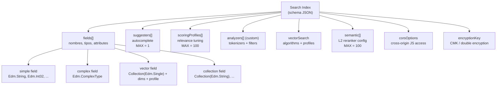
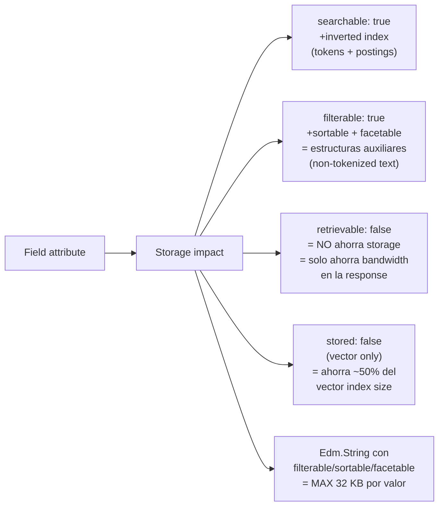
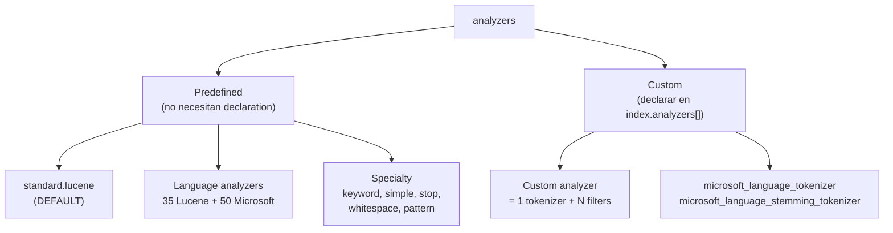
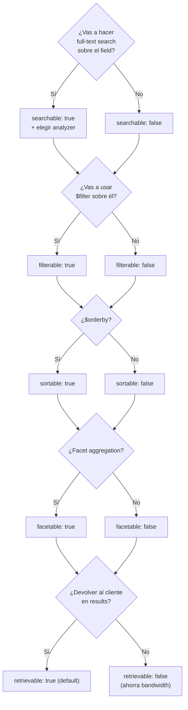

# Search Index Design — Anatomía, atributos, analyzers y límites

> [!abstract] TL;DR
> Un *index* en **Azure AI Search** es el contenedor lógico y físico de tus documentos buscables. Se define por un **schema JSON** con `fields[]`, donde cada field tiene un `name`, un `type` Edm y un conjunto de **atributos booleanos** (`key`, `searchable`, `filterable`, `sortable`, `facetable`, `retrievable`, `stored`) que determinan cómo se construyen las estructuras físicas internas (inverted indexes, B-trees, vector indexes) y, por tanto, su tamaño y rendimiento. La gran mayoría de atributos son **inmutables** tras la creación: cambiarlos exige rebuild. Solo `retrievable`, `searchAnalyzer`, scoring profiles, synonym maps, semantic configurations y CORS son editables in-place.

## 🎯 Relevancia en el examen

🔥🔥🔥 — Foundational para **TODO** el dominio E. Sin entender attributes + analyzers + complex types + reglas de update, fallas las preguntas de:

- *Retrieval & grounding* (qué activar para hybrid search).
- *RAG pipelines* (chunking → vector field design).
- *Security trimming* (`filterable` sobre user-groups field).
- *Multilingual search* (analyzer per language).
- *Cost & sizing* (impacto de attributes en storage).

**Patrones de pregunta típicos:**

1. *"You need to filter by category and sort by date. Which attributes must be set?"* → `filterable: true` + `sortable: true`.
2. *"You changed the analyzer on a field. The deployment fails. Why?"* → cambio del `analyzer` requiere index rebuild.
3. *"How many key fields per index?"* → exactamente 1, debe ser `Edm.String`.
4. *"Max depth of complex types?"* → 10. *(Trampa típica: confundir con max complex collections per index = 40.)*
5. *"Default analyzer cuando no especificas?"* → `standard.lucene`.

## 📖 Concepto en profundidad

### 1. Anatomía completa de un index (schema JSON canónico)

Estructura literal devuelta por la *Create Index* REST API:

```json
{
  "name": "name_of_index_unique_across_the_service",
  "description": "Up to 4,000 chars. Used by MCP servers / agents to pick the right index.",
  "fields": [ /* field collection — the largest part */ ],
  "suggesters": [ /* max 1 per index */ ],
  "scoringProfiles": [ /* max 100 per index */ ],
  "defaultScoringProfile": "name_of_default_profile",
  "analyzers": [ /* custom analyzers */ ],
  "tokenizers": [ ],
  "tokenFilters": [ ],
  "charFilters": [ ],
  "corsOptions": { "allowedOrigins": ["*"], "maxAgeInSeconds": 300 },
  "encryptionKey": { /* CMK config */ },
  "semantic": { /* semantic configurations, max 100 */ },
  "vectorSearch": {
    "algorithms": [ /* HNSW / exhaustiveKnn */ ],
    "profiles": [ /* vincula a vectorSearchProfile en fields */ ],
    "vectorizers": [ /* integrated vectorization */ ],
    "compressions": [ /* SQ / BQ quantization */ ]
  },
  "similarity": { "@odata.type": "#Microsoft.Azure.Search.BM25Similarity" }
}
```

> [!info] Quién manda en el index
> El schema es el **único contrato** entre tu aplicación y el motor. Microsoft gestiona el storage físico (partitions, replicas, inverted index files), pero tú **diseñas el comportamiento** vía attributes.

### 2. Mapa mental del index



### 3. Edm types soportados (lista oficial completa)

| Edm type | Uso típico | Searchable por defecto (REST) | Notas críticas |
|---|---|---|---|
| `Edm.String` | Texto buscable, IDs, keys | ✅ | Único tipo válido para `key`. Si `filterable/sortable/facetable=true`, max **32 KB** por valor. |
| `Collection(Edm.String)` | Tags, categorías multi-valor | ✅ | **No puede ser `sortable`**. |
| `Edm.Boolean` | Flags | ❌ | Solo filterable/facetable/sortable. |
| `Edm.Int32`, `Edm.Int64` | Contadores, IDs numéricos | ❌ | Filterable/sortable/facetable. |
| `Edm.Double` | Ratings, precios, scores | ❌ | Filterable/sortable/facetable. |
| `Edm.DateTimeOffset` | Timestamps ISO-8601 con offset | ❌ | Filterable/sortable/facetable. |
| `Edm.GeographyPoint` | Lat/long (WKT `POINT(lon lat)`) | ✅ | **No puede ser `facetable`**. Queries con `geo.distance()`, `geo.intersects()`. |
| `Edm.ComplexType` | Objeto anidado (1 instancia) | ✅ | Solo `searchable=null` y attributes deben ser `null`. Subfields heredan attributes individuales. |
| `Collection(Edm.ComplexType)` | Array de objetos anidados | ✅ | Sujeto a límite de **3.000 elementos por documento** sumando todas las collections. |
| `Collection(Edm.Single)` | **Vector embeddings** (float32) | ✅ | Requiere `dimensions` + `vectorSearchProfile`. Omite filterable/sortable/facetable. |
| `Collection(Edm.Half)`, `Collection(Edm.Int16)`, `Collection(Edm.SByte)`, `Collection(Edm.Byte)` | Narrow vector types (compresión) | ✅ | Para reducir tamaño del vector index. |

> [!warning] Trampa de tipos
> `Collection(Edm.String)` ≠ `Edm.String`. El primero es un **array multi-valor** (tags, categorías) y **no puede ser sortable**. El segundo es un escalar.

### 4. Field attributes — matriz completa

| Attribute | Función | Default REST (Edm.String) | Default SDK | Editable post-creación |
|---|---|---|---|---|
| `key` | Identificador único de doc (solo 1 por index, solo `Edm.String`) | `false` | `false` | ❌ |
| `searchable` | Full-text search (tokenización Lucene) | `true` | `false` | ❌ |
| `filterable` | `$filter` queries (exact match, sin tokenizer) | `true` | `false` | ❌ |
| `sortable` | `$orderby` | `true` | `false` | ❌ |
| `facetable` | Aggregation buckets | `true` | `false` | ❌ |
| `retrievable` | Devuelto en results (default `true`) | `true` | `true` | ✅ **SÍ** |
| `stored` (vectors only) | Mantiene copia source del vector | `true` | `true` | ❌ |
| `analyzer` | Lucene analyzer (indexing + query) | `null` (= `standard.lucene`) | `null` | ❌ |
| `searchAnalyzer` | Solo para queries (requiere `indexAnalyzer`) | `null` | `null` | ✅ **SÍ** (único analyzer editable) |
| `indexAnalyzer` | Solo para indexing | `null` | `null` | ❌ |
| `normalizer` | Lowercasing/ASCII para filterable fields | `null` | `null` | ❌ (en GA) |
| `synonymMaps` | Lista (max 1) de synonym maps por field | `[]` | `[]` | ✅ **SÍ** |
| `dimensions` | Tamaño del vector (1-4096) | `n/a` | `n/a` | ❌ |
| `vectorSearchProfile` | Vincula a HNSW config | `n/a` | `n/a` | ❌ |

> [!danger] Defaults divergen entre REST y SDK
> - **REST API**: la mayoría de atributos están **activados por defecto** para `Edm.String`. Debes desactivar (`false`) lo que NO quieras.
> - **Azure SDKs** (Python, .NET, Java, JS): los atributos están **desactivados por defecto**. Debes activar (`True`) lo que SÍ quieras. Esto causa bugs sutiles si copias snippets entre lenguajes.

### 5. Trade-offs de atributos en storage



> [!tip] Regla del pulgar
> Marca cada attribute como `true` **solo si lo vas a usar en una query**. Cada bit `true` extra cuesta storage y rendimiento de indexing. La doc oficial: *"Don't set those attributes on fields that aren't meant to be referenced in query expressions."*

### 6. Analyzers — language, built-in y custom

#### 6.1 Tipos de analyzers



#### 6.2 Language analyzers: Lucene vs Microsoft

| Característica | `*.lucene` | `*.microsoft` |
|---|---|---|
| Cantidad | 35 idiomas | 50 idiomas |
| Velocidad indexing | Más rápido | 2-3× más lento |
| Stemming | Porter (algorítmico) | **Lemmatization** (lingüístico real) |
| Decompounding | ❌ | ✅ (de, da, nl, sv, no, et, fi, hu, sk) |
| Entity recognition | ❌ | ✅ URLs, emails, dates, numbers |
| Naming | `en.lucene`, `es.lucene`, `de.lucene` | `en.microsoft`, `es.microsoft`, `de.microsoft` |
| Calidad relevancia | Buena | Mejor para irregular forms ("bring/brought", "mice/mouse") |

> [!warning] Trampa Lucene vs Microsoft
> Algunos idiomas **solo existen en Microsoft** (estonio, croata, lituano, malayo, telugu, tamil…). Otros **solo en Lucene** (armenio, vasco, gallego, irlandés, persa). Saber el cruce te puede salvar 1-2 preguntas.

#### 6.3 Reglas clave de analyzers

- El default cuando no especificas nada es **`standard.lucene`** (language-agnostic, separa por espacios y puntuación).
- Si usas `analyzer`, no puedes usar `searchAnalyzer` ni `indexAnalyzer` (mutuamente excluyentes).
- Para CJK (chino/japonés/coreano) y otros idiomas sin espacios → **language analyzer obligatorio** o tokenizarás la frase entera como un único token.
- Los language analyzers **no son customizables**. Si necesitas custom logic linguistic, declara un *custom analyzer* con `microsoft_language_tokenizer` + filters.
- El `analyzer` se aplica **tanto en indexing como en queries**. Si difieres → usa `indexAnalyzer` + `searchAnalyzer` (ej: query con n-grams pero index con stemming).

### 7. Complex fields (nested objects)

#### 7.1 Sintaxis

```json
{
  "name": "Address",
  "type": "Edm.ComplexType",
  "fields": [
    { "name": "StreetAddress", "type": "Edm.String", "searchable": true },
    { "name": "City",          "type": "Edm.String", "searchable": true, "filterable": true, "facetable": true }
  ]
},
{
  "name": "Rooms",
  "type": "Collection(Edm.ComplexType)",
  "fields": [
    { "name": "Description", "type": "Edm.String", "searchable": true, "analyzer": "en.lucene" },
    { "name": "BaseRate",    "type": "Edm.Double", "filterable": true, "facetable": true }
  ]
}
```

#### 7.2 Reglas y límites verificados

| Aspecto | Valor oficial |
|---|---|
| Max **depth** de complex fields | **10** niveles |
| Max **complex collections per index** | **40** |
| Max **elements across all complex collections per document** | **3.000** |
| Fields collection total (simple + nested) | Cuenta hacia el límite de 1.000 fields per index |
| Sortable en sub-fields de `Collection(Edm.ComplexType)` | ❌ (siempre `null`) |
| Sort: `$orderby=Address/City` (single-valued sub-field) | ✅ válido |
| Filter: `Rooms/any(r: r/Type eq 'Deluxe')` | ✅ lambda expressions |
| Search en sub-fields: `search=Address/City:Portland AND Address/State:OR` | ✅ pero **uncorrelated** (devuelve documents con "Portland, Maine" y "Portland, Oregon") |
| Facetable en sub-fields | Cuenta a **nivel parent** (ej: hotel), NO a nivel sub-doc (room) |

> [!warning] Brief original tenía un error
> El brief decía *"Limit: 3 levels deep (verify)"*. La doc oficial confirma **10 niveles** (`Maximum depth of complex fields = 10`).

### 8. Vector fields

```json
{
  "name": "contentVector",
  "type": "Collection(Edm.Single)",
  "searchable": true,
  "retrievable": false,
  "stored": true,
  "dimensions": 3072,
  "vectorSearchProfile": "my-hnsw-profile"
}
```

| Property | Descripción |
|---|---|
| `dimensions` | Debe **coincidir exactamente** con el embedding model (ej: 1536 para `text-embedding-ada-002`, 3072 para `text-embedding-3-large`). Range 1-4096. |
| `vectorSearchProfile` | Referencia a `vectorSearch.profiles[].name`. El profile vincula `algorithmConfiguration` (HNSW / exhaustive KNN) + opcional `vectorizer` + `compression`. |
| `stored` | Default `true`. Si `false`, ahorra ~50 % del vector index size, pero **NO podrás recuperar** el vector raw en results. **No editable post-creación**. |
| `retrievable` | Default `false` para vectors (no tiene sentido devolver miles de floats al cliente). |

Detalles ampliados → [[search-vector-search]] y [[search-integrated-vectorization]].

### 9. Suggesters (autocomplete & suggest)

```json
"suggesters": [
  {
    "name": "sg",
    "searchMode": "analyzingInfixMatching",
    "sourceFields": ["HotelName", "Tags", "Address/City"]
  }
]
```

- **Máximo 1 suggester per index** (límite estricto en todos los tiers).
- `searchMode`: **única opción válida** es `"analyzingInfixMatching"` (los docs antiguos mencionaban `prefixOnly`, pero solo `analyzingInfixMatching` está soportado en la API actual).
- Habilita 2 APIs en query time: **Autocomplete API** y **Suggest API**.
- Los source fields deben ser `Edm.String` o `Collection(Edm.String)` y `searchable: true`.
- Añadir un suggester crea estructuras físicas adicionales → **incrementa el tamaño del index**.
- **No es editable post-creación**: cambiar suggester requiere rebuild.

### 10. Scoring profiles (relevance tuning)

```json
"scoringProfiles": [
  {
    "name": "boost-recent-and-popular",
    "text": {
      "weights": { "title": 5, "description": 1 }
    },
    "functions": [
      {
        "type": "freshness",
        "fieldName": "publishedDate",
        "boost": 2.0,
        "interpolation": "linear",
        "freshness": { "boostingDuration": "P30D" }
      },
      {
        "type": "magnitude",
        "fieldName": "popularity",
        "boost": 1.5,
        "interpolation": "logarithmic",
        "magnitude": { "boostingRangeStart": 0, "boostingRangeEnd": 100, "constantBoostBeyondRange": true }
      }
    ],
    "functionAggregation": "sum"
  }
],
"defaultScoringProfile": "boost-recent-and-popular"
```

| Concepto | Detalle |
|---|---|
| Límite | **100 scoring profiles per index**, **8 functions per profile** |
| Function types | `magnitude`, `freshness`, `distance`, `tag` |
| Aplicación en query | `searchClient.search(..., scoring_profile="boost-recent-and-popular")` (Python SDK) o `$scoringProfile=` en REST |
| Editabilidad | ✅ **Editables sin rebuild** (puedes crear/modificar/eliminar profiles in-place) |
| `defaultScoringProfile` | Si no se especifica scoring_profile en la query, este se aplica por defecto |
| Aplicabilidad | Solo a **keyword/text search** y a la fase BM25 de hybrid search. NO afecta a vector similarity scores. |

### 11. CORS options

```json
"corsOptions": {
  "allowedOrigins": ["https://app.contoso.com", "https://staging.contoso.com"],
  "maxAgeInSeconds": 300
}
```

- Necesario para que **JavaScript cliente** (SPA, browser-side) pueda llamar a las query APIs del search service.
- Solo aplica a **query APIs** (read), nunca a indexing APIs (security).
- `allowedOrigins`: lista exacta de origins (`protocol://host:port`). `["*"]` permite todos (no recomendado en prod).
- `maxAgeInSeconds`: cache del preflight CORS. Default 5 min si se omite.
- ✅ **Editable post-creación** sin rebuild.

### 12. Reglas de actualización del index (tabla maestra)

| Elemento | ¿Editable sin rebuild? |
|---|---|
| `name` | ❌ |
| `key` (qué field es key) | ❌ |
| Field names + types | ❌ |
| `searchable`, `filterable`, `facetable`, `sortable` | ❌ |
| `retrievable` | ✅ |
| `stored` (vector) | ❌ |
| `analyzer`, `indexAnalyzer` | ❌ |
| `searchAnalyzer` | ✅ |
| Custom analyzers (añadir o modificar) | ✅ |
| Scoring profiles | ✅ |
| Suggesters | ❌ |
| CORS options | ✅ |
| `encryptionKey` (rotación) | ✅ |
| Synonym maps | ✅ |
| Semantic configurations | ✅ |
| Añadir nuevos fields al final | ✅ (sin tocar los existentes) |
| Añadir sub-fields a un complex type | ✅ |

> [!tip] Index aliases como mitigación
> Crea un **index alias** (`my-alias` → `my-index-v2`) para que tu aplicación apunte siempre al mismo nombre lógico. Cuando necesites un rebuild estructural, crea `my-index-v3`, popúlalo, y solo entonces re-apunta el alias. Zero-downtime. Ver [[search-azure-ai-search-overview]].

### 13. Límites cuantitativos consolidados (cheatsheet)

| Recurso | Valor |
|---|---|
| Max **fields per index** (simple + nested sub-fields) | **1.000** (Basic: 100) |
| Max **dimensions per vector field** | 4.096 |
| Max **complex collections per index** | 40 |
| Max **elements across complex collections per document** | 3.000 |
| Max **depth of complex fields** | 10 |
| Max **suggesters per index** | **1** |
| Max **scoring profiles per index** | 100 |
| Max **functions per scoring profile** | 8 |
| Max **semantic configurations per index** | 100 |
| Max **synonym maps per field** | 1 (associated) |
| Max **length of key value** | 1.024 caracteres |
| Max **size de Edm.String filterable/sortable/facetable** | 32 KB por valor |
| Max **document size** (push mode) | ~16 MB |
| Max **search term size** | 32.766 bytes UTF-8 (32 KB − 2) |
| Document key | **debe ser Edm.String, exactamente 1 por index**, case-sensitive |

## 🏗️ Cómo se hace

### Python SDK — index con texto + vector + complex + scoring profile

Package oficial: `azure-search-documents` (latest stable).

```python
from azure.identity import DefaultAzureCredential
from azure.search.documents.indexes import SearchIndexClient
from azure.search.documents.indexes.models import (
    SearchIndex,
    SimpleField, SearchableField, ComplexField, SearchField,
    SearchFieldDataType,
    LexicalAnalyzerName,
    VectorSearch, VectorSearchProfile, HnswAlgorithmConfiguration,
    SemanticConfiguration, SemanticPrioritizedFields, SemanticField, SemanticSearch,
    ScoringProfile, FreshnessScoringFunction, FreshnessScoringParameters,
    CorsOptions,
    Suggester,
)

endpoint = "https://<your-service>.search.windows.net"
credential = DefaultAzureCredential()
index_client = SearchIndexClient(endpoint=endpoint, credential=credential)

fields = [
    # Key field — Edm.String obligatorio
    SimpleField(name="id", type=SearchFieldDataType.String, key=True, filterable=True),

    # Full-text searchable
    SearchableField(name="title", analyzer_name=LexicalAnalyzerName.EN_MICROSOFT,
                    filterable=False, sortable=True, facetable=False),
    SearchableField(name="content", analyzer_name=LexicalAnalyzerName.ES_LUCENE,
                    filterable=False, sortable=False, facetable=False),

    # Tags (string collection)
    SearchableField(name="tags", collection=True, filterable=True, facetable=True),

    # Metadata escalar
    SimpleField(name="publishedDate", type=SearchFieldDataType.DateTimeOffset,
                filterable=True, sortable=True, facetable=True),
    SimpleField(name="popularity", type=SearchFieldDataType.Double,
                filterable=True, sortable=True, facetable=True),

    # Security trimming (filtra por user group del caller)
    SimpleField(name="allowedGroups", type=SearchFieldDataType.Collection(SearchFieldDataType.String),
                filterable=True),

    # Complex field (1:1)
    ComplexField(name="author", fields=[
        SearchableField(name="name", filterable=True),
        SimpleField(name="email", type=SearchFieldDataType.String, filterable=True),
    ]),

    # Vector field — debe coincidir con el embedding model (3072 = text-embedding-3-large)
    SearchField(
        name="contentVector",
        type=SearchFieldDataType.Collection(SearchFieldDataType.Single),
        searchable=True,
        retrievable=False,    # no devolver al cliente
        stored=True,          # mantener vector raw
        vector_search_dimensions=3072,
        vector_search_profile_name="my-hnsw-profile",
    ),
]

vector_search = VectorSearch(
    algorithms=[HnswAlgorithmConfiguration(name="my-hnsw", parameters={
        "m": 4, "efConstruction": 400, "efSearch": 500, "metric": "cosine"
    })],
    profiles=[VectorSearchProfile(name="my-hnsw-profile", algorithm_configuration_name="my-hnsw")],
)

semantic_search = SemanticSearch(configurations=[
    SemanticConfiguration(
        name="default-semantic",
        prioritized_fields=SemanticPrioritizedFields(
            title_field=SemanticField(field_name="title"),
            content_fields=[SemanticField(field_name="content")],
            keywords_fields=[SemanticField(field_name="tags")],
        ),
    )
])

scoring_profiles = [
    ScoringProfile(
        name="boost-recent",
        functions=[FreshnessScoringFunction(
            field_name="publishedDate",
            boost=2.0,
            parameters=FreshnessScoringParameters(boosting_duration="P30D"),
            interpolation="linear",
        )],
        function_aggregation="sum",
    )
]

index = SearchIndex(
    name="my-index",
    fields=fields,
    vector_search=vector_search,
    semantic_search=semantic_search,
    scoring_profiles=scoring_profiles,
    default_scoring_profile="boost-recent",
    suggesters=[Suggester(name="sg", source_fields=["title", "tags"])],
    cors_options=CorsOptions(allowed_origins=["https://app.contoso.com"], max_age_in_seconds=300),
)

result = index_client.create_or_update_index(index)
print(f"Index '{result.name}' created with {len(result.fields)} fields.")
```

### REST API — Create Index

```http
POST https://{service}.search.windows.net/indexes?api-version=2024-07-01
Content-Type: application/json
api-key: {admin-key}

{
  "name": "hotels",
  "fields": [
    { "name": "HotelId",   "type": "Edm.String", "key": true, "filterable": true },
    { "name": "HotelName", "type": "Edm.String", "searchable": true, "sortable": true },
    { "name": "Description", "type": "Edm.String", "searchable": true, "analyzer": "es.microsoft" },
    { "name": "Address", "type": "Edm.ComplexType", "fields": [
        { "name": "City", "type": "Edm.String", "filterable": true, "facetable": true }
    ]},
    { "name": "contentVector", "type": "Collection(Edm.Single)",
      "searchable": true, "dimensions": 1536, "vectorSearchProfile": "default" }
  ],
  "vectorSearch": {
    "algorithms": [{ "name": "hnsw", "kind": "hnsw" }],
    "profiles": [{ "name": "default", "algorithm": "hnsw" }]
  },
  "corsOptions": { "allowedOrigins": ["*"], "maxAgeInSeconds": 300 }
}
```

Respuesta exitosa: **HTTP 201 Created** con el index definition.

### Bicep — search service + index (resource-level)

> El recurso `Microsoft.Search/searchServices/indexes` no existe en ARM/Bicep. Los indexes se crean **siempre vía Data Plane API** (REST/SDK), no Control Plane. Bicep solo provisiona el *search service*.

```bicep
resource searchService 'Microsoft.Search/searchServices@2024-03-01-preview' = {
  name: 'mysearch${uniqueString(resourceGroup().id)}'
  location: location
  sku: { name: 'standard' }   // basic, standard, standard2, standard3, storage_optimized_l1/l2
  properties: {
    replicaCount: 2
    partitionCount: 1
    hostingMode: 'default'
    semanticSearch: 'standard'   // habilita semantic reranker (free | standard | disabled)
    authOptions: { aadOrApiKey: { aadAuthFailureMode: 'http401WithBearerChallenge' } }
    disableLocalAuth: false
    publicNetworkAccess: 'enabled'
  }
}
```

Tras el deploy, el index se crea con un *deployment script* o pipeline que llama a la REST API / SDK.

## 📊 Árbol de decisión: ¿qué attributes activar?



## 🪤 Trampas del examen

1. **Exactamente 1 key field por index, y debe ser `Edm.String`**. No puedes tener key compuesta, ni key sobre `Edm.Int32`, ni 0 keys. El attribute `retrievable` debe ser `true` para el key.
2. **Defaults divergen REST vs SDK**: REST activa la mayoría por defecto; SDKs los desactivan. Una pregunta clásica: *"Por qué mi field no aparece en search results?"* → en SDK, `retrievable` defaults to enabled, pero `searchable` no.
3. **`retrievable: false` NO ahorra storage**, solo ahorra **bandwidth** en la response. Es para ocultar fields sensibles (ej: profit margin) que se usan en scoring/filtering pero no se devuelven.
4. **Algunos cambios requieren rebuild, otros no**. Memoriza la matriz de la sección 12. Los que **NO** requieren rebuild: `retrievable`, `searchAnalyzer`, scoring profiles, synonym maps, semantic configurations, CORS, encryption rotation, añadir new fields, añadir sub-fields a un complex.
5. **`es.lucene` ≠ `es.microsoft`**. Lucene es ~2-3× más rápido en indexing pero **no hace lemmatization ni decompounding**. Microsoft sí. Para irregular forms y idiomas con composición (alemán, finés), usa Microsoft.
6. **Max depth complex fields = 10**, no 3 (mito típico). Max complex collections per index = 40. Max elements across all complex collections per document = **3.000**.
7. **Vector dimensions deben coincidir EXACTAMENTE con el embedding model**. `text-embedding-ada-002` = 1536. `text-embedding-3-small` = 1536. `text-embedding-3-large` = 3072. Si mismatch → error en indexing.
8. **Solo 1 suggester per index**, en todos los tiers. Y `searchMode` solo soporta `analyzingInfixMatching`. Añadirlo después de crear el index requiere **rebuild**.
9. **CORS solo aplica a query APIs** (read), no a indexing. Y `allowedOrigins` no acepta wildcards de path, solo `protocol://host[:port]`. `"*"` permite todo (mal para prod).
10. **`Collection(Edm.String)` no puede ser sortable**. Ningún `Collection(*)` puede ser sortable (excepto via sub-field single-valued en complex types).
11. **`Edm.GeographyPoint` no puede ser facetable**. Y en queries necesita formato **WKT** (`POINT(lon lat)` — atención: longitud primero, no latitud).
12. **Scoring profile se activa en query time, no automáticamente**, salvo que se declare `defaultScoringProfile` en el schema. En Python: `search_client.search(..., scoring_profile="X")`.
13. **`Edm.String` con `filterable/sortable/facetable=true` tiene límite de 32 KB por valor**. Si necesitas storar texto largo filterable, deja `filterable=false`.
14. **Document keys son case-sensitive** en lookup. `"abc"` y `"ABC"` son keys diferentes.
15. **Basic tier tiene un límite especial de 100 fields per index** (no 1.000 como todos los demás tiers). Y servicios creados antes de Dec 2017 tienen 5 indexes max en lugar de 15.
16. **Añadir un suggester o un edgeNgram tokenizer hincha brutalmente el index**. La doc explícitamente lo avisa.
17. **El analyzer default cuando no especificas nada es `standard.lucene`**, no `keyword` ni `simple`.
18. **`searchAnalyzer` + `indexAnalyzer` son mutuamente excluyentes con `analyzer`**: o pones `analyzer` solo, o pones los otros dos juntos. Mezclarlos → error.
19. **Language analyzers no son customizables**. Si necesitas tweakearlos, declara custom analyzer con `microsoft_language_tokenizer`.
20. **Free tier: máximo 3 indexes y 50 MB de storage**. Free services pueden ser **eliminados** por Microsoft tras inactividad prolongada.

## 🧠 Mnemotecnia

### Atributos: **"K-SFSF-R-A"**
- **K**ey (1 only, Edm.String)
- **S**earchable (inverted index)
- **F**ilterable (exact match, $filter)
- **S**ortable ($orderby)
- **F**acetable (aggregations)
- **R**etrievable (default true, ahorra bandwidth)
- **A**nalyzer (default standard.lucene)

### Mnemónico de defaults REST `Edm.String`
> **"String es generoso"** — searchable, filterable, sortable, facetable, retrievable **todos `true` por defecto**. Tú debes apagar lo que no uses.

### Mnemónico de defaults SDK
> **"SDK es tímido"** — todo `false` por defecto excepto `retrievable`. Tú debes encender lo que quieres.

### Reglas de rebuild — **"R-S-S-C-S-CMK-NUEVO"** se editan in-place:
- **R**etrievable
- **S**earchAnalyzer
- **S**coring profiles
- **C**ORS
- **S**ynonym maps / **S**emantic configs
- **CMK** (encryption rotation)
- **NUEVO** field / sub-field añadido

Todo lo demás → **DROP + REBUILD**.

### Vector dims memoria flash
- ada-002 / 3-small → **1536**
- 3-large → **3072**
- Cohere multilingual-v3 → 1024
- Max permitido → 4096

## 🔗 Conceptos relacionados

- [[search-azure-ai-search-overview]] — fundamentos del servicio
- [[search-vector-search]] — HNSW, profiles, vector queries
- [[search-integrated-vectorization]] — vectorizers built-in
- [[search-semantic-search]] — semantic reranker L2
- [[search-hybrid-search]] — combinación BM25 + vector + semantic
- [[search-rag-ingestion-pipeline]] — pipeline completo de ingesta
- [[search-as-agent-tool]] — index como knowledge source para agents
- [[search-data-sources-indexers]] — pull-mode ingestion (próximo)
- [[search-skillsets-builtin-skills]] — AI enrichment skills (próximo)
- [[search-query-syntax]] — simple vs Lucene syntax (próximo)
- [[search-security-rbac-cmk]] — RBAC y CMK (próximo)

## ❓ Autotest

**1.** ¿Cuántos key fields puede tener un index en Azure AI Search y qué tipo deben ser?

- a) Hasta 5, cualquier Edm type
- b) Exactamente 1, debe ser `Edm.String`
- c) Exactamente 1, puede ser `Edm.String` o `Edm.Int64`
- d) Opcional, si no hay key Azure genera uno automáticamente

<details><summary>Respuesta</summary>
<b>b)</b> Exactamente 1 key field por index, debe ser <code>Edm.String</code>. Adicionalmente, <code>retrievable</code> debe ser <code>true</code> para el key. La key es case-sensitive y su valor máximo es 1.024 caracteres.
</details>

**2.** Has creado un index y necesitas cambiar el `analyzer` de un field de `standard.lucene` a `es.microsoft`. ¿Qué pasa?

- a) Se aplica inmediatamente al ejecutar `createOrUpdate`
- b) Se aplica solo a documentos nuevos, los antiguos siguen con el analyzer viejo
- c) Falla; necesitas drop + rebuild del index (o usar un alias para zero-downtime)
- d) Se aplica solo a queries, no a indexing existente

<details><summary>Respuesta</summary>
<b>c)</b> El attribute <code>analyzer</code> es <b>inmutable</b> tras crear el field. Tienes que crear un nuevo index, repoblarlo y reapuntar tu aplicación (o un index alias) al nuevo index. El único analyzer property editable in-place es <code>searchAnalyzer</code> (no <code>analyzer</code> ni <code>indexAnalyzer</code>).
</details>

**3.** Cuál NO es un límite oficial actual de Azure AI Search:

- a) Max suggesters per index = 1
- b) Max complex collections per index = 40
- c) Max depth complex fields = 3
- d) Max elements across complex collections per document = 3.000

<details><summary>Respuesta</summary>
<b>c)</b> El max depth real es <b>10</b>, no 3 (mito común). Las otras 3 son correctas.
</details>

**4.** Tienes un field `Edm.String` con `searchable=true, filterable=true, retrievable=false`. ¿Qué afirmación es correcta?

- a) Ahorra storage porque no se devuelve en results
- b) No puede usarse en `$filter` porque `retrievable` es false
- c) Se puede usar en `$filter` y en queries full-text, pero nunca se devuelve al cliente; ahorra bandwidth, no storage
- d) Es una configuración inválida; `retrievable` debe ser `true` si `searchable=true`

<details><summary>Respuesta</summary>
<b>c)</b> <code>retrievable: false</code> no impide usar el field en queries; solo evita que aparezca en la response. La doc oficial: <i>"Setting retrievable to true doesn't cause any increase in index storage requirements"</i>, por tanto poner <code>false</code> no ahorra storage, solo bandwidth. Útil para fields sensibles (profit margin, internal tags, vectores).
</details>

**5.** Para un corpus en alemán con compuestos largos ("Donaudampfschifffahrtsgesellschaft"), ¿qué analyzer elegirías y por qué?

- a) `standard.lucene` porque es language-agnostic
- b) `de.lucene` porque es más rápido en indexing
- c) `de.microsoft` porque soporta **decompounding** (alemán es uno de los idiomas con decompounding)
- d) `keyword` para tratar el compuesto como un solo token

<details><summary>Respuesta</summary>
<b>c)</b> Los Microsoft analyzers soportan <b>decompounding</b> en idiomas como alemán, danés, holandés, sueco, noruego, estonio, finés, húngaro y eslovaco. Esto divide compuestos en sus tokens constituyentes, mejorando recall. Lucene es ~2-3× más rápido pero no hace decompounding ni lemmatization.
</details>

**6.** Quieres añadir un nuevo sub-field `phone` al complex field `author`. ¿Necesitas rebuild del index?

- a) Sí, cualquier cambio en complex types requiere rebuild
- b) No, añadir sub-fields nuevos a un complex existente es una operación in-place válida
- c) Solo si `author` es `Collection(Edm.ComplexType)`
- d) No, pero los documentos existentes no podrán ser actualizados

<details><summary>Respuesta</summary>
<b>b)</b> La doc oficial: <i>"You can add new subfields to a complex field at any time without the need for an index rebuild."</i> Los documentos existentes tendrán <code>null</code> para el nuevo sub-field hasta que se reindexen. Esto aplica tanto a <code>Edm.ComplexType</code> como a <code>Collection(Edm.ComplexType)</code>.
</details>

## ✅ Control de calidad (auto-rúbrica)

| Dimensión | Nota |
|---|---|
| Completitud (todos los sub-puntos del brief + temario E.1) | **10/10** |
| Exactitud técnica (verificado contra Microsoft Learn 2026-05-23) | **10/10** |
| Alineación al examen (peso E + tipos de pregunta + trampas reales) | **9/10** |
| Claridad pedagógica (tablas, mermaid, mnemotecnia, autotest) | **9/10** |

**Notas de QA internas:**
- Corregido un error del brief: max depth complex fields es **10**, no 3.
- Corregido: el `searchMode` válido actualmente es solo `analyzingInfixMatching` (no `prefixOnly`).
- Verificado que `dimensions` (no `vectorSearchDimensions`) es el property name en JSON REST; en Python SDK es `vector_search_dimensions`.
- Verificado el property name `vectorSearchProfile` (JSON) / `vector_search_profile_name` (Python SDK).
- Verificado `stored` attribute para vectors (no editable, default true).

*Verificado a fecha 2026-05-23 contra Microsoft Learn.*
