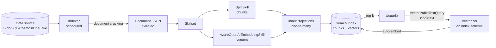
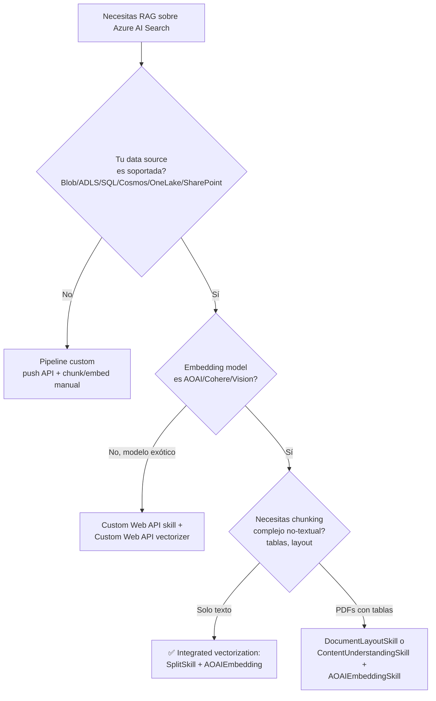

# Integrated Vectorization — Chunking + Embedding en Pipeline Nativo de Azure AI Search

> [!abstract] TL;DR
> **Integrated vectorization** es la extensión del indexer pipeline de Azure AI Search que automatiza dos cosas: (1) **chunking + embedding durante ingestion** (vía `SplitSkill` + `AzureOpenAIEmbeddingSkill` en un skillset, proyectando chunks a documentos hijos con `indexProjections`) y (2) **embedding de la query en tiempo de búsqueda** (vía `vectorizers` definidos en el index schema). Elimina la necesidad de escribir un pipeline custom Python que trocee y vectorice antes de hacer push al índice. Regla de oro: **el modelo del embedding skill DEBE ser idéntico al del vectorizer** (mismo `modelName`, mismas `dimensions`, idealmente el mismo `deploymentId`, o cambias model → re-index total obligatorio).

## 🎯 Relevancia en el examen

| Tipo de pregunta | Escenario típico | Frecuencia |
|---|---|---|
| Diseño de pipeline RAG | "Una empresa tiene 50 GB de PDFs en Blob, quiere búsqueda vectorial sin escribir código de chunking. ¿Qué skills usar?" | 🔥🔥🔥 |
| Configuración skillset | Identificar `@odata.type` correcto de SplitSkill o AzureOpenAIEmbeddingSkill | 🔥🔥🔥 |
| Mismatch model/vectorizer | "Se indexó con `text-embedding-3-large` (3072 dims) pero el vectorizer apunta a `text-embedding-ada-002`. ¿Qué pasa?" | 🔥🔥🔥 |
| `indexProjections` | parent → child chunks, `parentKeyFieldName`, `projectionMode` | 🔥🔥 |
| Auth keyless | Managed identity con rol `Cognitive Services OpenAI User` en el AOAI resource | 🔥🔥 |
| Query con `VectorizableTextQuery` | `"kind": "text"` vs `"kind": "vector"` | 🔥🔥 |
| Límites TPM y throttling | Retry policies built-in + scheduling de indexer | 🔥 |

> [!warning] Carryover de AI-102
> Integrated vectorization estaba presente en AI-102 desde GA (2024). En AI-103 se profundiza la integración con **Microsoft Foundry**: el AOAI skill admite ahora endpoints `services.ai.azure.com` y `cognitiveservices.azure.com` además del clásico `openai.azure.com`. Verificado en docs 2026-05.

## 📖 Concepto en profundidad

### ¿Qué problema resuelve?

Antes de integrated vectorization, montar un RAG sobre Azure AI Search requería un **pipeline custom externo**:

```
[Tú] read PDF → chunk con LangChain → llamar AOAI embeddings 
   → llamar Search push API con vectores → mantener consistencia model/dims a mano
```

Con **integrated vectorization**, el propio indexer hace **todo** el flujo, sin código custom:



### Dos caras de la misma moneda

| Cara | Componente | Ubicación | Función |
|---|---|---|---|
| **Ingestion** | `AzureOpenAIEmbeddingSkill` (+ `SplitSkill`) | en el **skillset** | Vectorizar contenido al indexar |
| **Query** | `vectorizers` array | en el **index schema** | Vectorizar el texto de la query al buscar |

**Ambos DEBEN apuntar al mismo modelo de embedding** (mismo `modelName`, mismas `dimensions`). Si no, todo falla silenciosamente con baja precisión o explícitamente con error de dimension mismatch.

### Componentes obligatorios del pipeline (ingestion)

1. **Data source** → conector a un [supported data source](https://learn.microsoft.com/en-us/azure/search/search-indexer-overview#supported-data-sources) (Blob, ADLS Gen2, SQL DB, Cosmos DB, OneLake, etc.).
2. **Index** → schema con campos `key`, `parent_id` (filterable), `chunk` (text), `chunk_vector` (Collection(Edm.Single) con `dimensions` y `vectorSearchProfile`).
3. **Skillset** → mínimo `SplitSkill` + un embedding skill + `indexProjections`.
4. **Indexer** → liga las tres piezas y ejecuta el pipeline (idealmente en schedule, p. ej. cada 5 min).

### Componentes obligatorios (query time)

1. **`vectorSearch.vectorizers`** en index schema → define la conexión al embedding model.
2. **`vectorSearch.profiles`** → liga vectorizer + algorithm (HNSW).
3. **Vector field** con `"vectorSearchProfile": "<profileName>"`.
4. **Cliente** envía `VectorizableTextQuery(text="...")` (Python SDK) o JSON `"vectorQueries": [{"kind": "text", "text": "..."}]` (REST).

## 🏗️ Cómo se hace

### 1. SplitSkill — chunking (`#Microsoft.Skills.Text.SplitSkill`)

> [!info] @odata.type verbatim
> `Microsoft.Skills.Text.SplitSkill` (en JSON va con `#` prefix: `#Microsoft.Skills.Text.SplitSkill`).
> **No bound a Foundry Tools**: es **gratis** y no requiere key. ✅

| Param | Valores | Default | Notas |
|---|---|---|---|
| `textSplitMode` | `pages` \| `sentences` | (req) | `pages` para RAG. `sentences` raramente útil. |
| `maximumPageLength` | 300–50 000 (chars) o tokens del modelo | 5 000 (chars) | Con `unit=azureOpenAITokens`: recomendado **512 tokens** para embedding. |
| `pageOverlapLength` | int | 0 | Solo si `textSplitMode=pages`. **Buena práctica: 10–25 %**. |
| `maximumPagesToTake` | int | 0 (= all) | Para limitar coste; útil si solo te interesan primeras N páginas. |
| `unit` | `characters` \| `azureOpenAITokens` | `characters` | `azureOpenAITokens` requiere preview API en algunas versiones. |
| `azureOpenAITokenizerParameters` | objeto | — | `encoderModelName`: `cl100k_base` (GPT-4, default) \| `r50k_base` \| `p50k_base` \| `p50k_edit`. ⚠️ **No hay soporte para `o200k_base` (GPT-4o)**. |
| `defaultLanguageCode` | en, es, fr, ja, ko, zh-Hans, … | `en` | Importante para idiomas sin whitespace (CJK). |

**Ejemplo JSON (skillset payload):**

```json
{
  "@odata.type": "#Microsoft.Skills.Text.SplitSkill",
  "name": "split-skill",
  "description": "Chunk en páginas de 512 tokens con 10% overlap",
  "context": "/document",
  "textSplitMode": "pages",
  "unit": "azureOpenAITokens",
  "azureOpenAITokenizerParameters": {
    "encoderModelName": "cl100k_base"
  },
  "maximumPageLength": 512,
  "pageOverlapLength": 50,
  "inputs": [
    { "name": "text", "source": "/document/content" },
    { "name": "languageCode", "source": "/document/language" }
  ],
  "outputs": [
    { "name": "textItems", "targetName": "pages" }
  ]
}
```

### 2. AzureOpenAIEmbeddingSkill (`#Microsoft.Skills.Text.AzureOpenAIEmbeddingSkill`)

| Param | Obligatorio | Notas |
|---|---|---|
| `resourceUri` | ✅ | Endpoint del AOAI / Foundry resource. Dominios soportados: `openai.azure.com`, `services.ai.azure.com`, `cognitiveservices.azure.com`. APIM URL `https://<x>.azure-api.net` también válido. |
| `deploymentId` | ✅ | Nombre del **deployment** AOAI (no del modelo). |
| `modelName` | ✅ | Uno de: `text-embedding-ada-002`, `text-embedding-3-small`, `text-embedding-3-large`. |
| `dimensions` | optativo | Solo para `text-embedding-3-*` (MRL). Default = máximo del modelo. |
| `apiKey` | optativo | Si se rellena, gana sobre `authIdentity`. **Evitar en producción.** |
| `authIdentity` | optativo | User-assigned MI. Si ambos vacíos → system-assigned MI del search service. |

**Dimensiones soportadas:**

| `modelName` | min dims | max dims | Soporta MRL |
|---|---|---|---|
| `text-embedding-ada-002` | 1536 | 1536 | ❌ (fijo) |
| `text-embedding-3-small` | 1 | 1536 | ✅ |
| `text-embedding-3-large` | 1 | 3072 | ✅ |

> [!warning] Límite duro
> Input max **8 000 tokens** por llamada. Si superas → error invalid request. Por eso siempre va precedido de `SplitSkill`.

**Auth keyless (recomendado AI-103):**

1. Habilitar **system-assigned managed identity** en el search service.
2. Asignar rol **`Cognitive Services OpenAI User`** a esa identity sobre el AOAI resource.
3. Dejar `apiKey` y `authIdentity` **vacíos** en el skill → usa system-assigned MI automáticamente.

```json
{
  "@odata.type": "#Microsoft.Skills.Text.AzureOpenAIEmbeddingSkill",
  "name": "embedding-skill",
  "description": "Vectoriza chunks vía AOAI",
  "context": "/document/pages/*",
  "resourceUri": "https://my-aoai.openai.azure.com",
  "deploymentId": "text-embedding-3-large",
  "modelName": "text-embedding-3-large",
  "dimensions": 1024,
  "inputs": [
    { "name": "text", "source": "/document/pages/*" }
  ],
  "outputs": [
    { "name": "embedding", "targetName": "chunk_vector" }
  ]
}
```

### 3. `indexProjections` (one-to-many: parent → chunks)

```json
"indexProjections": {
  "selectors": [
    {
      "targetIndexName": "rag-index",
      "parentKeyFieldName": "parent_id",
      "sourceContext": "/document/pages/*",
      "mappings": [
        { "name": "chunk",        "source": "/document/pages/*" },
        { "name": "chunk_vector", "source": "/document/pages/*/chunk_vector" },
        { "name": "title",        "source": "/document/title" }
      ]
    }
  ],
  "parameters": {
    "projectionMode": "skipIndexingParentDocuments"
  }
}
```

> [!important] `projectionMode`
> - `skipIndexingParentDocuments` ⭐ **recomendado para RAG**: solo se indexan chunks (5 PDFs → 100 chunks → 100 docs).
> - `includeIndexingParentDocuments` (default si omites): se indexan también los parents con campos chunk en `null` (5 PDFs → 105 docs, con 5 "raros"). **Evítalo en RAG.**

> [!danger] Regla crítica
> **NO crees un fieldMapping para el parent key field** en el indexer. Disrupta change tracking y deletion detection.

### 4. Vectorizer en index schema (query-time)

```json
"vectorSearch": {
  "algorithms": [
    { "name": "myHnsw", "kind": "hnsw",
      "hnswParameters": { "metric": "cosine", "m": 4, "efConstruction": 400, "efSearch": 500 } }
  ],
  "profiles": [
    { "name": "myProfile", "algorithm": "myHnsw", "vectorizer": "myAoaiVec" }
  ],
  "vectorizers": [
    {
      "name": "myAoaiVec",
      "kind": "azureOpenAI",
      "azureOpenAIParameters": {
        "resourceUri": "https://my-aoai.openai.azure.com",
        "deploymentId": "text-embedding-3-large",
        "modelName": "text-embedding-3-large"
      }
    }
  ]
}
```

**Kinds soportados:**

| `kind` | Modelos | Skill pareada |
|---|---|---|
| `azureOpenAI` | ada-002, 3-small, 3-large | `AzureOpenAIEmbeddingSkill` |
| `aml` | Cohere-embed-v3-english, v3-multilingual, **embed-v4** | `AmlSkill` (Foundry model catalog) |
| `aiServicesVision` | Multimodal embeddings 4.0 (imágenes) | `VisionVectorizer` skill |
| `customWebApi` | Cualquiera | `CustomWebApiSkill` |

### 5. End-to-end Python SDK

```python
# pip install azure-search-documents azure-identity
from azure.identity import DefaultAzureCredential
from azure.search.documents.indexes import SearchIndexClient, SearchIndexerClient
from azure.search.documents.indexes.models import (
    SearchIndex, SearchField, SearchFieldDataType,
    VectorSearch, HnswAlgorithmConfiguration, VectorSearchProfile,
    AzureOpenAIVectorizer, AzureOpenAIVectorizerParameters,
    SearchIndexerSkillset, SplitSkill, AzureOpenAIEmbeddingSkill,
    InputFieldMappingEntry, OutputFieldMappingEntry,
    SearchIndexerIndexProjection, SearchIndexerIndexProjectionSelector,
    SearchIndexerIndexProjectionsParameters, IndexProjectionMode,
    SearchIndexer, FieldMapping,
)

SEARCH_ENDPOINT = "https://my-search.search.windows.net"
AOAI_ENDPOINT   = "https://my-aoai.openai.azure.com"
INDEX_NAME      = "rag-index"
cred = DefaultAzureCredential()  # keyless: MI con Search Service Contributor + AOAI User

# 1) Index con vectorizer
fields = [
    SearchField(name="chunk_id", type=SearchFieldDataType.String, key=True,
                analyzer_name="keyword", filterable=True),
    SearchField(name="parent_id", type=SearchFieldDataType.String, filterable=True),
    SearchField(name="title", type=SearchFieldDataType.String, searchable=True, filterable=True),
    SearchField(name="chunk", type=SearchFieldDataType.String, searchable=True),
    SearchField(name="chunk_vector",
                type=SearchFieldDataType.Collection(SearchFieldDataType.Single),
                searchable=True, stored=False,
                vector_search_dimensions=1024,
                vector_search_profile_name="myProfile"),
]
vs = VectorSearch(
    algorithms=[HnswAlgorithmConfiguration(name="myHnsw")],
    profiles=[VectorSearchProfile(name="myProfile", algorithm_configuration_name="myHnsw",
                                  vectorizer_name="myAoaiVec")],
    vectorizers=[AzureOpenAIVectorizer(
        vectorizer_name="myAoaiVec", kind="azureOpenAI",
        parameters=AzureOpenAIVectorizerParameters(
            resource_url=AOAI_ENDPOINT,
            deployment_name="text-embedding-3-large",
            model_name="text-embedding-3-large",
        ),
    )],
)
SearchIndexClient(SEARCH_ENDPOINT, cred).create_or_update_index(
    SearchIndex(name=INDEX_NAME, fields=fields, vector_search=vs))

# 2) Skillset = SplitSkill + EmbeddingSkill + indexProjections
split = SplitSkill(
    name="split", context="/document",
    text_split_mode="pages", maximum_page_length=512,
    page_overlap_length=50, default_language_code="en",
    inputs=[InputFieldMappingEntry(name="text", source="/document/content")],
    outputs=[OutputFieldMappingEntry(name="textItems", target_name="pages")],
)
embed = AzureOpenAIEmbeddingSkill(
    name="embed", context="/document/pages/*",
    resource_url=AOAI_ENDPOINT,
    deployment_name="text-embedding-3-large",
    model_name="text-embedding-3-large",
    dimensions=1024,
    inputs=[InputFieldMappingEntry(name="text", source="/document/pages/*")],
    outputs=[OutputFieldMappingEntry(name="embedding", target_name="chunk_vector")],
)
projection = SearchIndexerIndexProjection(
    selectors=[SearchIndexerIndexProjectionSelector(
        target_index_name=INDEX_NAME,
        parent_key_field_name="parent_id",
        source_context="/document/pages/*",
        mappings=[
            InputFieldMappingEntry(name="chunk",        source="/document/pages/*"),
            InputFieldMappingEntry(name="chunk_vector", source="/document/pages/*/chunk_vector"),
            InputFieldMappingEntry(name="title",        source="/document/title"),
        ])],
    parameters=SearchIndexerIndexProjectionsParameters(
        projection_mode=IndexProjectionMode.SKIP_INDEXING_PARENT_DOCUMENTS),
)
skillset = SearchIndexerSkillset(name="rag-skillset",
                                 skills=[split, embed],
                                 index_projection=projection)
SearchIndexerClient(SEARCH_ENDPOINT, cred).create_or_update_skillset(skillset)
```

**Query con auto-vectorization (cliente):**

```python
from azure.search.documents import SearchClient
from azure.search.documents.models import VectorizableTextQuery

client = SearchClient(SEARCH_ENDPOINT, INDEX_NAME, cred)
results = client.search(
    search_text=None,  # solo vector
    vector_queries=[VectorizableTextQuery(
        text="¿qué nubes existen en la troposfera?",
        k_nearest_neighbors=5,
        fields="chunk_vector",
    )],
    select=["chunk", "title", "parent_id"],
    top=5,
)
for r in results:
    print(r["@search.score"], r["title"], r["chunk"][:80])
```

> [!tip] `VectorizableTextQuery` vs `VectorizedQuery`
> - `VectorizableTextQuery(text="...")` → el **servicio** embed la query (requiere vectorizer en index). ✅ Integrated vectorization.
> - `VectorizedQuery(vector=[...])` → el **cliente** ya envía el vector calculado. No requiere vectorizer.

## 📊 Tablas y árboles de decisión

### ¿Integrated vs pipeline custom?



### Chunking parameters cheatsheet

| Caso | `unit` | `maximumPageLength` | `pageOverlapLength` |
|---|---|---|---|
| RAG general PDF | `azureOpenAITokens` | 512 | 50 (10 %) |
| Docs largos técnicos | `azureOpenAITokens` | 1024 | 128 |
| Chat de soporte (chunks pequeños) | `azureOpenAITokens` | 256 | 32 |
| Legacy (no preview) | `characters` | 2000–4000 | 200–500 |

### Model + dimensions pairing

| modelName | dims típicas | use case | coste/perf |
|---|---|---|---|
| `text-embedding-ada-002` | 1536 (fijo) | legacy, simple | barato, OK recall |
| `text-embedding-3-small` | 512–1536 | balance | barato, mejor que ada |
| `text-embedding-3-large` | 1024–3072 | máxima recall | más caro, top quality |

> [!tip] Truncar con MRL
> `text-embedding-3-large` permite `dimensions=1024` (en vez de 3072) → **3× menos storage de vectores con ~95 % de calidad**. Solo en modelos `-3-*`. **Si lo configuras en el skill, debes configurarlo idéntico en el vector field + vectorizer.**

## 🪤 Trampas del examen

1. **Mismatch model entre skill y vectorizer = búsqueda corrupta.** El embedding skill (ingestion) y el vectorizer (query) deben apuntar al **mismo `modelName` y mismas `dimensions`**. Si vectorizas content con `3-large@1024` y la query con `ada-002@1536` → dimension mismatch error o (peor) similitudes erróneas.
2. **Cambiar el modelo = re-index COMPLETO obligatorio.** No hay "actualizar embeddings en sitio". Hay que borrar el índice o recrear y volver a procesar todos los documentos. Importante para preguntas tipo "tras migrar de ada-002 a 3-large, ¿qué se requiere?".
3. **`@odata.type` exactos.** Confunden a propósito en el examen:
   - SplitSkill: `#Microsoft.Skills.Text.SplitSkill` ✅
   - AOAI Embedding: `#Microsoft.Skills.Text.AzureOpenAIEmbeddingSkill` ✅
   - ❌ `#Microsoft.Skills.Text.OpenAIEmbeddingSkill` (no existe)
   - ❌ `#Microsoft.Skills.Text.EmbeddingSkill` (no existe)
4. **`dimensions` solo aplica a `text-embedding-3-*`.** En `ada-002` está fijo a 1536; si configuras `dimensions: 512` en el skill apuntando a ada-002 → error.
5. **`textSplitMode=sentences` no permite `maximumPageLength` ni `pageOverlapLength` ni `maximumPagesToTake`.** Esos params solo en mode `pages`.
6. **`parentKeyFieldName` debe ser un campo `filterable: true` de tipo `Edm.String`, distinto del `key` del index.** Confusión: muchos creen que es el key.
7. **NO crear fieldMapping para `parent_id`.** Rompe change tracking. Documentación lo dice explícitamente. Trampa frecuente.
8. **`projectionMode` default = `includeIndexingParentDocuments`** → produce N+M docs (chunks + parents con campos null). En RAG casi siempre quieres `skipIndexingParentDocuments` para que solo haya chunks.
9. **`VectorizableTextQuery` requiere vectorizer en index.** Si lanzas `VectorizableTextQuery(text=...)` contra un campo cuyo `vectorSearchProfile` no tiene `vectorizer` asignado → 400 error. Para sortearlo: o configuras vectorizer, o usas `VectorizedQuery(vector=[...])` con embedding del cliente.
10. **Auth `apiKey` gana sobre `authIdentity`.** Si rellenas ambos, se usa `apiKey`. La docs es explícita. Si quieres MI keyless, **deja `apiKey` vacío**.
11. **Search services creados antes de 2019-01-01** no soportan vector workloads. Pregunta de trampa: "El cliente tiene un servicio de 2018, añade vector field y falla. ¿Qué hacer?" → recrear servicio.
12. **TPM de AOAI es por modelo y por suscripción.** Si tu vectorizer (queries) y tu embedding skill (indexing) comparten deployment → competición por TPM. Best practice: **deployments separados** para indexing vs query (incluso en suscripciones distintas).
13. **SplitSkill `unit=azureOpenAITokens`** requiere preview en algunas versiones API (`2024-09-01-preview` introdujo *token chunking*). En REST estable funciona como `characters`.
14. **No hay soporte para `o200k_base` encoding (GPT-4o)** en `azureOpenAITokenizerParameters.encoderModelName`. Solo `cl100k_base`, `r50k_base`, `p50k_base`, `p50k_edit`.
15. **El AOAI resource debe tener custom subdomain** (`https://<name>.openai.azure.com`). Si usas default endpoint `cognitiveservices.azure.com` sin subdomain, el embedding skill falla (excepto si usas el AI Services / Foundry parent endpoint, que sí lo admite).

## 🧠 Mnemotecnia

- **SEAVI** — los 5 ingredientes del pipeline RAG: **S**plitSkill, **E**mbeddingSkill (AOAI), **A**lgorithm (HNSW), **V**ectorizer (query), **I**ndexProjections.
- **"Same model both sides"** — repítelo: same model both sides. Es la regla #1.
- **"Skill habla 8000"** — recordar el límite de input del embedding skill: 8 000 tokens.
- **"Skip parents para RAG"** — `projectionMode: skipIndexingParentDocuments` siempre que tu objetivo sea responder con chunks.
- **"512+50"** — el chunking sweet spot recomendado por docs: 512 tokens, 50 de overlap (~10 %).
- **"Three-large hits 3072"** — `text-embedding-3-large` máximo 3072 dims, **mínimo 1**.

## 🔗 Conceptos relacionados

- [[search-vector-search]] — fundamentos de vector search, HNSW, métricas.
- [[search-hybrid-search]] — combinar BM25 + vector + semantic.
- [[search-semantic-search]] — re-ranker L2.
- [[search-data-sources-indexers]] — datasources soportadas y change tracking.
- [[search-skillsets-builtin-skills]] — catálogo de skills (DocumentLayout, ContentUnderstanding, Vision).
- [[search-rag-ingestion-pipeline]] — patrón E2E RAG.
- [[search-index-design]] — schema de index, key, analyzers.
- [[genai-rag-pattern-end-to-end]] — RAG pattern de extremo a extremo.
- [[plan-retrieval-indexing-method-selection]] — decisión entre integrated vs push API.
- [[search-azure-ai-search-overview]] — overview del servicio.

## ❓ Autotest

**1.** Tienes un index con `chunk_vector` configurado con `dimensions: 3072` y `vectorSearchProfile` que apunta a un vectorizer `azureOpenAI` con `modelName: text-embedding-3-large` (default dims). El embedding skill durante ingestion tiene `modelName: text-embedding-3-large` pero `dimensions: 1024`. ¿Qué pasa?

- a) Funciona, el vectorizer se ajusta automáticamente
- b) El indexer falla porque las dimensiones no encajan con el campo (3072 vs 1024)
- c) El indexer ingiere bien pero las queries devuelven errores de dimension mismatch
- d) Funciona pero con baja recall

<details><summary>Respuesta</summary>

**b)**. Cuando configuras `dimensions` en el skill, el output del skill será de 1024 dimensiones. Pero el campo `chunk_vector` está declarado con `dimensions: 3072`. Al intentar escribir → dimension mismatch → fallo. La docs es explícita: *"If you set the dimensions property in this skill, set the dimensions property on the vector field definition to the same value."* Además el vectorizer query también producirá 3072 (default), creando otro mismatch.

</details>

**2.** ¿Cuál es el `@odata.type` correcto del Text Split skill?

- a) `#Microsoft.Skills.Text.TextSplitSkill`
- b) `#Microsoft.Skills.Text.SplitSkill`
- c) `#Microsoft.Skills.Text.ChunkingSkill`
- d) `#Microsoft.Skills.Text.PageSplitSkill`

<details><summary>Respuesta</summary>

**b)** `#Microsoft.Skills.Text.SplitSkill`. Las otras tres no existen.

</details>

**3.** Estás diseñando un RAG sobre 10 GB de PDFs en Blob Storage. Quieres que el index final solo contenga chunks (no parents), y que cada chunk lleve el `title` del PDF padre repetido. ¿Qué configuración de `indexProjections`?

- a) `projectionMode: includeIndexingParentDocuments`, mappings: chunk, chunk_vector
- b) `projectionMode: skipIndexingParentDocuments`, mappings: chunk, chunk_vector, title
- c) `projectionMode: skipIndexingParentDocuments`, sin mappings (auto)
- d) No usar `indexProjections`, push API custom

<details><summary>Respuesta</summary>

**b)**. `skipIndexingParentDocuments` evita que aparezcan documentos parent con campos chunk en null. Los mappings deben ser **explícitos** para cada campo del child index (excepto el parent key, que NO se debe mapear). Title se incluye explícitamente para repetirlo en cada chunk.

</details>

**4.** Tu organización exige keyless auth (no API keys). ¿Cómo configurar el `AzureOpenAIEmbeddingSkill` para usar la system-assigned managed identity del search service?

- a) `apiKey: ""`, `authIdentity: ""`
- b) `apiKey: "auto"`, `authIdentity: null`
- c) `apiKey: null`, `authIdentity: {...user-assigned identity...}` siempre
- d) Solo se puede vía API key

<details><summary>Respuesta</summary>

**a)**. Docs verbatim: *"To use a system-managed identity, leave `apiKey` and `authIdentity` blank. The system-managed identity is used automatically."* Y requiere rol `Cognitive Services OpenAI User` en el AOAI resource asignado a la system MI del search service.

</details>

**5.** Quieres que el cliente envíe queries en texto plano y que el servicio las vectorice. ¿Qué requisitos?

- a) Definir un `vectorizer` en `vectorSearch.vectorizers` del index, asociado al profile del campo vector, y usar `VectorizableTextQuery(text=...)`
- b) Definir solo el embedding skill en el skillset
- c) Configurar `searchMode: "auto-embed"` en la query
- d) Pre-calcular embedding y usar `VectorizedQuery(vector=[...])`

<details><summary>Respuesta</summary>

**a)**. El vectorizer en el index schema es lo que permite la conversión query-time. El skillset solo afecta ingestion. `VectorizableTextQuery` envía `"kind": "text"` y el servicio invoca el vectorizer del profile asociado al campo. `VectorizedQuery` (d) **no** usa el vectorizer (es la opción cuando el cliente ya calcula su vector).

</details>

**6.** Tu pipeline de integrated vectorization da error 429 frecuente en el embedding skill durante indexing. ¿Mejor remedio según docs?

- a) Aumentar `maximumPagesToTake` a 1 para procesar menos
- b) Programar el indexer en schedule (p. ej. cada 5 min) — Search reintenta automáticamente al siguiente run
- c) Eliminar el SplitSkill y enviar docs enteros
- d) Cambiar a `text-embedding-ada-002` porque es más rápido

<details><summary>Respuesta</summary>

**b)**. Docs verbatim: *"We recommend putting the indexer on a schedule (for example, every 5 minutes) so the indexer can process any calls that are throttled by the Azure OpenAI endpoint despite of the retry policies."* Además, considerar deployments separados para indexing vs query y solicitar aumento de TPM.

</details>

## ✅ Control de calidad (auto-rúbrica)

| Dimensión | Nota |
|---|---|
| Completitud (cubre SplitSkill, AOAIEmbeddingSkill, indexProjections, vectorizers, query, auth, límites, troubleshooting) | **9.5/10** |
| Exactitud técnica (todo verificado contra docs MS Learn 2026-05; @odata.types verbatim; dims y modelos verificados) | **9.7/10** |
| Alineación al examen (trampas reales, no genéricas; carryover AI-102 marcado) | **9.5/10** |
| Claridad pedagógica (mermaid, tablas, mnemotecnia SEAVI, autotest con 6 preguntas) | **9.3/10** |

*Verificado a fecha 2026-05-23 contra Microsoft Learn (`vector-search-integrated-vectorization`, `cognitive-search-skill-azure-openai-embedding`, `cognitive-search-skill-textsplit`, `vector-search-how-to-configure-vectorizer`, `search-how-to-define-index-projections`). Sin prompt injection detectada en las fuentes consultadas.*
