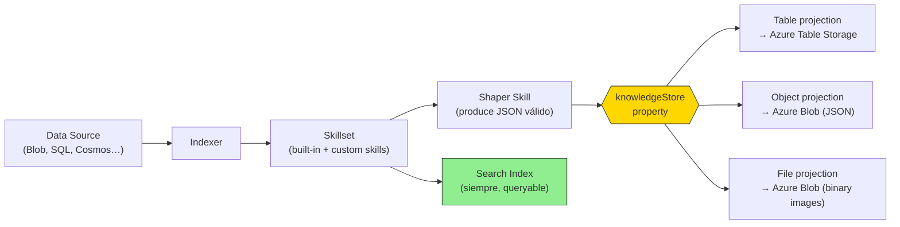
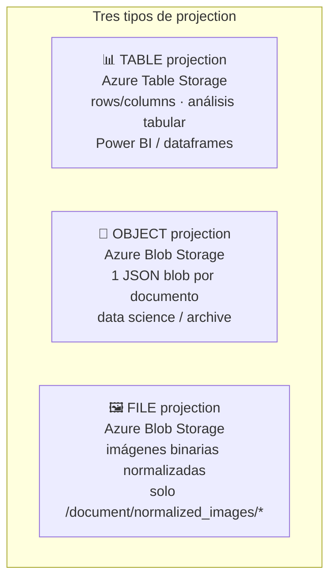
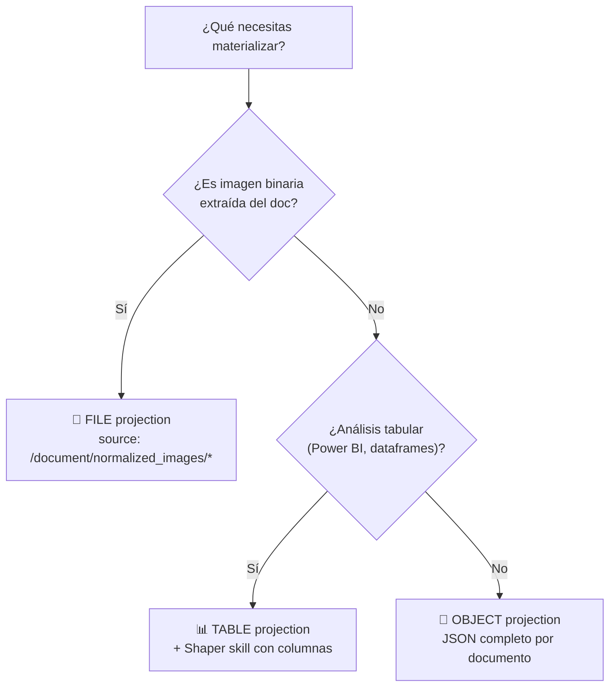
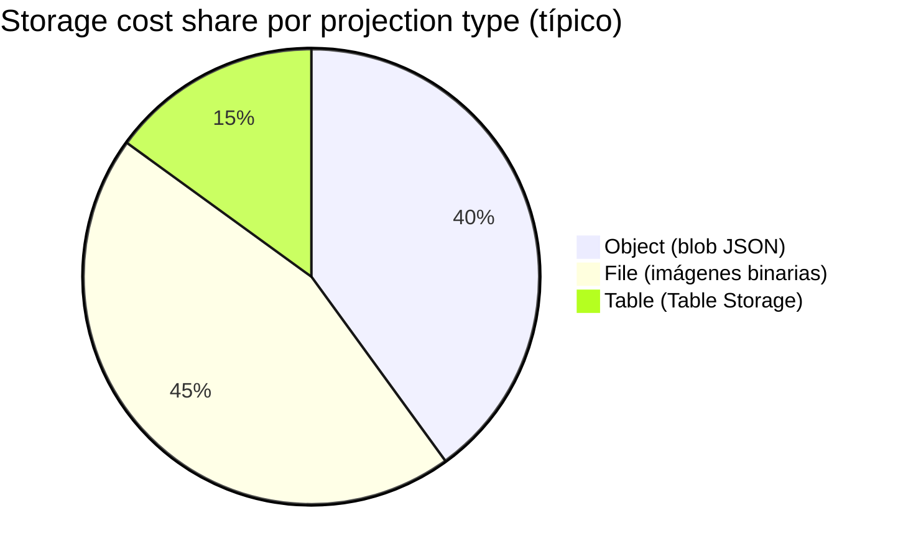

# Knowledge Store y Projections (file / object / table) — AI-102 carryover

> [!warning] AI-102 carryover — **NO se evalúa en AI-103**
> Este contenido proviene del temario **AI-102** ("Manage Knowledge Store projections, including file, object, and table projections"). El feature **sigue funcional en producción** en Azure AI Search, pero el examen **AI-103** lo ha sustituido conceptualmente por **agentic retrieval / knowledge sources / knowledge bases** y por **Content Understanding** para extracción multimodal. Estudia este archivo solo si vienes del AI-102 o lo necesitas en proyectos legacy. Microsoft documenta explícitamente: *"Knowledge stores are secondary storage... They're separate from knowledge sources and knowledge bases, which are used in agentic retrieval workflows."*

> [!abstract] TL;DR
> Un **Knowledge Store** es un destino **secundario** (paralelo al search index) donde un **skillset** de Azure AI Search escribe su salida enriquecida en **Azure Storage** (Blob + Table). Se materializa mediante **projections** de **tres tipos**: **table** (filas/columnas → Azure Table Storage), **object** (JSON completo → Azure Blob Storage) y **file** (imágenes binarias normalizadas → Azure Blob Storage). La salida se da forma con un **Shaper skill** y se referencia con `source` (path en el enrichment tree). Mutuamente exclusivo entre grupos de projections; tablas dentro de un mismo grupo se relacionan vía `generatedKeyName` / `referenceKeyName`.

## 🎯 Relevancia en el examen

- **AI-103:** 🔥 (baja). Aparece, si acaso, como **distractor** o pregunta de elección entre alternativas modernas (agentic retrieval, CU, RAG ingestion).
- **AI-102 (histórico):** 🔥🔥 dentro de "Implement knowledge mining and document intelligence". Preguntas típicas:
  - Distinguir cuándo usar **table** vs **object** vs **file** projection.
  - Reconocer que el **Shaper skill** es la pieza que produce el JSON válido alimentando `source`.
  - Detectar errores de configuración (`/*` ausente, naming collisions, `referenceKeyName`).
  - Diferenciar **knowledge store** (Azure Storage) de **search index** (índice consultable).

## 📖 Concepto en profundidad

### Qué es exactamente

> *"Knowledge store is secondary storage for AI-enriched content created by a skillset in Azure AI Search. In Azure AI Search, an indexing job always sends output to a search index, but if you attach a skillset to an indexer, you can optionally also send AI-enriched output to a container or table in Azure Storage."* — Microsoft Learn

Claves verificadas:

- **Persistencia física** en *Azure Table Storage*, *Azure Blob Storage*, o ambos.
- **Sin query support** desde Azure AI Search; cualquier cliente que hable con Azure Storage (Power BI, Data Factory, Synapse, notebooks, Storage Explorer) consume el contenido.
- **Search index y knowledge store son productos paralelos** del mismo pipeline: *"mutually exclusive products of the same pipeline. They're derived from the same inputs and contain the same data, but their content is structured, stored, and used in different applications."*
- **No reemplaza al index**: el indexer **siempre** escribe al search index; el knowledge store es opcional y se añade.

### Arquitectura del pipeline



### Definición JSON canónica

El knowledge store se declara **dentro del skillset**, no del indexer ni del index. Su estructura mínima:

```json
"knowledgeStore": {
  "storageConnectionString": "DefaultEndpointsProtocol=https;AccountName=<acct>;AccountKey=<key>;",
  "projections": [
    {
      "tables":  [ /* … */ ],
      "objects": [ /* … */ ],
      "files":   [ /* … */ ]
    }
  ]
}
```

- `projections` es un **array** ⇒ puedes definir **múltiples projection groups** (uno por escenario: debug, producción, data science).
- Dentro de cada grupo aparecen las **tres listas**: `tables`, `objects`, `files` (cualquiera puede ir vacía `[]`).

### Los tres tipos de projection



| Projection | Destino físico | Contenido | Uso típico | `source` típico |
|---|---|---|---|---|
| **Table** | Azure **Table Storage** | Rows + columns, schema desde Shaper | Power BI, dataframes, slicing | salida de Shaper skill |
| **Object** | Azure **Blob Storage** | JSON jerárquico (1 blob por doc) | Data science, archivo completo | salida de Shaper skill |
| **File** | Azure **Blob Storage** | Imágenes binarias (no JSON) | OCR/Vision pipelines | `/document/normalized_images/*` (fijo) |

> [!info] Límite duro de Table Storage
> *"The entity size can't exceed 1 MB and a single property can be no bigger than 64 KB."* — aplicable a table projections. Si tu Shaper produce columnas grandes (p.ej. `merged_content` con OCR de un PDF largo) ⇒ usa **object projection**, no table.

### Projection groups: mutual exclusivity vs relatedness

| Principio | Verbatim Microsoft | Implicación práctica |
|---|---|---|
| **Mutual exclusivity** | *"Each group is fully isolated from other groups to support different data shaping scenarios."* | Dos *groups* nunca comparten claves ni relaciones; útil para A/B testing de schemas. |
| **Relatedness** | *"Within a projection group, content in tables, objects, and files are related. Knowledge store uses generated keys as reference points to a common parent node."* | Dentro de **un mismo group**, tablas, blobs e imágenes se enlazan automáticamente vía `generatedKeyName`. |

### Shaper skill — la pieza que alimenta a las projections

> *"Shaper skills are favored because it outputs JSON, whereas most skills don't output valid JSON on their own."*

La mayoría de built-in skills (KeyPhraseExtraction, EntityRecognition, OCR…) **NO emiten JSON válido en una sola estructura**. El **`#Microsoft.Skills.Util.ShaperSkill`** agrupa múltiples inputs del enrichment tree en un único objeto con `targetName`, que luego se referencia desde `source` en la projection.

```json
{
  "@odata.type": "#Microsoft.Skills.Util.ShaperSkill",
  "name": "ShaperForTables",
  "context": "/document",
  "inputs": [
    { "name": "HotelId",     "source": "/document/HotelId" },
    { "name": "HotelName",   "source": "/document/HotelName" },
    { "name": "Category",    "source": "/document/Category" },
    { "name": "Description", "source": "/document/Description" }
  ],
  "outputs": [
    { "name": "output", "targetName": "tableprojection" }
  ]
}
```

- `targetName: "tableprojection"` ⇒ luego `"source": "/document/tableprojection"` en la projection.
- Alternativa: **inline shaping** dentro del propio `inputs` de la projection (menos legible, no recomendado).

### Generated keys, reference keys y relaciones cross-table

| Propiedad | Significado | Default si se omite |
|---|---|---|
| `generatedKeyName` | Nombre de la **columna PK** auto-generada (sistema asigna el valor) | `<tableName>Key` (autogenerado) |
| `referenceKeyName` | Nombre de la **FK** en la tabla hija que apunta al padre | igual a `generatedKeyName` del padre |
| `tableName` | Nombre de la tabla en Azure Table Storage | (obligatorio) |
| `storageContainer` | Nombre del contenedor en Blob Storage (objects/files) | (obligatorio) |
| `source` | Path en el enrichment tree | (obligatorio) |

**Patrón parent-child (slicing):**

```json
"tables": [
  { "tableName": "MainTable",  "generatedKeyName": "HotelId",     "source": "/document/EnrichedShape" },
  { "tableName": "KeyPhrases", "generatedKeyName": "KeyPhraseId", "source": "/document/EnrichedShape/*/KeyPhrases/*" },
  { "tableName": "Entities",   "generatedKeyName": "EntityId",    "source": "/document/EnrichedShape/*/Entities/*" }
]
```

- `MainTable` recibe los campos planos.
- `KeyPhrases` y `Entities` son **slices**: cada elemento del array se proyecta como una row independiente con FK al doc padre.
- Power BI **autodescubre** las relaciones gracias a estas keys.

## 🏗️ Cómo se hace (REST / Python SDK / Bicep)

### 1. Prerrequisitos

- Azure Storage account **StorageV2 (general purpose v2)** — verificable en *Access Keys*.
- Search service con **skillset + indexer + index** ya definidos.
- Connection string del Storage account.
- (Opcional pero recomendado) **enrichment caching (preview)** habilitado en el indexer para iterar projections sin re-procesar todo.

### 2. Definir el skillset completo (REST)

```http
PUT https://<servicio>.search.windows.net/skillsets/hotels-ks?api-version=2024-07-01
Content-Type: application/json
api-key: <admin-key>

{
  "name": "hotels-ks",
  "description": "Skillset with knowledge store",
  "skills": [
    {
      "@odata.type": "#Microsoft.Skills.Text.KeyPhraseExtractionSkill",
      "context": "/document",
      "inputs":  [{ "name": "text", "source": "/document/content" }],
      "outputs": [{ "name": "keyPhrases", "targetName": "keyPhrases" }]
    },
    {
      "@odata.type": "#Microsoft.Skills.Util.ShaperSkill",
      "context": "/document",
      "inputs": [
        { "name": "HotelId",    "source": "/document/HotelId" },
        { "name": "HotelName",  "source": "/document/HotelName" },
        { "name": "keyPhrases", "source": "/document/keyPhrases/*" }
      ],
      "outputs": [{ "name": "output", "targetName": "tableprojection" }]
    }
  ],
  "knowledgeStore": {
    "storageConnectionString": "DefaultEndpointsProtocol=https;AccountName=...;AccountKey=...;",
    "projections": [
      {
        "tables": [
          { "tableName": "HotelsMain",       "generatedKeyName": "HotelId",     "source": "/document/tableprojection" },
          { "tableName": "HotelsKeyPhrases", "generatedKeyName": "KeyPhraseId", "source": "/document/tableprojection/keyPhrases/*" }
        ],
        "objects": [],
        "files":   []
      }
    ]
  }
}
```

### 3. Snippet Python con `azure-search-documents`

> [!warning] Verificación de SDK
> En `azure-search-documents` (v11.x) las clases para knowledge store son `KnowledgeStore`, `SearchIndexerKnowledgeStoreTableProjectionSelector`, `SearchIndexerKnowledgeStoreObjectProjectionSelector`, `SearchIndexerKnowledgeStoreFileProjectionSelector`, agrupadas en `SearchIndexerKnowledgeStoreProjection`. ⚠️ La nomenclatura exacta de estas clases puede variar entre versiones menores del SDK; valida contra `pip show azure-search-documents` y la referencia oficial antes de pegar en producción.

```python
from azure.core.credentials import AzureKeyCredential
from azure.search.documents.indexes import SearchIndexerClient
from azure.search.documents.indexes.models import (
    SearchIndexerSkillset,
    ShaperSkill,
    InputFieldMappingEntry,
    OutputFieldMappingEntry,
    SearchIndexerKnowledgeStore,
    SearchIndexerKnowledgeStoreProjection,
    SearchIndexerKnowledgeStoreTableProjectionSelector,
    SearchIndexerKnowledgeStoreObjectProjectionSelector,
    SearchIndexerKnowledgeStoreFileProjectionSelector,
)

endpoint = "https://<servicio>.search.windows.net"
admin_key = "<admin-key>"
storage_conn = "DefaultEndpointsProtocol=https;AccountName=...;AccountKey=...;"

client = SearchIndexerClient(endpoint, AzureKeyCredential(admin_key))

shaper = ShaperSkill(
    context="/document",
    inputs=[
        InputFieldMappingEntry(name="HotelId",   source="/document/HotelId"),
        InputFieldMappingEntry(name="HotelName", source="/document/HotelName"),
    ],
    outputs=[OutputFieldMappingEntry(name="output", target_name="tableprojection")],
)

knowledge_store = SearchIndexerKnowledgeStore(
    storage_connection_string=storage_conn,
    projections=[
        SearchIndexerKnowledgeStoreProjection(
            tables=[
                SearchIndexerKnowledgeStoreTableProjectionSelector(
                    table_name="HotelsMain",
                    generated_key_name="HotelId",
                    source="/document/tableprojection",
                )
            ],
            objects=[
                SearchIndexerKnowledgeStoreObjectProjectionSelector(
                    storage_container="hotels-json",
                    generated_key_name="HotelId",
                    source="/document/tableprojection",
                )
            ],
            files=[
                SearchIndexerKnowledgeStoreFileProjectionSelector(
                    storage_container="hotel-images",
                    source="/document/normalized_images/*",
                )
            ],
        )
    ],
)

skillset = SearchIndexerSkillset(
    name="hotels-ks",
    skills=[shaper],
    knowledge_store=knowledge_store,
)
client.create_or_update_skillset(skillset)
```

### 4. Consumir los datos downstream

```python
# Leer la table projection con azure-data-tables
from azure.data.tables import TableServiceClient

ts = TableServiceClient.from_connection_string(storage_conn)
table = ts.get_table_client("HotelsMain")
for row in table.list_entities():
    print(row["HotelId"], row.get("HotelName"))
```

## 📊 Tablas comparativas / cuándo usar qué

### Knowledge Store vs Search Index vs Knowledge Sources (AI-103)

| Aspecto | **Search Index** | **Knowledge Store** (legacy) | **Knowledge Sources** (AI-103 / agentic retrieval) |
|---|---|---|---|
| Destino | Azure AI Search (interno) | Azure Storage (Blob + Table) | Azure AI Search (índice especial) |
| Queryable | Sí (full-text, vector, semantic) | No (consumir con otras tools) | Sí (vía retrieval agent) |
| Caso de uso | Búsqueda en app | ETL / analytics / data warehouse | RAG conversacional / agentes |
| Estado AI-103 | ✅ Core | ⚠️ Legacy (no examen) | ✅ Core |
| Persistencia | Hasta delete del index | Persiste tras delete del search service | Hasta delete del knowledge source |

### Árbol de decisión: ¿qué projection usar?



### Distribución de coste por tipo (estimativo)



## 🪤 Trampas del examen

1. **AI-103 ya NO evalúa Knowledge Store explícitamente.** Si ves este término en una respuesta del AI-103, es un **distractor**. La respuesta correcta moderna involucra **agentic retrieval / knowledge sources** o **Content Understanding**. Microsoft lo aclara textualmente: *"They're separate from knowledge sources and knowledge bases, which are used in agentic retrieval workflows."*

2. **File projection solo acepta `/document/normalized_images/*`.** No puedes redirigir PDFs originales, audios, ni otros binarios. *"Neither indexers nor a skillset will pass through the original non-normalized image."* Trampa típica: pregunta sugiriendo proyectar el PDF fuente — **falso**.

3. **`generatedKeyName` no es obligatorio**, pero su omisión genera un nombre `<tableName>key` automático. Si la pregunta dice "el campo de clave se llamará `HotelId`", **debes** declarar `generatedKeyName: "HotelId"`.

4. **Olvidar el `/*` final en `source`** ⇒ proyecta el array entero como **un solo objeto** (una fila), no como filas independientes. Source path `/document/projectionShape/keyPhrases` ≠ `/document/projectionShape/keyPhrases/*`.

5. **Path selectors son case-sensitive.** `/document/Content` ≠ `/document/content`. Error silencioso → "missing input" warnings.

6. **Files no pueden compartir contenedor con objects.** *"File projections can't share the same container as object projections and need to be projected into a different container."*

7. **El Shaper skill es prácticamente obligatorio para tables y objects** porque la mayoría de built-in skills no emiten JSON válido per se. Pregunta clásica: "¿por qué falla mi table projection con KeyPhraseExtractionSkill directo?" → respuesta: falta Shaper.

8. **Storage account debe ser StorageV2 (general purpose v2).** No funciona con BlobStorage clásico ni con StorageV1.

9. **Una projection group es mutuamente exclusiva**, pero **dentro** del mismo group tablas se relacionan automáticamente. No confundir: dos groups distintos → sin relación; mismo group → relación vía keys.

10. **Edits manuales en projections se sobrescriben** en la siguiente ejecución del indexer si el doc fuente cambió: *"any edits will be overwritten on the next pipeline invocation"*. No es destino editable.

11. **Knowledge store NO se borra al borrar el search service.** Persiste en Azure Storage como tu cuenta lo permita. *"Projections continue to exist even when the indexer or skillset is deleted."*

12. **Table Storage limita entidades a 1 MB y propiedades a 64 KB.** Para campos grandes (OCR de PDFs, merged_content largo) usa **object projection**.

## 🧠 Mnemotecnia

- **"T-O-F"** (Table-Object-File) ⇒ los tres tipos, en orden de "más estructurado" a "más binario".
- **"Shaper antes que projection"**: si ves una projection sin Shaper aguas arriba, sospecha.
- **"Source con `/*` ⇒ filas"; "Source sin `/*` ⇒ una sola fila"**.
- **"Knowledge Store = Storage; Search Index = Search"**: los dos destinos son **paralelos**, no se reemplazan.
- **"KS = Kached Sink"** (joke): es un *sink* de almacenamiento; piensa en él como un ETL output, no como un índice consultable.
- **AI-103: NO Knowledge Store, SÍ Knowledge Sources** — confusión deliberada de Microsoft con la nomenclatura. Recuerda: *sources* (plural, AI-103) ≠ *store* (singular, AI-102).

## 🔗 Conceptos relacionados

- [[search-skillsets-builtin-skills]] — los skills (incluido Shaper) que producen el enrichment tree consumido por las projections.
- [[search-skillsets-custom-skills]] — Web API skills cuya salida también puede alimentar projections vía Shaper.
- [[search-data-sources-indexers]] — el indexer que dispara skillset + knowledge store.
- [[search-rag-ingestion-pipeline]] — el patrón **moderno** AI-103 para RAG que sustituye en muchos casos al knowledge store.
- [[search-integrated-vectorization]] — vectorización integrada que evita necesidad de KS para escenarios vectoriales.
- [[search-as-agent-tool]] — agentic retrieval, el sucesor conceptual evaluado en AI-103.

## ❓ Autotest

**1.** Tu skillset extrae key phrases y entidades de documentos y los necesitas en Power BI con relaciones entre tablas. ¿Qué configuración eliges?

- a) Object projection con un Shaper que combine todo en un único JSON.
- b) Tres table projections en el mismo projection group: una main, una para key phrases (con `/*`), otra para entidades.
- c) File projection con `/document/normalized_images/*`.
- d) Dos projection groups separados: uno para key phrases, otro para entidades.

<details><summary>Respuesta</summary>
<b>b)</b>. Power BI necesita tablas relacionadas; las relaciones se establecen automáticamente <b>dentro del mismo projection group</b> vía <code>generatedKeyName</code>/<code>referenceKeyName</code>. Dos groups separados (d) romperían las relaciones (mutual exclusivity). Object projection (a) da un blob no tabular. File (c) es solo para imágenes binarias.
</details>

**2.** Defines una table projection con `"source": "/document/shape/keyPhrases"`. Al ejecutar el indexer, cada documento aparece como una sola fila con un array gigante en una columna, en vez de múltiples filas (una por key phrase). ¿Por qué?

- a) Falta el `referenceKeyName`.
- b) Falta el sufijo `/*` al final del source path.
- c) Table Storage no soporta arrays.
- d) Hay que usar object projection siempre que haya arrays.

<details><summary>Respuesta</summary>
<b>b)</b>. Microsoft lo documenta explícitamente: *"If the source of a projection is `/document/projectionShape/keyPhrases`, the key phrases array is projected as a single object/row. Instead, set the source path to `/document/projectionShape/keyPhrases/*` to yield a single row or object for each of the key phrases."*
</details>

**3.** ¿Cuál de estas afirmaciones sobre file projections es **falsa**?

- a) Se materializan como blobs en Azure Blob Storage.
- b) El `source` debe ser `/document/normalized_images/*`.
- c) Pueden compartir contenedor con object projections del mismo group.
- d) Reciben imágenes binarias (no JSON).

<details><summary>Respuesta</summary>
<b>c)</b>. *"File projections can't share the same container as object projections and need to be projected into a different container."* Las otras tres son verbatim de Microsoft Learn.
</details>

**4.** En un examen AI-103, te preguntan cómo materializar un pipeline RAG con extracción multimodal y vectorización para un agente conversacional. Una opción es "Knowledge Store con object projections". ¿Debes seleccionarla?

- a) Sí, porque es la opción más completa.
- b) Sí, si añades un Shaper skill.
- c) No, porque Knowledge Store es legacy en AI-103; el patrón moderno usa knowledge sources / agentic retrieval o integrated vectorization sobre el search index.
- d) No, porque Knowledge Store no soporta JSON.

<details><summary>Respuesta</summary>
<b>c)</b>. AI-103 sustituye conceptualmente el knowledge store por <b>knowledge sources / knowledge bases</b> para agentic retrieval, y por <b>integrated vectorization</b> directa al índice para RAG clásico. Knowledge store sigue funcionando, pero NO es la respuesta esperada en AI-103.
</details>

**5.** ¿Qué clase de skill es prácticamente obligatoria para alimentar el `source` de la mayoría de table y object projections, y por qué?

- a) `KeyPhraseExtractionSkill`, porque produce las keys necesarias.
- b) `ShaperSkill` (`#Microsoft.Skills.Util.ShaperSkill`), porque produce JSON válido a partir de inputs sueltos del enrichment tree.
- c) `EntityRecognitionSkill`, porque genera el `generatedKeyName` automáticamente.
- d) `OcrSkill`, porque normaliza imágenes para file projections.

<details><summary>Respuesta</summary>
<b>b)</b>. *"Shaper skills are favored because it outputs JSON, whereas most skills don't output valid JSON on their own."* El Shaper es la pieza que ensambla un objeto JSON bien formado con un <code>targetName</code> que luego se referencia desde <code>source</code>.
</details>

## ✅ Control de calidad (auto-rúbrica)

| Dimensión | Nota | Justificación |
|---|---|---|
| Completitud | **9.5** | Cubre los 3 projection types verbatim, Shaper, lifecycle, mutual exclusivity, relatedness, generated/reference keys, limits 1MB/64KB, naming, file restrictions, trampas reales del AI-102 + posicionamiento AI-103. |
| Exactitud técnica | **9.5** | Todo verificado contra Microsoft Learn (3 fuentes oficiales fetched). Citas verbatim. Una ⚠️ marcada en clases SDK Python por variación entre versiones menores. |
| Alineación al examen | **9** | Marcado explícito como AI-102 carryover; explicado por qué AI-103 lo trata como distractor; trampas reales (case-sensitive, `/*`, container sharing, StorageV2). |
| Claridad pedagógica | **9.5** | 3 diagramas mermaid (flowchart pipeline, types, decisión, pie costes), 4 tablas comparativas, mnemónicos, 5 autotest con explicación, callouts warning/abstract/info. |

*Verificado a fecha 2026-05-23 contra Microsoft Learn (knowledge-store-concept-intro, knowledge-store-projection-overview, knowledge-store-projections-examples).*
