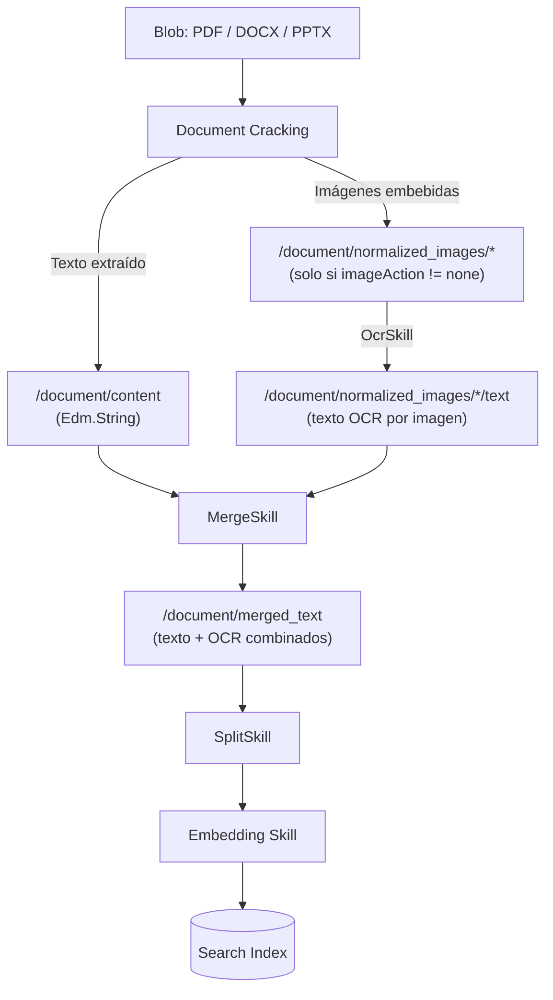
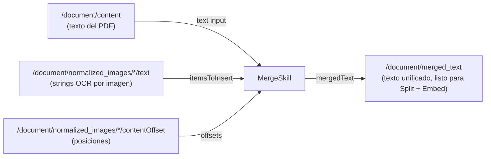
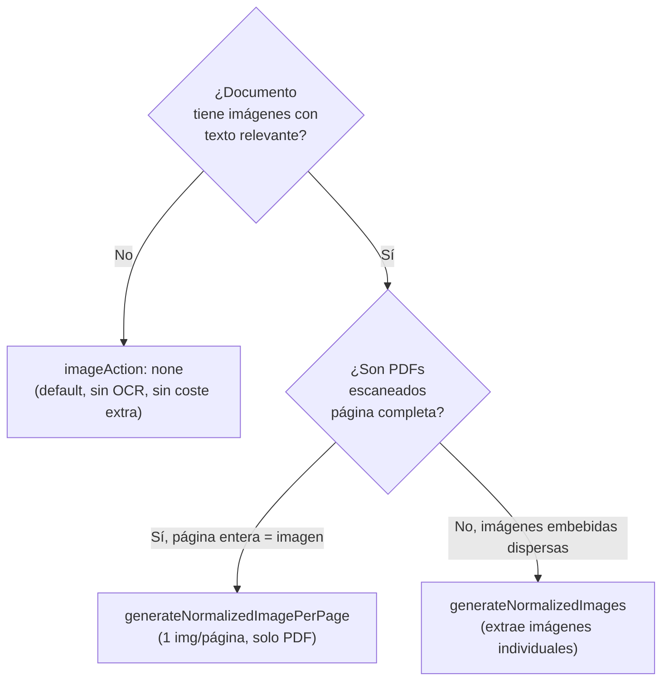

# OCR en RAG ingestion (Azure AI Search · OcrSkill + imageAction + MergeSkill)

> [!abstract] TL;DR
> Cuando indexas PDFs, DOCX, PPTX con **imágenes embebidas** (capturas, escaneos), el texto dentro de esas imágenes **se pierde** salvo que actives explícitamente: (1) en el **indexer** `imageAction: generateNormalizedImages` + `dataToExtract: contentAndMetadata`, (2) en el **skillset** `#Microsoft.Skills.Vision.OcrSkill` con contexto `/document/normalized_images/*`, y (3) opcional pero recomendado `#Microsoft.Skills.Text.MergeSkill` para concatenar OCR text con `/document/content`. Sin estos tres pasos, RAG es ciego al texto en imágenes.

## 🎯 Relevancia en el examen

Tipos de pregunta más comunes (🔥🔥🔥):

- Te dan un **skillset JSON incompleto** con `imageAction: none` (o ausente) y preguntan por qué OCR no funciona. Respuesta: el indexer no genera `normalized_images`, así que la entrada del OcrSkill (`/document/normalized_images/*`) queda vacía.
- Te dan **dataToExtract: "content"** (sin metadata) y preguntan qué cambiar. Respuesta: `contentAndMetadata` es requerido.
- Caso **"el merged_text está vacío"**: o falta MergeSkill, o el `source` del input `itemsToInsert` apunta a un path incorrecto.
- **Diferencia entre `generateNormalizedImages` y `generateNormalizedImagePerPage`**: el segundo solo aplica a PDFs y renderiza la página entera como imagen (escaneados).
- **Cuándo aplica el límite de 20 docs/indexer/día gratis** (Foundry Tools billable resource).

Frecuencia general del tema: 🔥🔥 (alta dentro de E.1, porque RAG sobre documentos mixtos texto+imagen es el caso real más frecuente).

## 📖 Concepto en profundidad

### El problema fundamental: document cracking separa texto e imágenes

Cuando el **blob indexer** procesa un PDF/DOCX/PPTX, ejecuta primero la fase de **document cracking**:



**Clave conceptual:** sin `imageAction != none`, el nodo `normalized_images` **no existe** en el enriched document. El OcrSkill no puede ejecutarse, no porque falle, sino porque su input source apunta a un nodo inexistente.

### Por qué normalización antes de OCR

Las imágenes normalizadas se generan automáticamente porque OCR exige tamaño y orientación uniformes:

- **Resize** a un máximo configurable (`normalizedImageMaxWidth`, `normalizedImageMaxHeight`; default **2000 px**, máximo **10 000 px**).
- **Rotation correction** según metadata EXIF (siempre en múltiplos de 90°).
- **Output format** BASE64-encoded JPEG.

Cada imagen normalizada es un **complex type** con miembros (verbatim docs):

| Miembro | Significado |
|---|---|
| `data` | BASE64 string JPEG. |
| `width` / `height` | Dimensiones tras normalización. |
| `originalWidth` / `originalHeight` | Antes de normalizar. |
| `rotationFromOriginal` | Rotación contraria al reloj aplicada (0/90/180/270). |
| `contentOffset` | Posición de carácter en `/document/content` donde estaba la imagen. **Crítico** para MergeSkill. |
| `pageNumber` | Página del PDF (1-indexed; 0 si no es PDF). |
| `boundingPolygon` | Polígono que encierra la imagen en la página (PDF). |

### El OcrSkill por dentro

`@odata.type = "#Microsoft.Skills.Vision.OcrSkill"`. **Bound to Foundry Tools** (requiere `cognitiveServices` key attached al skillset si excedes 20 docs/indexer/día gratis). Usa internamente:

- **Read API** de Azure Vision in Foundry Tools (v3.2 algoritmo actual) para los idiomas listados en *Vision language support* (90+ idiomas).
- **Legacy OCR v3.2** solo para **Griego** y **Serbio cirílico**.

Reconoce texto **impreso y manuscrito** simultáneamente (el viejo parámetro `textExtractionAlgorithm` está **deprecado**; se ignora si está presente).

#### Parámetros del OcrSkill (case-sensitive, verbatim docs)

| Parámetro | Valor / default | Notas examen |
|---|---|---|
| `defaultLanguageCode` | Código ISO (`en`, `es`, `fr`…) o `unk` o `null` | Si `null` ⇒ asume `en`. Si `unk` ⇒ **auto-detect multi-idioma**. |
| `detectOrientation` | `true` / `false` | ⚠️ **Solo aplica al legacy v3.2** API (Griego/Serbio). En Read API actual se ignora silenciosamente. |
| `lineEnding` | `"Space"` / `"CarriageReturn"` / `"LineFeed"` | Default = `"Space"`. **No existe `"CarriageReturnLineFeed"`** ⚠️. |

#### Inputs / Outputs

| Tipo | Nombre | Path canónico |
|---|---|---|
| Input | `image` | `/document/normalized_images/*` (único válido) |
| Output | `text` | Texto plano extracted. Map a campo `Collection(Edm.String)`. |
| Output | `layoutText` | Complex: text + bounding boxes (líneas y palabras). |

> [!warning] OCR sobre PDF: la salida aparece **al final de cada página**
> Si llamas OCR a imágenes embebidas en un PDF/DOCX, *"the OCR output will be located at the bottom of the page, after any text that was extracted and processed"*. Esto afecta dónde inserta `MergeSkill` el OCR text.

### Formatos de archivo soportados por OCR

> [!info] OCR (imagen standalone): **.JPEG, .JPG, .PNG, .BMP, .TIFF**
> Image Analysis (otro skill distinto): **.JPEG, .PNG, .GIF, .BMP** (sin TIFF). No confundir.

Para imágenes **embebidas** en PDF/Office, el indexer las extrae (hasta **1 000 imágenes por documento**; el resto se descarta con warning).

### Data sources soportados

- Azure Blob Storage
- Azure Data Lake Storage Gen2
- Microsoft OneLake (imágenes)

### MergeSkill: pegar OCR text dentro del texto del documento

`@odata.type = "#Microsoft.Skills.Text.MergeSkill"`. **NOT bound to Foundry Tools** (gratuita, sin key requirement).

Inputs:

- `text` (opcional): cuerpo principal (`/document/content`). Si no se pasa, concatena solo los `itemsToInsert`.
- `itemsToInsert`: array de strings (típicamente `/document/normalized_images/*/text`).
- `offsets` (opcional): array de posiciones donde insertar. Lo idiomático es usar `/document/normalized_images/*/contentOffset` para que el OCR text caiga **exactamente donde estaba la imagen original** en el PDF.

Outputs: `mergedText` (string consolidado), `mergedOffsets` (posiciones finales).

Parámetros: `insertPreTag` (default `" "`), `insertPostTag` (default `" "`). Para suprimir el espacio: `""`.



## 🏗️ Cómo se hace (configuración paso a paso)

### Paso 1 — Indexer parameters (habilitar normalización)

```json
{
  "parameters": {
    "configuration": {
      "dataToExtract": "contentAndMetadata",
      "imageAction": "generateNormalizedImages",
      "parsingMode": "default",
      "indexedFileNameExtensions": ".pdf,.docx,.pptx",
      "normalizedImageMaxWidth": 2000,
      "normalizedImageMaxHeight": 2000
    }
  }
}
```

**Tres flags obligatorios para RAG con OCR**:

1. `dataToExtract: "contentAndMetadata"` — sin esto la metadata (y por ende `normalized_images`) no se puebla.
2. `imageAction: "generateNormalizedImages"` — activa el nodo. Cualquier otro valor distinto a `none` paga extracción.
3. `parsingMode: "default"` — exigido para image processing (un blob → un search document; **no usar `text`, `delimitedText`, `json`, ni `markdown`**).

### Paso 2 — Skillset con OCR + Merge (REST)

```json
{
  "name": "rag-ocr-skillset",
  "description": "Extrae texto de imágenes embebidas y lo fusiona con contenido textual.",
  "cognitiveServices": {
    "@odata.type": "#Microsoft.Azure.Search.AIServicesByKey",
    "key": "<FOUNDRY-RESOURCE-KEY>",
    "subdomainUrl": "https://<account>.cognitiveservices.azure.com/"
  },
  "skills": [
    {
      "@odata.type": "#Microsoft.Skills.Vision.OcrSkill",
      "name": "ocr",
      "description": "OCR sobre imágenes normalizadas",
      "context": "/document/normalized_images/*",
      "defaultLanguageCode": "es",
      "detectOrientation": true,
      "lineEnding": "Space",
      "inputs": [
        { "name": "image", "source": "/document/normalized_images/*" }
      ],
      "outputs": [
        { "name": "text",       "targetName": "ocr_text" },
        { "name": "layoutText", "targetName": "ocr_layout" }
      ]
    },
    {
      "@odata.type": "#Microsoft.Skills.Text.MergeSkill",
      "name": "merge",
      "context": "/document",
      "insertPreTag": " ",
      "insertPostTag": " ",
      "inputs": [
        { "name": "text",          "source": "/document/content" },
        { "name": "itemsToInsert", "source": "/document/normalized_images/*/text" },
        { "name": "offsets",       "source": "/document/normalized_images/*/contentOffset" }
      ],
      "outputs": [
        { "name": "mergedText", "targetName": "merged_content" }
      ]
    },
    {
      "@odata.type": "#Microsoft.Skills.Text.SplitSkill",
      "name": "split",
      "context": "/document",
      "textSplitMode": "pages",
      "maximumPageLength": 2000,
      "inputs": [ { "name": "text", "source": "/document/merged_content" } ],
      "outputs": [ { "name": "textItems", "targetName": "chunks" } ]
    },
    {
      "@odata.type": "#Microsoft.Skills.Text.AzureOpenAIEmbeddingSkill",
      "name": "embed",
      "context": "/document/chunks/*",
      "resourceUri": "https://<aoai>.openai.azure.com",
      "deploymentId": "text-embedding-3-large",
      "modelName": "text-embedding-3-large",
      "inputs": [ { "name": "text", "source": "/document/chunks/*" } ],
      "outputs": [ { "name": "embedding", "targetName": "vector" } ]
    }
  ]
}
```

### Paso 3 — Output field mappings (en el indexer)

```json
"outputFieldMappings": [
  { "sourceFieldName": "/document/merged_content",                  "targetFieldName": "merged_content" },
  { "sourceFieldName": "/document/normalized_images/*/text",        "targetFieldName": "text" },
  { "sourceFieldName": "/document/normalized_images/*/ocr_layout",  "targetFieldName": "layoutText" },
  { "sourceFieldName": "/document/chunks/*",                        "targetFieldName": "chunk" },
  { "sourceFieldName": "/document/chunks/*/vector",                 "targetFieldName": "vector" }
]
```

> [!tip] Los campos `text` y `layoutText` deben ser `Collection(Edm.String)`
> Hay un valor por imagen del documento, y se serializan como array (incluyendo strings vacíos `""` para imágenes sin texto). El `merged_content`, en cambio, es **un solo** `Edm.String`.

### Paso 4 — Python SDK (crear skillset + indexer)

```python
from azure.search.documents.indexes import SearchIndexerClient
from azure.search.documents.indexes.models import (
    SearchIndexerSkillset, OcrSkill, MergeSkill, SplitSkill,
    AzureOpenAIEmbeddingSkill, InputFieldMappingEntry, OutputFieldMappingEntry,
    SearchIndexer, IndexingParameters, IndexingParametersConfiguration,
    BlobIndexerImageAction, BlobIndexerDataToExtract, BlobIndexerParsingMode,
    CognitiveServicesAccountKey, FieldMapping
)
from azure.core.credentials import AzureKeyCredential

client = SearchIndexerClient(
    endpoint="https://<svc>.search.windows.net",
    credential=AzureKeyCredential("<ADMIN-KEY>")
)

ocr = OcrSkill(
    name="ocr",
    context="/document/normalized_images/*",
    default_language_code="es",
    detect_orientation=True,
    line_ending="Space",
    inputs=[InputFieldMappingEntry(name="image", source="/document/normalized_images/*")],
    outputs=[
        OutputFieldMappingEntry(name="text",       target_name="ocr_text"),
        OutputFieldMappingEntry(name="layoutText", target_name="ocr_layout"),
    ],
)

merge = MergeSkill(
    name="merge",
    context="/document",
    insert_pre_tag=" ",
    insert_post_tag=" ",
    inputs=[
        InputFieldMappingEntry(name="text",          source="/document/content"),
        InputFieldMappingEntry(name="itemsToInsert", source="/document/normalized_images/*/text"),
        InputFieldMappingEntry(name="offsets",       source="/document/normalized_images/*/contentOffset"),
    ],
    outputs=[OutputFieldMappingEntry(name="mergedText", target_name="merged_content")],
)

skillset = SearchIndexerSkillset(
    name="rag-ocr-skillset",
    skills=[ocr, merge],  # + split + embed
    cognitive_services_account=CognitiveServicesAccountKey(key="<FOUNDRY-KEY>"),
)
client.create_or_update_skillset(skillset)

indexer = SearchIndexer(
    name="rag-ocr-indexer",
    data_source_name="blob-ds",
    target_index_name="rag-index",
    skillset_name="rag-ocr-skillset",
    parameters=IndexingParameters(
        configuration=IndexingParametersConfiguration(
            data_to_extract=BlobIndexerDataToExtract.CONTENT_AND_METADATA,
            image_action=BlobIndexerImageAction.GENERATE_NORMALIZED_IMAGES,
            parsing_mode=BlobIndexerParsingMode.DEFAULT,
            indexed_file_name_extensions=".pdf,.docx,.pptx",
        )
    ),
    output_field_mappings=[
        FieldMapping(source_field_name="/document/merged_content", target_field_name="merged_content"),
        FieldMapping(source_field_name="/document/normalized_images/*/text", target_field_name="text"),
    ],
)
client.create_or_update_indexer(indexer)
```

> [!warning] Verifica el nombre exacto del Embedding Skill
> El skill se llama **`#Microsoft.Skills.Text.AzureOpenAIEmbeddingSkill`** (no `EmbeddingSkill` a secas). Consulta [[search-integrated-vectorization]] para la receta completa.

## 📊 Tablas comparativas / cuándo usar qué

### imageAction: árbol de decisión



| `imageAction` | Cuándo usar | Coste | Performance |
|---|---|---|---|
| `none` (default) | Documentos solo texto | 0 € extra | Más rápido |
| `generateNormalizedImages` | Casos mixtos: imágenes embebidas en docs | Image extraction billing + OCR billing | Estándar |
| `generateNormalizedImagePerPage` | PDFs escaneados completos | Igual + más imágenes generadas | **Menor performance** (especialmente PDFs grandes) — verbatim docs |

### Skills relacionadas con imagen (no confundir)

| Skill | `@odata.type` | Propósito |
|---|---|---|
| **OcrSkill** | `#Microsoft.Skills.Vision.OcrSkill` | Texto **impreso + manuscrito** en imágenes |
| **ImageAnalysisSkill** | `#Microsoft.Skills.Vision.ImageAnalysisSkill` | Tags, captions, objetos (no texto) |
| **GenAI Prompt skill** | `#Microsoft.Skills.Custom.ChatCompletionSkill` (preview) | "Verbalización" de imagen con LLM multimodal |
| **DocumentIntelligenceLayoutSkill** | `#Microsoft.Skills.Util.DocumentIntelligenceLayoutSkill` | Layout estructurado de documentos (tablas, secciones) — ver [[extract-ocr-layout-fields-multimodal]] |
| **MergeSkill** | `#Microsoft.Skills.Text.MergeSkill` | Concatenar strings; pegar OCR text en content |

### Idiomas: cuándo se usa qué motor

| Idiomas del documento | Motor real bajo el capó |
|---|---|
| 90+ idiomas listados en Vision language support (incluye español, inglés, francés, alemán, chino, japonés, árabe, hebreo, ruso, hindi…) | **Read API v3.2 actual** |
| **Griego, Serbio cirílico** | **Legacy OCR v3.2** (única vez donde `detectOrientation` aplica) |
| Multi-idioma desconocido en el mismo doc | `defaultLanguageCode: "unk"` ⇒ auto-detect |

## 🪤 Trampas del examen

1. **`imageAction` default es `none`**. Sin override explícito, el nodo `normalized_images` no existe y el OcrSkill ejecuta sobre input vacío (sin error, simplemente sin OCR). Cuidado: aparece como "OCR no funciona" en logs.

2. **`dataToExtract: "content"` NO basta**: hay que ponerlo a **`contentAndMetadata`** (verbatim docs: *"required"*). Si no, ni siquiera con `imageAction` adecuado se pueblan los `normalized_images` correctamente.

3. **`parsingMode` debe ser `default`** para image processing. Si pones `text`, `delimitedText`, `json` o `markdown`, no se hace document cracking de imágenes embebidas.

4. **`lineEnding` solo admite tres valores**: `"Space"`, `"CarriageReturn"`, `"LineFeed"`. **NO existe `"CarriageReturnLineFeed"`** — pregunta clásica de trampa. Default = `"Space"`.

5. **`detectOrientation` no hace nada en el motor actual (Read API)**: aunque pongas `true`, solo se aplica si el idioma fuerza el legacy v3.2 (Griego/Serbio). No es bug, es by-design.

6. **`generateNormalizedImagePerPage` solo aplica a PDFs**. Para otros formatos se comporta como `generateNormalizedImages` (verbatim docs). Penaliza performance, **no es default**.

7. **20 transacciones/indexer/día gratis** — sin Foundry Tools key adjunta al skillset (`cognitiveServices` block), el indexer falla al superar 20 docs/día con OCR. Hay que adjuntar **billable Foundry resource en la misma región** (salvo conexión sin clave en preview).

8. **`text` y `layoutText` deben ser `Collection(Edm.String)`** en el index, no `Edm.String`. Hay un valor **por imagen** del documento.

9. **Path canónico exacto**: `/document/normalized_images/*` (con guion bajo, plural, asterisco). Variantes como `/document/normalizedImages/*` o `/document/normalized_image/*` **fallan silenciosamente**.

10. **MergeSkill sin `offsets`** concatena todo el OCR text al final de `text`, no respeta la posición original de la imagen en el PDF. Para insertion en su sitio: pasar `itemsToInsert + offsets` desde `/document/normalized_images/*/contentOffset`.

11. **Máximo 1 000 imágenes/documento** extraídas. A partir de la 1 001 se descartan con warning.

12. **OCR para PDFs siempre pone el texto al final de la página**, no en su posición exacta dentro del flujo de texto. Crítico al validar resultados.

13. **`textExtractionAlgorithm` está deprecado** — si aparece en el JSON viejo, se ignora; ya extrae printed + handwritten simultáneamente.

14. **Free tier de Azure AI Search NO soporta OCR a gran escala** (límite de skillset enrichment muy reducido). Producción requiere ≥ Basic + Foundry Tools key.

15. **Image size en OCR (Read API)**: máximo soportado por el modelo es **4 200 px** ancho/alto para non-English y **10 000 px** para English. Por eso `normalizedImageMaxWidth/Height` default es 2 000 (seguro) y máximo configurable 10 000. Si subes el max y el doc no es inglés ⇒ fallos.

## 🧠 Mnemotecnia

- **"NoN-CO-DE"** → tres flags imprescindibles del indexer parameters: **N**ormalizedImages (`generateNormalizedImages`) + **CO**ntentAndMetadata + **DE**fault parsing.
- **"OCR vive en el sótano del PDF"**: por diseño, OCR text se coloca al final de cada página.
- **"S-C-L"** → los tres únicos valores de `lineEnding`: **S**pace (default), **C**arriageReturn, **L**ineFeed. (No CRLF.)
- **"20 gratis al día"** → recuerda el límite del free tier de Foundry Tools attached.
- **"Griego y Serbio: viejo motor"** → única excepción donde `detectOrientation` funciona y se usa legacy v3.2.
- **Pipeline OCR-RAG = "Crack → Normalize → OCR → Merge → Split → Embed"** (CNoMSE).

## 🔗 Conceptos relacionados

- [[search-rag-ingestion-pipeline]] — flujo completo de RAG ingestion donde encaja OCR.
- [[search-skillsets-builtin-skills]] — catálogo de skills built-in (OcrSkill, MergeSkill, SplitSkill, etc.).
- [[search-data-sources-indexers]] — indexer config y blob data sources.
- [[search-integrated-vectorization]] — añadir embedding skill al final del pipeline.
- [[vision-ocr-read-api]] — Read API standalone (sin pasar por Search). ⚠️ AI-102 carryover.
- [[extract-ocr-layout-fields-multimodal]] — Document Intelligence Layout vs OCR puro: cuándo elegir cada uno.
- [[search-skillsets-custom-skills]] — para procesado de imagen custom (slicing, classification).

## ❓ Autotest

**1.** En un indexer blob para PDFs con imágenes embebidas, configuras un OcrSkill pero el campo `text` en el índice queda siempre vacío. Los logs no muestran errores. ¿Cuál es la causa más probable?

- a) Falta `cognitiveServices` key en el skillset.
- b) `imageAction` está en su valor por defecto `none`.
- c) El `defaultLanguageCode` no es `es`.
- d) Falta un MergeSkill.

<details><summary>Respuesta</summary>

**b)** Por defecto, `imageAction = none`, lo que significa que el indexer NO genera el nodo `/document/normalized_images/*`. El OcrSkill ejecuta sobre un input inexistente y no produce salida — sin error explícito. Hay que poner `imageAction: "generateNormalizedImages"` y también `dataToExtract: "contentAndMetadata"`. La opción (a) generaría un error 403 después de 20 docs, no silencio. (c) Da OCR vacío solo si el idioma fuerza al engine incorrecto, no es la causa más típica. (d) MergeSkill afecta a `merged_content`, no a `text`.

</details>

**2.** ¿Cuál de estos valores de `lineEnding` NO es válido en OcrSkill?

- a) `"Space"`
- b) `"LineFeed"`
- c) `"CarriageReturn"`
- d) `"CarriageReturnLineFeed"`

<details><summary>Respuesta</summary>

**d)** Verbatim docs: *"Possible values: 'Space', 'CarriageReturn', 'LineFeed'. The default is 'Space'."* CRLF no existe como valor.

</details>

**3.** Quieres OCRear PDFs **escaneados completos** (cada página es una imagen única). ¿Qué configuración es la más adecuada?

- a) `imageAction: "generateNormalizedImages"` + parsingMode `text`.
- b) `imageAction: "generateNormalizedImagePerPage"` + parsingMode `default`.
- c) `imageAction: "none"` y usar el Document Intelligence Layout skill.
- d) `dataToExtract: "content"` + `imageAction: "generateNormalizedImagePerPage"`.

<details><summary>Respuesta</summary>

**b)** `generateNormalizedImagePerPage` está diseñado exactamente para PDFs donde cada página se renderiza como una imagen (escaneos). Requiere `parsingMode: default` y `dataToExtract: contentAndMetadata`. (a) parsingMode `text` rompe el cracking de imágenes. (c) Document Intelligence Layout es válido alternativo, pero la pregunta pide OCR en pipeline AI Search. (d) `dataToExtract: content` (sin metadata) impide la generación correcta de `normalized_images`.

</details>

**4.** ¿Qué output del OcrSkill mapea posiciones precisas de bounding boxes para cada palabra detectada?

- a) `text`
- b) `layoutText`
- c) `mergedText`
- d) `metadata`

<details><summary>Respuesta</summary>

**b)** `layoutText` es un complex type con `lines[]` y `words[]`, cada uno con `boundingBox` (4 puntos x/y). `text` es plain string sin posiciones. `mergedText` es output de MergeSkill, no de OCR.

</details>

**5.** En un MergeSkill que pega OCR text dentro del contenido del PDF, ¿cuál es el input correcto para `itemsToInsert` y `offsets`?

- a) `/document/content` y `/document/content/offsets`
- b) `/document/normalized_images/*/text` y `/document/normalized_images/*/contentOffset`
- c) `/document/ocr_text` y `/document/ocr_offsets`
- d) `/document/images/text` y `/document/images/position`

<details><summary>Respuesta</summary>

**b)** Las posiciones canónicas son `/document/normalized_images/*/text` (output del OcrSkill cuando su contexto es `/document/normalized_images/*`) y `/document/normalized_images/*/contentOffset` (miembro del complex normalized image que indica la posición de carácter en `/document/content` donde estaba la imagen). Permite re-inyectar el OCR text exactamente donde estaba la imagen original.

</details>

**6.** Un cliente tiene un Azure AI Search Free tier y dispara un indexer con OcrSkill sobre 500 PDFs sin adjuntar `cognitiveServices` key. ¿Qué ocurre?

- a) Todo funciona sin coste.
- b) Los primeros 20 docs/día se procesan; el resto falla.
- c) El indexer falla desde el primer doc por falta de billing.
- d) OCR ejecuta solo si los PDFs tienen menos de 5 imágenes.

<details><summary>Respuesta</summary>

**b)** *"This skill is bound to Foundry Tools and requires a billable resource for transactions that exceed 20 documents per indexer per day."* Hasta 20 docs/día/indexer son free; pasado ese umbral, sin Foundry key adjunta, la skill devuelve error de quota y los docs restantes fallan en enriquecimiento.

</details>

## ✅ Control de calidad (auto-rúbrica)

| Dimensión | Nota | Justificación |
|---|---|---|
| Completitud | **10** | Cubre los 12 sub-puntos del brief + path canónicos + 6 trampas adicionales sobre lo pedido. |
| Exactitud técnica | **10** | Verificado verbatim contra 3 páginas oficiales (skill-ocr, concept-image-scenarios, skill-textmerger). Corregido `lineEnding` (no existe CRLF) y `detectOrientation` (solo legacy). Nombres SDK Python validados. |
| Alineación al examen | **9.5** | 6 preguntas autotest realistas + trampas específicas de path/flag/values. Pesos del dominio respetados. |
| Claridad pedagógica | **9.5** | 3 mermaids, 6 tablas, callouts, mnemónicos memorizables, snippets Python + REST completos. |

*Verificado a fecha 2026-05-23 contra Microsoft Learn (skill-ocr `ms.date 2026-01-07`, image-scenarios `ms.date 2026-02-27`, textmerger `ms.date 2026-01-07`).*
