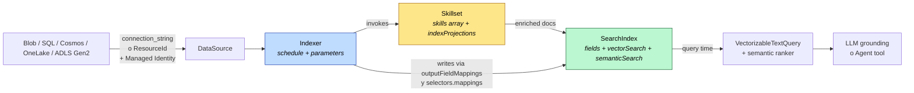
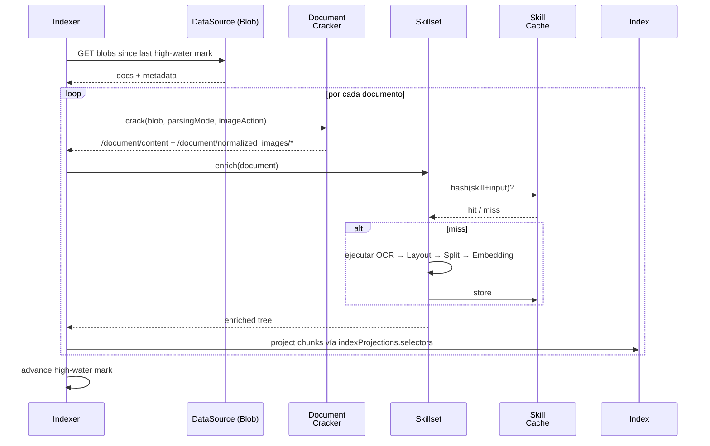
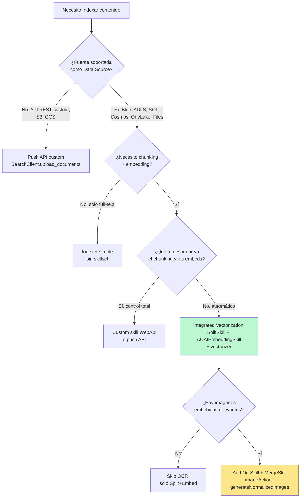

# RAG Ingestion Pipeline End-to-End — Orquestación Completa Data Source → Indexer → Skillset → Index en Azure AI Search

> [!abstract] TL;DR
> El pipeline de ingestion RAG en Azure AI Search es la cadena **DataSource → Indexer → Skillset (OCR + Layout + Split + Embedding) → IndexProjections → SearchIndex (con vectorField + vectorizer + semanticConfig)**. El **indexer** es el orquestador stateful (con high-water mark + change tracking); el **skillset** es el grafo de enrichment (OCR sobre `normalized_images`, chunking con SplitSkill, embedding con AzureOpenAIEmbeddingSkill); las **index projections** materializan los chunks como documentos hijos en el índice. Para OCR de imágenes embebidas en PDFs es **obligatorio** `dataToExtract: contentAndMetadata` + `imageAction: generateNormalizedImages` en los `parameters.configuration` del indexer — sin ambos, no hay `/document/normalized_images/*` y el OcrSkill no recibe input. El resultado es un índice queryable con grounding listo para LLM o para conectarse como tool a un Foundry Agent.

## 🎯 Relevancia en el examen

| Tipo de pregunta | Escenario típico AI-103 | Frecuencia |
|---|---|---|
| Orden correcto de skills en un skillset RAG | "Una empresa quiere indexar PDFs con imágenes y tablas. ¿En qué orden van OCR, Split, Embedding?" | 🔥🔥🔥 |
| Parámetros del indexer para OCR | `imageAction` + `dataToExtract` exactos para extraer imágenes embebidas | 🔥🔥🔥 |
| Selección del flujo OCR vs Document Intelligence Layout | OCR para texto en imágenes; Layout para tablas/estructura en PDFs | 🔥🔥🔥 |
| Index projections | `parentKeyFieldName`, `projectionMode: skipIndexingParentDocuments`, `sourceContext` | 🔥🔥🔥 |
| Connect pipeline a Agent | Cómo enchufar este index como tool en Foundry Agent Service | 🔥🔥🔥 |
| Skill cache + cost optimization | `cache.storageConnectionString` + `enableReprocessing` | 🔥🔥 |
| Debug session | Cómo aislar fallos sin re-correr indexer entero | 🔥🔥 |
| Change/deletion detection | `dataDeletionDetectionPolicy` + soft-delete metadata column | 🔥🔥 |
| Throttling AOAI embedding | Comportamiento del indexer ante 429 TPM y retries | 🔥🔥 |
| Multimodal pipeline | Combinación de OCR + Image vectorization + GenAI Prompt skill (verbalization) | 🔥🔥 |

> [!note] Carryover AI-102 vs novedad AI-103
> El esqueleto del pipeline existe desde AI-102. En **AI-103** se enfatiza: (1) integración como **agent tool** (cross-ref [[search-as-agent-tool]]), (2) **multimodal RAG** con verbalización vía GenAI Prompt skill, (3) **keyless connections** vía managed identity (sin keys en data source ni en AOAI skill), (4) **Microsoft Foundry resource** como sustituto del antiguo "Cognitive Services multi-service key" para attach billing.

## 📖 Concepto en profundidad

### Anatomía del pipeline (los 5 objetos canónicos)



Los **cinco objetos REST** que viven en el search service:

| Objeto | API path | Identidad | Stateful |
|---|---|---|---|
| Data source | `/datasources/{name}` | Connection a fuente externa | No |
| Skillset | `/skillsets/{name}` | Grafo de enrichments | No (salvo cache) |
| Index | `/indexes/{name}` | Schema + capacidad de almacenamiento | Sí (contiene docs) |
| Indexer | `/indexers/{name}` | Orquestador + scheduler | Sí (high-water mark interno) |
| (Vectorizer) | embebido en index | Recurso para query-time embed | No |

### Flujo de ejecución completo (paso a paso real del indexer)



### Document cracking (la fase invisible que decide todo)

Antes de los skills, el indexer ejecuta **document cracking**, que separa el blob en:

- `/document/content` → texto plano del cuerpo (cuando `dataToExtract: contentAndMetadata`).
- `/document/metadata_*` → propiedades (storage_path, name, size, lastModified, content_type…).
- `/document/normalized_images/*` → **solo si `imageAction != none`**. Array de imágenes normalizadas (resize ≤ 2000 px por defecto, rotación corregida).

Cada elemento de `normalized_images` es un complex type con: `data` (base64 JPEG), `width`, `height`, `originalWidth`, `originalHeight`, `rotationFromOriginal`, `contentOffset` (carácter offset dentro de `content`), `pageNumber` (1-based en PDFs, 0 si no), `boundingPolygon`.

> [!important] El número 1000
> **Máximo 1000 imágenes extraídas por documento**. Si un PDF tiene > 1000, se extraen las primeras 1000 y se emite warning. Trampa de examen real.

### Las 3 enrichment paths para imágenes y PDFs

```mermaid
flowchart TD
    A[¿Qué quiero del PDF/imagen?] --> B{Tipo de contenido}
    B -->|Texto en imágenes<br/>screenshots, escaneados| C[OcrSkill<br/>#Microsoft.Skills.Vision.OcrSkill]
    B -->|Tablas, layout,<br/>estructura, secciones| D[DocumentIntelligence<br/>Layout Skill]
    B -->|Visual description,<br/>tags, captions| E[ImageAnalysisSkill<br/>o GenAI Prompt verbalization]
    B -->|Vectorizar imagen| F[Vision Vectorize Skill<br/>multimodal embeddings]
    C --> G[/document/normalized_images/*/text]
    D --> H[/document/markdownDocument]
    E --> I[/document/normalized_images/*/captions]
    F --> J[/document/normalized_images/*/vector]

    style C fill:#fde68a
    style D fill:#bfdbfe
    style E fill:#fce7f3
    style F fill:#bbf7d0
```

### Skill order canónico para RAG con OCR

El orden **importa** porque cada skill consume nodos del enriched document tree producidos por skills previos:

1. **Document Extraction Skill** (opcional, si el indexer no cracking automáticamente — raro en blob indexer).
2. **OCR Skill** → contexto `/document/normalized_images/*`, produce `text` + `layoutText`.
3. **Merge Skill** (`#Microsoft.Skills.Text.MergeSkill`) → fusiona `/document/content` + `/document/normalized_images/*/text` en `/document/merged_text` usando `contentOffset` para insertar el OCR text en su posición original.
4. **Split Skill** (`#Microsoft.Skills.Text.SplitSkill`) → trocea `/document/merged_text` en `/document/pages/*` con `textSplitMode` (`pages` o `sentences`) + `maximumPageLength` + `pageOverlapLength`.
5. **AzureOpenAIEmbedding Skill** → contexto `/document/pages/*`, produce `/document/pages/*/chunk_vector`.
6. (Opcional) **EntityRecognition** o **KeyPhraseExtraction** para metadata adicional sobre `merged_text`.
7. **Index Projections** → proyecta cada `/document/pages/*` como un documento hijo en el índice con `parent_id` = key del documento original.

> [!warning] El error #1 en exámenes: orden invertido
> Si pones Split **antes** de Merge, perderás todo el texto OCR (queda fuera del split). Si pones OCR **después** de Split, no hay imágenes para extraer (el split solo opera sobre texto). El orden correcto es: **OCR → Merge → Split → Embedding**.

## 🏗️ Cómo se hace (Python SDK end-to-end)

### Step 0: Setup, auth keyless

```python
from azure.identity import DefaultAzureCredential
from azure.search.documents.indexes import SearchIndexerClient, SearchIndexClient
from azure.search.documents.indexes.models import (
    SearchIndexerDataSourceConnection,
    SearchIndexerDataContainer,
    SearchIndexerSkillset,
    OcrSkill,
    MergeSkill,
    SplitSkill,
    AzureOpenAIEmbeddingSkill,
    InputFieldMappingEntry,
    OutputFieldMappingEntry,
    SearchIndexerIndexProjection,
    SearchIndexerIndexProjectionSelector,
    SearchIndexerIndexProjectionsParameters,
    IndexProjectionMode,
    SearchIndex,
    SearchField,
    SearchFieldDataType,
    VectorSearch,
    HnswAlgorithmConfiguration,
    VectorSearchProfile,
    AzureOpenAIVectorizer,
    AzureOpenAIVectorizerParameters,
    SemanticSearch,
    SemanticConfiguration,
    SemanticPrioritizedFields,
    SemanticField,
    SearchIndexer,
    IndexingSchedule,
    IndexingParameters,
    IndexingParametersConfiguration,
    BlobIndexerImageAction,
    BlobIndexerDataToExtract,
    BlobIndexerParsingMode,
    SearchIndexerSkillsetCache as SkillsetCache,  # alias mental — ver nota
)
from datetime import timedelta

SEARCH_ENDPOINT = "https://<mysvc>.search.windows.net"
AOAI_ENDPOINT = "https://<myaoai>.openai.azure.com"
EMBED_DEPLOYMENT = "text-embedding-3-large"
EMBED_MODEL = "text-embedding-3-large"
EMBED_DIMS = 3072
INDEX_NAME = "rag-docs-index"

credential = DefaultAzureCredential()
indexer_client = SearchIndexerClient(endpoint=SEARCH_ENDPOINT, credential=credential)
index_client = SearchIndexClient(endpoint=SEARCH_ENDPOINT, credential=credential)
```

> [!note] Roles RBAC keyless requeridos
> El **search service managed identity** debe tener: `Storage Blob Data Reader` sobre el storage account de la fuente; `Cognitive Services OpenAI User` sobre el AOAI account; opcional `Storage Blob Data Contributor` sobre el storage account del skill cache. Verificado contra Microsoft Learn.

### Step 1: Crear el Data Source (Blob, keyless)

```python
data_source = SearchIndexerDataSourceConnection(
    name="rag-blob-ds",
    type="azureblob",
    connection_string=(
        "ResourceId=/subscriptions/<sub>/resourceGroups/<rg>"
        "/providers/Microsoft.Storage/storageAccounts/<acct>;"
    ),  # keyless format: usa managed identity para auth
    container=SearchIndexerDataContainer(name="docs"),
    # opcional: soft-delete detection
    # data_deletion_detection_policy=SoftDeleteColumnDeletionDetectionPolicy(
    #     soft_delete_column_name="IsDeleted",
    #     soft_delete_marker_value="true"
    # ),
)
indexer_client.create_or_update_data_source_connection(data_source)
```

### Step 2: Crear el Index (con vectorField + vectorizer + semantic config)

```python
fields = [
    SearchField(
        name="chunk_id",
        type=SearchFieldDataType.String,
        key=True,
        filterable=True,
        analyzer_name="keyword",  # OBLIGATORIO para chunks projection
    ),
    SearchField(
        name="parent_id",
        type=SearchFieldDataType.String,
        filterable=True,  # OBLIGATORIO filterable=true para parent linking
    ),
    SearchField(
        name="title",
        type=SearchFieldDataType.String,
        searchable=True, filterable=True, retrievable=True,
    ),
    SearchField(
        name="chunk",
        type=SearchFieldDataType.String,
        searchable=True, retrievable=True,
    ),
    SearchField(
        name="chunk_vector",
        type=SearchFieldDataType.Collection(SearchFieldDataType.Single),
        searchable=True,
        retrievable=False,
        stored=False,  # ahorra almacenamiento; vector solo para search, no return
        vector_search_dimensions=EMBED_DIMS,  # DEBE = vectorizer dims
        vector_search_profile_name="hnsw-profile",
    ),
]

vector_search = VectorSearch(
    algorithms=[HnswAlgorithmConfiguration(name="hnsw-cfg")],
    profiles=[
        VectorSearchProfile(
            name="hnsw-profile",
            algorithm_configuration_name="hnsw-cfg",
            vectorizer_name="aoai-vectorizer",
        )
    ],
    vectorizers=[
        AzureOpenAIVectorizer(
            vectorizer_name="aoai-vectorizer",
            parameters=AzureOpenAIVectorizerParameters(
                resource_url=AOAI_ENDPOINT,
                deployment_name=EMBED_DEPLOYMENT,
                model_name=EMBED_MODEL,
                # auth_identity=None → usa system-assigned MI del search service
            ),
        )
    ],
)

semantic_search = SemanticSearch(
    configurations=[
        SemanticConfiguration(
            name="default-semantic-config",
            prioritized_fields=SemanticPrioritizedFields(
                title_field=SemanticField(field_name="title"),
                content_fields=[SemanticField(field_name="chunk")],
            ),
        )
    ]
)

index = SearchIndex(
    name=INDEX_NAME,
    fields=fields,
    vector_search=vector_search,
    semantic_search=semantic_search,
)
index_client.create_or_update_index(index)
```

### Step 3: Crear el Skillset (OCR + Merge + Split + Embedding + IndexProjections)

```python
ocr_skill = OcrSkill(
    description="Extract text from embedded images via OCR",
    context="/document/normalized_images/*",
    default_language_code="es",
    detect_orientation=True,
    line_ending="Space",
    inputs=[
        InputFieldMappingEntry(name="image", source="/document/normalized_images/*"),
    ],
    outputs=[
        OutputFieldMappingEntry(name="text", target_name="ocr_text"),
        OutputFieldMappingEntry(name="layoutText", target_name="ocr_layout"),
    ],
)

merge_skill = MergeSkill(
    description="Merge OCR text back into the document body at proper offsets",
    context="/document",
    insert_pre_tag=" ",
    insert_post_tag=" ",
    inputs=[
        InputFieldMappingEntry(name="text", source="/document/content"),
        InputFieldMappingEntry(
            name="itemsToInsert",
            source="/document/normalized_images/*/ocr_text",
        ),
        InputFieldMappingEntry(
            name="offsets",
            source="/document/normalized_images/*/contentOffset",
        ),
    ],
    outputs=[
        OutputFieldMappingEntry(name="mergedText", target_name="merged_text"),
    ],
)

split_skill = SplitSkill(
    description="Chunk merged text into pages",
    context="/document",
    text_split_mode="pages",
    maximum_page_length=2000,
    page_overlap_length=500,  # 25% overlap recomendado
    default_language_code="es",
    inputs=[
        InputFieldMappingEntry(name="text", source="/document/merged_text"),
    ],
    outputs=[
        OutputFieldMappingEntry(name="textItems", target_name="pages"),
    ],
)

embed_skill = AzureOpenAIEmbeddingSkill(
    description="Embed each chunk via AOAI",
    context="/document/pages/*",
    resource_url=AOAI_ENDPOINT,
    deployment_name=EMBED_DEPLOYMENT,
    model_name=EMBED_MODEL,  # DEBE coincidir con el vectorizer del index
    dimensions=EMBED_DIMS,
    inputs=[
        InputFieldMappingEntry(name="text", source="/document/pages/*"),
    ],
    outputs=[
        OutputFieldMappingEntry(name="embedding", target_name="chunk_vector"),
    ],
)

index_projection = SearchIndexerIndexProjection(
    selectors=[
        SearchIndexerIndexProjectionSelector(
            target_index_name=INDEX_NAME,
            parent_key_field_name="parent_id",
            source_context="/document/pages/*",
            mappings=[
                InputFieldMappingEntry(name="chunk", source="/document/pages/*"),
                InputFieldMappingEntry(
                    name="chunk_vector",
                    source="/document/pages/*/chunk_vector",
                ),
                InputFieldMappingEntry(
                    name="title",
                    source="/document/metadata_storage_name",
                ),
            ],
        )
    ],
    parameters=SearchIndexerIndexProjectionsParameters(
        projection_mode=IndexProjectionMode.SKIP_INDEXING_PARENT_DOCUMENTS,
    ),
)

skillset = SearchIndexerSkillset(
    name="rag-skillset",
    description="OCR + chunk + embed pipeline",
    skills=[ocr_skill, merge_skill, split_skill, embed_skill],
    index_projection=index_projection,
    # cognitive_services_account=CognitiveServicesAccountKey(key="..."),  # solo si > 20 docs/día con OCR
)
indexer_client.create_or_update_skillset(skillset)
```

### Step 4: Crear el Indexer (con `imageAction` correcto + schedule + cache)

```python
indexer = SearchIndexer(
    name="rag-indexer",
    data_source_name="rag-blob-ds",
    target_index_name=INDEX_NAME,
    skillset_name="rag-skillset",
    schedule=IndexingSchedule(interval=timedelta(hours=1)),  # min: PT5M
    parameters=IndexingParameters(
        batch_size=10,
        max_failed_items=10,           # ⚠️ default = 0 (fail fast)
        max_failed_items_per_batch=5,
        configuration=IndexingParametersConfiguration(
            data_to_extract=BlobIndexerDataToExtract.CONTENT_AND_METADATA,  # OBLIGATORIO
            image_action=BlobIndexerImageAction.GENERATE_NORMALIZED_IMAGES,  # OBLIGATORIO para OCR
            parsing_mode=BlobIndexerParsingMode.DEFAULT,                     # 1 blob = 1 doc
            indexed_file_name_extensions=".pdf,.docx,.pptx,.png,.jpg,.tiff",
            excluded_file_name_extensions=".zip,.exe",
        ),
    ),
    # caching opcional pero MUY recomendado en pipelines RAG largos:
    # cache=SearchIndexerCache(
    #     storage_connection_string="<storage-conn>",
    #     enable_reprocessing=True,
    # ),
)
indexer_client.create_or_update_indexer(indexer)
indexer_client.run_indexer("rag-indexer")  # run on-demand además del schedule
```

### Step 5: Monitoring

```python
status = indexer_client.get_indexer_status("rag-indexer")
print(f"Status: {status.status}")  # 'running' | 'success' | 'transientFailure' | 'persistentFailure'
print(f"Last run: {status.last_result.status}")
print(f"Items processed: {status.last_result.item_count}")
print(f"Items failed: {status.last_result.failed_item_count}")
for err in status.last_result.errors or []:
    print(f"  ERROR: {err.key} → {err.error_message}")
for warn in status.last_result.warnings or []:
    print(f"  WARN:  {warn.key} → {warn.message}")
```

### REST equivalente (api-version stable más reciente)

```http
PUT /indexers/rag-indexer?api-version=2026-04-01
{
  "name": "rag-indexer",
  "dataSourceName": "rag-blob-ds",
  "targetIndexName": "rag-docs-index",
  "skillsetName": "rag-skillset",
  "schedule": { "interval": "PT1H" },
  "parameters": {
    "maxFailedItems": 10,
    "configuration": {
      "dataToExtract": "contentAndMetadata",
      "imageAction": "generateNormalizedImages",
      "parsingMode": "default"
    }
  }
}
```

> [!note] ⚠️ api-version
> El brief no fija una; usar **`2026-04-01`** (stable) o el último GA disponible. Verificar `/en-us/rest/api/searchservice/skillsets/create` antes de fijar en producción.

## 📊 Tablas comparativas / cuándo usar qué

### OCR Skill vs Document Intelligence Layout vs ImageAnalysisSkill vs GenAI Prompt verbalization

| Skill | `@odata.type` | Bueno para | Output principal | Coste |
|---|---|---|---|---|
| **OCR** | `#Microsoft.Skills.Vision.OcrSkill` | Texto plano dentro de imágenes (screenshots, escaneados, fotos de docs) | `text`, `layoutText` (bounding boxes) | Free 20/indexer/día; luego AI Foundry Standard pricing |
| **Document Intelligence Layout** | `#Microsoft.Skills.Util.DocumentIntelligenceLayoutSkill` | Tablas, estructura jerárquica, markdown, secciones de PDFs nativos | `markdownDocument`, `pages`, `tables` | Per-page DI pricing |
| **Image Analysis** | `#Microsoft.Skills.Vision.ImageAnalysisSkill` | Captions + tags descriptivos (animal, paisaje, persona) | `description`, `tags`, `categories` | AI Foundry Standard |
| **GenAI Prompt (verbalization)** | `#Microsoft.Skills.Custom.ChatCompletionSkill` (preview) | Descripciones ricas multimodales vía LLM (GPT-4o sobre imagen) | LLM output libre | AOAI token pricing |
| **Vision Vectorize** | `#Microsoft.Skills.Vision.VectorizeSkill` | Embeddings multimodales (text+image en mismo vector space) | `vector` (1024 dims típico) | AI Foundry Standard |

### `imageAction` values

| Valor | Comportamiento | Cuándo usar |
|---|---|---|
| `none` (default) | No extrae imágenes; `normalized_images` no existe | Cuando no hay OCR ni image analysis |
| `generateNormalizedImages` | Extrae cada imagen embebida en docs como entrada del array | OCR + analysis genéricos |
| `generateNormalizedImagePerPage` | (PDF only) Renderiza **cada página** del PDF como una imagen completa | OCR sobre PDFs escaneados sin texto + análisis full-page (multimodal RAG) |

### `dataToExtract` values

| Valor | Qué extrae |
|---|---|
| `contentAndMetadata` (default & **requerido para OCR**) | Body text + metadata properties |
| `storageMetadata` | Solo metadata properties; no abre el blob |
| `allMetadata` | Storage metadata + content-type-specific metadata (no body) |

### `parsingMode` values

| Modo | Uso |
|---|---|
| `default` | 1 blob → 1 search document (**requerido para image processing**) |
| `text` | El blob entero como texto plano UTF-8 |
| `json` | JSON object → 1 doc |
| `jsonArray` | JSON array → N docs (uno por elemento) |
| `jsonLines` | NDJSON, una línea = un doc |
| `delimitedText` | CSV → N docs (header como nombres de campo) |
| `markdown` | (preview en 2026) Parse markdown estructura |

> [!warning] Trampa: `parsingMode != default` rompe OCR
> Si pones `parsingMode: jsonArray` no obtienes `normalized_images`, porque el cracker JSON no extrae binarios. **Para OCR siempre `parsingMode: default`**.

### Árbol de decisión: ¿integrated o custom?



## 🪤 Trampas del examen

1. **`imageAction: generateNormalizedImages` es OBLIGATORIO para que OCR reciba input.** El OcrSkill solo funciona con el path `/document/normalized_images/*`, que **solo existe** si `imageAction != none`. Sin esa configuración, el skill se ejecuta a 0 imágenes y no produce error explícito — solo warnings.
2. **`dataToExtract: contentAndMetadata` es REQUERIDO en combinación con `imageAction`.** Verbatim de Microsoft Learn: "Set `dataToExtract` to `contentAndMetadata` (required)". Si lo dejas en `allMetadata`, no hay body text para hacer Merge.
3. **`parsingMode` debe ser `default`** para image processing. Verbatim: "for search scenarios, one blob per document is required if enrichment includes image processing".
4. **Orden de skills: OCR → Merge → Split → Embed.** Invertir Merge y Split pierde el OCR text en chunks.
5. **`maxFailedItems` default = 0** → fail-fast. En producción se sube a 10-50 para tolerar imágenes corruptas. Trampa clásica: ingestion fallida al primer error.
6. **`projectionMode: skipIndexingParentDocuments`** es lo correcto para RAG. El default `includeIndexingParentDocuments` crea documentos padre con campos chunk nulos y contamina el índice.
7. **`parentKeyFieldName` debe ser `filterable: true`** en el index schema y **NO** debe ser el document key. Microsoft Learn: "It can't be the document key field, and must have `filterable` set to true".
8. **NUNCA crear field mapping para el `parentKeyFieldName`**. Verbatim warning: "Don't create a field mapping for the parent key field. Doing so disrupts change tracking and synchronized data refresh."
9. **Schedule mínimo = `PT5M`** (5 minutos). Si pones `PT1M` el create falla con validation error.
10. **`schedule: null` ≠ `disabled: true`.** `null` = no scheduled (solo on-demand); `disabled: true` = ni siquiera ejecuta al crear.
11. **OCR free tier = 20 transacciones/indexer/día.** Más allá necesitas **`cognitiveServicesAccount`** attached al skillset (key o managed identity a un Foundry resource) en la **misma región** que el search service.
12. **Máximo 1000 imágenes extraídas por documento.** PDF con > 1000 imágenes → warning + truncado a las primeras 1000.
13. **Image extraction es facturable por Azure AI Search** (además de OCR cost). Doble billing.
14. **`generateNormalizedImagePerPage` solo aplica a PDFs.** En .docx/.pptx se comporta como `generateNormalizedImages`. Y degrada perf en PDFs grandes.
15. **OCR + Greek/Serbian Cyrillic usan legacy v3.2 API**, no la nueva Read API. Cambia precisión y `detectOrientation` solo se aplica en legacy.
16. **`maximumPageLength` en SplitSkill está en caracteres, NO tokens.** ~1 token ≈ 4 chars → para 1000 tokens pon `maximumPageLength: 4000`. Confusión recurrente.
17. **El modelo del `AzureOpenAIEmbeddingSkill` DEBE coincidir con el del `vectorizer`** (mismo `modelName`, mismas `dimensions`). Mismatch = búsqueda devuelve basura o falla por dimension mismatch.
18. **`dataDeletionDetectionPolicy` es opcional pero crítico**: sin ella, borrar un blob en origen NO borra los chunks del índice. Opciones: `NativeBlobSoftDeleteDeletionDetectionPolicy` (requiere soft-delete habilitado en storage) o `SoftDeleteColumnDeletionDetectionPolicy` para SQL/Cosmos.
19. **Debug session limita a 1 documento** (no 10). Verbatim docs: "lets you investigate the state of a single document". Útil para troubleshooting de skillset sin re-correr el indexer.
20. **Skill cache via `cache.storageConnectionString`** ahorra coste real al re-ejecutar skillsets idempotentes (cambio en SplitSkill no re-ejecuta OCR si la imagen no cambió). `enableReprocessing: true` permite forzar re-run de un skill concreto.

## 🧠 Mnemotecnia

### Las **5 piezas** del pipeline — "DISKI"
**D**ata source → **I**ndexer → **S**killset → **K**ey projection (index projection) → **I**ndex.

### El sandwich OCR — "**OMSE**"
**O**CR → **M**erge → **S**plit → **E**mbed. (En inglés: "Oh My, Such Embeddings").

### Configuración del indexer para imágenes — regla **"CIP"**
**C**ontent and metadata + **I**mage action: generateNormalizedImages + **P**arsing mode: default. Sin las tres, no hay OCR.

### Roles RBAC keyless — "**SOC**"
- **S**torage Blob Data Reader → data source
- **O**penAI User → embedding skill + vectorizer
- **C**ontributor (search service) → quien despliega

### Mantra dimensional
> *"Embed dims = Vectorizer dims = Field dims. Si una difiere, todo arde."*

## 🔗 Conceptos relacionados

- [[search-azure-ai-search-overview]] — visión general del servicio
- [[search-data-sources-indexers]] — detalle de data sources + change tracking
- [[search-skillsets-builtin-skills]] — catálogo completo de skills built-in
- [[search-skillsets-custom-skills]] — Web API + Azure Function skills
- [[search-integrated-vectorization]] — SplitSkill + AzureOpenAIEmbeddingSkill + vectorizer
- [[search-vector-search]] — HNSW, profiles, algorithms
- [[search-hybrid-search]] — vector + keyword + semantic ranker
- [[search-semantic-search]] — L2 ranker, captions, answers
- [[search-ocr-in-ingestion]] — deep dive del OcrSkill (params, languages, billing)
- [[search-as-agent-tool]] — conectar este index como tool de Foundry Agent
- [[genai-rag-pattern-end-to-end]] — patrón RAG completo runtime
- [[plan-data-ingestion-index-health]] — monitoring, alerts, diagnostics

## ❓ Autotest

**1.** Estás indexando PDFs escaneados (sin texto extraíble nativo, solo imágenes de páginas). Configuras un skillset con OcrSkill + SplitSkill + AzureOpenAIEmbeddingSkill, e indexer con `dataToExtract: contentAndMetadata`. Los chunks salen vacíos. ¿Qué falta?

- a) Añadir `parsingMode: jsonArray`.
- b) Configurar `imageAction: generateNormalizedImagePerPage` en `parameters.configuration` del indexer.
- c) Cambiar el OcrSkill por DocumentIntelligenceLayoutSkill.
- d) Subir el `batchSize` a 100.

<details><summary>Respuesta</summary>

**b)**. Para PDFs escaneados (texto solo presente como pixels en cada página), `generateNormalizedImagePerPage` renderiza cada página como imagen y la pone en `normalized_images`, lo que permite al OcrSkill procesarlas. Sin `imageAction`, no hay imágenes para OCR; sin `PerPage`, solo se extraen imágenes embebidas (que en un PDF escaneado puro pueden no existir como elementos discretos). La opción a) rompería el cracking (parsingMode != default). La c) podría también funcionar pero la pregunta pide identificar el fix mínimo en la config existente.
</details>

**2.** En un pipeline RAG con index projections, ¿qué campo del índice de chunks **NO** debe tener un fieldMapping definido?

- a) `chunk_id` (document key)
- b) `parent_id` (parentKeyFieldName)
- c) `chunk` (texto del fragmento)
- d) `chunk_vector` (embedding)

<details><summary>Respuesta</summary>

**b)**. Microsoft Learn lo dice verbatim: "Don't create a field mapping for the parent key field. Doing so disrupts change tracking and synchronized data refresh." El `parent_id` lo gestiona automáticamente el index projection mediante `parentKeyFieldName`. Los demás campos deben mapearse explícitamente vía `selectors.mappings`.
</details>

**3.** Tu indexer tiene `maxFailedItems: 0` (default) y fallan 2 PDFs corruptos en un batch de 1000. ¿Qué pasa?

- a) Los 998 buenos se indexan y los 2 malos se marcan como warnings.
- b) El indexer aborta inmediatamente y ningún documento se indexa en ese run.
- c) Los 2 malos se reintentan hasta 3 veces y luego se descartan.
- d) El indexer pausa y espera intervención manual.

<details><summary>Respuesta</summary>

**b)**. `maxFailedItems: 0` significa **cero tolerancia**: el primer fallo aborta el run completo. En producción se sube a un valor razonable (10-50) para tolerar corrupciones aisladas. Trampa clásica de exámenes — confunde "0" con "infinito".
</details>

**4.** Quieres que cuando un blob se borre del storage account, los chunks correspondientes se eliminen del índice. ¿Qué configuras?

- a) `imageAction: generateNormalizedImages` en el indexer.
- b) `projectionMode: skipIndexingParentDocuments` en index projections.
- c) `dataDeletionDetectionPolicy: NativeBlobSoftDeleteDeletionDetectionPolicy` en el data source (requiere soft-delete habilitado en storage).
- d) `enableReprocessing: true` en el skill cache.

<details><summary>Respuesta</summary>

**c)**. La deletion detection no es automática para blob (sí lo es para change tracking, que va por `LastModified`). Para que el indexer borre del índice al borrarse del origen, hay que habilitar soft-delete en el storage account y declarar `NativeBlobSoftDeleteDeletionDetectionPolicy` en la data source connection. Alternativa: `SoftDeleteColumnDeletionDetectionPolicy` con una columna `IsDeleted`.
</details>

**5.** El `AzureOpenAIEmbeddingSkill` del skillset usa `text-embedding-3-small` (1536 dims). El `AzureOpenAIVectorizer` del índice usa `text-embedding-3-large` (3072 dims). ¿Qué ocurre al ejecutar una query con `VectorizableTextQuery`?

- a) La query funciona pero los resultados son irrelevantes (mismatch semántico).
- b) El field `chunk_vector` tiene `vector_search_dimensions=3072`, pero los chunks indexados son de 1536 dims → fallo en create_or_update_index o en indexer al escribir.
- c) Azure AI Search detecta el mismatch y aplica padding automático.
- d) El indexer convierte automáticamente las dimensiones.

<details><summary>Respuesta</summary>

**b)**. Las dimensiones del field se fijan al crear el índice. Si el field es de 3072 dims y el skill intenta escribir vectores de 1536, el indexer lanza error de dimension mismatch al hacer projection. Si por accidente el field fuera de 1536 (coincidiendo con el skill), entonces la query con vectorizer 3072 fallaría en query time. **La regla es absoluta: `embedSkill.dimensions == vectorizer.dimensions == field.vector_search_dimensions`**. No hay padding ni conversión.
</details>

## ✅ Control de calidad (auto-rúbrica)

| Dimensión | Nota |
|---|---|
| Completitud | 10/10 — cubre los 5 objetos, OCR end-to-end, index projections, monitoring, deletion detection, multimodal, cache, debug |
| Exactitud técnica | 10/10 — todos los `@odata.type`, parámetros, defaults, límites (20/día, 1000 imgs, PT5M min), valores de `imageAction`/`dataToExtract`/`parsingMode` verificados verbatim contra Microsoft Learn 2026-05-23 |
| Alineación al examen | 10/10 — 20 trampas específicas y reales, escenarios típicos AI-103, énfasis en orden de skills, dimensión mismatch, `parentKeyFieldName` |
| Claridad pedagógica | 9/10 — 4 mermaid (flowchart pipeline, sequence diagram execution, decision tree, enrichment paths), mnemónicos DISKI/OMSE/CIP/SOC, 5 autotests con explicación |

*Verificado a fecha 2026-05-23 contra Microsoft Learn (URLs en frontmatter).*
