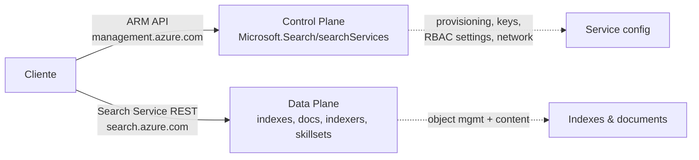
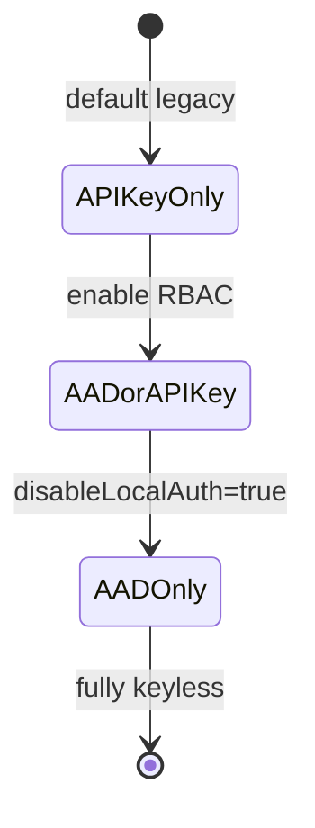
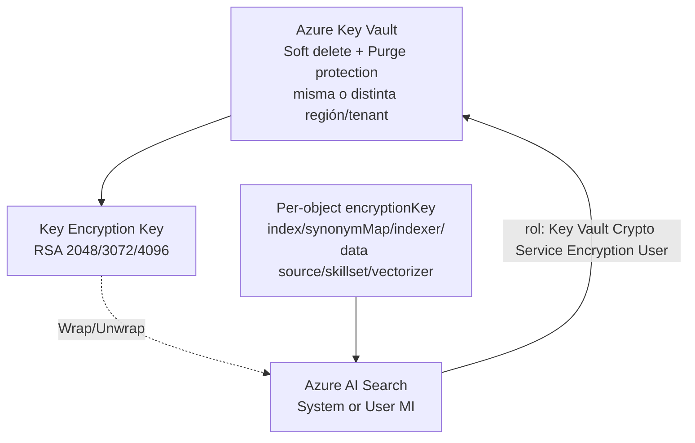
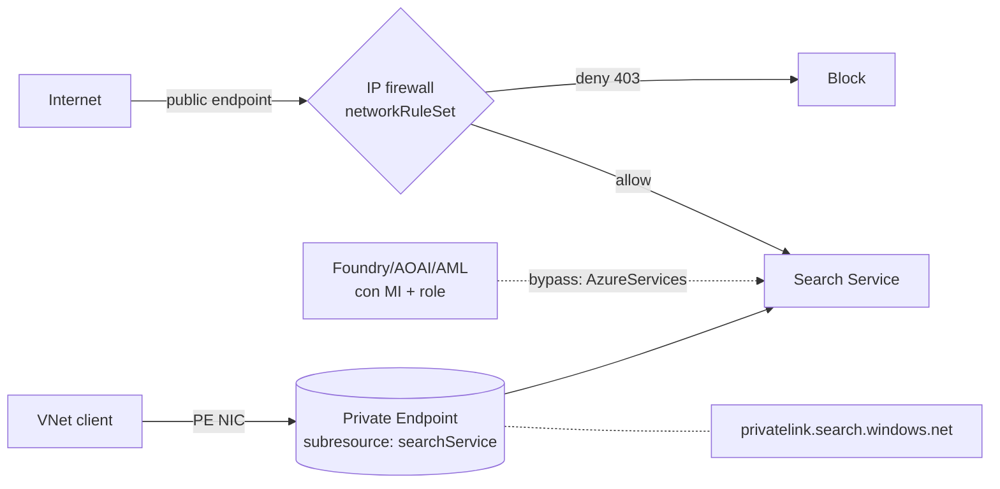
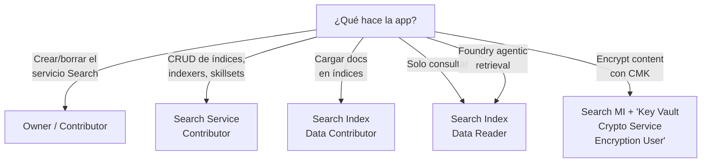

# Seguridad de Azure AI Search — RBAC, CMK, Networking y Security Trimming

> [!abstract] TL;DR
> Azure AI Search expone **dos planos** (control y data) y se asegura en **cuatro capas**: autenticación (api-key vs Entra ID con `disableLocalAuth`), autorización RBAC (3 roles built-in dedicados + 3 generales), red (IP firewall + Private Endpoint sub-resource `searchService` + DNS `privatelink.search.windows.net`) y cifrado en reposo (CMK **per-object** vía `encryptionKey` con Key Vault que requiere **soft-delete + purge protection**). Para *document-level security* se usa el patrón **`search.in()`** sobre un `Collection(Edm.String) filterable retrievable:false`. El examen mezcla la confusión control vs data (Search Service Contributor ≠ Search Index Data Contributor) y la propagación de roles (1-5 min, hasta horas con MI).

## 🎯 Relevancia en el examen

| Tipo de pregunta | Frecuencia | Escenarios típicos |
|---|---|---|
| Elegir el **rol RBAC** mínimo | 🔥🔥🔥 | "App solo necesita queries → ¿qué role?" |
| Distinguir **control vs data plane** | 🔥🔥🔥 | Search Service Contributor crea índices pero **no** puede cargar docs |
| Configurar **keyless** | 🔥🔥 | `disableLocalAuth: true` + `DefaultAzureCredential` + scope `search.azure.com/.default` |
| Encryption **CMK** | 🔥🔥 | Per-object (no service-level salvo preview), rol KV correcto, soft-delete/purge |
| **Security trimming** | 🔥🔥 | Sintaxis `search.in()` con grupos de Entra |
| Networking | 🔥 | sub-resource `searchService`, DNS `privatelink.search.windows.net`, trusted services |

## 📖 Concepto en profundidad

### 1. Los dos planos



- **Control plane** (`Microsoft.Search/*`): crear/borrar el servicio, gestionar API keys, configurar red, autenticación. Llamadas a **ARM** (`management.azure.com`).
- **Data plane** (`Microsoft.Search/searchServices/*`): crear índices, cargar documentos, consultar, gestionar indexers/skillsets. Llamadas al **endpoint** `<svc>.search.windows.net`. Audience del token: **`https://search.azure.com/.default`**.

> [!warning] Confusión clásica del examen
> Algunas operaciones data-plane (crear índice/indexer/skillset) las puede hacer **Search Service Contributor** porque las clasifica Microsoft como *object management* (no como content). Pero **cargar docs** y **consultar** requieren los roles **Data**.

### 2. Modos de autenticación del servicio

Propiedad ARM: `properties.authOptions` + `properties.disableLocalAuth`.

| Modo | Config | Uso |
|---|---|---|
| **API-key only** (default legacy) | `disableLocalAuth: false`, `authOptions: { apiKeyOnly: {} }` | Solo admin/query keys. **Desaconsejado.** |
| **aadOrApiKey** (mixed) | `disableLocalAuth: false`, `authOptions: { aadOrApiKey: { aadAuthFailureMode: "http401WithBearerChallenge" } }` | Acepta ambos. Migración. |
| **Entra ID only (keyless)** | `disableLocalAuth: true` | **AI-103-aligned.** Solo tokens Entra. |



### 3. RBAC — roles built-in

#### Roles de **control plane** (siempre disponibles)

| Rol | GUID | Permite |
|---|---|---|
| **Owner** | `8e3af657-a8ff-443c-a75c-2fe8c4bcb635` | Todo control plane + asignar roles + ver API keys |
| **Contributor** | `b24988ac-6180-42a0-ab88-20f7382dd24c` | Todo control plane menos asignar roles |
| **Reader** | `acdd72a7-3385-48ef-bd42-f606fba81ae7` | Read-only control plane (no API keys) |

#### Roles **dedicados de Search** (requieren RBAC habilitado)

| Rol | GUID | Plano | Permisos | Cuándo |
|---|---|---|---|---|
| **Search Service Contributor** | `7ca78c08-252a-4471-8644-bb5ff32d4ba0` | Control + Data (object mgmt) | Crear/modificar índices, indexers, skillsets, knowledge bases. **No puede** cargar docs ni consultar. Puede leer admin keys. | DevOps, IaC |
| **Search Index Data Contributor** | `8ebe5a00-799e-43f5-93ac-243d3dce84a7` | Data | Upload docs, query, retrieve. **No** modifica definiciones. | Apps ETL |
| **Search Index Data Reader** | `1407120a-92aa-4202-b7e9-c0e197c71c8f` | Data | Query + retrieve. Read-only. | Apps consumer / Foundry |

> [!tip] Mnemónico para los GUIDs
> No los memorices todos. Memoriza solo que **Search Service Contributor empieza por `7ca7…`** y **Index Data Contributor empieza por `8ebe…`**, **Index Data Reader empieza por `1407…`**. Tres dígitos iniciales = pista de "qué rol pide el escenario".

#### Tabla de capacidades (verbatim docs)

| Permiso | Owner/Contributor | Reader | Search Svc Contrib | Idx Data Contrib | Idx Data Reader |
|---|:-:|:-:|:-:|:-:|:-:|
| Crear/configurar servicio | ✅ | ❌ | ✅ | ❌ | ❌ |
| Ver/copiar/regenerar API keys | ✅ | ❌ | ✅ | ❌ | ❌ |
| Crear índices/indexers/skillsets | ❌ | ❌ | ✅ | ❌ | ❌ |
| **Cargar docs** | ❌ | ❌ | ❌ | ✅ | ❌ |
| **Query** un índice | ❌ | ❌ | ❌ | ✅ | ✅ |
| Retrieve knowledge base | ❌ | ❌ | ❌ | ✅ | ✅ |

### 4. Scope de RBAC

- **Service-level** (default): rol aplica a **todos** los índices del servicio.
- **Index-level**: scope `…/searchServices/<svc>/indexes/<index-name>`. Soportado para `Search Index Data Contributor` y `Search Index Data Reader` (no portal — usar PowerShell/CLI).

> [!warning] Indexer escapa per-index
> Indexers usan **credenciales service-level**. Un *Search Service Contributor* puede crear un indexer que escribe en cualquier índice del servicio, **aunque** no tenga rol per-index sobre él. Para aislamiento estricto: **servicios separados** o **document-level security**.

### 5. Autenticación en código (Python — keyless)

#### 5.1 Query (data plane)

```python
from azure.identity import DefaultAzureCredential
from azure.search.documents import SearchClient

# Token audience implícito: https://search.azure.com/.default
client = SearchClient(
    endpoint="https://my-search.search.windows.net",
    index_name="my-index",
    credential=DefaultAzureCredential(),
)

results = client.search(search_text="azure ai")
```

#### 5.2 Gestión de índices (control + data object-mgmt)

```python
from azure.search.documents.indexes import SearchIndexClient
from azure.identity import DefaultAzureCredential

index_client = SearchIndexClient(
    endpoint="https://my-search.search.windows.net",
    credential=DefaultAzureCredential(),
)
# Requiere Search Service Contributor
```

#### 5.3 Obtener token a mano (REST)

```bash
az account get-access-token \
  --scope https://search.azure.com/.default \
  --query accessToken -o tsv
```

> [!danger] Scope incorrecto
> Si pides token con `https://management.azure.com/.default` y lo usas contra `search.windows.net`, recibes **401**. El scope data plane es **`search.azure.com/.default`**.

### 6. CMK — Customer-Managed Keys

#### 6.1 Modelo



#### 6.2 Prerrequisitos (verbatim docs)

- **Tier**: Basic o superior (no Free).
- **Key Vault** con **soft-delete** Y **purge protection** habilitados (purge protection no es default — hay que activarla).
- Search service con **managed identity** (system o user-assigned) **o** app registration con secret.
- Rol del MI en KV: **`Key Vault Crypto Service Encryption User`** (en Managed HSM → `Managed HSM Crypto Service Encryption User`).
- Operaciones de la key: **Wrap, Unwrap, Encrypt, Decrypt**.

#### 6.3 Per-object (GA): JSON `encryptionKey`

```json
{
  "name": "my-index",
  "fields": [ /* ... */ ],
  "encryptionKey": {
    "keyVaultUri": "https://my-kv.vault.azure.net",
    "keyVaultKeyName": "my-cmk",
    "keyVaultKeyVersion": "aaaaaaaa0b0b1c1c2d2d333333333333",
    "identity": {
      "@odata.type": "#Microsoft.Azure.Search.DataUserAssignedIdentity",
      "userAssignedIdentity": "/subscriptions/<sub>/resourceGroups/<rg>/providers/Microsoft.ManagedIdentity/userAssignedIdentities/<uami>"
    }
  }
}
```

> [!note] CMK es **per-object**, no service-level (GA)
> Hay que añadir `encryptionKey` al crear cada índice, indexer, data source, skillset, vectorizer, synonym map. **No se puede añadir retroactivamente** — hay que recrear el objeto. ⚠️ Existe **service-level CMK en preview** desde API `2026-03-01-preview` (`properties.encryptionWithCmk.serviceLevelEncryptionKey`) para aplicar key por defecto a nuevos objetos, pero **no encripta objetos existentes**.

#### 6.4 Python SDK

```python
from azure.search.documents.indexes import SearchIndexClient
from azure.search.documents.indexes.models import (
    SearchIndex, SimpleField, SearchableField,
    SearchFieldDataType, SearchResourceEncryptionKey,
)
from azure.identity import DefaultAzureCredential

endpoint = "https://my-search.search.windows.net"
client = SearchIndexClient(endpoint=endpoint, credential=DefaultAzureCredential())

encryption_key = SearchResourceEncryptionKey(
    key_name="my-cmk",
    key_version="aaaaaaaa0b0b1c1c2d2d333333333333",
    vault_uri="https://my-kv.vault.azure.net",
)

index = SearchIndex(
    name="cmk-index",
    fields=[
        SimpleField(name="id", type=SearchFieldDataType.String, key=True),
        SearchableField(name="content", type=SearchFieldDataType.String),
    ],
    encryption_key=encryption_key,
)
client.create_or_update_index(index)
```

#### 6.5 Bicep — enforcement de CMK a nivel servicio

```bicep
resource search 'Microsoft.Search/searchServices@2025-05-01' = {
  name: 'my-search'
  location: 'westeurope'
  identity: { type: 'SystemAssigned' }
  sku: { name: 'standard' }
  properties: {
    replicaCount: 1
    partitionCount: 1
    hostingMode: 'default'
    disableLocalAuth: true
    authOptions: null              // requerido cuando disableLocalAuth=true
    encryptionWithCmk: {
      enforcement: 'Enabled'       // bloquea objetos sin CMK
    }
    publicNetworkAccess: 'disabled'
  }
}
```

> [!warning] `enforcement: 'Enabled'` no encripta — **rechaza**
> Solo impide crear objetos *sin* `encryptionKey`. La encryption la hace el campo `encryptionKey` del objeto. Las APIs CLI/portal estándar **no exponen** `encryptionWithCmk` — hay que usar Management REST o Bicep/ARM.

#### 6.6 Cache de keys

- Las keys se cachean hasta **60 minutos** en el servicio. Tras revocar/borrar, las queries siguen funcionando hasta que expire la cache. Útil para pruebas.

### 7. Network security



#### 7.1 IP firewall

```json
"properties": {
  "publicNetworkAccess": "enabled",
  "networkRuleSet": {
    "ipRules": [
      { "value": "203.0.113.0/24" },
      { "value": "198.51.100.42" }
    ],
    "bypass": "AzureServices"
  }
}
```

| Valor `bypass` | Significado |
|---|---|
| `None` (default) | Solo IPs explícitas |
| `AzureServices` | Trusted services (Foundry/AOAI/AML con MI + rol) saltan el firewall |

> [!warning] Trusted services list
> Solo dos providers están en la trusted list de AI Search: **`Microsoft.CognitiveServices`** (Foundry + AOAI) y **`Microsoft.MachineLearningServices`** (Azure ML). Necesitan MI + role assignment en el search service.

#### 7.2 Private Endpoint

| Propiedad | Valor |
|---|---|
| **Sub-resource** | `searchService` |
| **Private DNS Zone** | `privatelink.search.windows.net` |
| **Resolución** | `<svc>.search.windows.net` → CNAME → `<svc>.privatelink.search.windows.net` → A → IP privada |
| **Tier mínimo** | Basic (no Free) |

Para deshabilitar todo el endpoint público (forzar tráfico solo por PE): `publicNetworkAccess: "disabled"`.

#### 7.3 Shared Private Link

Mecanismo **outbound** — permite que el servicio Search llegue a otros recursos (Blob, AOAI, etc.) detrás de su PE. Se configura en el lado del search service y aprueba en el lado del recurso destino.

### 8. Document-level security (security trimming)

Patrón cuando los usuarios pertenecen a grupos y los documentos solo deben verse según pertenencia.

#### 8.1 Schema del índice

```json
{
  "name": "securedfiles",
  "fields": [
    { "name": "file_id", "type": "Edm.String", "key": true },
    { "name": "file_name", "type": "Edm.String", "searchable": true },
    { "name": "file_description", "type": "Edm.String", "searchable": true },
    {
      "name": "group_ids",
      "type": "Collection(Edm.String)",
      "filterable": true,
      "retrievable": false
    }
  ]
}
```

> [!tip] `retrievable: false`
> Evita exfiltrar la ACL al cliente — el filtro funciona aunque el campo no se devuelva. Sin embargo, si `retrievable` se omite, el default es `true` y el campo se devuelve.

#### 8.2 Indexación con ACL

```json
{
  "value": [
    {
      "@search.action": "upload",
      "file_id": "1",
      "file_name": "secured_file_a",
      "group_ids": ["group_id1"]
    },
    {
      "@search.action": "mergeOrUpload",
      "file_id": "2",
      "group_ids": ["group_id1", "group_id2"]
    }
  ]
}
```

#### 8.3 Query con `search.in()`

Sintaxis verbatim docs (collection field → necesita lambda `any`):

```http
POST https://<svc>.search.windows.net/indexes/securedfiles/docs/search?api-version=2026-04-01

{
  "search": "*",
  "filter": "group_ids/any(g:search.in(g, 'group_id1, group_id2'))"
}
```

```python
# Python equivalente
user_groups = ["group_id1", "group_id2"]  # extraídas del JWT (claim "groups")
filter_expr = f"group_ids/any(g:search.in(g, '{','.join(user_groups)}'))"

results = client.search(search_text="*", filter=filter_expr)
```

#### 8.4 `search.in()` firma exacta

```
search.in(variable, 'comma_separated_values', 'optional_separator')
```

- Mucho más rápido que cadenas `or` (`Id eq 'a' or Id eq 'b' ...`).
- Sub-segundo incluso con miles de valores.
- Si los valores contienen comas, usa el tercer parámetro como separador alternativo: `search.in(g, 'a|b|c', '|')`.

### 9. Alternativas a security trimming

| Estrategia | Granularidad | Coste | Cuándo |
|---|---|---|---|
| **Field-level** (`retrievable: false`) | Por campo | 0 | Ocultar campos sensibles del response |
| **Document-level** (`search.in`) | Por documento | bajo | Multi-tenant suave |
| **Index-level** RBAC | Por índice | medio | Aislamiento entre teams |
| **Service-level** | Por servicio | alto | Aislamiento extremo (1 search service/tenant) |
| **Built-in ACL** (preview Foundry) | Permission filters | medio | Heredar ACLs desde la fuente |

### 10. Audit y monitoring

Diagnostic Settings → Log Analytics workspace.

| Categoría | Contenido |
|---|---|
| `OperationLogs` | Operaciones de admin/control plane (creación de índices, role assignments observados desde el servicio) |
| `RequestLogs` | Queries data plane |
| Métricas | QPS, latency, throttled requests, search-units |

Cross-ref `[[plan-diagnostic-logs-azure-monitor]]`.

### 11. Propagación RBAC

- Role assignment en search service típicamente operativo en **1-5 minutos**.
- Si el principal es **managed identity**, puede tardar **varias horas** según docs Microsoft (`limitation-of-using-managed-identities-for-authorization`).
- Test rápido:

```bash
az role assignment list \
  --assignee <principalId> \
  --scope /subscriptions/<sub>/resourceGroups/<rg>/providers/Microsoft.Search/searchServices/<svc>
```

## 🏗️ Recetas completas

### Receta A — Search service keyless + RBAC para AOAI (vectorizer)

```bicep
param searchName string
param openAiName string
param keyVaultName string
param tenantId string = subscription().tenantId

// 1. Search service (keyless, RBAC, PE-ready)
resource search 'Microsoft.Search/searchServices@2025-05-01' = {
  name: searchName
  location: resourceGroup().location
  identity: { type: 'SystemAssigned' }
  sku: { name: 'standard' }
  properties: {
    replicaCount: 1
    partitionCount: 1
    hostingMode: 'default'
    disableLocalAuth: true
    publicNetworkAccess: 'enabled'
    networkRuleSet: {
      ipRules: []
      bypass: 'AzureServices'
    }
    semanticSearch: 'free'
  }
}

// 2. Search MI → AOAI como Cognitive Services OpenAI User
resource openai 'Microsoft.CognitiveServices/accounts@2024-10-01' existing = {
  name: openAiName
}

resource aoaiUserRole 'Microsoft.Authorization/roleAssignments@2022-04-01' = {
  scope: openai
  name: guid(search.id, openai.id, 'aoai-user')
  properties: {
    // Cognitive Services OpenAI User
    roleDefinitionId: subscriptionResourceId(
      'Microsoft.Authorization/roleDefinitions',
      '5e0bd9bd-7b93-4f28-af87-19fc36ad61bd'
    )
    principalId: search.identity.principalId
    principalType: 'ServicePrincipal'
  }
}

// 3. Developer → Search Index Data Contributor (data plane)
param developerObjectId string
resource devDataContrib 'Microsoft.Authorization/roleAssignments@2022-04-01' = {
  scope: search
  name: guid(search.id, developerObjectId, 'idx-data-contrib')
  properties: {
    roleDefinitionId: subscriptionResourceId(
      'Microsoft.Authorization/roleDefinitions',
      '8ebe5a00-799e-43f5-93ac-243d3dce84a7'
    )
    principalId: developerObjectId
    principalType: 'User'
  }
}
```

### Receta B — CLI: search keyless + KV CMK

```bash
# 1. Crear search con keyless
az search service create \
  -n my-search -g my-rg \
  --sku standard \
  --identity-type SystemAssigned \
  --disable-local-auth true \
  --auth-options null

# 2. Key Vault con soft-delete + purge protection
az keyvault create \
  -n my-kv -g my-rg -l westeurope \
  --enable-soft-delete true \
  --enable-purge-protection true \
  --enable-rbac-authorization true

# 3. Asignar rol "Key Vault Crypto Service Encryption User" al MI del search
SEARCH_MI=$(az search service show -n my-search -g my-rg --query identity.principalId -o tsv)
KV_ID=$(az keyvault show -n my-kv -g my-rg --query id -o tsv)

az role assignment create \
  --assignee-object-id "$SEARCH_MI" \
  --assignee-principal-type ServicePrincipal \
  --role "Key Vault Crypto Service Encryption User" \
  --scope "$KV_ID"

# 4. Crear la key
az keyvault key create --vault-name my-kv -n my-cmk \
  --kty RSA --size 3072 \
  --ops wrap unwrap encrypt decrypt
```

## 📊 Cuándo usar qué rol



## 🪤 Trampas del examen

1. **Control vs data plane**: *Search Service Contributor* puede crear índices y indexers (object management cuenta como data) **pero no puede** cargar docs ni queryear. Para esos: *Search Index Data Contributor* y *Reader*.
2. **Token audience**: el scope para data plane es **`https://search.azure.com/.default`**, NO `management.azure.com/.default` (ese es control plane / ARM).
3. **Tres roles, no dos**: hay **Search Service Contributor + Index Data Contributor + Index Data Reader**. Para "full dev access" Microsoft recomienda los tres.
4. **CMK es per-object** (GA). No puedes "encriptar" un índice existente — hay que recrearlo. Service-level CMK existe en preview (API `2026-03-01-preview`) pero solo afecta a objetos **nuevos**.
5. **Key Vault role**: el rol exacto para el MI del search es **`Key Vault Crypto Service Encryption User`** (no "Crypto Officer", no "Reader"). En HSM: `Managed HSM Crypto Service Encryption User`.
6. **Soft delete + Purge protection ambos obligatorios** en KV para CMK en AI Search. Soft delete es default; **purge protection NO es default** y hay que activarla.
7. **Key cache 60 minutos**: tras rotar/revocar, los datos siguen accesibles hasta 1 h. No es bug; es by-design.
8. **`enforcement: 'Enabled'`** en `encryptionWithCmk` **no cifra nada** — solo rechaza crear objetos sin `encryptionKey`. La encryption real la hace cada objeto.
9. **PE sub-resource: `searchService`** (camelCase, no "search" ni "searchServices").
10. **Private DNS zone**: `privatelink.search.windows.net` (sin "windows.net" como dominio padre — el DNS *privatelink* tiene .net al final).
11. **Bypass trusted services**: solo `Microsoft.CognitiveServices` (Foundry/AOAI) y `Microsoft.MachineLearningServices` (AML). NO incluye Storage, Functions, etc.
12. **Indexers ignoran per-index RBAC**: corren con credenciales del servicio. Para aislamiento estricto entre índices, usa **search services separados** o **document-level security**.
13. **`search.in()` sobre Collection** requiere lambda `any`: `group_ids/any(g: search.in(g, '...'))`. Sin el `any` falla en colecciones.
14. **`retrievable: false`** en el campo de seguridad — si no, devuelves las ACLs al cliente.
15. **Propagación con MI**: hasta **varias horas** (no minutos) según docs Microsoft. Critical para CMK setup recién hecho.
16. **`disableLocalAuth: true` requiere `authOptions: null`** (o ausente). Setear ambos a la vez da error de validación.
17. **Free tier no soporta**: ni IP firewall, ni Private Endpoint, ni CMK. Mínimo **Basic**.
18. **El rol Index Data Contributor puede usar elevated permissions** para investigar resultados incorrectos en document-level access (`?elevated=true`), bypaseando los permission filters. Reader **no**.

## 🧠 Mnemotecnia

- **"SIR — Service contributor, Index data contributor, index data Reader"**: los 3 roles dedicados en orden de "más control → menos".
- **"Crypt-O User no Officer"**: el MI del search es **User** en KV, el humano que crea la key es **Officer**.
- **"Wrap/Unwrap/Encrypt/Decrypt — WUED"**: las 4 operaciones requeridas en la key.
- **"in() Any-time"**: `search.in()` sobre `Collection(...)` siempre va con `/any(g: …)`.
- **"Search talks to .azure.com, ARM to management.azure.com"** — distingue scope.
- **"60-minute key cache"**: tras revocar, una hora de gracia.
- **"PE = `searchService` (camel)"** — el sub-resource es camelCase.
- **"Two trusted: CogSvc + ML"** — solo dos providers en bypass `AzureServices`.

## 🔗 Conceptos relacionados

- [[search-azure-ai-search-overview]] — fundamentos del servicio
- [[search-index-design]] — donde se aplica `encryptionKey`
- [[search-data-sources-indexers]] — indexers + outbound MI roles
- [[search-integrated-vectorization]] — vectorizer auth a AOAI
- [[search-as-agent-tool]] — Foundry agents consumen vía `Search Index Data Reader`
- [[plan-security-keyless-credentials]] — patrón general keyless
- [[plan-security-managed-identity]] — system vs user-assigned
- [[plan-security-rbac-role-policies]] — RBAC genérico
- [[plan-security-customer-managed-keys]] — CMK cross-service
- [[plan-security-private-networking]] — PE + DNS zones
- [[plan-diagnostic-logs-azure-monitor]] — `OperationLogs` + `RequestLogs`

## ❓ Autotest

**1.** Una aplicación necesita ejecutar queries contra un índice pero no debe poder cargar documentos ni modificar el esquema. ¿Qué rol RBAC asignas con menor privilegio?

- a) Search Service Contributor
- b) Search Index Data Contributor
- c) Search Index Data Reader
- d) Reader

<details><summary>Respuesta</summary>

**c) Search Index Data Reader** (GUID `1407120a-…`). Permite query + retrieve, read-only. (a) puede crear índices pero **no** queryear. (b) puede queryear pero también cargar (excesivo). (d) es control plane, no permite data ops.

</details>

**2.** Configuras `disableLocalAuth: true` y un cliente Python obtiene un token con `az account get-access-token --scope https://management.azure.com/.default`. La query falla con 401. ¿Causa raíz?

- a) Falta asignar Search Service Contributor.
- b) El audience del token es para ARM (control plane), no para data plane.
- c) El servicio Search no soporta keyless.
- d) Falta abrir el IP firewall.

<details><summary>Respuesta</summary>

**b)**. El data plane requiere audience **`https://search.azure.com/.default`**. `management.azure.com` es para ARM (`Microsoft.Search/searchServices` operaciones de control plane).

</details>

**3.** Quieres habilitar CMK en un índice ya creado con 10 M de documentos. ¿Qué pasos son correctos?

- a) Hacer PATCH al índice añadiendo `encryptionKey`.
- b) Habilitar `encryptionWithCmk.enforcement: Enabled` a nivel servicio.
- c) Recrear el índice con `encryptionKey` y reindexar los documentos.
- d) Asignar `Key Vault Reader` al MI del search.

<details><summary>Respuesta</summary>

**c)**. CMK **no se puede añadir retroactivamente** a un objeto existente — hay que recrearlo. (a) falla. (b) solo bloquea futuros objetos sin CMK. (d) el rol correcto es **Key Vault Crypto Service Encryption User**, no Reader.

</details>

**4.** Tienes 3 grupos de usuarios (`hr`, `eng`, `legal`) y un campo `group_ids: Collection(Edm.String)`. El usuario actual pertenece a `hr` y `legal`. ¿Cuál es el filter correcto?

- a) `group_ids eq 'hr' or group_ids eq 'legal'`
- b) `search.in(group_ids, 'hr,legal')`
- c) `group_ids/any(g: search.in(g, 'hr, legal'))`
- d) `group_ids contains 'hr, legal'`

<details><summary>Respuesta</summary>

**c)**. Sobre `Collection(...)` se requiere lambda `any` (o `all`). `search.in()` recibe variable + lista separada por comas. (a) sintaxis incorrecta para collections. (b) sin lambda. (d) `contains` no es operador OData en AI Search.

</details>

**5.** Un Microsoft Foundry agent necesita acceder a un Azure AI Search con `publicNetworkAccess: enabled` pero `networkRuleSet` solo permite tu IP. ¿Qué cambio mínimo permite a Foundry conectarse sin abrir más IPs?

- a) Cambiar `bypass` a `AzureServices` y asignar al MI del Foundry el rol `Search Index Data Reader`.
- b) Asignar al MI del Foundry `Search Service Contributor`.
- c) Crear un Private Endpoint en la subred de Foundry.
- d) Desactivar `disableLocalAuth` y usar admin key.

<details><summary>Respuesta</summary>

**a)**. Foundry está en `Microsoft.CognitiveServices`, que es trusted service de AI Search. Con `bypass: AzureServices` + MI + role (mínimo `Search Index Data Reader` para retrieve), la conexión salta el firewall sin abrir IPs. (b) excesivo. (c) válido pero no mínimo. (d) anti-pattern y deja problema sin resolver.

</details>

**6.** Has rotado la key en Key Vault. Pasados 10 minutos, las queries siguen funcionando con la key vieja eliminada. ¿Por qué?

- a) Bug — abrir ticket.
- b) Search cachea la key hasta 60 minutos.
- c) La key vieja se restaura automáticamente por soft-delete.
- d) Faltó habilitar `enforcement: Enabled`.

<details><summary>Respuesta</summary>

**b)**. Las keys se cachean hasta **60 minutos**. Tras ese tiempo, las queries fallarán hasta que el objeto se actualice con la nueva key version.

</details>

## ✅ Control de calidad (auto-rúbrica)

| Dimensión | Nota | Justificación |
|---|:-:|---|
| Completitud | 9.5 | Cubre auth modes, los 6 roles, GUIDs, control vs data, scope, queries, indexers, vectorizer, CMK GA + preview, KV setup, network (firewall + PE + trusted + shared PL), security trimming pattern completo + alternativas, audit, propagation, recetas Bicep + CLI + Python |
| Exactitud técnica | 9.5 | GUIDs verbatim docs, rol KV verbatim, sub-resource `searchService` y DNS `privatelink.search.windows.net` confirmados, `search.in()` con lambda `any` confirmado, audience `search.azure.com/.default` verbatim, prerrequisitos CMK (soft-delete + purge protection + tier Basic+) verbatim. Service-level CMK marcado como preview con API version exacta |
| Alineación al examen | 9.5 | 18 trampas reales (no genéricas), foco en confusiones clásicas control/data, scope tokens, recreación obligatoria CMK, bypass trusted services list (solo 2), 6 preguntas autotest con distractores plausibles |
| Claridad pedagógica | 9 | Mermaid (4 diagramas), tablas comparativas, mnemónicos (SIR, WUED, Crypt-O User), callouts diferenciados, código Python/Bicep/CLI/JSON con comentarios, árbol de decisión de roles |

*Verificado a fecha 2026-05-23 contra Microsoft Learn (search-security-rbac, search-security-manage-encryption-keys, search-security-trimming-for-azure-search, service-configure-firewall, service-create-private-endpoint).*
