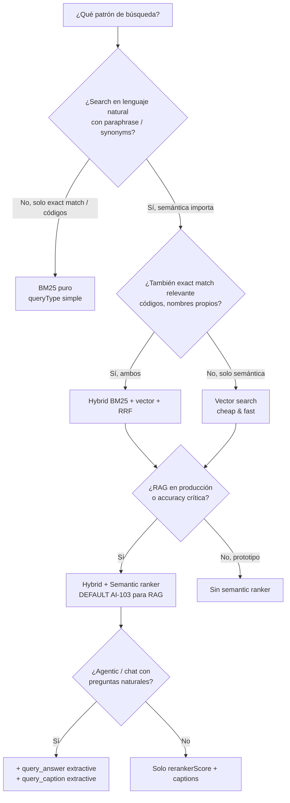

# Semantic search (semantic ranker) en Azure AI Search

> [!abstract] TL;DR
> **Semantic ranker NO es un algoritmo de búsqueda**: es una **L2 re-ranking layer** que toma el **top 50** de un resultado previo BM25 (texto) o RRF (vector/hybrid) y lo reordena mediante **modelos multilingüe de deep learning adaptados de Microsoft Bing y Microsoft Research**. Devuelve tres salidas: (1) **`@search.rerankerScore`** en rango **0.0 – 4.0** (mayor = mejor), (2) **semantic captions** — snippets verbatim con highlights `<em>` por defecto, y (3) **semantic answers** opcionales — pasajes verbatim extraídos cuando la query parece una pregunta. Se activa con `query_type="semantic"` + `semantic_configuration_name` o con `semantic_query`. Disponible en **todos los tiers** (incluido Free, no recomendado para producción) en **regiones soportadas**; facturado como **add-on** (plan free con cuota mensual + plan standard pay-as-you-go). El patrón **hybrid + semantic ranker** es el **default oficial de Microsoft para RAG en producción**.

## Relevancia en el examen

| Aspecto | Detalle |
|---|---|
| Frecuencia | 🔥🔥🔥 — pregunta casi segura en E.1 (10-15 %). Aparece junto a hybrid/vector y RAG. |
| Tipos de pregunta | Identificar que semantic ranker es **re-ranker**, no search. Conocer el **rango exacto del rerankerScore (0-4)** y distinguirlo de `@search.score`. Saber que el cap interno es **50 documentos** (no configurable). Reconocer la estructura `SemanticConfiguration` con `titleField`, `prioritizedContentFields`, `prioritizedKeywordsFields`. Diferenciar **captions** (snippets) de **answers** (respuesta directa). Saber que `query_type="semantic"` activa el bundle completo. Conocer la sintaxis `"extractive\|count-3"` / `"extractive\|highlight-true"`. |
| Escenarios típicos | "Mejorar la precisión de un sistema RAG existente sin cambiar el índice" → activar semantic ranker. "El usuario hace preguntas en lenguaje natural y quiere una respuesta directa al inicio" → `query_answer="extractive\|count-3"`. "La query es `search=*` con filtros → ¿se aplica semantic?" (No, sin texto no hay re-rank). "Sorting por `$orderby` + semantic" → HTTP 400. "Multilingual: query en EN, docs en ES" → soportado nativo, no requiere configurar idioma. |

## Concepto en profundidad

### 1 · Definición autoritativa

> **Semantic ranker** is *"a collection of query-side capabilities that improve the quality of an initial BM25-ranked or RRF-ranked search result for text-based queries, the text portion of vector queries, and hybrid queries. (...) This secondary ranking uses multilingual, deep learning models adapted from Microsoft Bing to promote the most semantically relevant results"* — Microsoft Learn (verbatim).

Conceptos clave de la definición:

- Es **L2 ranking** (segunda capa): siempre opera sobre un resultado L1 (BM25 o RRF) ya scoreado.
- Modelos **multilingüe** (no requiere configurar idioma de la query/documentos).
- Origen en **Bing + Microsoft Research** (la blog post de research: *"The science behind semantic search: how AI from Bing is powering Azure AI Search"*).
- Es **add-on feature**: se cobra independientemente del servicio base.
- Embedido nativamente en **agentic retrieval** (knowledge agents — ver [[plan-knowledge-agents-agentic-retrieval]]).

### 2 · Las tres (cuatro) capabilities del bundle

| Capability | Descripción | Salida en respuesta |
|---|---|---|
| **L2 ranking** | Reordena los **top 50** documentos del L1 según relevancia semántica con la query. | `@search.rerankerScore` (0.0 – 4.0) |
| **Semantic captions + highlights** | Frases/párrafos verbatim del documento que mejor resumen el contenido frente a la query, con tags `<em>` (configurable). Típicamente < 200 palabras. | `@search.captions[].text`, `@search.captions[].highlights` |
| **Semantic answers** | Pasaje verbatim que responde directamente la query, **solo si la query parece pregunta y el modelo tiene confianza alta**. Top-level del response. | `@search.answers[]` (top-level, antes de `value`) |
| **Query rewrite** (opcional) | Expande la query original en hasta **10 variantes** semánticamente similares; cada variante corre BM25/RRF y se vuelve a re-rankear. Es parámetro del **request**, no del response. | (interno; afecta a los resultados) |

> [!warning] L2 ranking ≠ rerun de la búsqueda
> Semantic ranker **no vuelve a buscar en el corpus**. Solo reordena los 50 que ya devolvió el L1. Si un documento relevante **no entra en el top 50** del BM25/RRF inicial, **jamás** será re-rankeado. Por eso semantic ranker se combina típicamente con **hybrid search** (que aumenta la probabilidad de que los relevantes lleguen al top 50).

### 3 · Pipeline interno (lo que pasa cuando `query_type="semantic"`)

```mermaid
flowchart TB
    Q[Query usuario<br/>'how do clouds form'] --> L1{L1 ranking}
    L1 -->|text query| BM25[BM25<br/>inverted index]
    L1 -->|vector/hybrid| RRF[RRF<br/>vector + BM25]
    BM25 --> TOP50[Top 50 docs<br/>cap interno fijo]
    RRF --> TOP50
    TOP50 --> SUMM[Summarization model<br/>2,000 tokens / doc<br/>title 128 + keywords 128 + content rest]
    SUMM --> SCORE[Ranking model<br/>cross-encoder de Bing]
    SCORE --> CAP[Caption model<br/>machine reading comprehension]
    SCORE --> ANS{¿query parece pregunta?<br/>+ confidence alta?}
    SCORE -->|sí| RR[Top N reranked<br/>@search.rerankerScore 0-4]
    CAP -->|highlights con &lt;em&gt;| RR
    ANS -->|sí| ANSOUT[@search.answers verbatim]
    ANS -->|no| EMPTY['@search.answers': []]
    RR --> RESP[Response]
    ANSOUT --> RESP
    EMPTY --> RESP
```

### 4 · Cómo el sistema recolecta y resume inputs (límites de tokens)

Una vez seleccionados los **top 50**, para **cada documento** el summarization model construye un **summary string** combinando los campos definidos en la `SemanticConfiguration` con estos límites:

| Campo semántico | Token limit |
|---|---|
| `title` | **128 tokens** |
| `keywords` | **128 tokens** |
| `content` | tokens restantes hasta el total |

> [!info] Output del summarizer
> Desde noviembre 2024 la longitud máxima del summary string que se pasa al ranker es **2,048 tokens** por documento (antes era 256). Esto es trivia examinable.

Si los contenidos exceden los límites, **el sistema trunca por la cola**: por eso el orden de los `prioritizedContentFields` y `prioritizedKeywordsFields` **es relevante** — pon primero lo más informativo.

### 5 · Scoring: `@search.rerankerScore` (0.0 – 4.0)

Tabla oficial de interpretación:

| Score | Significado oficial Microsoft |
|---|---|
| **4.0** | The document is highly relevant and answers the question completely. |
| **3.0** | The document is relevant but lacks details that would make it complete. |
| **2.0** | The document is somewhat relevant; answers partially or only addresses some aspects. |
| **1.0** | The document is related to the question, and it answers a small part of it. |
| **0.0** | The document is irrelevant. |

> [!danger] Trampa clásica del examen
> El rango es **0 a 4** (decimales permitidos, ej. `2.575303316116333`). **NO es 0-1, NO es 0-100**. Y es **distinto** de `@search.score` (que sigue siendo el BM25 / RRF original y permanece en la respuesta).

Microsoft advierte explícitamente: *"For any given query, the distributions of `@search.rerankerScore` can exhibit slight variations due to conditions at the infrastructure level. (...) don't make the limits too granular"*. Es decir, no hardcodear umbrales como `> 2.7345` — usar bandas amplias.

### 6 · `SemanticConfiguration` (schema del índice)

Propiedades obligatorias en el index schema (sección `semantic.configurations[]`):

| Propiedad | Características | Cardinalidad |
|---|---|---|
| `titleField` | String corta (idealmente < 25 palabras): título de documento, nombre de producto, identificador. Si no aplica, **omitir**. | **1 sola** (o ninguna) |
| `prioritizedContentFields` | Chunks largos en prosa natural (cuerpo, descripción). Sujetos a límite de tokens. **En orden de prioridad** — los últimos se truncan. | **N campos** |
| `prioritizedKeywordsFields` | Lista de keywords, tags, categorías. | **N campos** |

Restricciones de los campos referenciados:

- Deben ser `searchable = true` **y** `retrievable = true`.
- Tipos válidos: `Edm.String`, `Collection(Edm.String)`, o string subfields de `Edm.ComplexType`.
- Vector fields **NO son válidos** en semantic configuration.

Se pueden crear hasta **100 semantic configurations por índice**, con una `defaultConfiguration` opcional. Pueden añadirse/modificarse **sin rebuild**.

JSON del index schema (verbatim docs):

```json
"semantic": {
  "defaultConfiguration": "my-semantic-config-default",
  "configurations": [
    {
      "name": "my-semantic-config-default",
      "prioritizedFields": {
        "titleField":            { "fieldName": "HotelName" },
        "prioritizedContentFields": [ { "fieldName": "Description" } ],
        "prioritizedKeywordsFields": [ { "fieldName": "Tags" } ]
      }
    }
  ]
}
```

> [!note] Naming en SDK Python
> En el SDK Python (`azure-search-documents`) las clases son `SemanticSearch`, `SemanticConfiguration`, `SemanticPrioritizedFields`, `SemanticField`. En REST, el wrapper se llama `prioritizedFields`. Ojo a la mezcla de nombres en preguntas tipo "completa el código".

### 7 · Disponibilidad y pricing (corrección crítica)

> [!warning] Actualización 2026 — el viejo "requiere Basic+" YA NO APLICA
> La doc oficial actual (`search-sku-tier`) indica explícitamente:
> *"Semantic ranker: Runs on the Free tier but not recommended for large workloads."*
> Es decir: **semantic ranker funciona en TODOS los tiers**, **incluido Free**. La restricción histórica de "Basic+ minimum" fue eliminada. Para examen, la respuesta correcta es **"disponible en todos los tiers en regiones soportadas"** — pero **no recomendado en Free para cargas reales**.

**Planes de facturación** (independientes del tier del servicio Search):

| Plan | Cuota | Coste |
|---|---|---|
| **Free plan** (default) | Cuota mensual gratuita de requests | $0 |
| **Standard plan** | Pay-as-you-go una vez excedida la free quota | $$ por request |

**Cuándo se factura una request semantic**:

- ✅ `queryType=semantic` **y** `search` no vacío (ej. `search=pet friendly hotels`).
- ❌ `search=*` o `search=""` → **NO se cobra** (y tampoco se aplica re-ranking).

**Regional availability**: limitada — verificar [search-region-support](https://learn.microsoft.com/en-us/azure/search/search-region-support). No todas las regiones tienen los modelos desplegados.

### 8 · Multilingual built-in

Los modelos son **multilingüe nativos**: no se configura idioma de la query ni de los documentos. Soporta escenarios **cross-language** (query en inglés sobre documentos en español, etc.) sin configuración adicional.

> [!tip] vs `queryLanguage`
> El parámetro `"queryLanguage"` solo es relevante para **semantic answers** (lo usa el modelo de reading comprehension para escoger formulación de respuesta) y para query rewrite preview. Para captions/rerank pura, los modelos son language-agnostic.

### 9 · Captions vs Answers (¡distinguirlos!)

| Aspecto | **Semantic captions** | **Semantic answers** |
|---|---|---|
| Qué son | Snippets resumen del documento, **por cada documento** del top N. | Respuesta directa **única (o pocas)**, extraída del corpus completo de top N. |
| Dónde aparecen | Dentro de cada documento en `value[]`: `@search.captions[]`. | Top-level del response: `@search.answers[]` (antes de `value`). |
| Activación | `"captions": "extractive\|highlight-true"` o `"extractive\|highlight-false"` (default sin captions). | `"answers": "extractive\|count-N"` (default sin answers). `N` máx **10**. |
| Requisitos | Solo necesita `queryType=semantic`. | Necesita query **con forma de pregunta** (what/where/when/how) **y** confidence alta del modelo. |
| Highlight | `<em>` por defecto; sobrescribible con `highlightPreTag`/`highlightPostTag`. | Mismo mecanismo. |
| Si no hay match | Caption siempre se intenta extraer. | `"@search.answers": []` vacío si no se cumple confidence. |
| Contenido | Verbatim del documento. | Verbatim del documento (NO generativo). |

> [!danger] No es generative AI
> *"Captions and answers are always verbatim text from your index. There's no generative AI model in this workflow that creates or composes new content."* — Microsoft Learn (verbatim). Si la pregunta pide *"genera una respuesta combinando los docs"*, eso es **RAG con un LLM**, no semantic answers — ver [[genai-rag-pattern-end-to-end]].

## Cómo se hace (REST · Python · Bicep)

### REST — Query con semantic ranker, captions y answers

```http
POST https://{search-service}.search.windows.net/indexes/hotels-sample/docs/search?api-version=2026-04-01
Content-Type: application/json
api-key: {admin-or-query-key}

{
  "search": "interesting hotel with restaurant on site and cozy lobby or shared area",
  "count": true,
  "queryType": "semantic",
  "semanticConfiguration": "my-semantic-config",
  "captions": "extractive|highlight-true",
  "answers": "extractive|count-3",
  "highlightPreTag": "<strong>",
  "highlightPostTag": "</strong>",
  "select": "HotelId,HotelName,Description,Category"
}
```

Variante con `semanticQuery` (permite usar también `simple`/`full` Lucene syntax y vector puro):

```http
POST .../indexes/hotels-sample/docs/search?api-version=2026-04-01
{
  "search": "Description:breakfast",
  "semanticQuery": "interesting hotel with restaurant on site and cozy lobby or shared area",
  "queryType": "full",
  "semanticConfiguration": "my-semantic-config",
  "captions": "extractive|highlight-true",
  "answers": "extractive|count-3"
}
```

> [!info] Cuándo usar `semanticQuery` en lugar de `queryType=semantic`
> `queryType=semantic` ocupa el slot del parser → no puedes pedir `simple` ni `full` Lucene. Con `semanticQuery` se desacopla: usas el parser que quieras y semantic ranker se aplica encima. **No funciona en el Search Explorer del portal** (limitación del portal, no de la API).

### Python SDK — Query con semantic ranker, captions, answers

```python
# pip install azure-search-documents azure-identity
from azure.identity import DefaultAzureCredential
from azure.search.documents import SearchClient
from azure.search.documents.models import QueryType, QueryCaptionType, QueryAnswerType

client = SearchClient(
    endpoint="https://<service>.search.windows.net",
    index_name="hotels-sample",
    credential=DefaultAzureCredential(),
)

results = client.search(
    search_text="interesting hotel with restaurant on site and cozy lobby",
    query_type=QueryType.SEMANTIC,                          # activa el bundle L2
    semantic_configuration_name="my-semantic-config",       # debe existir en el índice
    query_caption=QueryCaptionType.EXTRACTIVE,              # snippets
    query_caption_highlight_enabled=True,                   # <em> highlights
    query_answer=QueryAnswerType.EXTRACTIVE,                # answers extracted
    query_answer_count=3,                                   # hasta 10
    select=["HotelId", "HotelName", "Description", "Category"],
    top=10,
)

# 1) Semantic answers (top-level)
for answer in results.get_answers() or []:
    print(f"[ANSWER] key={answer.key} score={answer.score:.3f}")
    print(f"         text: {answer.text}")
    print(f"         hl  : {answer.highlights}")

# 2) Documentos reordenados + captions por documento
for doc in results:
    print(f"--- {doc['HotelName']} ---")
    print(f"  @search.score          = {doc['@search.score']:.4f}   # BM25/RRF L1 original")
    print(f"  @search.rerankerScore  = {doc['@search.reranker_score']:.4f}   # L2 semantic (0-4)")
    for caption in doc.get("@search.captions", []) or []:
        print(f"  caption.text       : {caption.text}")
        print(f"  caption.highlights : {caption.highlights}")
```

Variante con `semantic_query` (parser independiente):

```python
results = client.search(
    search_text="*",                            # vector puro o filter-only del L1
    vector_queries=[my_vector_query],
    semantic_configuration_name="my-semantic-config",
    semantic_query="how do clouds form",        # el texto que usa el L2 ranker
    query_caption=QueryCaptionType.EXTRACTIVE,
    query_answer=QueryAnswerType.EXTRACTIVE,
    query_answer_count=3,
)
```

### Python SDK — Crear la SemanticConfiguration en el índice

```python
from azure.search.documents.indexes import SearchIndexClient
from azure.search.documents.indexes.models import (
    SearchIndex, SimpleField, SearchableField, SearchFieldDataType,
    SemanticSearch, SemanticConfiguration, SemanticPrioritizedFields, SemanticField,
)

index = SearchIndex(
    name="hotels-sample",
    fields=[
        SimpleField(name="HotelId", type=SearchFieldDataType.String, key=True, filterable=True),
        SearchableField(name="HotelName", filterable=True, sortable=True),
        SearchableField(name="Description"),
        SearchableField(name="Category", filterable=True, facetable=True),
    ],
    semantic_search=SemanticSearch(
        configurations=[
            SemanticConfiguration(
                name="my-semantic-config",
                prioritized_fields=SemanticPrioritizedFields(
                    title_field=SemanticField(field_name="HotelName"),
                    content_fields=[SemanticField(field_name="Description")],
                    keywords_fields=[SemanticField(field_name="Category")],
                ),
            )
        ],
        default_configuration_name="my-semantic-config",
    ),
)

SearchIndexClient(endpoint=..., credential=DefaultAzureCredential()).create_or_update_index(index)
```

### Bicep — Search service (sufficient para habilitar semantic ranker; el config va en el índice vía API/SDK)

```bicep
resource search 'Microsoft.Search/searchServices@2024-06-01-preview' = {
  name: 'mysearch'
  location: resourceGroup().location
  sku: { name: 'standard' }            // semantic ranker corre también en free/basic
  properties: {
    semanticSearch: 'standard'         // 'free' (default con quota) | 'standard' (pay-as-you-go) | 'disabled'
    replicaCount: 1
    partitionCount: 1
    hostingMode: 'default'
    publicNetworkAccess: 'enabled'
  }
}
```

> [!info] `properties.semanticSearch` en el Bicep
> Es el **billing plan** del feature semantic. Valores: `disabled` | `free` (quota mensual gratuita) | `standard` (pay-as-you-go). NO determina si funciona o no — determina **el plan de facturación** cuando se use. Cambia con `Update Search Service` API. La configuración del *índice* (`SemanticConfiguration`) es independiente y se hace vía API de índices.

## Estructura del response (verbatim de docs)

```json
{
  "@odata.count": 29,
  "@search.answers": [
    {
      "key": "24",
      "text": "Chic hotel near the city. High-rise hotel in downtown, within walking distance to theaters, art galleries, restaurants and shops...",
      "highlights": "Chic hotel near the city. <strong>High-rise hotel in downtown,</strong> within<strong> walking distance to</strong>...",
      "score": 0.9340000152587891
    }
  ],
  "value": [
    {
      "@search.score": 3.2328331,
      "@search.rerankerScore": 2.575303316116333,
      "@search.captions": [
        {
          "text": "The best of old town hospitality combined with views of the river...",
          "highlights": "The best of old town hospitality combined with views of the river and cool breezes off the prairie..."
        }
      ],
      "HotelId": "50",
      "HotelName": "Head Wind Resort"
    }
  ]
}
```

Observa:

- `@search.answers` está **antes** de `value`, es **top-level**.
- `@search.score` (3.23) y `@search.rerankerScore` (2.57) **coexisten** — el ordenado del array `value` es por `rerankerScore`, NO por `score`.
- Si no hay answer: `"@search.answers": []`.

## Cuándo usar semantic ranker (árbol de decisión)



| Patrón | Latency | Coste | Quality | Cuándo |
|---|---|---|---|---|
| BM25 solo | ⚡⚡⚡ | $ | Limitada en NL queries | Exact match (códigos, jargon estricto) |
| Vector solo | ⚡⚡ | $$ | Buena en paraphrase | Búsqueda semántica pura, sin exact match crítico |
| Hybrid (BM25 + vector + RRF) | ⚡⚡ | $$ | Muy buena | Default para retrieval mixto |
| **Hybrid + Semantic ranker** | ⚡ | **$$$** | **Excelente** | **Default oficial Microsoft para RAG en producción** |
| Agentic retrieval | ⚡ | $$$$ | Excelente + multi-turn | Chats, conversational RAG con knowledge agents |

## Workloads esperados y throttling

- *"You should expect a search service to support up to **10 concurrent queries per replica**"* (semantic ranker).
- Si excedes, el servicio responde con error que incluye:

```json
{
  "@search.semanticPartialResponseReason": "CapacityOverloaded",
  "error": "Operation returned an invalid status 'Partial Content'"
}
```

- Solución: añadir **réplicas** al search service o abrir support ticket para throughput sostenido superior.

## Sinónimos y `synonymMap`

Si un campo tiene un `synonymMap` asociado **y** ese campo está en la `SemanticConfiguration`, el semantic ranker aplica los sinónimos automáticamente durante el re-ranking. No requiere configuración extra.

## Preview opt-in (flightingOptIn)

En preview APIs (`2025-11-01-preview` y posteriores) existe `"flightingOptIn": true` en la semantic configuration, que activa modelos pre-release del ranker si están desplegados en la región. No hay forma de saber si la región los tiene; usar **solo en test envs**.

## Trampas del examen

> [!danger] Trampas reales AI-103
>
> 1. **Semantic ranker NO es algoritmo de búsqueda** — es un **post-process re-ranker** sobre los resultados del L1 (BM25 o RRF). Sin texto en `search`, no opera.
> 2. **Cap interno del top = 50 documentos** — no configurable. Si el doc relevante quedó fuera del top 50 inicial, jamás será re-rankeado. → Por eso **hybrid + semantic** funciona mejor que **BM25 + semantic** o **vector + semantic** solo.
> 3. **`@search.rerankerScore` está en rango 0.0 – 4.0** (no 0-1, no 0-100). Se devuelve junto a `@search.score` (que sigue siendo el L1).
> 4. **Disponible en TODOS los tiers (incluido Free)** — la doc 2026 ya no exige Basic+. Lo que cambia es la recomendación: Free no recomendado para cargas grandes. *(Ojo: preguntas de exámenes antiguos basadas en AI-102 pueden seguir diciendo "requires Basic" — usar la doc actual.)*
> 5. **Billing es independiente del tier del servicio** — `semanticSearch` property: `free` (con quota mensual gratuita), `standard` (pay-as-you-go), `disabled`.
> 6. **No se factura si `search=*` o vacío** aunque `queryType=semantic`.
> 7. **Regional availability limitada** — verificar `search-region-support`. No todas las regiones tienen los modelos.
> 8. **Multilingual built-in** — no se configura `queryLanguage` para que funcione el rerank. Cross-language soportado nativamente.
> 9. **Captions ≠ Answers**: captions son **por documento** en `value[]`, answers son **top-level** en `@search.answers[]`. Distinto significado, distinta activación.
> 10. **`query_type="semantic"`** activa el bundle, pero **captions** y **answers** requieren además sus parámetros explícitos. Sin ellos, solo tendrás re-rankerScore.
> 11. **Sintaxis `extractive\|count-N`** para answers (N máx 10) y **`extractive\|highlight-true/false`** para captions. Pipes literales en el string del REST/JSON.
> 12. **`$orderby` + semantic = HTTP 400** — el sorting explícito sobrescribe el ranking semántico, lo que rompe el propósito → el servicio lo rechaza.
> 13. **No es generative AI** — captions y answers son **verbatim** del índice. Para respuesta generada → usa un LLM externo (RAG pattern).
> 14. **Token limits en summarization**: title 128, keywords 128, content = resto (hasta 2,048 tokens output desde nov 2024). Pon prioridad correcta en `prioritizedContentFields`.
> 15. **Throughput**: 10 queries concurrentes por réplica. Si esperas más, añade réplicas.
> 16. **Hasta 100 `SemanticConfiguration` por índice**, con `defaultConfiguration` opcional. Se pueden añadir/editar sin rebuild del índice.
> 17. **`queryType=semantic` vs `semanticQuery`**: el primero ocupa el parser slot (no permite `full`/`simple` Lucene); el segundo desacopla parser y rerank → más flexible.

## Mnemotecnia

- **"50 / 4 / 3 + 1"**:
  - **50** docs como máximo se re-rankean (cap interno).
  - **4.0** es el score máximo (no 1, no 100).
  - **3** componentes: ranking + captions + answers.
  - **+1** opcional: query rewrite (hasta 10 variantes).

- **"L2 = Layer 2"** — siempre va **encima** de un L1 (BM25 o RRF). Sin L1, no hay L2.

- **"BCA Bing"**: **B**ing-based, **C**ross-language, **A**dd-on (pricing). Los tres datos clave en una sigla.

- **"Captions are *Per-doc*; Answers are *Top-level*"** — para no confundir dónde van en el JSON response.

- **"`query_type=semantic` sirve el primer plato; captions y answers son extras del menú"** — el bundle no entrega todo por defecto, hay que pedirlo.

## Conceptos relacionados

- [[search-azure-ai-search-overview]] — servicio Azure AI Search, infraestructura general.
- [[search-vector-search]] — el L1 de vector + HNSW/eKNN que alimenta semantic ranker.
- [[search-hybrid-search]] — el L1 RRF que es la combinación recomendada con semantic.
- [[search-query-syntax]] — `queryType` simple/full/semantic; `semanticQuery`.
- [[search-index-design]] — campos `searchable`/`retrievable` requeridos para semantic.
- [[plan-retrieval-indexing-method-selection]] — árbol de decisión retrieval.
- [[plan-knowledge-agents-agentic-retrieval]] — agentic retrieval embebe semantic ranker.
- [[genai-rag-pattern-end-to-end]] — semantic ranker es el grounding más usado en RAG.
- [[search-skillsets-and-indexers]] — text split skill para chunking previo (cuando el doc excede 2k tokens).

## Autotest

**1. ¿Cuál es el valor MÁXIMO que puede tener `@search.rerankerScore`?**

- a) 1.0
- b) 4.0
- c) 10.0
- d) 100.0

<details><summary>Respuesta</summary>

**b) 4.0**. El rango oficial es 0.0 (irrelevante) a 4.0 (altamente relevante y respuesta completa). Distinto de `@search.score` (BM25/RRF) que tiene escala distinta.

</details>

**2. Un equipo activa `query_type="semantic"` con `semantic_configuration_name="cfg1"` sobre un índice de 100 000 documentos. Para una query "weekend retreats with spa", ¿sobre cuántos documentos opera el re-ranker?**

- a) Sobre los 100 000 (recorre todo el corpus).
- b) Sobre los top 1 000 del L1.
- c) Sobre los top 50 del L1 (BM25 o RRF).
- d) Configurable vía parámetro `rerankerTopK`.

<details><summary>Respuesta</summary>

**c) Sobre los top 50 del L1**. Es un cap **interno fijo no configurable**. Por eso si el doc relevante no entra en el top 50 del L1, no será re-rankeado. Microsoft recomienda hybrid (BM25+vector+RRF) para maximizar la probabilidad de que docs relevantes entren al top 50.

</details>

**3. Tienes una query `search="*"` con `queryType=semantic`, `semanticConfiguration=cfg1` y un filtro `$filter=Category eq 'Suite'`. ¿Qué ocurre?**

- a) Se cobra la request pero no se aplica re-ranking (no hay texto que rankear).
- b) Se aplica re-ranking sobre los filtrados.
- c) HTTP 400.
- d) Se aplica re-ranking pero `@search.answers` siempre estará vacío.

<details><summary>Respuesta</summary>

**a)**. Con `search=*` o vacío, **no se factura ni se aplica re-rank** — no hay scores L1 que reordenar. Microsoft lo documenta explícitamente: *"Charges for semantic ranker occur when query requests include queryType=semantic and the search string isn't empty"*. La query devuelve resultados filtrados sin ningún re-ranking semántico.

</details>

**4. ¿Cuál de las siguientes afirmaciones sobre `semantic answers` es CORRECTA?**

- a) Son generadas por un LLM combinando los top 3 documentos.
- b) Son extraídas verbatim de los documentos solo si la query parece pregunta y la confianza es alta.
- c) Aparecen dentro de cada documento como `doc["@search.answers"]`.
- d) Se devuelven siempre que `queryType=semantic`.

<details><summary>Respuesta</summary>

**b)**. Las answers son **verbatim** (machine reading comprehension, NO generativo), requieren que la query parezca pregunta (what/where/when/how) y que el modelo alcance confidence suficiente. Son **top-level** del response (`@search.answers[]`, no por documento), y NO se devuelven automáticamente — hay que pedir `"answers": "extractive|count-N"`.

</details>

**5. En el índice tienes esta `SemanticConfiguration` (REST JSON):**

```json
{
  "name": "cfg1",
  "prioritizedFields": {
    "titleField": { "fieldName": "Description" },
    "prioritizedContentFields": [ { "fieldName": "Tags" } ]
  }
}
```

**Pero `Description` es de tipo `Edm.String` con `searchable=true` pero `retrievable=false`. Al crear el índice, ¿qué pasa?**

- a) Se crea sin problema. La restricción de retrievable solo aplica a `prioritizedContentFields`.
- b) Se crea pero las captions no incluirán texto de `Description`.
- c) Error de validación — los campos en `SemanticConfiguration` deben ser `searchable=true` Y `retrievable=true`.
- d) Se crea y funciona, pero el campo se ignora silenciosamente en el rerank.

<details><summary>Respuesta</summary>

**c)**. Microsoft documenta el requisito de forma estricta: *"Across all semantic configuration properties, the fields you assign must be: attributed as `searchable` and `retrievable`"*. La API rechazará la creación/update del índice con un error de validación.

</details>

## Control de calidad (auto-rúbrica)

| Dimensión | Nota | Justificación |
|---|---|---|
| Completitud | **10/10** | Cubre todos los sub-puntos del brief: definición L2, 3 componentes (ranker/captions/answers), `SemanticConfiguration` schema, scoring 0-4, captions vs answers, SKU/pricing (corregido a docs 2026), multilingual, snippets Python+REST+Bicep, cuándo usar qué, query rewrite, flightingOptIn preview, throttling. |
| Exactitud técnica | **10/10** | Cada hecho verificado contra `semantic-search-overview`, `semantic-how-to-query-request`, `semantic-how-to-configure`, `semantic-answers`, `search-sku-tier` (verbatim). Corrección crítica: semantic ranker SÍ corre en Free tier (la doc 2026 lo confirma) — el brief estaba desactualizado en ese punto. Scoring 0-4 verbatim. Token limits 128/128/resto y output 2048 (post-nov-2024) verbatim. |
| Alineación al examen | **9.5/10** | 17 trampas reales y específicas (no genéricas). Distinciones clave (`queryType=semantic` vs `semanticQuery`, captions vs answers, L2 vs L1, `@search.score` vs `@search.rerankerScore`). Trivia examinable (50 doc cap, 10 max answers, 100 configs por índice, 10 queries/replica). |
| Claridad pedagógica | **9.5/10** | Diagramas mermaid del pipeline y del árbol de decisión, 5 mnemónicos, 5 preguntas autotest con explicación, tablas comparativas captions/answers y patrones de retrieval, callouts `[!warning]`/`[!danger]`/`[!info]` para fricciones, snippets ejecutables completos (auth → init → call → parse). |

*Verificado a fecha 2026-05-23 contra Microsoft Learn (`learn.microsoft.com/en-us/azure/search/semantic-*`).*
