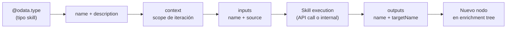
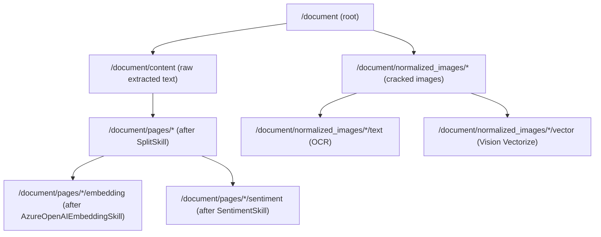
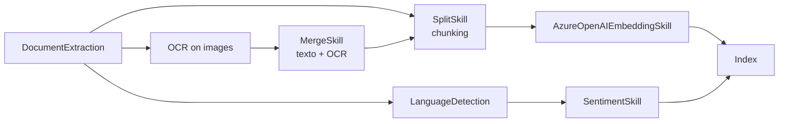
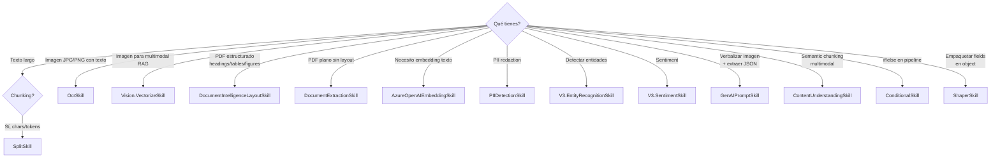

# Skillsets y Built-in Skills (Text, Image, Layout)

> [!abstract] TL;DR
> Un **skillset** es un objeto de Azure AI Search (referenciado por un indexer) que define un **pipeline de enriquecimiento AI** sobre cada documento ingerido. Encadena **skills** (operaciones atómicas: chunking, OCR, NER, sentiment, embedding, layout extraction…) cuyas outputs se inyectan como nodos en un **enrichment tree** in-memory (`/document/...`). Microsoft entrega **>20 built-in skills** organizadas en tres familias: **Foundry-bound** (consumen tu Foundry resource solo para facturación), **Azure-hosted** (Azure OpenAI / Content Understanding bound al recurso para procesado y billing) y **utility** (no facturables). El examen AI-103 pregunta sobre `@odata.type` exactos, propiedades `context`/`inputs`/`outputs`, ordering implícito por DAG, cache, y qué skill usar para qué escenario (RAG, OCR images, layout PDFs, PII redaction).

## Relevancia en el examen

- **Frecuencia:** 🔥🔥 (preguntas casi garantizadas en E.1 + composición con [[search-data-sources-indexers]] e [[search-integrated-vectorization]]).
- **Formato típico:**
  - "Drag-and-drop" de skills en orden correcto para construir pipeline RAG (`DocumentExtraction → Split → AzureOpenAIEmbedding`).
  - Multiple choice: `@odata.type` correcto para chunking / embedding / OCR.
  - Case study: "Tienes PDFs con texto + imágenes embebidas. ¿Qué skill usas para extraer estructura jerárquica (headings, tables)?" → **Document Layout skill** (no OCR).
  - Hot-area: identificar qué `context` produce la iteración correcta (`/document` vs `/document/pages/*` vs `/document/normalized_images/*`).
- Carryover parcial de AI-102 pero **expansion fuerte en AI-103** con: `AzureOpenAIEmbeddingSkill`, `Vision.VectorizeSkill` (multimodal embeddings), `GenAIPromptSkill`, `Azure Content Understanding skill`, y `Document Layout skill`.

## Concepto en profundidad

### 1. Anatomía del skillset

Un skillset es un **recurso top-level** del search service. Se attacha a un indexer (un mismo skillset puede usarse en N indexers). Su definición JSON contiene 5 secciones:

```json
{
  "name": "rag-skillset-template",
  "description": "Self-documenting description (no JSON comments)",
  "skills": [ /* array DE skills, max 30, típico 3-5 */ ],
  "cognitiveServices": {
    "@odata.type": "#Microsoft.Azure.Search.CognitiveServicesByKey",
    "description": "Foundry resource attached for billing of metered skills",
    "key": "<Foundry-resource-key>"
  },
  "knowledgeStore": { /* opcional: proyección a Azure Storage */ },
  "indexProjections": { /* opcional: one-to-many index */ },
  "encryptionKey": { /* opcional: CMK via Key Vault */ }
}
```

**Reglas críticas:**

- ≥1 skill, **máximo 30 skills** por skillset.
- Nombres únicos dentro del skillset collection.
- `cognitiveServices` solo necesario para **billable skills** (Foundry-bound). Si solo usas utility skills + `AzureOpenAIEmbeddingSkill`, **omítelo**.
- Update = **PUT full overwrite** (haz GET, modifica, PUT).

### 2. Skill anatomy (estructura común)



| Propiedad | Obligatoria | Función |
|---|---|---|
| `@odata.type` | ✅ | Identificador del tipo de skill (`#Microsoft.Skills.<Family>.<SkillName>`). |
| `name` | recomendada | Identifica la instancia (útil con varias del mismo tipo). |
| `description` | opcional | Documentación (JSON no permite comentarios). |
| `context` | opcional (default `/document`) | **Scope de iteración**: dónde se ejecuta el skill y dónde se cuelgan los outputs en el enrichment tree. |
| `inputs[]` | ✅ | Cada input tiene `name` (parámetro fijo del skill) y `source` (path JSON Pointer al nodo origen). |
| `outputs[]` | ✅ | Cada output tiene `name` (fijo del skill) y `targetName` (opcional, renombra el nodo en el tree). |

### 3. Enrichment tree y context

El skillset construye **in-memory** un árbol de enriquecimientos llamado **enrichment tree**. La raíz siempre es `/document`. Los outputs de skills se **añaden como nodos hijos** del nodo `context`.



**Reglas de `context`:**

| Context | Significado | Frecuencia de ejecución |
|---|---|---|
| `/document` | (default) Documento entero. | 1× por documento. |
| `/document/pages/*` | Cada página/chunk producida por SplitSkill. | 1× por chunk. |
| `/document/normalized_images/*` | Cada imagen embebida tras document cracking. | 1× por imagen. |
| `/document/orgs/*` | Cada entidad organización tras EntityRecognition. | 1× por org. |

> [!warning] El `*` en `context` es el **for-each operator**. Si lo omites donde toca, el skill ejecuta 1 vez con la colección completa como input (no por elemento).

**Inmutabilidad:** Los nodos del enrichment tree son **inmutables** una vez creados. Esto fuerza usar `targetName` para evitar colisiones cuando dos skills producen el mismo nombre de output.

### 4. Catálogo verbatim de built-in skills (verificado 2026-05-23)

#### 4.1 Foundry-bound (billing-only via Foundry resource)

| Skill | `@odata.type` | Familia | Propósito |
|---|---|---|---|
| OCR | `#Microsoft.Skills.Vision.OcrSkill` | Vision | Optical character recognition sobre imágenes. |
| Image Analysis | `#Microsoft.Skills.Vision.ImageAnalysisSkill` | Vision | Tags, captions, brands, objects. |
| Azure Vision multimodal embeddings | `#Microsoft.Skills.Vision.VectorizeSkill` | Vision | Vectoriza imagen **y** texto al **mismo espacio** (CLIP-like). |
| Key Phrase Extraction | `#Microsoft.Skills.Text.KeyPhraseExtractionSkill` | Text | Key phrases. |
| Language Detection | `#Microsoft.Skills.Text.LanguageDetectionSkill` | Text | LCID predominante. |
| Entity Recognition v3 | `#Microsoft.Skills.Text.V3.EntityRecognitionSkill` | Text | NER (Person, Org, Location, Quantity, DateTime, URL, Email, PersonType, Event, Product, Skill, Address, Phone Number, IP Address). |
| Entity Linking v3 | `#Microsoft.Skills.Text.V3.EntityLinkingSkill` | Text | Links a artículos Wikipedia. |
| PII Detection | `#Microsoft.Skills.Text.PIIDetectionSkill` | Text | Detecta y enmascara PII. |
| Sentiment v3 | `#Microsoft.Skills.Text.V3.SentimentSkill` | Text | Labels positive/neutral/negative + opinion mining. |
| Text Translation | `#Microsoft.Skills.Text.TranslationSkill` | Text | Traducción. |

> [!danger] Trampa de naming AI-103
> El `V3` va **delante** del nombre, **no como sufijo**: `#Microsoft.Skills.Text.V3.SentimentSkill` ✅ — `#Microsoft.Skills.Text.SentimentSkillV3` ❌ es **incorrecto**. Lo mismo para `V3.EntityRecognitionSkill` y `V3.EntityLinkingSkill`.

#### 4.2 Azure-hosted (billing + processing en TU recurso)

| Skill | `@odata.type` | Bound a |
|---|---|---|
| Azure OpenAI Embedding | `#Microsoft.Skills.Text.AzureOpenAIEmbeddingSkill` | Azure OpenAI / Foundry project deployment. |
| GenAI Prompt | `#Microsoft.Skills.Text.GenAIPromptSkill` | Chat completion model en Foundry (image verbalization, summarization, structured extraction). |
| Azure Content Understanding | `#Microsoft.Skills.Util.ContentUnderstandingSkill` | Recurso **Azure AI Content Understanding** (semantic chunking + multimodal analysis). |

#### 4.3 Utility (in-engine, no facturable salvo casos puntuales)

| Skill | `@odata.type` | Propósito |
|---|---|---|
| Text Split | `#Microsoft.Skills.Text.SplitSkill` | Chunking (pages/sentences, chars/tokens). |
| Text Merge | `#Microsoft.Skills.Text.MergeSkill` | Consolida múltiples campos en uno. |
| Shaper | `#Microsoft.Skills.Util.ShaperSkill` | Construye objeto complejo (multi-part). |
| Conditional | `#Microsoft.Skills.Util.ConditionalSkill` | `if/else` declarativo dentro del pipeline. |
| Document Extraction | `#Microsoft.Skills.Util.DocumentExtractionSkill` | Extrae texto + imágenes de blobs **dentro** del pipeline (no en cracking). Facturable solo image extraction. |
| Document Layout | `#Microsoft.Skills.Util.DocumentIntelligenceLayoutSkill` | Extrae **layout estructurado** (headings, tables, figures, sections) usando Document Intelligence. **Facturable** vía Foundry. |
| Custom Entity Lookup | `#Microsoft.Skills.Text.CustomEntityLookupSkill` | Matching contra lista user-defined de entidades. Facturable Azure AI Search. |

#### 4.4 Custom (código externo)

| Skill | `@odata.type` |
|---|---|
| Web API | `#Microsoft.Skills.Custom.WebApiSkill` |
| AML (Azure ML / Foundry-hosted model) | `#Microsoft.Skills.Custom.AmlSkill` |

> Ver [[search-skillsets-custom-skills]] para detalle de Web API y AML skills.

### 5. Skill ordering: el DAG implícito

> [!important] El array `skills[]` **NO dicta el orden de ejecución**.
> El search service **infiere un DAG** a partir de las referencias `inputs[].source` → `outputs[].targetName`. Skills independientes corren en paralelo; skills dependientes corren en orden topológico.



Coloca skills en cualquier orden — el motor resuelve dependencias. Pero **una buena práctica** es escribirlas en orden topológico para que el JSON sea legible humanamente.

### 6. Skillset cache (ahorra €€€)

Configurable a nivel **indexer** (no skillset). Reusa outputs de skills previas si la input no cambió.

```json
{
  "name": "rag-indexer",
  "dataSourceName": "blob-ds",
  "skillsetName": "rag-skillset",
  "targetIndexName": "rag-index",
  "cache": {
    "storageConnectionString": "DefaultEndpointsProtocol=https;AccountName=...",
    "enableReprocessing": true
  }
}
```

- **`storageConnectionString`**: cuenta de Azure Storage donde se cachean los outputs (en una container `cache` creada automáticamente).
- **`enableReprocessing`**: si `true`, ante cambios en skillset re-procesa solo lo necesario.
- **Ahorro real**: Si reset/re-run el indexer (p.ej. cambiaste un solo skill), **AzureOpenAIEmbeddingSkill no re-llamará** a OpenAI para chunks ya embeddeados → reduce coste drásticamente.

> [!tip] Caso típico
> Durante desarrollo, **siempre** activa cache. Una iteración de pipeline RAG con 10.000 documentos puede costar cientos de € en embeddings; con cache, ese coste se incurre **una sola vez**.

### 7. Skill-specific parameters (los que más caen)

#### 7.1 SplitSkill

| Parámetro | Valores | Default | Notas |
|---|---|---|---|
| `textSplitMode` | `pages` \| `sentences` | — | `pages` admite size config; `sentences` parte en `.`/`?`/`!`. |
| `maximumPageLength` | int (300–50000 chars) o tokens del modelo | 5000 chars | El algoritmo intenta no partir oraciones, así que el resultado real ≤ valor. |
| `pageOverlapLength` | int | 0 | Solapamiento entre chunks. Crítico para **RAG** (preserva contexto entre chunks). |
| `maximumPagesToTake` | int | 0 (= todas) | Trunca cuántas páginas se devuelven. |
| `unit` | `characters` \| `azureOpenAITokens` | `characters` | **`azureOpenAITokens` es preview** ⚠️ (REST preview API o portal). |
| `azureOpenAITokenizerParameters.encoderModelName` | `cl100k_base` \| `r50k_base` \| `p50k_base` \| `p50k_edit` | `cl100k_base` | Tiktoken encoders. **`o200k_base` (GPT-4o) NO soportado** ⚠️. |
| `defaultLanguageCode` | `en, de, es, fr, ja, ko, zh-Hans, …` | `en` | Útil para idiomas sin whitespace (CJK). |

Outputs: `textItems` (array de chunks), `offsets`, `lengths`, `ordinalPositions`.

#### 7.2 AzureOpenAIEmbeddingSkill

| Parámetro | Notas |
|---|---|
| `resourceUri` ✅ | Endpoint con dominio `openai.azure.com`, `services.ai.azure.com` o `cognitiveservices.azure.com`. **Requiere custom subdomain** del recurso. |
| `deploymentId` ✅ | Nombre del deployment (no del modelo). |
| `modelName` ✅ | Uno de: `text-embedding-ada-002` (1536 fijo), `text-embedding-3-small` (1–1536), `text-embedding-3-large` (1–3072). |
| `dimensions` | Opcional. Solo válido para `3-small`/`3-large` (MRL). Debe **coincidir** con `dimensions` del vector field en el index. |
| `apiKey` | Key-based auth (no recomendado prod). |
| `authIdentity` | User-assigned MI. Para system-assigned MI, **deja `apiKey` y `authIdentity` vacíos** — se usa automáticamente. **Requiere RBAC `Cognitive Services OpenAI User`** sobre el AOAI resource. |

> [!warning] Límite duro
> Texto > **8.000 tokens** → error. Combina con SplitSkill antes.

#### 7.3 OcrSkill

| Parámetro | Valores | Notas |
|---|---|---|
| `defaultLanguageCode` | `en`, `es`, `de`, `auto`, … | `auto` permite multi-lengua. |
| `detectOrientation` | bool | Corrige rotación. |
| `lineEnding` | `Space` \| `CarriageReturn` \| `LineFeed` \| `CarriageReturnLineFeed` | Cómo concatenar líneas. |

Outputs: `text` (string completo), `layoutText` (estructura con bounding boxes).

#### 7.4 V3.EntityRecognitionSkill

| Parámetro | Notas |
|---|---|
| `categories` | Array de categorías a extraer. Lista oficial: `Person, Location, Organization, Quantity, DateTime, URL, Email, PersonType, Event, Product, Skill, Address, Phone Number, IP Address`. |
| `defaultLanguageCode` | Idioma fallback. |
| `minimumPrecision` | 0.0–1.0; filtra entidades con confidence menor. |

#### 7.5 ShaperSkill — el "view builder"

No tiene parámetros propios. Toma `inputs[]` y emite un objeto compuesto en `outputs[0]`. Imprescindible para:

- **Knowledge store table projection** ([[search-knowledge-store-projections]]).
- **Index projections** (one-to-many: 1 doc → N docs hijos en index).
- Empaquetar (Sentiment + KeyPhrases + Page) en un objeto reutilizable.

#### 7.6 ConditionalSkill — `if/else` declarativo

```json
{
  "@odata.type": "#Microsoft.Skills.Util.ConditionalSkill",
  "context": "/document",
  "inputs": [
    {"name": "condition", "source": "= $(/document/language) == 'en'"},
    {"name": "whenTrue", "source": "/document/content"},
    {"name": "whenFalse", "source": "/document/translatedText"}
  ],
  "outputs": [{"name": "output", "targetName": "finalText"}]
}
```

Patrón típico: branching para escoger texto original vs traducido, o saltarse PII detection si `languageCode != 'en'`.

## Cómo se hace (Portal / REST / Python / Bicep)

### Patrón Python (azure-search-documents) — skillset RAG completo

```python
# pip install azure-search-documents==11.6.0b4 azure-identity
from azure.identity import DefaultAzureCredential
from azure.search.documents.indexes import SearchIndexerClient
from azure.search.documents.indexes.models import (
    SearchIndexerSkillset,
    SplitSkill,
    AzureOpenAIEmbeddingSkill,
    OcrSkill,
    MergeSkill,
    InputFieldMappingEntry,
    OutputFieldMappingEntry,
    SearchIndexerIndexProjection,
    SearchIndexerIndexProjectionSelector,
    SearchIndexerIndexProjectionsParameters,
    IndexProjectionMode,
)

endpoint = "https://<search-service>.search.windows.net"
credential = DefaultAzureCredential()  # MI / az login
client = SearchIndexerClient(endpoint=endpoint, credential=credential)

# Skill 1: OCR sobre imágenes embebidas (1× por imagen)
ocr = OcrSkill(
    name="ocr",
    description="OCR on embedded images",
    context="/document/normalized_images/*",
    inputs=[InputFieldMappingEntry(name="image", source="/document/normalized_images/*")],
    outputs=[OutputFieldMappingEntry(name="text", target_name="ocrText")],
    default_language_code="en",
    detect_orientation=True,
)

# Skill 2: Merge texto principal + OCR text de imágenes
merge = MergeSkill(
    name="merge",
    context="/document",
    inputs=[
        InputFieldMappingEntry(name="text", source="/document/content"),
        InputFieldMappingEntry(name="itemsToInsert", source="/document/normalized_images/*/ocrText"),
        InputFieldMappingEntry(name="offsets", source="/document/normalized_images/*/contentOffset"),
    ],
    outputs=[OutputFieldMappingEntry(name="mergedText", target_name="mergedContent")],
    insert_pre_tag=" ", insert_post_tag=" ",
)

# Skill 3: Chunking del texto merged
split = SplitSkill(
    name="split",
    context="/document",
    inputs=[InputFieldMappingEntry(name="text", source="/document/mergedContent")],
    outputs=[OutputFieldMappingEntry(name="textItems", target_name="pages")],
    text_split_mode="pages",
    maximum_page_length=2000,
    page_overlap_length=200,
    default_language_code="en",
)

# Skill 4: Embedding por chunk (1× por page)
embed = AzureOpenAIEmbeddingSkill(
    name="embed",
    context="/document/pages/*",
    inputs=[InputFieldMappingEntry(name="text", source="/document/pages/*")],
    outputs=[OutputFieldMappingEntry(name="embedding", target_name="vector")],
    resource_uri="https://<aoai>.openai.azure.com",
    deployment_id="text-embedding-3-large",
    model_name="text-embedding-3-large",
    dimensions=1536,
    # auth_identity omitido → system-assigned MI del search service
)

# Index projection: 1 doc fuente → N docs hijos (uno por chunk)
projection = SearchIndexerIndexProjection(
    selectors=[
        SearchIndexerIndexProjectionSelector(
            target_index_name="rag-chunks-index",
            parent_key_field_name="parent_id",
            source_context="/document/pages/*",
            mappings=[
                InputFieldMappingEntry(name="chunk", source="/document/pages/*"),
                InputFieldMappingEntry(name="vector", source="/document/pages/*/vector"),
                InputFieldMappingEntry(name="title", source="/document/metadata_title"),
            ],
        )
    ],
    parameters=SearchIndexerIndexProjectionsParameters(
        projection_mode=IndexProjectionMode.SKIP_INDEXING_PARENT_DOCUMENTS
    ),
)

skillset = SearchIndexerSkillset(
    name="rag-skillset",
    description="OCR + merge + chunk + embed pipeline for RAG",
    skills=[ocr, merge, split, embed],
    index_projection=projection,
)

client.create_or_update_skillset(skillset)
```

### Bicep (declarativo)

```bicep
// ⚠️ Azure AI Search NO tiene un resource type Bicep nativo para skillset.
// Los skillsets se crean vía REST/CLI/SDK. Para IaC, usa:
//   1) Bicep para el search service + Foundry resource + MI + RBAC.
//   2) deploymentScripts con `az rest` o `Invoke-RestMethod` para PUT skillset.

resource search 'Microsoft.Search/searchServices@2024-03-01-preview' = {
  name: 'mysearch'
  location: location
  sku: { name: 'standard' }
  identity: { type: 'SystemAssigned' }
  properties: {
    semanticSearch: 'standard'
    networkRuleSet: { ipRules: [] }
  }
}

// Asigna rol "Cognitive Services OpenAI User" al MI del search service sobre el AOAI resource
resource ragAoaiRole 'Microsoft.Authorization/roleAssignments@2022-04-01' = {
  scope: aoai
  name: guid(search.id, aoai.id, 'aoai-user')
  properties: {
    principalId: search.identity.principalId
    principalType: 'ServicePrincipal'
    roleDefinitionId: subscriptionResourceId(
      'Microsoft.Authorization/roleDefinitions',
      '5e0bd9bd-7b93-4f28-af87-19fc36ad61bd'  // Cognitive Services OpenAI User
    )
  }
}
```

### REST PUT skillset (verbatim)

```http
PUT https://<service>.search.windows.net/skillsets/rag-skillset?api-version=2024-07-01
Content-Type: application/json
api-key: <admin-key>

{
  "name": "rag-skillset",
  "description": "RAG pipeline",
  "skills": [
    {
      "@odata.type": "#Microsoft.Skills.Text.SplitSkill",
      "name": "split",
      "context": "/document",
      "textSplitMode": "pages",
      "maximumPageLength": 2000,
      "pageOverlapLength": 200,
      "inputs": [{"name": "text", "source": "/document/content"}],
      "outputs": [{"name": "textItems", "targetName": "pages"}]
    },
    {
      "@odata.type": "#Microsoft.Skills.Text.AzureOpenAIEmbeddingSkill",
      "name": "embed",
      "context": "/document/pages/*",
      "resourceUri": "https://myaoai.openai.azure.com",
      "deploymentId": "text-embedding-3-large",
      "modelName": "text-embedding-3-large",
      "dimensions": 1536,
      "inputs": [{"name": "text", "source": "/document/pages/*"}],
      "outputs": [{"name": "embedding", "targetName": "vector"}]
    }
  ]
}
```

## Tablas comparativas / cuándo usar qué

### Árbol de decisión: ¿qué skill para qué problema?



### Comparativa: text chunking strategies

| Estrategia | Skill | Cuándo |
|---|---|---|
| Fixed-size chunks (chars) | `SplitSkill` mode=`pages`, unit=`characters` | Baseline RAG. Default. |
| Token-aware chunks | `SplitSkill` unit=`azureOpenAITokens` (⚠️ preview) | Optimizar para context window de embedding model. |
| Semantic chunks | `ContentUnderstandingSkill` | Documentos largos donde breaks semánticos importan más que tamaño. |
| Sentence-level | `SplitSkill` mode=`sentences` | Sentiment analysis fine-grained. |
| Layout-aware | `DocumentIntelligenceLayoutSkill` + Split | PDFs con headings/tables. Preserva jerarquía. |

### Comparativa: image processing skills

| Skill | Output | Caso de uso |
|---|---|---|
| `OcrSkill` | Texto plano + bounding boxes | Documentos escaneados, recibos. |
| `ImageAnalysisSkill` | Tags, captions, brands, objects, faces | Catálogo de productos, moderación. |
| `Vision.VectorizeSkill` | Vector multimodal (imagen ↔ texto) | Multimodal RAG (búsqueda imagen-por-texto). |
| `GenAIPromptSkill` (con GPT-4 vision) | Texto/JSON arbitrario | Verbalización avanzada, extracción estructurada custom. |

## Trampas del examen

> [!danger] Trampa 1 — naming `V3`
> El prefijo `V3` va **dentro del namespace**: `#Microsoft.Skills.Text.V3.EntityRecognitionSkill`, `#Microsoft.Skills.Text.V3.SentimentSkill`. Cualquier respuesta tipo `SentimentSkillV3` o `EntityRecognitionSkillV3` como `@odata.type` es **incorrecta**.

> [!danger] Trampa 2 — `context` vs ordering
> El array `skills[]` **NO** dicta orden. El orden lo resuelve el motor por el DAG implícito (input.source → output.targetName). Si la pregunta dice "rearrange skills in order", la respuesta correcta suele ser "el orden del array es irrelevante, lo importante son las referencias".

> [!danger] Trampa 3 — `context: /document` vs `/document/pages/*`
> Si pones embedding skill con `context: /document` pero `inputs.source: /document/pages/*`, el skill ejecuta **1 vez con todo el array de pages como input** (fallará o producirá 1 embedding del array entero). Para embedding por chunk **debes** poner `context: /document/pages/*`.

> [!danger] Trampa 4 — `apiKey` + `authIdentity` simultáneos
> Si configuras ambos en `AzureOpenAIEmbeddingSkill`, **gana `apiKey`** (sobrescribe la MI). Para usar MI: deja **ambos vacíos** (system-assigned) o solo `authIdentity` (user-assigned).

> [!danger] Trampa 5 — `dimensions` mismatch
> Si pones `dimensions: 1024` en el skill pero el vector field en el index tiene `dimensions: 1536`, el indexer **falla** en runtime. Deben coincidir exactamente. Ada-002 **no** soporta `dimensions` ≠ 1536.

> [!danger] Trampa 6 — text-embedding-ada-002 deprecation
> Ada-002 está en deprecation path. Para AI-103 (2026) la respuesta moderna es **text-embedding-3-large** (con `dimensions` truncado vía MRL).

> [!danger] Trampa 7 — `cognitiveServices` cuándo es obligatorio
> Solo si usas billable Foundry-bound skills (OCR, ImageAnalysis, NER, KeyPhrase, Sentiment, PII, Translation, Language, Entity Linking, Vision.Vectorize). **NO** si solo usas `AzureOpenAIEmbeddingSkill` + utility skills (Split, Merge, Shaper, Conditional).

> [!danger] Trampa 8 — cache se configura en INDEXER, no en skillset
> El campo `cache.storageConnectionString` va en la definición del **indexer**, no del skillset. Una pregunta clásica pone ambas opciones; la correcta es indexer.

> [!danger] Trampa 9 — `DocumentExtractionSkill` vs document cracking
> El document cracking automático del indexer ya extrae texto. `DocumentExtractionSkill` se usa **dentro del pipeline** cuando un documento contiene **otros documentos embebidos** (p.ej. un ZIP con PDFs). NO es necesario para el flujo blob → text habitual.

> [!danger] Trampa 10 — máximo 30 skills
> Si te dan un diseño con 35 skills en un skillset, **fallará**. Solución: dividir en 2 indexers, o usar skills más composables (Shaper en lugar de N Mergers).

> [!danger] Trampa 11 — `azureOpenAITokens` es preview
> `SplitSkill.unit: azureOpenAITokens` requiere REST preview API (≥ `2024-09-01-preview`). En producción estable, usa `characters`. El examen puede usar esta sutileza para distinguir candidatos rigurosos.

> [!danger] Trampa 12 — `o200k_base` no soportado
> El tokenizer de GPT-4o (`o200k_base`) **no** está soportado en `azureOpenAITokenizerParameters.encoderModelName`. Solo `cl100k_base`, `r50k_base`, `p50k_base`, `p50k_edit`.

## Mnemotecnia

- **"OPÍS COCO"** (mnemónico families): **O**CR · **P**II · **I**mage · **S**entiment · **C**hunk (Split) · **O**penAI embedding · **C**onditional · **O**ther utility.
- **"V3 va DENTRO"**: el `V3` se enchufa en el namespace, no como sufijo (`Text.V3.X`, no `Text.XV3`).
- **"DAG no array"**: el orden del array no manda, manda el DAG. Si un examen te pide "reordenar", piensa primero en `inputs.source`.
- **"Context manda dónde y cuántas veces"**: cambia `context` para cambiar la cardinalidad de ejecución.
- **"Cache vive en indexer"**: `cache.storageConnectionString` → indexer, no skillset.
- **Regla de los 3 contextos canónicos**:
  - `/document` → 1× por doc.
  - `/document/pages/*` → 1× por chunk.
  - `/document/normalized_images/*` → 1× por imagen.

## Conceptos relacionados

- [[search-skillsets-custom-skills]] — Web API y AML custom skills.
- [[search-data-sources-indexers]] — cómo el indexer invoca el skillset.
- [[search-integrated-vectorization]] — uso de `AzureOpenAIEmbeddingSkill` + index projections.
- [[search-ocr-in-ingestion]] — patrón completo OCR + merge para PDFs con imágenes.
- [[search-rag-ingestion-pipeline]] — pipeline RAG end-to-end con skillset.
- [[search-knowledge-store-projections]] — proyección de outputs a Azure Storage.
- [[search-index-design]] — vector fields y matching de `dimensions`.

## Autotest

**1.** ¿Cuál es el `@odata.type` correcto del skill que produce embeddings vectoriales usando un deployment de Azure OpenAI?

a) `#Microsoft.Skills.Text.OpenAIEmbeddingSkill`  
b) `#Microsoft.Skills.Text.AzureOpenAIEmbeddingSkill`  
c) `#Microsoft.Skills.Vision.VectorizeSkill`  
d) `#Microsoft.Skills.AOAI.EmbeddingSkill`

<details><summary>Respuesta</summary>

**b)** `#Microsoft.Skills.Text.AzureOpenAIEmbeddingSkill`. La (c) existe y es legítima pero genera **multimodal image embeddings** vía Foundry Vision, no embeddings de texto vía AOAI. Las (a) y (d) son inventadas.
</details>

**2.** Tienes un skillset que produce 5.000 chunks por documento con `SplitSkill` y luego los embedde. Tras tres iteraciones de desarrollo cambiaste solo el `top` del index (no el skillset). Reset/re-run el indexer cuesta cientos de € en embeddings. ¿Qué configuración elimina el coste?

a) `skillset.cache.storageConnectionString` en la definición del skillset.  
b) `indexer.cache.storageConnectionString` con `enableReprocessing: true`.  
c) Cambiar a `text-embedding-3-small` para reducir coste por token.  
d) No hay forma de cachear outputs de skills.

<details><summary>Respuesta</summary>

**b)**. El cache es propiedad del **indexer**, no del skillset (trampa común). Con cache activo, el motor reusa outputs de skills cuya input no cambió → los embeddings no se vuelven a llamar.
</details>

**3.** Necesitas ejecutar `SentimentSkill` **una vez por chunk** después de SplitSkill (chunks colgados en `/document/pages/*`). ¿Qué `context` y `inputs.source` configuras?

a) `context: /document`, `source: /document/pages/*`  
b) `context: /document/pages`, `source: /document/pages/*`  
c) `context: /document/pages/*`, `source: /document/pages/*`  
d) `context: /document/pages/*`, `source: /document`

<details><summary>Respuesta</summary>

**c)**. El `*` en context fuerza la iteración por elemento. Con (a), el skill ejecutaría 1 vez con todo el array como input. Con (d), iteraría pero recibiría el documento completo cada vez (ignorando el chunking).
</details>

**4.** Estás indexando PDFs con headings, tablas y figuras. Necesitas preservar la estructura jerárquica del documento. ¿Qué skill usas como primera etapa del pipeline?

a) `OcrSkill`  
b) `DocumentExtractionSkill`  
c) `DocumentIntelligenceLayoutSkill`  
d) `ImageAnalysisSkill`

<details><summary>Respuesta</summary>

**c)** `#Microsoft.Skills.Util.DocumentIntelligenceLayoutSkill` (Document Layout skill). Es la única que extrae **layout estructurado** (sections, tables, figures, headings). OCR solo da texto plano; DocumentExtraction extrae documentos embebidos; ImageAnalysis es para tags/captions de imágenes individuales.
</details>

**5.** Tu `AzureOpenAIEmbeddingSkill` usa system-assigned managed identity del search service para autenticarse contra el AOAI resource. ¿Qué configuración es necesaria?

a) Setear `authIdentity` con el principal ID del search service.  
b) Setear `apiKey` con la admin key del search service.  
c) Dejar `apiKey` y `authIdentity` **ambos vacíos** y asignar el rol `Cognitive Services OpenAI User` al MI del search service sobre el AOAI resource.  
d) Setear `authIdentity` con el principal ID del AOAI resource.

<details><summary>Respuesta</summary>

**c)**. Para system-assigned MI, ambos campos van vacíos y el MI se usa automáticamente. El rol RBAC requerido sobre el AOAI resource es **Cognitive Services OpenAI User** (role ID `5e0bd9bd-7b93-4f28-af87-19fc36ad61bd`).
</details>

## Control de calidad (auto-rúbrica)

| Dimensión | Nota | Justificación |
|---|---|---|
| Completitud | 9.5/10 | Cubre catálogo verbatim de 3 familias + Foundry-bound/Azure-hosted/utility/custom, anatomy, context, DAG, cache, Python/REST/Bicep, 12 trampas, 5 preguntas. |
| Exactitud técnica | 9.5/10 | `@odata.type` de cada skill verificado contra `cognitive-search-predefined-skills`, SplitSkill/AOAIEmbedding/Sentiment v3 verificados con su página oficial dedicada. Naming `V3.SentimentSkill` corregido (no `SentimentSkillV3`). Marcadas previews ⚠️ (`azureOpenAITokens`, `o200k_base` unsupported). |
| Alineación al examen | 9/10 | Trampas reales basadas en docs (naming V3, cache en indexer, dimensions mismatch, context cardinality, máximo 30 skills, ada-002 deprecation path, cognitiveServices opcional). |
| Claridad pedagógica | 9/10 | Mnemotécnicos OPÍS COCO + "V3 va DENTRO" + "DAG no array", 3 diagramas mermaid (anatomy, enrichment tree, decision tree), 5 tablas, callouts diferenciados ⚠️ vs 💡, autotest con explicaciones. |

*Verificado a fecha 2026-05-23 contra Microsoft Learn (allowlist: learn.microsoft.com).*
