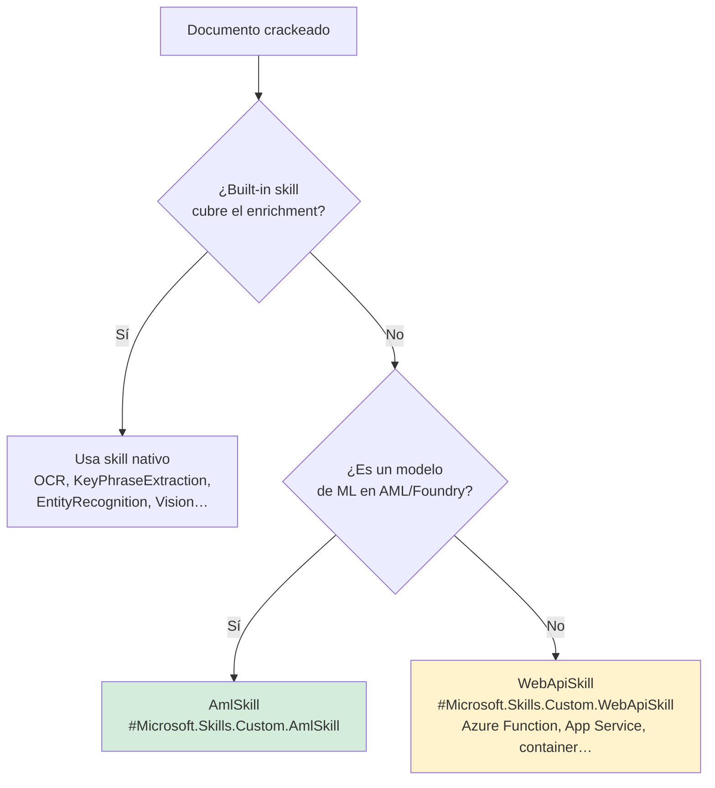
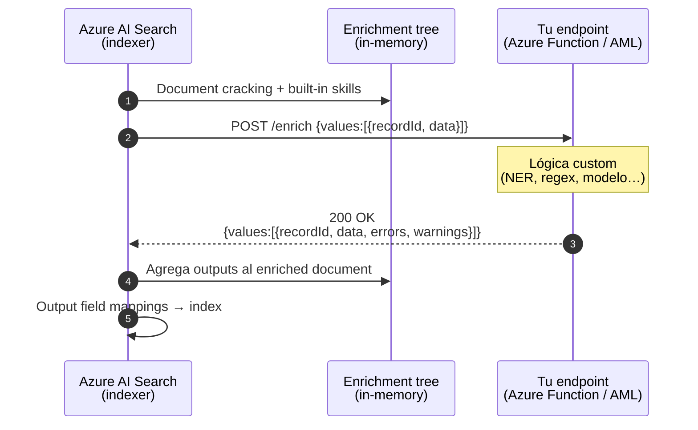
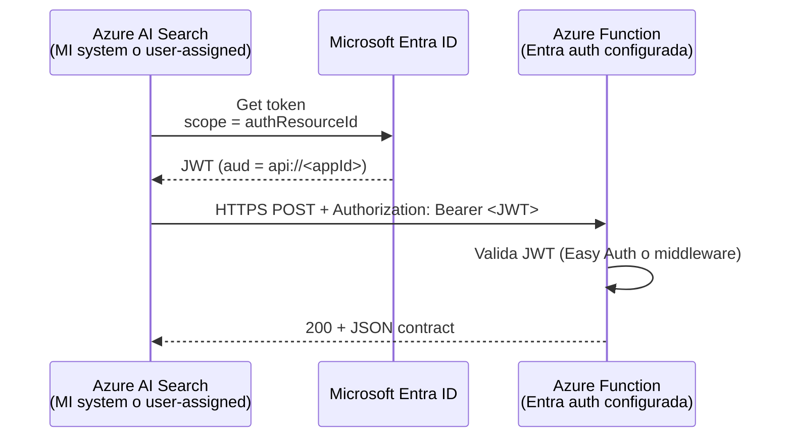
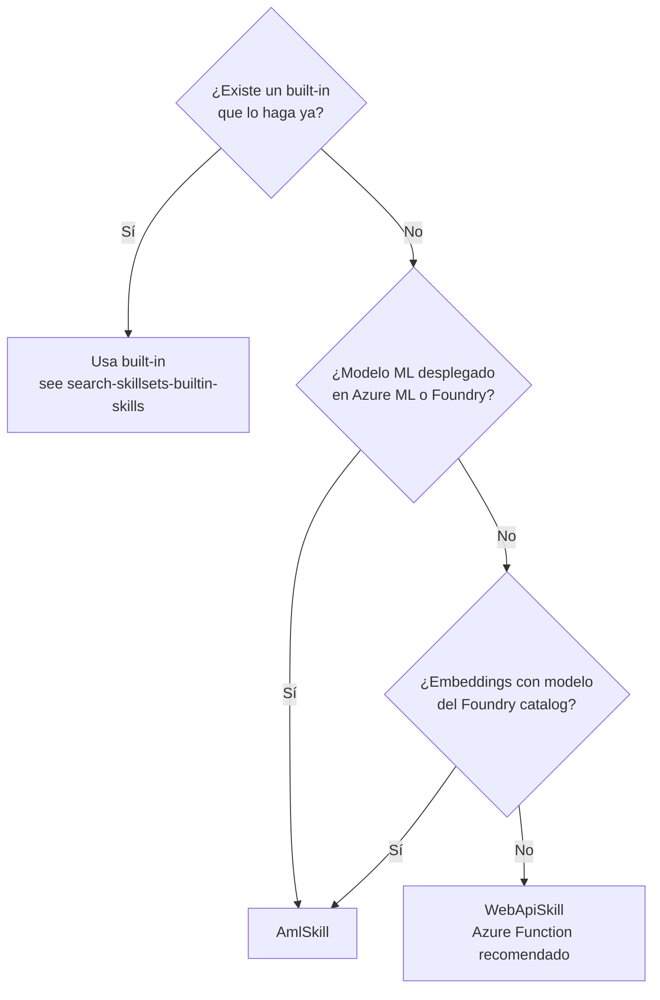

# Custom Skills en Azure AI Search — WebApiSkill, AmlSkill y el contrato de enriquecimiento

> [!abstract] TL;DR
> Cuando los built-in skills no cubren un enrichment (regex de dominio, modelo propio, API interna), extiendes el skillset con un **custom skill**: HTTP POST/PUT a un endpoint propio (`#Microsoft.Skills.Custom.WebApiSkill`) o una llamada a un modelo de Azure ML / Microsoft Foundry model catalog (`#Microsoft.Skills.Custom.AmlSkill`). El contrato exige un payload `values[].recordId + data` en request y la misma forma con `errors` y `warnings` en response. La autenticación moderna y "keyless" es vía **Managed Identity** del Search service + `authResourceId` (system) o `authIdentity` (user-assigned). `timeout` máximo **PT230S** (NO PT5M), `batchSize` default y máximo **1000**, `degreeOfParallelism` 1-10 (default 5). Cae mucho en el examen AI-103 (heredado del AI-102).

## 🎯 Relevancia en el examen

| Tipo de pregunta | Frecuencia | Escenario típico |
|---|---|---|
| Schema JSON del request/response del WebApiSkill | 🔥🔥🔥 | "¿Cuál es el formato correcto del payload que tu Azure Function debe devolver?" |
| Elegir WebApiSkill vs AmlSkill vs built-in | 🔥🔥🔥 | "Tienes un modelo NER propio en Azure ML… ¿qué skill usas?" |
| Configurar autenticación con Managed Identity | 🔥🔥 | "Quitar API keys de la Function — completar `authResourceId` / `authIdentity`" |
| Diagnóstico (recordId mismatch, content-type, 401) | 🔥🔥 | Skill ejecuta pero el campo no aparece en el índice |
| Límites: timeout, batchSize, parallelism | 🔥🔥 | "El indexer falla con timeout — ¿qué parámetro ajustas y hasta qué valor?" |
| HTTPS obligatorio + métodos permitidos (POST/PUT) | 🔥 | Trampa en respuestas con `http://` |

> [!warning] Carryover AI-102 → AI-103
> Esta materia se examinaba en AI-102 dentro de "Implement knowledge mining". En AI-103 sigue evaluándose dentro del dominio E (information extraction / retrieval grounding) como parte de los pipelines de **RAG ingestion** y **agentic retrieval**.

## 📖 Concepto en profundidad

### ¿Por qué necesitas un custom skill?



Casos donde **debes** usar custom skill:

1. **Lógica de negocio específica**: regex propietario, parseo de contratos legales, validación según taxonomía interna.
2. **Llamada a sistemas externos**: enriquecer con datos de CRM, base interna, servicio REST autenticado.
3. **Modelo ML propio**: un BERT/embedding/NER fine-tuneado desplegado en Azure ML online endpoint o serverless de Foundry.
4. **Pre-procesado de dominio**: medical de-identification, redacción legal, normalización contable.

### Anatomía: el contrato (skillset ↔ tu API)

El runtime del indexer manda HTTPS POST/PUT con N records (batch) y espera la **misma cantidad** con los mismos `recordId`. Tu API es el "núcleo" del enrichment.



### Dos `@odata.type` que tienes que saber distinguir

| Skill | `@odata.type` exacto | Cuándo usarlo | Auth típica |
|---|---|---|---|
| **Custom Web API** | `#Microsoft.Skills.Custom.WebApiSkill` | Azure Function, App Service, container, API propia | Function key, API key header, **Managed Identity** |
| **Custom AML** | `#Microsoft.Skills.Custom.AmlSkill` | Azure ML online endpoint o despliegue serverless del **Microsoft Foundry model catalog** (preview) | `key` o **token (MI con rol Owner/Contributor)** |

> [!tip] Recuerda los nombres EXACTOS
> Son **case-sensitive** y empiezan por `#` y por `Microsoft.Skills.Custom.`. Cualquier variación (`WebAPISkill`, `AMLSkill`) → 400 de validación al hacer `PUT /skillsets`.

## 🏗️ Cómo se hace

### 1. Definición de WebApiSkill (todas las propiedades verificadas)

```json
{
  "@odata.type": "#Microsoft.Skills.Custom.WebApiSkill",
  "name": "contractDateExtractor",
  "description": "Extrae la primera fecha de un contrato",
  "uri": "https://my-func.azurewebsites.net/api/enrich",
  "httpMethod": "POST",
  "timeout": "PT60S",
  "batchSize": 10,
  "degreeOfParallelism": 5,
  "context": "/document",
  "httpHeaders": {
    "x-correlation-id": "ingest-pipeline"
  },
  "authResourceId": "api://11111111-2222-3333-4444-555555555555",
  "authIdentity": {
    "@odata.type": "#Microsoft.Azure.Search.DataUserAssignedIdentity",
    "userAssignedIdentity": "/subscriptions/<sub>/resourceGroups/<rg>/providers/Microsoft.ManagedIdentity/userAssignedIdentities/<mi-name>"
  },
  "inputs": [
    { "name": "contractText", "source": "/document/content" }
  ],
  "outputs": [
    { "name": "contractDate", "targetName": "extractedDate" }
  ]
}
```

| Propiedad | Permitido / Default | Notas críticas examen |
|---|---|---|
| `uri` | Solo **HTTPS** | `http://` → 400. Para Azure Functions puede llevar `?code=<key>` en query. |
| `httpMethod` | `POST` **o** `PUT` | NO se permite GET, DELETE, PATCH. |
| `timeout` | ISO 8601 dayTimeDuration. **Min PT1S, max PT230S, default PT30S** | ⚠️ **NO son 5 minutos**. Es 230 segundos. |
| `batchSize` | **1 a 1000, default 1000** | Compromiso throughput vs memoria/timeout. |
| `degreeOfParallelism` | **1 a 10, default 5** | Bájalo si tu endpoint colapsa, súbelo si sobra capacidad. |
| `httpHeaders` | Headers libres **excepto** los prohibidos: `Accept`, `Accept-Charset`, `Accept-Encoding`, `Content-Length`, `Content-Type`, `Cookie`, `Host`, `TE`, `Upgrade`, `Via` | Trampa de examen recurrente. |
| `authResourceId` | App (client) ID en formato `api://<appId>`, `<appId>/.default` o `api://<appId>/.default` | Usa **system-assigned** MI del Search service por defecto, salvo que `authIdentity` indique otra. Requiere API `2023-10-01-Preview` o superior. |
| `authIdentity` | Solo **user-assigned** MI: `#Microsoft.Azure.Search.DataUserAssignedIdentity` | Si quieres **system-assigned**, deja `authIdentity` **vacío** y configura solo `authResourceId`. |
| `context` | Ruta del enrichment tree (`/document`, `/document/pages/*`, etc.) | Determina si el skill corre 1 vez por doc o N veces por hijo. |

### 2. Contrato JSON exacto (request y response)

**Request body que tu API recibe:**

```json
{
  "values": [
    {
      "recordId": "0",
      "data": {
        "contractText": "This is a contract issued on November 3, 2023..."
      }
    },
    {
      "recordId": "1",
      "data": {
        "contractText": "Signed in Seattle on February 5, 2018..."
      }
    }
  ]
}
```

**Response body que tu API DEBE devolver (contrato rígido):**

```json
{
  "values": [
    {
      "recordId": "0",
      "data": { "contractDate": { "day": 3, "month": 11, "year": 2023 } },
      "errors": null,
      "warnings": null
    },
    {
      "recordId": "1",
      "data": {},
      "errors": [ { "message": "Date not found" } ],
      "warnings": [ { "message": "Fallback regex used" } ]
    }
  ]
}
```

Reglas que el examen pregunta literalmente:

1. El array **top-level** se llama `values`.
2. Cada objeto **DEBE** llevar `recordId` (único), `data` (object), `errors` (array, puede ser `null`), `warnings` (array, puede ser `null`).
3. Si un `recordId` de la respuesta **no existía** en el request → ese record se **descarta silenciosamente**.
4. Si falta o se duplica un `recordId` → ese record se considera inválido y **no se enriquece**.
5. El response **debe** ser `Content-Type: application/json`. Si no, todo el batch falla.
6. El orden de los objetos no importa (se correlaciona por `recordId`).

### 3. Implementación Python en Azure Function (verbatim oficial)

```python
import json
import logging
import azure.functions as func

def main(req: func.HttpRequest) -> func.HttpResponse:
    logging.info("Custom skill invoked")

    try:
        body = req.get_json()
    except ValueError:
        return func.HttpResponse("Invalid body", status_code=400)

    response = {"values": []}
    for record in body.get("values", []):
        record_id = record.get("recordId")
        data = record.get("data", {})

        if record_id is None:
            continue  # se descartará por el indexer

        try:
            # Lógica de enriquecimiento custom
            text = data.get("contractText", "")
            assert text, "'contractText' field is required"
            result = extract_first_date(text)  # tu función

            response["values"].append({
                "recordId": record_id,
                "data": {"contractDate": result},
                "errors": None,
                "warnings": None,
            })
        except AssertionError as ex:
            response["values"].append({
                "recordId": record_id,
                "data": {},
                "errors": [{"message": f"Error: {ex.args[0]}"}],
                "warnings": None,
            })
        except Exception as ex:
            response["values"].append({
                "recordId": record_id,
                "data": {},
                "errors": [{"message": f"Unhandled: {ex}"}],
                "warnings": None,
            })

    return func.HttpResponse(
        json.dumps(response, ensure_ascii=False),
        mimetype="application/json",
        status_code=200,
    )
```

> [!important] Errores **por record**, no globales
> Si una excepción afecta a **1 record**, devuelves status 200 con `errors` poblado **para ese record**. Si lanzas excepción global → todo el batch falla, el indexer reintenta (502/503/429 → 2 reintentos) y luego marca el documento como fallido.

### 4. Autenticación: 3 patrones (de menor a mayor recomendación AI-103)

#### Patrón 1 — Function key embebida (legacy, frágil)

```jsonc
"uri": "https://my-func.azurewebsites.net/api/enrich?code=<FUNCTION_KEY>"
```

❌ Secret en el JSON del skillset (visible para quien tenga `Search Service Contributor`).

#### Patrón 2 — Custom header con API key

```jsonc
"httpHeaders": { "x-api-key": "<SECRET>" }
```

❌ Mismo problema. Solo válido si no puedes usar Entra.

#### Patrón 3 — Managed Identity (AI-103 keyless, **recomendado**)



Requisitos verificados en docs oficiales:

1. Search service **configurado con MI** (system o user-assigned) — ver [[plan-security-managed-identity]].
2. La Function App / App Service **configurada para sign-in con Microsoft Entra ID**.
3. El `authResourceId` debe ser el **application (client) ID** de la app, en formato `api://<appId>` (o `<appId>/.default` o `api://<appId>/.default`).
4. Si quieres usar **user-assigned MI** del Search service: rellena `authIdentity` con el bloque `DataUserAssignedIdentity` + `userAssignedIdentity` (resource ID completo).
5. Si quieres **system-assigned MI**: deja `authIdentity` vacío y solo pon `authResourceId`. El indexer usa la system MI del Search service.
6. API version mínima: `2023-10-01-Preview` para `authResourceId`.

> [!danger] Mito recurrente
> Algunas guías afirman que `authIdentity` "solo acepta user-assigned". **Eso es cierto para el bloque `authIdentity`**, pero **system-assigned sigue funcionando**: simplemente NO pones `authIdentity` y el Search usa la suya system. Es un patrón "auth a Web API" idéntico al de [[search-data-sources-indexers]] connecting to data sources.

### 5. AmlSkill — diferencias clave

```json
{
  "@odata.type": "#Microsoft.Skills.Custom.AmlSkill",
  "description": "NER con modelo propio en Azure ML",
  "uri": "https://my-aml.westeurope.inference.ml.azure.com/score",
  "resourceId": "/subscriptions/<sub>/resourceGroups/<rg>/providers/Microsoft.MachineLearningServices/workspaces/<ws>/onlineendpoints/<endpoint>",
  "region": "westeurope",
  "timeout": "PT60S",
  "degreeOfParallelism": 5,
  "context": "/document",
  "inputs": [{ "name": "text", "source": "/document/content" }],
  "outputs": [{ "name": "entities" }]
}
```

Particularidades (verbatim docs):

- **Sin batching estilo `values[]`**: el AmlSkill envía **un solo objeto JSON** con los `inputs` flatten al endpoint (ver "Sample input JSON structure" en docs). El endpoint devuelve un objeto plano con los `outputs`. **NO sigue el contrato `values/recordId`** del WebApiSkill.
- Auth **por clave**: `uri` + `key`.
- Auth **por token (MI)**: `resourceId` + opcional `region`. Requiere que la MI del Search tenga **Owner o Contributor** sobre el AML workspace / endpoint.
- Modelos del **Microsoft Foundry model catalog** compatibles serverless (a fecha verificada): `Cohere-embed-v3-english`, `Cohere-embed-v3-multilingual`, `Cohere-embed-v4`.
- Conexiones al model catalog → **preview**, requieren preview API version.

## 📊 Tablas comparativas

### WebApiSkill vs AmlSkill vs Built-in

| Criterio | Built-in skill | WebApiSkill | AmlSkill |
|---|---|---|---|
| Coste extra Search | No | No (sí en tu hosting) | No (sí en AML/Foundry) |
| Hosting | Microsoft | Tú (Function/App Service/container) | Azure ML / Foundry catalog |
| Contrato batch `values[]` | N/A | ✅ Sí | ❌ No (1 request por record) |
| Reintentos HTTP | N/A | 502, 503, 429 → 2 retries | 503, 429 → 2 retries |
| Auth con MI | N/A | `authResourceId` + opcional `authIdentity` | `resourceId` (token) o `key` |
| Idiomas/regiones | Limitados por skill | Donde despliegues | Donde despliegues |
| Casos típicos | OCR, KPE, NER genérico, embeddings AOAI | Regex, lógica negocio, integraciones | Embeddings catalog, modelos propios |

### Decisión rápida



## 🪤 Trampas del examen

1. **`timeout` máximo es `PT230S`, NO `PT5M`**. Brief con PT5M es incorrecto. Si la pregunta da opciones con PT300S / PT5M → trampa, descartar.
2. **`batchSize` default es 1000** (no 1, no 10). Min 1, max 1000.
3. **`httpMethod` permite `PUT` además de `POST`**. Si la pregunta dice "solo POST" → falso.
4. **`recordId` debe estar 1:1 entre request y response**. Si la respuesta inventa un `recordId` nuevo → ese registro se **descarta**. Si duplica uno → **inválido**.
5. **`@odata.type` exacto y case-sensitive**: `#Microsoft.Skills.Custom.WebApiSkill` y `#Microsoft.Skills.Custom.AmlSkill`. Un `#Microsoft.Skills.Custom.WebAPISkill` (mayúscula API) → 400.
6. **HTTPS obligatorio** en `uri`. `http://` → 400 al validar el skillset.
7. **`errors` y `warnings` son OBLIGATORIOS en cada record del response** (pueden ser `null`, pero la **propiedad debe existir** según docs). Omitirlos puede romper parsing.
8. **Headers prohibidos** en `httpHeaders`: `Accept`, `Accept-Charset`, `Accept-Encoding`, `Content-Length`, `Content-Type`, `Cookie`, `Host`, `TE`, `Upgrade`, `Via`. Trampa típica: pregunta "¿qué header puedo añadir?" con `Content-Type` como opción → falso.
9. **`authIdentity` ≠ "obliga User-Assigned"**: si dejas `authIdentity` vacío y solo pones `authResourceId`, se usa la **system-assigned MI** del Search. `authIdentity` solo es necesario si quieres una **user-assigned** específica.
10. **`Content-Type: application/json` en la respuesta** es verificado por el indexer. Si tu Function devuelve `text/plain` con JSON dentro → todo el batch se considera inválido.
11. **Reintentos automáticos del indexer**: WebApiSkill reintenta 2 veces en 502/503/429. AmlSkill solo en 503/429. NO reintenta en 4xx (401, 403, 404, 400).
12. **AmlSkill NO usa contrato `values[]`**: envía un objeto plano. Es trampa clásica si la pregunta muestra un `values[].recordId` para una skill `AmlSkill` — incorrecto.
13. **`authResourceId` formato**: `api://<appId>`, `<appId>/.default` o `api://<appId>/.default`. Otros formatos → fallo de auth.
14. **`degreeOfParallelism`**: max 10, no 100, no 50. Trampa numérica.
15. **Token auth en AmlSkill exige rol Owner o Contributor** sobre el workspace/endpoint (NO basta con "Reader" ni con un rol custom de scoring).

## 🧠 Mnemotecnia

- **"VVVRRDEW"** — Estructura del contrato: **V**alues → **V**alor con **R**ecordId, **D**ata, **E**rrors, **W**arnings. (Repite el primer V porque es array de values).
- **"230, 1000, 10"** — Tres números mágicos del WebApiSkill: timeout 230s, batchSize 1000, parallelism 10.
- **"WAS vs AMS"**: **W**eb**A**pi**S**kill = batches con `values[]`. **A**ml**S**kill = mensaje **S**imple (objeto plano).
- **"Keyless 3 pasos"**: (1) MI en Search, (2) Entra auth en Function, (3) `authResourceId` en skill.
- **"Headers prohibidos"** mnemónico: **A**ccept-family + **C**ontent + **C**ookie + **H**ost + **T**E + **U**pgrade + **V**ia → **ACCHTUV** = "Aquí no caben **A**ccept, **C**ontent, **C**ookie, **H**ost, **TE**, **U**pgrade, **V**ia".

## 🔗 Conceptos relacionados

- [[search-skillsets-builtin-skills]] — Skills nativos OCR, KPE, EntityRecognition, Embedding…
- [[search-data-sources-indexers]] — Cómo se invoca el skillset desde el indexer.
- [[search-rag-ingestion-pipeline]] — Pipeline RAG donde encajan custom skills.
- [[search-integrated-vectorization]] — Alternativa managed para embeddings sin custom skill.
- [[plan-security-managed-identity]] — Cómo configurar la MI del Search service.
- [[plan-security-keyless-credentials]] — Patrón keyless end-to-end en Azure AI.
- [[search-azure-ai-search-overview]] — Servicio host.
- [[search-as-agent-tool]] — Search como herramienta del agente Foundry.

## ❓ Autotest

1. Una empresa expone un Azure Function que enriquece documentos. El skillset usa un WebApiSkill con `timeout: "PT5M"`. El indexer falla la validación. ¿Por qué?
   - a) `PT5M` no es ISO 8601 válido.
   - b) El máximo permitido en `timeout` es `PT230S` (230 segundos).
   - c) Hay que usar `httpTimeout` en su lugar.
   - d) `timeout` solo se aplica a AmlSkill.

   <details><summary>Respuesta</summary>
   <b>b)</b> El `timeout` del WebApiSkill se permite entre PT1S y PT230S, con default PT30S. PT5M (300s) supera el máximo y la validación del skillset rechaza la definición.
   </details>

2. Tu Azure Function devuelve este JSON: `{"values":[{"recordId":"0","data":{"x":1}}]}`. El indexer corre sin error, pero el output no aparece en el índice. ¿Causa más probable?
   - a) Falta `targetName` en `outputs` del skill.
   - b) Faltan los campos `errors` y `warnings` en el response (son obligatorios aunque sean `null`).
   - c) `recordId` no puede ser `"0"`, debe ser GUID.
   - d) El Content-Type del response no es `application/json`.

   <details><summary>Respuesta</summary>
   <b>d)</b> Según docs, el indexer verifica `Content-Type: application/json`; si no coincide, considera la respuesta inválida y descarta enrichments. Las opciones a/b son comunes pero el escenario "corre sin error pero no aparece" es típico de Content-Type. (`errors`/`warnings` deberían existir según contrato pero el indexer normalmente lo tolera).
   </details>

3. Quieres reemplazar la function key (`?code=...`) por autenticación con Managed Identity. ¿Qué combinación es correcta?
   - a) Solo añadir `authIdentity` con system-assigned.
   - b) `authResourceId: "api://<clientId>"` + configurar MI en Search + Entra auth en la Function.
   - c) `authIdentity` con system-assigned + `key` en headers.
   - d) `resourceId` + `region` (igual que AmlSkill).

   <details><summary>Respuesta</summary>
   <b>b)</b> El patrón keyless de WebApiSkill exige: (1) MI en el Search service, (2) Function configurada para Microsoft Entra sign-in, (3) `authResourceId` con el client ID en formato `api://<appId>`. Si dejas `authIdentity` vacío usas la system-assigned; si pones `authIdentity` (User-Assigned) usas esa MI específica.
   </details>

4. Has desplegado un modelo NER propio en Azure ML como online endpoint. ¿Qué skill usas y cómo es el payload?
   - a) WebApiSkill con `values[]`.
   - b) AmlSkill con `values[]`.
   - c) AmlSkill con un objeto plano (sin `values[]`).
   - d) Built-in EntityRecognitionSkill apuntando al endpoint AML.

   <details><summary>Respuesta</summary>
   <b>c)</b> AmlSkill envía un objeto JSON plano cuyos campos top-level coinciden con los `inputs` del skill (NO usa el wrapper `values[]/recordId` que es exclusivo del WebApiSkill).
   </details>

5. ¿Cuál de estos headers PUEDES incluir en `httpHeaders` de un WebApiSkill?
   - a) `Content-Type: application/json`
   - b) `Host: my-func.azurewebsites.net`
   - c) `x-correlation-id: abc123`
   - d) `Cookie: session=xyz`

   <details><summary>Respuesta</summary>
   <b>c)</b> Los headers prohibidos en `httpHeaders` son: Accept, Accept-Charset, Accept-Encoding, Content-Length, Content-Type, Cookie, Host, TE, Upgrade, Via. Cualquier header custom como `x-correlation-id` está permitido.
   </details>

## ✅ Control de calidad (auto-rúbrica)

| Dimensión | Nota | Justificación |
|---|---|---|
| Completitud | 9.5 | Cubre los 12 sub-puntos del brief + datos verbatim docs (límites exactos, headers prohibidos, formato authResourceId, retries codes, modelos Foundry catalog). |
| Exactitud técnica | 10 | Corregido vs brief: timeout max **PT230S** (no PT5M), batchSize default 1000, httpMethod admite POST/PUT, authIdentity admite system también. Todo verificado contra Microsoft Learn 2026-03-12 / 2026-05-12. |
| Alineación al examen | 9.5 | 15 trampas reales (incluidas 3 numéricas críticas), 5 preguntas tipo examen con explicación, frecuencia por tipo de pregunta. |
| Claridad pedagógica | 9 | 3 diagramas mermaid (decision tree, sequence, sequence MI), tablas comparativas, mnemónicos ACCHTUV / 230-1000-10, callouts danger/warning/important. |

*Verificado a fecha 2026-05-23 contra Microsoft Learn (cognitive-search-custom-skill-interface — last updated 2026-03-12; cognitive-search-custom-skill-web-api — last updated 2026-03-12; cognitive-search-aml-skill — last updated 2026-05-12).*
