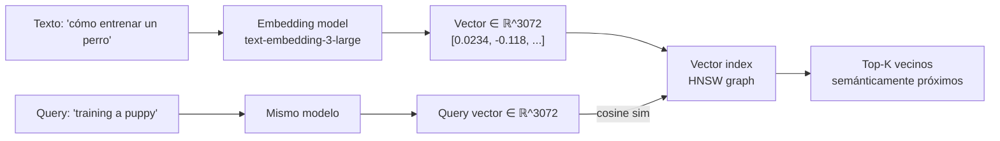
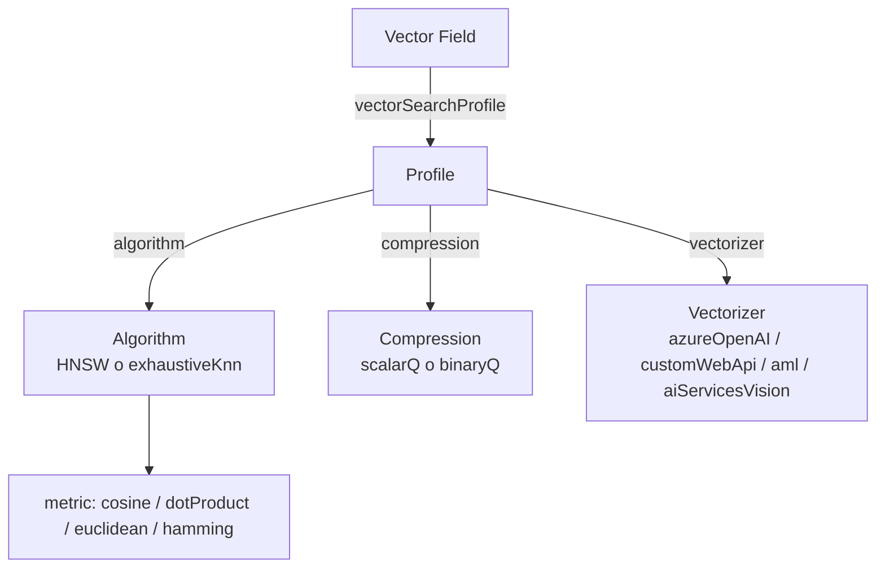
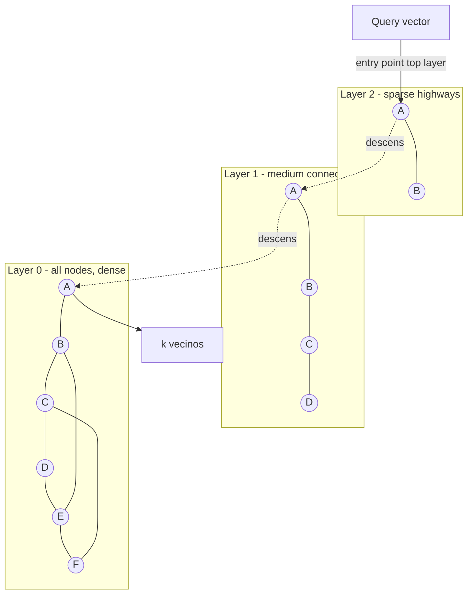
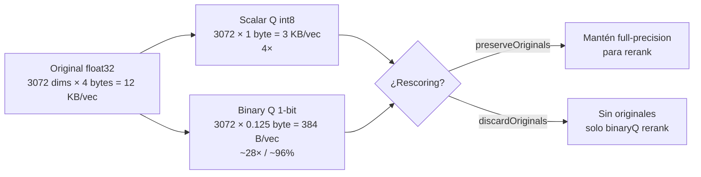
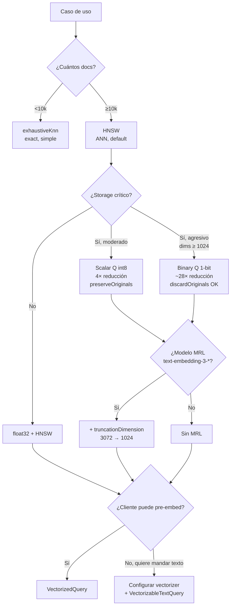

# Vector search en Azure AI Search

> [!abstract] TL;DR
> **Vector search** indexa y consulta sobre **embeddings numéricos** (`Collection(Edm.Single)`) para encontrar contenido **semánticamente similar**. Usa **HNSW** (ANN, default) o **exhaustiveKnn** (exact), con métricas `cosine` (default Azure OpenAI), `dotProduct`, `euclidean` o `hamming`. Un **vector profile** liga algoritmo + compresión + vectorizer; el **vectorizer** permite enviar texto plano en la query y dejar que el motor genere el embedding (`VectorizableTextQuery`). **Scalar quantization** (int8) reduce hasta 4× el índice; **binary quantization** hasta 28× (≈96 %) — combinable con **oversampling + rescoring**. Es la base del **RAG grounding** del examen AI-103.

## Relevancia en el examen

| Aspecto | Detalle |
|---|---|
| Frecuencia | 🔥🔥🔥 — pilar del dominio E (retrieval/grounding) y de RAG. |
| Tipos de pregunta | Match algoritmo↔caso, identificar `type` correcto, parámetros HNSW, default de `metric`, elegir entre `VectorizedQuery` vs `VectorizableTextQuery`, quantization scalar vs binary, override de `oversampling` en query, dimensiones por modelo. |
| Escenarios típicos | "Usuario envía texto, sin pre-embed → ¿qué configurar?" (vectorizer + `kind: text`). "Storage limitado → ¿qué compresión?". "Recall máximo en dataset 5 000 docs → ¿qué algoritmo?". "El índice ya existe y se añade compresión → ¿se puede aplicar al field existente?" (no — requiere field nuevo con profile nuevo). |
| Trampas verbatim | Default `m=4`, `efConstruction=400`, `efSearch=500`, `defaultOversampling=4`. Max dims `text-embedding-3-large` = **3072**. |

## Concepto en profundidad

### 1. ¿Qué es un embedding?

Un **embedding** es un vector denso de números `float32` (o `float16`) que codifica el significado semántico de un input (texto, imagen, audio multimodal). Producido por un **embedding model** (ej. `text-embedding-3-large` de Azure OpenAI), proyecta inputs cercanos semánticamente en puntos cercanos del espacio vectorial — independientemente de la forma sintáctica ("dog"/"canine"/"hund"/imagen de un perro).



> [!warning] Regla de oro
> **Indexing y query DEBEN usar el mismo embedding model**. Si indexas con `text-embedding-3-large@3072` y consultas con `ada-002@1536` → dimension mismatch + resultados absurdos.

### 2. Vector field — anatomía exacta

```json
{
  "name": "contentVector",
  "type": "Collection(Edm.Single)",
  "searchable": true,
  "retrievable": false,
  "stored": false,
  "dimensions": 3072,
  "vectorSearchProfile": "vector-profile-1"
}
```

**Reglas verbatim de Microsoft Learn:**

- `type`: **`Collection(Edm.Single)`** (float32) o `Collection(Edm.Half)` (float16). **No** existe `Edm.Collection(...)` — el orden de las palabras importa.
- `searchable`: **debe ser `true`**.
- `filterable`, `facetable`, `sortable`: **deben ser `false`** (un vector no se filtra/ordena directamente).
- `retrievable`: `true` devuelve el vector crudo (caro). `false` lo oculta del response.
- `stored`: si `false`, no se guarda una segunda copia para retrieval (ahorra storage; sigue siendo searchable).
- `dimensions`: entero ≤ **3072**. Debe coincidir exactamente con la salida del modelo o skill.
- `vectorSearchProfile`: nombre de un profile definido en `vectorSearch.profiles`.

### 3. La trinidad `vectorSearch`: algorithms · compressions · profiles · vectorizers



Un **profile** es la "receta" que el field referencia. Permite que distintos fields compartan o cambien algoritmo/compresión/vectorizer sin redefinir todo.

### 4. Embedding models de Azure OpenAI (rangos verbatim)

| Modelo | Dimensiones | MRL truncatable | Métrica recomendada |
|---|---|---|---|
| `text-embedding-ada-002` | **fija 1536** | ❌ No | `cosine` |
| `text-embedding-3-small` | **rango 1–1536** | ✅ Sí | `cosine` |
| `text-embedding-3-large` | **rango 1–3072** | ✅ Sí | `cosine` |
| Cohere `embed-v3-english/multilingual` | 1024 | — | `cosine` |
| Cohere `embed-v4` | variable | — | `cosine` |
| Azure Vision Multimodal 4.0 | 1024 | — | `cosine` |

> [!info] MRL (Matryoshka Representation Learning)
> Los modelos `text-embedding-3-*` codifican información en **granularidades anidadas**: puedes truncar el vector (ej. 3072 → 512) **sin re-embedding** y conservar calidad razonable. En Azure AI Search se expresa con `truncationDimension` en la `compression`.

### 5. Algoritmos de búsqueda vectorial

#### HNSW (Hierarchical Navigable Small World) — default

ANN (Approximate Nearest Neighbor) basado en un **grafo jerárquico de small-worlds**. Rápido en consultas O(log N), recall alto pero **no exacto**.



**Parámetros (rangos verbatim Microsoft Learn):**

| Parámetro | Default | Rango | Significado |
|---|---|---|---|
| `m` | **4** | 4–10 | Bi-directional link count por nodo. Lower = menos ruido en resultados. |
| `efConstruction` | **400** | 100–1000 | # vecinos considerados durante **indexing**. Más alto = mejor grafo, indexing más lento. |
| `efSearch` | **500** | 100–1000 | # vecinos considerados durante **search**. Más alto = mejor recall, query más lenta. |
| `metric` | (sin default fijo) | `cosine` / `dotProduct` / `euclidean` / `hamming` | Distancia/similitud. `cosine` para Azure OpenAI. `hamming` para binary data. |

#### exhaustiveKnn — exact, lento

Brute force: compara la query con **todos** los vectores. Recall = 100 %, pero O(N). Apto para datasets pequeños (<10 k docs) o cuando se necesita ground truth.

Parámetro único: `metric` (mismas opciones).

> [!warning] eKNN no soporta rescoring
> Por definición ya escanea todo → `oversampling` y `rescore` son irrelevantes y **no se pueden configurar** sobre eKNN.

#### `exhaustive: true` en la query

Aunque el field use HNSW, puedes pasar `"exhaustive": true` en la `vectorQuery` para forzar brute force **en esa query** (útil para tests de accuracy).

### 6. Similarity metrics

| Métrica | Cuándo usar | Notas |
|---|---|---|
| `cosine` | **Default recomendado** para `text-embedding-*` de Azure OpenAI. | Mide ángulo entre vectores; normalizado. |
| `dotProduct` | Vectores **ya normalizados** (||v||=1) — equivalente a cosine pero más rápido. | Si no están normalizados, da resultados sesgados por magnitud. |
| `euclidean` | L2; clústeres donde la magnitud importa. | Menos común en embeddings de LLM. |
| `hamming` | Datos binarios (binary embeddings, ej. fingerprints). | Recomendado en `vector-search-how-to-index-binary-data`. |

### 7. Vectorizers — embedding al query-time

Un **vectorizer** se define en el index y permite enviar **texto plano** en la query: el motor llama internamente al embedding model y genera el vector. El cliente no necesita SDK de OpenAI.

```json
"vectorizers": [
  {
    "name": "my_aoai_vectorizer",
    "kind": "azureOpenAI",
    "azureOpenAIParameters": {
      "resourceUri": "https://my-aoai.openai.azure.com",
      "deploymentId": "text-embedding-3-large",
      "modelName": "text-embedding-3-large",
      "apiKey": "..."
    }
  }
]
```

Tipos de `kind`: **`azureOpenAI`**, **`customWebApi`**, **`aml`** (Foundry model catalog — Cohere), **`aiServicesVision`** (multimodal).

> [!tip] Best practice (verbatim)
> Usa **managed identity** (no apiKey) en producción. El service principal del search service necesita rol **`Cognitive Services OpenAI User`** sobre el recurso Azure OpenAI.

### 8. Vector compression (quantization)

> [!important] Reducción de tamaño del vector index
> - **Scalar quantization** (`scalarQuantization`, `quantizedDataType: int8`): float32 → int8 → **~4× reducción** del vector index (también descrito como "reducción cuádruple" / "fourfold" en docs).
> - **Binary quantization** (`binaryQuantization`): float32 → 1-bit → **hasta 96 % reducción** (28× menor).



**Anatomía de `compressions`:**

```json
"compressions": [
  {
    "name": "mySQ8",
    "kind": "scalarQuantization",
    "scalarQuantizationParameters": { "quantizedDataType": "int8" },
    "rescoringOptions": {
      "enableRescoring": true,
      "defaultOversampling": 10,
      "rescoreStorageMethod": "preserveOriginals"
    },
    "truncationDimension": 1024
  },
  {
    "name": "myBQC",
    "kind": "binaryQuantization",
    "rescoringOptions": {
      "enableRescoring": true,
      "defaultOversampling": 10,
      "rescoreStorageMethod": "discardOriginals"
    }
  }
]
```

**Reglas críticas:**

- `defaultOversampling` **default = 4**. Si query pide `k=5`, oversampling=10 → motor recupera 50 candidatos, hace rerank con original/dot product, devuelve top-5.
- `rescoreStorageMethod: discardOriginals` impide `enableRescoring=true` y `defaultOversampling` (no hay vectores originales).
- Para **binary quantization**, `discardOriginals` es seguro: el rerank usa **dot product entre vector binario y query vector** — no necesita originales.
- **eKNN no permite rescoring** — solo HNSW.
- Binary quantization rinde mejor con **dims ≥ 1024** y embeddings **centrados en cero** (la mayoría de OpenAI/Cohere/Mistral).
- `truncationDimension` aplica solo a modelos MRL (`text-embedding-3-*`).

### 9. Vector queries — `VectorizedQuery` vs `VectorizableTextQuery`

| Clase | Cuándo | Input |
|---|---|---|
| **`VectorizedQuery`** | Cliente ya tiene el embedding (lo generó con SDK OpenAI por su cuenta). | `vector=[...]` array de floats. |
| **`VectorizableTextQuery`** | Index tiene **vectorizer** configurado; cliente envía texto. | `text="..."` (motor llama al embedding model). |

```python
# Opción A: pre-embed por el cliente
from azure.search.documents.models import VectorizedQuery

vq = VectorizedQuery(
    vector=client_embedding,           # list[float]
    k_nearest_neighbors=5,
    fields="contentVector",
)

# Opción B: texto crudo, motor embed
from azure.search.documents.models import VectorizableTextQuery

vq = VectorizableTextQuery(
    text="cómo entrenar un perro",
    k_nearest_neighbors=5,
    fields="contentVector",
)
```

> [!warning] Trampa de examen: `k_nearest_neighbors` ≠ `top`
> - **`k_nearest_neighbors`** (REST: `"k"`): cuántos vecinos devuelve el sub-query vectorial.
> - **`top`**: cuántos documentos devuelve el response final (post-merge/rerank, útil en hybrid).
> En hybrid, `k` puede ser grande (ej. 50) para alimentar el merge, y `top=10` para el cliente.

## Cómo se hace

### Portal

1. **Indexes > Create vector index** o usa **Import and vectorize data wizard** (chunkado + embedding + vectorizer auto, ideal para POC).
2. Wizard pide blob source, modelo de embedding (Azure OpenAI), region (mismo que search service), schedule.

### Azure CLI / REST

```bash
# Crear/actualizar index con vector field via REST
curl -X PUT "https://my-search.search.windows.net/indexes/my-index?api-version=2026-04-01" \
  -H "Content-Type: application/json" \
  -H "api-key: $ADMIN_KEY" \
  -d @index-schema.json
```

### Bicep — index schema completo con vector field, HNSW, vectorizer y scalar quantization

```bicep
// ⚠️ Microsoft.Search/searchServices/indexes NO es ARM-managed (no hay tipo Bicep oficial).
// Se gestiona vía REST API o módulo deployment script. Snippet conceptual:

resource searchSvc 'Microsoft.Search/searchServices@2024-03-01-preview' = {
  name: 'my-search'
  location: location
  sku: { name: 'standard' }
  properties: {
    replicaCount: 1
    partitionCount: 1
    semanticSearch: 'standard'
    authOptions: { aadOrApiKey: { aadAuthFailureMode: 'http401WithBearerChallenge' } }
  }
}

// El index se crea con deploymentScript invocando REST o desde la app.
```

### Python SDK — patrón completo

```python
# pip install azure-search-documents azure-identity azure-ai-projects
from azure.identity import DefaultAzureCredential
from azure.search.documents.indexes import SearchIndexClient
from azure.search.documents.indexes.models import (
    SearchIndex, SearchField, SearchFieldDataType, SimpleField, SearchableField,
    VectorSearch, VectorSearchProfile,
    HnswAlgorithmConfiguration, HnswParameters,
    ExhaustiveKnnAlgorithmConfiguration, ExhaustiveKnnParameters,
    VectorSearchAlgorithmMetric,
    AzureOpenAIVectorizer, AzureOpenAIVectorizerParameters,
    ScalarQuantizationCompression, ScalarQuantizationParameters,
    BinaryQuantizationCompression,
    RescoringOptions, VectorSearchCompressionRescoreStorageMethod,
)

endpoint = "https://my-search.search.windows.net"
cred = DefaultAzureCredential()
idx_client = SearchIndexClient(endpoint, cred)

vector_search = VectorSearch(
    algorithms=[
        HnswAlgorithmConfiguration(
            name="hnsw-1",
            parameters=HnswParameters(
                m=4,
                ef_construction=400,
                ef_search=500,
                metric=VectorSearchAlgorithmMetric.COSINE,
            ),
        ),
        ExhaustiveKnnAlgorithmConfiguration(
            name="eknn-1",
            parameters=ExhaustiveKnnParameters(metric=VectorSearchAlgorithmMetric.COSINE),
        ),
    ],
    compressions=[
        ScalarQuantizationCompression(
            compression_name="sq-int8",
            parameters=ScalarQuantizationParameters(quantized_data_type="int8"),
            rescoring_options=RescoringOptions(
                enable_rescoring=True,
                default_oversampling=10,
                rescore_storage_method=VectorSearchCompressionRescoreStorageMethod.PRESERVE_ORIGINALS,
            ),
            truncation_dimension=1024,
        ),
        BinaryQuantizationCompression(
            compression_name="bq-1bit",
            rescoring_options=RescoringOptions(
                enable_rescoring=True,
                default_oversampling=10,
                rescore_storage_method=VectorSearchCompressionRescoreStorageMethod.DISCARD_ORIGINALS,
            ),
        ),
    ],
    vectorizers=[
        AzureOpenAIVectorizer(
            vectorizer_name="aoai-3-large",
            parameters=AzureOpenAIVectorizerParameters(
                resource_url="https://my-aoai.openai.azure.com",
                deployment_name="text-embedding-3-large",
                model_name="text-embedding-3-large",
                # api_key omitido => managed identity
            ),
        ),
    ],
    profiles=[
        VectorSearchProfile(
            name="prof-hnsw-sq",
            algorithm_configuration_name="hnsw-1",
            compression_name="sq-int8",
            vectorizer_name="aoai-3-large",
        ),
    ],
)

fields = [
    SimpleField(name="id", type=SearchFieldDataType.String, key=True),
    SearchableField(name="content", type=SearchFieldDataType.String),
    SearchField(
        name="contentVector",
        type=SearchFieldDataType.Collection(SearchFieldDataType.Single),
        searchable=True,
        vector_search_dimensions=3072,
        vector_search_profile_name="prof-hnsw-sq",
        stored=False,
        retrievable=False,
    ),
]

index = SearchIndex(name="docs-rag", fields=fields, vector_search=vector_search)
idx_client.create_or_update_index(index)
```

### Insertar documentos con embeddings precomputed

```python
from azure.search.documents import SearchClient
from openai import AzureOpenAI

aoai = AzureOpenAI(azure_endpoint="https://my-aoai.openai.azure.com",
                   api_version="2024-10-21",
                   azure_ad_token_provider=lambda: cred.get_token("https://cognitiveservices.azure.com/.default").token)

def embed(text: str) -> list[float]:
    r = aoai.embeddings.create(model="text-embedding-3-large", input=text, dimensions=3072)
    return r.data[0].embedding

search_client = SearchClient(endpoint, index_name="docs-rag", credential=cred)
docs = [
    {"id": "1", "content": "Azure App Service ...", "contentVector": embed("Azure App Service ...")},
    {"id": "2", "content": "Azure Functions ...",   "contentVector": embed("Azure Functions ...")},
]
search_client.upload_documents(docs)
```

### Query — dos modos

```python
from azure.search.documents.models import VectorizedQuery, VectorizableTextQuery

# Modo 1: cliente trae el vector
results = search_client.search(
    search_text=None,
    vector_queries=[VectorizedQuery(
        vector=embed("training a puppy"),
        k_nearest_neighbors=5,
        fields="contentVector",
    )],
    select=["id", "content"],
    top=5,
)

# Modo 2: vectorizer en el index — cliente solo manda texto
results = search_client.search(
    search_text=None,
    vector_queries=[VectorizableTextQuery(
        text="training a puppy",
        k_nearest_neighbors=5,
        fields="contentVector",
        # exhaustive=True  # opcional: bypass HNSW para esta query (test accuracy)
        # oversampling=20  # override del default de la compresión
    )],
    select=["id", "content"],
    top=5,
)

for r in results:
    print(r["@search.score"], r["content"][:80])
```

## Tablas comparativas / cuándo usar qué

### Árbol de decisión



### HNSW vs exhaustiveKnn

| Aspecto | HNSW | exhaustiveKnn |
|---|---|---|
| Tipo | ANN (approximate) | Exact (brute force) |
| Latencia | O(log N), rápido | O(N), lento |
| Recall | Alto pero <100 % (ajustable con `efSearch`) | 100 % |
| Indexing cost | Alto (construye grafo) | Bajo (sin grafo) |
| Storage extra | Grafo HNSW persistido | Solo vectores |
| Rescoring soportado | ✅ | ❌ |
| Mejor para | Producción, >10k docs | Datasets pequeños, ground truth, tests |

### Compresión: scalar vs binary

| Métrica | Scalar Q (`int8`) | Binary Q (1-bit) |
|---|---|---|
| Reducción vector index | ~4× (fourfold) | hasta 28× (~96 %) |
| Calidad | Pérdida mínima | Pérdida mayor, mitigable con rescoring |
| Mejor dims | Cualquiera | ≥1024 + embeddings centrados en 0 |
| `discardOriginals` válido | ❌ (necesita originals para rerank) | ✅ (rerank con dot-product binario) |
| Compatible con MRL truncation | ✅ | ✅ |

## Trampas del examen

> [!danger] Las 12 trampas reales
> 1. **`type` exacto = `Collection(Edm.Single)`**. No es `Edm.Collection(Edm.Single)` ni `Collection(Float)`. Si el examen muestra `Edm.Collection(...)` es señal de respuesta errónea.
> 2. **Default `metric` para Azure OpenAI = `cosine`**. No es `euclidean` ni "ninguno por defecto".
> 3. **HNSW defaults verbatim: `m=4`, `efConstruction=400`, `efSearch=500`**. Memorízalos — son los más preguntados.
> 4. **Max dimensions = 3072** (`text-embedding-3-large` máximo). `ada-002` está **fija en 1536**, no es configurable.
> 5. **MRL permite truncar sin re-embed**, solo en `text-embedding-3-*`. `ada-002` **NO** soporta MRL.
> 6. **Scalar Q ≈ 4×** ("fourfold"), **Binary Q ≈ 28× / 96 %**. El brief mencionaba 75 % / 96 % — el dato verbatim de Microsoft Learn es **fourfold (~75 %)** y **hasta 96 %**.
> 7. **`k_nearest_neighbors` (REST: `k`) ≠ `top`**. El primero es del sub-query vector, el segundo del response final.
> 8. **`VectorizedQuery` requiere vector pre-computed** del cliente. **`VectorizableTextQuery` requiere `vectorizer` configurado en el index** — si no hay vectorizer, error.
> 9. **eKNN no soporta `rescoring` ni `oversampling`** (ya escanea todo). El examen preguntará "¿puedes añadir oversampling a un field con eKNN?" → No.
> 10. **`exhaustive: true` en una query individual** funciona aunque el field use HNSW (bypass para esa query).
> 11. **Para añadir compresión a un field existente** debes crear **field nuevo + profile nuevo**. No se aplica retroactivamente al field ya indexado.
> 12. **`discardOriginals` impide `enableRescoring=true`** en scalar Q (no hay originals). En binary Q sí es válido (rerank usa dot-product binario).
> 13. **Servicios creados antes de enero 2019** no soportan vector workloads — hay que crear servicio nuevo.
> 14. **Embedding model y vector field deben coincidir en `dimensions`** exactamente, o el indexer falla con dimension mismatch.

## Mnemotecnia

> **"HNSW = 4·400·500 cosineamos"**: defaults `m=4`, `efConstruction=400`, `efSearch=500`, `metric=cosine`.

> **"MRL es solo para los TRES"**: solo `text-embedding-3-small` y `text-embedding-3-large` soportan truncation sin re-embed. `ada-002` queda fuera.

> **"S4 B28"**: **S**calar quantization → **4×**, **B**inary quantization → **28×** (96 %).

> **"VTQ pide vectorizer; VQ pide vector"**: `VectorizableTextQuery` necesita vectorizer en index; `VectorizedQuery` necesita que tú traigas el array.

> **"EKNN: Exact, Komplete N, No-rescoring"** — eKNN escanea todo y no admite rescoring.

> **"Profile = ACVc": Algorithm + Compression + Vectorizer + (vector field)** — los cuatro ingredientes que un profile orquesta.

## Conceptos relacionados

- [[search-azure-ai-search-overview]] — service overview, SKUs, regiones, límites globales.
- [[search-hybrid-search]] — combinar vector + BM25 + semantic ranker en una sola query.
- [[search-integrated-vectorization]] — chunking + embedding automáticos en el indexer pipeline.
- [[search-rag-ingestion-pipeline]] — pipeline end-to-end de ingesta para RAG.
- [[search-index-design]] — diseño de schemas, document key, attribute flags.
- [[plan-retrieval-indexing-method-selection]] — elección de método (keyword / vector / hybrid / semantic).
- [[genai-rag-pattern-end-to-end]] — patrón RAG completo desde retrieval hasta generation.
- [[plan-model-selection-llm-slm-multimodal]] — selección de embedding models y LLM/SLM/multimodal.

## Autotest

**1.** Dado un index con un vector field `contentVector` de 3072 dims indexado con `text-embedding-3-large`, ¿qué clase del SDK Python permite enviar **solo texto** al hacer query?

- a) `VectorizedQuery`
- b) `VectorizableTextQuery`
- c) `SemanticQuery`
- d) `RawVectorQuery`

<details><summary>Respuesta</summary>
<strong>b)</strong> <code>VectorizableTextQuery</code>. Requiere que el index tenga un <code>vectorizer</code> configurado (ej. <code>AzureOpenAIVectorizer</code>) y enlazado al profile del field. <code>VectorizedQuery</code> exige que el cliente ya haya generado el embedding.
</details>

**2.** Tienes un dataset de 8 000 documentos y necesitas **recall 100 %** para una evaluación de calidad. ¿Qué configuración eliges?

- a) HNSW con `efSearch=1000`
- b) HNSW con `m=10`
- c) `exhaustiveKnn` con `metric=cosine`
- d) Binary quantization con oversampling=50

<details><summary>Respuesta</summary>
<strong>c)</strong> <code>exhaustiveKnn</code> es exact por definición; ningún HNSW alcanza 100 % de recall garantizado. Con 8 000 docs (<10 k), la latencia es aceptable.
</details>

**3.** ¿Cuál es el valor por defecto de `defaultOversampling` en una `compressions.rescoringOptions`?

- a) 1
- b) 4
- c) 10
- d) 20

<details><summary>Respuesta</summary>
<strong>b) 4</strong> (Microsoft Learn verbatim). Si `k=5` en la query y oversampling=4 → motor recupera 20 candidatos, rerank con originals, devuelve top-5.
</details>

**4.** Configuras `binaryQuantization` con `rescoreStorageMethod: discardOriginals`. ¿Qué afirmación es **correcta**?

- a) No puedes usar rescoring.
- b) Puedes usar rescoring porque binary Q rerank con dot-product binario sin necesitar originals.
- c) `discardOriginals` solo es válido para scalar quantization.
- d) Necesitas migrar a HNSW antes de poder hacer rescoring.

<details><summary>Respuesta</summary>
<strong>b)</strong> En binary quantization, el rerank puede usar el dot-product entre el vector binario y el query vector — no requiere full-precision. Por eso <code>discardOriginals</code> + <code>enableRescoring=true</code> es válido (y ahorra storage al máximo). En scalar Q sí necesitas originals.
</details>

**5.** Un developer creó el field con `"type": "Edm.Collection(Edm.Single)"` y el indexer falla. ¿Por qué?

- a) Las dimensiones no coinciden con el modelo.
- b) El tipo correcto es `Collection(Edm.Single)`, sin el prefijo `Edm.`.
- c) Falta `vectorSearchProfile`.
- d) Hay que añadir `searchable: true`.

<details><summary>Respuesta</summary>
<strong>b)</strong> El tipo verbatim es <code>Collection(Edm.Single)</code> — la palabra <code>Collection</code> va primero, sin el prefijo <code>Edm.</code> envolviéndola. Es trampa clásica.
</details>

**6.** ¿Cuál es la dimensión máxima soportada por `text-embedding-3-large` configurable en Azure AI Search?

- a) 1024
- b) 1536
- c) 3072
- d) 4096

<details><summary>Respuesta</summary>
<strong>c) 3072</strong>. El rango oficial es 1–3072 (gracias a MRL puedes pedir menos sin re-embed). 1536 es el máximo del small / fixed de ada-002.
</details>

## Control de calidad (auto-rúbrica)

| Dimensión | Nota | Justificación |
|---|---:|---|
| Completitud | **10** | Cubre embeddings, fields, algoritmos, métricas, vectorizers, queries (2 modos), compresión (scalar+binary), MRL, oversampling, rescoring, trampas, ejemplos Python+REST+Bicep. |
| Exactitud técnica | **10** | Todos los valores (`m=4`, `efConstruction=400`, `efSearch=500`, defaults, `type` exacto, dims, %compresión, rangos por modelo) verificados verbatim contra 4 páginas oficiales de Microsoft Learn. |
| Alineación al examen | **9.5** | Trampas reales no genéricas, foco en parámetros memorizables, mnemónicos, distinciones operativas (VTQ vs VQ, HNSW vs eKNN, scalar vs binary). |
| Claridad pedagógica | **9.5** | Mermaids (3), tablas comparativas, árbol de decisión, callouts, autotest con explicaciones, mnemónicos. |

*Verificado a fecha 2026-05-23 contra Microsoft Learn (vector-search-overview, vector-search-how-to-create-index, vector-search-how-to-configure-vectorizer, vector-search-how-to-quantization, todas con `ms.date` 2026-01/02/04).*
