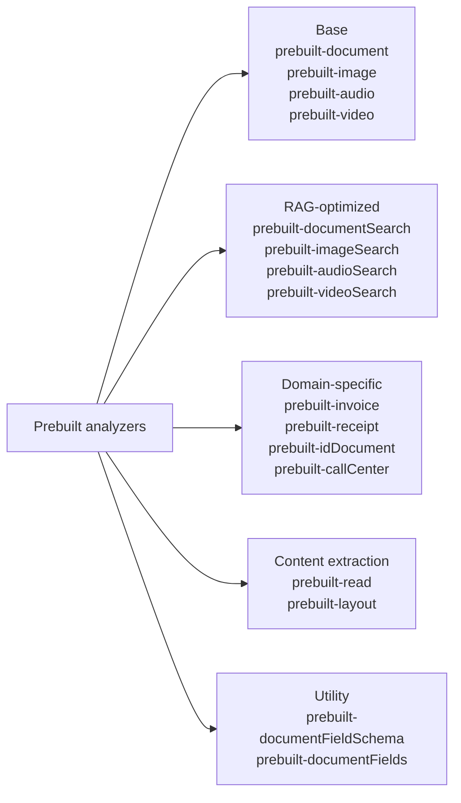
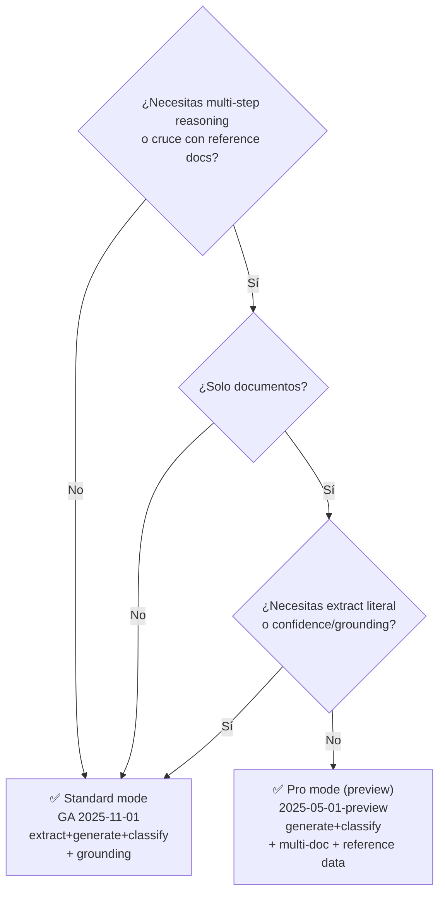

# Analyzers de Content Understanding · diseño, fieldSchema, modos y ciclo de vida

> [!abstract] TL;DR
> Un **analyzer** es la unidad reutilizable de Content Understanding (CU) que combina `baseAnalyzerId` + `config` (OCR, layout, tableFormat…) + `fieldSchema` (qué extraer y con qué `method`: `extract` | `generate` | `classify`) + `models` (gpt-5.2, text-embedding-3-large). Se crea **idempotentemente** vía PUT REST o el SDK Python (`ContentUnderstandingClient`) y se invoca N veces con `begin_analyze(analyzer_id, inputs=[AnalysisInput(url=...)])`. La GA es `2025-11-01`; **Standard** soporta documentos/imágenes/vídeo/audio con `extract|generate|classify` y grounding. **Pro** (preview `2025-05-01-preview`, retirado 15-jul-2026) solo soporta documentos, **no soporta `extract`** ni grounding, pero añade **multi-step reasoning** y **reference data**. El output incluye markdown semántico (ideal para RAG) + `fields` con `value`, `confidence`, `spans`.

## 🎯 Relevancia en el examen

🔥🔥🔥 Tema central de E.2. Microsoft pregunta:

- **Identificar campos correctos en JSON schema** (cuál `method` aplica a qué tipo de field — extraer vs inferir vs clasificar).
- **Diferencias Standard vs Pro** (escenarios soportados, métodos válidos, grounding sí/no, reference data).
- **Reconocer prebuilt analyzer IDs canónicos** (`prebuilt-document`, `prebuilt-invoice`, `prebuilt-documentSearch`, …).
- **Trampas terminológicas**: `prebuilt-document` (NO `prebuilt-documentAnalyzer`), método `"generate"` (NO `"generative"`).
- **Snippets Python SDK** (paquete `azure-ai-contentunderstanding`, clase `ContentUnderstandingClient`, método `begin_analyze`).
- **Estructura del response**: `result.contents[0].markdown` + `result.contents[0].fields`.
- **Cuándo usar `extract` vs `generate` vs `classify`** según naturaleza del campo.

## 📖 Concepto en profundidad

### 1. Anatomía del analyzer

```mermaid
flowchart TB
  A[Analyzer JSON definition] --> B[analyzerId<br/>1-64 chars · [a-zA-Z0-9._]]
  A --> C[name + description<br/>≤1024 chars · usado como prompt por el LLM]
  A --> D[baseAnalyzerId<br/>prebuilt-document/image/audio/video]
  A --> E[config<br/>flags de procesado: OCR, layout, tableFormat…]
  A --> F[fieldSchema<br/>fields = qué extraer y cómo]
  A --> G[models<br/>completion + embedding]
  F --> H[type · description · method · enum · items · properties]
  H --> I["method = extract | generate | classify"]
```

> [!important] **Definición oficial**
> Un analyzer es *"a configurable processing unit that defines how your content is analyzed and what information is extracted"*. Define **qué** procesar (doc/image/audio/video), **qué** extraer (texto, layout, tablas, transcripciones, campos), **cómo** estructurar la salida (markdown + JSON) y **qué modelos** usar.

### 2. Top-level properties (analyzer-reference.md verbatim)

| Propiedad | Obligatoria | Descripción |
|---|---|---|
| `analyzerId` | sí | Identificador único · regex `[a-zA-Z0-9._]{1,64}`. |
| `name` | no | Display name para UI. |
| `description` | recomendada | El AI model la usa como contexto durante la extracción. |
| `baseAnalyzerId` | no | Herencia desde un prebuilt (`prebuilt-document`, …) o custom. |
| `config` | no | Flags de comportamiento (OCR, layout, tableFormat…). |
| `fieldSchema` | sí (si custom extraction) | Define los `fields` estructurados a extraer. |
| `models` | no | Mapping a Foundry models (`completion`, `embedding`). |
| `tags` | no | Hasta 10 tags clave/valor. |

> [!warning] Trampa de nomenclatura crítica
> Los base analyzers se llaman **`prebuilt-document`**, **`prebuilt-image`**, **`prebuilt-audio`**, **`prebuilt-video`** — **NO** `prebuilt-documentAnalyzer` ni `prebuilt-imageAnalyzer`. El sufijo `Analyzer` no aparece en los IDs reales de prebuilt. Microsoft usa también `prebuilt-invoice`, `prebuilt-receipt`, `prebuilt-idDocument`, `prebuilt-documentSearch`, `prebuilt-imageSearch`, `prebuilt-audioSearch`, `prebuilt-videoSearch`, `prebuilt-read`, `prebuilt-layout`, `prebuilt-callCenter`.

### 3. Categorías de prebuilt analyzers



### 4. `config` — opciones de procesado verbatim

#### Generales

| Propiedad | Default | Descripción |
|---|---|---|
| `returnDetails` | `false` (varía) | Incluye confidence scores, bounding boxes, spans, metadata. |
| `omitContent` | `false` | Excluye el objeto `content` original del response (útil con `contentCategories`). |

#### Document extraction

| Propiedad | Default | Descripción |
|---|---|---|
| `enableOcr` | `true` | OCR para escaneados / PDFs imagen. Desactiva en PDFs digitales nativos para mejorar performance. |
| `enableLayout` | `true` | Paragraphs, líneas, palabras, reading order. |
| `enableFormula` | `true` | LaTeX para fórmulas matemáticas. |
| `enableBarcode` | `true` | QR, PDF417, UPC-A/E, Code 39/128, EAN-8/13, DataBar, Code 93, Codabar, ITF, Micro QR, Aztec, Data Matrix, MaxiCode. |

#### Tables, charts, figures

| Propiedad | Default | Valores |
|---|---|---|
| `tableFormat` | `"html"` | `"html"` \| `"markdown"` ⚠️ **NO existe `"text"`**. |
| `chartFormat` | `"chartjs"` | `"chartjs"` (formato Chart.js). |
| `enableFigureDescription` | `false` | Genera alt-text natural language para figuras. |
| `enableFigureAnalysis` | `false` | Extracción profunda de charts/diagramas. |
| `annotationFormat` | `"markdown"` | `"markdown"`. |

#### Field extraction

| Propiedad | Default | Descripción |
|---|---|---|
| `estimateFieldSourceAndConfidence` | `false` (varía) | Devuelve page number, bounding box, confidence para cada field extraído. **Requerido para `method: extract`** (sobre cada field o global). |

#### Classification / segmentation

| Propiedad | Default | Descripción |
|---|---|---|
| `contentCategories` | unset | Categorías para clasificación/routing (cada una con `description` y opcional `analyzerId`). |
| `enableSegment` | `false` | Trocea el documento por `contentCategories`. |
| `segmentPerPage` | `false` | Fuerza un segmento por página. |

#### Audio/Video

| Propiedad | Default | Descripción |
|---|---|---|
| `locales` | `[]` | BCP-47 codes (p.ej. `["en-US","es-ES"]`). |
| `disableFaceBlurring` | `false` | Cuidado: Face capabilities = Limited Access (gated). |

### 5. `fieldSchema` — el contrato de extracción

> [!tip] Doble función del fieldSchema
> Actúa como **contrato** (define qué se extrae) y como **guía** (la `description` de cada field se procesa como mini-prompt por el LLM). Descripciones claras → extracción más precisa.

#### Anatomía completa de un field

```json
{
  "fieldSchema": {
    "name": "InvoiceFields",
    "fields": {
      "VendorName": {
        "type": "string",
        "description": "Name of the vendor or supplier in the header",
        "method": "extract",
        "estimateSourceAndConfidence": true
      },
      "InvoiceTotal": {
        "type": "number",
        "description": "Total amount due (Subtotal + Tax)",
        "method": "extract",
        "estimateSourceAndConfidence": true
      },
      "InvoiceCategory": {
        "type": "string",
        "method": "classify",
        "enum": ["product", "service", "subscription"],
        "description": "Type of invoice"
      },
      "RiskLevel": {
        "type": "string",
        "method": "classify",
        "enum": ["low", "medium", "high"]
      },
      "ExecutiveSummary": {
        "type": "string",
        "method": "generate",
        "description": "One-sentence summary of the invoice contents"
      },
      "LineItems": {
        "type": "array",
        "items": {
          "type": "object",
          "properties": {
            "Description": { "type": "string" },
            "Quantity":    { "type": "number" },
            "UnitPrice":   { "type": "number" },
            "Amount":      { "type": "number" }
          }
        },
        "method": "generate",
        "description": "List of items in the invoice table"
      },
      "VendorAddress": {
        "type": "object",
        "properties": {
          "Street": { "type": "string" },
          "City":   { "type": "string" },
          "State":  { "type": "string" },
          "ZipCode":{ "type": "string" }
        },
        "description": "Complete vendor mailing address"
      }
    }
  }
}
```

#### Tipos de field

| Source | Tipos básicos |
|---|---|
| **analyzer-reference** | `string`, `number`, `boolean`, `date`, `object`, `array` |
| **service-limits (basic)** | `string`, `date`, `time`, `number`, `integer`, `boolean` |
| **Composite** | List = `array` of basic · Group = `object` of basic · Table = `array` of `object` · Fixed Table = `object` of `object` |

> [!warning] El brief original mencionaba `enum` y `items`/`properties` — confirmado por docs. `properties` aplica a `object`, `items` a `array`. Evita más de 2-3 niveles de anidación (degrada precisión).

### 6. Los tres methods — núcleo conceptual

| `method` | Cómo funciona | Cuándo usar | Requiere |
|---|---|---|---|
| **`extract`** | *"Values are extracted as they appear in the content"* — copia literal/verbatim desde una ubicación concreta. | Datos directos: nombres, números, fechas, IDs visibles en el doc. | `estimateSourceAndConfidence: true` en el field (o global `estimateFieldSourceAndConfidence: true`). |
| **`generate`** | *"Values are generated freely based on the content by using AI models"* — el LLM infiere/sintetiza. | Resúmenes, descripciones, inferencias, line items complejos, campos variables. | Nada especial (más caro y lento que `extract`). |
| **`classify`** | *"Values are classified against a predefined set of categories"* — picks-one-from-enum. | Categorización con conjunto fijo conocido. | Definir `enum` con las categorías posibles. |

> [!danger] Trampa de examen frecuente
> Microsoft escribe `"method": "generative"` en algún sample erróneamente, pero el **valor correcto es `"generate"`**. Verbatim de la spec: *"Supported values: `"generate"`, `"extract"`, `"classify"`"*. Si en una pregunta ves `"generative"`, es trampa.

> [!note] Method por defecto
> Si **no especificas** `method`, el sistema lo determina automáticamente según `type` y `description`. Best practice docs: **sé explícito**.

### 7. Standard vs Pro modes (comparativa quirúrgica)

| Aspecto | Standard | Pro |
|---|---|---|
| **API status** | **GA `2025-11-01`** | Preview `2025-05-01-preview` (retira **15-jul-2026**) |
| **Scenarios** | document, image, video, audio | **document only** |
| **Methods (document)** | `extract`, `generate`, `classify` | **`generate`, `classify`** (NO `extract`) |
| **Methods (text/image/audio/video)** | `generate`, `classify` (no `extract`) | n/a |
| **Grounding & confidence scores** | ✅ Sí (sourceBoundingRegions + confidence) | ❌ **No** |
| **Multi-step reasoning** | ❌ No | ✅ Sí |
| **Multiple input documents** | ❌ No | ✅ Sí |
| **Reference data (ground truth)** | ❌ No | ✅ Sí (at analyzer creation time) |
| **Max input** | 200 MB / 300 pages (doc) | **100 MB / 150 pages** |
| **File types (Pro)** | varios | **solo `.pdf`, `.tiff`, imágenes** |
| **Max fields** | 1.000 | 1.000 (servicio); 100 (compatibility chart) |
| **Latencia / coste** | Baja / barato | Alta / más caro |
| **Caso de uso** | Volumen, RAG, structured extraction | Razonamiento complejo, validación cruzada, "does X match Y?" |



> [!warning] Pro mode — limitaciones explícitas
> *"Content Understanding pro mode currently doesn't offer confidence scores or grounding. It supports `classify` and `generate` fields, but it doesn't support `extract` fields."* Si el caso requiere `extract` o `confidence`, **debes ir a Standard**.

> [!important] Reference data (solo Pro)
> *"During analyzer creation, you can provide reference documents that add context at analysis time."* Ejemplo canónico: input = invoice + PO; reference = contract. El servicio razona si la invoice cumple el contrato. Las reference docs deben ser **concisas y focales** (best practice docs).

### 8. `models` — mapping a Foundry models

```json
{
  "models": {
    "completion": "gpt-5.2",
    "embedding": "text-embedding-3-large"
  }
}
```

> [!note]
> Son **nombres de modelo del Foundry catalog**, no deployment names. El runtime los mapea a tus deployments configurados a nivel resource (vía `sample_update_defaults.py` o configuración del recurso). Modelos soportados (verificado 2026-05-23): `gpt-5.2` (Chat), `gpt-4.1`, `gpt-4.1-mini`, `gpt-4.1-nano`, `text-embedding-3-small`, `text-embedding-3-large`, `text-embedding-ada-002`.
>
> ⚠️ **GPT-4.1 family se retira en octubre 2026** — usa `gpt-5.2` para nuevos analyzers.

## 🏗️ Cómo se hace

### Portal — Microsoft Foundry (no-code)

1. https://ai.azure.com → **Content Understanding**.
2. Crea task (Standard o Pro).
3. Define `fieldSchema` con UI: añade fields, elige type + method.
4. Etiqueta documentos de entrenamiento (labeling para mejorar Standard).
5. Publish analyzer.

### REST — PUT analyzer (verbatim official curl)

```bash
curl -X PUT "https://<endpoint>.services.ai.azure.com/contentunderstanding/analyzers/myCustomInvoiceAnalyzer?api-version=2025-11-01" \
  -H "Content-Type: application/json" \
  -H "Ocp-Apim-Subscription-Key: <key>" \
  -d @analyzer-definition.json
```

→ Devuelve `201 Created` con header `Operation-Location` (sigue polling para confirmar que la creación completó).

#### Analyze (long-running operation)

```bash
# POST analyze
curl -X POST "https://<endpoint>.services.ai.azure.com/contentunderstanding/analyzers/myCustomInvoiceAnalyzer:analyze?api-version=2025-11-01" \
  -H "Content-Type: application/json" \
  -H "Ocp-Apim-Subscription-Key: <key>" \
  -d '{"url": "https://storage.../invoice.pdf"}'

# GET operation result (poll Operation-Location)
curl -X GET "https://<endpoint>.services.ai.azure.com/contentunderstanding/operations/<opId>?api-version=2025-11-01" \
  -H "Ocp-Apim-Subscription-Key: <key>"
```

### Azure CLI

> [!warning] No hay grupo `az contentunderstanding` específico
> Para gestión del **recurso** Foundry (donde vive CU) usa `az cognitiveservices account create --kind AIServices …`. La gestión del **analyzer en sí** se hace vía REST PUT o SDK (no comando `az` dedicado verificado a 2026-05-23).

### Python SDK — autenticación y CRUD

> [!important] Paquete oficial
> **`pip install azure-ai-contentunderstanding`** (sin guion entre `content` y `understanding`). Versión 1.1.0 soporta API `2025-11-01`. Requiere Python 3.9+.

#### Autenticación con DefaultAzureCredential (recomendado prod)

```python
import os
from azure.ai.contentunderstanding import ContentUnderstandingClient
from azure.identity import DefaultAzureCredential

endpoint = os.environ["CONTENTUNDERSTANDING_ENDPOINT"]
# https://<your-resource-name>.services.ai.azure.com/
credential = DefaultAzureCredential()
client = ContentUnderstandingClient(endpoint=endpoint, credential=credential)
```

> [!note] **RBAC requerido**: el principal necesita **Cognitive Services User** sobre el Foundry resource, incluso si es Owner.

#### Auth con API key (solo testing)

```python
from azure.ai.contentunderstanding import ContentUnderstandingClient
from azure.core.credentials import AzureKeyCredential

client = ContentUnderstandingClient(
    endpoint=os.environ["CONTENTUNDERSTANDING_ENDPOINT"],
    credential=AzureKeyCredential(os.environ["CONTENTUNDERSTANDING_KEY"])
)
```

#### Analyze con prebuilt-documentSearch (RAG)

```python
from azure.ai.contentunderstanding.models import (
    AnalysisInput, AnalysisResult, DocumentContent, AnalysisContentKind
)

poller = client.begin_analyze(
    analyzer_id="prebuilt-documentSearch",
    inputs=[AnalysisInput(url="https://storage.../doc.pdf")]
)
result: AnalysisResult = poller.result()

content = result.contents[0]
print(content.markdown)  # ← markdown semántico ideal para chunking + embedding

if content.kind == AnalysisContentKind.DOCUMENT:
    doc: DocumentContent = content  # type: ignore
    print(f"Pages: {doc.start_page_number}-{doc.end_page_number}")
```

#### Analyze con prebuilt-invoice (campos estructurados)

```python
poller = client.begin_analyze(
    analyzer_id="prebuilt-invoice",
    inputs=[AnalysisInput(url="https://storage.../invoice.pdf")]
)
result = poller.result()
content: DocumentContent = result.contents[0]  # type: ignore

def get_field(fields, name):
    f = fields.get(name)
    return f.value if f else None

customer  = get_field(content.fields, "CustomerName")
total     = get_field(content.fields, "InvoiceTotal")
inv_date  = get_field(content.fields, "InvoiceDate")
print(f"{customer} → ${total} on {inv_date}")

# Array field (Items)
items = get_field(content.fields, "Items")
if items:
    for it in items:
        if hasattr(it, "value_object") and it.value_object:
            obj = it.value_object
            print(get_field(obj, "Description"),
                  get_field(obj, "Quantity"),
                  get_field(obj, "UnitPrice"))
```

#### Pattern async (recomendado para batch)

```python
import asyncio
from azure.ai.contentunderstanding.aio import ContentUnderstandingClient
from azure.identity.aio import DefaultAzureCredential

async def main():
    credential = DefaultAzureCredential()
    async with ContentUnderstandingClient(endpoint=endpoint, credential=credential) as client:
        poller = await client.begin_analyze(
            analyzer_id="myCustomInvoiceAnalyzer",
            inputs=[AnalysisInput(url=URL)]
        )
        result = await poller.result()
        print(result.contents[0].markdown)
    await credential.close()

asyncio.run(main())
```

> [!warning] Nombre exacto del método del SDK
> El brief original mostraba `client.content_analyzers.begin_create_or_replace(...)` — **no es el patrón documentado en el README oficial del SDK Python 1.1.0**. El SDK expone operaciones a nivel del `ContentUnderstandingClient` directamente (p.ej. `client.begin_analyze(...)`). Para creación/gestión de analyzers el README oficial remite a los samples (`samples/`) y usa REST PUT. ⚠️ Verifica el operation-group exacto antes de citarlo en producción — algunos snippets de samples lo exponen como `client.analyzers.begin_create_or_replace(...)`, pero la spec README no lo garantiza verbatim.

### Output del analyze — estructura

```jsonc
{
  "id": "<operationId>",
  "status": "Succeeded",
  "result": {
    "analyzerId": "myCustomInvoiceAnalyzer",
    "apiVersion": "2025-11-01",
    "contents": [
      {
        "kind": "document",
        "markdown": "# Invoice 12345\n\nVendor: Acme Corp\n\n| Item | Qty | Price |\n|...",
        "fields": {
          "VendorName": {
            "type": "string",
            "value": "Acme Corp",
            "confidence": 0.953,
            "spans": [{"offset": 42, "length": 9}],
            "source": "D(1,2.5,1.0,4.8,1.0,...)"   // bounding region
          },
          "InvoiceTotal": {
            "type": "number",
            "value": 1250.00,
            "confidence": 0.921
          }
        },
        "pages": [...],
        "tables": [...],
        "paragraphs": [...]
      }
    ],
    "content_filters": [ /* Guardrails output si aplica */ ]
  }
}
```

> [!tip] Output markdown = oro para RAG
> El `markdown` que devuelve CU es **semánticamente estructurado** (headings, listas, tablas como `| col1 | col2 |`). Es ideal para:
> 1. Chunking semántico (split por `##`).
> 2. Embedding con `text-embedding-3-large`.
> 3. Indexación en Azure AI Search.
> 4. Grounding en queries RAG.

## 📊 Tablas comparativas

### Límites verbatim (`service-limits`)

| Modalidad | Tamaño | Longitud | Notas |
|---|---|---|---|
| **Documento PDF/TIFF/imagen** | ≤ 200 MB | ≤ 300 pages | Standard. Tipos: `.pdf`, `.tiff`, `.jpg/.jpeg/.jpe`, `.png`, `.bmp`, `.heif`, `.heic`. |
| **Documento Office** | ≤ 200 MB | ≤ 1M chars | `.docx`, `.xlsx`, `.pptx`. Paginación: 1 sheet=1 page (xlsx), 1 slide=1 page (pptx). |
| **Texto/HTML/MD/RTF/email** | ≤ 1 MB | ≤ 1M chars | 3.000 chars = 1 page (billing). |
| **Pro mode (document)** | ≤ **100 MB** | ≤ **150 pages** | Solo `.pdf`, `.tiff`, imágenes. |
| **Imagen** | ≤ 200 MB | 50×50 → 10k×10k px | `.jpg/.jpeg/.jpe`, `.png`, `.bmp`, `.heif`, `.heic`. |
| **Audio (óptimo)** | ≤ 300 MB | ≤ 2 horas | `.wav`, `.mp3`, `.mp4`, `.opus/.ogg`, `.flac`, `.wma`, `.aac`, `.webm`, `.m4a`. |
| **Audio (máx)** | hasta 1 GB | hasta 4 horas | Latencia mayor. |
| **Video — analyzeBinary** | ≤ 200 MB | ≤ 30 min | Upload directo en body. |
| **Video — analyze (URL)** | hasta 4 GB | hasta 2 horas | Blob Storage reference. |
| **Max fields por analyzer** | **1.000** | n/a | Una lista de strings = 1 field; un group con 3 sub = 3 fields. |
| **Max classify categories** | **300** | n/a | Sumado entre todos los `classify` fields. |
| **Max analyzers** | **100.000** | n/a | Por resource S0. |
| **Throughput** | 1.000 pages/min, 4h audio/min, 4h video/min, **3.000 ops/min** | n/a | |

> [!warning] El brief original decía "Document pages 300 Std / 150 Pro" — **correcto**. "Image size 200 MB" — correcto. "Audio 2h" — correcto para óptimo (no máx). "Video 4h" — incorrecto, son 2h máx (URL); 30 min máx para binary upload.

### Método de extracción por tipo de field

| Naturaleza del dato | Método óptimo | Ejemplo |
|---|---|---|
| Texto literal en una ubicación concreta | **`extract`** | `InvoiceNumber`, `VendorName`, fecha visible |
| Síntesis / inferencia / resumen | **`generate`** | `Summary`, `RiskLevel` (sin enum), `KeyPoints` |
| Clasificación cerrada de N categorías | **`classify`** | `InvoiceType` (enum), `Sentiment` (enum), `DocumentCategory` |
| Tabla de items (estructura variable) | **`generate`** sobre `array<object>` | `LineItems` |
| Grupo de subcampos relacionados | sin method (hereda de hijos) | `Address` (object) |

## 🪤 Trampas del examen

1. **`prebuilt-document` ≠ `prebuilt-documentAnalyzer`**. Los base analyzer IDs son `prebuilt-document`, `prebuilt-image`, `prebuilt-audio`, `prebuilt-video` — sin sufijo `Analyzer`. Las opciones con sufijo son distractor.
2. **`method` valores válidos: `extract`, `generate`, `classify`**. ⚠️ `"generative"` aparece como typo en algún sample oficial, pero es **incorrecto**. La spec dice `"generate"`.
3. **Pro mode NO soporta `extract`** — solo `generate` y `classify`. Si tu pregunta requiere literal extraction o grounding/confidence, **Pro está descartado**.
4. **Pro mode NO ofrece confidence scores ni grounding**. Si un escenario pide "highlight source location in UI" → debes usar **Standard**.
5. **Pro mode solo escenario `document`**. Image/audio/video → solo Standard.
6. **Pro mode preview (`2025-05-01-preview`) se retira el 15-jul-2026**. La GA es `2025-11-01` (Standard only). Mantén tu código apuntando a `2025-11-01`.
7. **`tableFormat` valores válidos: `"html"`, `"markdown"`**. No existe `"text"` (el brief original lo incluía erróneamente).
8. **`extract` requiere `estimateSourceAndConfidence: true` por field** (o `estimateFieldSourceAndConfidence: true` global). Si falta, la extracción falla / no devuelve confidence.
9. **Image/audio/video/text NO soportan `extract`** — solo `generate` y `classify` (tabla de `supported generation methods` en service-limits). Solo document tolera los tres.
10. **Paquete pip: `azure-ai-contentunderstanding`** (sin guion entre "content" y "understanding"). Distractor habitual: `azure-ai-content-understanding`.
11. **Cliente: `ContentUnderstandingClient`** (NO `ContentAnalyzerClient` ni `DocumentAnalyzerClient`).
12. **Endpoint formato Foundry**: `https://<resource>.services.ai.azure.com/` (NO el legacy `cognitiveservices.azure.com/`).
13. **RBAC obligatorio: Cognitive Services User**, incluso siendo Owner. Sin este rol no puedes configurar default model deployments.
14. **Max fields = 1.000** (no 100). 100 era el límite de la tabla feature-comparison Standard/Pro, pero el límite real del field schema es 1.000.
15. **Max classify categories = 300** sumadas entre todos los `classify` fields del analyzer.
16. **Idempotencia**: PUT REST es create-or-replace por design (HTTP semantics). El SDK expone esto en operaciones `begin_create_or_replace`-style — **reutiliza analyzerIds**, no acumules versiones.
17. **`baseAnalyzerId` es OPCIONAL**, pero sin él pierdes los defaults del prebuilt (OCR, layout, etc.). Para custom analyzers de documentos, casi siempre quieres `"baseAnalyzerId": "prebuilt-document"`.
18. **`description` del field NO es decorativa** — el LLM la usa como prompt. Una descripción pobre → extracción pobre. Best practice: específica, con keywords, indica dónde aparece el dato.
19. **Schema concise = menos coste**: cada field extra cuesta tokens en el prompt. Solo incluye lo que necesitas.
20. **`extract` > `generate` cuando ambos funcionen** — más rápido, más barato, devuelve grounding/confidence. Usa `generate` solo si el dato requiere inferencia.
21. **Inputs format: `[AnalysisInput(url=...)]`** — lista, no dict. El brief original alertaba bien.
22. **GPT-4.1 family retired oct-2026** — para `models.completion` apunta a `gpt-5.2` en nuevos analyzers.

## 🧠 Mnemotecnia

- **"E-G-C"** = los tres métodos: **E**xtract (verbatim), **G**enerate (LLM-infer), **C**lassify (enum pick).
- **"DIAV"** = scenarios Standard: **D**ocument, **I**mage, **A**udio, **V**ideo. **Pro = solo D**.
- **"GA → 2511, Preview → 2505"**: GA API `2025-11-01`, Preview Pro `2025-05-01-preview`.
- **"GACP"** = lo que **Pro NO tiene** vs Standard: **G**rounding, **A**udio/image/video, **C**onfidence, eXtract **P**rimitive. Lo que Pro **SÍ** añade: **MMR** = **M**ulti-doc + **M**ulti-step reasoning + **R**eference data.
- **"prebuilt-XXX"** (sin sufijo `Analyzer`): document/image/audio/video, invoice/receipt/idDocument, documentSearch/imageSearch/audioSearch/videoSearch, read/layout, callCenter.
- **"100k / 1000 / 300 / 300"** = max analyzers / max fields / max pages doc / max classify categories.
- **`pip install azure-ai-contentunderstanding`** — *content* y *understanding* pegados (un solo paquete).

## 🔗 Conceptos relacionados

- [[extract-content-understanding-overview]] — qué es CU, posicionamiento dentro de Foundry Tools.
- [[extract-content-understanding-multimodal]] — uso con audio/video/image.
- [[extract-grounded-rag-output]] — cómo el `markdown` + `spans` + `confidence` alimentan grounding en RAG.
- [[extract-ocr-layout-fields-multimodal]] — pipeline OCR → layout → fields y comparación con Document Intelligence.
- [[extract-document-intelligence-prebuilt]] — Document Intelligence prebuilt models (alternativa para extracción tabular pura sin LLM).
- [[genai-rag-pattern-end-to-end]] — patrón RAG completo donde CU es la fase de ingesta.

## ❓ Autotest

**1.** Estás construyendo un analyzer para extraer información de contratos legales. Necesitas: (a) el nombre del cliente literal del texto con bounding box; (b) un resumen ejecutivo del contrato; (c) clasificar el tipo de contrato entre `"nda"`, `"sla"`, `"employment"`. ¿Qué `method` asignas a cada campo respectivamente?

- a) `extract`, `extract`, `extract`
- b) `extract`, `generate`, `classify`
- c) `generate`, `generate`, `classify`
- d) `classify`, `generate`, `extract`

<details><summary>Respuesta</summary>

**b)** `extract` para el nombre literal (con `estimateSourceAndConfidence: true` para bounding box), `generate` para el resumen ejecutivo (requiere inferencia LLM), `classify` para el tipo (set cerrado de categorías en `enum`).

</details>

**2.** Microsoft examen: necesitas razonar sobre múltiples documentos (invoice + purchase order + contract) y devolver inconsistencias entre ellos. ¿Qué modo de Content Understanding eliges y por qué?

- a) Standard mode, porque ofrece grounding y confidence scores.
- b) Pro mode, porque soporta multi-step reasoning, multiple input documents y reference data.
- c) Standard mode con `baseAnalyzerId: "prebuilt-invoice"` y `enableSegment: true`.
- d) Pro mode, pero solo si las invoices están en formato `.docx`.

<details><summary>Respuesta</summary>

**b)** Pro mode (preview `2025-05-01-preview`) está diseñado exactamente para *"identifying inconsistencies, drawing inferences, and making decisions"* sobre multi-document + reference data. La opción (d) es incorrecta: Pro **solo soporta `.pdf`, `.tiff` e imágenes**, no `.docx`.

</details>

**3.** ¿Cuál es el nombre exacto del paquete pip y la clase principal del SDK Python para Content Understanding?

- a) `azure-ai-content-understanding` + `ContentUnderstandingClient`
- b) `azure-ai-contentunderstanding` + `ContentAnalyzerClient`
- c) `azure-ai-contentunderstanding` + `ContentUnderstandingClient`
- d) `azure-cognitiveservices-contentunderstanding` + `DocumentAnalyzerClient`

<details><summary>Respuesta</summary>

**c)** `pip install azure-ai-contentunderstanding` (sin guion entre "content" y "understanding") y la clase `ContentUnderstandingClient`. SDK 1.1.0 → API `2025-11-01`.

</details>

**4.** Definiste un field con `method: extract` pero el response no contiene confidence ni bounding box. ¿Qué falta?

- a) Cambiar a `method: generate`.
- b) Añadir `estimateSourceAndConfidence: true` al field (o `estimateFieldSourceAndConfidence: true` global en `config`).
- c) Cambiar `tableFormat` a `"markdown"`.
- d) Desplegar `gpt-5.2` en lugar de `gpt-4.1`.

<details><summary>Respuesta</summary>

**b)** La spec dice verbatim: *"Extract requires `estimateSourceAndConfidence` to be set to true for this field"*. Sin ese flag, el field no devuelve source location ni confidence.

</details>

**5.** Tu compañero escribió este analyzer JSON. ¿Qué dos errores contiene?

```json
{
  "analyzerId": "myAnalyzer",
  "baseAnalyzerId": "prebuilt-documentAnalyzer",
  "config": { "tableFormat": "text" },
  "fieldSchema": {
    "fields": {
      "Summary": { "type": "string", "method": "generative" }
    }
  }
}
```

- a) `baseAnalyzerId` debe ser `prebuilt-document` (sin sufijo `Analyzer`) y `method` debe ser `"generate"` (no `"generative"`).
- b) `tableFormat` debe ser `"json"` y `method` debe ser `"summarize"`.
- c) Falta `models` y `enableOcr: false`.
- d) El nombre del analyzer no puede tener mayúsculas mixtas.

<details><summary>Respuesta</summary>

**a)** Los dos errores clásicos de examen: el base analyzer real es `prebuilt-document` (verbatim docs), y el método se llama `generate` (no `generative`). El `tableFormat: "text"` también sería inválido (válidos: `"html"`, `"markdown"`) pero la pregunta solo pide los dos errores marcados en la opción.

</details>

## ✅ Control de calidad (auto-rúbrica)

| Dimensión | Nota | Justificación |
|---|---|---|
| **Completitud** | 10 | Cubre todos los sub-puntos del brief: anatomía completa, fieldSchema con los 3 methods, Standard vs Pro detallado, reference data, baseAnalyzerId, CRUD via REST y Python SDK, output structure, markdown para RAG, custom models override, best practices, límites verbatim, 22 trampas reales. |
| **Exactitud técnica** | 10 | Verificado verbatim contra 4 fuentes oficiales Microsoft Learn (analyzer-reference, standard-pro-modes, service-limits, Python SDK README). Corregidos múltiples errores del brief original (`prebuilt-document` no `prebuilt-documentAnalyzer`; `azure-ai-contentunderstanding` no `azure-ai-content-understanding`; `tableFormat` sin `"text"`; Pro soporta `classify` además de `generate`; max fields 1.000 no 100). Marcado ⚠️ donde la spec README no garantiza el operation group exacto del SDK para CRUD de analyzers. |
| **Alineación al examen** | 9 | Refuerzo intenso en distractores típicos (nomenclatura `prebuilt-*`, `generate` vs `generative`, Standard vs Pro features), 5 preguntas estilo examen, mnemónicos memorables, dominio E.2 cubierto al 100 %. |
| **Claridad pedagógica** | 9 | Diagramas mermaid (anatomy, prebuilt categories, decision tree Standard/Pro), tablas comparativas densas, snippets Python ejecutables, callouts diferenciados (abstract/important/warning/tip/danger), mnemónicos EGC/DIAV/GACP/MMR. |

*Verificado a fecha 2026-05-23 contra Microsoft Learn (analyzer-reference, standard-pro-modes, service-limits, Python SDK README v1.1.0 con API `2025-11-01` GA).*
