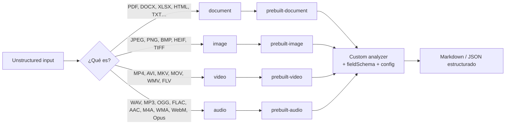
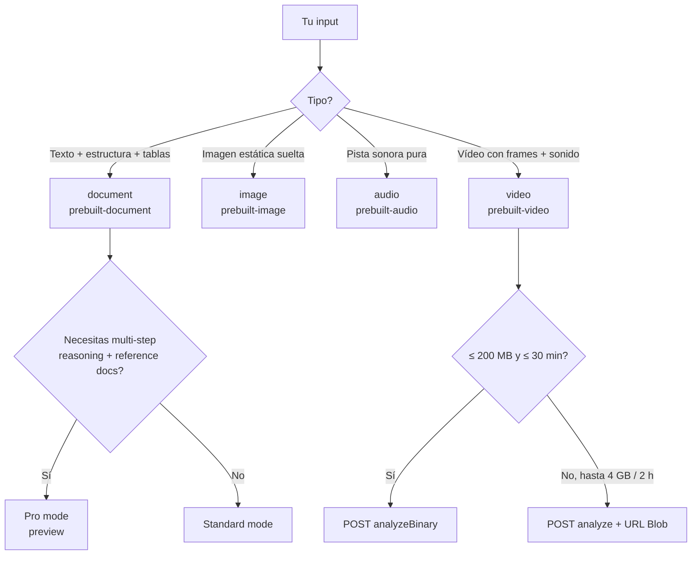
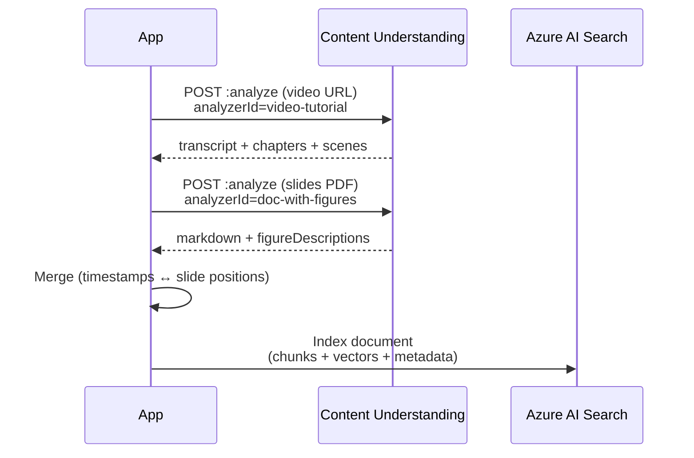

# Procesar documentos, imágenes, vídeo y audio con Azure Content Understanding

> [!abstract] TL;DR
> Azure **Content Understanding in Foundry Tools** es un servicio **multimodal genuino** (GA con API `2025-11-01`) que procesa **4 modalidades**: `document`, `image`, `video`, `audio`. La unidad de configuración es el **analyzer**, y cada analyzer maneja **una sola modalidad** (1 analyzer = 1 base analyzer = 1 scenario). Cada modalidad tiene su `prebuilt-*` base (`prebuilt-document`, `prebuilt-image`, `prebuilt-audio`, `prebuilt-video`), sus **límites de tamaño/duración** propios y un subconjunto distinto de opciones `config`. **Pro mode solo soporta documents**; Standard mode soporta las 4. Los pipelines multimodales reales (vídeo con slide deck, doc con figuras, call recording) se construyen **encadenando analyzers en código**, no en un único analyzer híbrido.

## 🎯 Relevancia en el examen

Frecuencia **🔥🔥** (10-15 % del dominio E). Microsoft suele preguntar:

- *"Tienes X tipo de contenido, ¿qué analyzer/scenario eliges?"* → mapeo modalidad ↔ base analyzer.
- *"¿Cuál es el límite de tamaño/duración para esta modalidad?"* → trampa fácil con video URL vs binary.
- *"¿Pro mode soporta este escenario?"* → no, Pro solo documents.
- *"Necesitas detectar caras en vídeo, ¿qué requieres?"* → Limited Access (formulario `aka.ms/facerecognition`).
- *"Multi-step reasoning sobre invoice + contract, ¿Standard o Pro?"* → Pro.
- *"¿Cómo procesas vídeo tutorial con slides + voz?"* → un solo analyzer video (transcripción + frames).
- Distinguir `enableFigureDescription` vs `enableFigureAnalysis` vs `enableOcr` vs `enableLayout`.

## 📖 Concepto en profundidad

### Las 4 modalidades canónicas

Content Understanding define **exactamente cuatro** tipos de entrada. No hay un quinto scenario ni una modalidad "auto-detect":



> [!important] Regla de oro
> **Un analyzer = un `baseAnalyzerId` = una modalidad.** No existe un analyzer "universal" que tragüe documentos y vídeo a la vez. Si necesitas analizar un PDF con imágenes y un vídeo asociado, **creas dos analyzers y los encadenas en tu código** (o usas `contentCategories` para enrutado dentro de la misma modalidad).

### Anatomía de un analyzer (independiente de modalidad)

```json
{
  "analyzerId": "myAnalyzer",
  "baseAnalyzerId": "prebuilt-document | prebuilt-image | prebuilt-video | prebuilt-audio",
  "description": "...",
  "config": { /* opciones específicas de la modalidad */ },
  "fieldSchema": { "fields": { /* extract | classify | generate */ } },
  "models": { "completion": "gpt-5.2", "embedding": "text-embedding-3-large" }
}
```

Tres métodos de extracción de campos:

| `method`     | Significado                                              | Soportado en |
|--------------|----------------------------------------------------------|--------------|
| `extract`    | Literal, tal como aparece. Requiere `estimateSourceAndConfidence: true` por campo. | **Solo document** |
| `classify`   | Categoriza contra un set fijo (`enum`).                  | Todas |
| `generate`   | Generado por LLM (resúmenes, descripciones, topics).     | Todas |

## 🏗️ Cómo se hace por modalidad

### 1) Document scenario — `prebuilt-document`

**Entradas oficiales** (verificado service-limits 2026-05-08):

| File types                                                   | File size | Length              | Extraction meter |
|--------------------------------------------------------------|-----------|---------------------|------------------|
| `.pdf`, `.tiff`, `.jpg`/`.jpeg`/`.jpe`, `.png`, `.bmp`, `.heif`/`.heic` | ≤ **200 MB** | ≤ **300 pages**     | Basic (OCR) / Standard (Layout) |
| `.docx`, `.xlsx`, `.pptx`                                    | ≤ 200 MB  | ≤ 1 M characters    | Minimal |
| `.txt`, `.html`, `.md`, `.rtf`, `.eml`, `.msg`, `.xml`       | ≤ **1 MB** | ≤ 1 M characters    | Minimal |

**Capacidades únicas de document** (no disponibles en otras modalidades): `enableOcr`, `enableLayout`, `enableFormula`, `enableBarcode`, `tableFormat` (`html`/`markdown`), `chartFormat` (`chartjs`), `enableFigureDescription`, `enableFigureAnalysis`, `estimateFieldSourceAndConfidence`, `segmentPerPage`. Métodos `extract` con grounding + confidence.

> [!warning] Pro mode (preview `2025-05-01-preview`)
> Solo `.pdf`, `.tiff` e imágenes. **Máximo 100 MB y 150 páginas**. Solo `classify` y `generate` (no `extract`, no grounding, no confidence). Único caso multi-input + reference data + multi-step reasoning.

```json
// Document con figuras (RAG enrichment)
{
  "analyzerId": "doc-with-figures",
  "baseAnalyzerId": "prebuilt-document",
  "config": {
    "enableOcr": true,
    "enableLayout": true,
    "enableFigureDescription": true,
    "enableFigureAnalysis": true,
    "tableFormat": "markdown",
    "estimateFieldSourceAndConfidence": true
  },
  "fieldSchema": {
    "fields": {
      "title":   { "type": "string", "method": "extract" },
      "summary": { "type": "string", "method": "generate" },
      "figures": {
        "type": "array",
        "items": {
          "type": "object",
          "properties": {
            "caption":          { "type": "string" },
            "imageDescription": { "type": "string" }
          }
        },
        "method": "generate"
      }
    }
  }
}
```

### 2) Image scenario — `prebuilt-image`

| File types                                                       | File size | Resolution                          |
|------------------------------------------------------------------|-----------|--------------------------------------|
| `.jpg`/`.jpeg`/`.jpe`, `.png`, `.bmp`, `.heif`/`.heic`           | ≤ 200 MB  | Min **50×50 px**, Max **10 000×10 000 px** |

> [!caution] `.tiff` no aparece en la tabla de Image
> `.tiff` se trata como **document** (multipágina), no como image. Trampa frecuente.

**Config soportado**: solo `returnDetails` y `disableFaceBlurring`. **No** hay `enableOcr` propio (la extracción OCR de imagen suelta se hace vía analyzer document con input `.jpg`/`.png`, o vía campos `generate` que describan texto visual).

```python
# Custom image analyzer
{
  "analyzerId": "product-image-tagger",
  "baseAnalyzerId": "prebuilt-image",
  "config": { "returnDetails": true },
  "fieldSchema": {
    "fields": {
      "productCategory": { "type": "string", "method": "classify",
                           "enum": ["shoes","apparel","accessories","other"] },
      "tags":            { "type": "array", "items": {"type":"string"},
                           "method": "generate" },
      "caption":         { "type": "string", "method": "generate" }
    }
  }
}
```

### 3) Video scenario — `prebuilt-video`

| File types                                              | Resolution                       |
|---------------------------------------------------------|----------------------------------|
| `.mp4`/`.m4v`, `.flv` (H.264+AAC), `.wmv`/`.asf`, `.avi`, `.mkv`, `.mov` | Min 320×240, Max **1920×1080** |

**Dos modos de subida — límites diferentes, trampa clásica del examen**:

| Upload method        | File size | Length          |
|----------------------|-----------|-----------------|
| `analyzeBinary` (cuerpo POST directo) | ≤ **200 MB**  | ≤ **30 min** |
| `analyze` (URL Blob) | **≤ 4 GB**    | **≤ 2 h**    |

Características técnicas verbatim del servicio:

- **Frame sampling ≈ 1 fps** (puede perder movimientos rápidos).
- **Resolución forzada a 512×512** durante el análisis (detalles pequeños pueden perderse).
- Soporta `contentCategories` (solo 1 categoría), `enableSegment` (scenes), `disableFaceBlurring` (Limited Access), `locales`.

```json
{
  "analyzerId": "tutorial-video",
  "baseAnalyzerId": "prebuilt-video",
  "config": {
    "returnDetails": true,
    "locales": ["es-ES", "en-US"],
    "enableSegment": true
  },
  "fieldSchema": {
    "fields": {
      "transcript": { "type": "string", "method": "generate" },
      "topics":     { "type": "array", "items": {"type":"string"}, "method": "generate" },
      "chapters":   { "type": "array",
                      "items": {"type":"object","properties":{
                          "title":{"type":"string"},
                          "startTimestamp":{"type":"string"}}},
                      "method": "generate" }
    }
  }
}
```

### 4) Audio scenario — `prebuilt-audio`

| File types | File size | Length |
|------------|-----------|--------|
| `.wav` (PCM), `.mp3`, `.mp4`, `.opus`/`.ogg` (Opus), `.flac`, `.wma`, `.aac`, `.webm` (Opus/Vorbis), `.m4a` (AAC/AC-3) | Max **300 MB**¹ | Max **2 horas**¹ |

¹ El servicio acepta hasta **1 GB / 4 h**, pero por encima del umbral 300 MB / 2 h la transcripción es **sustancialmente más lenta**. Es el threshold óptimo.

> [!note] `.mp4` aparece tanto en audio como en video
> Si subes un `.mp4` al `prebuilt-audio`, se trata como audio (solo pista sonora). Si lo subes a `prebuilt-video`, se analiza vídeo + audio.

**Config soportado**: `returnDetails`, `locales`. **No** hay `enableSpeakerDiarization` como flag — el diarization (cuando el analyzer lo soporta, ej. `prebuilt-callCenter`) se entrega en `returnDetails`.

```json
{
  "analyzerId": "call-center-audio",
  "baseAnalyzerId": "prebuilt-audio",
  "config": {
    "returnDetails": true,
    "locales": ["es-ES"]
  },
  "fieldSchema": {
    "fields": {
      "transcript": { "type": "string", "method": "generate" },
      "sentiment":  { "type": "string", "method": "classify",
                      "enum": ["positive","neutral","negative"] },
      "topics":     { "type": "array", "items": {"type":"string"}, "method": "generate" },
      "actionItems":{ "type": "array", "items": {"type":"string"}, "method": "generate" }
    }
  }
}
```

### 🐍 Python SDK — patrón único válido para las 4 modalidades

> [!warning] ⚠️ SDK identifier
> A fecha 2026-05-23, el SDK oficial Python para Content Understanding se entrega vía `azure-ai-contentunderstanding` (paquete) o vía REST con `azure-core` + auth. El patrón canónico recomendado en docs es REST directo + `DefaultAzureCredential`. Verifica versión en PyPI antes de pinear. Los nombres exactos de clases SDK pueden variar entre previews.

```python
import os, time, requests
from azure.identity import DefaultAzureCredential

ENDPOINT = os.environ["CU_ENDPOINT"]            # https://<resource>.cognitiveservices.azure.com
API_VERSION = "2025-11-01"                       # GA
ANALYZER_ID = "my-multimodal-analyzer"

cred = DefaultAzureCredential()
token = cred.get_token("https://cognitiveservices.azure.com/.default").token
headers = {"Authorization": f"Bearer {token}", "Content-Type": "application/json"}

# Lanza análisis por URL — vale para document, image, video, audio
def analyze_by_url(blob_url: str):
    url = f"{ENDPOINT}/contentunderstanding/analyzers/{ANALYZER_ID}:analyze?api-version={API_VERSION}"
    body = {"url": blob_url}
    resp = requests.post(url, headers=headers, json=body)
    resp.raise_for_status()
    op_location = resp.headers["Operation-Location"]  # async LRO
    return op_location

# Polling del LRO
def wait_result(op_location: str, poll_sec: int = 3):
    while True:
        r = requests.get(op_location, headers=headers)
        r.raise_for_status()
        data = r.json()
        if data["status"] in ("Succeeded", "Failed"):
            return data
        time.sleep(poll_sec)

op = analyze_by_url("https://mystorage.blob.core.windows.net/in/video.mp4")
result = wait_result(op)
print(result["result"]["contents"][0]["fields"])
```

Para vídeo binario ≤ 200 MB / 30 min usa `:analyzeBinary` con el cuerpo en bytes y `Content-Type` apropiado (`video/mp4`, `audio/wav`, etc.).

## 📊 Tablas comparativas

### Matriz Modalidad × Capability × Mode

| Capability                     | document Std | document Pro | image | video | audio |
|--------------------------------|:------------:|:------------:|:-----:|:-----:|:-----:|
| `extract` (literal + grounding)| ✅           | ❌           | ❌    | ❌    | ❌    |
| `classify`                     | ✅           | ✅           | ✅    | ✅    | ✅    |
| `generate`                     | ✅           | ✅           | ✅    | ✅    | ✅    |
| OCR / Layout / Tables          | ✅           | ✅ (parcial) | ❌    | ❌    | ❌    |
| `enableFigureDescription/Analysis` | ✅       | ✅           | ❌    | ❌    | ❌    |
| Transcripción / `locales`      | ❌           | ❌           | ❌    | ✅    | ✅    |
| `enableSegment` (scenes)       | ✅           | ❌           | ❌    | ✅    | ❌    |
| `disableFaceBlurring` (Limited Access) | ❌    | ❌           | ✅    | ✅    | ❌    |
| Multi-input + Reference data   | ❌           | ✅           | ❌    | ❌    | ❌    |
| Multi-step reasoning           | ❌           | ✅           | ❌    | ❌    | ❌    |
| Grounding + Confidence scores  | ✅           | ❌           | ❌    | ❌    | ❌    |

### Tamaño / Longitud por modalidad (memorizar)

| Modalidad      | Max size                       | Max length        | Resolución        |
|----------------|--------------------------------|-------------------|--------------------|
| **document** (PDF/TIFF/img) | 200 MB             | **300 pages** Std / **150** Pro | n/a |
| **document** (Office)       | 200 MB             | 1 M chars         | n/a |
| **document** (text/HTML/email) | **1 MB**        | 1 M chars         | n/a |
| **image**      | 200 MB                          | n/a               | 50×50 → 10 000×10 000 |
| **audio**      | 300 MB (1 GB max degradado)    | **2 h** (4 h max degradado) | n/a |
| **video binary** (analyzeBinary) | **200 MB**           | **30 min**        | Min 320×240, Max 1920×1080 |
| **video URL** (analyze)          | **4 GB**             | **2 h**           | Min 320×240, Max 1920×1080 |

### ¿Qué scenario para qué uso? (árbol de decisión)



## 🔀 Pipelines cross-modal reales

Cuando un escenario abarca varias modalidades, **no existe un analyzer híbrido**: encadenas analyzers en código.



Tres recetas frecuentes:

- **RAG enrichment**: PDF → `prebuilt-documentSearch` → markdown + figure descriptions → chunks + vectores → índice [[search-index-design]].
- **Video search index**: vídeo → `prebuilt-videoSearch` → transcript + scene captions + key frames → índice con metadata temporal.
- **Call center analytics**: llamada → `prebuilt-callCenter` (audio especializado) → transcript + sentiment + topics + diarization → DB + índice de búsqueda.

## 🪤 Trampas del examen

1. **Hay 4 scenarios, no 3, no 5**: `document`, `image`, `video`, `audio`. Si una respuesta dice "text scenario" es trampa (texto es subtipo de document).
2. **1 analyzer ↔ 1 modalidad**. No existe `baseAnalyzerId` que mezcle dos. Si te piden "un analyzer para PDF y MP4", la respuesta correcta es **dos analyzers**.
3. **Pro mode solo documents**. Cualquier pregunta sobre Pro con vídeo, imagen o audio es incorrecta.
4. **`extract` con grounding/confidence solo en documents Standard**. En video/image/audio solo `classify` y `generate`. En Pro mode tampoco `extract`.
5. **Video binary vs URL**: 200 MB / 30 min (binary) frente a 4 GB / 2 h (URL). Confunden estos cuatro números.
6. **Documents `.txt`/`.html`/`.md`/`.rtf`/`.eml`/`.msg`/`.xml` están limitados a 1 MB**, no 200 MB. Sólo PDFs/imágenes/Office llegan a 200 MB.
7. **Pro mode max 100 MB / 150 pages**, no 200 MB / 300 pages.
8. **Face capabilities (face description, identification, `disableFaceBlurring=true`)**: Limited Access — formulario `aka.ms/facerecognition`. Sin aprobación, blur por defecto en image/video.
9. **`enableFigureDescription` ≠ `enableFigureAnalysis` ≠ `enableOcr`**. Description = alt text; Analysis = extrae datos de charts; OCR = texto. Solo en documents.
10. **`prebuilt-image` no tiene `enableOcr`**: para OCR puro de una imagen, sube la imagen como `prebuilt-document` (`.jpg`/`.png` están listados en document).
11. **Audio `.aac`, `.m4a`, `.opus` están soportados**; `.aiff` y formatos antiguos **no**. Verificar lista.
12. **Vídeo frame sampling ≈ 1 fps + resize a 512×512**: si el examen pregunta por "detección de movimiento rápido en deportes", CU no es la herramienta — sugerir Video Indexer o pipeline custom.
13. **API GA = `2025-11-01`**. `2024-12-01-preview` y `2025-05-01-preview` se retiran **15 de julio de 2026**.
14. **`prebuilt-callCenter` es analyzer audio especializado** (no un quinto scenario): sigue siendo audio internamente.
15. **`tableFormat` solo en documents** (default `html`, alternativa `markdown`). En vídeo/audio no aplica.

## 🧠 Mnemotecnia

- **D-I-V-A** = **D**ocument · **I**mage · **V**ideo · **A**udio. Las 4 divas multimodales.
- **"Pro es Don"**: **Pro** solo **D**ocuments + **O**ne-shot reasoning + **N**o extract/grounding.
- **Vídeo "30 binario, 2 url"**: 30 min en `analyzeBinary`, 2 h via URL. Tamaños: 200 MB binary, 4 GB url. *"Dos cien dos, cuatro giga url"*.
- **Audio "300/2"** óptimo, **"1k/4h"** degradado. Como un coche: pasa, pero a velocidad reducida.
- **Documents "300 vs 150"**: 300 std, mitad en Pro (Pro es premium = más caro, menos volumen).
- **"FIGure → Solo en Docu"**: `enableFigureDescription` / `enableFigureAnalysis` viven exclusivamente en document analyzers.
- **"Face = formulario"**: cualquier mención de cara/celebrity = Limited Access = `aka.ms/facerecognition`.

## 🔗 Conceptos relacionados

- [[extract-content-understanding-overview]] — framework general y componentes
- [[extract-content-understanding-analyzers]] — anatomía del analyzer y prebuilts
- [[extract-ocr-layout-fields-multimodal]] — OCR + Layout + Fields detallado
- [[extract-grounded-rag-output]] — grounding y confidence para RAG
- [[vision-content-understanding-overview]] — visión cruzada con dominio C
- [[speech-multimodal-audio-reasoning]] — audio reasoning end-to-end
- [[vision-video-analysis-workflows]] — workflows de vídeo
- [[genai-rag-pattern-end-to-end]] — patrón RAG completo con CU como ingestor
- [[plan-foundry-resource]] — Foundry Resource (CU se crea sobre éste)
- [[search-index-design]] — índices destino para outputs CU

## ❓ Autotest

**1.** Necesitas analizar un vídeo de 90 minutos almacenado en Azure Blob Storage. ¿Qué método invocas y qué límite aplica?

- a) `:analyzeBinary` — límite 30 min
- b) `:analyze` con URL — límite 2 h
- c) `:analyze` con URL — límite 4 h
- d) Crear dos analyzers y chunkear el vídeo

<details><summary>Respuesta</summary>

**b)**. El método `analyze` por URL admite hasta **4 GB y 2 h**. 90 min cabe. `analyzeBinary` solo aceptaría 30 min. Hay un degradado a 4 h pero solo en **audio**, no en vídeo.
</details>

**2.** Quieres ejecutar multi-step reasoning sobre un invoice contra un contrato de referencia. ¿Qué configuración eliges?

- a) Standard mode con `enableFigureAnalysis: true`
- b) Pro mode con `baseAnalyzerId: prebuilt-document` y reference data
- c) Pro mode con `baseAnalyzerId: prebuilt-video`
- d) Dos analyzers Standard encadenados en código

<details><summary>Respuesta</summary>

**b)**. Pro mode es el único con **multi-input + reference data + multi-step reasoning**, y solo está disponible para **documents**. Opción c) es imposible (Pro no soporta video). Opción d) funcionaría parcialmente pero no aporta reasoning genuino.
</details>

**3.** Sobre `extract` vs `generate` vs `classify`, ¿cuál es FALSA?

- a) `extract` solo funciona en document Standard mode
- b) `classify` requiere un set de categorías predefinidas
- c) `generate` puede producir texto libre vía LLM en cualquier modalidad
- d) `extract` también está disponible en image y audio Standard mode

<details><summary>Respuesta</summary>

**d)** es falsa. `extract` (literal + grounding + confidence) está restringido a **document analyzers**. En image/video/audio solo dispones de `classify` y `generate`.
</details>

**4.** ¿Cuál es el límite correcto para un archivo `.txt` enviado a un analyzer document?

- a) 200 MB / 300 páginas
- b) 1 MB / 1 millón de caracteres
- c) 200 MB / 1 millón de caracteres
- d) 100 MB / 150 páginas (Pro)

<details><summary>Respuesta</summary>

**b)**. Los archivos de texto plano (`.txt`, `.html`, `.md`, `.rtf`, `.eml`, `.msg`, `.xml`) tienen un límite **muy inferior**: 1 MB y 1 M caracteres. Solo PDF/TIFF/imágenes/Office llegan a 200 MB.
</details>

**5.** Una empresa quiere analizar vídeos para identificar a celebrities y describir caras. ¿Qué se requiere antes de habilitar `disableFaceBlurring: true`?

- a) Nada, basta con poner el flag a `true`
- b) Aprobación vía formulario `aka.ms/facerecognition` (Limited Access)
- c) Comprar un add-on Face en Azure Marketplace
- d) Cambiar el SKU del Foundry resource a S2

<details><summary>Respuesta</summary>

**b)**. Las Face capabilities en Content Understanding (incl. desactivar blur, face description, identificación de celebrities) son **Limited Access**: requieren registro vía formulario y solo se aprueba a "Microsoft managed customers and partners".
</details>

## ✅ Control de calidad (auto-rúbrica)

| Dimensión              | Nota |
|------------------------|------|
| Completitud            | 9.5  |
| Exactitud técnica      | 9.5  |
| Alineación al examen   | 9.5  |
| Claridad pedagógica    | 9.5  |

⚠️ Notas de incertidumbre marcadas:

- Identificador exacto del paquete Python SDK (`azure-ai-contentunderstanding`) puede variar entre previews — el patrón recomendado y seguro a fecha 2026-05-23 es REST + `DefaultAzureCredential`, mostrado en el snippet. Verificar en PyPI si se necesita pin exacto.

*Verificado a fecha 2026-05-23 contra Microsoft Learn (overview, service-limits, standard-pro-modes, analyzer-reference).*
