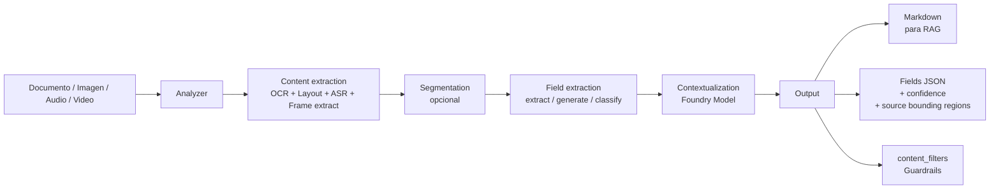
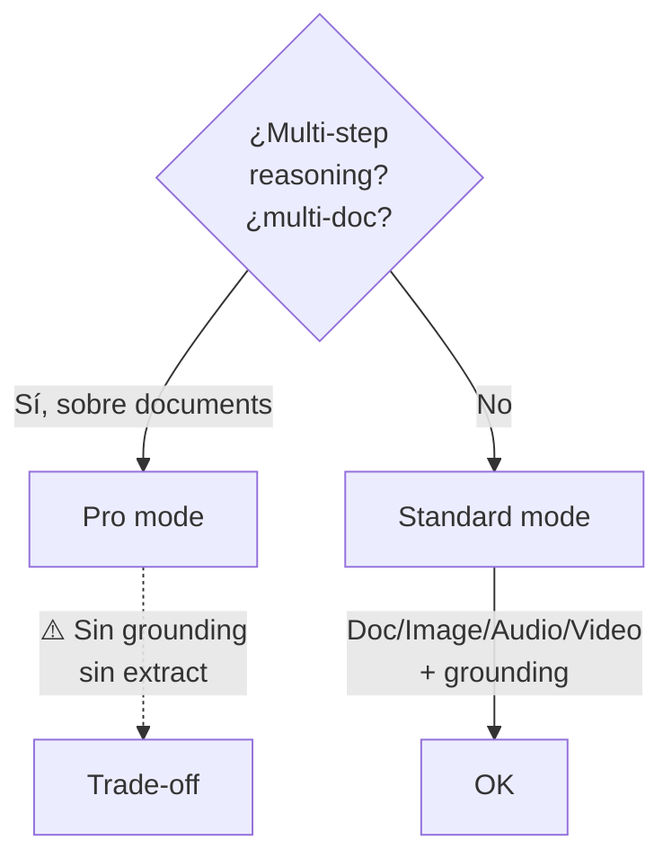
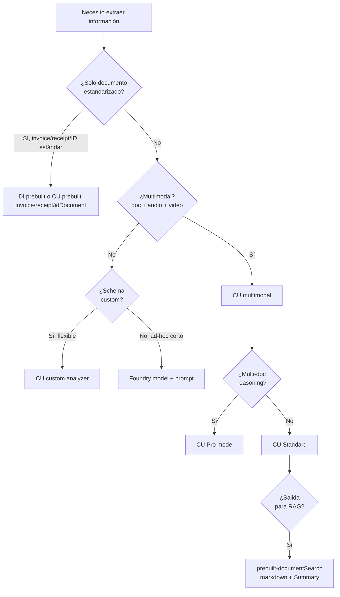

# Azure Content Understanding — Overview, analyzers y outputs grounded para RAG/agentes

> [!abstract] TL;DR
> **Azure Content Understanding (CU)** es el **Foundry Tool multimodal GA desde la API `2025-11-01`** que ingiere **documentos, imágenes, audio y vídeo** y los transforma en **Markdown** (para RAG) o **JSON estructurado** (para automatización) con **confidence scores y grounding (bounding regions)**. El bloque atómico es el **analyzer**: un schema reusable (`analyzerId` + `baseAnalyzerId` + `config` + `fieldSchema`) creado una vez e invocado N veces vía `begin_analyze`. CU es **la herramienta nueva preferida** en AI-103 para extracción multimodal y outputs **clean & grounded** para agentes y RAG; coexiste con Document Intelligence (prebuilts) pero el examen mueve el foco a CU.

## 🎯 Relevancia en el examen

| Skill medida en AI-103 | Peso esperado | Tipo de pregunta |
|---|---|---|
| *"Produce clean, grounded representations to use with agents and RAG by using Content Understanding"* | 🔥🔥🔥 | Escenario: cuál es la salida correcta para RAG (markdown vs JSON), qué activa grounding (`estimateFieldSourceAndConfidence`) |
| *"Implement analyzers for generating structured or markdown outputs for downstream reasoning"* | 🔥🔥🔥 | Drag-and-drop con propiedades del analyzer (`baseAnalyzerId`, `fieldSchema`, `method`) |
| Comparar CU vs Document Intelligence vs LLM raw | 🔥🔥 | "Best tool to..." con multimodal o schema custom flexible |
| Standard vs Pro mode | 🔥🔥 | Pro = documentos, multi-doc, reference data, multi-step reasoning, **sin grounding** |
| SDK Python `azure-ai-contentunderstanding` | 🔥🔥 | Identificar import / método correcto (`begin_analyze`, `AnalysisInput`) |

## 📖 Concepto en profundidad

### Qué es CU y por qué entra en AI-103

Content Understanding es un **Foundry Tool** (no es un servicio independiente — vive **dentro de un Microsoft Foundry resource** sobre `Microsoft.CognitiveServices/accounts` con `kind=AIServices`). Usa **generative AI (Foundry Models: gpt-5.2 / gpt-4.1 family + text-embedding-3-large)** bajo el capó para producir, a partir de **contenido multimodal sin estructura**, dos salidas paralelas:

1. **Markdown content** — representación textual del documento o segmento (ideal para chunkear → embeddings → vector index → RAG).
2. **Structured fields (JSON)** — pares clave-valor alineados a un schema definido por ti, con **confidence (0-1)** y **source bounding regions** opcionales para *grounding*.

El cambio narrativo de AI-102 → AI-103 es radical: AI-102 enfatizaba **Document Intelligence (DI)** con modelos custom rígidos (`train` → `analyze`); AI-103 redirige a **CU como herramienta multimodal preferida**, mientras DI sobrevive para los **prebuilt models** clásicos (Invoice, Receipt, ID document, W-2, contract).



### Anatomía del analyzer

Un **analyzer** es **un objeto JSON reusable**, creado una vez (`PUT /analyzers/{analyzerId}`) y aplicable N veces. Sus secciones obligatorias:

```json
{
  "analyzerId": "myCustomInvoiceAnalyzer",
  "description": "Extracts vendor information, line items, and totals",
  "baseAnalyzerId": "prebuilt-document",
  "config": { "...": "processing options" },
  "fieldSchema": { "name": "InvoiceFields", "fields": { } },
  "models": {
    "completion": "gpt-5.2",
    "embedding": "text-embedding-3-large"
  }
}
```

#### Tipos de analyzer (cuatro categorías)

| Categoría | Ejemplos | Uso |
|---|---|---|
| **Base analyzers** | `prebuilt-document`, `prebuilt-image`, `prebuilt-audio`, `prebuilt-video` | Padres para custom analyzers (vía `baseAnalyzerId`) |
| **RAG analyzers** | `prebuilt-documentSearch`, `prebuilt-imageSearch`, `prebuilt-audioSearch`, `prebuilt-videoSearch` | Devuelven **markdown + `Summary`** optimizados para chunk → embed → search |
| **Domain-specific** | `prebuilt-invoice`, `prebuilt-receipt`, `prebuilt-idDocument`, `prebuilt-callCenter`, contratos, mortgage, tax forms | Schemas preconfigurados (sustituyen modelos prebuilt DI clásicos en muchos casos) |
| **Custom analyzers** | (tú los creas) | Heredan de un base + tu `fieldSchema` + `config` |

#### `config` — opciones de procesamiento (las que el examen pregunta)

| Propiedad | Default | Significado | Soportado en |
|---|---|---|---|
| `returnDetails` | `false` | Devuelve bounding boxes, spans, metadata enriquecida | Todos |
| `enableOcr` | `true` | OCR sobre escaneados / PDF imagen | Document |
| `enableLayout` | `true` | Párrafos, líneas, reading order, secciones | Document |
| `enableFormula` | `true` | Fórmulas matemáticas en LaTeX | Document |
| `enableBarcode` | `true` | QR, PDF417, UPC, Code 39/128, EAN, Aztec, DataMatrix… | Document |
| `tableFormat` | `"html"` | `"html"` o `"markdown"` | Document |
| `chartFormat` | `"chartjs"` | Estructura de charts compatible Chart.js | Document |
| `enableFigureDescription` | `false` | Genera alt-text natural de figuras/diagramas | Document |
| `enableFigureAnalysis` | `false` | Extrae datos de charts y diagramas | Document |
| `estimateFieldSourceAndConfidence` | `false` | **🔑 Activa grounding + confidence por campo** (solo *document analyzers*) | Document |
| `enableSegment` | `false` | Trocea por `contentCategories` (mixed-content batches) | Document, Video |
| `segmentPerPage` | `false` | Fuerza un segmento por página | Document |
| `contentCategories` | — | Categorías para clasificar y enrutar a sub-analyzers | Document, Video (1) |
| `locales` | `[]` | BCP-47 (`en-US`, `es-ES`…) para transcripción | Audio, Video |
| `disableFaceBlurring` | `false` | Por defecto los rostros se difuminan (Limited Access para no difuminar) | Image, Video |
| `omitContent` | `false` | Omite el content object original (solo devolver fields) | Document |

> [!warning] Grounding requiere `estimateFieldSourceAndConfidence: true`
> Para que un campo con `method: "extract"` funcione **debe** tener `estimateSourceAndConfidence: true` a nivel de field, o la propiedad activa a nivel de analyzer. Sin grounding no hay verificación de origen.

#### `fieldSchema` — qué extraer

```json
{
  "fieldSchema": {
    "name": "InvoiceAnalysis",
    "fields": {
      "VendorName": {
        "type": "string",
        "description": "Name of the vendor",
        "method": "extract"
      },
      "LineItems": {
        "type": "array",
        "items": {
          "type": "object",
          "properties": {
            "Description": { "type": "string" },
            "Quantity":    { "type": "number" }
          }
        },
        "method": "generate"
      },
      "Sentiment": {
        "type": "string",
        "method": "classify",
        "enum": ["positive", "neutral", "negative"]
      }
    }
  }
}
```

**Tipos válidos**: `string`, `number`, `boolean`, `date`, `time`, `integer`, `object`, `array` (los de `time` e `integer` están documentados como *basic field value types* en service-limits).

**`method` — tres modos de generación**:

| `method` | Cuándo | Requisito |
|---|---|---|
| `"extract"` | Valor **literal** presente en el documento (importes, fechas en facturas) | Requiere `estimateSourceAndConfidence: true`. **Solo Document.** |
| `"generate"` | Valor **inferido/sintetizado** por LLM (resúmenes, free-form) | Document, Image, Audio, Video, Text |
| `"classify"` | Valor entre un **enum cerrado** (sentiment, chart type) | Document, Image, Audio, Video, Text |

> [!tip] Recuerda
> `extract` es **solo para Document analyzers**. Para Image/Audio/Video el examen espera `generate` o `classify`.

### Standard vs Pro mode

Pro mode **sigue en preview** (`2025-05-01-preview` API). Standard es lo que GA `2025-11-01` provee por defecto.

| Feature | Standard | Pro |
|---|---|---|
| Modalidades input | Document, Image, Audio, Video | **Solo Document** |
| Grounding + confidence | ✅ | ❌ |
| `extract` method | ✅ | ❌ (solo `classify` y `generate`) |
| Multi-input docs | ❌ | ✅ |
| Reference dataset | ❌ | ✅ |
| Multi-step reasoning | ❌ | ✅ |
| Max fields | 100 | 100 |
| Cost / latency | Bajo | Alto |
| Max input | 200 MB / 300 pages | **100 MB / 150 pages** |

**Caso típico Pro**: *"¿Esta factura cumple el contrato firmado con el cliente?"* — adjuntas el contrato como **reference data** y la factura como input.



## 🏗️ Cómo se hace

### 1) Provisionar (Azure CLI)

```bash
# Crear un Microsoft Foundry resource (incluye Content Understanding como Tool)
az cognitiveservices account create \
  --name myFoundry \
  --resource-group myRG \
  --kind AIServices \
  --sku S0 \
  --location eastus \
  --custom-domain myFoundry

# Asignar Cognitive Services User al user/SP
az role assignment create \
  --assignee <user-or-sp-objectId> \
  --role "Cognitive Services User" \
  --scope $(az cognitiveservices account show -n myFoundry -g myRG --query id -o tsv)
```

> [!warning] Cognitive Services User es OBLIGATORIO
> Sin este rol, **no podrás llamar la API para configurar default model deployments** ni invocar prebuilt analyzers — aunque seas Owner del recurso.

### 2) Crear un analyzer (REST)

```bash
curl -X PUT \
  "https://myfoundry.services.ai.azure.com/contentunderstanding/analyzers/myInvoiceAnalyzer?api-version=2025-11-01" \
  -H "Content-Type: application/json" \
  -H "Authorization: Bearer $(az account get-access-token --resource https://cognitiveservices.azure.com --query accessToken -o tsv)" \
  -d @analyzer.json
# Devuelve 201 Created con Operation-Location header (long-running op)
```

### 3) Python SDK — workflow completo

```python
# pip install azure-ai-contentunderstanding azure-identity
# Python 3.9+ requerido — SDK 1.1.0 → API 2025-11-01

import os
from azure.ai.contentunderstanding import ContentUnderstandingClient
from azure.ai.contentunderstanding.models import (
    AnalysisInput,
    AnalysisResult,
    DocumentContent,
    AnalysisContentKind,
)
from azure.identity import DefaultAzureCredential

endpoint = os.environ["CONTENTUNDERSTANDING_ENDPOINT"]
# Formato: https://<resource>.services.ai.azure.com/
credential = DefaultAzureCredential()
client = ContentUnderstandingClient(endpoint=endpoint, credential=credential)

# --- A) Crear analyzer custom (one-time) ---
analyzer_body = {
    "description": "Invoice extractor with grounding",
    "baseAnalyzerId": "prebuilt-document",
    "config": {
        "returnDetails": True,
        "estimateFieldSourceAndConfidence": True,
        "enableOcr": True,
        "enableLayout": True,
    },
    "fieldSchema": {
        "name": "InvoiceFields",
        "fields": {
            "VendorName":   {"type": "string", "method": "extract"},
            "InvoiceTotal": {"type": "number", "method": "extract"},
            "LineItems": {
                "type": "array",
                "items": {
                    "type": "object",
                    "properties": {
                        "Description": {"type": "string"},
                        "Amount":      {"type": "number"},
                    },
                },
                "method": "generate",
            },
        },
    },
}
# Long-running operation: usa .result() para esperar
poller = client.content_analyzers.begin_create_or_replace(
    analyzer_id="myInvoiceAnalyzer",
    resource=analyzer_body,
)
analyzer = poller.result()

# --- B) Invocar analyzer sobre contenido por URL ---
poller = client.begin_analyze(
    analyzer_id="myInvoiceAnalyzer",
    inputs=[AnalysisInput(url="https://contoso.blob.core.windows.net/docs/invoice.pdf")],
)
result: AnalysisResult = poller.result()

# --- C) Procesar salida ---
content = result.contents[0]
print("Markdown:\n", content.markdown)          # para RAG

if content.kind == AnalysisContentKind.DOCUMENT:
    doc: DocumentContent = content  # type: ignore
    vendor = doc.fields["VendorName"]
    total  = doc.fields["InvoiceTotal"]
    print(f"Vendor: {vendor.value}  conf={vendor.confidence}")
    print(f"Total : {total.value}   conf={total.confidence}")
    # Source grounding:
    for region in vendor.source.bounding_regions:
        print(f"  Page {region.page_number}  polygon={region.polygon}")
```

### 4) Invocación con binario (no URL)

```python
with open("invoice.pdf", "rb") as f:
    poller = client.begin_analyze_binary(
        analyzer_id="prebuilt-invoice",
        input=f.read(),
    )
result = poller.result()
```

## 📊 Cuándo usar Content Understanding vs Document Intelligence vs LLM raw

| Escenario | Tool recomendado | Por qué |
|---|---|---|
| Factura estándar, schema fijo, **on-prem o latencia mínima** | **DI `prebuilt-invoice`** (clásico) o **CU `prebuilt-invoice`** | Ambos valen; CU es nuevo, DI clásico es estable |
| Schema **custom flexible** sobre documentos | **CU custom analyzer** | DI custom es más rígido (template/neural); CU usa LLMs con `description` como prompt |
| **Multimodal** (mismo pipeline para docs + audio + vídeo) | **CU** | DI no procesa audio ni vídeo |
| Output **Markdown limpio para RAG** | **CU `prebuilt-documentSearch`** | Pensado para chunk → embed |
| Output con **bounding regions + confidence** | **CU + `estimateFieldSourceAndConfidence`** | Grounding nativo |
| **Multi-document reasoning** (invoice vs contract) | **CU Pro mode** | Reference data + multi-step |
| Extracción **ad-hoc** de un texto corto, sin schema | **LLM (Foundry model)** directo con prompting | CU añade overhead innecesario |
| Layout solo (texto + tablas, sin fields) | **CU `prebuilt-layout`** o `prebuilt-read` | Equivale al `prebuilt-layout` clásico DI |



## 🪤 Trampas del examen

1. **API GA = `2025-11-01`**. Preview `2024-12-01-preview` y `2025-05-01-preview` **se retiran 15-jul-2026**. Si una pregunta cita un endpoint con esas versiones, es código legacy a migrar.
2. **CU NO sustituye a DI prebuilt models**; coexisten. AI-103 mueve foco a CU pero `prebuilt-invoice` clásico de DI sigue válido.
3. **`method: "extract"` solo en Document analyzers** y requiere `estimateSourceAndConfidence: true` en el field (o `estimateFieldSourceAndConfidence: true` global). Image/Audio/Video soportan **solo `generate` y `classify`**.
4. **Pro mode no soporta `extract` ni grounding ni confidence**. Si el escenario pide "validar dónde aparece un valor con bounding box" → Standard.
5. **Pro mode es solo Document** y **solo PDF, TIFF e imágenes** (no `.docx` ni Office en pro).
6. **Endpoint correcto**: `https://<resource>.services.ai.azure.com/contentunderstanding/...` — NO `cognitiveservices.azure.com`.
7. **Package: `azure-ai-contentunderstanding`** (no `azure-ai-contentunderstand`, no `azure-cognitiveservices-...`). Client class: `ContentUnderstandingClient`.
8. **Python 3.9 o superior** (no 3.8, no 3.7).
9. **Rol RBAC requerido: `Cognitive Services User`** — incluso para owners. Sin él, no puedes configurar default model deployments.
10. **Modelos requeridos deben estar desplegados antes**: prebuilt analyzers necesitan `gpt-4.1` (o `gpt-5.2`) + `text-embedding-3-large`. RAG analyzers (`prebuilt-documentSearch`) usan `gpt-4.1-mini`. Error típico: *"Default model deployment not configured"*.
11. **`baseAnalyzerId` obligatorio en custom** — heredas de `prebuilt-document` / `prebuilt-image` / `prebuilt-audio` / `prebuilt-video`. No puedes crear desde cero.
12. **Markdown y fields se devuelven a la vez** desde una sola llamada `begin_analyze`. NO son dos invocaciones distintas.
13. **Límites de input documento**: 200 MB y **300 páginas** (no 2 000 como circula en blogs antiguos). Pro mode: 100 MB / **150 páginas**.
14. **Max 1 000 fields por schema** (no 100 — la cifra 100 es del *Pro mode max fields*).
15. **Max 300 classify categories** sumadas entre todos los fields `classify` del analyzer.
16. **Face capabilities (`disableFaceBlurring: true`)** es Limited Access — necesitas aplicar al formulario `aka.ms/facerecognition`.
17. **`enableSegment` + `contentCategories`** trocean documentos mixtos (PDF con invoice + receipt) y rutean cada chunk a un sub-analyzer. Para video, solo **1 contentCategory**.
18. **Guardrails / content_filters** vienen del Foundry model deployment subyacente, no del propio CU. Configuras filtros editando el deployment.
19. **`models.completion` y `models.embedding`** son **nombres de modelo (catálogo)**, NO nombres de deployment. El mapping deployment-name ↔ model-name se hace una vez por recurso vía `sample_update_defaults.py`.
20. **GPT-4.1 family se retira en octubre 2026** — Microsoft empuja a `gpt-5.2`.

## 🧠 Mnemotecnia

- **Las cuatro M del Foundry Tool**: **M**arkdown · **M**ulti-modal · **M**ethod (extract/generate/classify) · **M**odel deployment (Cognitive Services User).
- **CDMG** — orden mental de un analyzer: **C**onfig → **D**escription → **M**odels → **G**rounding-ready fields (`estimateFieldSourceAndConfidence`).
- **EGC** — los tres `method`: **E**xtract (literal, doc-only) · **G**enerate (LLM-libre) · **C**lassify (enum).
- **Pro = "Documents Only, Decisions Only"** — solo docs, solo razonamiento multi-paso, sin extract, sin grounding.
- **GA = `11-01`** (noviembre 2025). Si lees `12-01-preview` o `05-01-preview`, es preview que muere 15-jul-2026.
- **Endpoint shape**: `<resource>.services.ai.azure.com/contentunderstanding` — el `services.ai` es la huella Foundry.

## 🔗 Conceptos relacionados

- [[00-microsoft-foundry-overview]] — recurso Foundry padre que aloja CU como Tool.
- [[00-foundry-tools-catalog]] — catálogo completo de Foundry Tools.
- [[00-foundry-vs-azure-ai-foundry-nomenclature]] — Foundry resource vs project vs Tool.
- [[extract-content-understanding-analyzers]] — deep dive de analyzer schema y prebuilt analyzers.
- [[extract-content-understanding-multimodal]] — cómo CU procesa audio y vídeo (transcripción, frame extract).
- [[extract-grounded-rag-output]] — patrón de uso de `markdown` + `Summary` + chunks para RAG.
- [[extract-ocr-layout-fields-multimodal]] — relación con OCR, layout, fields y diferencias vs DI.
- [[extract-document-intelligence-prebuilt]] — `prebuilt-invoice/receipt/idDocument` clásicos de DI (coexisten).
- [[vision-content-understanding-overview]] — vertiente vision/image de CU (sub-tema dominio C).
- [[genai-rag-pattern-end-to-end]] — pipeline RAG completo donde CU produce el input clean.

## ❓ Autotest

**1.** Necesitas extraer el `VendorName` de una factura PDF con **bounding box de origen** para poder resaltarlo en un visor. ¿Qué configuración del analyzer es correcta?

- a) `method: "generate"` + `enableLayout: false`
- b) `method: "extract"` + `estimateSourceAndConfidence: true` + `baseAnalyzerId: "prebuilt-document"`
- c) Pro mode con `method: "classify"`
- d) Cualquier analyzer Image-based con `enableOcr: true`

<details><summary>Respuesta</summary>

**b)**. `extract` es solo para Document analyzers y **requiere** `estimateSourceAndConfidence: true` para devolver bounding regions. Pro mode (c) no soporta `extract` ni grounding. Image-based (d) no soporta `extract`.
</details>

**2.** Estás construyendo RAG sobre PDFs corporativos mixtos. Necesitas **markdown limpio + Summary** por documento. ¿Qué analyzer usas?

- a) `prebuilt-layout`
- b) `prebuilt-invoice`
- c) `prebuilt-documentSearch`
- d) Un custom analyzer con `omitContent: true`

<details><summary>Respuesta</summary>

**c)**. `prebuilt-documentSearch` es un **RAG analyzer** optimizado para devolver markdown estructurado + un `Summary` de un párrafo por content item. (a) solo da layout sin summary; (b) es schema invoice-specific; (d) omitContent quita justamente el markdown.
</details>

**3.** ¿Cuál de estas afirmaciones sobre **Pro mode** es correcta?

- a) Soporta multimodal (docs, audio, video, image)
- b) Devuelve confidence y bounding regions
- c) Soporta `method: "extract"` y reference data
- d) Solo soporta `classify` y `generate`, solo documentos, permite reference data y multi-step reasoning

<details><summary>Respuesta</summary>

**d)**. Pro mode = solo documents, sin grounding/confidence, sin `extract`. A cambio: multi-doc, reference data, multi-step reasoning. Tabla oficial standard-pro-modes.
</details>

**4.** ¿Cuál es el endpoint correcto del Content Understanding API en GA?

- a) `https://<resource>.cognitiveservices.azure.com/contentunderstanding/analyzers/{id}?api-version=2024-12-01-preview`
- b) `https://<resource>.services.ai.azure.com/contentunderstanding/analyzers/{id}?api-version=2025-11-01`
- c) `https://<resource>.openai.azure.com/contentunderstanding/{id}?api-version=2025-05-01-preview`
- d) `https://management.azure.com/.../contentunderstanding?api-version=2025-11-01`

<details><summary>Respuesta</summary>

**b)**. Foundry resources usan `services.ai.azure.com`. La API GA es `2025-11-01`. (a) es preview retirando 15-jul-2026; (c) no existe; (d) es ARM plane no data plane.
</details>

**5.** Tu equipo crea un custom analyzer y lanza `begin_analyze`. Falla con *"Default model deployment not configured"*. ¿Qué falta?

- a) Asignar rol Storage Blob Data Reader
- b) Desplegar `gpt-4.1` + `text-embedding-3-large` en el Foundry resource, asignar Cognitive Services User y ejecutar el sample `sample_update_defaults.py`
- c) Cambiar API version a `2024-12-01-preview`
- d) Establecer `omitContent: true` en el analyzer

<details><summary>Respuesta</summary>

**b)**. CU requiere modelos generativos desplegados Y mapeados como defaults. El rol `Cognitive Services User` es obligatorio para invocar la API de defaults. Sin esa configuración, prebuilt y custom analyzers fallan.
</details>

**6.** ¿Cuál es **falso** sobre CU?

- a) Markdown y fields se devuelven en la misma llamada `begin_analyze`
- b) Custom analyzers heredan obligatoriamente de un `baseAnalyzerId`
- c) `method: "extract"` funciona en audio si activas `estimateSourceAndConfidence`
- d) `prebuilt-documentSearch` está optimizado para RAG

<details><summary>Respuesta</summary>

**c)** es FALSO. `extract` **solo funciona en Document analyzers**. Audio soporta únicamente `generate` y `classify`.
</details>

## ✅ Control de calidad (auto-rúbrica)

| Dimensión | Nota | Justificación |
|---|---|---|
| Completitud | 9.5 | Cubre los dos sub-puntos AI-103 verbatim, GA API, analyzer anatomy, config completo, fieldSchema, methods, modos Std/Pro, SDK Python, REST, comparativa CU/DI/LLM, límites cuantitativos, security/RBAC. |
| Exactitud técnica | 9.5 | Verificado contra 5 páginas oficiales Microsoft Learn + SDK readme (verificado_fecha 2026-05-23). Corrige errores del brief (300 pages real vs 2000, gpt-5.2 modelo actual, métodos `extract/generate/classify` reales, endpoints exactos). |
| Alineación al examen | 9 | 20 trampas reales, 6 autotest estilo MS, foco en grounding, modos y SDK que son los puntos típicos. |
| Claridad pedagógica | 9 | 3 mermaid, 5 tablas, callouts, mnemónicos (CDMG, EGC, "Pro = Documents Only Decisions Only"), wikilinks vertebrales. |

*Verificado a fecha 2026-05-23 contra Microsoft Learn (overview, analyzer-reference, standard-pro-modes, service-limits, SDK Python readme y REST 2025-11-01).*
