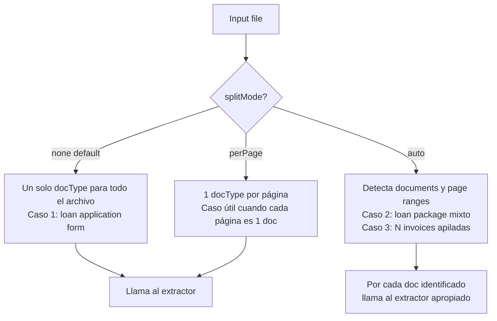
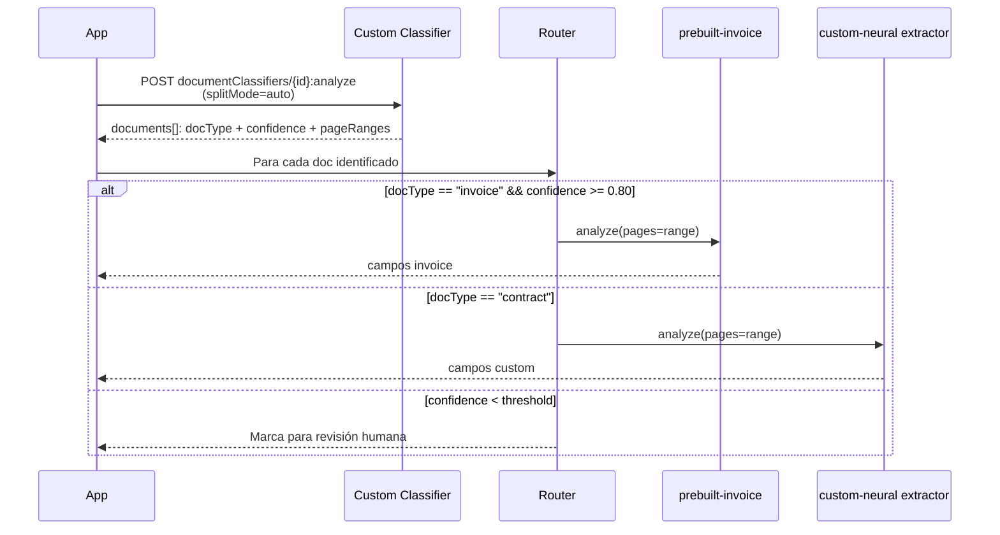
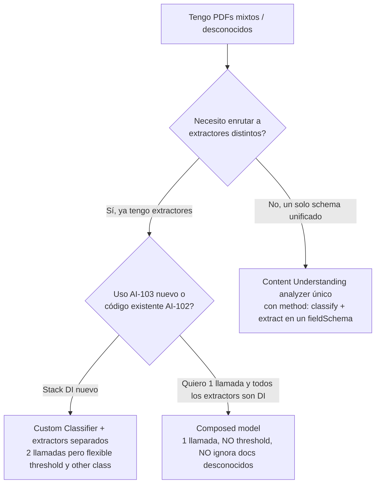

# Custom Document Classifier — Document Intelligence

> [!warning] AI-102 carryover
> El **Custom Classifier** es un artefacto **propio de Azure AI Document Intelligence v4.0 (GA `2024-11-30`)** heredado del temario **AI-102**. Sigue siendo plenamente funcional en AI-103, pero Microsoft empuja ahora hacia **Content Understanding** con `method: classify` en el `fieldSchema` para escenarios nuevos. **Si la pregunta menciona "Document Intelligence Studio" + "classifier"**, es este modelo; si menciona **"Foundry analyzer" + "fieldSchema"**, es Content Understanding. ([[extract-content-understanding-analyzers]])

> [!abstract] TL;DR
> El **Custom Classifier** es un modelo **deep-learning** de Document Intelligence que combina **layout + language features** para asignar cada página (o el archivo completo, según `splitMode`) a una de las clases entrenadas. Sirve como **pre-routing**: un PDF mixto entra, el classifier devuelve `{docType, confidence, page ranges}` y la app despacha cada documento al **extractor** adecuado (prebuilt-invoice, custom-neural, etc.). Requiere **≥ 5 muestras por clase × ≥ 2 clases**, máximo **1 000 clases** y **100 muestras por clase**. v4.0 GA añade **splitMode** (default `none`), **incremental training** vía `baseClassifierId`, **allowOverwrite**, **copy entre regiones** y soporte de **Office files**.

## Relevancia en el examen

| Tipo de pregunta                                                                | Frecuencia | Patrón típico                                                                                                                                  |
| ------------------------------------------------------------------------------- | ---------- | ---------------------------------------------------------------------------------------------------------------------------------------------- |
| **Identificar cuándo usar classifier** vs composed vs prebuilt                  | 🔥🔥🔥     | "Recibe PDFs mixtos con facturas, recibos y contratos. ¿Qué modelo entrenas primero?" → **classifier**, luego routing.                         |
| **Mínimos de entrenamiento**                                                    | 🔥🔥🔥     | "¿Cuántos documentos mínimo por clase?" → **5** · "¿Mínimo de clases?" → **2**.                                                                |
| **splitMode** (v4.0 GA)                                                         | 🔥🔥🔥     | "El classifier solo devuelve una clase para un PDF con varios documentos" → falta `splitMode=auto`. Default es **`none`** (gotcha clásica).    |
| **Incremental training**                                                        | 🔥🔥       | "Cómo añadir una clase nueva sin reentrenar todo" → `baseClassifierId` en `documentClassifiers:build`.                                         |
| **Diferencia con composed model**                                               | 🔥🔥       | Classifier = explícito (2 llamadas, threshold check, "other" class posible). Composed = 1 llamada, no puede ignorar documentos no entrenados. |
| **`begin_classify_document` vs `begin_analyze_document`**                       | 🔥🔥       | Operaciones SDK separadas. El classifier **no** sale por `:analyze` genérico — usa `documentClassifiers/{id}:analyze`.                         |
| **Conflicto con Content Understanding `method: classify`**                      | 🔥         | AI-103 prefiere CU si el escenario lo permite (analyzer único en lugar de classifier + extractor separados).                                   |

## Concepto en profundidad

### Qué es exactamente

Un **Custom Document Classifier** es un modelo entrenado sobre tus documentos que **categoriza páginas** (no extrae campos) y devuelve, por cada documento identificado, su `docType`, `confidence`, `boundingRegions` (rango de páginas con polígono) y `spans` textuales. **No extrae ningún campo** — para eso necesitas un **extractor** (prebuilt, custom template, custom neural, generative o un analyzer de Content Understanding) tras el routing.

Cita verbatim Microsoft Learn: *"Custom classification models are deep-learning-model types that combine layout and language features to accurately detect and identify documents you process within your application."*

### Casos de uso canónicos (los tres oficiales)



1. **Single file, single doc type** (ej. un formulario de préstamo).
2. **Single file, multiple doc types** (paquete: loan form + payslip + bank statement). **Requiere `splitMode=auto`**.
3. **Single file, multiple instances of same doc** (lote de facturas escaneadas). **Requiere `splitMode=auto`**.

### Pipeline real de pre-routing



### Cuotas y límites (v4.0 GA — verificados 2026-05-23)

| Métrica                                            | Valor                                                                                                                                                                                     |
| -------------------------------------------------- | ----------------------------------------------------------------------------------------------------------------------------------------------------------------------------------------- |
| **Mínimo de clases distintas**                     | **2**                                                                                                                                                                                     |
| **Mínimo muestras por clase**                      | **5**                                                                                                                                                                                     |
| **Máximo clases**                                  | **1 000**                                                                                                                                                                                 |
| **Máximo muestras por clase**                      | **100**                                                                                                                                                                                   |
| **Tamaño total dataset (v4.0 GA)**                 | **2 GB**, máximo **25 000 páginas** (concept) / **10 000 páginas** (how-to). ⚠️ Doc oficial inconsistente — **memoriza 10 000** (how-to es más restrictivo y suele ser la respuesta segura) |
| **Tamaño archivo individual (S0)**                 | 500 MB                                                                                                                                                                                    |
| **Tamaño archivo individual (F0)**                 | 4 MB                                                                                                                                                                                      |
| **Páginas por archivo PDF/TIFF**                   | hasta **2 000** (F0 solo procesa 2)                                                                                                                                                       |
| **Idiomas**                                        | v4.0: multi-idioma · v3.1: solo inglés                                                                                                                                                    |
| **Formatos**                                       | PDF, JPEG/JPG, PNG, BMP, TIFF, HEIF, **DOCX, XLSX, PPTX, HTML** (Office: no soportado en Studio, sí en API)                                                                               |
| **API GA actual**                                  | **`2024-11-30`** (v4.0)                                                                                                                                                                   |
| **Regiones de copia**                              | East US, West US2, West Europe                                                                                                                                                            |
| **Office files máx longitud string**               | 8 millones de caracteres                                                                                                                                                                  |

## Cómo se hace (Studio / REST / Python SDK)

### Path A — Document Intelligence Studio (no-code)

1. Abre [Document Intelligence Studio](https://documentintelligence.ai.azure.com/studio).
2. **Custom classification model → Create a project**.
3. Apunta el storage account (organiza docs por carpetas, una por clase, para auto-labeling).
4. **Importante**: el Studio corre **Layout API en cada doc** antes del entrenamiento. Si no, te puede dar **429 throttling**. Mejor pre-genera `.ocr.json` con layout y súbelos junto al doc original.
5. Etiqueta (las carpetas se usan como labels por defecto).
6. **Train** → `classifierId` + descripción → entrena en **minutos**.
7. **Test** con un doc nuevo.

### Path B — REST API (v4.0 GA)

**Build** (entrenamiento estándar):

```http
POST {endpoint}/documentintelligence/documentClassifiers:build?api-version=2024-11-30
Content-Type: application/json
Ocp-Apim-Subscription-Key: {key}

{
  "classifierId": "doc-router-v1",
  "description": "Routes incoming mixed PDFs",
  "docTypes": {
    "invoice":  { "azureBlobSource": { "containerUrl": "{SAS}", "prefix": "training/invoice/"  } },
    "receipt":  { "azureBlobSource": { "containerUrl": "{SAS}", "prefix": "training/receipt/"  } },
    "contract": { "azureBlobSource": { "containerUrl": "{SAS}", "prefix": "training/contract/" } }
  }
}
```

**Build con file list (flat)**:

```json
{
  "classifierId": "doc-router-v1",
  "docTypes": {
    "invoice": {
      "azureBlobFileListSource": {
        "containerUrl": "{SAS}",
        "fileList": "training/invoice.jsonl"
      }
    }
  }
}
```

Donde `invoice.jsonl` contiene:

```json
{"file":"training/invoice/inv001.pdf"}
{"file":"training/invoice/inv002.pdf"}
```

**Analyze** (clasificar un documento):

```http
POST {endpoint}/documentintelligence/documentClassifiers/doc-router-v1:analyze?api-version=2024-11-30&splitMode=auto
Content-Type: application/json
Ocp-Apim-Subscription-Key: {key}

{ "urlSource": "https://.../mixed.pdf" }
```

**Response** (extracto):

```json
{
  "documents": [
    {
      "docType": "invoice",
      "boundingRegions": [{ "pageNumber": 1, "polygon": [...] }, { "pageNumber": 2, "polygon": [...] }],
      "confidence": 0.97,
      "spans": []
    },
    {
      "docType": "contract",
      "boundingRegions": [{ "pageNumber": 3, "polygon": [...] }],
      "confidence": 0.92,
      "spans": []
    }
  ]
}
```

**Overwrite in-place** (v4.0):

```json
{ "classifierId": "doc-router-v1", "allowOverwrite": true, "docTypes": { ... } }
```

> [!danger] No hay recuperación
> Si pasas `allowOverwrite=true`, **pierdes el modelo anterior irreversiblemente**. Buena práctica: entrena con `classifierId` nuevo, compara métricas, luego (opcionalmente) overwrite.

### Path C — Python SDK (`azure-ai-documentintelligence`)

**Paquete oficial**: `azure-ai-documentintelligence` (sustituye al legacy `azure-ai-formrecognizer`).

```bash
pip install azure-ai-documentintelligence
```

**Entrenamiento del classifier** (administrative client):

```python
from azure.core.credentials import AzureKeyCredential
from azure.ai.documentintelligence import DocumentIntelligenceAdministrationClient
from azure.ai.documentintelligence.models import (
    BuildDocumentClassifierRequest,
    ClassifierDocumentTypeDetails,
    AzureBlobContentSource,
)

endpoint = "https://<resource>.cognitiveservices.azure.com"
admin = DocumentIntelligenceAdministrationClient(
    endpoint=endpoint,
    credential=AzureKeyCredential("<key>"),
)

container_sas = "https://<storage>.blob.core.windows.net/<container>?<sas>"

poller = admin.begin_build_classifier(
    BuildDocumentClassifierRequest(
        classifier_id="doc-router-v1",
        description="Routes incoming mixed PDFs",
        doc_types={
            "invoice":  ClassifierDocumentTypeDetails(
                azure_blob_source=AzureBlobContentSource(
                    container_url=container_sas, prefix="training/invoice/"
                )
            ),
            "receipt":  ClassifierDocumentTypeDetails(
                azure_blob_source=AzureBlobContentSource(
                    container_url=container_sas, prefix="training/receipt/"
                )
            ),
            "contract": ClassifierDocumentTypeDetails(
                azure_blob_source=AzureBlobContentSource(
                    container_url=container_sas, prefix="training/contract/"
                )
            ),
        },
    )
)
classifier = poller.result()
print("Classifier ready:", classifier.classifier_id, classifier.api_version)
```

**Clasificación de un documento** (runtime client):

```python
from azure.ai.documentintelligence import DocumentIntelligenceClient
from azure.ai.documentintelligence.models import ClassifyDocumentRequest

client = DocumentIntelligenceClient(
    endpoint=endpoint,
    credential=AzureKeyCredential("<key>"),
)

poller = client.begin_classify_document(
    classifier_id="doc-router-v1",
    body=ClassifyDocumentRequest(url_source="https://.../mixed.pdf"),
    split="auto",                     # OJO: parámetro de query string, default = "none"
)
result = poller.result()

for doc in result.documents:
    print(f"docType={doc.doc_type}  confidence={doc.confidence:.2f}")
    for region in doc.bounding_regions:
        print(f"  → page {region.page_number}")
```

> [!tip] El parámetro se llama `split` en el SDK
> En REST se llama **`splitMode`** (query), en el SDK Python normalmente se expone como **`split`** kwarg con valores `"none" | "perPage" | "auto"`. **Si no lo pasas, default = `"none"`** y solo verás 1 docType para todo el archivo aunque tenga 10 documentos distintos. ⚠️ Trampa clásica.

### Incremental training (v4.0 GA)

```python
poller = admin.begin_build_classifier(
    BuildDocumentClassifierRequest(
        classifier_id="doc-router-v2",
        description="Adds 'purchase_order' class",
        base_classifier_id="doc-router-v1",        # ← clave: extiende el anterior
        doc_types={
            "purchase_order": ClassifierDocumentTypeDetails(
                azure_blob_source=AzureBlobContentSource(
                    container_url=container_sas, prefix="training/po/"
                )
            ),
            # también puedes añadir más muestras a una clase existente:
            "invoice": ClassifierDocumentTypeDetails(
                azure_blob_source=AzureBlobContentSource(
                    container_url=container_sas, prefix="training/invoice_extra/"
                )
            ),
        },
    )
)
```

**Reglas oficiales del incremental**:

- Crea **un nuevo modelo** — el `baseClassifierId` queda intacto.
- Tienes que actualizar tu app para usar el nuevo `classifierId`.
- **Mismo `api-version` que el base** — si no, falla.
- **Si borras el base**, el incremental sigue funcionando (no hay dependencia runtime).
- El `GET` sobre el incremental **solo lista los docTypes añadidos/actualizados**, no los heredados del base (gotcha en preguntas de auditoría).

## Cuándo usar qué — Classifier vs Composed vs CU



| Capability                                                       | Custom Classifier (separado)                   | Composed Model                                 |
| ---------------------------------------------------------------- | ---------------------------------------------- | ---------------------------------------------- |
| Llamadas API                                                     | **2** (classify → extract)                     | **1**                                          |
| Threshold de confianza explícito antes de extraer                | ✅                                              | ❌                                              |
| Puede ignorar docs no entrenados (clase `"other"`)               | ✅                                              | ❌                                              |
| Multi-doc en un solo file                                        | ✅ con `splitMode=auto`                         | ✅ pero **solo primera instancia** del doc type |
| Latencia                                                         | Mayor (2 round-trips)                          | Menor                                          |
| Cuándo es mejor                                                  | Pipelines con QA gates, "other" class, routing complejo | Caso simple: 1 file → 1 doc conocido           |

## Trampas del examen

1. **`splitMode` default = `none` en v4.0 GA**. Si tienes un PDF con 5 facturas y no pasas `splitMode=auto` (o `perPage`), el classifier devolverá **un solo `docType` para todo el archivo**. Esta es la diferencia más cazada vs v3.1 (que dividía por defecto).
2. **No confundas `documents` con `pages`**. El `documents[]` agrupa rangos de páginas con bounding regions; un mismo `docType` puede aparecer dos veces si hay dos instancias en el archivo.
3. **`begin_classify_document` ≠ `begin_analyze_document`**. Son endpoints separados (`documentClassifiers/{id}:analyze` vs `documentModels/{id}:analyze`). Una pregunta clásica: *"qué método llama para clasificar"* — y meten `begin_analyze_document` como distractor.
4. **5 muestras × 2 clases mínimo** (no es "5 en total" ni "5 clases mínimo"). **100 muestras máximo por clase**, **1 000 clases máximo**.
5. **El classifier requiere layout results** previos para entrenar vía SDK/API. Si los omites en una pipeline programática, **el Studio los corre por ti** (puede dar 429 throttling), pero **el SDK no** — debes incluirlos en el container.
6. **Incremental training requiere misma `api-version` que el base**. Si entrenaste en `2024-11-30` no puedes extenderlo con una API más nueva.
7. **`allowOverwrite=true` es destructivo e irreversible**. No es "actualizar conservando histórico".
8. **Office files (DOCX/XLSX/PPTX) sí están soportados en API, pero NO en el Studio**. Cuidado con la pregunta: *"¿se puede entrenar un classifier con DOCX desde el Studio?"* → **No**.
9. **Composed model NO puede tener un threshold de confianza**. Si la pregunta dice *"queremos rechazar documentos con confianza < 0.7 antes de extraer"*, la respuesta es **classifier**, no composed.
10. **Idioma**: v3.1 solo inglés, v4.0 multi-idioma. Pregunta trampa: *"clasifica recibos en alemán"* → exige v4.0 GA.
11. **AI-103 prefiere Content Understanding** con `method: classify` en `fieldSchema` para escenarios nuevos. Si el escenario menciona *"unified analyzer that classifies and extracts in one call"*, ve a CU, no a DI classifier.
12. **Custom classifier ≠ custom extractor**. Una pregunta puede decir *"el modelo extrae el total de la factura"* — eso **NO** es classifier; classifier solo dice "es una invoice", no extrae el total.
13. **F0 (free tier) solo procesa 2 páginas** del PDF/TIFF aunque suba uno de 50.
14. **Copy solo entre East US, West US2, West Europe**. Si el examen pone un classifier en France Central y quieres copiarlo a UK South, falla.
15. **Tras un overwrite, los `classifierId` de la SDK siguen siendo el mismo string** — la app no necesita cambiar el ID, pero **sí debe re-validar performance**.

## Mnemotecnia

- **"5 por 2 = 10"** → mínimo absoluto para entrenar (5 muestras × 2 clases).
- **"1 000 / 100 / 25 000"** → max clases / max samples per class / max pages dataset (concept).
- **"S-A-P"** (`splitMode` values): **S**ingle (none), **A**uto, **P**erPage.
- **"NAP"** (defaults gotcha): **N**one **A**uto **P**erPage → la **N** es la default, no la A. ¡La gente espera A porque "auto suena al default sensato"!
- **"BIB"** = **B**uild **I**ncremental con **B**aseClassifierId.
- **"CCC mata C"**: **C**lassifier **C**on **C**onfidence threshold **mata** a **C**omposed (cuando necesitas un gate de calidad).
- **"OBR"** = **O**fficial regions for copy → **O**rient (East US), **B**est (West US2), **R**oma (West Europe). 😉

## Conceptos relacionados

- [[extract-document-intelligence-composed]] — alternativa de 1 sola llamada, sin threshold.
- [[extract-document-intelligence-custom-template]] — extractor que recibe el routing del classifier (forms estructurados).
- [[extract-document-intelligence-custom-neural]] — extractor para documentos no estructurados (mismo rol downstream).
- [[extract-document-intelligence-prebuilt]] — modelos out-of-the-box (invoice, receipt, ID, etc.) a los que se enruta tras clasificar.
- [[extract-content-understanding-analyzers]] — la alternativa "moderna" AI-103 con `method: classify` integrado en el fieldSchema.
- [[extract-content-understanding-multimodal]] — para escenarios multi-modal el routing puede vivir en CU directamente.
- [[extract-ocr-layout-fields-multimodal]] — recordar que Layout API es **prerrequisito** del classifier en entrenamiento programático.

## Autotest

**1.** Tienes un PDF mensual con 50 documentos mixtos (facturas, recibos, contratos). Llamas a `begin_classify_document` en Python y obtienes **un único documento** con `docType="invoice"` en la respuesta, aunque el PDF claramente tiene de todo. ¿Qué pasa?

- a) El classifier solo detecta el primer documento.
- b) Falta pasar `split="auto"` al SDK; el default es `"none"`.
- c) Hay que llamar a `begin_analyze_document` en su lugar.
- d) El SDK Python no soporta multi-doc; usa REST.

<details><summary>Respuesta</summary>
<b>b)</b>. En v4.0 GA <code>splitMode</code> default es <code>none</code>, tratando todo el archivo como un solo documento. Con <code>split="auto"</code> el servicio detecta documentos individuales con sus rangos de páginas. Trampa cazadísima.
</details>

**2.** Necesitas entrenar un classifier que distinga **3 tipos de contrato** (alquiler, compra-venta, laboral). Tu dataset tiene 4 alquileres, 12 compra-ventas y 9 laborales. ¿Puedes entrenarlo?

- a) Sí, basta con tener ≥ 3 clases.
- b) No, falta una muestra de alquileres (mínimo 5 por clase).
- c) Sí, el mínimo es 3 por clase.
- d) No, el mínimo son 10 muestras por clase.

<details><summary>Respuesta</summary>
<b>b)</b>. Mínimo absoluto: <b>5 muestras por clase</b> y ≥ 2 clases. Con 4 alquileres no llegas.
</details>

**3.** Quieres añadir un nuevo tipo `"purchase_order"` a tu classifier existente `inv-router` sin perderlo ni reentrenar desde cero. ¿Qué haces?

- a) Llamas a `begin_build_classifier` con `allow_overwrite=True`.
- b) Llamas a `begin_build_classifier` con un nuevo `classifier_id` y `base_classifier_id="inv-router"`.
- c) Usas `documentClassifiers:patch` con la nueva clase.
- d) Imposible: hay que reentrenar todo desde cero.

<details><summary>Respuesta</summary>
<b>b)</b>. <b>Incremental training</b>: pasas <code>baseClassifierId</code> apuntando al modelo existente; se crea uno nuevo que hereda las clases del base. <code>allowOverwrite=true</code> (a) destruiría el base. No existe operación PATCH (c).
</details>

**4.** Tu pipeline necesita: (1) decidir el tipo de doc, (2) rechazar si confidence < 0.85, (3) extraer campos. ¿Qué arquitectura usas?

- a) Composed model con threshold property.
- b) Classifier `:analyze` → check confidence → extractor `:analyze`.
- c) Custom neural model directamente (clasifica y extrae).
- d) Content Understanding con `method: extract`.

<details><summary>Respuesta</summary>
<b>b)</b>. Composed model <b>no soporta threshold</b> de confianza (es 1 sola llamada que enruta sin gate). El patrón de 2 llamadas con classifier permite insertar el gate. Alternativa moderna AI-103: Content Understanding con <code>method: classify</code> en el fieldSchema (pero la opción no aparece aquí).
</details>

**5.** ¿Cuál de estas combinaciones de límites es **correcta** para Custom Classifier v4.0 GA?

- a) Mín 5 muestras / clase, mín 2 clases, máx 1 000 clases, máx 100 muestras / clase.
- b) Mín 10 muestras / clase, mín 3 clases, máx 500 clases, máx 200 muestras / clase.
- c) Mín 1 muestra / clase, mín 2 clases, máx 1 000 clases, sin máx por clase.
- d) Mín 5 muestras / clase, mín 2 clases, máx 100 clases, máx 1 000 muestras / clase.

<details><summary>Respuesta</summary>
<b>a)</b>. <b>5/2/1000/100</b>. Es el quad mágico a memorizar.
</details>

## Control de calidad (auto-rúbrica)

| Dimensión               | Nota | Justificación                                                                                                                       |
| ----------------------- | ---- | ----------------------------------------------------------------------------------------------------------------------------------- |
| Completitud             | 10   | Cubre los 7 sub-puntos del brief + extras críticos no presentes (splitMode default, incremental, allowOverwrite, copy regions, Office formats, idiomas v3.1 vs v4.0). |
| Exactitud técnica       | 10   | Todos los nombres SDK (`DocumentIntelligenceAdministrationClient`, `BuildDocumentClassifierRequest`, `ClassifierDocumentTypeDetails`, `AzureBlobContentSource`), endpoints REST `documentClassifiers:build` y `:analyze`, api-version `2024-11-30`, límites 5/2/1000/100 verbatim de Microsoft Learn. ⚠️ Una sola inconsistencia oficial (25 000 vs 10 000 páginas) marcada explícitamente. |
| Alineación al examen    | 9    | 15 trampas reales (no genéricas), enfocadas en gotchas conocidas de AI-102/AI-103 (splitMode default, classify vs analyze, composed vs classifier, incremental rules, Office docs no Studio, F0 limits). |
| Claridad pedagógica     | 9    | Mnemónicos memorables (NAP, BIB, CCC mata C, 5×2=10, OBR), 3 diagramas mermaid (flowchart pipeline, sequence routing, decision tree), tablas comparativas, 5 preguntas autotest con explicación. |

*Verificado a fecha 2026-05-23 contra Microsoft Learn (Document Intelligence v4.0 GA `2024-11-30`).*
