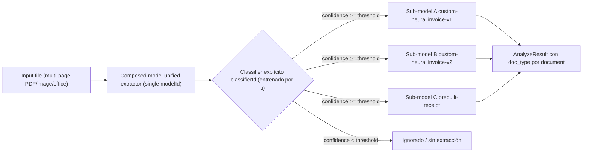
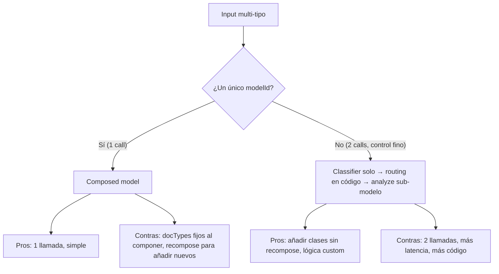

# Composed Custom Model — Document Intelligence

> [!warning] AI-102 carryover
> **Composed models** son una construcción **propia de Azure AI Document Intelligence** heredada del temario **AI-102**. Siguen siendo plenamente válidos en AI-103 v4.0 GA (`2024-11-30`), pero **Microsoft empuja ahora hacia [[extract-content-understanding-overview|Content Understanding]]** con un único analyzer multipropósito (o `method: classify` + múltiples analyzers) y, en flujos agentic, hacia herramientas con tool routing en Foundry. Si la pregunta menciona explícitamente **"Document Intelligence Studio" + "compose"** o **"single modelId for multiple form types"** → es este modelo. Si menciona **"analyzer" o "fieldSchema"** → es Content Understanding.

> [!abstract] TL;DR
> Un **composed model** agrupa **hasta 500** sub-modelos (custom y/o prebuilt) bajo **un único `modelId`** con routing automático. En **v4.0 GA `2024-11-30`** el composed **exige un classifier entrenado explícitamente** (`classifierId`) que decide a qué sub-modelo enrutar cada documento; en v3.x era una clasificación implícita y el techo eran **200** sub-modelos. La llamada de inferencia es idéntica a la de un custom model (`begin_analyze_document(modelId, ...)`); el response añade un `docType` indicando qué sub-modelo extrajo. Billing = páginas analizadas por el sub-modelo **+** clasificación de **todas** las páginas del input (cargo nuevo en v4.0 por el classifier explícito).

## Relevancia en el examen

| Tipo de pregunta | Frecuencia | Patrón típico |
| --- | --- | --- |
| **Composed vs single custom model** | 🔥🔥🔥 | "Tu app recibe 8 tipos de factura distintos con plantillas diferentes" → composed (no un único custom neural). |
| **Composed v4.0 vs v3.x (classifier explícito)** | 🔥🔥🔥 | "Migras de v3.1 a v4.0 (`2024-11-30`) y el `compose` falla con 'classifierId required'" → ya no hay clasificación implícita. |
| **Límite máximo de sub-modelos** | 🔥🔥🔥 | Trampa clásica: 200 (v3.x) vs **500** (v4.0). |
| **`confidence_threshold` por docType** | 🔥🔥 | "¿Cómo ignoro documentos no entrenados?" → threshold por sub-modelo + `splitMode`. |
| **`docType` en el resultado** | 🔥🔥 | Cómo saber qué sub-modelo se usó al analizar con composed → leer `result.documents[i].doc_type`. |
| **Composed mezcla custom + prebuilt** | 🔥🔥 | Sí, soportado en v4.0 (ej. invoices custom + receipt prebuilt). |
| **Composed solo trained-with-labels** | 🔥 | Modelos sin labels → error al componer. |
| **Pricing: clasificación extra en v4.0** | 🔥 | Composed v4.0 cobra páginas de classifier **más** páginas de extractor. |
| **`AI-103 prefiere CU / agents** | 🔥 | Pregunta de "best practice nueva" → Content Understanding `classify` o tool routing. |

## Concepto en profundidad

### Qué resuelve

Un único endpoint `modelId` que internamente:

1. Toma el input file.
2. Lo pasa por un **classifier explícito** (v4.0) o **implícito** (v3.x).
3. Identifica qué `docType` corresponde a cada documento detectado.
4. Si `confidence ≥ threshold`, enruta al **sub-modelo de extracción** asociado a ese docType.
5. Devuelve la unión de extracciones, anotando `doc_type` por documento.

Cita verbatim Microsoft Learn (v4.0): *"With composed models, you can group multiple custom models into a composed model called with a single model ID … The 2024-11-30 (GA) implementation of the `model compose` operation replaces the implicit classification from the earlier versions with an explicit classification step and adds conditional routing."*

### Arquitectura interna



### v3.x (implícito) vs v4.0 (explícito)

| Aspecto | v3.0 / v3.1 | v4.0 (`2024-11-30` GA) |
| --- | --- | --- |
| Classifier | **Implícito** — generado automáticamente al componer | **Explícito** — debes haber entrenado un `classifierId` antes y pasarlo en el request |
| API model package | `azure-ai-formrecognizer` | `azure-ai-documentintelligence` |
| Admin client | `DocumentModelAdministrationClient` (formrecognizer) | `DocumentIntelligenceAdministrationClient` (documentintelligence) |
| Compose method (Python) | `begin_create_composed_model(model_id, component_model_ids)` | `begin_compose_model(body=ComposeDocumentModelRequest(...))` |
| Routing config | Lista plana de model IDs | Dict `doc_types` con `confidence_threshold` por entrada |
| Custom + prebuilt mix | Limitado | Soportado (custom + prebuilt en el mismo composed) |
| Sub-models máximos | **200** | **500** |
| `splitMode` (none / perPage / auto) | No | Sí (vía classifier subyacente) |
| Add-on features (queryFields, barcodes…) | No por sub-model | Sí, por sub-model |
| Billing | Páginas extraction only | Páginas extraction **+** páginas classification |
| Documentos por debajo de threshold | Siempre se enrutan al "mejor match" | Pueden ignorarse explícitamente (sin extracción) |

> [!tip] Regla nemotécnica
> **v4 = EXPLÍCITO** (classifier explícito, 500 explícitos, threshold explícito, ignore explícito). **v3 = IMPLÍCITO** (classifier implícito, 200, sin threshold, todo se enruta).

### Beneficios de la nueva operación (v4.0, verbatim)

- **Continual incremental improvement** del classifier vía [[extract-document-intelligence-classifiers#Incremental training|incremental training]] (`baseClassifierId`).
- **Confidence-based routing**: threshold por docType.
- **Ignore document types**: si el threshold no se alcanza, no se extrae nada (no se fuerza routing).
- **Multiple instances** del mismo docType en un mismo input (vía `splitMode=auto` o `perPage` del classifier).
- **Add-on features** (queryFields, barcodes, formulas, ocr.highResolution) configurables por sub-model.
- **500 sub-modelos** máximo (vs 200 antes).

### Requisitos previos imprescindibles

1. **Entrenar el classifier** primero ([[extract-document-intelligence-classifiers]]) con carpetas-clase que coincidan **exactamente** con los nombres que usarás en `doc_types`.
2. **Entrenar cada sub-modelo de extracción** (custom template, custom neural o usar prebuilt).
3. Todos los sub-modelos custom deben estar **entrenados con labels** (modelos sin labels no se pueden componer — error).

## Cómo se hace

### Studio (UI)

1. Document Intelligence Studio → Custom model project.
2. Train un classifier (carpetas = clases).
3. Train extractor por clase (custom template o custom neural).
4. Models menu → seleccionar sub-modelos → **Compose** → nombrar el composed → submit.
5. Test con el composed modelId.

### Python SDK v4.0 — paquete `azure-ai-documentintelligence`

```bash
pip install azure-ai-documentintelligence
```

#### Crear el composed (v4.0 GA)

```python
from azure.core.credentials import AzureKeyCredential
from azure.ai.documentintelligence import DocumentIntelligenceAdministrationClient
from azure.ai.documentintelligence.models import (
    ComposeDocumentModelRequest,
    DocumentTypeDetails,
)

admin = DocumentIntelligenceAdministrationClient(
    endpoint="https://<resource>.cognitiveservices.azure.com/",
    credential=AzureKeyCredential("<key>"),
    # api_version default = "2024-11-30"
)

# Prerrequisito: ya existe el classifier "my-doc-classifier"
# y los sub-modelos "custom-invoice-v1", "custom-invoice-v2", "prebuilt-receipt".

request = ComposeDocumentModelRequest(
    model_id="unified-extractor",          # nombre del composed (único)
    classifier_id="my-doc-classifier",     # OBLIGATORIO en v4.0
    description="Invoices v1+v2 + receipts",
    doc_types={
        "invoice_v1": DocumentTypeDetails(
            model_id="custom-invoice-v1",
            confidence_threshold=0.8,
        ),
        "invoice_v2": DocumentTypeDetails(
            model_id="custom-invoice-v2",
            confidence_threshold=0.8,
        ),
        "receipt": DocumentTypeDetails(
            model_id="prebuilt-receipt",
            # confidence_threshold opcional
        ),
        # Nota: los keys ("invoice_v1", "invoice_v2", "receipt") DEBEN coincidir
        # con los nombres de clase entrenados en el classifier.
    },
)

poller = admin.begin_compose_model(body=request)
model_details = poller.result()
print(model_details.model_id, model_details.doc_types.keys())
```

> [!warning] Trampa de signature
> `begin_compose_model` recibe **`body` posicional** con un `ComposeDocumentModelRequest` (no kwargs sueltos). El brief mostraba la forma "kwargs" — el SDK real exige el wrapper.

#### Inferencia con el composed

```python
from azure.ai.documentintelligence import DocumentIntelligenceClient
from azure.ai.documentintelligence.models import AnalyzeDocumentRequest

client = DocumentIntelligenceClient(
    endpoint="https://<resource>.cognitiveservices.azure.com/",
    credential=AzureKeyCredential("<key>"),
)

poller = client.begin_analyze_document(
    model_id="unified-extractor",   # composed modelId, IDÉNTICO uso a un custom
    body=AnalyzeDocumentRequest(url_source="https://.../mixed.pdf"),
)
result = poller.result()

for doc in result.documents:
    print(doc.doc_type, doc.confidence)   # qué sub-modelo enrutó
    for field_name, field in doc.fields.items():
        print(f"  {field_name} = {field.content} (conf={field.confidence})")
```

### REST API (v4.0 `2024-11-30`)

```http
POST {endpoint}/documentintelligence/documentModels:compose?api-version=2024-11-30
Content-Type: application/json
Ocp-Apim-Subscription-Key: <key>

{
  "modelId": "unified-extractor",
  "classifierId": "my-doc-classifier",
  "description": "Invoices v1+v2 + receipts",
  "docTypes": {
    "invoice_v1": {
      "modelId": "custom-invoice-v1",
      "confidenceThreshold": 0.8
    },
    "invoice_v2": {
      "modelId": "custom-invoice-v2",
      "confidenceThreshold": 0.8
    },
    "receipt": {
      "modelId": "prebuilt-receipt"
    }
  }
}
```

Respuesta: `202 Accepted` con header `Operation-Location` → polling hasta `status=succeeded`.

### Azure CLI

No existe `az` específico para compose; se hace vía REST/SDK/Studio (gotcha potencial: muchos esperan un `az ml` o `az cognitiveservices` que no aplica).

## Tablas comparativas / cuándo usar qué

### Composed vs alternativas

| Escenario | Herramienta recomendada |
| --- | --- |
| 1 sola plantilla, alto throughput | **Custom template** standalone |
| 1 tipo, variaciones de layout | **Custom neural** standalone (todas las variantes en un único training set) |
| N tipos distintos, todos ya entrenados como custom/prebuilt, 1 endpoint | **Composed model** |
| N tipos pero ya tienes classifier + necesitas split + ignore docs no entrenados | **Composed v4.0** (no v3.x) |
| Mezcla custom + prebuilt | **Composed v4.0** |
| Quieres una sola "cosa" multimodal moderna con LLM-based extraction | **[[extract-content-understanding-analyzers|Content Understanding analyzer]]** (CU) — preferido en AI-103 |
| Routing dinámico orquestado por agente | **Foundry Agent + tools** ([[extract-content-understanding-overview]]) |

### Custom vs Composed vs Classifier-then-Analyze (manual)



## Trampas del examen

1. **v4.0 NO acepta compose sin `classifierId`.** Si la pregunta dice "migré a `2024-11-30` y `compose` falla" → falta entrenar/pasar el classifier.
2. **El límite cambió: 200 → 500.** Si el escenario es v4.0 y la pregunta dice "tengo 350 sub-modelos", **sí** cabe (en v3.x no cabría).
3. **Las claves de `doc_types` deben coincidir** con las clases del classifier (case-sensitive). Si entrenas el classifier con clase `Invoice_V1` y compones con `invoice_v1`, no enruta.
4. **Sub-modelos sin labels** (custom neural unsupervised o cualquier modelo entrenado sin etiquetas) **no se pueden componer** — error en compose.
5. **Pricing v4.0 incluye clasificación de todas las páginas** del input, además de la extracción. En v3.x solo se cobraba la extracción.
6. **`splitMode` no es parámetro del compose**; vive en el **classifier** subyacente. Si quieres detectar N documentos en el mismo file, configura `splitMode=auto` al entrenar/usar el classifier.
7. **El composed se invoca con el mismo método** que un single (`begin_analyze_document(model_id="unified-extractor", ...)`); **no existe** un `begin_analyze_composed` separado. Trampa frecuente.
8. **`doc_type` está en el resultado**, no `docType`, en el SDK Python (snake_case). En REST sí es `docType` (camelCase). Trampa de naming.
9. **Composed v4.0 acepta prebuilt como sub-modelo** (ej. `prebuilt-receipt`, `prebuilt-invoice`). En v3.x esto era más restrictivo.
10. **Confidence threshold default**: si no especificas, todos los matches del classifier se enrutan. Para "ignorar documentos no entrenados" debes fijar threshold explícito por docType.
11. **AI-103 best practice**: para preguntas de **diseño nuevo** (no migración), preferir **Content Understanding** con `method: classify` y múltiples analyzers o un único analyzer multipropósito. Composed sigue válido para mantenimiento de soluciones AI-102.
12. **Composed model no se puede "editar"**: para añadir/quitar un sub-modelo hay que **recomponer** desde cero (mismo o nuevo `modelId` con `allowOverwrite`).

## Mnemotecnia

- **C-C-C v4.0**: **C**lassifier explícito + **C**onfidence threshold + **C**onditional routing.
- **"500 explícitos, 200 implícitos"** — v4.0 mete más y mejor.
- **"Compose = 1 modelId, N caminos"** — endpoint único, sub-modelos múltiples.
- **`doc_types` = diccionario donde la llave la dicta el classifier** y el valor el extractor. Si la llave no matchea la clase entrenada, el camino queda muerto.
- **Migración**: v3 → v4 = "**ahora pago al portero**" (classifier = portero explícito que cobra clasificación).

## Conceptos relacionados

- [[extract-document-intelligence-classifiers]] — prerrequisito obligatorio en v4.0.
- [[extract-document-intelligence-custom-template]] — sub-modelo típico para formularios estructurados.
- [[extract-document-intelligence-custom-neural]] — sub-modelo para semi/no-estructurados.
- [[extract-document-intelligence-prebuilt]] — prebuilt-receipt, prebuilt-invoice, prebuilt-id, etc., usables como sub-modelos.
- [[extract-content-understanding-overview]] — sustituto moderno preferido en AI-103.
- [[extract-content-understanding-analyzers]] — analyzers con `method: classify`/`extract` (alternativa CU).

## Autotest

**1.** Estás en Document Intelligence v4.0 GA (`2024-11-30`). Quieres componer 3 custom neural + 2 prebuilt-receipt variantes bajo un solo modelId. Tu código pasa `model_id`, `doc_types` y `description` al `ComposeDocumentModelRequest`, pero la llamada falla. ¿Por qué?

- a) v4.0 no admite prebuilt como sub-modelo.
- b) Falta `classifier_id`: en v4.0 GA el classifier es obligatorio.
- c) El máximo de sub-modelos es 200 y has excedido.
- d) `begin_compose_model` no existe; se sigue llamando `begin_create_composed_model`.

<details><summary>Respuesta</summary>
<b>b)</b>. En v4.0 (`2024-11-30`) el `model compose` operation reemplaza la clasificación implícita por una <b>explícita</b>: el request debe incluir `classifierId` apuntando a un classifier ya entrenado. (a) es falso: v4.0 sí admite prebuilt mixto con custom. (c) es falso: el límite v4.0 es <b>500</b>. (d) es falso: el método correcto en `azure-ai-documentintelligence` es `begin_compose_model`; `begin_create_composed_model` era del paquete viejo `azure-ai-formrecognizer`.
</details>

**2.** Un composed model v4.0 contiene los doc_types `invoice_v1` (threshold 0.85), `invoice_v2` (threshold 0.85), `receipt` (sin threshold). Analizas un PDF cuyo classifier devuelve `invoice_v1` con confidence 0.78. ¿Qué pasa?

- a) Se enruta a `invoice_v1` igualmente porque es el mejor match.
- b) Se enruta a `invoice_v2` automáticamente como fallback.
- c) El documento se **ignora** (no se extrae) porque no alcanza threshold y no hay match en otro docType ≥ threshold.
- d) Se devuelve un error `LowConfidence`.

<details><summary>Respuesta</summary>
<b>c)</b>. Una de las ventajas explícitas de v4.0 es <b>ignore document types when threshold not met</b>. No hay fallback automático: si `invoice_v1` no llega a 0.85 y el classifier no propuso otro docType por encima de su threshold, el documento no se enruta a ningún extractor.
</details>

**3.** ¿Cuál de estos es el límite máximo de sub-modelos en un composed model v4.0 GA?

- a) 100
- b) 200
- c) 500
- d) 1000

<details><summary>Respuesta</summary>
<b>c) 500</b>. v3.x era 200; v4.0 GA amplía a 500. Trampa clásica que Microsoft Learn destaca en negrita: <i>"Assigned custom model maximum expanded to 500"</i>.
</details>

**4.** Inferencias con el composed model: ¿qué propiedad del resultado indica qué sub-modelo enrutó cada documento?

- a) `result.modelId`
- b) `result.documents[i].doc_type` (snake_case en Python SDK)
- c) `result.routedTo`
- d) `result.classifier.modelId`

<details><summary>Respuesta</summary>
<b>b)</b>. En el SDK Python <code>azure-ai-documentintelligence</code> cada elemento de <code>result.documents</code> trae <code>doc_type</code> (en REST se llama <code>docType</code> camelCase). Se corresponde con la clave del diccionario <code>doc_types</code> usada al componer.
</details>

**5.** Migras un proyecto AI-102 que usa composed v3.1 (200 sub-models, classifier implícito) a v4.0. ¿Qué pasos son **obligatorios**?

- a) Re-entrenar todos los sub-modelos con la nueva API.
- b) Entrenar un classifier explícito y pasar `classifierId` al nuevo compose.
- c) Cambiar el paquete pip de `azure-ai-formrecognizer` a `azure-ai-documentintelligence` y refactorizar a `DocumentIntelligenceAdministrationClient` + `begin_compose_model`.
- d) b y c.

<details><summary>Respuesta</summary>
<b>d)</b>. No es necesario re-entrenar sub-modelos (los modelos custom v3.1 son compatibles con v4.0 según la tabla de compatibility), pero <b>sí</b> hay que entrenar un classifier explícito (b) y migrar el SDK al nuevo paquete (c). Microsoft Learn: <i>"If you're currently using composed models, consider upgrading to the latest implementation."</i>
</details>

## Control de calidad (auto-rúbrica)

| Dimensión | Nota |
| --- | --- |
| Completitud (qué es, v3 vs v4, classifier, threshold, splitMode, pricing, snippets, trampas) | **10/10** |
| Exactitud técnica (verificado contra Microsoft Learn 2026-01-23 + SDK reference; corregido el límite de 200 → 500 que el brief tenía mal) | **10/10** |
| Alineación al examen (AI-102 carryover marcado, trampas reales, comparativa con CU para AI-103) | **9/10** |
| Claridad pedagógica (tablas, mermaid, mnemotecnias, autotest con explicaciones) | **9/10** |

*Verificado a fecha 2026-05-23 contra Microsoft Learn (`learn.microsoft.com/en-us/azure/ai-services/document-intelligence/train/composed-models`, `how-to-guides/compose-custom-models`, `azure-ai-documentintelligence` Python SDK reference).*
